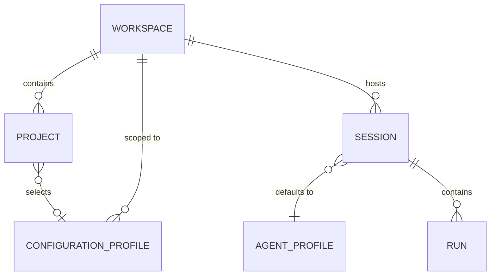
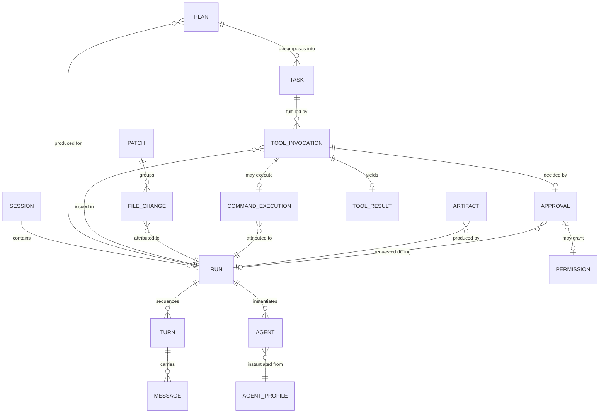
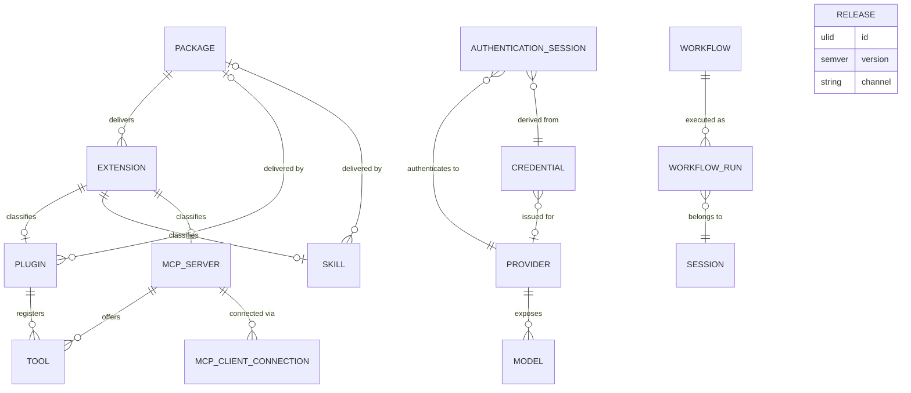

# 01 — Overview, Modeling Approach, and Aggregates

## Modeling approach

The domain model is the vocabulary the rest of the corpus is written in. Volume 2 defines the
**shape** of every domain entity — attributes, identifiers, relations, invariants, canonical
state names, persistence, and serialization — while behavior over those entities (state machine
transitions, algorithms, policies) belongs to the owning volumes per the single-home matrix
(Volume 0, chapter 03). The model follows five rules:

1. **Entities before behavior.** Every entity in the Volume 0 glossary's "Domain entities"
   table is defined here, under exactly its glossary name, before any volume specifies behavior
   over it. A volume MUST NOT introduce a new domain entity without adding it to this volume
   and the glossary through the change procedure.
2. **Aggregates are consistency boundaries.** Entities are grouped into aggregates. All
   invariants that span multiple entities inside one aggregate MUST be enforced within a single
   Persistence Layer transaction. Invariants that span aggregates are reconciled asynchronously
   (typically via Event records per ADR-012) and are stated as invariants of the referencing
   entity.
3. **Cross-aggregate references are by identifier only.** An entity MUST reference an entity
   in another aggregate only by its identifier (plus denormalized snapshot fields where this
   volume explicitly says so). No aggregate embeds another aggregate's rows.
4. **Records are immutable.** Entities classified as *record* entities below are append-only:
   once written, their attribute values MUST NOT change, with the sole exceptions of redaction
   (Volume 9) and retention/pruning (Volumes 7, 9, 10). Mutation of history is a defect.
5. **The Core Domain is vendor-agnostic.** No entity carries provider-specific fields. Where
   a provider adapter needs private data, the entity offers a single opaque `adapter_metadata`
   JSON attribute whose content is owned by the adapter and is never interpreted by the Core
   Domain (Volume 1, Principle 1).

## Entity classification

The 43 entities fall into four structural classes. The class determines mutability,
persistence style, and how the entity participates in aggregates.

| Class | Meaning | Entities |
|---|---|---|
| Catalog | Long-lived, mutable, registry-style rows with unique natural keys; updated in place with a `revision` counter | Workspace, Project, Configuration Profile, Agent Profile, Tool, Provider, Model, Credential, Workflow, Skill, Plugin, MCP Server, Package, Extension, Release |
| Execution | Created during runs/sessions, driven by a state machine or recorded status, then frozen at terminal state | Session, Agent, Run, Turn, Plan, Task, Tool Invocation, Workflow Run, MCP Client Connection, Authentication Session, Index, Command Execution, Patch |
| Record | Append-only, immutable once written | Message, Tool Result, Approval, Permission, Artifact, File Change, Memory Record, Context Item, Embedding, Event, Trace, Metric, Cost Record, Audit Record |
| Value | Closed vocabularies or derived values with no independent identity or table of their own | Capability |

Notes on the classification:

- Permission rows are records in the sense that a grant is never edited: revocation appends
  revocation fields (`revoked_at`, `revoked_by`) rather than deleting or rewriting the grant.
- Metric is definitional (name, type, unit); metric *samples* are runtime data whose storage
  and export are owned by Volume 10.
- Capability is a closed enum minted by Volume 5; it appears in the model only as string
  values inside capability sets.

## Aggregate map

An aggregate is named after its root. The table below assigns every entity to exactly one
aggregate. "Key roots" per this volume's mandate are **Workspace**, **Session**, and **Run**;
the remaining roots follow from lifetime and consistency analysis: an entity is a member of an
aggregate only if it cannot outlive the root and its invariants are enforced together with the
root's.

| Aggregate (root) | Members | Boundary rationale |
|---|---|---|
| Workspace | Workspace, Project, Configuration Profile (workspace/project scope) | Projects and workspace-scoped profiles cannot outlive the workspace; uniqueness invariants are workspace-wide |
| Session | Session | Sessions reference their Workspace and Agent Profile by ID; runs are deliberately outside (a Run's records are written far more often than the Session row, and recovery treats runs independently) |
| Run | Run, Agent, Turn, Message, Plan, Task, Tool Invocation, Tool Result, File Change, Patch, Command Execution, Artifact, Context Item | The complete causal record of one execution; all ordering and attribution invariants are internal to one run and are committed transactionally as the run progresses |
| Agent Profile | Agent Profile | Versioned catalog entries referenced by Sessions, Agents, and Workflows; versions are immutable, so they cannot sit inside the mutable Session or Run boundaries |
| Approval | Approval | Immutable decision record; may concern subjects in several aggregates (tool invocations, workflow gates, plans), so it stands alone and references its subject by kind + ID |
| Permission | Permission | Grants outlive runs and sessions (scope up to `global`); Volume 9 owns decision semantics |
| Tool | Tool | Registry entry keyed by (name, version, origin); tools outlive any run and may outlive their providing Plugin process |
| Provider | Provider, Model | Models cannot outlive their provider entry; capability declarations are validated against the provider adapter as one unit |
| Credential | Credential, Authentication Session | An Authentication Session is derived from exactly one Credential and dies with it; both store only references into the Secret Store |
| Workflow | Workflow | Versioned definition catalog |
| Workflow Run | Workflow Run | Execution state of one workflow instance; references the Runs it spawns by ID (Runs are their own aggregates) |
| Skill | Skill | Versioned catalog entry |
| Plugin | Plugin | Registry + runtime state of one plugin; the Tools it registers live in the Tool aggregate with `origin_ref` back-references |
| MCP Server | MCP Server, MCP Client Connection | Connections are runtime children of one server entry and cannot outlive it |
| Package | Package | Distributable unit with installation state |
| Extension | Extension | Umbrella registry record unifying third-party additions; concrete rows (Plugin, Skill, MCP Server, …) back-reference it |
| Release | Release | Published distribution records known to the Updater |
| Memory Record | Memory Record | Independent records with their own provenance and retention; grouping them under Session/Workspace would couple retention to unrelated lifecycles |
| Index | Index, Embedding | Embeddings are meaningless outside their index's embedding space and are invalidated with it |
| Event | Event | Append-only stream row |
| Trace | Trace | One correlated tree per run; spans are storage details of the Trace (not catalog entities) |
| Metric | Metric | Definitional registry of metric names |
| Cost Record | Cost Record | Append-only accounting rows |
| Audit Record | Audit Record | Append-only, hash-chained; must not share a consistency boundary with anything mutable |

Rules that follow from the map:

1. Deleting an aggregate root deletes (or tombstones, where retention says so) its members and
   nothing else. Foreign-key actions in chapter 10 implement exactly this.
2. A transaction MUST NOT span two aggregates except where chapter 10 explicitly allows a
   same-database, same-commit append of Record entities (e.g., writing a Tool Result and its
   Event in one commit) — appends cannot violate another aggregate's invariants.
3. State enums (chapter 09) attach only to aggregate roots and execution members; Record
   entities have no state machine by construction.

## Domain views

Three views cover the model, clustered by area. Diagrams follow the Volume 0 rule: each is
accompanied by prose stating components, relations, and constraints. Attribute lists are
omitted from the diagrams — chapters 02–08 are authoritative for attributes.

### View 1 — Workspace and session cluster

Components: Workspace, Project, Configuration Profile, Session, Agent Profile, and the edge
into Run (detailed in View 2). Relations and constraints:

- A Workspace contains zero or more Projects; a Project belongs to exactly one Workspace and
  its root path lies inside the workspace root (INV-PRJ-02, chapter 02).
- A Workspace hosts zero or more Sessions; a Session belongs to exactly one Workspace
  (INV-SES-01, chapter 03). A Session optionally pins one Project as its focus.
- Configuration Profiles shown here are workspace-scoped; global-scope profiles exist too and
  live in the global database (chapter 10) with no Workspace edge. A Project may select at
  most one Configuration Profile as its default.
- A Session records exactly one default Agent Profile (the profile actually used by each agent
  instance is snapshotted per Agent, View 2). Agent Profiles are workspace- or global-scoped
  catalog entries.
- A Session contains zero or more Runs; Runs never migrate between Sessions.

### View 2 — Execution cluster

Components: the Run aggregate (Run, Agent, Turn, Message, Plan, Task, Tool Invocation, Tool
Result, File Change, Patch, Command Execution, Artifact) plus the standalone Approval and
Permission aggregates. Relations and constraints:

- A Run belongs to exactly one Session and sequences zero or more Turns; each Turn carries
  one or more Messages. Ordering inside a run is authoritative via `sequence_no` fields, not
  via identifier sort order (see [Identifier strategy](#identifier-strategy)).
- A Run instantiates one or more Agents (the root agent plus any delegated agents); each Agent
  is instantiated from exactly one Agent Profile version, snapshotted at instantiation
  (INV-AG-03, chapter 03).
- A Run has zero or more Plans (versions); each Plan decomposes into Tasks whose dependency
  graph is acyclic (INV-TASK-02). At most one Plan per run is non-terminal at any time
  (INV-PLAN-02).
- Tasks are fulfilled by Tool Invocations; every Tool Invocation belongs to exactly one Run
  and references the Tool it calls by ID plus a name/version snapshot (the Tool aggregate is in
  View 3). A Tool Invocation yields at most one Tool Result and, when it runs a terminal
  command, exactly one Command Execution record.
- A Tool Invocation that requires interactive consent is decided by at most one Approval; an
  Approval may additionally mint a standing Permission grant (Volume 9 semantics). Approvals
  can also exist outside runs (e.g., workflow gates), hence the optional Run edge.
- File Changes are attributed to exactly one Run (and to the Tool Invocation that produced
  them); a Patch groups one or more File Changes into a reviewable diff. Artifacts are durable
  outputs attributed to exactly one Run.

### View 3 — Extensibility and provider cluster

Components: the distribution chain (Package, Extension, Release), the extension surfaces
(Plugin, Skill, MCP Server, MCP Client Connection, Tool), the provider chain (Provider, Model,
Credential, Authentication Session), and workflows (Workflow, Workflow Run). Relations and
constraints:

- A Package delivers one or more Extensions; each Extension classifies exactly one concrete
  unit (a Plugin, Skill, MCP Server registration, provider adapter, or other kind from the
  closed vocabulary owned by Volume 6). Plugins and Skills installed from packages
  back-reference their Package; workspace-authored ones have no Package.
- A Plugin registers zero or more Tools; an MCP Server offers zero or more Tools. Tool rows
  carry `origin` (`builtin`, `plugin`, `mcp`) and `origin_ref` so that tool citizenship is
  uniform while provenance stays visible (Volume 1, Principle 4).
- An MCP Server is reached through MCP Client Connections — runtime children with their own
  canonical state machine (chapter 09, owned by Volume 6).
- A Provider exposes zero or more Models; capability sets on both are values from the closed
  Capability enum (Volume 5). Credentials MAY be scoped to one Provider or shared across
  services; an Authentication Session is derived from exactly one Credential and targets
  exactly one Provider. Neither Credential nor Authentication Session ever stores secret
  material — only Secret Store references (INV-CRED-01, INV-AUTHS-02, chapter 05).
- A Workflow (versioned definition) is executed as Workflow Runs; each Workflow Run belongs to
  one Session and references the Runs it spawns by ID.
- Release stands alone in this view: it records published Andromeda distributions known to the
  Updater (Volume 14). Extension packages are versioned independently of product Releases.

Memory/context/indexing and observability/accounting have their own views in chapters
[07](07-memory-context-and-indexing.md) and [08](08-observability-and-accounting.md).

## Identifier strategy

Decided by [ADR-027](../annexes/adr/ADR-027.md): **every persisted domain entity row has a
ULID surrogate primary key.**

A ULID (Universally Unique Lexicographically Sortable Identifier) is a 128-bit identifier — a
48-bit millisecond Unix timestamp followed by 80 bits of randomness — whose canonical text form
is 26 characters of Crockford base32. The choice, justified in full in ADR-027:

- **Collision-free without coordination.** 80 random bits per millisecond allow independent
  processes (Runtime, CLI, plugins via the Runtime) to mint IDs with no central sequence —
  required because workspace databases are created offline and merged records (exports,
  bug reports) must not collide.
- **Time-ordered.** ULIDs sort lexicographically by creation time, which keeps SQLite B-tree
  inserts append-mostly for the write-heavy Record tables (events, messages, audit records)
  and makes ID ranges usable for coarse time filtering.
- **Compact and terminal-friendly.** 26 characters, case-insensitive alphabet without
  ambiguous symbols — usable in CLI output, log lines, and file names (unlike 36-char UUID
  hex-and-dash forms).

Binding rules (normative here; restated as decision rules in ADR-027):

1. The canonical textual form is the 26-character **uppercase** Crockford base32 string.
   Identifiers MUST be stored, serialized, and displayed in this form; comparisons are exact
   string comparisons. Parsers MUST accept lowercase input and normalize to uppercase.
2. Identifiers MUST be minted through one monotonic ULID source per process (monotonicity
   within the same millisecond), so that IDs minted by one process never sort against
   insertion order.
3. ULID timestamp ordering is *approximate* across processes and machines. Wherever ordering
   is semantically load-bearing — turns in a run, messages in a turn, tasks in a plan, events
   in a stream — the entity carries an explicit `sequence_no` (or the table's insertion
   rowid, chapter 10) and that field is authoritative. An implementation MUST NOT use ULID
   sort order as the sole ordering authority.
4. ULIDs are identifiers, not authorization tokens and not secrets. Possession of an ID grants
   nothing; every access decision goes through the Permission Manager (Volume 9). IDs MAY
   appear in logs and telemetry (they reveal creation time only).
5. ULIDs are never reused, never re-minted for the same logical entity, and never carry
   semantics beyond identity and creation-time ordering. Entity kind is conveyed by context
   (table, field name, envelope), not by the ID itself; the model deliberately uses **no
   type prefixes** so IDs remain fixed-width and format-uniform corpus-wide.

### Natural keys and external identifiers

Surrogate ULIDs coexist with two other identifier classes:

- **Natural keys** — human-meaningful unique names enforced as unique constraints, never as
  primary keys (they can be renamed; ULIDs cannot): e.g., Provider `slug`, Tool
  `(name, version, origin_ref)`, Agent Profile `(name, version, scope)`, Configuration Profile
  `(name, scope)`, Package `(name, version, scope)`, Release `version`.
- **External identifiers** — values minted outside Andromeda and stored verbatim as opaque
  strings: VCS commit hashes, provider model names, MCP protocol session identifiers, OS
  process IDs. External identifiers MUST NOT be primary keys and MUST NOT be assumed stable
  or unique beyond what their issuing system guarantees.

## Attribute type vocabulary

Attribute tables in chapters 02–08 use this closed type vocabulary. Chapter 10 maps each type
to its SQLite storage class and serialized JSON form.

| Type | Meaning |
|---|---|
| `ulid` | 26-character canonical ULID string (ADR-027) |
| `string` | Short UTF-8 text (names, slugs, labels) |
| `text` | Unbounded UTF-8 text |
| `integer` | 64-bit signed integer |
| `boolean` | True/false |
| `timestamp` | UTC instant, RFC 3339 with millisecond precision and `Z` suffix (e.g., `2026-07-11T08:30:00.000Z`) |
| `duration_ms` | Non-negative integer milliseconds |
| `enum` | Value from a closed vocabulary; the entity section names the vocabulary and its owner |
| `json` | Canonical JSON document (chapter 10 serialization rules) |
| `blob` | Opaque binary |
| `semver` | Semantic version string (`MAJOR.MINOR.PATCH` with optional pre-release/build) |
| `hash` | Lowercase hex SHA-256 digest |
| `path` | Filesystem path; absolute unless stated relative to a named root |

Money is never a type of its own: monetary amounts are stored as `integer` micro-units plus an
ISO 4217 currency code (see Cost Record, chapter 08), never as floating point.

## Entity section template

Chapters 02–08 describe every entity with the same structure:

- **Purpose** — one or two sentences; consistent with the glossary one-liner.
- **Attributes** — table: attribute, type, required, meaning. Every persisted entity includes
  `id (ulid)` and `created_at (timestamp)`; Catalog and Execution entities additionally include
  `updated_at (timestamp)` and `revision (integer)` — a per-row optimistic-concurrency counter
  incremented on every committed update (this is row versioning, distinct from the
  serialization `schema_version` of chapter 10 and from semantic `version` attributes).
- **Identifiers** — primary key, natural keys, relevant external identifiers.
- **Relations** — cardinalities and target entities.
- **Integrity invariants** — numbered list labeled `INV-<EntityAbbrev>-NN`. These are
  chapter-local labels (like Volume 1's `UC-NN`), not corpus identifiers; other volumes
  reference them by volume + label.
- **Lifecycle** — pointer into chapter 09 for stateful entities, or the words "stateless" /
  "immutable record" with the recorded-status vocabulary where one exists.
- **Persistence** — database (workspace or global, per ADR-028), table name, retention
  pointer.
- **Versioning and serialization** — what "version" means for the entity and any
  serialization notes beyond the chapter 10 defaults.
