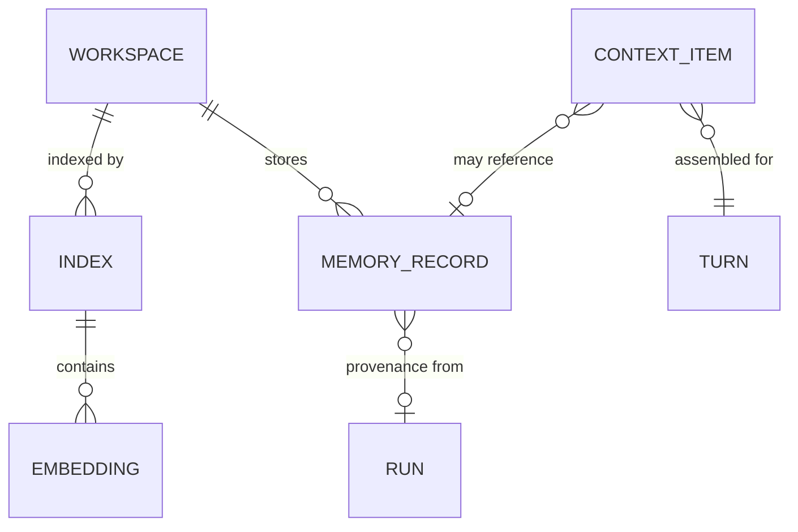

# 07 — Memory, Context, and Indexing

This chapter defines the knowledge-side aggregates: **Memory Record**, **Context Item** (a Run
aggregate member), and **Index** with **Embedding**. Memory taxonomy, ingestion, retrieval,
expiry, context selection and budgeting, and index construction are owned by Volume 7; this
chapter fixes the shapes those behaviors operate on.

## Cluster view

Components and constraints: a Workspace stores memory records (session- and workspace-layer;
long-term global memory lives in the global database and has no Workspace edge) and is covered
by one or more Indexes; an Index contains Embeddings bound to its embedding space. Context
Items belong to exactly one Turn (Run aggregate) and may reference the Memory Record, file, or
index entry they were drawn from; Memory Records carry provenance to the Run (and Message)
they were learned from, when machine-produced.

## Memory Record

Purpose: a persisted unit of memory — session, workspace, or long-term; episodic or semantic —
with provenance and retention.

### Attributes

| Attribute | Type | Required | Meaning |
|---|---|---|---|
| `id` | `ulid` | yes | Primary key |
| `layer` | `enum` | yes | `session` \| `workspace` \| `long_term` (storage/visibility layer; semantics owned by Volume 7) |
| `kind` | `enum` | yes | Memory kind (e.g., `episodic`, `semantic`, `procedural`); closed vocabulary owned by Volume 7 |
| `workspace_id` | `ulid` | conditional | Required for `session` and `workspace` layers; absent for `long_term` (global) |
| `session_id` | `ulid` | conditional | Required for `session` layer |
| `content` | `text` | yes | The remembered content (post-redaction) |
| `structured` | `json` | no | Structured projection of the content, when the kind defines one |
| `source_kind` | `enum` | yes | `user` \| `agent` \| `system`; who produced the memory |
| `source_run_id` | `ulid` | conditional | Provenance Run; required when `source_kind = agent` |
| `source_message_id` | `ulid` | no | Provenance Message, when derivable |
| `importance` | `integer` | no | Retrieval weighting hint (scale owned by Volume 7) |
| `embedding_id` | `ulid` | no | Embedding of this record in a semantic index, when indexed |
| `status` | `enum` | yes | Recorded status: `active` \| `archived` \| `expired` \| `deleted` (chapter 09 recorded vocabulary) |
| `last_accessed_at` | `timestamp` | no | Last retrieval that used this record |
| `expires_at` | `timestamp` | no | Scheduled expiry per retention policy |
| `created_at` | `timestamp` | yes | Creation instant |
| `updated_at` | `timestamp` | yes | Last committed change (status/access fields only) |
| `revision` | `integer` | yes | Optimistic-concurrency counter |

### Identifiers

- Primary key: `id`.

### Relations

- Scoped to at most one **Workspace** and **Session** per layer rules.
- Provenance references to **Run** / **Message**; optionally embedded via one **Embedding**.
- Referenced by **Context Item** rows that surfaced it into requests.

### Integrity invariants

1. **INV-MEM-01** — Layer/scope consistency: `session` layer requires `session_id` and
   `workspace_id`; `workspace` layer requires `workspace_id` only; `long_term` requires
   neither (INV-CFGP-03 pattern).
2. **INV-MEM-02** — Agent-produced memory MUST carry provenance (`source_run_id`); memory of
   unknown origin is inadmissible (PRD-006 — the user can always ask "why do you believe
   this?").
3. **INV-MEM-03** — `content` MUST pass Volume 9 redaction before persistence; secrets and
   credential material MUST NOT be remembered, in any layer, under any configuration.
4. **INV-MEM-04** — `deleted` is a terminal recorded status: user-initiated deletion of a
   memory MUST prevent any further retrieval, including from index copies (cascade to
   Embedding; Volume 7 owns the purge procedure).
5. **INV-MEM-05** — Memory content is immutable; correcting a memory writes a new record
   superseding the old (supersession semantics owned by Volume 7).

### Lifecycle

Immutable record with recorded status (`active`, `archived`, `expired`, `deleted`); retention
and expiry policies owned by Volume 7 (with Volume 10 storage limits).

### Persistence

`session`/`workspace` layers: workspace database, table `memory_records`. `long_term` layer:
global database, same table name. Retention: per-layer policies in Volume 7.

### Versioning and serialization

Row versioning via `revision` (status fields only). Exports as canonical JSON with provenance
IDs; content is exportable only through Volume 9 redaction gates.

## Context Item

Purpose: one candidate unit of content assembled into a model request by the Context Manager —
persisted per turn so that any request can be answered with "exactly this went to the model"
(PRD-006, SM-12).

### Attributes

| Attribute | Type | Required | Meaning |
|---|---|---|---|
| `id` | `ulid` | yes | Primary key |
| `turn_id` | `ulid` | yes | Turn whose request this item was considered for |
| `run_id` | `ulid` | yes | Owning Run (denormalized) |
| `source_kind` | `enum` | yes | `message` \| `memory` \| `file` \| `index_result` \| `tool_result` \| `skill` \| `system_prompt` (closed; owned by Volume 7) |
| `source_ref` | `string` | yes | Identifier of the source: entity ULID, or workspace-relative path + content hash for files |
| `content_hash` | `hash` | yes | SHA-256 of the exact content considered (content itself is stored once at its source, not duplicated here) |
| `token_count` | `integer` | yes | Tokens this item cost in the request encoding |
| `score` | `json` | no | Selection scoring detail (ranking factors; scheme owned by Volume 7) |
| `included` | `boolean` | yes | Whether the item made it into the final request (candidates that lost budgeting are recorded with `included = false`) |
| `position` | `integer` | conditional | Order within the assembled request; required when `included` |
| `created_at` | `timestamp` | yes | Creation instant |

### Identifiers

- Primary key: `id`.

### Relations

- Belongs to exactly one **Turn** (Run aggregate member).
- References its source (**Message**, **Memory Record**, **Tool Result**, **Index** entry,
  **Skill**, or file) via `source_kind` + `source_ref`.

### Integrity invariants

1. **INV-CTXI-01** — A Context Item MUST belong to exactly one Turn; `run_id` MUST match the
   turn's run.
2. **INV-CTXI-02** — For every included item, `content_hash` MUST identify the exact bytes
   sent, so the request is reconstructible from sources + hashes (replay, SM-12).
3. **INV-CTXI-03** — `position` MUST be present and unique per turn among `included` items;
   excluded candidates carry no position.
4. **INV-CTXI-04** — Context Items record; they never own content. Deleting a source (e.g., a
   Memory Record purge) leaves the hash as a tombstone reference — the record that *something*
   was sent survives, its content does not (privacy precedence, Volume 0 chapter 01).

### Lifecycle

Immutable record.

### Persistence

Workspace database, table `context_items`. Retention: with the owning run; Volume 10 MAY
prune excluded-candidate rows earlier than included ones (they are diagnostic, not audit).

### Versioning and serialization

No `revision`. Serializes in the run record stream.

## Index

Purpose: a queryable structure over workspace content — lexical or semantic — built and
incrementally updated by the Indexing Engine.

### Attributes

| Attribute | Type | Required | Meaning |
|---|---|---|---|
| `id` | `ulid` | yes | Primary key |
| `workspace_id` | `ulid` | yes | Indexed Workspace |
| `name` | `string` | yes | Index name; unique per workspace |
| `kind` | `enum` | yes | `lexical` \| `semantic` (closed; owned by Volume 7) |
| `state` | `enum` | yes | Canonical Index state (chapter 09) |
| `scope_config` | `json` | yes | Include/exclude rules over workspace paths (respecting ignore files; rules owned by Volume 7) |
| `embedding_space` | `json` | conditional | For `semantic`: provider slug, model name, dimensions, encoding parameters — fixed for the index's lifetime (INV-IDX-03) |
| `index_schema_version` | `integer` | yes | Version of the index's internal layout (Volume 7 owns layout migrations = rebuilds) |
| `document_count` | `integer` | yes | Indexed documents (cached statistic) |
| `size_bytes` | `integer` | yes | On-disk size (cached statistic) |
| `built_at` | `timestamp` | no | Last full build completion |
| `last_updated_at` | `timestamp` | no | Last incremental update |
| `last_error` | `json` | no | Last failure summary |
| `created_at` | `timestamp` | yes | Creation instant |
| `updated_at` | `timestamp` | yes | Last committed change |
| `revision` | `integer` | yes | Optimistic-concurrency counter |

### Identifiers

- Primary key: `id`. Natural key: `(workspace_id, name)` unique.

### Relations

- Belongs to exactly one **Workspace**; contains 0..n **Embedding** (semantic kind).
- Query results surface as **Context Item** rows (`source_kind = index_result`).

### Integrity invariants

1. **INV-IDX-01** — `(workspace_id, name)` MUST be unique.
2. **INV-IDX-02** — An Index is a rebuildable cache: destroying index data MUST NOT lose any
   authoritative state, and a full rebuild from workspace content MUST be possible at any time
   (this is what licenses its relaxed durability in chapter 10).
3. **INV-IDX-03** — A semantic Index's `embedding_space` is immutable: changing the embedding
   model or dimensions creates a *new* Index (embeddings from different spaces are not
   comparable; Principle 2 applies to embedding models too).
4. **INV-IDX-04** — Index building and querying MUST work fully offline when the embedding
   provider is local, and lexical indexes always (offline guarantee list, Volume 1).

### Lifecycle

Stateful — canonical states `created`, `building`, `ready`, `updating`, `stale`, `failed`,
`removed` (chapter 09); full machine owned by Volume 7.

### Persistence

Metadata: workspace database, table `content_indexes`. Index *data* (posting lists, vectors)
lives in the index cache database `.andromeda/index.db` — a non-authoritative cache per
ADR-028, excluded from the durability guarantees of `state.db` and rebuildable per INV-IDX-02.
Retention: caches may be dropped at any time; metadata rows until index removal.

### Versioning and serialization

`index_schema_version` governs layout compatibility: a layout change triggers rebuild, never
in-place migration (Volume 7). Index data is never exported; only metadata serializes.

## Embedding

Purpose: a vector representation of content used by semantic indexing and retrieval.

### Attributes

| Attribute | Type | Required | Meaning |
|---|---|---|---|
| `id` | `ulid` | yes | Primary key |
| `index_id` | `ulid` | yes | Owning Index |
| `source_kind` | `enum` | yes | `file_chunk` \| `memory_record` (closed; owned by Volume 7) |
| `source_ref` | `string` | yes | Workspace-relative path + chunk locator, or Memory Record ULID |
| `content_hash` | `hash` | yes | SHA-256 of the embedded content (staleness detection) |
| `vector` | `blob` | yes | The vector, encoded per the index's `embedding_space` |
| `dimensions` | `integer` | yes | Vector dimensionality; MUST equal the index's declared dimensions |
| `created_at` | `timestamp` | yes | Creation instant |

### Identifiers

- Primary key: `id`. Natural key: `(index_id, source_kind, source_ref)` unique — one current
  vector per source per index.

### Relations

- Belongs to exactly one **Index** (aggregate member); references its source content by
  locator + hash.

### Integrity invariants

1. **INV-EMB-01** — `dimensions` MUST equal the owning Index's `embedding_space` dimensions;
   vectors from other spaces are unrepresentable rows.
2. **INV-EMB-02** — An Embedding whose `content_hash` no longer matches its source is stale
   and MUST be excluded from retrieval until re-embedded (staleness sweep owned by Volume 7).
3. **INV-EMB-03** — Purging a Memory Record (INV-MEM-04) MUST delete its Embeddings in the
   same maintenance pass; embeddings are derived data and never outlive their source's
   deletion.
4. **INV-EMB-04** — Embeddings are immutable: re-embedding replaces the row.

### Lifecycle

Immutable record (replaced, not mutated).

### Persistence

Index cache database `.andromeda/index.db`, table `embeddings` (non-authoritative cache,
with its owning index's data). Retention: with the index; dropped on rebuild.

### Versioning and serialization

No `revision`. Never exported; vectors are derived data reproducible from sources plus the
recorded embedding space.
