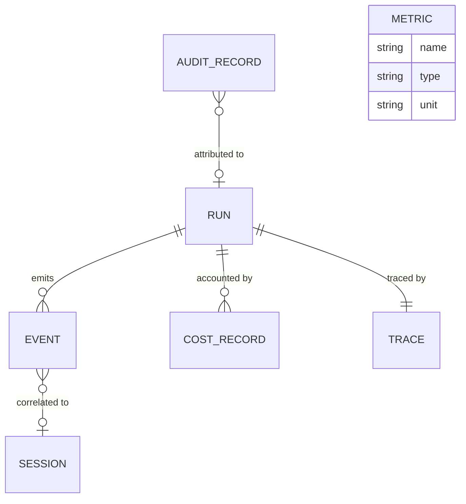

# 08 — Observability and Accounting

This chapter defines the record aggregates that make Andromeda observable by default
(Principle 9) and transparent (PRD-006): **Event**, **Trace**, **Metric**, **Cost Record**,
and **Audit Record**. The event envelope, delivery semantics, logging, export, and telemetry
consent are owned by Volume 10; audit semantics by Volume 9; each area volume mints its own
event names and payloads (Volume 0, chapter 03). All five entities are records: append-only,
immutable, local-first.

## Cluster view

Components and constraints: every Run emits Events and is described by exactly one Trace; Cost
Records attribute token/spend accounting to their Run. Audit Records are attributed to a Run
when the audited action happened inside one (global actions — credential changes, installs —
have no Run edge). Events carry correlation identifiers up the chain (session, workspace) even
when not run-bound. Metric stands alone as a definitional registry (name, type, unit); metric
samples are runtime data, not catalog rows.

## Event

Purpose: a structured, versioned occurrence emitted on the event bus (ADR-012) and persisted
locally — the primary integration point between subsystems and the source of the user-visible
activity record.

### Attributes

| Attribute | Type | Required | Meaning |
|---|---|---|---|
| `id` | `ulid` | yes | Primary key; also the event's global ordering hint |
| `name` | `string` | yes | Event name in `<area>.<noun>.<verb-past>` form (e.g., `run.completed`, `tool.invocation.denied`); names minted by area owners (Volume 0, chapter 03) |
| `schema_version` | `integer` | yes | Version of this event name's payload schema |
| `occurred_at` | `timestamp` | yes | When the occurrence happened |
| `producer` | `string` | yes | Emitting component (Volume 3 component names) |
| `workspace_id` | `ulid` | no | Correlation: workspace |
| `session_id` | `ulid` | no | Correlation: session |
| `run_id` | `ulid` | no | Correlation: run |
| `turn_id` | `ulid` | no | Correlation: turn |
| `task_id` | `ulid` | no | Correlation: task |
| `tool_invocation_id` | `ulid` | no | Correlation: tool invocation |
| `trace_id` | `ulid` | no | Correlation: trace |
| `payload` | `json` | yes | Event payload, redacted per Volume 9; schema owned by the minting area |
| `created_at` | `timestamp` | yes | Persistence instant |

### Identifiers

- Primary key: `id`. The full envelope (delivery, ordering, retention fields beyond this
  entity) is owned by Volume 10; this row is the persisted projection.

### Relations

- Correlated (all optional) to **Workspace**, **Session**, **Run**, **Turn**, **Task**,
  **Tool Invocation**, **Trace** by ID.

### Integrity invariants

1. **INV-EVT-01** — `name` MUST be a registered event name of its area owner; free-form names
   are rejected at emission (registration mechanics in Volume 10).
2. **INV-EVT-02** — Events are immutable and append-only; correction is a new event, never an
   edit.
3. **INV-EVT-03** — A run-scoped event (any lifecycle or action event of chapter 09 machines
   inside a run) MUST carry `run_id`; every state transition of a canonical machine emits at
   least one event (Principle 9; per-machine event lists owned by the machine's volume).
4. **INV-EVT-04** — `payload` MUST be redacted before persistence: no secret material, no
   environment values, no un-redacted file content beyond Volume 9 limits.
5. **INV-EVT-05** — Quiet and non-interactive modes MUST NOT suppress event persistence —
   presentation may be reduced, the record may not (Volume 1, non-goal 9).

### Lifecycle

Immutable record.

### Persistence

Workspace database, table `events`, for workspace-context events; global database, same
table, for machine-level events (installs, credential changes, updates). Retention: Volume 10
policies (age/size), with INV-AUD-04 keeping audit-relevant facts beyond event pruning.

### Versioning and serialization

`schema_version` versions each event name's payload independently. Events serialize as
canonical JSON and are the unit of streaming export (JSONL, Volume 10).

## Trace

Purpose: a correlated tree of spans describing one run's execution across components — the
navigational spine that links turns, tool invocations, and provider requests into one
inspectable timeline.

### Attributes

| Attribute | Type | Required | Meaning |
|---|---|---|---|
| `id` | `ulid` | yes | Primary key; the run's trace/correlation identifier |
| `run_id` | `ulid` | yes | The Run this trace describes (unique — 1:1) |
| `root_span_id` | `ulid` | yes | Root span of the tree |
| `status` | `enum` | yes | Recorded outcome mirror: `ok` \| `error` \| `interrupted` (mirrors the run's terminal family) |
| `started_at` | `timestamp` | yes | First span start |
| `ended_at` | `timestamp` | no | Last span end |
| `span_count` | `integer` | yes | Cached span count |
| `created_at` | `timestamp` | yes | Creation instant |

Spans are storage rows of the Trace aggregate (table `trace_spans`: `id`, `trace_id`,
`parent_span_id`, `name`, `component`, `started_at`, `ended_at`, `status`, `attributes` JSON),
not separate catalog entities; their semantics and naming are owned by Volume 10.

### Identifiers

- Primary key: `id`. Natural key: `run_id` unique. `trace_id` is the correlation value that
  Events, log lines, and error reports carry (Principle 9: every error carries a correlation
  ID).

### Relations

- Describes exactly one **Run**; contains 1..n spans; referenced by **Event** rows via
  `trace_id`.

### Integrity invariants

1. **INV-TRC-01** — Exactly one Trace exists per Run (created with the run, closed at its
   terminal transition).
2. **INV-TRC-02** — Span parentage MUST form a tree rooted at `root_span_id`: acyclic, single
   root, every span reachable from the root.
3. **INV-TRC-03** — Spans MUST NOT contain payload data beyond redacted summary attributes;
   bulk data belongs to Tool Results and Artifacts, spans carry references (size discipline;
   limits owned by Volume 10).
4. **INV-TRC-04** — Traces and spans are immutable once their `ended_at` is written.

### Lifecycle

Immutable record (open spans complete; nothing is rewritten).

### Persistence

Workspace database, tables `traces` and `trace_spans`. Retention: Volume 10 policy; traces
prune with or before their run.

### Versioning and serialization

Span `attributes` carry `schema_version` per span name where structured. Export format
(including mapping to external tracing systems) is owned by Volume 10 — the persisted model is
this local shape, not any external protocol's.

## Metric

Purpose: a named quantitative measurement emitted by the runtime. The entity is the
*definition* — name, type, unit, labels; samples are runtime data handled by Volume 10
(aggregation, export, consent).

### Attributes

| Attribute | Type | Required | Meaning |
|---|---|---|---|
| `name` | `string` | yes | Metric name in `<area>.<noun>.<unit-suffix>` style; naming grammar and registry owned by Volume 10 |
| `type` | `enum` | yes | `counter` \| `gauge` \| `histogram` |
| `unit` | `string` | yes | Unit of measure (e.g., `ms`, `bytes`, `tokens`, `1`) |
| `label_keys` | `json` | yes | Allowed label keys (bounded cardinality; limits owned by Volume 10) |
| `description` | `text` | yes | What the metric measures and how to interpret it |
| `owner_area` | `string` | yes | Area code that mints and documents the metric |

### Identifiers

- `name` is the identity. Definitions ship in code with the registry in Volume 10; there is
  no ULID and no definition table.

### Relations

- Samples correlate to **Run**/**Session** via labels where the definition says so; label
  values reference entities by ULID.

### Integrity invariants

1. **INV-MET-01** — Metric names form a closed registry: emission of an unregistered name is
   a defect (registry mechanics in Volume 10).
2. **INV-MET-02** — A metric definition's `type` and `unit` never change; a semantic change
   mints a new name (old name DEPRECATED per Volume 0 rules).
3. **INV-MET-03** — Label values MUST be low-cardinality identifiers or enums — never
   free-form text, paths, or user content (privacy and storage discipline; Volume 10
   enforces).

### Lifecycle

Stateless definition.

### Persistence

Definitions in code; sample persistence (if any beyond in-memory aggregation) and export are
owned by Volume 10 (table `metric_points` in the workspace database when local persistence is
enabled). Retention: Volume 10.

### Versioning and serialization

Definitions version with the Volume 10 metric registry. Samples serialize per the export
target's contract (Volume 10); the model imposes only the definition shape.

## Cost Record

Purpose: an accounting entry for tokens and spend attributed to a run, provider, and model —
the ground truth behind "what did this cost?" (Principle 7).

### Attributes

| Attribute | Type | Required | Meaning |
|---|---|---|---|
| `id` | `ulid` | yes | Primary key |
| `run_id` | `ulid` | yes | Attributed Run |
| `turn_id` | `ulid` | no | Attributed Turn, when the entry maps to a single request |
| `provider_slug` | `string` | yes | Provider snapshot at time of use |
| `model_name` | `string` | yes | Model snapshot at time of use |
| `input_tokens` | `integer` | yes | Prompt tokens (official provider accounting) |
| `output_tokens` | `integer` | yes | Completion tokens |
| `cached_tokens` | `integer` | no | Cache-served tokens, when the provider reports them |
| `reasoning_tokens` | `integer` | no | Reasoning tokens, when officially reported (Principle 7) |
| `cost_micros` | `integer` | no | Cost in micro-units of `currency` |
| `currency` | `string` | conditional | ISO 4217 code; required when `cost_micros` present |
| `cost_basis` | `enum` | yes | `actual` \| `estimated` \| `unavailable` — whether cost came from provider accounting, local pricing tables (Model `pricing`), or could not be determined |
| `created_at` | `timestamp` | yes | Creation instant |

### Identifiers

- Primary key: `id`.

### Relations

- Attributed to exactly one **Run**, optionally one **Turn**; snapshots **Provider**/**Model**
  identity by slug/name.

### Integrity invariants

1. **INV-COST-01** — Token counts MUST come from official provider usage data; when a
   provider reports none, the record carries what is known and `cost_basis = unavailable` —
   Andromeda MUST NOT fabricate counts (Principle 7: actual cost *when determinable*).
2. **INV-COST-02** — Monetary amounts are integer micro-units plus currency; floating-point
   money is unrepresentable in the model.
3. **INV-COST-03** — `cost_basis` MUST be honest: estimates from local pricing tables are
   never presented as actuals (presentation rules in Volume 8/10 inherit this).
4. **INV-COST-04** — Cost Records are immutable and append-only; corrections append a
   compensating record (accounting discipline).
5. **INV-COST-05** — Cached aggregates (Run `usage_totals`, Session counters) are derived
   views; on divergence, Cost Records win and the aggregate is recomputed.

### Lifecycle

Immutable record.

### Persistence

Workspace database, table `cost_records`. Retention: Volume 10 policy; aggregate rollups
survive raw-row pruning (rollup mechanics owned by Volume 10).

### Versioning and serialization

No `revision`. Serializes in the run record stream and in accounting exports (JSONL).

## Audit Record

Purpose: an immutable entry documenting a security-relevant action — who, what, when, under
which permission — tamper-evident and independent of the operational records it corroborates.

### Attributes

| Attribute | Type | Required | Meaning |
|---|---|---|---|
| `id` | `ulid` | yes | Primary key |
| `occurred_at` | `timestamp` | yes | When the audited action happened |
| `actor_kind` | `enum` | yes | `user` \| `agent` \| `policy` \| `system` |
| `actor_ref` | `string` | no | Actor detail (agent ULID, policy rule identifier, OS username) per Volume 9 recording rules |
| `action` | `string` | yes | Audited action name from the closed catalog minted by Volume 9 |
| `subject_kind` | `string` | yes | Entity kind acted upon (glossary entity name in `snake_case`) |
| `subject_id` | `ulid` | no | Acted-upon entity, when it is a modeled entity |
| `permission_context` | `json` | no | Permission grants / Approval consulted for the action (IDs) |
| `outcome` | `enum` | yes | `allowed` \| `denied` \| `failed` |
| `detail` | `json` | no | Action-specific safe context (redacted per Volume 9) |
| `workspace_id` | `ulid` | no | Correlation: workspace |
| `run_id` | `ulid` | no | Correlation: run |
| `prev_hash` | `hash` | yes | Hash of the previous Audit Record in this log (chain link; zero-hash sentinel for the first record) |
| `record_hash` | `hash` | yes | SHA-256 over this record's canonical serialization including `prev_hash` |
| `created_at` | `timestamp` | yes | Persistence instant |

### Identifiers

- Primary key: `id`. `record_hash` additionally identifies the record content within the hash
  chain.

### Relations

- References its subject entity, its **Run** context, and the **Permission**/**Approval**
  rows consulted — all by ID.

### Integrity invariants

1. **INV-AUD-01** — Audit Records are append-only and immutable: no update, no redaction
   in place, no deletion inside the retention window (Volume 9 owns the window and any
   post-window archival).
2. **INV-AUD-02** — The hash chain MUST be continuous per audit log: each record's
   `prev_hash` equals the previous record's `record_hash`; verification procedure and
   tamper-response are owned by Volume 9. A broken chain is an integrity error (exit code 9
   class).
3. **INV-AUD-03** — Every action in Volume 9's audited-action catalog MUST produce exactly
   one Audit Record, including denied and failed outcomes — denial is evidence, not noise
   (PRD-005, PRD-006).
4. **INV-AUD-04** — Audit retention takes precedence over operational pruning: pruning
   sessions, runs, or events MUST NOT remove the Audit Records that reference them.
5. **INV-AUD-05** — `detail` follows Volume 9 safe-to-log rules; an Audit Record never
   contains secret material or un-redacted content.

### Lifecycle

Immutable record.

### Persistence

Workspace database, table `audit_records`, for workspace-context actions; global database,
same table, for machine-level actions (credential lifecycle, package installs, updates). Each
database maintains its own hash chain. Retention: Volume 9.

### Versioning and serialization

No `revision`. The canonical serialization used for `record_hash` is the chapter 10 canonical
JSON form with `record_hash` itself omitted; audit exports are JSONL streams whose chain can
be re-verified offline.
