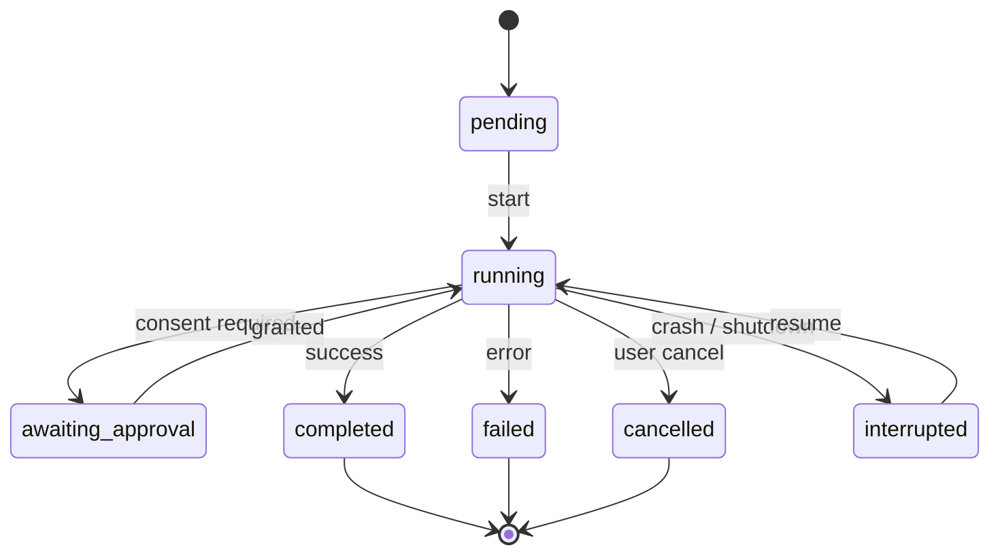

# 09 — Lifecycles and Canonical States

This chapter is the corpus-wide authority for **state names**. Per the single-home matrix
(Volume 0, chapter 03), Volume 2 owns each stateful entity's canonical state enum; the volume
named in the [ownership table](#full-machine-ownership) owns the **full machine**: transitions,
triggering events, guards, side effects, persistence points, recovery, timeouts, cancellation,
retries, and errors (the twelve mandatory machine elements of Volume 0, chapter 02).

Freezing rules:

1. The state names below are **frozen** for the whole corpus. An owning volume MUST use these
   names exactly — in requirements, diagrams, events, persistence, CLI output, and the
   Andromeda Runtime Protocol — and MUST NOT add, rename, or remove states. Changing an enum
   is a Volume 2 amendment through the Volume 0 change procedure.
2. Names are lowercase `snake_case`. Terminal states use outcome words (`completed`,
   `failed`, `cancelled`, …); non-terminal states use activity or waiting words.
3. Shared vocabulary is deliberate: the execution family (Run, Workflow Run, Task) reuses the
   same outcome words with the same meanings, so users and tooling learn one vocabulary.
   Enums remain per-entity — sharing words does not merge machines.
4. Every persisted stateful entity stores its current state in its `state` column (chapter
   10) and every transition emits at least one Event (INV-EVT-03).
5. `interrupted` has one fixed meaning everywhere: the process owning the entity stopped
   without recording a terminal outcome; the entity's work is *not* known to be complete
   (PRD-010). Recovery semantics per entity are the machine owner's.

## Common shape of execution machines

The diagram is **illustrative, not normative**: it shows the shared shape of the execution
family (Run, Workflow Run, Task) — a pending intake, an active phase that can be gated by
approval, three terminal outcomes, and the crash-visible `interrupted` state that can resume.
Normative transitions, including the states omitted here (`planning`, `paused`, `blocked`,
`ready`, `skipped`), guards, and side effects, are defined by Volume 4. No implementation may
be built from this diagram; it exists so the per-entity tables below read against a common
picture.

## Canonical state enums

Each table lists: state, one-line semantics, and initial (I) / terminal (T) marking. States
marked neither I nor T are intermediate; "resting" flags a non-terminal state an entity can
legitimately stay in indefinitely.

### Session — full machine: Volume 4

| State | Semantics | I/T |
|---|---|---|
| `created` | Row exists; never yet activated | I |
| `active` | Attached to a live process; accepting runs and interaction | |
| `suspended` | Persisted, no live process; resumable with history intact (resting) | |
| `ended` | Closed by the user or policy; resumable never, readable always | T |
| `failed` | Unrecoverable integrity failure of the session record | T |

### Run — full machine: Volume 4

| State | Semantics | I/T |
|---|---|---|
| `pending` | Accepted, not yet started | I |
| `planning` | Planner is producing or revising the active Plan | |
| `running` | Executing turns and tasks | |
| `awaiting_approval` | Blocked on a pending Approval | |
| `paused` | Suspended by explicit user action; resumable | |
| `interrupted` | Process stopped mid-run; outcome unknown; resumable or closable | |
| `completed` | Goal reached; all effects recorded | T |
| `failed` | Terminated with a recorded error | T |
| `cancelled` | Terminated by user or budget/policy cancellation | T |

### Plan — full machine: Volume 4

| State | Semantics | I/T |
|---|---|---|
| `draft` | Being produced by the Planner; not yet inspectable as a proposal | I |
| `proposed` | Presented for inspection (and approval where policy requires) | |
| `approved` | Accepted for execution | |
| `executing` | Tasks are being executed | |
| `revising` | Planner is revising mid-execution; a successor version is in `draft` | |
| `completed` | All tasks reached successful terminal states | T |
| `superseded` | Replaced by a newer Plan version | T |
| `abandoned` | Discarded without completion (run ended or plan rejected) | T |

### Task — full machine: Volume 4

| State | Semantics | I/T |
|---|---|---|
| `pending` | Defined; dependencies not yet satisfied | I |
| `ready` | Dependencies satisfied; eligible for scheduling | |
| `running` | An agent is executing it | |
| `blocked` | Cannot proceed pending an external condition other than approval | |
| `awaiting_approval` | Blocked on a pending Approval | |
| `interrupted` | Process stopped mid-task; never assumed complete (PRD-010) | |
| `completed` | Finished successfully | T |
| `failed` | Finished with a recorded error (after retry policy exhausted) | T |
| `cancelled` | Terminated by cancellation | T |
| `skipped` | Deliberately not executed (plan revision, condition, user choice) | T |

### Agent — full machine: Volume 4

| State | Semantics | I/T |
|---|---|---|
| `instantiated` | Created from its profile; not yet given work | I |
| `idle` | Awaiting the next objective within the run (resting) | |
| `thinking` | A model request (turn) is in flight | |
| `acting` | Executing tool invocations | |
| `waiting` | Blocked on approval, sub-agent, or external input | |
| `terminated` | Ended in an orderly way with the run | T |
| `failed` | Ended with a recorded error | T |

### Workflow Run — full machine: Volume 4

| State | Semantics | I/T |
|---|---|---|
| `pending` | Instantiated; not yet started | I |
| `running` | Steps executing | |
| `awaiting_approval` | Blocked on a workflow gate Approval | |
| `paused` | Suspended by explicit user action; resumable | |
| `interrupted` | Process stopped mid-step; resumes at last persisted step boundary | |
| `completed` | Final step finished; outputs recorded | T |
| `failed` | Terminated with a recorded error | T |
| `cancelled` | Terminated by cancellation | T |

### Tool Invocation — full machine: Volume 6

| State | Semantics | I/T |
|---|---|---|
| `requested` | Issued by an agent; validation and permission evaluation pending | I |
| `awaiting_approval` | Requires interactive consent; Approval pending | |
| `approved` | Consent resolved positively; not yet executing | |
| `executing` | Tool code is running | |
| `succeeded` | Completed; `success` Tool Result recorded | T |
| `failed` | Completed with an error Tool Result (validation, execution, or output error) | T |
| `denied` | Refused by Approval or Permission evaluation; structured denial delivered to the agent | T |
| `timed_out` | Exceeded its effective timeout; error Tool Result recorded | T |
| `cancelled` | Cancelled before or during execution | T |

### Plugin — full machine: Volume 6

| State | Semantics | I/T |
|---|---|---|
| `registered` | Known and validated; process not running | I |
| `starting` | Process launching; Andromeda Runtime Protocol handshake in progress | |
| `running` | Handshake complete; surfaces registered and serving (resting) | |
| `stopping` | Orderly shutdown in progress | |
| `stopped` | Process exited cleanly; restartable (resting) | |
| `failed` | Process or handshake failure; restart policy applies (resting) | |
| `disabled` | Administratively prevented from starting (resting) | |
| `removed` | Unregistered; tombstone for provenance | T |

### MCP Client Connection — full machine: Volume 6

| State | Semantics | I/T |
|---|---|---|
| `configured` | Registration enabled; no connection attempted yet | I |
| `connecting` | Transport being established | |
| `initializing` | MCP initialize/capability negotiation in progress | |
| `ready` | Serving requests (resting) | |
| `reconnecting` | Lost transport; automatic re-establishment in progress | |
| `disconnected` | Not connected; no automatic retry pending (resting) | |
| `failed` | Handshake or protocol failure recorded; retry policy applies (resting) | |
| `disabled` | Administratively prevented from connecting (resting) | |
| `removed` | Registration removed; tombstone | T |

### Package (installation) — full machine: Volume 6

| State | Semantics | I/T |
|---|---|---|
| `requested` | Installation requested | I |
| `resolving` | Source and dependencies being resolved | |
| `downloading` | Fetching the archive | |
| `verifying` | Checksum and signature verification | |
| `staged` | Verified content staged; nothing active yet | |
| `installing` | Files placed; extensions registering | |
| `installed` | Active and serving (resting) | |
| `failed` | Installation step failed; nothing partially active (resting) | |
| `rolled_back` | A failed install/upgrade was reverted to the prior good state (resting) | |
| `removed` | Uninstalled; tombstone for provenance | T |

### Approval — full machine: Volume 9

| State | Semantics | I/T |
|---|---|---|
| `requested` | Decision pending before the user or policy | I |
| `granted` | Positive decision recorded | T |
| `denied` | Negative decision recorded | T |
| `expired` | No decision within `expires_at`; subject does not proceed | T |
| `cancelled` | Request withdrawn (subject cancelled before decision) | T |

### Authentication Session — full machine: Volume 5

| State | Semantics | I/T |
|---|---|---|
| `unauthenticated` | Created; no valid token material yet | I |
| `authenticating` | Establishment flow in progress | |
| `active` | Valid token material; requests may authenticate (resting) | |
| `refreshing` | Renewal in progress; previous material may still be valid | |
| `expired` | Token material expired; refresh or re-authentication required (resting) | |
| `failed` | Establishment or refresh failed with a recorded error (resting) | |
| `revoked` | Invalidated by credential revocation/rotation; never reusable | T |

### Provider (connection) — full machine: Volume 5

| State | Semantics | I/T |
|---|---|---|
| `configured` | Registered; never verified in this environment | I |
| `verifying` | Health/capability verification in progress | |
| `available` | Verified reachable; participating in routing (resting) | |
| `degraded` | Reachable with reduced service (partial failures, rate pressure); routing policy applies (resting) | |
| `unavailable` | Unreachable or failing; excluded from routing until re-verification (resting) | |
| `disabled` | Administratively excluded from routing (resting) | |
| `removed` | Registration removed; tombstone | T |

### Index — full machine: Volume 7

| State | Semantics | I/T |
|---|---|---|
| `created` | Declared; no build attempted | I |
| `building` | Full build in progress | |
| `ready` | Queryable and current (resting) | |
| `updating` | Incremental update in progress; queryable per Volume 7 rules | |
| `stale` | Queryable but known out of date beyond thresholds (resting) | |
| `failed` | Build/update failed; not queryable until rebuilt (resting) | |
| `removed` | Metadata removed; cache dropped | T |

### Release — full machine: Volume 14

| State | Semantics | I/T |
|---|---|---|
| `drafted` | Assembled by the release pipeline; not public | I |
| `candidate` | Published to a pre-release channel for gating | |
| `published` | Generally available on its channel (resting) | |
| `superseded` | A newer release on the same channel replaced it (resting; still installable per policy) | |
| `yanked` | Withdrawn; never offered by update checks | T |

### Update (process) — full machine: Volume 14

Update is a process, not a catalog entity: each `andromeda update` (or scheduled check) is one
instance of this machine, recorded in Volume 14's update history against Release rows. Its
state names are frozen here with the same force as entity enums.

| State | Semantics | I/T |
|---|---|---|
| `checking` | Querying release metadata | I |
| `up_to_date` | No applicable newer Release | T |
| `update_available` | A newer applicable Release exists; awaiting consent per policy | |
| `downloading` | Fetching artifacts | |
| `verifying` | Checksum/signature verification of downloaded artifacts | |
| `applying` | Replacing the installed version | |
| `applied` | New version active | T |
| `failed` | A step failed; installed version unchanged | T |
| `rolled_back` | Apply failed midway or was reverted; prior version restored | T |

## Full-machine ownership

| Entity | Canonical states (count) | Full machine owner |
|---|---|---|
| Session | 5 | [Volume 4](../volume-04-agent-runtime/00-index.md) |
| Run | 9 | Volume 4 |
| Plan | 8 | Volume 4 |
| Task | 10 | Volume 4 |
| Agent | 7 | Volume 4 |
| Workflow Run | 8 | Volume 4 |
| Tool Invocation | 9 | [Volume 6](../volume-06-tools-mcp-skills-plugins/00-index.md) |
| Plugin | 8 | Volume 6 |
| MCP Client Connection | 9 | Volume 6 |
| Package (installation) | 10 | Volume 6 |
| Approval | 5 | [Volume 9](../volume-09-security/00-index.md) |
| Authentication Session | 7 | [Volume 5](../volume-05-providers-and-auth/00-index.md) |
| Provider (connection) | 7 | Volume 5 |
| Index | 7 | [Volume 7](../volume-07-memory-context-indexing/00-index.md) |
| Release | 5 | [Volume 14](../volume-14-distribution/00-index.md) |
| Update (process) | 9 | Volume 14 |

Each owning volume MUST define, for its machines, all twelve elements required by Volume 0,
chapter 02: initial state, terminal states, transitions, events, guards, side effects,
persistence, recovery, timeouts, cancellation, retries, and errors — using exactly the state
names above.

## Recorded status vocabularies

The following entities carry a recorded status attribute rather than a governed state machine:
the value records an outcome or classification, and no volume defines transitions over it.
These vocabularies are frozen with the same force as the enums above.

| Entity · attribute | Values | Notes |
|---|---|---|
| Turn · `status` | `in_progress`, `completed`, `failed`, `interrupted` | Run-loop semantics that move turns are Volume 4's |
| Tool Result · `status` | `success`, `error` | Consistent with the invocation's terminal state (INV-TRES-03) |
| Patch · `status` | `proposed`, `applied`, `rejected`, `reverted` | Application semantics: Volumes 6/11 |
| Command Execution · `outcome` | `succeeded`, `failed`, `timed_out`, `killed` | Mapping from exit code/signal: Volume 6 |
| Credential · `status` | `active`, `rotated`, `revoked`, `expired` | Flows: Volume 5; storage: Volume 9 |
| Memory Record · `status` | `active`, `archived`, `expired`, `deleted` | Retention: Volume 7 |
| Trace · `status` | `ok`, `error`, `interrupted` | Mirrors the run's terminal family |

Boolean flags (`enabled`, `deprecated`, `discovered`, `truncated`, …) and classifications
whose vocabulary another volume owns (`trust_state`, `signature_state` policy semantics) are
not statuses and are not frozen by this chapter beyond their attribute definitions in
chapters 02–08.
