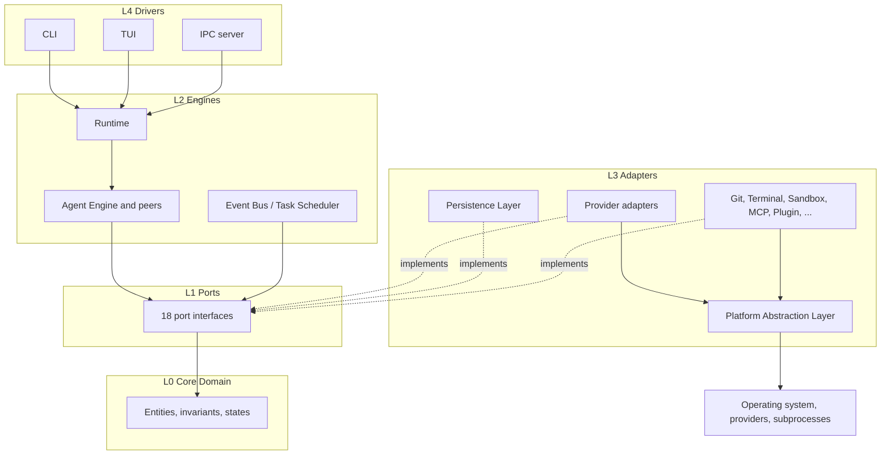
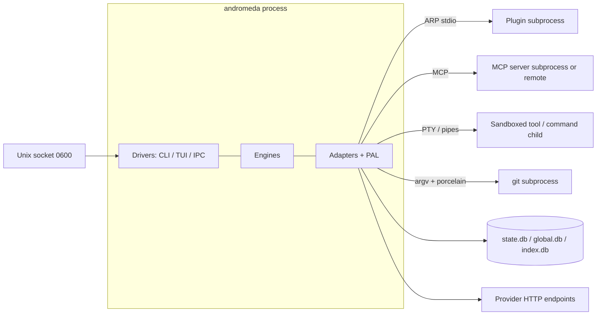

# 01 — Architecture Overview

Andromeda is a single Go program (ADR-001) structured as a **layered, hexagonal
(ports-and-adapters) architecture**: a pure Core Domain at the center, application engines
around it, all cross-boundary interaction expressed as **port interfaces** (chapter
[02](02-port-interfaces.md)), infrastructure implemented as **adapters** at the edges, and the
CLI/TUI as **drivers** that steer the Runtime. The style is decided by
[ADR-030](../annexes/adr/ADR-030.md); the module layout that realizes it by
[ADR-031](../annexes/adr/ADR-031.md).

The architecture exists to make the product principles structural rather than aspirational:
vendor agnosticism (Principle 1) is the rule that no provider-specific code exists outside
adapters; local-first (Principle 3) is the rule that no engine depends on a network adapter;
portability (PRD-011) is the rule that OS specifics live only in the Platform Abstraction
Layer (chapter [07](07-platform-abstraction-layer.md)).

## Logical architecture

### Layers

Every package in the codebase belongs to exactly one layer. Layers are numbered from the
center outward; the dependency rule (FR-ARCH-001 below) permits imports only in the direction
of lower numbers, with the explicit exceptions stated in the [dependency
matrix](#dependency-matrix).

| Layer | Name | Contents | May import |
|---|---|---|---|
| L0 | Core Domain | Entities, invariants, canonical state enums, value types (Volume 2) | Standard library only |
| L1 | Ports | The 18 port interfaces, shared request/response types, error classes | L0 |
| L2 | Engines | Runtime, Agent Engine, Planner, Execution Engine, Context Manager, Memory Manager, Prompt Engine, Workflow Engine, Skill Engine, Tool Runtime, Permission Manager, Policy Engine, Observability, Event Bus, Task Scheduler | L0, L1 |
| L3 | Adapters | Provider Layer adapters, Authentication Layer, Persistence Layer, Configuration Manager, Indexing Engine, Workspace Engine, Git Engine, Terminal Engine, Sandbox Engine, Secret Store, Audit Log, Plugin Runtime, MCP Runtime, Logging, Telemetry, Updater, Package Manager, PAL | L0, L1, PAL, external libraries |
| L4 | Drivers | CLI, TUI, IPC server | L0, L1, L2 |
| L5 | Composition root | `cmd/andromeda`: construction and wiring of the object graph | All layers |

Two structural consequences follow and are normative:

1. **Engines never see infrastructure.** An L2 engine holds port interface values (L1) and
   never imports an L3 package. The Agent Engine calls `ProviderPort`, never an Anthropic or
   OpenAI-compatible adapter; the Memory Manager calls the Persistence Layer only through its
   port-facing repository API.
2. **Nothing imports the drivers.** CLI and TUI are leaves of the import graph. No engine or
   adapter may import them; anything two drivers share lives in L2 or L1.



**Prose for the diagram.** Drivers (CLI, TUI, and the IPC server of chapter
[08](08-processes-concurrency-ipc.md)) invoke the Runtime's application API; the Runtime
composes the engines; engines depend only on port interfaces, which in turn depend only on
Core Domain types. Adapters implement the ports (dashed edges) and are the only code that
touches external systems — model providers over HTTP (ADR-019), SQLite (ADR-007), subprocesses
(ADR-009, ADR-025), and the operating system, the last always through the PAL. The arrows are
import-direction constraints, not merely call direction: at runtime, calls flow from drivers
through engines into adapters, but the *source-level* dependency of engines stops at L1. The
composition root (not drawn) is the only place where an engine and the adapter satisfying its
port meet.

### Component-to-layer map

The Volume 0 glossary names 37 architecture components. Each maps to exactly one layer;
chapters [03](03-components-core.md)–[06](06-components-interface.md) specify them, and the
PAL — the 37th component — has chapter [07](07-platform-abstraction-layer.md) to itself.

| Layer | Components |
|---|---|
| L0 | Core Domain |
| L2 | Runtime, Agent Engine, Planner, Execution Engine, Context Manager, Memory Manager, Prompt Engine, Workflow Engine, Skill Engine, Tool Runtime, Permission Manager, Policy Engine, Event Bus, Task Scheduler, Observability |
| L3 | Provider Layer, Authentication Layer, Plugin Runtime, MCP Runtime, Configuration Manager, Persistence Layer, Indexing Engine, Workspace Engine, Git Engine, Terminal Engine, Sandbox Engine, Secret Store, Audit Log, Logging, Telemetry, Updater, Package Manager, Platform Abstraction Layer (PAL) |
| L4 | CLI, TUI |
| — | Extension SDK (separate public module mirroring L1 contracts; ADR-003, ADR-031) |

Classification rationale, briefly: Event Bus and Task Scheduler are L2 despite being
"infrastructure" in the colloquial sense because they are pure in-process constructs (ADR-012,
ADR-023) with no OS or library dependencies — placing them in L2 lets every engine use them
without a port indirection penalty while they still *implement* `EventBusPort` and
`SchedulerPort` so drivers and the SDK consume them uniformly. Permission Manager and Policy
Engine are L2 because permission decisions are domain logic that must work identically for
every adapter; their persistence flows through the Persistence Layer like everyone else's.
Observability is L2: it correlates records already produced by other components and owns no
external I/O of its own (export is Telemetry's job, an L3 adapter).

## Physical architecture

Andromeda runs, by default, as **one operating-system process** — the single installable
binary of PRD-011. Additional processes exist only in four bounded families, each owned by
exactly one component:

| Process family | Owner | Lifecycle | Protocol / mechanism |
|---|---|---|---|
| Plugin subprocesses | Plugin Runtime | Supervised: spawn, handshake, health, restart policy, orderly stop (Plugin states, Volume 2 ch. 09) | Andromeda Runtime Protocol — JSON-RPC 2.0 over stdio (ADR-009) |
| MCP server subprocesses (stdio transport) or remote MCP connections | MCP Runtime | Supervised per MCP Client Connection states (Volume 2 ch. 09) | MCP via official Go SDK (ADR-010) |
| Tool/command child processes | Terminal Engine and Tool Runtime, launched exclusively through the Sandbox Engine | Bounded by tool timeouts and resource limits (ADR-021) | PTY or pipes via PAL |
| `git` subprocesses | Git Engine | Per-operation, short-lived | System git ≥ 2.40 (ADR-025) |

No daemons, no brokers, no open TCP ports by default (ADR-012). A running instance exposes one
**Unix domain socket** (JSON-RPC 2.0) for local automation and headless control; chapter
[08](08-processes-concurrency-ipc.md) specifies it. **Headless mode** — the same binary
running without a TTY, driven by the CLI's non-interactive mode or by the IPC surface — is an
operating mode of this same process model, not a separate deployment (PRD-009,
[ADR-032](../annexes/adr/ADR-032.md)).



**Prose for the diagram.** The main process contains all 37 components. The IPC socket is an
entry point into the drivers layer with `0600` permissions, subject to the Permission Manager
like every entry point (ADR-012). Plugins and stdio MCP servers are supervised subprocesses
speaking JSON-RPC 2.0; remote MCP servers are outbound connections. Tool and terminal
executions are children launched only through the Sandbox Engine; git operations are
short-lived children of the Git Engine. SQLite databases follow ADR-028 (workspace
`state.db`, machine `global.db`, rebuildable `index.db`); provider traffic uses outbound
HTTPS only. Constraints: the main process never listens on TCP by default; child processes
never outlive their supervisor's teardown (process-tree termination via PAL, chapter 07); and
every cross-process boundary carries cancellation (chapter 08).

## Module layout

Per ADR-003 (monorepo) and ADR-031 (package layout), the repository's Go layout is:

```text
andromeda/
├── cmd/
│   └── andromeda/          # L5 composition root: main(), wiring, lifecycle
├── internal/
│   ├── core/               # L0 Core Domain (entities, invariants, states)
│   ├── ports/              # L1 port interfaces + shared contract types
│   ├── runtime/            # L2 Runtime composition and application API
│   ├── agent/              # L2 Agent Engine
│   ├── planner/            # L2 Planner
│   ├── execution/          # L2 Execution Engine
│   ├── contextmgr/         # L2 Context Manager
│   ├── memory/             # L2 Memory Manager
│   ├── prompt/             # L2 Prompt Engine
│   ├── workflow/           # L2 Workflow Engine
│   ├── skill/              # L2 Skill Engine
│   ├── toolrt/             # L2 Tool Runtime
│   ├── permission/         # L2 Permission Manager
│   ├── policy/             # L2 Policy Engine
│   ├── eventbus/           # L2 Event Bus (implements EventBusPort)
│   ├── scheduler/          # L2 Task Scheduler (implements SchedulerPort)
│   ├── observability/      # L2 Observability (correlation)
│   ├── provider/           # L3 Provider Layer: contract helpers + adapters/<name>/
│   ├── auth/               # L3 Authentication Layer
│   ├── pluginrt/           # L3 Plugin Runtime (ARP host)
│   ├── mcp/                # L3 MCP Runtime (wraps official SDK, ADR-010)
│   ├── config/             # L3 Configuration Manager (implements ConfigPort)
│   ├── persistence/        # L3 Persistence Layer (SQLite, ADR-007/028/029)
│   ├── indexer/            # L3 Indexing Engine (implements IndexerPort)
│   ├── workspace/          # L3 Workspace Engine (implements WorkspacePort)
│   ├── gitengine/          # L3 Git Engine (implements GitPort, ADR-025)
│   ├── terminal/           # L3 Terminal Engine (implements TerminalPort)
│   ├── sandbox/            # L3 Sandbox Engine (implements SandboxPort, ADR-021)
│   ├── secret/             # L3 Secret Store (implements SecretStorePort, ADR-014)
│   ├── audit/              # L3 Audit Log
│   ├── logging/            # L3 Logging (slog, ADR-011)
│   ├── telemetry/          # L3 Telemetry (implements TelemetryPort, ADR-011)
│   ├── updater/            # L3 Updater (implements UpdaterPort)
│   ├── pkgmgr/             # L3 Package Manager (implements PackagePort)
│   ├── pal/                # L3 Platform Abstraction Layer (chapter 07)
│   ├── cli/                # L4 CLI (cobra, ADR-005)
│   ├── tui/                # L4 TUI (Bubble Tea v2, ADR-006)
│   └── ipcserver/          # L4 IPC surface (ADR-012)
├── sdk/                    # Extension SDK: separate Go module (ADR-003)
├── docs/spec/              # this specification
└── scripts/, .github/, packaging configuration
```

Rules bound to the layout (normative, from ADR-031):

1. Everything under `internal/` is unimportable outside the module by Go's `internal` rule;
   the **only public Go API is the `sdk/` module**, which re-exports the extension-facing
   subset of L1 contracts and MUST NOT import any `internal/` package — contract types shared
   between them are generated or mirrored, with equivalence enforced by a CI check.
2. One component, one package subtree. A component's package MAY have internal subpackages;
   no package may reach into another component's subpackages.
3. `internal/ports` contains no I/O, no goroutine spawns, and no third-party imports: it is
   interfaces, pure data types, and error-class definitions only.
4. Provider adapters live in `internal/provider/adapters/<name>/`, one package per provider;
   the Provider Layer's contract package MUST NOT import any adapter package (registration
   happens in the composition root).

## Dependency matrix

The matrix is the normative statement of FR-ARCH-001. "ALLOWED" means an import in that
direction is permitted; "PROHIBITED" means it is a build-breaking defect. Rows import columns.

| Imports → | L0 Core | L1 Ports | L2 Engines | L3 Adapters | L4 Drivers | L5 Root | PAL | External libs |
|---|---|---|---|---|---|---|---|---|
| **L0 Core Domain** | — | PROHIBITED | PROHIBITED | PROHIBITED | PROHIBITED | PROHIBITED | PROHIBITED | PROHIBITED (stdlib only) |
| **L1 Ports** | ALLOWED | — | PROHIBITED | PROHIBITED | PROHIBITED | PROHIBITED | PROHIBITED | PROHIBITED |
| **L2 Engines** | ALLOWED | ALLOWED | ALLOWED (within L2) | PROHIBITED | PROHIBITED | PROHIBITED | PROHIBITED | PROHIBITED (stdlib only) |
| **L3 Adapters** | ALLOWED | ALLOWED | PROHIBITED | PROHIBITED (sibling adapters) | PROHIBITED | PROHIBITED | ALLOWED | ALLOWED (pinned, ADR-002 policy) |
| **L4 Drivers** | ALLOWED | ALLOWED | ALLOWED | PROHIBITED | ALLOWED (within L4, shared widgets) | PROHIBITED | PROHIBITED | ALLOWED (cobra, Bubble Tea) |
| **L5 Composition root** | ALLOWED | ALLOWED | ALLOWED | ALLOWED | ALLOWED | — | ALLOWED | ALLOWED |
| **`sdk/` module** | PROHIBITED | PROHIBITED (mirrors, not imports) | PROHIBITED | PROHIBITED | PROHIBITED | PROHIBITED | PROHIBITED | ALLOWED (minimal, allowlisted) |

Selected prohibitions, restated as the rules implementers most often need:

- The Core Domain depends on **nothing that performs I/O** — no ports, no adapters, no PAL,
  no third-party libraries. It compiles with the standard library alone.
- Provider Layer adapters MUST NOT be imported by the Core Domain, by any engine, or by any
  other adapter. The only importer of an adapter package is the composition root.
- Nothing imports the CLI or the TUI. Ever.
- L2 engines MUST NOT import third-party libraries; anything they need from the outside world
  arrives through a port. (The two L2 exceptions are `errgroup` and the standard library's
  `context`/`log/slog` types, which ADR-023 and ADR-011 treat as language-level primitives.)
- Adapters MUST NOT import sibling adapters. Where one infrastructure concern needs another
  (Git Engine needs subprocess execution), it goes through the PAL or a port, never a direct
  adapter-to-adapter import.

**Enforcement.** The matrix is enforced in CI by `golangci-lint` `depguard` rules (ADR-018)
generated from a single machine-readable manifest of the layer assignments, plus an
import-graph test that fails on any edge not present in this matrix — the mechanism is decided
by [ADR-033](../annexes/adr/ADR-033.md) and bound by NFR-ARCH-001 below.

## Requirements

### FR-ARCH-001 — Layered dependency rule

- Type: Functional
- Status: Approved
- Priority: P0
- Phase: Core
- Source: Design
- Owner: Architecture (Volume 3)
- Affected components: all 37 components; composition root; Extension SDK
- Dependencies: ADR-030, ADR-031, ADR-033
- Related risks: RISK-ARCH-001

#### Description

Every Go package in the Andromeda repository MUST be assigned to exactly one layer of the
logical architecture (L0–L5, plus the `sdk/` module), and package imports MUST conform to the
[dependency matrix](#dependency-matrix) of this chapter. Prohibited edges are build defects:
the Core Domain imports nothing that performs I/O; engines import only L0/L1 (plus the
language-level exceptions listed in the matrix); adapters are imported only by the composition
root; no package imports the CLI, TUI, or IPC server.

#### Motivation

The dependency rule is what makes the product principles checkable: vendor agnosticism
(Principle 1) reduces to "no engine imports an adapter"; portability (PRD-011) reduces to
"only the PAL imports OS-specific code"; testability (SM-14's stricter core bar) reduces to
"L0–L2 compile without infrastructure". Eleven volumes specify behavior against these
boundaries; if the boundaries erode, their contracts silently lose meaning.

#### Actors

Implementers (human and AI agents); CI (enforcement); reviewers.

#### Preconditions

The layer manifest (machine-readable assignment of packages to layers, ADR-033) exists in the
repository and covers every package.

#### Main flow

1. A contributor adds or modifies a package.
2. The package is present in the layer manifest (new packages are added with their layer).
3. `golangci-lint` with `depguard` rules generated from the manifest runs in CI.
4. The import-graph test recomputes the package graph and verifies every edge against the
   matrix.
5. Both checks pass; the change is mergeable.

#### Alternative flows

- A package legitimately needs a new dependency class (e.g., a new L2 language-level
  exception): the contributor amends this chapter and the manifest through the Volume 0 change
  procedure before CI can pass.

#### Edge cases

- Generated code MUST carry the layer of the package it is generated into.
- Test files (`_test.go`) MAY import test helpers and fixtures across layers, and integration
  test packages MAY import adapters; enforcement distinguishes production from test imports.
- `sdk/` mirrors L1 types without importing them; the mirror-equivalence check (ADR-031 rule 1)
  is part of this requirement's verification.

#### Inputs

Package import declarations; the layer manifest.

#### Outputs

CI pass/fail; on failure, the offending import edge named as file, package, and violated rule.

#### States

Not applicable — the requirement constrains static structure, not runtime state.

#### Errors

Violations are CI errors (lint failure), not runtime errors; no E-code is minted for them.

#### Constraints

The manifest and the matrix in this chapter MUST stay consistent; the matrix is authoritative
and the manifest is derived from it.

#### Security

Layer confinement is a security control: it guarantees that credential material (Secret Store,
L3) and permission decisions (Permission Manager, L2) cannot be bypassed by direct imports
from feature code, and that no engine can open sockets or spawn processes except through
ports.

#### Observability

CI publishes the dependency-check result per commit; the import-graph test emits the full
edge list as a build artifact for audit.

#### Performance

Lint and graph checks MUST complete within the CI budget Volume 13 sets for static checks.

#### Compatibility

The rule applies identically on all platforms; the `sdk/` module's isolation preserves
extension compatibility (SM-20).

#### Acceptance criteria

- Given the repository at any mainline commit, when the depguard and import-graph checks run,
  then zero prohibited edges exist.
- Given a change that adds an import from `internal/agent` to
  `internal/provider/adapters/anthropic`, when CI runs, then the build fails naming the edge
  and the violated matrix cell.
- Given a change that adds a package absent from the layer manifest, when CI runs, then the
  build fails demanding a layer assignment.
- Given the `sdk/` module, when its dependency graph is computed, then it contains no
  `internal/` package and no dependency outside its allowlist.
- Negative/observability case: given a violation merged by force (branch-protection bypass),
  when the next scheduled full check runs, then the violation is reported and tracked as a
  defect per Volume 13 quality gates.

#### Verification method

Automated: depguard in `golangci-lint` (pinned per ADR-018) plus the import-graph test in CI
on every PR and on mainline; audited per release by Volume 13.

#### Traceability

PRD-002, PRD-007, PRD-011; ADR-030, ADR-031, ADR-033; NFR-ARCH-001; RISK-ARCH-001.

### FR-ARCH-002 — Ports-and-adapters composition

- Type: Functional
- Status: Approved
- Priority: P0
- Phase: Core
- Source: Design
- Owner: Architecture (Volume 3)
- Affected components: all L2 engines; all L3 adapters; composition root
- Dependencies: FR-ARCH-001; ADR-030
- Related risks: RISK-ARCH-001, RISK-ARCH-002

#### Description

All interaction between engines and infrastructure MUST occur through the port interfaces of
chapter [02](02-port-interfaces.md). Each port MUST have at least one adapter implementation
registered in the composition root; engines MUST receive port implementations by injection at
construction and MUST NOT construct adapters, read global state to locate them, or type-assert
a port value to a concrete adapter type. The composition root (`cmd/andromeda`) is the only
production code that names engine and adapter types together.

#### Motivation

Injection at a single composition root is what makes every port swappable: test doubles in
Volume 13's contract suites, alternative adapters (a second provider, a future go-git fast
path per ADR-025), and future platform backends all install without touching engine code.

#### Actors

Implementers; the composition root; Volume 13 test harnesses.

#### Preconditions

Port interfaces exist in `internal/ports`; adapters implement them.

#### Main flow

1. Startup: the composition root resolves configuration (ConfigPort), constructs adapters,
   constructs engines with their port dependencies, and starts the Runtime.
2. Runtime operation: engines invoke ports; adapters execute against external systems.
3. Shutdown: the composition root tears down in reverse dependency order (chapter 08).

#### Alternative flows

- Component construction fails (missing prerequisite, bad configuration): startup aborts with
  E-ARCH-001 and the process exits with the mapped exit code; no partial object graph runs.

#### Edge cases

- A port with multiple registered implementations (several provider adapters) is exposed to
  engines through a registry/router that itself implements the port; selection policy is the
  owning volume's (Volume 5 for providers).
- Optional capabilities (a platform without a Credential Store backend) surface as a
  constructed adapter that reports unavailability through the port's defined errors — never as
  a nil port value.

#### Inputs

Resolved configuration; platform capabilities (PAL probe results).

#### Outputs

A fully wired object graph; E-ARCH-001 on wiring failure.

#### States

Not applicable — composition is a startup activity; component lifecycle states are given per
component in chapters 03–06.

#### Errors

E-ARCH-001 (component wiring failure); E-ARCH-002 (port contract violation, detectable at
runtime when an adapter breaches port semantics).

#### Constraints

No service locator, no global mutable registry, no `init()`-time self-registration in
production code paths.

#### Security

Injection makes the mediation chain auditable: the composition root demonstrates, in one
file set, that every side-effecting adapter is wrapped by Permission Manager and Sandbox
Engine mediation where chapters 03–06 require it.

#### Observability

The composition root logs (Volume 10 envelope) the constructed component set with versions
and the adapter chosen per port at startup; this record is part of run reproducibility
(SM-12).

#### Performance

Wiring is one-time startup work and falls under the SM-06 startup budgets.

#### Compatibility

Port-mediated composition is what allows adapter substitution across platforms without engine
changes; it is a precondition for the Windows phase (PRD-011).

#### Acceptance criteria

- Given the production source, when searched for adapter type names outside their own package
  and the composition root, then zero occurrences exist.
- Given an engine constructed with a contract-conformant test double for every port, when the
  Volume 13 engine suites run, then they pass without any adapter package linked.
- Given a startup with an unconstructible component (e.g., unreadable global database), when
  `andromeda` starts, then it exits with E-ARCH-001 mapped to its exit code and a diagnostic
  naming the component, and no partial runtime serves requests.
- Permission case: given the wired graph, when the SM-16(b) enforcement test attempts a side
  effect that bypasses Permission Manager mediation, then the attempt is impossible by
  construction or fails.

#### Verification method

Static check (adapter-name search rule in lint config); Volume 13 contract suites executed
against doubles; startup failure-injection tests.

#### Traceability

PRD-002, PRD-007; ADR-030; FR-ARCH-001; chapter 02 port definitions.

### NFR-ARCH-001 — Dependency-rule enforcement in CI

- Category: Maintainability
- Priority: P0
- Phase: Core
- Metric: Count of prohibited import edges present on mainline; CI coverage of the layer manifest (packages assigned / packages existing)
- Target: 0 prohibited edges; 100% manifest coverage
- Minimum threshold: 0 prohibited edges; 100% manifest coverage (no tolerance)
- Measurement method: depguard (golangci-lint, pinned per ADR-018) plus the import-graph test (ADR-033), run on every PR and mainline commit; results archived per release
- Test environment: CI (all Tier 1 platforms build the same graph; the check runs once per commit on the reference CI runner)
- Measurement frequency: every PR and mainline commit; audited at each release
- Owner: Architecture (Volume 3) / Volume 13 (gate operation)
- Dependencies: FR-ARCH-001, ADR-018, ADR-033
- Risks: RISK-ARCH-001
- Acceptance criteria: A PR introducing any prohibited edge cannot merge (required check fails); the release audit shows 0 violations and 100% manifest coverage for the released commit.

## Risks

### RISK-ARCH-001 — Layering erosion under delivery pressure

- Category: Technical / process
- Probability: Medium
- Impact: High
- Severity: High
- Mitigation: FR-ARCH-001 enforced as a required CI check from the first commit (NFR-ARCH-001); layer manifest reviewed in every PR that adds packages; exceptions only through the Volume 0 change procedure with an ADR
- Detection: depguard and import-graph checks; release audits; periodic full-graph review in quality reviews (Volume 13)
- Owner: Architecture (Volume 3)
- Status: Open

Erosion is the default fate of layered architectures: each individual shortcut import is
locally harmless and globally fatal, ending in a codebase where provider logic, platform
checks, and UI concerns interweave — exactly the failure modes PRD-002 and PRD-011 exist to
prevent. The mitigation is mechanical enforcement from day one, because review-time vigilance
alone demonstrably decays.
