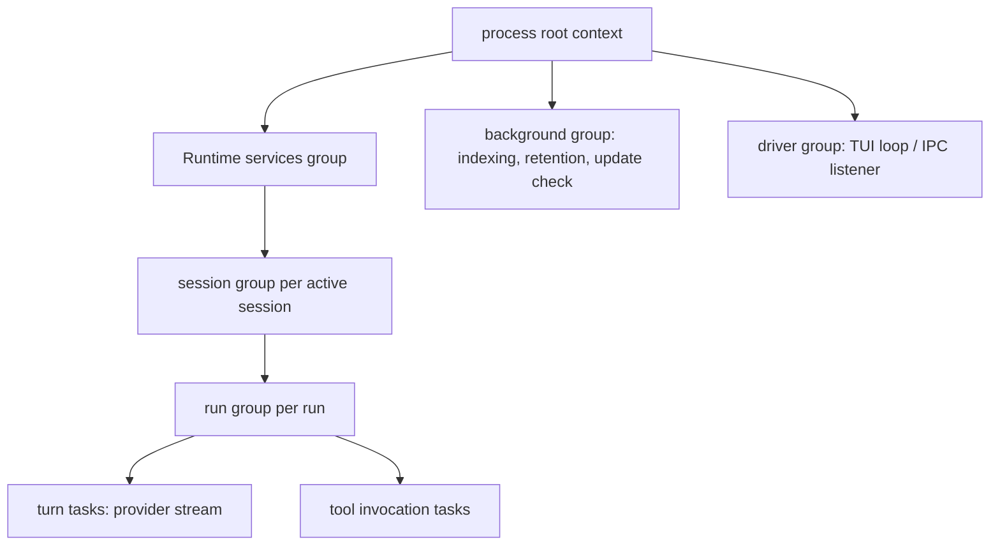

# 08 — Processes, Concurrency, and IPC

This chapter fixes the runtime execution model: which processes exist and who owns them, how
all concurrent work inside the main process is structured and supervised (ADR-023), the
external IPC control surface (ADR-012), crash recovery over the persistence guarantees of
Volume 2 chapter 10, and the shutdown protocol. The Task Scheduler's behavioral contract
(SchedulerPort, chapter [02](02-port-interfaces.md)) is specified here; its pool sizes and
saturation budgets are Volume 12's.

## Process model

The default deployment is **one process** (chapter [01](01-architecture-overview.md),
physical architecture). Child processes exist only in the four supervised families of that
chapter's table — plugins (ADR-009), MCP stdio servers (ADR-010), sandboxed tool/terminal
children (ADR-021), and per-operation git children (ADR-025). Binding rules:

1. **Every child has exactly one supervisor** — the component named in the family table.
   Orphan processes are defects: supervisors register children with the PAL Process Trees
   surface at spawn, and teardown terminates the full tree.
2. **Every spawn goes through the Sandbox Engine** except git children, which use the PAL
   Processes surface directly inside the Git Engine's ADR-025 boundary with ADR-021
   environment filtering applied. There is no third spawn path.
3. **Environment is deny-by-default** for every child (ADR-021): the supervisor passes an
   explicit allowlist; ambient secrets never leak into children.
4. **Long-lived children carry liveness** (plugins, MCP servers): handshake timeouts, health
   checks, and restart policies per their Volume 6 machines. Short-lived children carry
   deadlines (tool timeouts, git operation timeouts).
5. **Cross-process protocols are JSON-RPC 2.0** in all three cases that have a protocol —
   ARP (plugins), MCP, and external IPC — sharing message-shape conventions (ADR-009,
   ADR-010, ADR-012).

## Task and goroutine model

ADR-023 is binding: goroutines with context cancellation, errgroup-structured groups,
no naked goroutines outside the Task Scheduler, bounded pools with declared backpressure.
This section gives the structural contract behind SchedulerPort.

### Supervision tree

**Prose for the diagram.** All concurrent work hangs from one process-root context created by
the composition root. Three top-level groups exist: Runtime services (which parents one group
per active session, each parenting one group per run), the driver group (TUI event loop or
IPC listener), and the background group (index builds and updates, memory retention passes,
scheduled update checks). A run's turns (provider streams) and tool invocations are tasks
inside that run's group. The constraints the tree encodes: cancelling a run cancels exactly
its subtree (FR-ARCH-004); cancelling a session cancels its runs; process shutdown cancels
the root and therefore everything, in the [shutdown order](#shutdown-semantics) below;
background work never blocks run work (separate groups, separate pools); and first-error
propagation joins at group boundaries per errgroup semantics (ADR-023).

### Pools and backpressure

All scheduler work executes on **named bounded pools** declared in one registry: at minimum
`interactive` (turn-critical work), `tools` (tool/terminal executions), `background`
(indexing, retention, checks), and `io` (persistence flushes, event fan-out assistance).
Every pool declares size and queue bound (values: Volume 12); when a queue is full the
submitting component gets the pool's declared policy — block-with-deadline for `interactive`
and `tools`, reject-with-E-ARCH-005 for `background` — so overload becomes visible latency or
an explicit error, never unbounded memory (ADR-023). Scheduler work items progress
`submitted → running → ` one of `completed | failed | cancelled | panicked`; `panicked`
converts to a captured error with stack, correlated to the submitting component, and never
crashes the process.

## External IPC surface

Per ADR-012: a running instance listens on a **Unix domain socket** in the per-instance
runtime directory (ADR-022), mode `0600`, speaking **JSON-RPC 2.0** with a versioned
handshake sharing ARP's grammar conventions. The PAL Local IPC surface provides the listener
and peer identity; on Windows (future) the same protocol maps onto named pipes.

Structural rules (command semantics are owned by Volumes 8 and 10):

1. **Same-user only.** The listener verifies peer identity (UID match) via the PAL before
   parsing any request; non-matching peers are disconnected with E-ARCH-003 semantics logged
   and `ipc.request.rejected` emitted.
2. **Versioned handshake first.** Clients negotiate a protocol version before any method
   call; unsupported versions receive E-ARCH-004 with the supported range. The IPC protocol
   version follows the public-contract SemVer regime (ADR-015, chapter 09).
3. **Full mediation.** Every IPC request enters the same Runtime API as CLI/TUI requests and
   passes the Permission Manager (ADR-012); IPC never bypasses approval or policy resolution.
   Administrative methods are additionally audit-logged.
4. **Event bridging.** Clients MAY subscribe to event families; the bridge subscribes to the
   Event Bus like any consumer, applies Volume 9/10 redaction, and delivers as JSON-RPC
   notifications with the Volume 10 envelope. Bounded per-client buffers apply the family's
   overflow policy — a slow IPC client cannot stall the bus.
5. **Socket hygiene.** Bind-time liveness checks handle stale sockets after crashes
   (ADR-012); the socket is removed on orderly shutdown.

**Headless mode** ([ADR-032](../annexes/adr/ADR-032.md)): the same binary can run as a
persistent headless instance — no TTY, drivers limited to the IPC surface — for automation,
editor integrations, and remote (SSH) operation. Headless mode is the IPC surface plus
non-interactive permission resolution (policy-only, PRD-009); it adds no new capability
surface and no daemon semantics (the instance is started and owned by its invoker; command
naming is Volume 8's). Phase: the one-shot non-interactive CLI is MVP; the persistent
headless service mode is Beta (ADR-032).

## Crash recovery

Recovery builds on: WAL-mode SQLite with transactional appends (ADR-007, Volume 2 chapter
10), incremental persistence at every canonical state transition and Record append (PRD-010),
and the frozen `interrupted` state semantics (Volume 2 chapter 09: the process stopped
without recording a terminal outcome; work is never assumed complete).

Recovery procedure, executed by the Runtime on every startup against each database it opens,
before accepting new work:

1. **Storage recovery.** SQLite WAL replay happens implicitly on open; the Persistence Layer
   then runs the ADR-029 integrity checks when migrations are pending, and Volume 10's
   quick-check policy otherwise. Unrecoverable corruption → restore-from-backup path
   (ADR-029), exit code 9; index cache corruption → rebuild, never an error (ADR-028 rule 4).
2. **Orphan marking.** `SessionStorePort.MarkInterrupted` atomically moves every run, task,
   workflow run, and plugin/MCP connection record that claims a live state under this
   instance's previous incarnation into its frozen `interrupted` (or equivalent per-entity)
   state, and emits the corresponding transition events. Tool invocations found `executing`
   terminate as `failed` with an interruption-classed error in their Tool Result (their
   frozen enum has no `interrupted` state; the enclosing task carries resumability).
3. **Reconciliation.** Supervised child processes from the previous incarnation are located
   via persisted PIDs + PAL Process Trees, and terminated if still alive (no unsupervised
   survivors).
4. **Resumability offer.** Sessions in `suspended`/`active`-at-crash and their `interrupted`
   runs are reported to drivers as resumable (UC-11); resumption semantics — which
   `interrupted` work restarts, which re-plans, which requires re-approval — are Volume 4's,
   under the invariant that side-effecting tasks never silently re-execute.
5. **Completion event.** `runtime.recovery.completed` is emitted with counts (sessions
   scanned, runs marked, children reaped); failure of the recovery procedure itself is
   E-ARCH-007.

## Shutdown semantics

Shutdown is triggered by driver exit, `interrupt`/`terminate` signals (PAL Signals surface),
or an IPC shutdown method (Volume 8/10). Orderly shutdown proceeds in this order, bounded by
a total deadline (NFR-ARCH-003):

1. **Stop intake.** Drivers stop accepting new commands; the IPC listener stops accepting
   connections (existing requests drain).
2. **Cancel work.** Active runs receive cancellation through their groups (FR-ARCH-004):
   provider streams abort, tools cancel cooperatively then via sandbox teardown, affected
   entities record `cancelled`/`interrupted` outcomes per their owners' rules.
3. **Stop children.** Plugins and MCP connections stop through their machines (`stopping` →
   `stopped`; connections close); stragglers are terminated by process tree at the child
   deadline.
4. **Flush state.** Pending persistence batches commit; the Event Bus drains bounded
   buffers; Telemetry and Logging flush within their sub-deadlines.
5. **Release and exit.** The IPC socket is removed, file locks released, databases closed
   (WAL checkpoint per Volume 10 policy), `runtime.shutdown.completed` emitted, exit code per
   the triggering cause (8 for timeout/cancellation-caused termination per ADR-016).

A second `interrupt` during shutdown escalates: remaining deadlines collapse to immediate,
step 3 goes straight to tree termination, and the exit is recorded as forced (E-ARCH-006).
Whatever shutdown cannot complete, recovery completes at next start — the two procedures are
designed as one contract.

## Requirements

### FR-ARCH-005 — Bounded process model

- Type: Functional
- Status: Approved
- Priority: P0
- Phase: Core
- Source: Design
- Owner: Architecture (Volume 3)
- Affected components: Plugin Runtime, MCP Runtime, Sandbox Engine, Terminal Engine, Git Engine, PAL
- Dependencies: ADR-009, ADR-010, ADR-021, ADR-025; FR-ARCH-002
- Related risks: RISK-ARCH-004

#### Description

Andromeda MUST run as a single process by default, creating child processes only within the
four supervised families of this chapter (plugins, MCP stdio servers, sandboxed tool/terminal
children, git operations), each with exactly one supervising component, spawn paths
restricted per process-model rule 2, deny-by-default child environments, and guaranteed
process-tree termination on teardown. No component may install daemons, background services,
or processes that outlive the main process.

#### Motivation

The bounded model is what makes the safety story auditable (every child traceable to a
supervisor, a permission context, and a sandbox policy) and the local-first promise concrete
(no daemons/brokers, ADR-012).

#### Actors

Supervising components; Sandbox Engine; PAL; child processes.

#### Preconditions

PAL Processes/Process Trees surfaces available (Core phase).

#### Main flow

1. A supervisor requests a spawn through its sanctioned path.
2. The child runs registered in its supervisor's tree with filtered environment and limits.
3. Termination (normal, timeout, cancellation, shutdown) tears down the full tree.

#### Alternative flows

- Child crash: the supervisor records the outcome per its entity machine and applies its
  restart policy (plugins/MCP) or failure mapping (tools/git).

#### Edge cases

- Double-fork/daemonization attempts by children are contained by tree-based termination
  (process groups / Job Objects via PAL).
- Children alive from a crashed previous incarnation are reaped by recovery step 3.

#### Inputs

Spawn specifications; supervision policies.

#### Outputs

Supervised children; recorded outcomes; zero orphans after teardown.

#### States

Children map to their owners' frozen machines (Plugin, MCP Client Connection) or recorded
outcomes (Command Execution).

#### Errors

E-ARCH family for supervision-infrastructure failures; family-specific codes (E-PLUG, E-MCP,
E-TOOL, E-GIT) for child-level failures.

#### Constraints

No `exec` outside the two sanctioned paths; no TCP listeners by default (ADR-012).

#### Security

Deny-by-default environments (ADR-021) and mandatory sandbox placement are enforced by this
requirement's spawn-path restriction.

#### Observability

Every spawn/exit evented with supervisor, correlation IDs, and (for sandboxed children)
effective containment level.

#### Performance

Process accounting via PAL feeds Volume 12 resource budgets (child count and memory are
budgeted there).

#### Compatibility

Process groups map to Job Objects in the Windows phase via the PAL Process Trees surface.

#### Acceptance criteria

- Given any completed run, when the host process table is inspected, then no child created
  for that run survives.
- Given a plugin that forks a grandchild and then hangs, when its supervisor tears it down,
  then the grandchild is also terminated (tree termination test).
- Given a code search for process-spawning calls, when audited, then all occurrences are in
  the Sandbox Engine, the Git Engine's harness, or the PAL.
- Permission/observability case: given any spawn, when its records are inspected, then a
  supervising component, permission context (where side-effecting), and spawn event exist.

#### Verification method

Process-tree termination tests (including double-fork fixtures) per Tier 1 platform; spawn-
path static audit (ADR-033 tooling); crash-recovery reap tests.

#### Traceability

PRD-005, PRD-011; ADR-009, ADR-010, ADR-012, ADR-021, ADR-025; FR-ARCH-009.

### FR-ARCH-006 — Supervised concurrency

- Type: Functional
- Status: Approved
- Priority: P0
- Phase: Core
- Source: Design
- Owner: Architecture (Volume 3)
- Affected components: Task Scheduler; every component running concurrent work
- Dependencies: ADR-023; FR-ARCH-004
- Related risks: RISK-ARCH-003

#### Description

All concurrent work in the main process MUST be submitted to the Task Scheduler
(SchedulerPort): no component outside the scheduler's internals spawns free-running
goroutines. Work MUST be structured in groups matching the supervision tree of this chapter,
execute on named bounded pools with declared backpressure policies, propagate first errors
per group semantics, and convert panics into captured, correlated errors. Unbounded queues
are prohibited (ADR-023).

#### Motivation

ADR-023's rationale operationalized: leak prevention, uniform cancellation, one place for
panic capture and lifecycle observability. "Did we leak a goroutine" must be a component
invariant, not a whole-codebase question.

#### Actors

All components; Task Scheduler; Volume 12 (budgets); Volume 13 (leak gates).

#### Preconditions

Scheduler constructed at composition; pool registry configured.

#### Main flow

1. A component submits work with a task spec naming its pool and parent group.
2. The scheduler runs it under supervision; outcomes and stats are observable.
3. Group `Wait` joins completion; cancellation reaches every member.

#### Alternative flows

- Pool saturation: block-with-deadline or reject with E-ARCH-005 per the pool's declared
  policy; the submitter handles rejection explicitly (shed, retry, or surface).

#### Edge cases

- Panics: captured, stack-preserved, converted to `panicked` outcomes; the process survives.
- Work submitted during shutdown: rejected with the scheduler-shutdown error class.
- Nested groups: cancellation and error propagation compose transitively.

#### Inputs

Task/group specs; pool configuration (Volume 12 values).

#### Outputs

Supervised execution; outcomes; `scheduler.task.rejected` events on rejection; stats.

#### States

Scheduler work-item vocabulary: `submitted`, `running`, `completed`, `failed`, `cancelled`,
`panicked` (process-local; distinct from the domain Task entity).

#### Errors

E-ARCH-005 (submission rejected); scheduler-shutdown class within E-ARCH.

#### Constraints

`errgroup` and contexts are the only sanctioned primitives (ADR-023); no timers/tickers
outside scheduler-managed tasks on long-lived paths.

#### Security

Pool bounds contain resource-exhaustion blast radius per feature; panic containment prevents
one plugin-adjacent bug from taking down permission enforcement with the process.

#### Observability

`Stats` surface; per-pool saturation metrics; task lifecycle events with correlation IDs
(the Volume 12 saturation inputs).

#### Performance

Supervision overhead per task is budgeted by Volume 12 (ADR-023 review condition).

#### Compatibility

Pure in-process model; identical across platforms.

#### Acceptance criteria

- Given lint and review tooling, when production code is scanned for `go ` statements outside
  the scheduler package, then zero occurrences exist.
- Given a component test that submits work and cancels the parent group, when the group
  joins, then all members observed cancellation and none run afterward.
- Given a panicking task, when it executes, then the process survives, the outcome is
  `panicked` with a captured stack, and the correlated error reaches the submitter.
- Negative case: given a `background` pool at its queue bound, when another task is
  submitted, then E-ARCH-005 returns and `scheduler.task.rejected` is emitted.

#### Verification method

Static scan for naked goroutines (ADR-033 tooling); scheduler contract suite (cancellation,
panic, saturation cases); zero-leak shutdown gates (NFR-ARCH-004) in Volume 13.

#### Traceability

PRD-008, PRD-010; ADR-023; FR-ARCH-004; NFR-ARCH-004; RISK-ARCH-003.

### FR-ARCH-007 — External IPC control surface

- Type: Functional
- Status: Approved
- Priority: P1
- Phase: MVP
- Source: Design
- Owner: Architecture (Volume 3)
- Affected components: IPC server (driver), PAL Local IPC, Permission Manager, Event Bus, Audit Log
- Dependencies: ADR-012, ADR-015, ADR-022; FR-ARCH-002
- Related risks: RISK-ARCH-004

#### Description

A running instance MUST expose a local control surface on a Unix domain socket (JSON-RPC 2.0,
`0600`, per-instance runtime directory) implementing the five structural rules of this
chapter: same-user peer verification before parsing, versioned handshake (E-ARCH-004 on
mismatch), full Permission Manager mediation of every request, redacted event bridging with
bounded per-client buffers, and stale-socket hygiene. Method vocabularies are owned by
Volumes 8 and 10.

#### Motivation

Automation parity (PRD-009) and the headless mode (ADR-032) need a programmatic surface with
the same guarantees as interactive use; ADR-012 fixed the transport — this requirement fixes
the security and lifecycle shape.

#### Actors

Local automation clients; editor integrations; the IPC server; Permission Manager.

#### Preconditions

Runtime directory resolvable (FR-PORT-003); instance running.

#### Main flow

1. A client connects; peer identity is verified; the handshake negotiates a version.
2. Requests execute through the Runtime API under permission mediation; responses return as
   JSON-RPC results or ADR-016-mapped error objects.
3. Optional event subscriptions deliver redacted notifications until close.

#### Alternative flows

- Version unsupported: E-ARCH-004 with the supported range; connection closes cleanly.
- Socket bind conflict at startup: liveness check distinguishes a live instance (E-ARCH-003
  reported to the new process) from a stale socket (removed and rebound).

#### Edge cases

- Slow subscriber: per-client bounded buffer applies the family's overflow policy; the
  client observes gap markers per the Volume 10 envelope, the bus never stalls.
- Client vanishes mid-request: the request's context cancels (FR-ARCH-004).
- Multiple instances: each has its own socket in its own per-instance runtime directory.

#### Inputs

JSON-RPC requests; peer credentials; subscription selectors.

#### Outputs

Responses; notifications; audit records for administrative methods; `ipc.client.connected`
and `ipc.request.rejected` events.

#### States

Connection lifecycle is process-local; no Volume 2 machine.

#### Errors

E-ARCH-003 (endpoint unavailable/conflict), E-ARCH-004 (handshake version unsupported);
method-level errors use the invoked area's families.

#### Constraints

No TCP listener; no remote transport in this surface (remote use rides SSH to the local
socket).

#### Security

Filesystem permissions plus UID verification gate access; every request is permission-
mediated and administrative actions audit-logged; event bridging applies redaction before
egress from the process.

#### Observability

Connection and rejection events; per-method latency metrics; bridged-event drop counters.

#### Performance

IPC round-trip overhead budgets are Volume 12's (ADR-012 review condition).

#### Compatibility

Protocol version follows chapter 09 SemVer rules; Windows maps to named pipes via PAL
(future).

#### Acceptance criteria

- Given a same-user client, when it completes the handshake and invokes a permitted method,
  then the result matches the equivalent CLI invocation's semantics.
- Given a client running as a different user, when it connects, then it is disconnected
  before any request parsing and the rejection is logged and evented.
- Given a client requesting an action not covered by standing grants in a headless instance,
  when the method executes, then it is denied (no prompt) with the exit-code-5-equivalent
  error object, and the denial is recorded.
- Given a crashed previous instance's stale socket, when a new instance starts, then it
  detects staleness, rebinds, and serves.

#### Verification method

IPC conformance suite (handshake, peer verification, permission mediation, overflow, stale
socket) in Volume 13; security tests attempting cross-user access; parity tests against CLI
semantics.

#### Traceability

PRD-006, PRD-009; ADR-012, ADR-016; FR-ARCH-008; Volume 8/10 method vocabularies.

### FR-ARCH-008 — Headless operating mode

- Type: Functional
- Status: Approved
- Priority: P1
- Phase: Beta
- Source: Design
- Owner: Architecture (Volume 3)
- Affected components: Runtime, IPC server, CLI, Permission Manager, Policy Engine
- Dependencies: FR-ARCH-007; ADR-032; PRD-009
- Related risks: RISK-ARCH-004

#### Description

The same `andromeda` binary MUST support a persistent headless operating mode: no TTY, driver
surface limited to the IPC socket, permission resolution strictly policy-based (no prompts —
unresolved permissions deny), full session/run capability otherwise identical to interactive
operation, and orderly shutdown via signal or IPC method. Headless mode adds no capability
absent from interactive mode and omits none except terminal rendering (PRD-009 parity). The
one-shot non-interactive CLI (MVP) is distinct and owned by Volume 8; this requirement covers
the persistent instance (ADR-032).

#### Motivation

Automation, editor integrations, and long-running remote sessions need an addressable
instance; two stacks would fork behavior exactly as PRD-009 warns.

#### Actors

Automation clients; CI systems; the Runtime; Policy Engine.

#### Preconditions

FR-ARCH-007 surface operational; policies configured for intended autonomy.

#### Main flow

1. The invoker starts a headless instance (command naming per Volume 8).
2. Clients drive sessions/runs over IPC; permissions resolve from policy.
3. The invoker stops the instance; shutdown follows the standard ordering.

#### Alternative flows

- No policy covers a requested action: denial with recorded decision (never a hung prompt —
  the Volume 1 tension rule 2).

#### Edge cases

- TTY detection: started with a TTY, the mode is still headless if explicitly requested;
  started without a TTY interactively, the CLI's non-interactive rules (Volume 8) apply
  instead.
- Crash of a headless instance: identical recovery on next start; clients reconnect and
  resume per UC-11 semantics.

#### Inputs

Startup configuration; IPC requests; policies.

#### Outputs

Same records, events, and artifacts as interactive runs; IPC responses.

#### States

Sessions/runs use their frozen machines identically; no headless-specific states exist.

#### Errors

Standard families; permission denials map to the exit-code-5 class in results.

#### Constraints

No daemonization (the invoker owns the process); no additional listeners.

#### Security

Attack surface equals the IPC surface (FR-ARCH-007); autonomy is bounded by pre-approved,
recorded, revocable policies (Principle 8).

#### Observability

Identical to interactive runs (Principle 9); instance mode recorded in session records
(SM-12 completeness).

#### Performance

Idle headless RSS falls under SM-09-adjacent budgets set by Volume 12.

#### Compatibility

Identical across Tier 1 platforms; the IPC transport maps to named pipes in the Windows phase
(PAL Local IPC surface); the mode's protocol surface follows the chapter 09 compatibility
regime.

#### Acceptance criteria

- Given a headless instance and a policy pre-granting a tool class, when a client runs a task
  using that class, then it executes and the grant chain is fully recorded.
- Given the same run without the policy, when executed, then the action is denied, recorded,
  and the run continues per Volume 4 denial semantics — no prompt is ever displayed or hung.
- Given an interactive and a headless execution of the same scripted run with identical
  policies, when their persisted records are compared, then they are semantically identical
  except driver metadata (parity check).
- Observability case: given a headless instance, when inspected over IPC, then run activity,
  costs, and permission decisions are queryable exactly as in interactive mode.

#### Verification method

Headless E2E suite in CI (UC-07 extended); interactive/headless parity record comparison;
prompt-absence tests under unresolved permissions.

#### Traceability

PRD-009; ADR-012, ADR-032; FR-ARCH-007; UC-07, UC-11.

### FR-ARCH-009 — Crash recovery and resumable state

- Type: Functional
- Status: Approved
- Priority: P0
- Phase: MVP
- Source: Derived
- Owner: Architecture (Volume 3)
- Affected components: Runtime, Persistence Layer, SessionStorePort consumers, all supervisors
- Dependencies: PRD-010; ADR-007, ADR-028, ADR-029; Volume 2 chapter 10
- Related risks: RISK-ARCH-004

#### Description

On every startup, before accepting new work, the Runtime MUST execute the five-step recovery
procedure of this chapter: storage recovery with integrity policy, atomic orphan marking into
frozen `interrupted`/failure states via `MarkInterrupted`, reaping of surviving children from
previous incarnations, resumability reporting to drivers, and the `runtime.recovery.completed`
event. Interrupted work MUST never be reported or treated as complete (PRD-010).

#### Motivation

Durable sessions are a core objective (PRD-010, SM-11): recovery is the half of the
durability contract that runs after the crash; without it, incremental persistence only
produces well-preserved wreckage.

#### Actors

Runtime; Persistence Layer; drivers presenting resumables; users resuming (UC-11).

#### Preconditions

Databases reachable; recovery runs before intake (blocking startup).

#### Main flow

The five recovery steps of this chapter, in order.

#### Alternative flows

- Backup-restore path on unrecoverable corruption (ADR-029): recovery halts, exit code 9,
  restore guidance; after restore, recovery re-runs on the restored state.
- Index cache corruption: silent rebuild scheduling, recovery proceeds (never exit 9 for
  caches).

#### Edge cases

- Crash during recovery itself: every step is idempotent; re-running converges (marking is
  state-conditional, reaping tolerates absent PIDs, events deduplicate per envelope rules).
- Two instances racing on one workspace: database exclusivity rules (Volume 10) serialize;
  the loser reports cleanly.
- PID reuse: reaping verifies process identity via PAL (start-time match) before terminating.

#### Inputs

Databases; persisted supervision records (PIDs, incarnation ID); backups.

#### Outputs

Marked entities; reaped children; resumability report; recovery event with counts.

#### States

Transitions exclusively into frozen states: `interrupted` for Run/Task/Workflow Run;
Session per its machine; Tool Invocation → `failed` (its enum defines no interrupted state);
connections per their machines.

#### Errors

E-ARCH-007 (recovery reconciliation failure); storage integrity errors per ADR-029 (exit
code 9).

#### Constraints

Recovery MUST NOT mutate Record entities (append-only, Volume 2); it appends transitions and
events only.

#### Security

Recovered sessions retain their permission grants intact (SM-11); expired approvals are not
resurrected; reaping never kills processes not verified as Andromeda's own children.

#### Observability

`runtime.recovery.completed` with counts; every marked entity's transition evented; recovery
duration metric (SM-11b input).

#### Performance

Recovery time contributes to SM-11(b) restore-time targets; budgets in Volume 12.

#### Compatibility

Identical semantics across platforms; PID verification mechanics via PAL.

#### Acceptance criteria

- Given a process killed with SIGKILL during active tool execution, when Andromeda restarts,
  then affected runs/tasks are `interrupted`, the tool invocation is `failed` with an
  interruption-classed result, surviving children are terminated, and the session is
  resumable with history and grants intact (SM-11 crash-injection).
- Given a crash between two persisted turn appends, when recovered, then zero persisted
  turns are lost and the run resumes at the last persisted boundary.
- Given corrupted `index.db`, when starting, then startup succeeds and a rebuild is
  scheduled; given corrupted `state.db` beyond repair, then exit code 9 with restore
  guidance and an untouched backup.
- Negative case: given recovery interrupted midway, when re-run, then it converges without
  duplicate transitions or double-reaping.

#### Verification method

SM-11 crash-injection suite (kill −9, SIGKILL during tool execution, simulated power loss
between writes); idempotence tests re-running recovery; corruption fixtures for both the
exit-9 and rebuild paths.

#### Traceability

PRD-010; SM-11; ADR-007, ADR-028, ADR-029; UC-11; FR-ARCH-010.

### FR-ARCH-010 — Graceful shutdown ordering

- Type: Functional
- Status: Approved
- Priority: P0
- Phase: MVP
- Source: Design
- Owner: Architecture (Volume 3)
- Affected components: Runtime, drivers, Task Scheduler, all supervisors, Persistence Layer, Event Bus, Telemetry, Logging
- Dependencies: FR-ARCH-004, FR-ARCH-005, FR-ARCH-006; ADR-016, ADR-023
- Related risks: RISK-ARCH-004

#### Description

Shutdown MUST follow the five-step ordering of this chapter — stop intake, cancel work
through supervision groups, stop children through their machines, flush state and
observability, release and exit — under a total deadline with per-step sub-deadlines
(NFR-ARCH-003), with escalation on repeated interrupt (immediate tree termination, forced
exit recorded via E-ARCH-006). Exit codes reflect the triggering cause per ADR-016.

#### Motivation

An ordered shutdown is the difference between "resumable by design" and "resumable by luck":
flushing after cancellation, and stopping children before closing databases, is what keeps
the recovery procedure's inputs consistent.

#### Actors

Users (interrupt); OS (terminate); IPC clients (shutdown method); all components.

#### Preconditions

Signal handling installed at startup (PAL Signals).

#### Main flow

Steps 1–5 of the shutdown ordering.

#### Alternative flows

- Escalation: second interrupt collapses deadlines; step 3 becomes immediate tree
  termination; E-ARCH-006 records the forced path.
- Shutdown from headless mode via IPC: identical ordering; the IPC response is sent before
  step 5 closes the socket.

#### Edge cases

- Shutdown during an `applying` update: the Updater's non-cancellable critical section
  completes or restores (FR-ARCH-004 edge rule); shutdown waits for it within the step
  deadline.
- Shutdown during recovery: recovery is abortable between steps; whatever remains re-runs
  next start (idempotence).
- Wedged tool ignoring cancellation: sandbox teardown at the child deadline; outcome
  `killed`.

#### Inputs

Shutdown trigger; deadline configuration.

#### Outputs

Terminal entity states; flushed stores; removed socket; `runtime.shutdown.completed`; exit
code.

#### States

In-flight entities land in `cancelled`/`interrupted`/`killed` per their frozen vocabularies —
never left in live states on an orderly exit.

#### Errors

E-ARCH-006 (deadline exceeded / forced shutdown); step-local failures logged, shutdown
continues (best-effort past step 2).

#### Constraints

Step order is fixed; no component may veto shutdown; flushes are bounded, never unbounded
waits.

#### Security

Children are terminated before locks release so no unsupervised process outlives the
policy-enforcing parent; audit flush occurs in step 4 (audit precedence).

#### Observability

Per-step timing metrics; the shutdown event carries step durations and forced/orderly
classification.

#### Performance

Total and per-step deadlines per NFR-ARCH-003; typical orderly shutdown well under the bound
(Volume 12 tracks actuals).

#### Compatibility

Signal mechanics differ per platform behind PAL (console events on Windows, future); ordering
is identical.

#### Acceptance criteria

- Given an active run with a streaming provider response and a running tool, when interrupt
  arrives once, then intake stops, the run cancels cleanly, children stop through their
  machines, state flushes, and the process exits within the NFR-ARCH-003 bound with exit
  code 8.
- Given a wedged tool, when shutdown reaches the child deadline, then the tree is terminated,
  the Command Execution records `killed`, and shutdown completes.
- Given a second interrupt during shutdown, when escalation applies, then termination is
  immediate, E-ARCH-006 is recorded, and the next start's recovery completes the contract.
- Observability case: given any shutdown, when its event is inspected, then per-step timings
  and classification (orderly/forced) are present.

#### Verification method

Shutdown-ordering integration tests with instrumented steps; wedged-child fixtures;
escalation tests; leak gates asserting zero goroutines/children after orderly shutdown
(NFR-ARCH-004).

#### Traceability

PRD-010; ADR-016, ADR-023; FR-ARCH-009; NFR-ARCH-003, NFR-ARCH-004.

### NFR-ARCH-003 — Shutdown deadline

- Category: Reliability
- Priority: P0
- Phase: MVP
- Metric: Wall-clock time from shutdown trigger to process exit (orderly path), p95 and worst case
- Target: ≤ 5 s p95 with active runs; hard bound 15 s before escalation is automatic
- Minimum threshold: hard bound 15 s (automatic escalation guarantees exit; exceeding it without exit is a defect)
- Measurement method: instrumented shutdown timing in integration suites and from field diagnostics (shutdown event step durations)
- Test environment: Tier 1 CI with active-run fixtures (streaming provider double + running tool)
- Measurement frequency: every mainline commit (suite); per release (audit)
- Owner: Architecture (Volume 3) / Volume 12 (budget alignment)
- Dependencies: FR-ARCH-010
- Risks: RISK-ARCH-004
- Acceptance criteria: Suite shutdowns meet p95 ≤ 5 s; no recorded shutdown exceeds 15 s without automatic escalation and exit; step timings present in every shutdown event.

### NFR-ARCH-004 — Leak-free termination

- Category: Reliability
- Priority: P0
- Phase: Core
- Metric: Goroutines and child processes surviving orderly component/process shutdown in leak-instrumented tests
- Target: 0 leaked goroutines; 0 surviving children
- Minimum threshold: 0 / 0
- Measurement method: goroutine-leak detection in tests (goleak-class instrumentation per ADR-017 stack) around every engine/adapter suite; process-tree scans after E2E shutdowns
- Test environment: CI, all Tier 1 platforms for the E2E scans
- Measurement frequency: every mainline commit
- Owner: Architecture (Volume 3) / Volume 13 (gate)
- Dependencies: FR-ARCH-005, FR-ARCH-006
- Risks: RISK-ARCH-003
- Acceptance criteria: Leak gates are required checks; any detected leak blocks merge; E2E post-shutdown scans find zero surviving Andromeda-attributed processes.

## Error codes

### E-ARCH-001 — Component wiring failure

- Category: Startup
- Severity: Fatal
- User message: "Andromeda could not start: a required component failed to initialize: <component>."
- Technical message: component, constructor error chain, configuration source attribution
- Cause: unconstructible object graph — missing prerequisite, invalid configuration, failed adapter probe
- Safe-to-log data: component name, dependency chain, sanitized cause
- Recoverability: recoverable after remediation of the named cause
- Retry policy: none automatic
- Recommended action: follow the component-specific remediation in the diagnostic
- Exit-code mapping: 3 when configuration-caused; otherwise 1
- HTTP mapping: not applicable
- Telemetry event: within the `runtime.*` startup family
- Security implications: no partial runtime ever serves requests (FR-ARCH-002)

### E-ARCH-002 — Port contract violation

- Category: Internal defect
- Severity: Error
- User message: "An internal component returned invalid data; the operation was aborted."
- Technical message: port, method, violated contract clause, adapter identity
- Cause: an adapter breached port semantics (out-of-contract values, envelope violations)
- Safe-to-log data: port/method names, adapter identity/version, violation class
- Recoverability: the operation fails; the adapter may be quarantined per its owner's policy
- Retry policy: not retryable (deterministic defect)
- Recommended action: report the defect; disable or update the offending extension/adapter
- Exit-code mapping: 1
- HTTP mapping: not applicable
- Telemetry event: within the affected port's area family
- Security implications: fail-closed — violating results are discarded, never partially consumed

### E-ARCH-003 — IPC endpoint unavailable

- Category: Environment
- Severity: Error
- User message: "The control socket could not be created or is in use by another running instance."
- Technical message: socket path, bind error, liveness-check outcome
- Cause: bind conflict with a live instance, permission problem on the runtime directory, or unresolvable runtime dir
- Safe-to-log data: socket path, errno class, liveness result
- Recoverability: recoverable (stop the other instance, fix permissions)
- Retry policy: single retry after stale-socket cleanup; otherwise none
- Recommended action: named per cause in the diagnostic
- Exit-code mapping: 1
- HTTP mapping: not applicable
- Telemetry event: `ipc.request.rejected`
- Security implications: never bind through a foreign-owned path; refuse instead

### E-ARCH-004 — IPC protocol version unsupported

- Category: Compatibility
- Severity: Error
- User message: "The connecting client speaks an unsupported control-protocol version."
- Technical message: client version, supported range
- Cause: client/instance version skew
- Safe-to-log data: both versions, client peer identity
- Recoverability: recoverable with a matching client
- Retry policy: none
- Recommended action: update the client or the instance
- Exit-code mapping: not applicable (server-side rejection); clients map to 2
- HTTP mapping: not applicable
- Telemetry event: `ipc.request.rejected`
- Security implications: rejection occurs post-identity-check, pre-method-dispatch

### E-ARCH-005 — Task submission rejected

- Category: Capacity
- Severity: Warning (component-level); Error when surfaced to a user operation
- User message: "Andromeda is at capacity for background work; the operation was not started."
- Technical message: pool, queue depth, bound, submitting component
- Cause: bounded pool at its declared limit with a rejecting policy (ADR-023)
- Safe-to-log data: pool name, depths, submitter, correlation ID
- Recoverability: recoverable — resubmit after load drains
- Retry policy: submitter-defined (background work typically defers and retries)
- Recommended action: none for users unless recurrent; recurrence indicates Volume 12 budget review
- Exit-code mapping: 1 if it fails a foreground command; usually not surfaced
- HTTP mapping: not applicable
- Telemetry event: `scheduler.task.rejected`
- Security implications: rejection is the designed alternative to unbounded memory growth

### E-ARCH-006 — Forced shutdown

- Category: Lifecycle
- Severity: Warning
- User message: "Andromeda was terminated before shutdown could complete cleanly; recovery will run at next start."
- Technical message: incomplete steps, elapsed vs deadline, escalation trigger
- Cause: shutdown deadline exceeded or user escalation (second interrupt)
- Safe-to-log data: step timings, trigger, counts of terminated children
- Recoverability: recoverable — the recovery procedure completes the contract at next start
- Retry policy: not applicable
- Recommended action: none; investigate if recurrent (wedged tools/plugins)
- Exit-code mapping: 8
- HTTP mapping: not applicable
- Telemetry event: `runtime.shutdown.completed` (classification: forced)
- Security implications: tree termination guarantees no unsupervised survivors even on the forced path

### E-ARCH-007 — Recovery reconciliation failure

- Category: Integrity
- Severity: Fatal
- User message: "Andromeda could not reconcile state from a previous session; no data was modified."
- Technical message: failing recovery step, affected database, error chain
- Cause: recovery procedure failure beyond storage-level recovery (marking or reaping cannot complete consistently)
- Safe-to-log data: step, entity counts, database identity
- Recoverability: depends on cause; storage-level corruption follows the ADR-029 restore path
- Retry policy: recovery re-runs on next start (idempotent)
- Recommended action: retry startup; if persistent, restore from backup per ADR-029 guidance
- Exit-code mapping: 9
- HTTP mapping: not applicable
- Telemetry event: within the `runtime.*` recovery family
- Security implications: fail-closed — the instance refuses intake rather than serve unreconciled state

## Risks

### RISK-ARCH-003 — Task Scheduler as a critical single point

- Category: Technical
- Probability: Medium
- Impact: High
- Severity: High
- Mitigation: The scheduler is small, dependency-free (L2, stdlib + errgroup only), and exhaustively tested (contract suite, race tests, chaos cancellation); its API is minimal by design; ADR-023's review condition triggers re-evaluation if supervision overhead breaches Volume 12 budgets
- Detection: scheduler contract suite; Volume 12 saturation and overhead metrics; leak gates
- Owner: Architecture (Volume 3)
- Status: Open

Centralizing all concurrency creates one component whose defects affect everything. The bet —
identical to ADR-023's — is that one rigorously tested supervisor beats distributed ad-hoc
concurrency; the mitigation keeps the component small enough for the bet to hold.

### RISK-ARCH-004 — Recovery divergence between recorded and actual state

- Category: Technical / data
- Probability: Medium
- Impact: High
- Severity: High
- Mitigation: Incremental persistence at every transition (Volume 2 write discipline); `interrupted` semantics forbid completion assumptions (PRD-010); idempotent recovery; PID identity verification before reaping; SM-11 crash-injection at randomized points as a release gate
- Detection: SM-11 suite; record-completeness validation (SM-12); field reports correlated via recovery-event counts
- Owner: Architecture (Volume 3) / Volume 4 (resumption semantics)
- Status: Open

The gap between "what the database says was happening" and "what was actually happening at
the kill point" can never be fully closed — side effects outside Andromeda's transaction
boundary (a half-written file by a killed tool) are inherently ambiguous. The architecture
narrows the gap (append-before-act, sandbox teardown, honest `interrupted` reporting) and
Volume 4's resumption rules refuse to guess across it.
