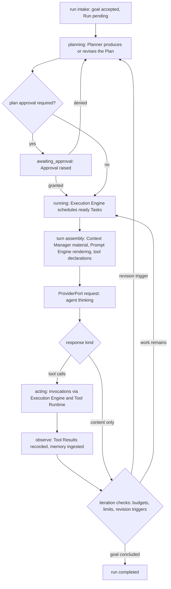

# 01 — Agent Engine

This chapter specifies the Agent Engine: the component that drives the plan–act–observe loop
for every run. It elaborates the boundary contract of Volume 3 chapter 03 into normative
behavior: the loop itself (keystone FR-AGT-001), turn handling and message assembly,
interruption, pause, and resume, sub-agent delegation, run budget enforcement, and — because
every run begins inside a workspace and a session — the Runtime-side intake behavior over
WorkspacePort, whose contract Volume 4 owns. State machines referenced here are fully defined
in [chapter 05](05-core-state-machines.md); the Planner and Execution Engine, which the loop
orchestrates, are specified in chapters [02](02-planner.md) and [03](03-execution-engine.md).

## Position in the runtime

The Agent Engine consumes ProviderPort, PermissionPort, MemoryStorePort, and SessionStorePort,
and its L2 peers Planner, Execution Engine, Context Manager, and Prompt Engine. It MUST NOT
touch ToolPort, TerminalPort, or GitPort directly: all acting flows through the Execution
Engine and the Tool Runtime, so that permission mediation and sandbox placement can never be
bypassed by the loop (Principle 8). It holds no provider-specific logic (Principle 1) and no
context-selection heuristics (single-home: Volume 7).

## The agent loop



**Prose for the diagram.** The loop begins when the Runtime hands an accepted run (state
`pending`) to the Agent Engine. The engine instantiates the root Agent from its resolved
profile, moves the Run to `planning`, and requests a Plan from the Planner. When the active
approval policy requires plan approval, the Run waits in `awaiting_approval` until the
Approval resolves; a denial returns to `planning` for revision, a grant releases execution.
In `running`, the Execution Engine schedules ready Tasks; for each unit of agent work the
engine assembles a turn (context material from the Context Manager, prompts from the Prompt
Engine, tool declarations filtered by the profile's tool policy), issues the model request
through ProviderPort (`thinking`), and interprets the response. Tool calls are dispatched
through the Execution Engine and Tool Runtime (`acting`); results are persisted and observed,
feeding memory and the next turn. At every iteration boundary the engine checks budgets,
iteration limits, and revision triggers; the loop re-plans, continues, or concludes. The
constraints the diagram encodes: there is exactly one loop implementation for interactive and
non-interactive operation (ADR-040); every arrow that changes entity state persists before the
next step begins (append-before-act); and the only path from "model wants a side effect" to
"side effect happens" passes through the Tool Runtime's permission mediation.

## Turn handling

A turn is one model request by one agent (Volume 2). The Agent Engine assembles and drives
turns through a fixed pipeline; the ordering is normative because it is what makes recorded
runs reproducible (SM-12):

1. **Boundary checks.** Budgets (FR-AGT-005), iteration limit, cancellation, and pending
   revision triggers are evaluated. A turn never starts if any check fails.
2. **Context assembly.** The Context Manager supplies the ordered, budgeted Context Item set
   for the turn (keystone FR-CTX-001; behavior Volume 7). The Agent Engine MUST NOT add,
   remove, or reorder context items itself.
3. **Prompt rendering.** The Prompt Engine renders the system and agent templates referenced
   by the profile with the profile parameters and the assembled material
   ([chapter 04](04-prompt-engine.md)); render provenance is recorded on the turn.
4. **Tool declaration.** The Tool Runtime supplies descriptors for the tools admitted by the
   profile's `tool_policy`. When the profile admits one or more tools, the turn declares
   `tool_calling` as a required capability: a model whose effective CapabilitySet lacks it
   fails negotiation with E-PROV-006 before any wire request (Volume 5 chapter 02) — the
   turn never proceeds tool-less silently. Declarations are omitted only when the profile
   admits zero tools (Principle 2; capability semantics Volume 5).
5. **Request.** The engine calls `ChatStream` when the CapabilitySet declares `streaming`,
   `Chat` otherwise. The Turn row is persisted with `status = in_progress` before the request
   is issued; `provider_slug` and `model_name` record what is actually used (INV-TRN-03).
6. **Consumption.** Streamed content deltas are forwarded to drivers as they arrive; tool-call
   deltas are accumulated until complete; the terminal event's usage data is recorded on the
   turn (official accounting only, INV-TRN-04).
7. **Interpretation.** Complete tool calls become Tool Invocation requests dispatched through
   the Execution Engine; content becomes agent Messages. Malformed tool calls are returned to
   the model as structured error messages for repair, at most `agent.loop.max_repair_attempts`
   times, after which the turn records `failed`.
8. **Closure.** The turn's Messages are appended, `status` moves to `completed`, `failed`, or
   `interrupted`, and the batch commits before results are presented (INV-TASK-05 discipline).

At most one turn per agent is in progress at any time (INV-TRN-02); the engine serializes turn
starts per agent. Message content uses the closed part vocabulary of FR-AGT-002.

## Profile resolution and agent roles

An Agent instance is created from an immutable Agent Profile version (INV-AG-03). Resolution
rules, owned by this volume per Volume 2:

1. A profile reference with an explicit version resolves to exactly that version row.
2. A name without a version resolves to the highest non-deprecated version, searching scopes
   in order `workspace`, then `global`, then `builtin`; the first scope containing the name
   wins.
3. Deprecated versions resolve only by explicit version reference (reproducibility,
   INV-AGP-03); resolution of a name whose every version is deprecated fails with E-AGT-006.
4. Resolution happens once per Agent instantiation and is snapshotted into the run's
   `config_snapshot` (INV-RUN-04); mid-run profile edits never affect running instances.

The Agent `role` vocabulary (Volume 2 delegates it here) is closed: `root` (the run's root
agent), `planner` (delegated planning work), `executor` (delegated task execution),
`explorer` (delegated read-only investigation), `reviewer` (delegated evaluation of produced
work). Additions require an ADR. Behavioral parameter keys admitted in Agent Profile
`parameters` are likewise closed: `temperature` (float), `top_p` (float),
`max_output_tokens` (integer), `reasoning_effort` (string; only for models declaring
`reasoning`), `tool_choice` (string: `auto`, `required`, `none`), `iteration_limit`
(integer; overrides `agent.loop.max_iterations` downward only). Parameters a model's
CapabilitySet does not support are omitted from provider requests and the omission is
recorded per Volume 5's no-silent-simulation rules.

## Workspace and session intake

Volume 4 owns the WorkspacePort contract (Volume 3 chapter 02) and the Runtime intake
behavior in front of the loop. `Discover` walks upward from the starting path and reports the
first directory containing an `.andromeda/` marker; absent a marker, the nearest enclosing
repository root (a `.git` directory or file) is reported as an initializable candidate;
reaching the filesystem root or the user's home directory boundary without either yields
E-AGT-001. `Open` initializes `.andromeda/` on first use when options request it, opens the
workspace database (ADR-028), registers the workspace in the global registry, and acquires
the exclusivity posture Volume 10 defines — a conflicting open fails with E-AGT-002, never
with silent shared mutation. `Snapshot` produces the consistent read-only description that
run reproducibility (SM-12) and context assembly consume. `Close` flushes state, releases
locks, and emits `workspace.closed`. Session intake binds every driver request to a workspace
and session identity before any engine sees it; sessions follow the chapter 05 machine.

## Requirements

### FR-AGT-001 — Agent loop

- Type: Functional
- Status: Approved
- Priority: P0
- Phase: MVP
- Source: Provided
- Owner: Agent Engine (Volume 4)
- Affected components: Agent Engine, Runtime, Planner, Execution Engine, Prompt Engine, Context Manager, Tool Runtime, Persistence Layer
- Dependencies: ADR-040; FR-ARCH-003, FR-ARCH-004, FR-ARCH-006; FR-AGT-002, FR-AGT-015
- Related risks: RISK-AGT-001, RISK-ARCH-004

#### Description

The Agent Engine MUST drive every run through one plan–act–observe loop: produce or revise a
Plan through the Planner, execute ready Tasks through the Execution Engine, assemble and issue
turns through the Context Manager, Prompt Engine, and ProviderPort, observe tool results and
model output, and iterate until the run concludes. The loop MUST (1) drive the Run, Agent, and
Turn progressions using exactly the frozen state names and the chapter 05 machines; (2)
persist every state transition and Record append through SessionStorePort before acting on it
(append-before-act); (3) reach side effects exclusively through the Execution Engine and Tool
Runtime; (4) reach models exclusively through ProviderPort; (5) check declared capabilities
before using a capability (Principle 2); and (6) behave identically in interactive and
non-interactive modes except for permission resolution and presentation (PRD-009).

#### Motivation

The agent loop is MVP item 3 and the product's core (PRD-001): one loop, fully recorded, is
what makes autonomy safe (PRD-005), auditable (PRD-006), and recoverable (PRD-010).

#### Actors

Users and drivers (CLI, TUI, IPC); the Agent Engine; its L2 peers; providers behind
ProviderPort.

#### Preconditions

An `active` Session in an open workspace; a resolved Agent Profile version; run intake
accepted by the Runtime with `config_snapshot` persisted (INV-RUN-04).

#### Main flow

1. The Runtime hands an accepted Run (`pending`) to the Agent Engine.
2. The engine instantiates the root Agent from the resolved profile and moves the Run to
   `planning`.
3. The Planner produces a Plan; approval interplay per FR-AGT-009 resolves it to `approved`.
4. The Run moves to `running`; the Execution Engine computes ready Tasks.
5. For each unit of agent work, the engine runs the turn pipeline of this chapter: boundary
   checks, context assembly, prompt rendering, tool declaration, provider request,
   consumption, interpretation, closure.
6. Tool calls dispatch through the Execution Engine; results are observed and recorded;
   durable learnings are ingested via MemoryStorePort per Volume 7 rules.
7. Iteration checks route the loop: revise (back to `planning`), continue (step 4), or
   conclude.
8. When the active Plan completes and the agent concludes the goal, the Run records
   `completed` with finalized usage totals.

#### Alternative flows

- Streaming unavailable: the engine uses `Chat` and delivers the complete response at closure;
  the record stream is shape-identical.
- Tool call denied: the denial arrives as a structured Tool Result; the agent observes it and
  adapts — the run continues (UC-14).
- Revision trigger (task failure after retries, user edit, new information): the loop returns
  to `planning` per FR-AGT-008.
- Provider fallback mid-run (Volume 5 routing): the change is recorded as an Event and
  reflected in subsequent turns (INV-AG-04); the loop continues.
- Resume of a paused or interrupted run: FR-AGT-003.

#### Edge cases

- Malformed tool calls: at most `agent.loop.max_repair_attempts` structured repair messages,
  then the turn records `failed` and the loop applies error propagation (FR-AGT-012).
- Profile admits one or more tools but the model's effective CapabilitySet lacks
  `tool_calling`: the turn fails negotiation with E-PROV-006 (Volume 5 chapter 02) before
  any wire request — the loop never degrades to a tool-less turn silently; the failure maps
  to run outcomes per Volume 5 retryability.
- Goal trivially satisfiable: the Planner emits a direct-execution plan (FR-AGT-007); the loop
  shape is unchanged.
- Model switch shrinks the context window: the Context Manager re-budgets on the next turn;
  the engine never truncates content itself.
- Empty model response: counted as an iteration; repeated empty responses exhaust the
  iteration limit rather than spinning.

#### Inputs

Run goal; session and workspace handles; profile snapshot; approvals; tool results; context
assemblies.

#### Outputs

The persisted run record stream (turns, messages, plans, tasks, tool invocations, file
changes, cost inputs), lifecycle events, and the terminal run outcome.

#### States

Run, Agent, Plan, Task machines and the Turn recorded-status vocabulary, exactly per
chapter 05.

#### Errors

E-AGT-003 through E-AGT-006 (this chapter); planning and execution errors per chapters 02–03;
provider failures arrive as E-PROV-family errors and map to run outcomes per Volume 5
retryability; tool failures are data (Tool Results), not loop errors.

#### Constraints

No naked goroutines: all loop concurrency runs under the run's task group (FR-ARCH-006).
Iterations are bounded by `agent.loop.max_iterations` and the profile's `iteration_limit`.
The loop MUST NOT hold unpersisted state it could not reconstruct from the record stream.

#### Security

Every side-effecting action is mediated by the Permission Manager through the Tool Runtime
(SM-16 target b: 100% mediation). Profiles narrow autonomy and never widen it (INV-AGP-04).
Secret material never enters loop state, prompts, or records (Volume 9 redaction).

#### Observability

One span per turn under the run's root span; every state transition emits its chapter 05
event; token usage and cost inputs are recorded per turn (INV-TRN-04).

#### Performance

Latency and overhead budgets for loop stages are Volume 12's; structurally, the loop MUST NOT
insert blocking work into the streaming delivery path beyond bounded persistence appends.

#### Compatibility

Model-agnostic by construction: behavior keys off CapabilitySet values, never model names
(Principle 2). Identical across Tier 1 platforms.

#### Acceptance criteria

- Given a goal, a scripted provider double, and a granted tool set, when the run executes,
  then it terminates `completed` and every side effect resolves through its recorded chain
  (run → task → tool invocation → permission decision) with zero orphans (SM-13).
- Given a provider double that fails terminally after retries, when the run executes, then
  the Run records `failed` with a stable error code and the loop released all resources.
- Permission case: given a tool call whose permission evaluation yields denial, when the loop
  observes it, then the denial is delivered to the model as data, no side effect occurred,
  and the run continues (UC-14).
- Observability case: given any completed run, when its record is replayed in replay mode,
  then the decision-and-tool sequence reproduces with zero divergence (SM-12).
- Negative case: given a model response with tool calls for undeclared tools, when
  interpreted, then the calls are rejected as malformed (repair path), never dispatched.
- Parity case: given the same scripted run interactive and non-interactive under identical
  policies, when records are compared, then they are semantically identical except driver
  metadata (PRD-009).

#### Verification method

Deterministic loop tests over scripted ProviderPort and Tool Runtime doubles; replay-mode
divergence tests (SM-12); crash-injection suites (SM-11); the UC-01 E2E journey (MVP item 25);
audit-chain tests (SM-13). Test stack per Volume 13.

#### Traceability

PRD-001, PRD-004, PRD-005, PRD-006, PRD-009, PRD-010; ADR-040; FR-AGT-002, FR-AGT-003,
FR-AGT-005, FR-AGT-015; UC-01, UC-14.

### FR-AGT-002 — Turn handling and the message part vocabulary

- Type: Functional
- Status: Approved
- Priority: P0
- Phase: MVP
- Source: Derived
- Owner: Agent Engine (Volume 4)
- Affected components: Agent Engine, Context Manager, Prompt Engine, Tool Runtime, Persistence Layer, TUI
- Dependencies: FR-AGT-001; INV-TRN-01 through INV-TRN-04, INV-MSG-01 through INV-MSG-05 (Volume 2)
- Related risks: RISK-AGT-001

#### Description

The Agent Engine MUST assemble, issue, and close turns through the eight-step pipeline of
this chapter, in that order, persisting the Turn row before the provider request and closing
it with a recorded status from the frozen vocabulary (`in_progress`, `completed`, `failed`,
`interrupted`). Message content MUST use exactly the closed part vocabulary — `text`,
`file_ref`, `image_ref`, `tool_call`, `tool_result_ref`, `reasoning_summary` — with the
Volume 2 message invariants enforced at append time; unknown part kinds fail validation and
are never passed through opaquely (INV-MSG-04). `reasoning_summary` parts carry only
officially provided summaries (INV-MSG-05). Extending the part vocabulary requires an ADR in
this volume's block.

#### Motivation

Turns are the unit of reproducibility and accounting: a fixed pipeline plus a closed message
vocabulary is what lets replay, redaction, and rendering all consume one shape (PRD-006,
SM-12).

#### Actors

Agent Engine; Context Manager; Prompt Engine; Tool Runtime; drivers rendering messages.

#### Preconditions

A Run in `running` or `planning`; an Agent instance not already driving an in-progress turn
(INV-TRN-02).

#### Main flow

Steps 1–8 of the turn pipeline in this chapter.

#### Alternative flows

- Non-streaming models: step 6 consumes one complete response; usage recording is identical.
- Tool-call-only responses: no content Messages; `tool_call` parts reference the minted Tool
  Invocation rows (INV-MSG-03).

#### Edge cases

- Stream broken mid-delivery: the turn records `failed` with the provider error; partial
  content persists as delivered; usage reflects tokens consumed up to abort when determinable
  (ProviderPort contract).
- Cancellation mid-turn: the turn records `interrupted`; the provider stream is closed; no
  repair is attempted.
- Oversized `file_ref`/`image_ref` content: binary content is never inlined — parts reference
  Artifact content per Volume 2 persistence rules.

#### Inputs

Assembled context, rendered prompts, tool descriptors, profile parameters.

#### Outputs

Turn and Message rows, Tool Invocation requests, usage records, `turn.*` events.

#### States

Turn recorded status; the driving Agent moves `idle` → `thinking` → `acting`/`idle` per
chapter 05.

#### Errors

E-AGT-005 when the iteration limit is hit at a turn boundary; provider errors per Volume 5;
render failures E-AGT-010 abort the turn before any request is issued.

#### Constraints

One in-progress turn per agent (INV-TRN-02); parts vocabulary closed; append order within a
turn is `sequence_no`-dense (Volume 2).

#### Security

Messages pass redaction classification before persistence where Volume 9 requires; tool
results embed only declared output schema content (FR-TOOL-001).

#### Observability

`turn.started`, `turn.completed`, `turn.failed`, `turn.interrupted` events; per-turn span
with provider/model attributes; usage recorded per INV-TRN-04.

#### Performance

Streaming forwarding overhead falls under SM-08 budgets (formalized in Volume 12); turn
assembly adds no provider round-trips beyond the single request.

#### Compatibility

The pipeline is identical for every provider adapter; capability differences change only
steps 4–6 inputs, never the record shape.

#### Acceptance criteria

- Given a completed turn, when its rows are inspected, then Turn, Messages, and Tool
  Invocations satisfy every INV-TRN and INV-MSG invariant (validator suite).
- Negative case: given a message draft with an unknown part kind, when appended, then the
  append fails validation and the turn records `failed` — the unknown part never persists.
- Error case: given a provider stream that dies mid-turn, when the turn closes, then status
  is `failed`, delivered content is persisted, and the error envelope carries the provider
  code.
- Observability case: given any turn, when events are queried by the run's correlation ID,
  then exactly one `turn.started` and one terminal `turn.*` event exist for it.

#### Verification method

Unit tests on the pipeline ordering; property tests over message-part validation; contract
tests with streaming and non-streaming provider doubles; record validators in the integration
suite (Volume 13).

#### Traceability

PRD-006, PRD-008; FR-AGT-001; INV-TRN-02, INV-MSG-03, INV-MSG-04, INV-MSG-05; SM-08, SM-12.

### FR-AGT-003 — Run interruption, pause, and resume

- Type: Functional
- Status: Approved
- Priority: P0
- Phase: MVP
- Source: Provided
- Owner: Agent Engine (Volume 4)
- Affected components: Agent Engine, Runtime, Execution Engine, Persistence Layer, Permission Manager
- Dependencies: ADR-043; FR-ARCH-009; FR-AGT-015; SessionStorePort `MarkInterrupted`
- Related risks: RISK-AGT-003, RISK-ARCH-004

#### Description

The Agent Engine MUST support three distinct suspensions of a run, with distinct semantics:
**pause** (explicit user action; Run `paused`; resumable at the persisted prior state),
**interruption** (process stopped without a terminal outcome; Run `interrupted` via the
FR-ARCH-009 recovery marking; never assumed complete), and **cancellation** (terminal;
FR-AGT-012). Resume MUST follow the conservative rules of ADR-043: the in-progress turn at
the stop point is recorded `interrupted` and never replayed; completed work never
re-executes; interrupted tasks resume per the ADR-043 classification (read-only work may
restart automatically, side-effect-bearing work requires explicit user confirmation);
Approvals that expired while suspended are re-requested, never assumed granted. An orderly
shutdown with active runs records them `interrupted` (resumable), not `cancelled`.

#### Motivation

Durable, resumable sessions are a core objective (PRD-010, UC-11); the conservative rules
exist because the gap between recorded and actual state at a kill point cannot be closed
(RISK-ARCH-004) — the engine refuses to guess across it.

#### Actors

Users pausing/resuming; the Runtime recovery procedure; the Agent Engine; the Execution
Engine re-deriving task resumability.

#### Preconditions

For resume: a Session in `active` (or resumed from `suspended`) holding the target run in
`paused` or `interrupted`.

#### Main flow

1. Pause: the user pauses; in-flight turns complete or are cut at the next bounded step; the
   Run persists its prior state and records `paused`.
2. Resume from `paused`: the Run returns to its persisted prior state and the loop continues
   at the next iteration boundary.
3. Resume from `interrupted`: the engine reloads the run via `LoadRun`, reconciles Plan and
   Task states, applies ADR-043 task classification, re-requests expired approvals, starts a
   fresh turn boundary, and moves the Run to `running` (or `planning` when the active plan
   was mid-revision).

#### Alternative flows

- The user discards an interrupted run: it records `cancelled` with the discard reason.
- Resume into a changed workspace (files moved, branch switched): the workspace snapshot
  delta is presented; side-effect-bearing interrupted tasks always re-confirm (ADR-043).

#### Edge cases

- Double resume race: SessionStorePort optimistic concurrency (`revision`) rejects the
  second resumer with E-AGT-003 semantics.
- Crash during resume: recovery marks the run `interrupted` again; resume is idempotent from
  the persisted boundary.
- Session terminal: runs inside `ended`/`failed` sessions are readable, never resumable
  (INV-SES-02) — E-AGT-003.

#### Inputs

Pause/resume commands; recovery reports; persisted run snapshots; approval re-decisions.

#### Outputs

Run state transitions with events; a resume report to the driver (what restarts, what awaits
confirmation).

#### States

Run `paused`/`interrupted` semantics per chapter 05; Task `interrupted` handling per the Task
machine; Turn `interrupted` recorded status.

#### Errors

E-AGT-003 (not resumable); E-ARCH-007 surfaces from recovery beneath; storage errors per
Volume 10.

#### Constraints

Resumption MUST NOT mutate Record entities (append-only); no side-effecting task silently
re-executes — the FR-ARCH-009 recovery invariant carried into run semantics.

#### Security

Permission grants persist across pause/interruption with their scopes intact (SM-11); expired
Approvals are re-requested; resumed runs re-resolve policy before the first side effect.

#### Observability

`run.paused`, `run.resumed`, `run.interrupted` events with reasons; the resume report is
itself persisted as part of the run record.

#### Performance

Resume-path restore time contributes to SM-11(b); budgets in Volume 12.

#### Compatibility

Identical semantics across platforms; recovery mechanics via the PAL are Volume 3's.

#### Acceptance criteria

- Given a run killed with SIGKILL during tool execution, when the instance restarts and the
  user resumes, then zero persisted turns are lost, the interrupted task awaits confirmation
  (side-effecting) or restarts (read-only), and grants are intact (SM-11).
- Given a paused run, when resumed, then it continues from its persisted prior state with no
  re-executed work.
- Negative case: given a run in a terminal state, when resume is requested, then E-AGT-003
  returns and no state changes.
- Permission case: given an approval that expired during suspension, when the run resumes to
  the gated action, then a fresh Approval is raised — the expired one is never honored.
- Observability case: every pause/interrupt/resume emits its event with the recorded reason
  and correlation IDs.

#### Verification method

SM-11 crash-injection suite at randomized kill points; pause/resume integration tests;
double-resume race tests; approval-expiry fixtures (Volume 13).

#### Traceability

PRD-010; UC-11; ADR-043; FR-ARCH-009; FR-AGT-012, FR-AGT-015; RISK-AGT-003.

### FR-AGT-004 — Sub-agent delegation

- Type: Functional
- Status: Approved
- Priority: P1
- Phase: Beta
- Source: Design
- Owner: Agent Engine (Volume 4)
- Affected components: Agent Engine, Execution Engine, Permission Manager, Task Scheduler
- Dependencies: ADR-045; FR-AGT-001, FR-AGT-005; INV-AG-01, INV-AG-02 (Volume 2)
- Related risks: RISK-AGT-001

#### Description

An agent MAY delegate a scoped objective to a sub-agent: a new Agent instance in the same
run with `parent_agent_id` set, a role from the closed vocabulary, and a profile resolved per
this chapter. Delegation MUST be bounded by `agent.loop.max_subagent_depth`; a sub-agent's
effective permission context MUST be equal to or narrower than its parent's — delegation can
never widen authority (ADR-045); a sub-agent receives an explicit budget slice deducted from
the run budgets (FR-AGT-005); and the sub-agent's outcome returns to the parent as a
structured result message. Sub-agents run as supervised tasks inside the run's task group.
At MVP, runs are single-agent (Volume 1 MVP item 4) and delegation is disabled by default.

#### Motivation

Decomposition of exploration, execution, and review onto separate instances with narrower
authority reduces context pressure and applies least privilege to autonomy (PRD-005).

#### Actors

Parent agents; sub-agent instances; the Permission Manager evaluating narrowed contexts.

#### Preconditions

Delegation enabled by configuration/profile; current depth below the bound; budget slice
available.

#### Main flow

1. The parent requests delegation with objective, role, profile reference, and budget slice.
2. The engine validates depth, narrows the permission context, instantiates the sub-agent
   (INV-AG-01 tree), and emits `agent.delegation.started`.
3. The sub-agent runs the same loop against its objective; its records attach to the same
   run.
4. On conclusion, the result message returns to the parent; `agent.delegation.completed` is
   emitted; the sub-agent records `terminated` or `failed`.

#### Alternative flows

- Sub-agent failure: the parent observes the failure result as data and adapts (retry with a
  different decomposition, or propagate per FR-AGT-012).
- Parent cancellation: the sub-agent's subtree cancels with it (FR-ARCH-004).

#### Edge cases

- Depth-bound breach: the delegation request fails as data to the parent; no instance is
  created.
- Budget slice exhausted: the sub-agent concludes per FR-AGT-005 with the exhaustion reason;
  the parent's remaining budget is unaffected beyond the slice.
- Delegation cycles are structurally impossible: the tree is parent-linked and acyclic
  (INV-AG-01).

#### Inputs

Delegation requests (objective, role, profile, slice); parent permission context.

#### Outputs

Sub-agent instances and their record streams; delegation events; result messages.

#### States

Sub-agents use the Agent machine of chapter 05; delegation does not add states.

#### Errors

E-AGT-004 for slice exhaustion (as recorded reason); E-AGT-006 for profile resolution
failure; depth breaches surface as structured delegation-refused results, not errors.

#### Constraints

Depth-bounded; permission-narrowing only; one root agent per run always (INV-AG-02).

#### Security

Narrowing is enforced by the Permission Manager, not by agent cooperation: the sub-agent's
context is constructed server-side from the parent's minus the requested narrowing; audit
records attribute every sub-agent action through the delegation chain.

#### Observability

`agent.delegation.started`/`agent.delegation.completed` with parent and child IDs; sub-agent
turns and costs attribute to the same run correlation ID.

#### Performance

Parallel sub-agent execution is bounded by `agent.execution.max_parallel_tasks` and run-level
pools (Volume 12 budgets).

#### Compatibility

No provider dependency; works with any model the sub-agent's profile resolves.

#### Acceptance criteria

- Given delegation at the configured depth bound, when a further delegation is requested,
  then it is refused as data and no Agent row is created.
- Permission case: given a parent lacking `git_mutation`, when its sub-agent requests a git
  mutation, then the evaluation denies — narrowing held (negative permission case).
- Given a sub-agent that fails, when the parent observes the result, then the run continues
  and the failure is fully recorded under the delegation chain.
- Observability case: given a delegated action, when audited, then the chain run → parent
  agent → sub-agent → tool invocation → decision resolves completely (SM-13).

#### Verification method

Delegation integration tests over doubles; permission-narrowing enforcement tests (attempted
widening fixtures); audit-chain resolution tests; depth/budget property tests (Volume 13).

#### Traceability

PRD-005, PRD-006; ADR-045; FR-AGT-001, FR-AGT-005; INV-AG-01, INV-AG-02.

### FR-AGT-005 — Run budget enforcement

- Type: Functional
- Status: Approved
- Priority: P0
- Phase: MVP
- Source: Provided
- Owner: Agent Engine (Volume 4)
- Affected components: Agent Engine, Execution Engine, Provider Layer (usage inputs), Observability
- Dependencies: FR-AGT-001; Run `budgets` attribute (Volume 2); Cost Record semantics (Volume 2 chapter 08)
- Related risks: RISK-AGT-001

#### Description

The Agent Engine MUST enforce the run budgets declared in Run `budgets`: `max_tokens`,
`max_cost` (micro-units plus currency), `max_duration`, and `max_tool_invocations`.
Enforcement points are normative: before every provider request, before every tool dispatch,
and at every iteration boundary. Exceeding any budget MUST conclude the run as `cancelled`
with recorded reason E-AGT-004 and the `run.budget.exhausted` event — in-flight work is
cancelled through the run's task group, and no new work starts. Budget accounting uses
official usage data where available and marked estimates otherwise (INV-TRN-04; estimation
strategy Volume 7 for tokens, Volume 5 for cost). The engine additionally enforces the
iteration limit (`agent.loop.max_iterations`, profile-narrowable) with reason E-AGT-005
under the same conclusion semantics.

#### Motivation

Autonomy without spending and iteration bounds is not safe autonomy (PRD-005); budgets are
the policy lever that makes unattended runs (UC-07) tenable.

#### Actors

Users declaring budgets; the Agent Engine enforcing; the Execution Engine cancelling.

#### Preconditions

A run with declared budgets (absent budgets, only the iteration limit applies).

#### Main flow

1. At each enforcement point, accumulated usage plus the imminent action's floor estimate is
   compared against each declared budget.
2. Within budget: the action proceeds and actual usage is accumulated after it.
3. Breach: the engine stops intake of new work, cancels the run subtree, records the reason,
   emits `run.budget.exhausted`, and concludes the Run `cancelled`.

#### Alternative flows

- Duration budget: a deadline on the run's context enforces `max_duration` even while blocked
  in provider or tool waits (FR-ARCH-004 propagation).

#### Edge cases

- Usage reported late by a cancelled stream: accounted when determinable; the terminal
  decision is not reopened.
- Budget raised mid-run by the user: takes effect at the next enforcement point and is
  recorded in the run record as an amendment event.
- Sub-agent slices (FR-AGT-004) draw down the same run totals; a slice can never exceed the
  remaining run budget.

#### Inputs

Declared budgets; per-turn usage; tool invocation counts; wall-clock time.

#### Outputs

Accumulated `usage_totals`; exhaustion events; the `cancelled` outcome with reason.

#### States

Run machine only; no new states.

#### Errors

E-AGT-004 (budget exhausted), E-AGT-005 (iteration limit reached) — both recorded as
cancellation reasons per the frozen `cancelled` semantics (budget/policy cancellation).

#### Constraints

Enforcement points MUST NOT be bypassable by any loop path, including delegation and
revision; accounting is monotonic within a run.

#### Security

Budgets bound the blast radius of prompt-injection-driven runaway behavior (Volume 9 threat
model); exhaustion decisions are audit-recorded.

#### Observability

`run.budget.exhausted` with which budget, limit, and accumulated value; running totals
queryable per Principle 7; cost records per Volume 2 chapter 08.

#### Performance

Budget checks are in-memory comparisons on the hot path; their overhead falls inside Volume
12 loop budgets.

#### Compatibility

Provider-independent; cost budgets depend on cost reporting capability and degrade to
token/duration/invocation enforcement with a recorded notice when cost data is unavailable.

#### Acceptance criteria

- Given a run with `max_tool_invocations = 3` and a script requiring 5, when executed, then
  exactly 3 invocations occur, the run concludes `cancelled` with E-AGT-004 recorded, and the
  event carries the breached budget.
- Given a duration budget, when a tool wait would exceed it, then cancellation reaches the
  in-flight work within the FR-ARCH-004 path and the run concludes `cancelled`.
- Negative case: given no declared budgets, when a run exceeds the default iteration limit,
  then E-AGT-005 semantics conclude it — no unbounded loop.
- Observability case: accumulated usage at conclusion equals the sum of recorded per-turn
  usage and marked estimates (accounting consistency check).

#### Verification method

Budget property tests (never exceeds declared bounds); fault fixtures for late usage;
integration tests with scripted spend; accounting consistency validators (Volume 13).

#### Traceability

PRD-005; UC-07; FR-AGT-001, FR-AGT-004; INV-TRN-04; RISK-AGT-001.

### FR-AGT-006 — Workspace lifecycle over WorkspacePort

- Type: Functional
- Status: Approved
- Priority: P0
- Phase: MVP
- Source: Provided
- Owner: Workspace Engine (Volume 4 behavior owner)
- Affected components: Workspace Engine, Runtime, Persistence Layer, Indexing Engine, CLI/TUI
- Dependencies: FR-ARCH-003 (WorkspacePort freeze); ADR-022, ADR-028; Volume 10 exclusivity rules
- Related risks: RISK-ARCH-004

#### Description

The Workspace Engine MUST implement WorkspacePort with the discovery and lifecycle semantics
of this chapter: `Discover` reports the nearest ancestor with an `.andromeda/` marker, else
the nearest enclosing repository root as an initializable candidate, else E-AGT-001;
`Open` initializes or attaches `.andromeda/` (ADR-022), opens the workspace database
(ADR-028), registers the workspace in the global registry, and fails with E-AGT-002 when
Volume 10 exclusivity rules would be violated; `Snapshot` returns a consistent read-only
description (project layout, active configuration profile references, index generations, VCS
summary) sufficient for SM-12 reproducibility; `Close` flushes, releases locks, and emits
`workspace.closed`. Opening MUST never mutate user content outside `.andromeda/`.

#### Motivation

Every session and run is anchored to a workspace (MVP item 9); deterministic discovery and
clean exclusivity failure are preconditions for everything above them.

#### Actors

Drivers opening workspaces; the Runtime; engines consuming handles and snapshots.

#### Preconditions

A readable starting path; for `Open` with initialization, write permission on the root.

#### Main flow

1. `Discover` from the starting path reports the workspace root or candidate.
2. `Open` attaches or initializes state and yields the handle; `workspace.opened` is emitted.
3. Engines consume the handle; `Snapshot` serves run starts and context assembly.
4. `Close` detaches cleanly on session end or shutdown.

#### Alternative flows

- First use in a repository: `Open` with `initialize` creates `.andromeda/` and the
  workspace database, then proceeds as attach.
- Read-only media: `Open` fails cleanly with E-AGT-001 semantics (unwritable root) unless a
  read-only open mode is requested by the caller.

#### Edge cases

- Nested markers (a workspace inside a workspace): the nearest ancestor wins; the outer
  workspace is reported in the discovery result for diagnostics.
- Deleted root while open: subsequent operations fail with E-AGT-001; the session suspends
  per its machine rather than corrupting state.
- Stale registry entries (moved workspace): repaired on open; the registry is derived data.

#### Inputs

Paths, open options, close requests.

#### Outputs

Workspace handles, snapshots, registry entries, `workspace.*` events.

#### States

Workspaces have no canonical machine (Volume 2); open/closed is process state; sessions
carry the stateful lifecycle.

#### Errors

E-AGT-001 (not a workspace / unusable root), E-AGT-002 (exclusivity conflict); migration and
integrity failures surface per ADR-029 with exit code 9 semantics.

#### Constraints

No mutation outside `.andromeda/` on open; discovery never crosses filesystem boundaries
upward past the user's home directory or mount root.

#### Security

`.andromeda/` initialization applies restrictive permissions per Volume 9; the global
registry stores paths and metadata only — never credentials or content.

#### Observability

`workspace.discovered`, `workspace.opened`, `workspace.closed` events; open duration and
database-open metrics feed Volume 12.

#### Performance

Discovery is a bounded upward walk; snapshot cost scales with project metadata, not file
count (index generations are references) — budgets in Volume 12.

#### Compatibility

Path semantics via the PAL (Volume 3 chapter 07); identical behavior across Tier 1
platforms.

#### Acceptance criteria

- Given a directory tree with `.andromeda/` at depth N, when discovering from a leaf, then
  the marker directory is reported for every starting point beneath it.
- Given two processes opening one workspace in conflict with Volume 10 exclusivity, when the
  second opens, then E-AGT-002 returns cleanly and the first is unaffected.
- Negative case: given a path with no marker and no repository, when discovered, then
  E-AGT-001 reports "not a workspace" with the walked range — nothing is created.
- Observability case: every open/close emits its event with workspace ID and correlation ID.

#### Verification method

Filesystem fixture tests (markers, nesting, permissions, deleted roots); concurrent-open
tests; registry repair tests; Tier 1 platform matrix runs (Volume 13).

#### Traceability

PRD-010, PRD-011; ADR-022, ADR-028; FR-ARCH-003; Volume 10 exclusivity rules; SM-12.

## Configuration

Keys minted by this chapter live in the `[agent]` table. Schema, precedence, and validation
are Volume 10's (keystone FR-CFG-001); durations use Volume 10's duration string format.

```toml
[agent]
default_profile = "default"

[agent.session]
idle_suspend_after = "0s"   # 0s disables idle auto-suspend

[agent.loop]
max_iterations = 50
turn_timeout = "5m"
max_repair_attempts = 2
max_subagent_depth = 2
delegation_enabled = false
```

| Key | Type | Default | Meaning |
|---|---|---|---|
| `agent.default_profile` | string | `default` | Agent Profile name used when a session does not specify one |
| `agent.session.idle_suspend_after` | duration | `0s` | Idle time after which an `active` session auto-suspends; `0s` disables |
| `agent.loop.max_iterations` | integer | `50` | Iteration ceiling per run; profiles may narrow, never widen |
| `agent.loop.turn_timeout` | duration | `5m` | Loop-level deadline for one turn including provider wait |
| `agent.loop.max_repair_attempts` | integer | `2` | Structured repair messages for malformed model output per turn |
| `agent.loop.max_subagent_depth` | integer | `2` | Maximum delegation depth (FR-AGT-004) |
| `agent.loop.delegation_enabled` | boolean | `false` | Enables sub-agent delegation (Beta) |

## Events

Event names minted by this chapter; the envelope, delivery, and persistence semantics are
Volume 10's (keystone FR-OBS-001). All payloads carry the run/session correlation IDs.

| Event | Producer | Emitted when | Payload highlights |
|---|---|---|---|
| `session.created` | Runtime | Session row created | session ID, workspace ID, mode |
| `session.activated` | Runtime | `created`/`suspended` → `active` | session ID |
| `session.suspended` | Runtime | `active` → `suspended` | session ID, reason |
| `session.resumed` | Runtime | resume completed | session ID |
| `session.ended` | Runtime | terminal `ended` | session ID, run counts |
| `session.failed` | Runtime | terminal `failed` | session ID, error code |
| `workspace.discovered` | Workspace Engine | discovery resolved | root path class, marker kind |
| `workspace.opened` | Workspace Engine | open completed | workspace ID |
| `workspace.closed` | Workspace Engine | close completed | workspace ID |
| `run.created` | Agent Engine | Run accepted (`pending`) | run ID, goal digest, initiator |
| `run.started` | Agent Engine | `pending` → `planning` | run ID, root agent ID |
| `run.planned` | Agent Engine | `planning` → `running` | run ID, plan ID/version |
| `run.revision.started` | Agent Engine | `running` → `planning` | run ID, trigger |
| `run.approval.requested` | Agent Engine | → `awaiting_approval` | run ID, approval ID, subject |
| `run.paused` | Agent Engine | → `paused` | run ID |
| `run.resumed` | Agent Engine | `paused`/`interrupted`/`awaiting_approval` → active states | run ID, resume report digest |
| `run.interrupted` | Runtime/recovery | → `interrupted` | run ID, incarnation |
| `run.completed` | Agent Engine | terminal `completed` | run ID, usage totals |
| `run.failed` | Agent Engine | terminal `failed` | run ID, error code |
| `run.cancelled` | Agent Engine | terminal `cancelled` | run ID, reason |
| `run.budget.exhausted` | Agent Engine | budget breach detected | run ID, budget kind, limit, accumulated |
| `turn.started` | Agent Engine | turn request issued | turn ID, agent ID, provider, model |
| `turn.completed` | Agent Engine | turn closed successfully | turn ID, usage |
| `turn.failed` | Agent Engine | turn closed with error | turn ID, error code |
| `turn.interrupted` | Agent Engine | turn cut by stop | turn ID |
| `agent.instantiated` | Agent Engine | Agent row created | agent ID, profile version, role |
| `agent.state.changed` | Agent Engine | any Agent transition | agent ID, from, to |
| `agent.delegation.started` | Agent Engine | sub-agent spawned | parent ID, child ID, role |
| `agent.delegation.completed` | Agent Engine | sub-agent result returned | parent ID, child ID, outcome |

## Error codes

### E-AGT-001 — Not a workspace

- Category: Environment
- Severity: Error
- User message: "No Andromeda workspace was found from this directory, and it is not inside a repository."
- Technical message: starting path, walked range, boundary reached, missing marker/repository detail
- Cause: discovery walked to the home/mount boundary without finding `.andromeda/` or a repository root, or the root is unreadable/unwritable for the requested mode
- Safe-to-log data: path components relative to the walk range, boundary kind
- Recoverability: recoverable — initialize a workspace or start elsewhere
- Retry policy: none automatic
- Recommended action: run workspace initialization (command per Volume 8) or change directory
- Exit-code mapping: 1
- HTTP mapping: not applicable
- Telemetry event: `workspace.discovered` (outcome: none)
- Security implications: discovery never creates or mutates anything on failure

### E-AGT-002 — Workspace exclusivity conflict

- Category: Environment
- Severity: Error
- User message: "This workspace is in use by another Andromeda instance."
- Technical message: workspace path, holder identity (PID/incarnation), exclusivity rule violated
- Cause: a second open would violate the Volume 10 single-writer rules for the workspace database
- Safe-to-log data: workspace ID, holder PID, rule name
- Recoverability: recoverable — close the other instance or wait
- Retry policy: single retry after stale-lock verification; otherwise none
- Recommended action: stop the other instance; if it crashed, retry (stale locks are detected and cleared)
- Exit-code mapping: 1
- HTTP mapping: not applicable
- Telemetry event: `workspace.opened` (outcome: conflict)
- Security implications: refusal instead of shared mutation protects state integrity

### E-AGT-003 — Session or run not resumable

- Category: State
- Severity: Error
- User message: "This session or run cannot be resumed."
- Technical message: entity kind and ID, current state, resumability rule violated, revision conflict detail
- Cause: target is in a terminal state (INV-SES-02), held by a concurrent resumer (revision mismatch), or its records fail integrity validation
- Safe-to-log data: entity IDs, states, rule name
- Recoverability: not recoverable for terminal targets; recoverable for concurrency conflicts
- Retry policy: none for terminal targets; single retry after conflict for revision mismatches
- Recommended action: inspect the entity; start a new run in a new or resumed session
- Exit-code mapping: 1; 9 when caused by integrity validation failure
- HTTP mapping: not applicable
- Telemetry event: `run.resumed` (outcome: refused)
- Security implications: terminal records stay frozen (INV-RUN-03); refusal is the integrity-preserving path

### E-AGT-004 — Run budget exhausted

- Category: Policy
- Severity: Warning (expected policy outcome)
- User message: "The run stopped because its declared budget was reached: <budget kind>."
- Technical message: budget kind, declared limit, accumulated value, enforcement point
- Cause: accumulated tokens, cost, duration, or tool invocations reached the declared budget
- Safe-to-log data: budget kind, limit, accumulated value, run ID
- Recoverability: recoverable — raise the budget and resume-as-new or start a follow-up run
- Retry policy: none automatic (deliberate policy stop)
- Recommended action: review partial results; re-run with an adjusted budget
- Exit-code mapping: 8 (policy cancellation class)
- HTTP mapping: not applicable
- Telemetry event: `run.budget.exhausted`
- Security implications: budgets bound runaway autonomous behavior; exhaustion is audit-recorded

### E-AGT-005 — Iteration limit reached

- Category: Policy
- Severity: Warning
- User message: "The run stopped after reaching its iteration limit without concluding."
- Technical message: limit source (configuration or profile), iteration count, last-turn digest
- Cause: the loop reached `agent.loop.max_iterations` or the profile's `iteration_limit`
- Safe-to-log data: limit, count, run ID
- Recoverability: recoverable — the run record shows where it was circling
- Retry policy: none automatic
- Recommended action: inspect the run; refine the goal or raise the limit deliberately
- Exit-code mapping: 8
- HTTP mapping: not applicable
- Telemetry event: `run.cancelled` (reason: iteration limit)
- Security implications: the primary guard against non-terminating loops (RISK-AGT-001)

### E-AGT-006 — Agent profile resolution failure

- Category: Configuration
- Severity: Error
- User message: "The agent profile <name> could not be resolved."
- Technical message: reference (name/version/scope), scopes searched, deprecation state found
- Cause: unknown profile name, version absent, or all versions deprecated without an explicit version reference
- Safe-to-log data: profile name, requested version, scopes searched
- Recoverability: recoverable — fix the reference or define the profile
- Retry policy: none
- Recommended action: list available profiles (command per Volume 8); pin an explicit version for deprecated profiles
- Exit-code mapping: 3
- HTTP mapping: not applicable
- Telemetry event: `run.failed` (error code carried)
- Security implications: resolution never falls back silently to a different profile (INV-AG-03 integrity)

## Risks

### RISK-AGT-001 — Non-terminating or runaway agent loop

- Category: Technical / product
- Probability: Medium
- Impact: High
- Severity: High
- Mitigation: Mandatory iteration limits (E-AGT-005) and budget enforcement at fixed, non-bypassable points (FR-AGT-005); empty/malformed responses consume iterations; repair attempts bounded; delegation depth-bounded (FR-AGT-004); all limits enforced engine-side, never by model cooperation
- Detection: `run.budget.exhausted` and iteration-limit cancellation rates in metrics; long-run soak tests (Volume 13); cost accounting anomaly review
- Owner: Agent Engine (Volume 4)
- Status: Open

Models circle: they retry failing approaches, re-read the same files, or ping-pong between
tools. The loop cannot rely on the model to stop, so every stop condition is enforced by the
engine against persisted counters, and every stop is a recorded, explainable outcome rather
than a hang.
