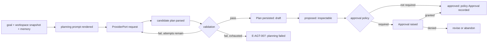

# 02 — Planner

The Planner produces and revises Plans: structured, inspectable, persisted decompositions of
a run goal into a Task graph. This chapter specifies plan production, direct-execution plans
for trivial goals, the mid-execution revision protocol, and the approval interplay. Plan and
Task shapes and invariants are Volume 2's; the Plan machine's full definition is in
[chapter 05](05-core-state-machines.md); execution of the produced tasks is
[chapter 03](03-execution-engine.md)'s. The Planner reaches models only through requests
assembled with the Context Manager and Prompt Engine, and never touches tools.

## Planning pipeline



**Prose for the diagram.** Planning starts from the run goal, the workspace snapshot
(WorkspacePort `Snapshot`), and retrieved memory and context material supplied by the Context
Manager. The Prompt Engine renders the planning template; the model produces a candidate
plan; the Planner parses and validates it deterministically. Validation failures re-prompt
with structured feedback up to `agent.planner.max_attempts`, after which planning fails with
E-AGT-007. A valid plan persists as a Plan row in `draft` with its Task rows, moves to
`proposed` for inspection, and resolves to `approved` either through an interactive Approval
or through a policy auto-approval recorded as an Approval with `decided_by_kind = policy`
(INV-PLAN-03). A denial routes to revision (a new candidate) or, when the user abandons the
run, to plan abandonment. The constraints the diagram encodes: no task ever starts before an
approved plan exists; validation is code, not model judgment; and every candidate — accepted
or not — leaves an inspectable record.

## Plan production rules

1. **Structured first.** When the model's CapabilitySet declares `structured_outputs`, the
   Planner requests the plan against its JSON Schema (validated per ADR-024). Otherwise it
   uses a delimited text protocol rendered by the planning template and parses defensively;
   the difference never changes the persisted Plan shape (ADR-041).
2. **Deterministic validation.** A candidate plan MUST pass, in order: schema validity; task
   count within `agent.planner.max_tasks_per_plan`; ordinal density (1-based, dense);
   dependency references onto tasks of the same plan only (INV-TASK-01); acyclicity
   (INV-TASK-02); non-empty title per task. Any failure is reported to the model as
   structured feedback on re-prompt attempts.
3. **Direct-execution plans.** Goals the Planner classifies as single-step (a question to
   answer, one file to read and summarize) produce a **direct-execution plan**: one task
   whose description is the goal itself. This keeps the invariant that every run executes
   through a plan (uniform records, uniform approval gates) without ceremony for trivial
   goals (ADR-041).
4. **Announced provenance.** Each Plan records `produced_by_agent_id`, the objective, and a
   rationale summary; plan content is model output and is treated with model-output trust
   (Volume 9 threat model).

## Revision protocol

Revision triggers are: a task failed with retries exhausted (chapter 03), the executing
agent reports the plan no longer fits observations, the user requests a change, or budget
pressure requires descoping. The protocol preserves INV-PLAN-02 (at most one non-terminal
plan per run):

1. The active Plan moves `executing` → `revising`; running tasks continue unless the trigger
   cancels them; no new tasks start.
2. The Planner produces a successor candidate: remaining and new work only — completed and
   skipped tasks are never duplicated into the successor; their outcomes are referenced in
   the successor's rationale.
3. On successful validation, one transaction moves the predecessor to `superseded` and
   persists the successor as `draft` with `supersedes_id` set (INV-PLAN-01); the successor
   then follows `proposed` → `approved` per the approval policy.
4. If revision is abandoned (the Planner concludes no change is needed, or the user cancels
   the revision), the Plan returns `revising` → `executing` and no successor row exists.
5. If a persisted successor is rejected at `proposed`, it records `abandoned`; the run
   returns to `planning` and either produces another revision or concludes per the user's
   decision — a superseded predecessor never resumes.

Revisions per run are bounded by `agent.planner.max_revisions`; the bound breached concludes
the run as `cancelled` with the policy reason recorded (E-AGT-005 semantics apply to
revision circling exactly as to iteration circling).

## Approval interplay

Plan approval modes, configured by `agent.planner.approval_mode`:

| Mode | Behavior |
|---|---|
| `always` | Every plan version requires an interactive Approval before `approved` |
| `policy` | The Permission Manager's policy resolution decides per run context (default) |
| `never` | Plans auto-approve; the auto-approval is still recorded as a policy Approval |

In non-interactive sessions, `always` and unresolved `policy` evaluations deny by rule —
plans do not hang on prompts that cannot be shown (PRD-009); the run concludes `cancelled`
with the recorded reason. User plan edits at `proposed` produce a new version through the
revision protocol (the edited plan is a successor with `supersedes_id` set); the engine
never mutates a proposed plan in place.

## Requirements

### FR-AGT-007 — Plan production

- Type: Functional
- Status: Approved
- Priority: P0
- Phase: MVP
- Source: Provided
- Owner: Planner (Volume 4)
- Affected components: Planner, Agent Engine, Prompt Engine, Context Manager, Persistence Layer
- Dependencies: ADR-041, ADR-042 context (retry classification for planning attempts); FR-AGT-001; INV-PLAN-01 through INV-PLAN-04, INV-TASK-01, INV-TASK-02 (Volume 2)
- Related risks: RISK-AGT-002

#### Description

For every run, the Planner MUST produce a Plan through the pipeline of this chapter:
model-produced candidate, deterministic validation (schema, task bounds, ordinal density,
same-plan dependencies, acyclicity, non-empty titles), persistence as `draft` with Task rows,
and progression to `proposed`. Structured outputs are used when the CapabilitySet declares
them; the text-protocol fallback MUST yield an identical persisted shape. Validation failures
re-prompt with structured feedback at most `agent.planner.max_attempts` times before failing
with E-AGT-007. Trivial goals MUST produce a direct-execution plan rather than bypassing
planning.

#### Motivation

Inspectable plans are MVP item 4 and a product gate (PRD-005): the user can see and stop
what an agent intends before it acts; uniform plan records make every run explainable
(PRD-006).

#### Actors

Agent Engine requesting plans; Planner; models producing candidates; users inspecting.

#### Preconditions

A Run in `planning`; rendered planning template; workspace snapshot available.

#### Main flow

1. The Planner assembles the planning request (context material, snapshot, goal).
2. The model returns a candidate; the Planner parses it.
3. Validation passes; the Plan and Tasks persist (`draft`); the plan moves to `proposed`.
4. Approval interplay (FR-AGT-009) resolves it toward `approved`.

#### Alternative flows

- Validation failure with attempts remaining: re-prompt with the specific violations as
  structured feedback.
- Direct-execution classification: a single-task plan persists without a decomposition
  request when the classifier is confident; otherwise the full pipeline runs.

#### Edge cases

- Model returns more tasks than `agent.planner.max_tasks_per_plan`: validation fails with
  the bound in feedback; the model is asked to consolidate.
- Dependency onto a nonexistent ordinal: validation failure (INV-TASK-01 pre-check).
- Provider without `structured_outputs`: text protocol; parse failures count against
  attempts.
- Planning during resume with an intact approved plan: production is skipped; the existing
  plan continues (FR-AGT-003).

#### Inputs

Run goal, workspace snapshot, context material, profile parameters.

#### Outputs

Persisted Plan (`draft` → `proposed`) with Task rows; `plan.drafted` and `plan.proposed`
events; validation feedback records.

#### States

Plan machine per chapter 05 (`draft`, `proposed`, onward); tasks start `pending`.

#### Errors

E-AGT-007 (plan validation failed after attempts); provider failures per Volume 5 map to
planning attempt failures; E-AGT-010 render failures abort before any request.

#### Constraints

At most one non-terminal Plan per run (INV-PLAN-02); validation is engine code — a plan that
fails validation never persists as `proposed`; planning requests count against run budgets
(FR-AGT-005).

#### Security

Plan content is untrusted model output: it is data until approved, and approval gates are
policy-controlled (Volume 9); planning prompts pass the same redaction gates as any turn.

#### Observability

`plan.drafted`/`plan.proposed` events with version and task count; per-attempt validation
outcomes recorded; planning spans under the run trace.

#### Performance

Planning attempts are bounded; budgets for planning latency are Volume 12's.

#### Compatibility

Capability-keyed structured/text paths (Principle 2); no provider-specific plan formats.

#### Acceptance criteria

- Given a goal and a scripted structured-output model, when planning runs, then a valid Plan
  persists with dense ordinals, acyclic dependencies, and `plan.proposed` emitted.
- Negative case: given a model returning a cyclic dependency graph every attempt, when
  attempts exhaust, then E-AGT-007 returns, no Plan reaches `proposed`, and the run applies
  error propagation.
- Given a trivial goal, when classified, then a one-task direct-execution plan persists and
  the run proceeds through the same approval gates.
- Observability case: given any planning attempt, when records are inspected, then the
  candidate digest, validation verdicts, and attempt count are present.
- Permission case: plan approval requirements are never bypassed by production — a plan
  reaching `executing` without an Approval row is a defect the validator suite detects
  (INV-PLAN-03).

#### Verification method

Golden decomposition tests over recorded fixtures; property tests on validation (acyclicity,
density, bounds); fallback-path parity tests (structured vs text produce identical shapes);
integration tests with validation-failure doubles (Volume 13).

#### Traceability

PRD-005, PRD-006; ADR-041; FR-AGT-001, FR-AGT-008, FR-AGT-009; INV-PLAN-02, INV-TASK-02;
UC-01.

### FR-AGT-008 — Plan revision

- Type: Functional
- Status: Approved
- Priority: P0
- Phase: MVP
- Source: Provided
- Owner: Planner (Volume 4)
- Affected components: Planner, Agent Engine, Execution Engine, Persistence Layer
- Dependencies: FR-AGT-007; ADR-041; INV-PLAN-01, INV-PLAN-02 (Volume 2)
- Related risks: RISK-AGT-002

#### Description

The Planner MUST revise plans mid-execution through the five-step protocol of this chapter:
`executing` → `revising` on a recorded trigger; successor production covering only remaining
and new work; atomic supersession (predecessor `superseded` and successor `draft` in one
transaction, `supersedes_id` referencing version − 1); approval of the successor per policy;
and the abandonment paths (`revising` → `executing` when no successor persists; successor
`abandoned` returning the run to `planning`). Revisions are bounded by
`agent.planner.max_revisions` per run. Completed and skipped tasks MUST never be duplicated
into or re-executed by a successor plan.

#### Motivation

Plans meet reality: failures, discoveries, and user direction changes must reshape intent
without losing the audit lineage of what was intended when (PRD-006) and without
re-executing finished work (PRD-010 discipline applied to planning).

#### Actors

Executing agents reporting triggers; users requesting changes; Planner; Execution Engine
pausing intake.

#### Preconditions

An active Plan in `executing`; a recorded revision trigger.

#### Main flow

Steps 1–5 of the revision protocol.

#### Alternative flows

- User edit at `proposed`: the edit is a successor version through the same protocol; the
  engine never mutates a proposed plan in place.
- Budget-pressure descoping: the successor drops tasks with the descoping rationale
  recorded; dropped tasks in the predecessor record `skipped`.

#### Edge cases

- Trigger during `awaiting_approval`: the pending Approval is cancelled (its subject
  changed); revision proceeds; a fresh Approval covers the successor.
- Concurrent triggers (task failure while the user requests an edit): triggers are queued
  and folded into one revision cycle; one successor results.
- Revision bound reached: the run concludes `cancelled` with the policy reason recorded —
  circling through revisions is stopped exactly like iteration circling.

#### Inputs

Revision triggers with causes; execution feedback; prior plan versions.

#### Outputs

Successor Plan versions with lineage; `plan.revision.started`, `plan.superseded`,
`plan.revision.abandoned` events; updated task graph.

#### States

Plan machine `revising` semantics per chapter 05; predecessor terminal states `superseded`
or `abandoned`.

#### Errors

E-AGT-007 when successor validation exhausts attempts (the predecessor then resumes
`executing` — a failed revision never strands the run without an active plan).

#### Constraints

INV-PLAN-02 at all instants: the successor row is created in the same transaction that
supersedes the predecessor; version numbers dense (INV-PLAN-01).

#### Security

Revision cannot widen task permissions implicitly: successor tasks are evaluated by the
Permission Manager exactly like first-version tasks; user-edited plans carry the editing
user in the Approval chain.

#### Observability

Full revision lineage queryable (which version, why, superseding what); every trigger
recorded with its cause; revision counts in run metrics.

#### Performance

Revision production is a planning attempt under the same budgets and bounds as FR-AGT-007.

#### Compatibility

No provider dependency beyond FR-AGT-007's paths.

#### Acceptance criteria

- Given a failing task with retries exhausted, when revision runs, then the predecessor is
  `superseded`, the successor references it, completed tasks are not duplicated, and the run
  continues under the approved successor.
- Negative case: given successor validation failing every attempt, when the cycle ends, then
  the predecessor resumes `executing` and the trigger is recorded as unresolved.
- Given a user edit at `proposed`, when applied, then a successor version carries the edit
  and the original records `superseded` — never in-place mutation.
- Observability case: given any revised run, when its plan lineage is inspected, then
  versions are dense, each `supersedes_id` resolves, and every revision has a recorded
  trigger.
- Permission case: a successor introducing a task class requiring new permissions raises the
  corresponding approval before that task starts (INV-PLAN-03 carried forward).

#### Verification method

Revision protocol integration tests (trigger fixtures: failure, user edit, descoping);
transactional supersession tests (crash between steps leaves a consistent single active
plan); lineage validators; bound-breach tests (Volume 13).

#### Traceability

PRD-005, PRD-006, PRD-010; ADR-041; FR-AGT-007, FR-AGT-012; INV-PLAN-01, INV-PLAN-02.

### FR-AGT-009 — Plan inspection and approval interplay

- Type: Functional
- Status: Approved
- Priority: P0
- Phase: MVP
- Source: Provided
- Owner: Planner (Volume 4)
- Affected components: Planner, Agent Engine, Permission Manager, CLI/TUI
- Dependencies: FR-AGT-007; PermissionPort contract (Volume 3); Approval states (Volume 2 chapter 09; machine Volume 9)
- Related risks: RISK-AGT-002

#### Description

Every Plan version MUST be inspectable at `proposed` before any of its tasks start: drivers
receive the full task graph, rationale, and lineage. Approval resolution MUST follow
`agent.planner.approval_mode` (`always`, `policy`, `never`) with every resolution — including
auto-approvals — recorded as an Approval row (INV-PLAN-03). In non-interactive sessions,
modes requiring interaction resolve to denial without prompting (PRD-009), concluding the
run `cancelled` with the recorded reason. A denied plan records `abandoned`; denial feedback
from the user MAY seed a revision cycle.

#### Motivation

The plan gate is where human control over autonomy is cheapest: before side effects exist
(PRD-005); recording auto-approvals keeps the audit chain complete even at full autonomy
(PRD-006).

#### Actors

Users approving/denying/editing; Permission Manager; Planner; drivers rendering plans.

#### Preconditions

A Plan in `proposed`.

#### Main flow

1. The plan is presented (TUI panel / CLI structured output per Volume 8).
2. The approval mode resolves: interactive Approval, policy resolution, or recorded
   auto-approval.
3. `granted` moves the plan to `approved`; the run proceeds.

#### Alternative flows

- Denied with feedback: plan `abandoned`; feedback becomes a revision trigger.
- Approval expiry (Volume 9 `expires_at`): treated as denial; the run pauses in
  `awaiting_approval` until expiry, then applies denial semantics.

#### Edge cases

- Mode `never` with a policy that forbids auto-approval for the run's permission context:
  the stricter of the two wins (policy precedence, Volume 9).
- Plan approved, then session suspends before execution: the approval persists with the plan
  (grants intact across suspension, SM-11).

#### Inputs

Proposed plans; user decisions; policy resolutions.

#### Outputs

Approval rows linked via `approved_by`; plan state transitions; `plan.approved` /
`plan.abandoned` events.

#### States

Plan `proposed` → `approved` / `abandoned`; Run `awaiting_approval` interplay per
chapter 05.

#### Errors

Evaluation failures surface as E-SEC-family errors from PermissionPort; denial is a
decision, not an error.

#### Constraints

No task starts before `approved` (INV-PLAN-03); auto-approvals always leave Approval rows;
proposed plans are immutable (edits are successors).

#### Security

The gate is enforced in the Execution Engine's ready computation (chapter 03), not in driver
code — a driver that fails to render the plan cannot accidentally release execution.

#### Observability

Approval latency and outcome recorded; `run.approval.requested` correlates the run, plan,
and Approval IDs.

#### Performance

Waiting in `awaiting_approval` consumes no provider or tool budget; only wall-clock duration
budgets keep counting.

#### Compatibility

Identical gate semantics in TUI, CLI, and IPC drivers (PRD-009).

#### Acceptance criteria

- Given mode `always`, when a plan is proposed, then no task starts before an Approval row
  records `granted`, and denial records `abandoned` with zero tasks started.
- Given mode `never`, when a plan is proposed, then it auto-approves and an Approval row
  with policy attribution exists (audit completeness).
- Negative/permission case: given a non-interactive session with mode `always`, when a plan
  is proposed, then the run concludes `cancelled` with the recorded reason and no prompt was
  attempted.
- Observability case: given any approved plan, when audited, then plan version, Approval ID,
  decider kind, and timestamps chain completely.

#### Verification method

Gate enforcement tests (attempt to start tasks pre-approval must fail); mode matrix tests
(interactive/non-interactive × always/policy/never); audit-chain validators; approval expiry
fixtures (Volume 13).

#### Traceability

PRD-005, PRD-006, PRD-009; FR-AGT-007, FR-AGT-010; INV-PLAN-03; UC-14.

## Configuration

Keys minted by this chapter, in the `[agent.planner]` table (schema and precedence:
Volume 10).

```toml
[agent.planner]
approval_mode = "policy"      # always | policy | never
max_attempts = 3
attempt_timeout = "2m"
max_tasks_per_plan = 30
max_revisions = 10
```

| Key | Type | Default | Meaning |
|---|---|---|---|
| `agent.planner.approval_mode` | string | `policy` | Plan approval mode of this chapter |
| `agent.planner.max_attempts` | integer | `3` | Candidate production attempts per planning cycle |
| `agent.planner.attempt_timeout` | duration | `2m` | Deadline per planning attempt |
| `agent.planner.max_tasks_per_plan` | integer | `30` | Upper bound on tasks in one plan version |
| `agent.planner.max_revisions` | integer | `10` | Revision cycles per run before policy cancellation |

## Events

| Event | Producer | Emitted when | Payload highlights |
|---|---|---|---|
| `plan.drafted` | Planner | Plan row persisted (`draft`) | plan ID, version, task count |
| `plan.proposed` | Planner | `draft` → `proposed` | plan ID, version |
| `plan.approved` | Planner | `proposed` → `approved` | plan ID, approval ID, decider kind |
| `plan.execution.started` | Execution Engine | `approved` → `executing` | plan ID |
| `plan.revision.started` | Planner | `executing` → `revising` | plan ID, trigger |
| `plan.revision.abandoned` | Planner | `revising` → `executing` | plan ID, reason |
| `plan.superseded` | Planner | predecessor terminal, successor drafted | plan ID, successor ID |
| `plan.completed` | Execution Engine | all tasks terminal-successful | plan ID |
| `plan.abandoned` | Planner | discarded without completion | plan ID, reason |

## Error codes

### E-AGT-007 — Plan validation failed

- Category: Model output
- Severity: Error
- User message: "The agent could not produce a valid plan for this goal."
- Technical message: attempt count, per-attempt validation verdicts (schema, bounds, density, cycles), candidate digests
- Cause: every candidate within `agent.planner.max_attempts` failed deterministic validation
- Safe-to-log data: verdict classes, counts, run ID (never raw candidate content in logs)
- Recoverability: recoverable — rephrase the goal, adjust the model, or raise attempts
- Retry policy: attempts are the retry mechanism; no outer automatic retry
- Recommended action: inspect recorded verdicts; simplify or split the goal
- Exit-code mapping: 1
- HTTP mapping: not applicable
- Telemetry event: `run.failed` or `run.revision.started` (context-dependent carrier)
- Security implications: invalid model output is discarded, never partially executed

## Risks

### RISK-AGT-002 — Plan–execution divergence

- Category: Product / technical
- Probability: Medium
- Impact: Medium
- Severity: Medium
- Mitigation: Tool invocations bind to the task that issued them (Volume 2 attribution); the Execution Engine starts only `ready` tasks of the approved plan; work requested outside any task is refused at dispatch; revision is the sanctioned path for scope change (FR-AGT-008)
- Detection: audit-chain tests resolving every side effect to a planned task (SM-13); divergence counters (invocations refused for missing task binding)
- Owner: Execution Engine (Volume 4)
- Status: Open

The failure mode: the plan says one thing, the agent does another, and the inspection gate
becomes theater. Binding every side effect to a task of the approved plan version turns
divergence into a dispatch-time refusal instead of a post-hoc discovery.
