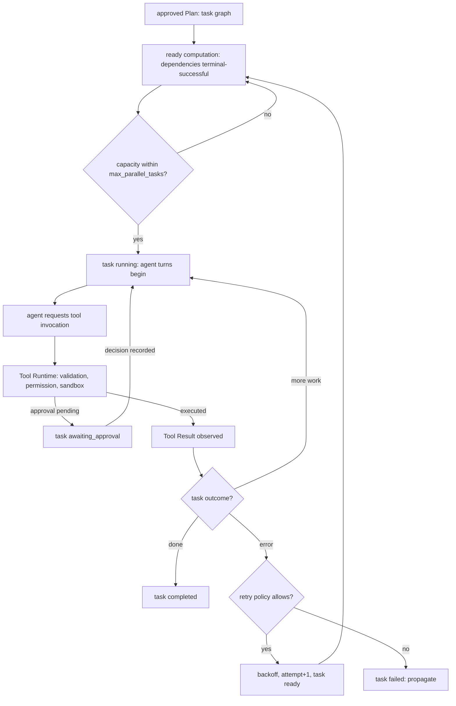

# 03 — Execution Engine

The Execution Engine turns an approved Plan into supervised, recorded work: it computes
which Tasks are ready, dispatches the tool invocations agents request through the Tool
Runtime, drives Task states, applies the retry policy, and propagates errors to the Agent
Engine. It decides neither *what* to do (Planner, Agent Engine) nor *whether* it is
permitted (Permission Manager via the Tool Runtime), and it never spawns processes itself
(Volume 3 boundary). The Task machine's full definition is in
[chapter 05](05-core-state-machines.md).

## Dispatch model



**Prose for the diagram.** From an approved plan, the engine computes the ready set: tasks
whose every dependency reached a terminal-successful state (`completed` or `skipped`,
INV-TASK-03) and whose plan is `executing`. Capacity is bounded by
`agent.execution.max_parallel_tasks`; at MVP the default is 1 (single-agent runs, Volume 1),
and values above 1 execute tasks on separate agent instances under FR-AGT-004 delegation.
A started task runs as agent turns; tool invocations requested during those turns dispatch
exclusively through the Tool Runtime, which owns validation, permission evaluation, sandbox
placement, and the Tool Invocation machine (Volume 6). Approval waits surface as the task's
`awaiting_approval` state; results return as observed Tool Results. Task failures pass the
retry classifier; retryable failures re-enter the ready set after backoff with the attempt
counter incremented; exhausted or non-retryable failures record `failed` and propagate. The
constraints the diagram encodes: no dispatch path bypasses the Tool Runtime; capacity and
ordering are engine truths, not model suggestions; and every arrow that changes task state
persists before its effects are presented (INV-TASK-05).

## Ready computation and ordering

1. A task is **eligible** when its plan is `executing`, its state is `pending`, and every
   `depends_on` entry is `completed` or `skipped` (INV-TASK-03).
2. Eligible tasks move to `ready`; among ready tasks, dispatch order follows plan `ordinal`
   (deterministic tie-break: lowest ordinal first).
3. A dependency reaching `failed` or `cancelled` makes dependents **unsatisfiable**: they
   record `skipped` with the unsatisfied dependency as reason, unless a plan revision
   (FR-AGT-008) restructures them first. When every remaining task is unsatisfiable and no
   revision is possible, the engine raises E-AGT-008 and propagates run failure.
4. `blocked` covers external, non-approval waits (a lock held by another run, a workflow
   gate owned by the Workflow Engine); blocked tasks re-check their condition on the events
   that could clear it and on a bounded poll fallback.

## Retry policy

ADR-042 fixes the shape: bounded exponential backoff with side-effect gating.

| Classification | Auto-retry | Rule |
|---|---|---|
| Retryable error, no side effects recorded in the attempt | yes | Backoff then re-ready, up to `agent.execution.retry.max_attempts` |
| Retryable error, side effects recorded | no | Requires plan revision or explicit user confirmation — never silent re-execution |
| Non-retryable error (per the ADR-016 envelope's retry policy) | no | Task records `failed`; propagation applies |
| Timeout (`agent.execution.task_timeout`) | policy of the timed-out class | Timeout with recorded side effects gates like side-effecting failure |

Backoff: delay = `base_delay × multiplier^(attempt−1)`, capped at `max_delay`, with ±20%
jitter. "Side effects recorded in the attempt" means: any File Change, Command Execution,
git mutation, or network-permission tool result attributed to the attempt (Volume 2
attribution records). The gate exists because a half-applied side effect plus a retry is
how duplicated commits and double-applied patches happen (RISK-ARCH-004's execution-side
face).

## Cancellation, skip, and error propagation

- **Run cancellation** cancels the run's task subtree (FR-ARCH-004): `running` tasks receive
  cooperative cancellation through the Tool Runtime (`Cancel`, then sandbox teardown at the
  deadline); every non-terminal task records `cancelled`.
- **Skip** records deliberate non-execution: revision descoping, unsatisfiable dependents,
  or explicit user skip. Skipped tasks satisfy dependents (INV-TASK-03 counts `skipped` as
  terminal-successful) — a skip states "not needed", not "failed".
- **Propagation**: a task `failed` after policy raises a revision trigger (FR-AGT-008). When
  revision is impossible (bounds exhausted, direct-execution plan, non-interactive denial),
  the failure propagates to the Run per chapter 05 (`failed` with the task's error recorded).
  Approval denials are not failures: the agent observes the denial and adapts (UC-14); only
  the agent's conclusion that the task cannot proceed records the task outcome.

## Requirements

### FR-AGT-010 — Task scheduling and dispatch

- Type: Functional
- Status: Draft
- Priority: P0
- Phase: MVP
- Source: Provided
- Owner: Execution Engine (Volume 4)
- Affected components: Execution Engine, Tool Runtime, Task Scheduler, Agent Engine, Persistence Layer
- Dependencies: FR-AGT-009 (approval gate); FR-ARCH-006; ADR-041; INV-TASK-01 through INV-TASK-05 (Volume 2)
- Related risks: RISK-AGT-002

#### Description

The Execution Engine MUST schedule tasks by the ready computation of this chapter
(dependencies terminal-successful, plan `executing`, ordinal-ordered dispatch, capacity
bounded by `agent.execution.max_parallel_tasks`) and MUST dispatch every tool invocation
through the Tool Runtime — no direct ToolPort, TerminalPort, or GitPort access exists in the
engine. Task state transitions MUST persist via SessionStorePort before their effects are
presented (INV-TASK-05). All task concurrency runs as supervised scheduler tasks inside the
run's group (FR-ARCH-006). Work requested by an agent that does not bind to a task of the
approved plan version MUST be refused at dispatch.

#### Motivation

MVP item 5. The engine is the point where "the plan is what happens" is enforced
(RISK-AGT-002) and where every side effect acquires its attribution chain (PRD-004,
PRD-006).

#### Actors

Agent Engine (turns requesting invocations); Execution Engine; Tool Runtime; Task Scheduler.

#### Preconditions

An approved plan in `executing`; the run's task group alive.

#### Main flow

1. Ready computation produces the dispatch set in ordinal order.
2. A task starts (`ready` → `running`), assigned to its executing agent.
3. Tool invocations dispatch through the Tool Runtime with the task and turn bindings.
4. Results are observed; the task concludes or continues; transitions persist before
   presentation.
5. On plan completion (all tasks terminal-successful), `plan.completed` is emitted and the
   run concludes per chapter 05.

#### Alternative flows

- Approval pending: the task waits in `awaiting_approval`; the decision resumes it.
- Blocked on an external condition: `blocked` with re-check on clearing events.
- Parallel capacity above 1 (Beta): ready tasks dispatch onto delegated agent instances
  (FR-AGT-004) up to the bound.

#### Edge cases

- Dependency failure cascade: dependents record `skipped` (unsatisfiable) with reasons;
  E-AGT-008 raises when nothing remains dispatchable.
- Invocation for an undeclared or plan-unbound purpose: refused at dispatch as data to the
  agent; a refusal counter feeds divergence detection.
- Task with zero invocations (pure reasoning task): concludes from its turns' outcome; the
  record stream still binds turns to the task.

#### Inputs

Approved plans; agent invocation requests; tool results; cancellation signals; approval
decisions.

#### Outputs

Task state transitions and events; Tool Invocation requests to the Tool Runtime; propagated
outcomes to the Agent Engine.

#### States

Task machine per chapter 05, exactly.

#### Errors

E-AGT-008 (dependencies unsatisfiable); tool failures arrive as E-TOOL-family data and map
to task outcomes per the retry policy; scheduler saturation surfaces E-ARCH-005 per its pool
policy.

#### Constraints

No engine-side process spawning; no dispatch outside the Tool Runtime; deterministic
ordering (ordinal) so identical inputs replay identically (SM-12).

#### Security

The engine has no ambient authority: every side-effecting dispatch carries the permission
context evaluated by the Tool Runtime; refusals are recorded decisions (PRD-006).

#### Observability

Span per task; `task.*` events per transition; refusal and capacity metrics; dispatch
ordering reconstructable from records.

#### Performance

Dispatch overhead and capacity defaults are budgeted by Volume 12; ready computation is
incremental (event-driven re-evaluation, not full-graph rescans on the hot path).

#### Compatibility

Platform-independent; tool differences are behind the Tool Runtime.

#### Acceptance criteria

- Given a plan with a diamond dependency graph, when executed, then dispatch order respects
  dependencies and ordinals deterministically across repeated runs.
- Negative case: given an agent requesting an invocation while its plan is `revising`, when
  dispatched, then the request is refused as data and no invocation row is created.
- Permission case: given a task whose invocation requires interactive consent, when
  evaluation returns pending, then the task records `awaiting_approval` and resumes only on
  the recorded decision.
- Error case: given a dependency that fails terminally with no revision possible, when the
  cascade resolves, then dependents record `skipped` with reasons and E-AGT-008 propagates.
- Observability case: given any completed plan, when audited, then every invocation resolves
  to its task, turn, and decision (SM-13) and every transition has its event.

#### Verification method

Deterministic DAG execution tests; dispatch-refusal tests; cancellation storms; audit-chain
validators; capacity matrix tests at bounds 1 and above (Volume 13).

#### Traceability

PRD-004, PRD-005, PRD-006; ADR-041; FR-AGT-009, FR-AGT-011, FR-AGT-012; INV-TASK-03,
INV-TASK-05.

### FR-AGT-011 — Task retry policy

- Type: Functional
- Status: Draft
- Priority: P0
- Phase: MVP
- Source: Design
- Owner: Execution Engine (Volume 4)
- Affected components: Execution Engine, Tool Runtime, Persistence Layer
- Dependencies: ADR-042; FR-AGT-010; ADR-016 (envelope retry policy field)
- Related risks: RISK-ARCH-004

#### Description

The Execution Engine MUST apply the ADR-042 retry policy to task failures: automatic retry
only for failures classified retryable by their error envelope **and** with zero side
effects recorded in the failed attempt; bounded exponential backoff
(`agent.execution.retry.*`: base delay, multiplier, cap, ±20% jitter) with the Task
`attempt` counter incremented per retry; no automatic retry for side-effect-bearing or
non-retryable failures — those require plan revision or explicit user confirmation. Retry
exhaustion records the task `failed` with the final error and full attempt history.

#### Motivation

Transient failures (rate limits, flaky network, busy locks) should not kill runs; but
retrying past a recorded side effect duplicates effects — the gate encodes data integrity
precedence over convenience (Volume 0 precedence order, item 3).

#### Actors

Execution Engine; Tool Runtime reporting results and attributions; users confirming gated
retries.

#### Preconditions

A task failure with its error envelope and the attempt's attribution records available.

#### Main flow

1. Classify: envelope retryability × side-effect presence.
2. Auto-retry path: schedule re-ready after backoff; increment `attempt`; emit
   `task.retried`.
3. Gated path: the task records `failed` (terminal, chapter 05) with its attempt history,
   and a revision trigger or a confirmation request is raised; any further attempt is a
   fresh dispatch decision on new work — never a re-entry of the `failed` task
   (FR-AGT-015).

#### Alternative flows

- Confirmation granted on a gated retry: the confirmation is recorded as an Approval and a
  plan revision (FR-AGT-008) mints a successor task covering the failed task's objective;
  the successor dispatches as new work while the `failed` task stays terminal (FR-AGT-015).
- Backoff interrupted by run cancellation: the pending retry cancels with the subtree.

#### Edge cases

- Retryable failure at `max_attempts`: exhaustion; no further attempts regardless of class.
- Side-effect detection lag (attribution records still committing): classification waits for
  the attempt's batch to commit — the persistence order guarantees the records exist before
  classification runs (INV-TASK-05).
- Clock skew and jitter: backoff uses monotonic timers; jitter is bounded ±20%.

#### Inputs

Error envelopes; attribution records; retry configuration; confirmations.

#### Outputs

Retry schedules; `task.retried` events with attempt numbers and delays; final failure
records with attempt history.

#### States

`running` → `ready` (retry) and `running` → `failed` (exhaustion/gating) per chapter 05.

#### Errors

The retried task's own errors; the policy itself fails closed: unclassifiable errors are
treated as non-retryable.

#### Constraints

Attempts bounded; delays capped; retries never cross a recorded side effect automatically;
attempt history is append-only.

#### Security

Gated retries of permissioned actions re-evaluate permissions on re-dispatch — a grant
consumed by `allow_once` does not silently cover the retry.

#### Observability

Attempt counts, delays, and classifications recorded per retry; retry-rate metrics feed
SM-10-adjacent reliability tracking (Volume 12).

#### Performance

Backoff delays sit outside busy loops (timer-based); retry storms are bounded by attempts ×
tasks and by run budgets.

#### Compatibility

Classification keys off the ADR-016 envelope, uniform across tool origins (built-in,
plugin, MCP).

#### Acceptance criteria

- Given a tool double failing twice retryably (no side effects) then succeeding, when the
  task runs with `max_attempts = 3`, then it completes on attempt 3 with two `task.retried`
  events carrying increasing delays.
- Negative case: given a retryable failure whose attempt recorded a File Change, when
  classified, then no automatic retry occurs and a revision/confirmation path is raised.
- Error case: given exhaustion, then the task records `failed` with the full attempt
  history and propagation applies.
- Permission case: given a gated retry confirmed by the user, when the successor task
  dispatches, then permission evaluation runs afresh, the confirmation is recorded as an
  Approval, and the original task remains `failed`.
- Observability case: attempt history (count, delays, classifications) is reconstructable
  from the task's records alone.

#### Verification method

Fault-injection doubles (retryable/non-retryable × side-effect matrices); property tests on
backoff bounds and jitter; integration tests for gated confirmation; exhaustion fixtures
(Volume 13).

#### Traceability

PRD-005, PRD-010; ADR-042, ADR-016; FR-AGT-010, FR-AGT-008; RISK-ARCH-004.

### FR-AGT-012 — Cancellation, skip, and error propagation

- Type: Functional
- Status: Draft
- Priority: P0
- Phase: MVP
- Source: Derived
- Owner: Execution Engine (Volume 4)
- Affected components: Execution Engine, Agent Engine, Tool Runtime, Task Scheduler
- Dependencies: FR-ARCH-004; FR-AGT-010; ADR-023
- Related risks: RISK-AGT-003

#### Description

The Execution Engine MUST implement the cancellation, skip, and propagation semantics of
this chapter: run cancellation cancels the task subtree through supervision groups with
cooperative tool cancellation then sandbox teardown; skips record deliberate non-execution
and satisfy dependents; task failures raise revision triggers and propagate to run failure
only when revision is impossible; approval denials propagate as data to the agent, never
directly as task failure. Every cancellation records its reason (user, budget, policy,
shutdown, dependency).

#### Motivation

Interruption is product behavior (UC-14, exit code 8 semantics): what stops, what survives,
and what the record says afterward must be deterministic, not emergent.

#### Actors

Users cancelling; Agent Engine concluding; Execution Engine; Tool Runtime tearing down.

#### Preconditions

An executing plan with in-flight tasks.

#### Main flow

1. A cancellation reason arrives (user, budget, policy, shutdown).
2. The subtree cancels: new dispatch stops; running invocations get `Cancel` then teardown
   at the deadline; tasks record `cancelled`.
3. The run concludes per chapter 05 with the reason recorded.

#### Alternative flows

- Selective skip: the user skips one pending task; dependents re-evaluate; execution
  continues.
- Failure propagation: task `failed` → revision trigger → revision or run failure.

#### Edge cases

- Cancellation racing completion: the terminal state written first wins; the loser is a
  no-op (optimistic concurrency, `revision` column).
- A tool ignoring cooperative cancellation: sandbox teardown at the child deadline; the
  Command Execution records `killed`; the invocation records `cancelled`.
- Skip of a `running` task is refused (skips apply to work not yet executed); the user
  cancels instead.

#### Inputs

Cancellation requests with reasons; skip requests; task outcomes.

#### Outputs

Terminal task states with reasons; propagated run outcomes; `task.cancelled`,
`task.skipped` events.

#### States

Task and Run machines per chapter 05.

#### Errors

E-AGT-008 for unsatisfiable remainders; teardown failures surface as E-SEC-family from the
Sandbox Engine and are recorded without blocking conclusion.

#### Constraints

Cancellation reaches every in-flight operation via contexts (FR-ARCH-004); no new work
starts after the cancellation instant; reasons are mandatory.

#### Security

Teardown guarantees no orphaned processes retain granted permissions (FR-ARCH-004 security
clause); denial-as-data keeps refused actions refused (UC-14).

#### Observability

Cancellation reasons on every terminal event; cancellation-to-quiescence duration metric
(Volume 12 budget input).

#### Performance

Quiescence latency budgets are Volume 12's; structurally, teardown deadlines bound the wait.

#### Compatibility

Signal and process-tree mechanics via the PAL; semantics identical across platforms.

#### Acceptance criteria

- Given a run with two running tasks and one pending, when the user cancels, then no new
  dispatch occurs, both running tasks record `cancelled`, the pending task records
  `cancelled`, and no child process survives (leak gate).
- Given a wedged tool, when cancellation reaches the child deadline, then teardown produces
  `killed` on the Command Execution and the invocation records `cancelled`.
- Negative case: given a skip request for a `running` task, when applied, then it is refused
  and the task continues unaffected.
- Permission/observability case: given a denial mid-task, when the agent cannot proceed and
  concludes failure, then the record distinguishes the denial (decision) from the failure
  (outcome) with both correlated.

#### Verification method

Cancellation storm tests; wedged-child fixtures; race tests (cancel vs complete); reason
propagation validators; leak gates (NFR-ARCH-004) (Volume 13).

#### Traceability

PRD-005, PRD-010; FR-ARCH-004; FR-AGT-003, FR-AGT-010; UC-14.

## Configuration

Keys minted by this chapter, in the `[agent.execution]` table (schema and precedence:
Volume 10).

```toml
[agent.execution]
max_parallel_tasks = 1
task_timeout = "30m"

[agent.execution.retry]
max_attempts = 3
base_delay = "1s"
max_delay = "60s"
multiplier = 2.0
```

| Key | Type | Default | Meaning |
|---|---|---|---|
| `agent.execution.max_parallel_tasks` | integer | `1` | Concurrent task bound per run; values above 1 require delegation (Beta) |
| `agent.execution.task_timeout` | duration | `30m` | Deadline per task attempt; `0s` defers entirely to run duration budgets |
| `agent.execution.retry.max_attempts` | integer | `3` | Total attempts per task including the first |
| `agent.execution.retry.base_delay` | duration | `1s` | First backoff delay |
| `agent.execution.retry.max_delay` | duration | `60s` | Backoff cap |
| `agent.execution.retry.multiplier` | float | `2.0` | Exponential backoff multiplier |

## Events

| Event | Producer | Emitted when | Payload highlights |
|---|---|---|---|
| `task.created` | Planner | Task rows persisted with their plan | task ID, plan ID, ordinal |
| `task.scheduled` | Execution Engine | `pending` → `ready` | task ID |
| `task.started` | Execution Engine | `ready` → `running` | task ID, agent ID, attempt |
| `task.blocked` | Execution Engine | `running` → `blocked` | task ID, condition |
| `task.unblocked` | Execution Engine | `blocked` → `ready` | task ID |
| `task.approval.requested` | Execution Engine | → `awaiting_approval` | task ID, approval ID |
| `task.resumed` | Execution Engine | `awaiting_approval` → `running` | task ID, decision |
| `task.retried` | Execution Engine | retry scheduled | task ID, attempt, delay |
| `task.interrupted` | Runtime/recovery | → `interrupted` | task ID |
| `task.completed` | Execution Engine | terminal success | task ID, result summary digest |
| `task.failed` | Execution Engine | terminal failure | task ID, error code, attempts |
| `task.cancelled` | Execution Engine | terminal cancellation | task ID, reason |
| `task.skipped` | Execution Engine | deliberate non-execution | task ID, reason |

## Error codes

### E-AGT-008 — Task dependencies unsatisfiable

- Category: State
- Severity: Error
- User message: "The plan cannot make progress: remaining tasks depend on work that failed or was cancelled."
- Technical message: unsatisfiable task IDs, blocking dependency outcomes, revision availability
- Cause: terminal-unsuccessful dependencies leave no dispatchable task and no revision path is available
- Safe-to-log data: task IDs, dependency outcome classes, run ID
- Recoverability: recoverable through plan revision or a new run
- Retry policy: none (structural condition, not transient)
- Recommended action: inspect the failed dependency; revise the plan or re-run with a changed approach
- Exit-code mapping: 1
- HTTP mapping: not applicable
- Telemetry event: `run.failed`
- Security implications: refusing to guess around failed prerequisites protects downstream integrity
