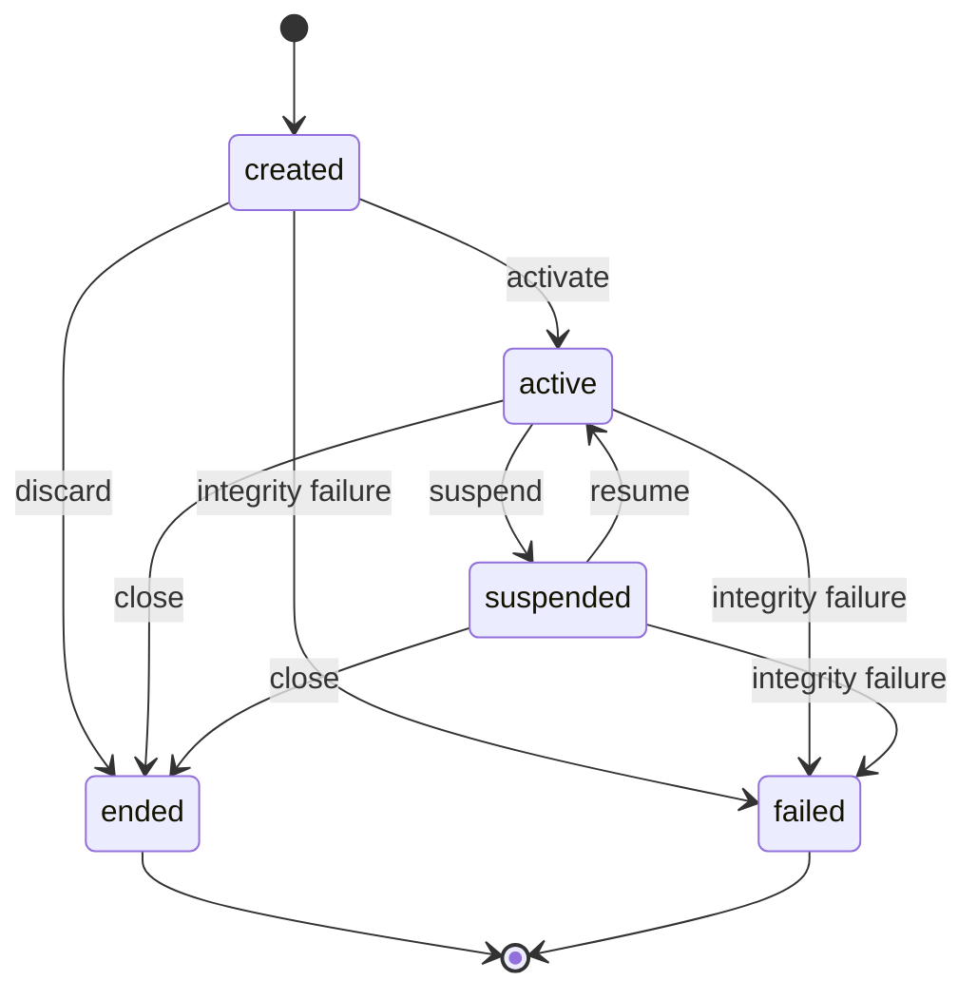
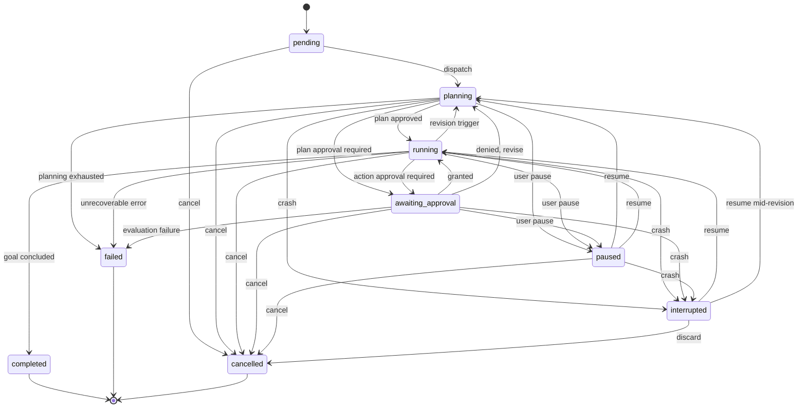
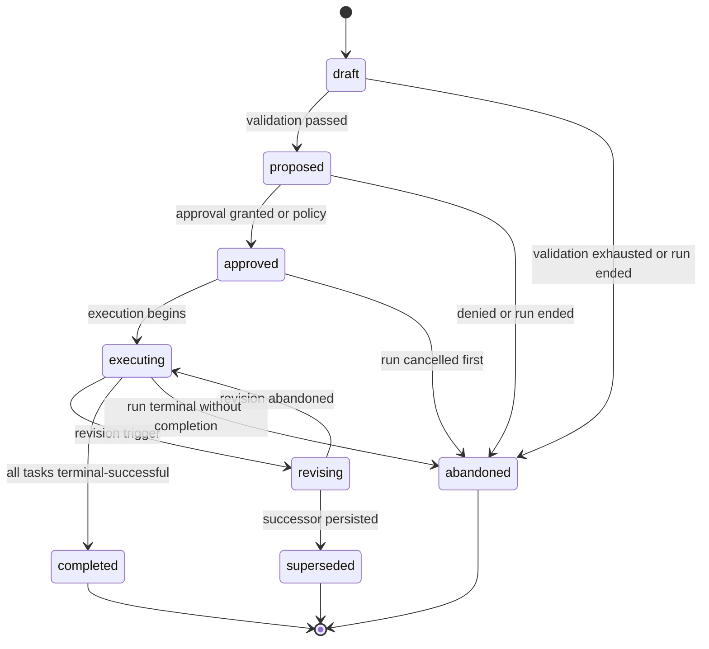
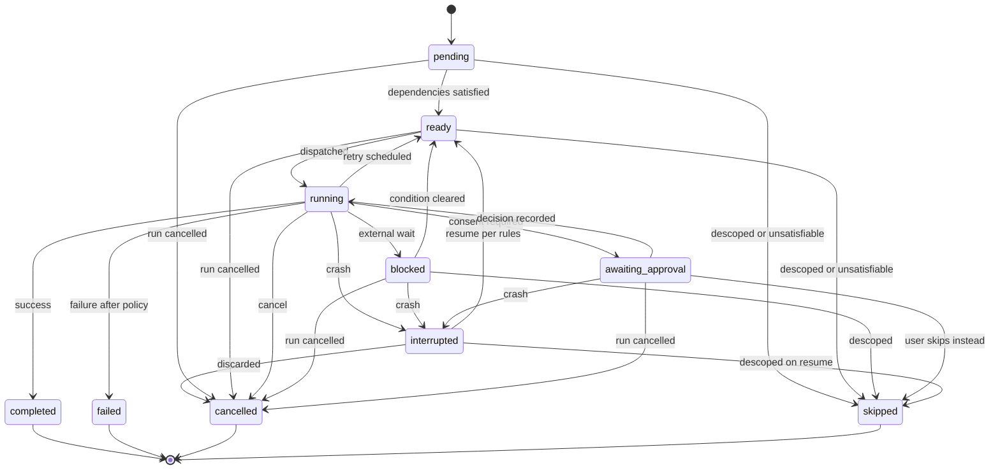
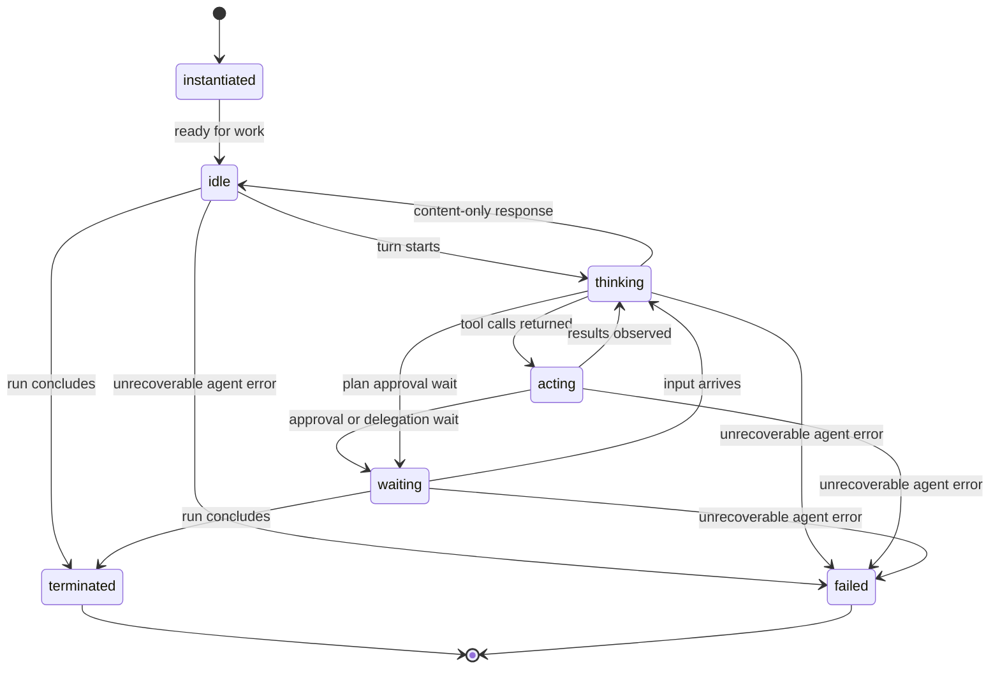

# 05 — Core State Machines

This chapter defines the full state machines for the five core execution entities whose
canonical state names Volume 2 chapter 09 freezes and whose machines Volume 4 owns:
**Session**, **Run**, **Plan**, **Task**, and **Agent**. Each machine defines the twelve
mandatory elements of Volume 0 chapter 02: initial state, terminal states, transitions,
events, guards, side effects, persistence, recovery, timeouts, cancellation, retries, and
errors — using exactly the frozen names. Common rules first, then the machines.

## Common rules

1. **Persistence.** Every transition persists through SessionStorePort in the same
   transactional batch as the records it produces, before its effects are presented to the
   user (Volume 2 write discipline; INV-TASK-05 generalized). Optimistic concurrency uses
   the entity's `revision` column: a losing concurrent writer retries its read-decide-write
   cycle or abandons with E-AGT-003 semantics where the entity became terminal.
2. **Events.** Every transition emits at least one Event (INV-EVT-03) with the names minted
   in chapters 01–03; payload envelope per Volume 10.
3. **Legality.** The Core Domain encodes the legal transition sets of this chapter as data
   (Volume 3); engines MUST reject illegal transitions with E-AGT-011 rather than writing
   them. Terminal states are frozen forever (INV-RUN-03).
4. **Recovery.** On startup, the FR-ARCH-009 procedure moves entities that claim a live
   state under the crashed incarnation into their recovery states as defined per machine
   below; recovery is idempotent and append-only.
5. **Cancellation reasons.** Every transition into `cancelled` records one reason from the
   closed set: `user`, `budget`, `policy`, `shutdown`, `dependency`.

## Session

**Prose.** A Session is created (`created`), attaches to a live process (`active`), rests
between engagements (`suspended`), and closes (`ended`) or dies of record corruption
(`failed`). Sessions are the durability anchor: `suspended` is a legitimate long-term
resting state holding runs, grants, and memory for later resumption (PRD-010). The diagram's
constraint: there is no path from a terminal state — resuming an `ended` session is
structurally impossible (INV-SES-02); users start a new session over the same workspace
instead.

| From | To | Trigger | Guard | Side effects | Event |
|---|---|---|---|---|---|
| created | active | first driver attach | workspace open; store `revision` current | `started_at`, `last_active_at` set | `session.activated` |
| created | ended | user discards before activation | no runs exist | `ended_at` set (INV-SES-04) | `session.ended` |
| active | suspended | explicit suspend; driver detach; idle timeout; orderly shutdown | no run in `planning`/`running`/`awaiting_approval` — active runs first pause or interrupt | flush pending appends; release live resources | `session.suspended` |
| suspended | active | resume command (UC-11) | session readable; `revision` match | `last_active_at` updated | `session.resumed` |
| active | ended | user close; retention policy | all runs terminal (INV-SES-05) | `ended_at` set; session-scoped grants expire (Volume 9) | `session.ended` |
| suspended | ended | user close; retention policy | all runs terminal | as above | `session.ended` |
| created / active / suspended | failed | integrity validation failure of the session record set | corruption confirmed (ADR-029 path) | `ended_at` set; error recorded | `session.failed` |

- **Initial state:** `created`. **Terminal states:** `ended`, `failed`.
- **Persistence:** workspace database `sessions` row; transitions per common rule 1.
- **Recovery:** a session `active` under a crashed incarnation moves to `suspended` during
  recovery, after its runs are marked `interrupted` — a crash yields a resumable session,
  never a corrupt one (PRD-010).
- **Timeouts:** `agent.session.idle_suspend_after` (chapter 01) auto-suspends idle active
  sessions; `0s` disables. No other timers.
- **Cancellation:** sessions are not cancelled; they suspend or end. Closing a session with
  non-terminal runs is refused until runs conclude or are cancelled (INV-SES-05).
- **Retries:** none at machine level; failed activation (e.g., workspace conflict,
  E-AGT-002) leaves the session `created`/`suspended` unchanged.
- **Errors:** E-AGT-003 (not resumable), E-AGT-002 (activation blocked by exclusivity);
  integrity failures follow ADR-029 semantics (exit code 9) and land in `failed`.

## Run

**Prose.** A Run is accepted (`pending`), plans (`planning`), executes (`running`), and can
wait on approvals (`awaiting_approval`), rest under explicit user pause (`paused`), or
surface a crash (`interrupted`). Three terminal outcomes exist: `completed` (goal reached,
all effects recorded), `failed` (recorded error), `cancelled` (user, budget, policy,
shutdown-with-discard, or dependency cancellation). The diagram's constraints: every path
into execution passes through `planning` (no unplanned side effects — chapter 02);
`interrupted` is entered only by crash marking, never written by a live process; and
resumption re-enters the active states through the conservative rules of FR-AGT-003.

| From | To | Trigger | Guard | Side effects | Event |
|---|---|---|---|---|---|
| pending | planning | Runtime dispatches the run | session `active`; `config_snapshot` persisted (INV-RUN-04) | `started_at` set; root Agent instantiated | `run.started` |
| planning | running | active Plan reaches `approved` | INV-PLAN-03 satisfied | ready computation begins | `run.planned` |
| planning | awaiting_approval | plan approval requires interaction | interactive session | Approval raised via PermissionPort | `run.approval.requested` |
| awaiting_approval | running | plan Approval `granted` | plan moved `approved` | — | `run.resumed` |
| awaiting_approval | planning | plan Approval `denied`/`expired` | revision permitted | denial feedback recorded as revision trigger | `run.resumed` |
| running | awaiting_approval | a gated action needs interactive consent | interactive session | Approval raised; issuing task holds `awaiting_approval` | `run.approval.requested` |
| running | planning | revision trigger (FR-AGT-008) | `max_revisions` not exhausted | active plan → `revising` | `run.revision.started` |
| planning / running / awaiting_approval | paused | user pause | — | prior state persisted for resume; pending Approval remains pending | `run.paused` |
| paused | planning / running | user resume | session `active`; `revision` match | continue at persisted prior state | `run.resumed` |
| planning / running / awaiting_approval / paused | interrupted | crash detected at next start | recovery marking only (`MarkInterrupted`) | turns `in_progress` → `interrupted`; tasks per Task machine | `run.interrupted` |
| interrupted | running / planning | user resumes (UC-11) | FR-AGT-003 conservative rules; expired Approvals re-requested | fresh turn boundary; resume report persisted | `run.resumed` |
| interrupted | cancelled | user discards | — | reason `user` recorded | `run.cancelled` |
| running | completed | active Plan `completed` and goal concluded | all tasks terminal-successful; no pending invocations | `ended_at`; `usage_totals` finalized | `run.completed` |
| planning | failed | planning exhausted (E-AGT-007) with no revision path | — | error recorded; subtree cancelled | `run.failed` |
| running / awaiting_approval | failed | unrecoverable error after policy (FR-AGT-012) | — | error recorded; subtree cancelled | `run.failed` |
| pending / planning / running / awaiting_approval / paused | cancelled | user cancel; budget (E-AGT-004); iteration/revision policy (E-AGT-005); dependency (E-AGT-008) | — | reason recorded; subtree cancelled (FR-ARCH-004) | `run.cancelled` |

- **Initial state:** `pending`. **Terminal states:** `completed`, `failed`, `cancelled`.
- **Persistence:** `runs` row plus the incremental record stream (turns, messages, plans,
  tasks) appended per common rule 1 — the hot write path of SessionStorePort.
- **Recovery:** non-terminal runs under a crashed incarnation → `interrupted`
  (FR-ARCH-009 step 2); resumption per FR-AGT-003; a run found `pending` (never dispatched)
  stays `pending` and re-offers.
- **Timeouts:** `max_duration` budget (FR-AGT-005) → `cancelled` with reason `budget`;
  approval waits bound by the Approval's `expires_at` (Volume 9), expiry applying denial
  semantics; turn-level `agent.loop.turn_timeout` fails the turn, not the run, feeding
  retry/revision paths.
- **Cancellation:** any non-terminal state → `cancelled` with a recorded reason; the
  subtree cancels per FR-ARCH-004; an orderly shutdown without user discard records
  `interrupted` (resumable), not `cancelled`.
- **Retries:** the run itself never auto-retries; retries exist at planning-attempt
  (chapter 02) and task (chapter 03) granularity.
- **Errors:** E-AGT-004, E-AGT-005 (policy conclusions), E-AGT-007 (planning), E-AGT-008
  (unsatisfiable), E-AGT-003 (resume refusal), E-AGT-011 (illegal transition attempts);
  provider/tool errors reach the run only through the propagation rules of chapter 03.

## Plan

**Prose.** A Plan version is produced (`draft`), presented (`proposed`), accepted
(`approved`), and executed (`executing`); mid-execution revision passes through `revising`,
ending either back in `executing` (no successor needed) or in `superseded` (a successor
version was persisted in the same transaction — INV-PLAN-02 holds at every instant).
Terminal states: `completed` (all tasks terminal-successful), `superseded`, and `abandoned`
(discarded without completion: validation exhaustion, denial, or the run ending first). The
diagram's constraint: `superseded` is reachable only from `revising` — supersession is
always a deliberate, recorded revision, never a side effect.

| From | To | Trigger | Guard | Side effects | Event |
|---|---|---|---|---|---|
| draft | proposed | deterministic validation passed (FR-AGT-007) | task rows persisted; INV-PLAN-01 lineage valid | plan rendered inspectable to drivers | `plan.proposed` |
| draft | abandoned | validation attempts exhausted (E-AGT-007); run ended | — | verdicts recorded | `plan.abandoned` |
| proposed | approved | Approval `granted`, or policy auto-approval | Approval row exists (INV-PLAN-03) | `approved_by` set | `plan.approved` |
| proposed | abandoned | Approval `denied`/`expired`; run ended | — | denial feedback recorded | `plan.abandoned` |
| approved | executing | Execution Engine begins ready computation | run in `running` | tasks `pending` become eligible | `plan.execution.started` |
| approved | abandoned | run cancelled before execution | — | reason recorded | `plan.abandoned` |
| executing | revising | recorded revision trigger (FR-AGT-008) | `max_revisions` not exhausted | new task starts stop; running tasks continue unless trigger cancels them | `plan.revision.started` |
| revising | executing | revision abandoned — no successor needed | no successor row persisted | trigger recorded as resolved-without-change | `plan.revision.abandoned` |
| revising | superseded | successor validated | successor persists as `draft` in the same transaction; `supersedes_id` = this plan | remaining tasks of this version record `skipped` (reason: superseded) | `plan.superseded` |
| executing | completed | all tasks terminal-successful | no non-terminal tasks | run may conclude | `plan.completed` |
| executing | abandoned | run reached `failed`/`cancelled` | — | non-terminal tasks already terminal via run cancellation | `plan.abandoned` |

- **Initial state:** `draft`. **Terminal states:** `completed`, `superseded`, `abandoned`.
- **Persistence:** `plans` rows with dense per-run `version`; tasks persist with their plan
  (one transaction per aggregate-consistent change).
- **Recovery:** plans have no `interrupted` state; a crash leaves the persisted plan state
  standing. A plan found `revising` on recovery returns to `executing` when no successor row
  exists (the revision died with the process) — the trigger is re-recorded as unresolved;
  with a persisted successor, the transaction completed and `superseded` already stands.
- **Timeouts:** none of its own; planning attempts are bounded by
  `agent.planner.attempt_timeout` while the plan is in `draft` production upstream.
- **Cancellation:** plans are not independently cancellable; run conclusion drives them to
  `abandoned` per the table.
- **Retries:** validation re-prompts (chapter 02) occur before `draft` persists candidates
  as `proposed`; the machine itself has no retry loops.
- **Errors:** E-AGT-007 (validation exhaustion), E-AGT-011 (illegal transition); approval
  evaluation failures surface as E-SEC-family without moving the plan.

## Task

**Prose.** A Task is defined (`pending`), becomes eligible when its dependencies reach
terminal-successful states (`ready`), and executes (`running`), possibly waiting on external
conditions (`blocked`) or consent (`awaiting_approval`). Crashes surface as `interrupted`
(work never assumed complete, INV-TASK-04). Four terminal states: `completed`, `failed`
(after retry policy), `cancelled`, and `skipped` (deliberate non-execution that satisfies
dependents). The diagram's constraints: retry is the `running` → `ready` edge with the
attempt counter incremented — there is no hidden in-place restart; and `skipped` is
reachable only from non-executing states — running work is cancelled, never skipped.

| From | To | Trigger | Guard | Side effects | Event |
|---|---|---|---|---|---|
| pending | ready | dependencies terminal-successful | INV-TASK-03; plan `executing` | dispatch eligibility | `task.scheduled` |
| pending / ready / blocked | skipped | revision descoping; unsatisfiable dependency; user skip | task not `running` | reason recorded; dependents re-evaluate | `task.skipped` |
| ready | running | Execution Engine dispatches | capacity available; ordinal order | `assigned_agent_id`, `started_at` set; attempt counted | `task.started` |
| running | blocked | external non-approval wait | condition identified and recorded | re-check subscription registered | `task.blocked` |
| blocked | ready | condition cleared (event or bounded poll) | plan still `executing` | — | `task.unblocked` |
| running | awaiting_approval | gated invocation needs interactive consent | interactive session | Approval raised; invocation holds | `task.approval.requested` |
| awaiting_approval | running | decision recorded (`granted`/`denied`/`expired` — denial is data) | run not cancelled | decision delivered to the invocation path | `task.resumed` |
| awaiting_approval | skipped | user skips the task at the prompt | — | pending Approval cancelled | `task.skipped` |
| running | ready | retry scheduled (FR-AGT-011) | retryable class; no side effects in attempt; attempts remain | `attempt` incremented; backoff timer | `task.retried` |
| running | completed | agent concludes success | invocations concluded | `result_summary`, `ended_at` set | `task.completed` |
| running | failed | failure with retry policy exhausted or gated | — | error and attempt history recorded | `task.failed` |
| running / blocked / awaiting_approval | interrupted | crash marking at recovery | recovery only | — | `task.interrupted` |
| interrupted | ready | resume per ADR-043 (read-only auto; side-effecting confirmed) | run resumed; confirmation where required | `attempt` incremented | `task.scheduled` |
| interrupted | cancelled / skipped | run discarded; revision descopes on resume | — | reason recorded | `task.cancelled` / `task.skipped` |
| pending / ready / running / blocked / awaiting_approval | cancelled | run cancellation; user cancels the task | — | cooperative cancel then teardown for running work | `task.cancelled` |

- **Initial state:** `pending`. **Terminal states:** `completed`, `failed`, `cancelled`,
  `skipped`.
- **Persistence:** `tasks` rows; transitions persist before presentation (INV-TASK-05);
  attempt history append-only.
- **Recovery:** `running`/`blocked`/`awaiting_approval` under a crashed incarnation →
  `interrupted` (FR-ARCH-009); `pending`/`ready` carry no in-flight work and stand
  unchanged; tool invocations found `executing` terminate `failed` with an
  interruption-classed Tool Result (their enum has no interrupted state — Volume 3).
- **Timeouts:** `agent.execution.task_timeout` per attempt — expiry classifies per the
  FR-AGT-011 timeout row; approval waits bound by Approval `expires_at` (Volume 9); blocked
  re-checks use bounded poll intervals.
- **Cancellation:** per FR-AGT-012 — cooperative first, teardown at the deadline; reasons
  mandatory.
- **Retries:** FR-AGT-011 exclusively; the machine encodes retry as `running` → `ready`.
- **Errors:** E-AGT-008 (unsatisfiable), E-AGT-011 (illegal transition); tool errors are
  data mapped by the retry classifier.

## Agent

**Prose.** An Agent instance is created from its profile (`instantiated`), awaits objectives
(`idle`), drives model requests (`thinking`), executes tool invocations (`acting`), and
waits on approvals, sub-agents, or external input (`waiting`). It ends `terminated`
(orderly, with the run) or `failed` (recorded error). The machine is deliberately
process-facing: it describes what the instance is doing now, while the durable truth of the
run lives in Run/Turn/Task records. The diagram's constraint: `thinking` and `acting`
alternate through observed results — there is no path that acts without a turn having
requested it.

| From | To | Trigger | Guard | Side effects | Event |
|---|---|---|---|---|---|
| instantiated | idle | engine accepts the instance into the run | profile snapshot resolved (INV-AG-03) | — | `agent.state.changed` |
| idle | thinking | turn pipeline starts | no in-progress turn for this agent (INV-TRN-02); boundary checks pass | Turn row `in_progress` | `agent.state.changed` |
| thinking | acting | model response contains tool calls | calls parse and bind to the task | invocations dispatched via chapter 03 | `agent.state.changed` |
| thinking | idle | content-only response; turn closes | — | messages appended; turn `completed` | `agent.state.changed` |
| acting | thinking | all requested invocations concluded | results appended as observations | next turn eligible | `agent.state.changed` |
| acting | waiting | invocation gated on Approval; delegation outstanding | — | wait subject recorded | `agent.state.changed` |
| thinking | waiting | plan approval gate reached mid-planning | — | wait subject recorded | `agent.state.changed` |
| waiting | thinking | decision/result/input arrives | run active | new turn boundary | `agent.state.changed` |
| idle / waiting | terminated | run reaches a terminal state | — | `ended_at` set | `agent.state.changed` |
| idle / thinking / acting / waiting | failed | unrecoverable agent-level error | — | `error` recorded | `agent.state.changed` |

- **Initial state:** `instantiated`. **Terminal states:** `terminated`, `failed`.
- **Persistence:** `agents` rows; state changes persist with the turn/task batches they
  accompany.
- **Recovery:** the Agent enum has no interrupted state. On recovery, instances of an
  interrupted run in `thinking`/`acting`/`waiting` move to `idle` (their in-flight turn is
  recorded `interrupted`; the run-level `interrupted` state carries the honest
  we-do-not-know signal per PRD-010); this preserves INV-AG-02 — resumption continues the
  same root instance rather than minting a second parentless agent.
- **Timeouts:** `agent.loop.turn_timeout` bounds `thinking`; tool timeouts (Volume 6) bound
  `acting`; approval expiry bounds `waiting`. Expiries move the agent back to `idle` via the
  turn/task failure paths, never directly to `failed`.
- **Cancellation:** run cancellation drives `idle`/`waiting` instances to `terminated` and
  cuts `thinking`/`acting` through turn/invocation cancellation first.
- **Retries:** none at agent level; repair attempts (chapter 01) and task retries
  (chapter 03) operate below and above respectively.
- **Errors:** E-AGT-006 (profile resolution at instantiation), E-AGT-011 (illegal
  transition); provider errors fail turns, not agents, unless unrecoverable for the
  instance.

## Requirements

### FR-AGT-015 — Canonical machine enforcement

- Type: Functional
- Status: Approved
- Priority: P0
- Phase: Core
- Source: Derived
- Owner: Agent Engine (Volume 4)
- Affected components: Core Domain, Agent Engine, Execution Engine, Planner, Runtime, Persistence Layer
- Dependencies: Volume 2 chapter 09 (frozen enums); FR-ARCH-009; FR-AGT-001, FR-AGT-010
- Related risks: RISK-AGT-003

#### Description

The engines of this volume MUST drive the Session, Run, Plan, Task, and Agent machines
exactly as defined in this chapter: only the listed transitions, with their guards evaluated
before the write, their side effects applied in the same transactional batch, and their
events emitted per transition. Illegal transition attempts MUST be rejected with E-AGT-011
and MUST NOT write state. The legal transition sets are encoded as data in the Core Domain
(Volume 3) so the Persistence Layer can enforce them as constraints and drivers can render
legal next actions without engine imports.

#### Motivation

Frozen names without enforced transitions would let states drift into meaninglessness;
enforcement makes the machine tables of this chapter checkable properties instead of
documentation (PRD-006, PRD-010).

#### Actors

All Volume 4 engines writing state; Core Domain legality checks; Persistence Layer
constraints.

#### Preconditions

Core Domain transition data generated from this chapter; storage constraints applied per
Volume 10.

#### Main flow

1. An engine computes a transition with its guard inputs.
2. Legality and guards are checked against the Core Domain data.
3. The transition, its side effects, and its records commit in one batch; the event emits.

#### Alternative flows

- Concurrent writer conflict: the `revision` check fails the second writer; it re-reads and
  re-decides or abandons per its caller's semantics.

#### Edge cases

- Recovery transitions (crash marking) use the same legality data — `interrupted` entries
  are legal only from the states this chapter lists.
- Replay mode (Volume 10) validates recorded transitions against the same data, so a
  corrupted record stream is detected rather than replayed.

#### Inputs

Transition requests with guard inputs; recorded reasons.

#### Outputs

Committed transitions with events; E-AGT-011 rejections with diagnostics.

#### States

All five machines of this chapter.

#### Errors

E-AGT-011; storage-constraint violations surface as integrity errors per ADR-029.

#### Constraints

No engine writes a state column except through the transition path; terminal states are
immutable (INV-RUN-03).

#### Security

State-based gates (plan approval, task consent) rely on transition integrity; enforcement
prevents gate bypass by direct state writes.

#### Observability

Every transition evented; rejected transitions logged with the attempted edge and caller.

#### Performance

Legality checks are table lookups; enforcement adds no I/O beyond the transition's own
batch.

#### Compatibility

Identical across platforms; transition data is versioned with the schema (Volume 10
migrations).

#### Acceptance criteria

- Given the property suite driving each machine with random legal event sequences, when
  executed, then every reached state is legal and every transition emitted exactly its
  event.
- Negative case: given an attempt to write `completed` from `pending` on any machine, when
  submitted, then E-AGT-011 returns and the row is unchanged.
- Error case: given a crafted record stream with an illegal recorded transition, when
  replayed, then replay validation rejects it with the offending edge named.
- Observability case: given any state-changing operation, when its batch is inspected, then
  state write, records, and event enqueueing are in one transaction.

#### Verification method

Property-based machine tests (ADR-017 rapid) over all five machines; illegal-write attempt
tests at engine and storage layers; replay validation fixtures; transition/event parity
validators (Volume 13).

#### Traceability

PRD-006, PRD-010; Volume 2 chapter 09; FR-ARCH-009; NFR-AGT-001; E-AGT-011.

## Non-functional requirements

### NFR-AGT-001 — State transition legality under load

- Category: Reliability
- Priority: P0
- Phase: MVP
- Metric: Illegal or lost state transitions observed across property, race, and crash-injection suites (attempted illegal writes accepted, legal transitions dropped, or transition/event parity violations)
- Target: 0
- Minimum threshold: 0 (any occurrence is a defect)
- Measurement method: property-based machine suites with randomized event orders and concurrent writers; crash-injection runs validated by the record validator (every persisted transition legal, every transition evented)
- Test environment: CI on Tier 1 platforms; race detector enabled (ADR-017/ADR-018 stack)
- Measurement frequency: every mainline commit
- Owner: Agent Engine (Volume 4)
- Dependencies: FR-AGT-015
- Risks: RISK-AGT-003
- Acceptance criteria: All machine suites pass with zero legality or parity violations; the record validator finds zero illegal transitions in any suite-produced database, including crash-injected ones.

### NFR-AGT-002 — Resume fidelity

- Category: Reliability
- Priority: P0
- Phase: MVP
- Metric: (a) Persisted turns lost across interrupt–resume cycles; (b) side-effecting interrupted tasks re-executed without explicit confirmation; (c) permission grants lost across resumption
- Target: 0 for all three
- Minimum threshold: 0 for all three (identity properties of PRD-010; no tolerance)
- Measurement method: crash-injection suite (kill −9 at randomized points per SM-11 method) followed by scripted resume; record diffing between pre-kill and post-resume states; confirmation-prompt assertion fixtures for side-effecting tasks
- Test environment: CI on Tier 1 platforms with the SM-11 harness (Volume 13)
- Measurement frequency: every mainline commit (suite); every release (extended randomized campaign)
- Owner: Agent Engine (Volume 4)
- Dependencies: FR-AGT-003, FR-AGT-015; FR-ARCH-009
- Risks: RISK-AGT-003
- Acceptance criteria: Every injected interrupt resumes with zero lost persisted turns, zero unconfirmed re-execution of side-effecting tasks, and intact grants; violations block merge.

## Error codes

### E-AGT-011 — Illegal state transition

- Category: Internal defect
- Severity: Error
- User message: "An internal state error was detected; the operation was aborted safely."
- Technical message: entity kind and ID, current state, attempted target state, caller component
- Cause: an engine or a corrupted record stream attempted a transition outside this chapter's tables
- Safe-to-log data: entity kind, both states, caller identity (never entity content)
- Recoverability: the operation fails closed; the entity is untouched; recurrence indicates a defect or storage corruption
- Retry policy: not retryable (deterministic)
- Recommended action: report the defect; run integrity checks if recurrent (ADR-029 tooling)
- Exit-code mapping: 1; 9 when raised by replay/integrity validation of stored records
- HTTP mapping: not applicable
- Telemetry event: within the affected entity's event family (rejected-transition diagnostic)
- Security implications: fail-closed enforcement prevents state-gate bypass (approval and permission gates ride on state integrity)

## Risks

### RISK-AGT-003 — Resumption ambiguity across the crash boundary

- Category: Technical / data
- Probability: Medium
- Impact: High
- Severity: High
- Mitigation: Append-before-act persistence (FR-AGT-001); conservative resumption (ADR-043, FR-AGT-003) — side-effecting work never restarts without confirmation; recovery transitions restricted to the legal edges of this chapter; NFR-AGT-002 as a merge-blocking gate
- Detection: SM-11 crash-injection campaigns; record validators comparing pre/post states; confirmation-prompt assertions
- Owner: Agent Engine (Volume 4)
- Status: Open

This is Volume 4's face of RISK-ARCH-004: the database can say a tool was mid-write when the
process died, but not whether the write landed. The machines make the ambiguity explicit
(`interrupted` everywhere it matters) and the resumption rules refuse to guess across it —
the cost is an extra confirmation, the benefit is never duplicating a side effect silently.
