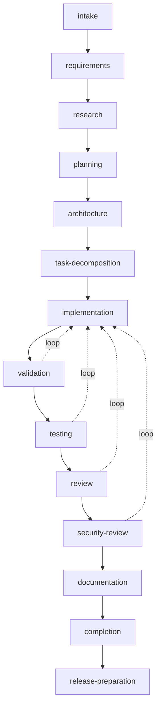

# 06 — Workflow Engine and Specification-Driven Development

This chapter is the behavioral contract of the **Workflow Engine** (component boundary:
Volume 3, chapter 04) and the normative definition of the **specification-driven development
workflow** (keystone FR-WF-001, PRD-012). The entities it drives are Volume 2's: **Workflow**
(versioned definition catalog, Volume 2 chapter 06) and **Workflow Run** (execution instance,
same chapter), with the Workflow Run state names frozen in Volume 2 chapter 09 and the full
machine specified in chapter [07](07-workflow-run-state-machine.md) of this volume. Skill
application during workflow execution is chapter [08](08-skill-engine-runtime.md); scheduling
and durable timers are chapter [09](09-task-scheduler.md).

Single-home boundaries observed throughout: the permission model and Approval machine are
Volume 9's (referenced through PermissionPort); the tool contract is Volume 6's (reached only
through the Execution Engine and Tool Runtime); the event envelope is Volume 10's; storage
mechanics are Volume 10's over SessionStorePort; the agent loop that executes spawned Runs is
this volume's chapter 01 (FR-AGT-001, Agent 4A).

## Workflow definition model

A workflow definition is a declared, versioned orchestration: steps, transitions, gates,
requirements, and artifacts written down before execution (PRD-012). Definitions are
**authored in TOML** and **compiled to the canonical JSON `definition` document** stored on
the Workflow row (ADR-048; serialization rules per Volume 2 chapter 10). One source file
produces one definition version; published versions are immutable (INV-WFD-02).

### Source layout and resolution

- Definition sources live in `.andromeda/workflows/*.toml` (workspace scope), the global
  configuration directory's `workflows/` subdirectory (global scope, ADR-022), and the binary
  (builtin scope). Additional search paths come from the `workflows.paths` configuration key.
- A workflow reference is `name` or `name@version`. A bare `name` resolves to the highest
  non-deprecated, enabled version, searching workspace scope, then global, then builtin. An
  unresolvable reference is E-WF-003.
- Loading a source registers (or re-registers) a definition version after validation;
  registration emits `workflow.definition.registered`, rejection emits
  `workflow.definition.rejected` with E-WF-001 findings.

### Definition structure

The compiled `definition` document contains, exactly:

- **Metadata** — `schema_version` (integer; this chapter defines version `1`), `name`,
  `version` (SemVer), `description`.
- **Inputs** — optional JSON Schema for run inputs (ADR-024), stored as `inputs_schema` on
  the Workflow row.
- **Requirements** — `required_capabilities` (values from the Volume 5 capability enum) and
  tool selectors, verified at instantiation, never assumed (Principle 2).
- **Steps** — an ordered list; each step declares:
  - `id` (unique within the definition), `title`, `kind` — one of `agent` (spawns a Run),
    `gate` (raises an Approval), `transform` (pure data mapping between step outputs and
    inputs; no side effects, no model calls).
  - `depends_on` — step IDs that must reach `completed` or `skipped` first; the step graph
    MUST be acyclic. Steps whose dependencies are satisfied concurrently MAY run in parallel
    up to `workflows.max_parallel_steps`.
  - For `agent` steps: `agent_profile` (Agent Profile selector), `goal` (template rendered by
    the Prompt Engine with run inputs and prior step outputs), `tools` (tool selectors),
    `permissions` (values from the Volume 9 permission enum — every side-effecting step MUST
    declare its permission requirements, INV-WFD-03), `skills` (skill selectors, chapter 08),
    `effects` — `none` | `workspace` | `external` (drives resume rules, chapter 07).
  - For `gate` steps: `subject` (what the human is approving), `expires` (duration; default
    `workflows.default_gate_expiry`), `on_denied` and `on_expired` routing.
  - Common: `timeout` (default `workflows.default_step_timeout`), `retry`
    (`max_attempts`, `backoff`; default `workflows.default_max_attempts`), `on_failed`
    routing, `compensation` (chapter 07 rollback), `artifacts` (declared outputs),
    `entry_criteria` and `exit_criteria` (machine-checkable predicates over inputs, prior
    step statuses, and artifact presence; free-text criteria are recorded for the gate
    approver but are not machine-enforced).
- **Routing** — `on_failed` / `on_denied` / `on_expired` values are `fail` (default for
  `on_failed` and `on_expired`), `cancel` (default for `on_denied`), `continue`
  (mark `failed`, proceed with dependents that do not require this step's success), or
  `route:<step-id>` (bounded loop edge; each loop edge declares `max_loop_iterations`).
- **Outputs** — named mappings from step artifacts/outputs to the Workflow Run `outputs`
  document.

```toml
schema_version = 1
name = "review-and-fix"
version = "1.2.0"
description = "Run tests, review failures, apply fixes under approval."

[[step]]
id = "collect"
title = "Collect failing tests"
kind = "agent"
agent_profile = "default"
goal = "Run the test suite and summarize failures."
tools = ["terminal", "filesystem-read"]
permissions = ["read", "execute", "process_spawn"]
effects = "none"
timeout = "20m"

[[step]]
id = "approve-fix"
title = "Approve proposed fixes"
kind = "gate"
depends_on = ["collect"]
subject = "Apply the proposed fixes to the working tree"
expires = "24h"
on_denied = "cancel"

[[step]]
id = "fix"
title = "Apply fixes"
kind = "agent"
agent_profile = "default"
goal = "Apply the approved fixes and re-run the affected tests."
depends_on = ["approve-fix"]
tools = ["filesystem-write", "terminal"]
permissions = ["read", "write", "execute", "process_spawn"]
effects = "workspace"
timeout = "45m"
retry = { max_attempts = 2, backoff = "30s" }
compensation = { kind = "agent", goal = "Revert the fix changes using the recorded restore point." }
```

The example declares a three-step workflow: a read-only collection step, an approval gate
whose denial cancels the run, and a side-effecting fix step with one retry and a declared
compensation. The following source is rejected at validation with E-WF-001 (duplicate step
ID; `permissions` not an array; unknown routing target):

```toml invalid
[[step]]
id = "fix"
kind = "agent"
permissions = "write"
on_failed = "route:nonexistent"

[[step]]
id = "fix"
kind = "gate"
```

### Validation

Validation runs at registration and again at instantiation (a definition can be valid while
its environment is not). Registration-time checks — all findings reported, not only the
first: TOML parse (ADR-008); schema check of the compiled document (ADR-024);
`schema_version` supported (otherwise E-WF-002); SemVer `version`; step ID uniqueness;
dependency and routing references resolve; step graph acyclic; loop edges carry
`max_loop_iterations` ≥ 1; every side-effecting step declares at least one permission
(INV-WFD-03); capability names belong to the Volume 5 enum; gate steps declare `subject`.
Instantiation-time checks: inputs against `inputs_schema` (E-WF-004); required capabilities
and tools present and enabled (E-WF-005); referenced Agent Profiles resolvable.

## Execution semantics

The Workflow Engine executes a Workflow Run as a persisted state machine (chapter 07). The
execution rules:

1. **Instantiation.** Resolve the reference, validate inputs and requirements, create the
   Workflow Run row (`pending`) with the immutable definition version reference (INV-WFR-01),
   and emit `workflow.run.started` on the transition to `running`.
2. **Step sequencing.** A step becomes eligible when its `depends_on` set is satisfied and
   its machine-checkable `entry_criteria` hold. Eligible steps dispatch in declared order;
   parallel dispatch is bounded by `workflows.max_parallel_steps`. Progression is persisted
   before the next step starts (INV-WFR-03).
3. **Agent steps** spawn a Run through the Agent Engine with `initiator = workflow` and
   `workflow_run_id` set (Volume 2 chapter 03). The spawned Run executes under the invoking
   session's permission scope — a workflow MUST NOT escalate beyond it (Volume 3 chapter 04
   boundary). The step's declared `permissions` are a ceiling communicated to the Permission
   Manager, never a grant.
4. **Gate steps** raise an Approval through `PermissionPort.Request` with subject kind
   `workflow_gate` (Volume 2 chapter 04; Approval machine Volume 9). A gate is passed only
   by a terminal `granted` Approval (INV-WFR-04). Gates block without holding threads
   (chapter 09).
5. **Transform steps** execute in-process with no side effects and no permissions; a
   transform that attempts I/O is a defect (E-ARCH-002 class).
6. **Exit criteria.** A step reaches `completed` only when its machine-checkable
   `exit_criteria` hold; failing exit criteria after a successful spawned Run is a step
   failure (E-WF-008) subject to `retry` and `on_failed` routing.
7. **Artifacts.** Declared step artifacts are recorded as Artifact rows attributed to the
   spawned Run (INV-RUN-05) and listed in `step_states`; `workflow.artifact.recorded` is
   emitted per artifact.
8. **Bookkeeping.** `current_step` and `step_states` are updated at every step transition
   (shape defined in chapter 07); every transition emits an event; the run's history is
   navigable in both directions (INV-WFR-02).
9. **Non-interactive execution** (CI, headless per ADR-032): gates resolve strictly from
   policy; an unresolved gate is a denial, never a hung prompt (PRD-009). Denial routing then
   applies as declared.

## The specification-driven development workflow

The builtin workflow `spec-driven-dev` (ADR-049) implements specification-driven development:
software work proceeds through declared stages, each producing inspectable artifacts, gated
by human approval where policy requires. "Stage" means: a named step of the
`spec-driven-dev` definition; stages obey every step rule of this chapter and chapter 07 —
the stage catalog below defines only what is specific per stage.



**Prose for the diagram.** The fourteen stages execute in the fixed order intake →
requirements → research → planning → architecture → task-decomposition → implementation →
validation → testing → review → security-review → documentation → completion →
release-preparation. Dashed edges are the only permitted feedback loops: validation, testing,
review, and security-review route back to implementation when their exit criteria fail, each
bounded by `max_loop_iterations` (defaults in the table below); exceeding a loop budget fails
the run with E-WF-008. There is no other backward edge — requirement changes discovered
mid-run are recorded as findings and either fail the run or are carried into a new run,
because silently rewriting requirements mid-execution would destroy the traceability the
workflow exists to provide (PRD-006). Constraint: stages cannot be reordered or removed at
run time; tailoring happens by definition version and by gate profile (ADR-049).

### Common stage provisions

These provisions apply to all fourteen stages; the brief's per-workflow definition list
(inputs, outputs, states, transitions, agents, tools, permissions, entry criteria, exit
criteria, retry, cancellation, resume, rollback, artifacts, events, timeouts, errors, human
approval, audit) is satisfied by these provisions plus the per-stage catalog:

- **States and transitions** — stages are steps; per-step statuses and the Workflow Run
  machine are chapter 07's. Stage-level cancellation, resume, and rollback follow chapter 07
  with the stage's `effects` classification.
- **Retry** — per-stage `retry` as in the table; retries re-render the stage goal with the
  failure summary appended.
- **Events** — the `workflow.step.*` and `workflow.gate.*` families of this volume; no
  stage-specific event names exist.
- **Timeouts** — per-stage defaults below, enforced by durable timers (chapter 09); timeout
  is E-WF-009 with `on_failed` routing.
- **Errors** — the E-WF catalog of this volume; stage work failures surface the underlying
  run/tool error inside E-WF-008 context.
- **Human approval** — gate stages per the gate-profile column; `workflows.sdd.gate_profile`
  selects `strict`, `standard`, or `minimal`. Gates present the stage's artifacts and
  exit-criteria evaluation to the approver.
- **Audit** — every gate decision, permission decision, and side-effecting action within a
  stage is recorded per Volume 9 audit semantics; the Workflow Run history plus spawned Run
  records reconstruct the whole stage (SM-12).
- **Artifacts** — every stage that completes MUST have recorded its declared artifacts;
  artifact-free completion of a producing stage fails exit criteria.

| # | Stage | Default timeout | Max attempts | Gate after stage (profile) | Loop budget |
|---|---|---|---|---|---|
| 1 | intake | 15m | 1 | — | — |
| 2 | requirements | 45m | 1 | strict, standard | — |
| 3 | research | 60m | 2 | — | — |
| 4 | planning | 45m | 1 | strict, standard, minimal | — |
| 5 | architecture | 60m | 1 | strict | — |
| 6 | task-decomposition | 30m | 1 | strict, standard | — |
| 7 | implementation | 4h | 1 | — | — |
| 8 | validation | 45m | 2 | — | → implementation, 3 |
| 9 | testing | 90m | 2 | — | → implementation, 3 |
| 10 | review | 60m | 1 | strict | → implementation, 2 |
| 11 | security-review | 60m | 1 | strict, standard | → implementation, 2 |
| 12 | documentation | 45m | 1 | — | — |
| 13 | completion | 20m | 1 | strict | — |
| 14 | release-preparation | 45m | 1 | strict, standard, minimal | — |

### Stage catalog

Agent profile selectors below (`orchestrator`, `researcher`, `planner`, `architect`,
`implementer`, `reviewer`, `security-reviewer`, `documenter`) are selectors declared by the
`spec-driven-dev` definition and resolved against installed Agent Profiles; they are
definition-local names, not a frozen vocabulary. Tools are named by family; concrete tool
names and schemas are Volume 6's.

**Stage 01 — intake.** Purpose: capture the goal, constraints, success criteria, and context
references. Inputs: run inputs (goal statement, optional references). Outputs: intake brief
artifact. Agent: `orchestrator`. Tools: filesystem read/search; memory retrieval. Permissions:
`read`. Entry: run started. Exit: intake brief exists and names goal, constraints, and
success criteria. Effects: `none`.

**Stage 02 — requirements.** Purpose: produce verifiable requirements with acceptance
criteria from the intake brief. Inputs: intake brief. Outputs: requirements document artifact
(requirement statements each with acceptance criteria). Agent: `planner`. Tools: filesystem
read/search. Permissions: `read`. Entry: intake complete. Exit: every requirement has at
least one acceptance criterion; document recorded. Gate: approve requirements. Effects:
`none`.

**Stage 03 — research.** Purpose: investigate the codebase and referenced material; surface
constraints, prior art, and risks. Inputs: requirements document. Outputs: research notes
artifact with source attribution. Agent: `researcher`. Tools: filesystem read/search; git
read operations; http (only when granted). Permissions: `read`; `network` optional — absent
network permission, research proceeds locally and records the limitation. Entry: requirements
approved (when gated) or completed. Exit: research notes recorded; open questions listed
explicitly. Effects: `none`.

**Stage 04 — planning.** Purpose: produce the milestone plan: ordered outcomes, dependencies,
risks. Inputs: requirements, research notes. Outputs: plan document artifact; the spawned
Run's Plan entity per this volume's chapter 02. Agent: `planner`. Tools: filesystem read.
Permissions: `read`. Exit: plan covers every requirement; risks listed. Gate: approve plan
(all profiles). Effects: `none`.

**Stage 05 — architecture.** Purpose: design decisions for the planned work; interface
sketches; decision records for consequential choices. Inputs: plan, research notes. Outputs:
architecture note artifact; draft decision records. Agent: `architect`. Tools: filesystem
read/search. Permissions: `read`. Exit: every plan milestone has a design home; consequential
decisions have recorded alternatives. Gate: approve architecture (strict). Effects: `none`.

**Stage 06 — task-decomposition.** Purpose: decompose milestones into an acyclic task graph
sized for execution. Inputs: plan, architecture note. Outputs: task breakdown artifact
(tasks with dependencies, per-task acceptance checks). Agent: `planner`. Tools: filesystem
read. Permissions: `read`. Exit: graph acyclic; every task carries an acceptance check.
Gate: approve decomposition (strict, standard). Effects: `none`.

**Stage 07 — implementation.** Purpose: execute the task graph — write code and content.
Inputs: task breakdown; approved plan. Outputs: File Changes, Patches, Command Executions
(attributed per INV-RUN-05); implementation summary artifact. Agents: `implementer` (one
spawned Run per execution wave; task-level parallelism per chapter 09). Tools: filesystem
read/write/patch; terminal; git. Permissions: `read`, `write`, `execute`, `process_spawn`,
`git_mutation` (work-branch commits only). Entry: decomposition approved (when gated); a
restore point is recorded before the first side effect (ADR-054). Exit: every task terminal;
acceptance checks pass or failures are explicitly carried to validation. Effects:
`workspace`.

**Stage 08 — validation.** Purpose: verify the implementation against the requirements and
acceptance criteria — statically and by inspection, before tests run. Inputs: requirements,
implementation summary, workspace diff. Outputs: validation report artifact mapping each
requirement to evidence or a finding. Agent: `reviewer`. Tools: filesystem read/diff; git
read. Permissions: `read`. Exit: no unresolved blocking findings; otherwise route to
implementation. Effects: `none`.

**Stage 09 — testing.** Purpose: execute the test suites and record results. Inputs:
workspace, validation report. Outputs: test report artifact (commands, exit codes, failures).
Agent: `implementer`. Tools: terminal; process; filesystem read. Permissions: `read`,
`execute`, `process_spawn`. Exit: configured suites pass; otherwise route to implementation.
Effects: `none` (test side effects are contained to sandbox-scoped temporary paths).

**Stage 10 — review.** Purpose: agent code review of the full diff for correctness and
consistency with the architecture note. Inputs: workspace diff, architecture note, reports.
Outputs: review report artifact (findings with severity). Agent: `reviewer`. Tools:
filesystem read/diff; git read. Permissions: `read`. Exit: no unresolved blocking findings;
otherwise route to implementation. Gate: review sign-off (strict). This stage does not
replace the mandatory human review of pull requests (Volume 11); it precedes it. Effects:
`none`.

**Stage 11 — security-review.** Purpose: security-focused review: injection surfaces, secret
handling, permission use, dependency changes. Inputs: workspace diff, review report. Outputs:
security findings artifact. Agent: `security-reviewer`. Tools: filesystem read/search; git
read. Permissions: `read`. Exit: zero unresolved critical or high findings; otherwise route
to implementation. Gate: security sign-off (strict, standard). Effects: `none`.

**Stage 12 — documentation.** Purpose: update user and contributor documentation and the
changelog entry for the change. Inputs: implementation summary, requirements. Outputs:
documentation File Changes; changelog entry artifact. Agent: `documenter`. Tools: filesystem
read/write. Permissions: `read`, `write`. Exit: every user-visible change has a
documentation delta or an explicit no-doc rationale. Effects: `workspace`.

**Stage 13 — completion.** Purpose: verify the whole run's exit criteria, consolidate
artifacts, and produce the completion report (what was built, evidence per requirement,
deviations). Inputs: all prior artifacts. Outputs: completion report artifact; Workflow Run
`outputs` populated. Agent: `orchestrator`. Tools: filesystem read. Permissions: `read`.
Exit: completion report references every requirement. Gate: accept completion (strict).
Effects: `none`.

**Stage 14 — release-preparation.** Purpose: prepare — never publish — release material:
version-bump proposal per ADR-015 SemVer rules, changelog assembly, release-notes draft.
Publishing and pipelines are Volume 14's. Inputs: completion report, changelog entries.
Outputs: release-preparation artifact set. Agent: `documenter`. Tools: filesystem read/write;
git read. Permissions: `read`, `write`. Exit: version proposal justified against the change
set; notes drafted. Gate: approve release preparation (all profiles). Effects: `workspace`.

## Configuration keys

Key content of the `[workflows]` table (schema, precedence, and validation are Volume 10's):

| Key | Type | Default | Meaning |
|---|---|---|---|
| `workflows.paths` | array of paths | `[]` | Additional definition search paths, appended after workspace scope |
| `workflows.default_step_timeout` | duration | `"30m"` | Step timeout when the definition declares none |
| `workflows.default_gate_expiry` | duration | `"24h"` | Gate expiry when the definition declares none |
| `workflows.default_max_attempts` | integer | `1` | Step attempts when the definition declares no retry |
| `workflows.max_parallel_steps` | integer | `4` | Concurrent step ceiling per workflow run |
| `workflows.max_run_duration` | duration | `"168h"` | Whole-run deadline; expiry is E-WF-009 at run scope |
| `workflows.artifacts_dir` | path | `".andromeda/artifacts"` | Root for artifact content storage within the workspace |
| `workflows.sdd.gate_profile` | enum | `"standard"` | `strict` \| `standard` \| `minimal` gate selection for `spec-driven-dev` |

## Requirements

### FR-WF-001 — Specification-driven development workflow

- Type: Functional
- Status: Approved
- Priority: P0
- Phase: Beta
- Source: Provided
- Owner: Workflow Engine (Volume 4)
- Affected components: Workflow Engine, Agent Engine, Execution Engine, Planner, Permission Manager, Persistence Layer
- Dependencies: FR-WF-002, FR-WF-003, FR-WF-004; ADR-049, ADR-054; PRD-012
- Related risks: RISK-WF-001, RISK-WF-003

#### Description

Andromeda MUST ship the builtin workflow `spec-driven-dev` implementing the fourteen stages
intake, requirements, research, planning, architecture, task-decomposition, implementation,
validation, testing, review, security-review, documentation, completion, and
release-preparation, in that fixed order, with only the four bounded feedback loops of this
chapter, the per-stage specifications of the stage catalog, and gate placement per the
`workflows.sdd.gate_profile` profiles. Each stage MUST satisfy the common stage provisions:
declared inputs, outputs, artifacts, agents, tools, permissions, entry and exit criteria,
retry, timeout, and audit trail.

#### Motivation

PRD-012: repeatable engineering work needs process encoded as declared, resumable,
gate-controlled workflow — not as prompt folklore. The fixed stage set makes runs comparable
and auditable across projects.

#### Actors

Users starting SDD runs; approvers at gates; agents executing stages; CI driving
non-interactive runs.

#### Preconditions

Workflow Engine available (Beta); Agent Profiles resolvable for the stage selectors; workspace
open.

#### Main flow

1. The user starts `spec-driven-dev` with a goal as input.
2. Stages execute in order; artifacts are recorded; gates raise Approvals per the active
   profile.
3. The run completes with the completion report and release-preparation artifacts recorded
   in `outputs`.

#### Alternative flows

- A verification stage fails its exit criteria: the declared loop edge routes back to
  implementation within its loop budget.
- A gate is denied: the declared `on_denied` routing applies (default `cancel`).
- Non-interactive run: gates resolve from policy; unresolved gates deny (PRD-009).

#### Edge cases

- Loop budget exhausted: the run fails with E-WF-008 naming the exhausted edge.
- A stage's Agent Profile selector matches no installed profile: instantiation fails with
  E-WF-005 before any stage runs.
- Network permission absent during research: the stage completes locally and records the
  limitation in its artifact.

#### Inputs

Goal statement and optional references, validated against the definition's `inputs_schema`.

#### Outputs

Fourteen stage artifact sets; Workflow Run `outputs` with the completion report and
release-preparation references.

#### States

Workflow Run frozen states (chapter 07); per-step statuses per chapter 07's `step_states`
shape.

#### Errors

E-WF-004, E-WF-005 at instantiation; E-WF-006/E-WF-007 at gates; E-WF-008/E-WF-009 during
stages; chapter 07 machine errors.

#### Constraints

Stage order and set are fixed per ADR-049; tailoring only via gate profiles and new
definition versions; release-preparation MUST NOT publish anything.

#### Security

Every side-effecting stage declares permissions from the Volume 9 enum; gates are Approvals
with full audit; the workflow cannot exceed the session's permission scope.

#### Observability

Every stage and gate transition emits `workflow.step.*` / `workflow.gate.*` events; the run's
history satisfies SM-12 completeness.

#### Performance

Engine-added orchestration latency per NFR-WF-003; stage duration is dominated by agent work
and bounded by the stage timeouts.

#### Compatibility

The `spec-driven-dev` definition is a public contract surface under SM-20 (NFR-WF-001);
changes ship as new versions.

#### Acceptance criteria

- Given a goal, when a `spec-driven-dev` run executes to completion under the `standard`
  profile, then all fourteen stages appear in `step_states` in order, every producing stage
  has recorded artifacts, and the five standard gates each have a terminal `granted`
  Approval.
- Given a testing stage whose suite fails three times, when the loop budget (3) is exhausted,
  then the run is `failed` with E-WF-008 naming the `testing → implementation` edge.
- Given a denied requirements gate, when routing applies, then the run is `cancelled`, the
  Approval records `denied`, and no later stage ran.
- Permission case: given an implementation stage without `git_mutation` granted, when it
  attempts a commit, then the Tool Runtime denies it, the denial is recorded, and the stage
  outcome reflects the failure — the workflow never bypasses permission mediation.
- Observability case: given any completed run, when its events are replayed, then every stage
  entry/exit and gate decision is present with the run's correlation IDs.

#### Verification method

Workflow E2E suite executing `spec-driven-dev` against scripted provider doubles (Volume 13);
gate-profile matrix tests; loop-budget and denial fixtures; audit-chain validation (SM-13).

#### Traceability

PRD-012, PRD-005, PRD-006; FR-AGT-001; FR-WF-002/003/004; ADR-049, ADR-054; SM-12, SM-13.

### FR-WF-002 — Workflow definition format and validation

- Type: Functional
- Status: Approved
- Priority: P0
- Phase: Beta
- Source: Design
- Owner: Workflow Engine (Volume 4)
- Affected components: Workflow Engine, Configuration Manager, Persistence Layer
- Dependencies: ADR-008, ADR-024, ADR-048; Volume 2 chapter 06 (Workflow entity)
- Related risks: RISK-WF-001

#### Description

Workflow definitions MUST be authored in TOML per the definition structure of this chapter,
compiled to the canonical JSON `definition` document (schema version 1), and validated with
the full registration-time and instantiation-time check lists — reporting all findings, not
only the first. Published versions are immutable (INV-WFD-02); behavioral change mints a new
SemVer version. Scope resolution is workspace, then global, then builtin; a bare name
resolves to the highest non-deprecated enabled version.

#### Motivation

Declared workflows are only trustworthy if their format is a validated, versioned contract:
silent acceptance of malformed definitions would turn orchestration errors into runtime
surprises.

#### Actors

Workflow authors; the Workflow Engine's definition compiler; package-delivered workflow
extensions (Volume 6).

#### Preconditions

Definition source readable in a registered scope.

#### Main flow

1. A source file is loaded and parsed.
2. Registration-time validation passes; the compiled document and `source_hash` persist as a
   Workflow version.
3. `workflow.definition.registered` is emitted.

#### Alternative flows

- Validation fails: no version is registered; E-WF-001 (or E-WF-002 for unsupported
  `schema_version`) returns with the complete findings list; `workflow.definition.rejected`
  is emitted.

#### Edge cases

- Re-registering an identical source (same `source_hash`) is idempotent.
- A source claiming the name/version of an existing published version with a different hash
  is rejected (immutability), with remediation naming the version bump.
- A definition valid at registration whose tools were since removed fails at instantiation
  with E-WF-005, not at registration.

#### Inputs

TOML sources; scope registries; the definition JSON Schema.

#### Outputs

Registered Workflow versions; complete validation reports; events.

#### States

Workflow rows are a stateless versioned catalog (Volume 2); no machine.

#### Errors

E-WF-001, E-WF-002 (registration); E-WF-003 (resolution); E-WF-004, E-WF-005
(instantiation).

#### Constraints

TOML is the only authored format at Beta (ADR-048); the compiled schema is versioned and
migrates per Volume 10 schema-versioning rules.

#### Security

Definition sources are trust-gated when package-delivered (Volume 9 policy via Package
Manager); `source_hash` integrity is verified at load; a definition cannot grant permissions
— it can only declare requirements.

#### Observability

Registration and rejection events carry the findings count and source path; validation
reports are stored with the rejection event's correlation ID.

#### Performance

Validation of a definition with ≤ 50 steps completes within the interactive command budget
(Volume 12); definitions are cached compiled.

#### Compatibility

`schema_version` gates older engines from newer documents deterministically (E-WF-002);
format evolution follows SM-20 via NFR-WF-001.

#### Acceptance criteria

- Given a valid source, when registered, then the Workflow row carries the compiled document,
  `source_hash`, and SemVer version, and re-registration is idempotent.
- Given the invalid example of this chapter, when validated, then all three findings are
  reported together and nothing is registered.
- Negative case: given a document with `schema_version = 99`, when loaded, then E-WF-002
  names the supported range and no partial registration occurs.
- Permission case: given a package-delivered definition failing trust policy, when
  registration is attempted, then it is refused per Volume 9 policy and the refusal is
  audited.
- Observability case: rejection emits `workflow.definition.rejected` with findings count and
  source attribution.

#### Verification method

Golden valid/invalid definition fixture suite (Volume 13); schema round-trip tests
(TOML → JSON → validation); immutability and idempotence tests; trust-gating integration
tests with the Package Manager.

#### Traceability

PRD-012, PRD-007; ADR-008, ADR-024, ADR-048; INV-WFD-02, INV-WFD-03; NFR-WF-001.

### FR-WF-003 — Workflow execution semantics

- Type: Functional
- Status: Approved
- Priority: P0
- Phase: Beta
- Source: Design
- Owner: Workflow Engine (Volume 4)
- Affected components: Workflow Engine, Agent Engine, Execution Engine, Prompt Engine, Persistence Layer, Event Bus
- Dependencies: FR-WF-002, FR-WF-005; ADR-050, ADR-053; Volume 2 INV-WFR-01..04
- Related risks: RISK-WF-002

#### Description

The Workflow Engine MUST execute Workflow Runs per the nine execution rules of this chapter:
validated instantiation; dependency-ordered, criteria-gated step sequencing with bounded
parallelism; agent steps spawned as Runs with `initiator = workflow` under the session's
permission scope; gates via PermissionPort with subject kind `workflow_gate`; side-effect-free
transform steps; exit-criteria enforcement; artifact recording with full attribution;
step-boundary persistence before progression (INV-WFR-03); and policy-only gate resolution on
non-interactive paths.

#### Motivation

These rules are what make a workflow run exactly as auditable, recoverable, and
permission-mediated as an interactive session — the engine composes existing guarantees
rather than adding authority (Volume 3 chapter 04).

#### Actors

Workflow Engine; Agent Engine (spawned runs); Permission Manager (gates); drivers observing
progress.

#### Preconditions

A registered definition version; an active Session; resolved configuration.

#### Main flow

1. Instantiate (validate inputs, requirements); persist `pending`; transition to `running`.
2. Dispatch eligible steps; persist each step transition before dependents start.
3. Record artifacts and outputs; complete when the final step completes.

#### Alternative flows

- `on_failed = continue`: the failed step's non-dependent successors proceed; the run can
  still complete with the failure recorded in `step_states`.
- `route:<step>` loop edges re-enter earlier steps within loop budgets.

#### Edge cases

- Two eligible parallel steps both write the workspace: execution serializes side-effecting
  steps whose declared `effects` is `workspace` or `external` unless the definition declares
  them `parallel_safe = true`; the default prevents write interleaving.
- A spawned Run is cancelled directly by the user: the owning step records `cancelled` and
  the step's `on_failed` routing applies.
- `workflows.max_parallel_steps = 1` degrades to strictly serial execution.

#### Inputs

Definition version, run inputs, approval decisions, spawned run outcomes.

#### Outputs

Workflow Run rows with complete `step_states`, artifacts, `outputs`, events.

#### States

Chapter 07 machine and step statuses.

#### Errors

E-WF-004..E-WF-009; scheduler rejection handling per chapter 09.

#### Constraints

No step executes tools directly — agent steps act only through spawned Runs (Tool Runtime
mediation); transform steps perform no I/O.

#### Security

Step permission declarations are ceilings, not grants; every gate and side effect is
audit-recorded; spawned runs inherit — never widen — the session scope.

#### Observability

`workflow.run.*`, `workflow.step.*`, `workflow.artifact.recorded` events at every
transition; spans per step under the workflow run's trace.

#### Performance

Step transition overhead per NFR-WF-003; parallelism bounded by configuration.

#### Compatibility

Execution semantics are identical across interactive, non-interactive, and headless modes
(PRD-009).

#### Acceptance criteria

- Given a definition with parallel-eligible read-only steps, when executed with
  `workflows.max_parallel_steps = 4`, then they overlap, and given two `workspace`-effect
  steps without `parallel_safe`, then they serialize.
- Given a step whose exit criteria fail after its spawned Run succeeded, when evaluated, then
  the step is `failed` with E-WF-008 and `retry`/`on_failed` apply in that order.
- Negative case: given a crash between a step's completion and its dependent's dispatch, when
  recovered, then the completed step is not re-executed and the dependent dispatches
  (INV-WFR-03).
- Permission case: given an unresolved gate in headless mode, when reached, then it denies
  without prompting and routing applies (PRD-009).
- Observability case: every `step_states` entry's transitions have matching events with the
  run correlation ID.

#### Verification method

Deterministic engine tests over scripted Agent Engine doubles; parallelism and serialization
property tests; crash-injection at step boundaries (SM-11 methodology); headless parity tests.

#### Traceability

PRD-006, PRD-009, PRD-012; FR-AGT-001; FR-WF-005, FR-WF-006; ADR-050, ADR-053; INV-WFR-01..04.

### FR-WF-004 — Workflow approval gates

- Type: Functional
- Status: Approved
- Priority: P0
- Phase: Beta
- Source: Provided
- Owner: Workflow Engine (Volume 4)
- Affected components: Workflow Engine, Permission Manager, Audit Log, TUI/CLI drivers
- Dependencies: FR-WF-003; FR-SEC-100 (permission model keystone); Volume 2 Approval entity; Volume 9 Approval machine
- Related risks: RISK-WF-003

#### Description

Gate steps MUST raise Approvals through `PermissionPort.Request` with subject kind
`workflow_gate`, presenting the gate `subject`, the gated stage's artifacts, and its
exit-criteria evaluation. A gate is passed only by a terminal `granted` Approval
(INV-WFR-04); `denied`, `expired`, and `cancelled` outcomes route per the definition
(defaults: `cancel`, `fail`, `cancel`). Gate expiry uses the definition's `expires` or
`workflows.default_gate_expiry`. On non-interactive paths, gates resolve strictly from
policy; unresolved gates deny. Granted gates are never re-executed on resume; a gate whose
Approval expired while the run was `interrupted` or `paused` is re-requested on resume.

#### Motivation

Gates are the human-control contract of PRD-005 applied to workflows: consequential
transitions get explicit, recorded, expirable human decisions.

#### Actors

Approvers (users); Policy Engine (non-interactive resolution); Workflow Engine.

#### Preconditions

A gate step is eligible; PermissionPort available.

#### Main flow

1. The gate raises an Approval; the run transitions to `awaiting_approval`.
2. The user grants; the Approval records `granted`; the run returns to `running`.
3. The gate step records `completed` with the Approval ID in `step_states`.

#### Alternative flows

- Denial: Approval `denied`; E-WF-006 recorded on the step; `on_denied` routing applies.
- Expiry: Approval `expired`; E-WF-007; `on_expired` routing applies.
- Run cancelled while waiting: the pending Approval is cancelled (Volume 9 machine).

#### Edge cases

- Multiple runs awaiting gates concurrently: Approvals are independent; drivers present them
  per Volume 8 UX; the engine imposes no cross-run ordering.
- Policy pre-grants a gate class: the decision is recorded via `RecordDecision` with
  `decided_by_kind = policy` and the gate passes without interaction — recorded, never
  silent.
- Clock changes while waiting: expiry evaluates against the durable timer rules of chapter
  09.

#### Inputs

Gate declarations; approver decisions; policies.

#### Outputs

Approval rows linked in `step_states`; gate events; audit records.

#### States

Run `awaiting_approval` (chapter 07); Approval machine states (Volume 9).

#### Errors

E-WF-006 (denied), E-WF-007 (expired).

#### Constraints

A gate MUST NOT be marked passed by anything but a terminal `granted` Approval — no code
path may bypass INV-WFR-04.

#### Security

Every gate decision is audited with approver identity, subject, and context; gate prompts
never contain secret material (Volume 9 redaction).

#### Observability

`workflow.gate.requested/granted/denied/expired` events; time-in-gate metric per stage.

#### Performance

Gates hold no threads while waiting (chapter 09); waiting cost is one durable timer plus one
event subscription.

#### Compatibility

Identical gate semantics across TUI, CLI `--no-input`, and headless IPC drivers (PRD-009).

#### Acceptance criteria

- Given a gated stage, when the approver grants, then the Approval is `granted`, the step
  completes referencing it, and the run resumes within one step-dispatch cycle.
- Given a gate expiring after its `expires` duration, when the deadline fires, then the
  Approval is `expired`, E-WF-007 is recorded, and `on_expired` routing applies.
- Negative case: given a direct database edit marking a gate passed without an Approval,
  when the engine validates `step_states` at the next transition, then E-WF-012 integrity
  failure halts the run.
- Permission case: given headless mode with no covering policy, when a gate is reached, then
  it denies without any prompt and the denial is recorded.
- Observability case: every gate outcome has its event and audit record sharing the run
  correlation ID.

#### Verification method

Gate outcome matrix tests (granted/denied/expired/cancelled × routing); headless
prompt-absence tests; audit-chain checks; expiry timing tests over the chapter 09 timer
contract.

#### Traceability

PRD-005, PRD-009; FR-SEC-100; INV-WFR-04; FR-WF-010 (timers); RISK-WF-003.

## Non-functional requirements

### NFR-WF-001 — Workflow format public-contract stability

- Category: Compatibility
- Priority: P1
- Phase: Beta
- Metric: Breaking changes to the workflow definition format (TOML surface and compiled JSON schema) shipped outside a major release; deprecation-window compliance
- Target: 0 breaking changes outside a major release; every break preceded by ≥ 1 minor release of deprecation (SM-20 applied to the workflow format)
- Minimum threshold: same as target; no tolerance
- Measurement method: contract-diff of the definition JSON Schema between releases in CI; release audit per Volume 14
- Test environment: CI on release candidates
- Measurement frequency: every release
- Owner: Workflow Engine (Volume 4) / Volume 14 (release audit)
- Dependencies: FR-WF-002; ADR-015, ADR-048
- Risks: RISK-WF-001
- Acceptance criteria: Contract-diff reports zero removed/re-typed fields within a major line; `schema_version` increments accompany every additive schema change with migration notes.

## Risks

### RISK-WF-001 — Process overhead deters SDD adoption

- Category: Product
- Probability: Medium
- Impact: Medium
- Severity: Medium
- Mitigation: Gate profiles (`minimal` reduces to two gates); stage timeouts and loop budgets keep runs bounded; SDD is one workflow among user-definable ones — the format (FR-WF-002) lets teams author lighter processes; Beta feedback channels (Volume 15) gate stage-set changes
- Detection: Workflow completion/abandonment metrics; time-in-stage and time-in-gate metrics; Beta user feedback
- Owner: Workflow Engine (Volume 4)
- Status: Open

Fourteen stages with gates is a heavyweight ceremony for small changes. The mitigation is
tailoring by profile and by authoring alternatives — not silently skipping stages, which
would erode the auditability the workflow exists for.

### RISK-WF-003 — Approval-gate fatigue erodes the safety model

- Category: Product / security
- Probability: Medium
- Impact: High
- Severity: High
- Mitigation: Default `standard` profile keeps gates few and consequential; gate prompts present artifacts and criteria evaluations so decisions are informed, not reflexive; policy pre-grants are explicit, recorded, and revocable (Volume 9); time-in-gate metrics expose rubber-stamping patterns
- Detection: Approval latency distributions (near-zero median decision times indicate reflexive approval); audit review of grant patterns
- Owner: Workflow Engine (Volume 4) / Volume 9 (approval semantics)
- Status: Open

If every stage demands a click, users stop reading what they approve — the safety mechanism
then selects against itself. Fewer, richer gates are the deliberate default.

## Error codes

### E-WF-001 — Workflow definition invalid

- Category: Validation
- Severity: Error
- User message: "The workflow definition '<name>' is invalid; <n> problem(s) were found."
- Technical message: source path, `source_hash`, complete findings list (path, rule, detail per finding)
- Cause: TOML parse failure, schema violation, duplicate step IDs, unresolved references, cyclic step graph, missing permission declarations, or unknown capability names
- Safe-to-log data: source path, findings count, rule identifiers
- Recoverability: recoverable after the source is corrected
- Retry policy: none — deterministic until the source changes
- Recommended action: fix the listed findings; re-register
- Exit-code mapping: 3
- HTTP mapping: not applicable
- Telemetry event: `workflow.definition.rejected`
- Security implications: rejection is complete — no partially registered definition can execute

### E-WF-002 — Workflow definition version unsupported

- Category: Compatibility
- Severity: Error
- User message: "The workflow definition '<name>' requires a newer Andromeda version."
- Technical message: document `schema_version`, supported range, engine version
- Cause: definition authored for a newer definition-schema version than this engine supports
- Safe-to-log data: both versions, source path
- Recoverability: recoverable with an engine update or an older definition version
- Retry policy: none
- Recommended action: update Andromeda or use a definition version within the supported range
- Exit-code mapping: 3
- HTTP mapping: not applicable
- Telemetry event: `workflow.definition.rejected`
- Security implications: forward-refusal prevents misinterpreting newer constructs (mirrors ADR-029 posture)

### E-WF-003 — Workflow not found

- Category: Usage
- Severity: Error
- User message: "No workflow named '<name>' (version '<constraint>') is installed."
- Technical message: reference, scopes searched, nearest-name candidates
- Cause: unresolvable name or version constraint across workspace/global/builtin scopes
- Safe-to-log data: reference, scope list, candidate names
- Recoverability: recoverable — install or correct the reference
- Retry policy: none
- Recommended action: list installed workflows; correct the name or install the package
- Exit-code mapping: 2
- HTTP mapping: not applicable
- Telemetry event: within the `workflow.run.*` family (failed instantiation)
- Security implications: none — resolution discloses only installed workflow names to the local user

### E-WF-004 — Workflow inputs invalid

- Category: Validation
- Severity: Error
- User message: "The inputs for workflow '<name>' do not match its input schema."
- Technical message: complete `inputs_schema` validation findings
- Cause: run inputs violating the definition's JSON Schema
- Safe-to-log data: schema pointer paths and rule identifiers (never input values — they may contain user content)
- Recoverability: recoverable with corrected inputs
- Retry policy: none
- Recommended action: correct the inputs per the listed findings
- Exit-code mapping: 2
- HTTP mapping: not applicable
- Telemetry event: within the `workflow.run.*` family (failed instantiation)
- Security implications: input values are excluded from logs and events by default (redaction per Volume 9)

### E-WF-005 — Workflow requirements unsatisfied

- Category: Environment
- Severity: Error
- User message: "Workflow '<name>' cannot start: required capabilities or tools are unavailable."
- Technical message: missing capability values, unresolved tool/profile/skill selectors, per-item availability state
- Cause: required capabilities absent from resolvable providers/models, or tool/profile/skill selectors matching nothing enabled
- Safe-to-log data: requirement names and availability states
- Recoverability: recoverable after installing/enabling the requirements or selecting another provider
- Retry policy: none automatic; re-instantiation re-evaluates
- Recommended action: named per missing item in the diagnostic
- Exit-code mapping: 1
- HTTP mapping: not applicable
- Telemetry event: within the `workflow.run.*` family (failed instantiation)
- Security implications: capability verification is explicit — the engine never silently simulates a missing capability (Principle 2)

### E-WF-006 — Workflow gate denied

- Category: Permission
- Severity: Warning (run-level outcome, not a defect)
- User message: "The approval gate '<step>' was denied; the workflow run <outcome per routing>."
- Technical message: gate step ID, Approval ULID, decider kind, applied routing
- Cause: a human or policy denial of a workflow gate Approval
- Safe-to-log data: step ID, Approval ID, routing, decider kind
- Recoverability: recoverable by a new run (or the declared alternative route)
- Retry policy: none — denials are decisions, not transient failures
- Recommended action: review the gate's artifacts; start a new run after addressing the reasons
- Exit-code mapping: 5
- HTTP mapping: not applicable
- Telemetry event: `workflow.gate.denied`
- Security implications: denial is fail-closed; the gated stage's successors never execute

### E-WF-007 — Workflow gate expired

- Category: Timeout
- Severity: Warning
- User message: "The approval gate '<step>' expired without a decision."
- Technical message: gate step ID, Approval ULID, `expires` duration, deadline instant, applied routing
- Cause: no decision within the gate's expiry window
- Safe-to-log data: step ID, Approval ID, deadline, routing
- Recoverability: recoverable — resume paths re-request the gate; new runs re-raise it
- Retry policy: none automatic; `on_expired` routing governs
- Recommended action: re-run or resume and decide the gate
- Exit-code mapping: 8
- HTTP mapping: not applicable
- Telemetry event: `workflow.gate.expired`
- Security implications: expiry never grants — an undecided gate always fails closed (Volume 9 Approval semantics)
