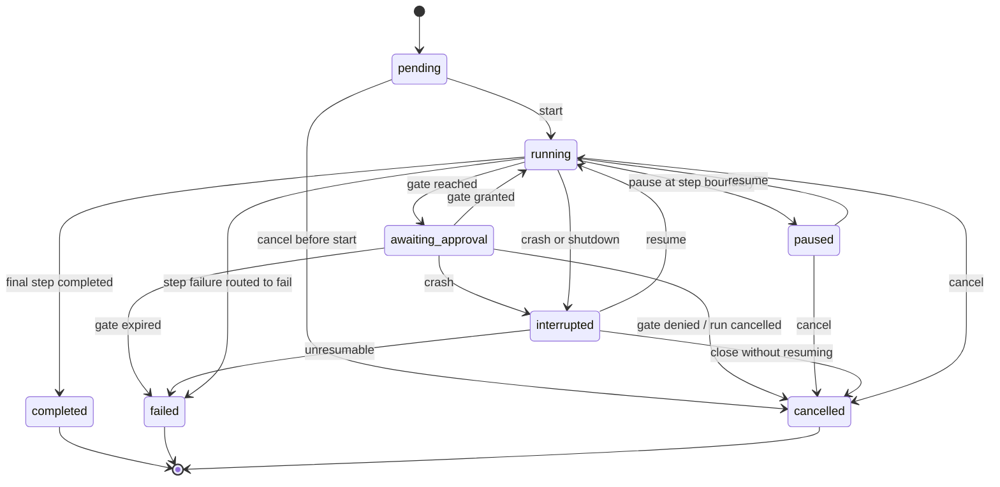

# 07 — Workflow Run State Machine

This chapter is the full machine for the **Workflow Run** entity (Volume 2 chapter 06), using
the state names frozen in Volume 2 chapter 09: `pending`, `running`, `awaiting_approval`,
`paused`, `interrupted`, `completed`, `failed`, `cancelled`. It defines all twelve mandatory
machine elements (Volume 0 chapter 02): initial state, terminal states, transitions, events,
guards, side effects, persistence, recovery, timeouts, cancellation, retries, and errors —
plus the `step_states` shape Volume 2 delegates to this volume.

## States

- **Initial:** `pending`.
- **Terminal:** `completed`, `failed`, `cancelled`.
- **Resting non-terminal:** `paused` (no live process required; resumable indefinitely).
- `interrupted` carries the corpus-wide fixed meaning: the owning process stopped without
  recording a terminal outcome; the run's work is not known to be complete (PRD-010).



**Prose for the diagram.** A Workflow Run is created `pending` and starts into `running`,
where steps dispatch per chapter 06. Reaching a gate moves it to `awaiting_approval`; a
`granted` Approval returns it to `running`; denial and expiry route per the definition —
the diagram shows the defaults (`cancel` for denial, `fail` for expiry); a `route:` target
returns to `running` instead. An explicit user pause takes effect at the next persisted step
boundary, yielding the resting `paused` state. A crash or shutdown from any live state yields
`interrupted`, which resumes into `running` at the last persisted step boundary, is closed to
`cancelled` by the user, or moves to `failed` when unresumable (E-WF-012). Completion of the
final step yields `completed`; exhausted retries/loop budgets with `fail` routing yield
`failed`; cancellation is legal from every non-terminal state. Constraints: the three
terminal states are frozen forever once recorded (INV-RUN-03 analog); `awaiting_approval`
and `paused` never dispatch new steps; no transition skips persistence.

## Transition table

| # | From | To | Event (emitted) | Trigger | Guards | Side effects |
|---|---|---|---|---|---|---|
| T1 | `pending` | `running` | `workflow.run.started` | Engine start | Inputs valid (E-WF-004); requirements satisfied (E-WF-005); session non-terminal (INV-SES-02) | Arm run deadline timer (`workflows.max_run_duration`); dispatch first eligible steps |
| T2 | `pending` | `cancelled` | `workflow.run.cancelled` | User cancel | — | Persist terminal state; no compensation (nothing ran) |
| T3 | `running` | `awaiting_approval` | `workflow.gate.requested` | Gate step eligible | Gate declared; no pending Approval for this gate | Raise Approval (`workflow_gate`); arm gate expiry timer; suspend step dispatch |
| T4 | `awaiting_approval` | `running` | `workflow.gate.granted` | Approval `granted` | Approval terminal state is `granted` (INV-WFR-04) | Record Approval ID in `step_states`; mark gate step `completed`; resume dispatch |
| T5 | `awaiting_approval` | `cancelled` | `workflow.gate.denied` + `workflow.run.cancelled` | Approval `denied`, routing `cancel` (default) | — | Record E-WF-006 on the gate step; cancel pending work; optional rollback per policy |
| T6 | `awaiting_approval` | `failed` | `workflow.gate.expired` + `workflow.run.failed` | Gate timer fired, routing `fail` (default) | No decision recorded | Expire Approval; record E-WF-007; persist `error` |
| T7 | `awaiting_approval` | `running` | `workflow.gate.denied` / `workflow.gate.expired` | Denial/expiry with `route:<step>` | Loop budget not exhausted | Record outcome; re-enter routed step |
| T8 | `running` | `paused` | `workflow.run.paused` | User pause | Takes effect at the next step boundary; in-flight steps run to completion or are individually cancelled by explicit choice | Stop dispatching; persist boundary; keep gate/run timers armed |
| T9 | `paused` | `running` | `workflow.run.resumed` | User resume | Definition version still resolvable (INV-WFR-01) | Re-evaluate eligibility; resume dispatch |
| T10 | `paused` | `cancelled` | `workflow.run.cancelled` | User cancel | — | As T5 side effects |
| T11 | `running` | `completed` | `workflow.run.completed` | Final step `completed` | All steps terminal; outputs mapped | Persist `outputs`, `ended_at`; disarm timers; emit completion |
| T12 | `running` | `failed` | `workflow.run.failed` | Step failure with `fail` routing; retries exhausted (E-WF-008); step/run timeout (E-WF-009); integrity failure (E-WF-012) | Retry policy exhausted; no `continue`/`route` applies | Persist `error`; cancel in-flight steps; optional rollback per declaration |
| T13 | `running` / `awaiting_approval` | `cancelled` | `workflow.run.cancelled` | User/budget/policy cancel (E-WF-010) | — | Cancel in-flight spawned Runs through their groups (FR-ARCH-004); cancel pending Approvals — a pending gate Approval records `cancelled`, never `denied` (Volume 9); optional rollback |
| T14 | `running` / `awaiting_approval` | `interrupted` | `workflow.run.interrupted` | Crash or shutdown detected at recovery (`MarkInterrupted`) or orderly shutdown step 2 | Non-terminal state at process stop | Steps found `running` marked `interrupted` in `step_states`; timers persist as deadlines |
| T15 | `interrupted` | `running` | `workflow.run.resumed` | User/driver resume (UC-11) | Definition version resolvable; `step_states` consistent (else E-WF-012); resume rules below | Re-arm timers from persisted deadlines; re-dispatch per resume rules |
| T16 | `interrupted` | `cancelled` | `workflow.run.cancelled` | User closes without resuming | — | As T13 without live work |
| T17 | `interrupted` | `failed` | `workflow.run.failed` | Resume impossible | Definition version missing or state integrity failure | Persist `error` (E-WF-012) |

`paused` is a resting state: a crash while `paused` leaves the run `paused` (there is no live
work to interrupt); recovery re-verifies its `step_states` consistency at the next resume.

## `step_states` shape

Volume 2 chapter 06 delegates the `step_states` shape to this volume. It is a JSON object
keyed by step ID; every step the run has entered MUST have an entry (INV-WFR-02):

- `status` — one of `pending`, `running`, `awaiting_approval`, `completed`, `failed`,
  `skipped`, `cancelled`, `interrupted`, `compensated`. This is a recorded per-step status
  vocabulary within the Workflow Run aggregate, deliberately reusing the execution-family
  outcome words (Volume 2 chapter 09 rule 3); it is not a separate governed entity machine.
- `attempt` — 1-based attempt counter; `loop_iteration` — per incoming loop edge, when
  looped.
- `entered_at`, `ended_at` — timestamps; `deadline_at` — absolute UTC deadline while a step
  timer is armed (chapter 09), else `null`.
- `spawned_run_ids`, `approval_ids`, `artifact_ids` — ULID lists making the history
  navigable in both directions (INV-WFR-02).
- `error` — stable error code plus safe context when `status` is `failed`.

```json
{
  "collect": {
    "status": "completed",
    "attempt": 1,
    "entered_at": "2026-07-11T10:02:11Z",
    "ended_at": "2026-07-11T10:09:40Z",
    "deadline_at": null,
    "spawned_run_ids": ["01JZWY2K8Q3V5M6N7P8R9S0T1U"],
    "approval_ids": [],
    "artifact_ids": ["01JZWY3A1B2C3D4E5F6G7H8J9K"]
  },
  "approve-fix": {
    "status": "awaiting_approval",
    "attempt": 1,
    "entered_at": "2026-07-11T10:09:41Z",
    "ended_at": null,
    "deadline_at": "2026-07-12T10:09:41Z",
    "spawned_run_ids": [],
    "approval_ids": ["01JZWY3Q9R8S7T6U5V4W3X2Y1Z"],
    "artifact_ids": []
  }
}
```

## Persistence

Every transition in the table persists via SessionStorePort **before** its side effects are
reported to drivers, and step progression persists before the next step dispatches
(INV-WFR-03; Volume 2 chapter 10 write discipline). The Workflow Run row (workspace database,
`workflow_runs`) carries `state`, `current_step`, `step_states`, `outputs`, `error`, and
optimistic `revision`. Timers persist as absolute deadlines inside `step_states` and the run
row — the durable-timer contract of chapter 09 (ADR-051).

## Recovery and resume

Recovery follows Volume 3 chapter 08: `MarkInterrupted` moves live-state workflow runs to
`interrupted` and emits T14 events. Resume (T15) applies these rules (ADR-050):

1. Resume happens **only at persisted step boundaries** — never mid-step.
2. Steps recorded `completed`, `skipped`, or gate-passed are never re-executed; a granted
   gate is never re-raised (INV-WFR-04).
3. A step found `interrupted` resumes by `effects` class: `none` → re-dispatched
   automatically (attempt unchanged — the interrupted attempt is discarded); `workspace` or
   `external` → NOT re-dispatched automatically; the engine raises a resume Approval
   presenting the step's recorded partial effects (File Changes, Command Executions of its
   spawned Run), and only a `granted` decision re-dispatches — side-effecting work never
   silently re-executes (Volume 3 chapter 08, RISK-ARCH-004).
4. Gate Approvals that expired during the outage are re-requested; still-pending ones
   re-attach.
5. Timers re-arm from persisted `deadline_at` values; deadlines already past fire
   immediately on resume (chapter 09).
6. `step_states` inconsistency (entries missing for entered steps, unknown statuses,
   references to absent rows) is E-WF-012: the run moves to `failed` (T17) rather than
   executing on unreliable state.

## Timeouts

Three timer scopes, all durable (chapter 09): per-step `timeout` (default
`workflows.default_step_timeout`) — firing marks the step `failed` with E-WF-009 and applies
`retry`/`on_failed`; per-gate `expires` (default `workflows.default_gate_expiry`) — firing
expires the Approval with E-WF-007 (T6/T7); per-run `workflows.max_run_duration` — firing
fails the run with E-WF-009 at run scope (T12). Timer firing during `paused` is deferred:
step timers suspend with their remaining budget persisted; gate and run timers keep running
(a pause does not extend a human decision window or the run deadline).

## Cancellation

Cancellation (T2, T5, T10, T13, T16) is legal from every non-terminal state and always
produces `cancelled` — never a success state. A direct user/budget/policy cancel during a
gate wait is T13 from `awaiting_approval`, cancelling the pending gate Approval (it records
`cancelled`, never `denied` — Volume 9); T5 is the distinct gate-denial routing. It cancels in-flight spawned Runs through
their supervision groups (FR-ARCH-004), cancels pending Approvals, disarms timers, persists
the terminal state, and emits `workflow.run.cancelled` with the recorded reason (user,
budget, policy, shutdown escalation). Cancellation itself never runs compensation
implicitly; rollback is a separate, declared behavior (below).

## Retries

Retries exist at exactly two levels, both bounded: per-step `retry` (`max_attempts`,
`backoff`) — a failed attempt re-dispatches the step after `backoff`, incrementing
`attempt`; and loop edges (`route:` with `max_loop_iterations`) — re-entering an earlier
step increments `loop_iteration`. The machine itself has no run-level automatic retry: a
`failed` run is terminal, and trying again is a new Workflow Run referencing the same
definition version. Gate outcomes are never retried automatically (decisions are not
transient failures).

## Rollback

Rollback is compensation-based (ADR-054): a step MAY declare `compensation` (an agent goal
or tool action). Rollback executes compensations of `completed` side-effecting steps in
reverse completion order, marking each compensated step `compensated` in `step_states` and
emitting `workflow.rollback.started` / `workflow.rollback.completed` (or
`workflow.rollback.failed` with E-WF-011 on the first failed compensation — rollback halts
there; remaining state is reported honestly). Rollback runs when: the definition declares
`rollback_on` containing the terminal outcome (`failed`, `cancelled`), or the user requests
it explicitly on a terminal run. Compensations are permission-mediated like any step —
rollback grants nothing. The `spec-driven-dev` workflow records a git restore point before
implementation (ADR-054); its implementation-stage compensation restores the branch state
via the Git Engine under `git_mutation` permission, and never force-mutates published
remotes.

## Requirements

### FR-WF-005 — Workflow Run state machine conformance

- Type: Functional
- Status: Approved
- Priority: P0
- Phase: Beta
- Source: Design
- Owner: Workflow Engine (Volume 4)
- Affected components: Workflow Engine, Persistence Layer, Event Bus, Core Domain (transition legality)
- Dependencies: FR-WF-003; Volume 2 chapters 06/09; ADR-050
- Related risks: RISK-WF-002

#### Description

The Workflow Engine MUST drive Workflow Runs exactly per this chapter's machine: the frozen
eight-state enum, the transition table T1–T17 with its guards and side effects, transition
persistence before effect reporting, the `step_states` shape with full navigability
(INV-WFR-02), and event emission on every transition (INV-EVT-03 discipline). Transitions
outside the table MUST be rejected by Core Domain transition legality and treated as defects.

#### Motivation

The machine is the durability and auditability contract of workflows: every guarantee in
chapters 06–09 reduces to "the run is always in a persisted, legal state with a recorded
path into it."

#### Actors

Workflow Engine; Persistence Layer; drivers rendering run state; recovery procedure.

#### Preconditions

Workspace database open; definition version resolvable.

#### Main flow

1. Transitions fire per the table on engine events, gate decisions, timer firings, and user
   commands.
2. Each transition persists, then emits its event, then reports to drivers.

#### Alternative flows

- Routing variants of T5/T6 (`route:` / `continue`) return the run to `running` instead of a
  terminal state, within loop budgets.

#### Edge cases

- Simultaneous gate grant and cancel: the persistence layer's optimistic `revision` decides;
  the losing transition is rejected and re-evaluated against the new state.
- Crash while `paused`: the run remains `paused`; no `interrupted` marking occurs (no live
  work existed).
- Duplicate timer firing after resume: firing is idempotent — a deadline already recorded as
  fired does not re-fire (chapter 09).

#### Inputs

Engine events, Approval outcomes, timer firings, user commands, recovery markings.

#### Outputs

Persisted state/`step_states` updates; `workflow.run.*` events; driver notifications.

#### States

The eight frozen Workflow Run states; the nine-value per-step status vocabulary of this
chapter.

#### Errors

E-WF-008..E-WF-012 as mapped in the transition table.

#### Constraints

No transition without persistence; no terminal-state mutation; step statuses only from the
declared vocabulary.

#### Security

State transitions carry no secret material; `step_states.error` contexts are redacted per
Volume 9 before persistence.

#### Observability

One event per transition with run correlation ID; state-dwell-time metrics per state.

#### Performance

Transition persistence rides the SessionStorePort hot path; budget per Volume 12.

#### Compatibility

Identical machine across drivers and platforms; state names appear verbatim in CLI/TUI
output and the Andromeda Runtime Protocol (Volume 2 freezing rule 1).

#### Acceptance criteria

- Given any executed run in the Volume 13 suites, when its persisted transition history is
  validated, then every consecutive state pair appears in table T1–T17 and every transition
  has a matching event.
- Given a run in `completed`, when any mutation of its state or `step_states` is attempted,
  then it is rejected as an integrity defect.
- Negative case: given an injected illegal transition (`pending` → `paused`), when the Core
  Domain legality check runs, then it refuses and E-WF-012 is recorded.
- Observability case: given a gate grant, when inspected, then `workflow.gate.granted`
  precedes the driver's state report and shares the correlation ID.

#### Verification method

Property tests over the transition table (legal paths accepted, all others rejected);
event/transition matching audits over suite runs; concurrency races on `revision`
(Volume 13).

#### Traceability

PRD-010, PRD-012; INV-WFR-01..04; FR-WF-003; ADR-050; SM-12.

### FR-WF-006 — Workflow interruption, recovery, and resume

- Type: Functional
- Status: Approved
- Priority: P0
- Phase: Beta
- Source: Derived
- Owner: Workflow Engine (Volume 4)
- Affected components: Workflow Engine, Runtime (recovery), SessionStorePort consumers, Permission Manager
- Dependencies: FR-ARCH-009; FR-WF-005; ADR-050, ADR-051; PRD-010
- Related risks: RISK-WF-002

#### Description

Interrupted Workflow Runs MUST be recovered per the six resume rules of this chapter:
step-boundary resume only; completed steps and granted gates never re-execute; interrupted
side-effecting steps re-dispatch only through an explicit resume Approval presenting their
recorded partial effects; expired gates re-request; timers re-arm from persisted deadlines
with immediate firing of past deadlines; inconsistent `step_states` fails the run with
E-WF-012 instead of executing on unreliable state.

#### Motivation

Workflows are long-lived by design — they will meet crashes, shutdowns, and laptop lids.
PRD-010's promise ("interrupted work is never assumed complete") needs workflow-specific
rules because steps have external side effects that transactions cannot cover
(RISK-ARCH-004).

#### Actors

Recovery procedure (Volume 3 chapter 08); users resuming (UC-11); approvers of resume
Approvals.

#### Preconditions

`MarkInterrupted` has marked the run; workspace database consistent.

#### Main flow

1. Recovery marks the run `interrupted`; drivers list it as resumable.
2. The user resumes; consistency is verified; timers re-arm.
3. Dispatch restarts at the last persisted step boundary per the resume rules.

#### Alternative flows

- The user closes the run instead: T16 to `cancelled`.
- A resume Approval for an interrupted side-effecting step is denied: the step is marked
  `cancelled` and `on_failed` routing applies.

#### Edge cases

- Definition version missing at resume (uninstalled package): T17 to `failed` with a
  remediation message naming the package — INV-WFD-04 makes this rare by prohibiting
  deletion of referenced versions.
- Resume on a different machine sharing the workspace: legal; workspace-database exclusivity
  rules (Volume 10) serialize access.
- Repeated crash during resume itself: idempotent — re-marking and re-resume converge
  (FR-ARCH-009 idempotence).

#### Inputs

Interrupted run rows; persisted deadlines; user resume commands; resume Approval decisions.

#### Outputs

Resumed execution at a step boundary; resume Approvals; re-armed timers;
`workflow.run.resumed` events.

#### States

`interrupted` → `running` (T15) / `cancelled` (T16) / `failed` (T17).

#### Errors

E-WF-012 (integrity); E-WF-011 if rollback was configured and fails during close-out.

#### Constraints

No mid-step resume; no automatic re-execution of `workspace`/`external` steps; recovery
never mutates Record entities (append-only).

#### Security

Resume Approvals present recorded partial effects so the human decision is informed;
recovered runs retain their original permission grants — expired Approvals are not
resurrected (SM-11 security parity).

#### Observability

`workflow.run.interrupted` / `workflow.run.resumed` events with counts of re-dispatched and
approval-gated steps; recovery duration feeds SM-11(b).

#### Performance

Resume-to-first-dispatch latency is bounded by the SM-11(b)-aligned budget Volume 12 sets.

#### Compatibility

Identical across Tier 1 platforms; recovery mechanics via FR-ARCH-009.

#### Acceptance criteria

- Given a run killed with SIGKILL during a read-only step, when resumed, then the step
  re-dispatches automatically with no approval and no completed step re-executes.
- Given a run killed during an implementation step (`effects = workspace`), when resumed,
  then a resume Approval presents the step's recorded File Changes, and only `granted`
  re-dispatches it.
- Negative case: given `step_states` with a missing entry for an entered step, when resume
  is attempted, then the run fails with E-WF-012 and nothing executes.
- Permission case: given a gate granted before the crash, when resumed, then it is not
  re-raised (INV-WFR-04).
- Observability case: resume emits `workflow.run.resumed` correlating to the original run
  ID.

#### Verification method

Crash-injection at randomized step boundaries and mid-step points (SM-11 methodology);
resume Approval fixtures; integrity-corruption fixtures asserting E-WF-012; cross-machine
resume tests over shared fixtures.

#### Traceability

PRD-010; UC-11; FR-ARCH-009; ADR-050, ADR-051; NFR-WF-002; RISK-ARCH-004.

### FR-WF-007 — Workflow cancellation and rollback

- Type: Functional
- Status: Approved
- Priority: P1
- Phase: Beta
- Source: Design
- Owner: Workflow Engine (Volume 4)
- Affected components: Workflow Engine, Execution Engine, Git Engine (SDD restore points), Permission Manager
- Dependencies: FR-ARCH-004; FR-WF-005; ADR-054
- Related risks: RISK-WF-002

#### Description

Cancellation MUST be available from every non-terminal Workflow Run state, propagate through
supervision groups to all in-flight spawned Runs and pending Approvals, and always terminate
in `cancelled`. Rollback MUST be compensation-based per this chapter: declared per-step
compensations executed in reverse completion order, permission-mediated, halting at the
first failure with E-WF-011 and an honest report of remaining state; triggered only by
declared `rollback_on` outcomes or explicit user request. The `spec-driven-dev` workflow
MUST record a git restore point before its first side-effecting stage and use it as the
implementation compensation anchor.

#### Motivation

Users must be able to stop a workflow at any moment (PRD-005) and to unwind what it did with
eyes open: pretending automatic perfect undo exists would be dishonest (RISK-WF-002);
declared compensation makes reversibility a designed property.

#### Actors

Users cancelling; the engine executing compensations; approvers when compensations require
permissions.

#### Preconditions

Run non-terminal (cancel); run terminal with declared compensations (rollback).

#### Main flow

1. Cancel: T13 fires; spawned Runs cancel through their groups; Approvals cancel; state
   persists as `cancelled`.
2. Rollback (when triggered): compensations execute in reverse order; steps mark
   `compensated`; completion emits `workflow.rollback.completed`.

#### Alternative flows

- A compensation fails: rollback halts, `workflow.rollback.failed` with E-WF-011, the report
  lists compensated vs. remaining steps.

#### Edge cases

- Cancel during `awaiting_approval`: the pending Approval is cancelled (Volume 9 `cancelled`
  terminal state); no decision is fabricated.
- Rollback requested when no step declared compensation: the request completes as a no-op
  with an explicit "nothing to compensate" report — never an error.
- Double cancel: idempotent; the second request observes the terminal state.

#### Inputs

Cancel commands (user, budget, policy, shutdown); rollback triggers; compensation
declarations.

#### Outputs

`cancelled` runs; compensation executions with their own records; rollback events and
reports.

#### States

T2/T5/T10/T13/T16 transitions; `compensated` step status.

#### Errors

E-WF-010 (cancellation record), E-WF-011 (compensation failure).

#### Constraints

Rollback never runs implicitly on cancel without `rollback_on`; compensations never
force-mutate published remotes; cancellation latency rides FR-ARCH-004 budgets.

#### Security

Compensations are permission-mediated executions with full attribution — rollback cannot
become an unaudited side channel; restore-point creation uses `git_mutation` permission.

#### Observability

`workflow.run.cancelled`, `workflow.rollback.*` events; compensation executions produce
normal run/tool records.

#### Performance

Cancellation-to-quiescence within the FR-ARCH-004/NFR-ARCH-003 budgets; compensation
duration bounded by step timeouts.

#### Compatibility

Identical semantics across drivers; restore-point mechanics via GitPort only.

#### Acceptance criteria

- Given a run with two in-flight spawned Runs, when cancelled, then both record `cancelled`,
  pending Approvals record `cancelled`, and the run persists `cancelled` — with no child
  process of the run's tree surviving.
- Given `rollback_on = ["failed"]` and a failed run with three completed side-effecting
  steps, when rollback executes, then compensations run in reverse completion order and each
  compensated step is marked `compensated`.
- Negative case: given a compensation that fails, when rollback halts, then E-WF-011 reports
  exactly which steps remain uncompensated.
- Permission case: given a compensation requiring `git_mutation` without a grant, when
  dispatched, then it is denied, recorded, and rollback halts with E-WF-011.
- Observability case: rollback start/completion/failure events share the run correlation ID.

#### Verification method

Cancellation storm tests (Volume 13); compensation order property tests; failed-compensation
fixtures; restore-point round-trip tests over GitPort doubles.

#### Traceability

PRD-005, PRD-006; FR-ARCH-004; ADR-054; RISK-WF-002; E-WF-010, E-WF-011.

## Non-functional requirements

### NFR-WF-002 — Workflow resume fidelity

- Category: Reliability
- Priority: P0
- Phase: Beta
- Metric: Fraction of crash-injected workflow runs that resume at the last persisted step boundary with zero re-executed completed steps, zero re-raised granted gates, and zero automatic re-execution of side-effecting interrupted steps
- Target: ≥ 99% across the crash-injection matrix (SM-11 methodology applied to workflow runs)
- Minimum threshold: ≥ 99%; any silent re-execution of a side-effecting step is a release-blocking defect regardless of rate
- Measurement method: crash-injection suite at randomized step boundaries and mid-step points; automated post-resume audit of `step_states` history against pre-crash records
- Test environment: Tier 1 CI with scripted provider/tool doubles and workspace fixtures
- Measurement frequency: every release; trend-tracked per mainline merge on a sampled matrix
- Owner: Workflow Engine (Volume 4)
- Dependencies: FR-WF-006; FR-ARCH-009; ADR-050
- Risks: RISK-WF-002, RISK-ARCH-004
- Acceptance criteria: Suite reports ≥ 99% clean resumes; zero silent side-effect re-executions across all runs; every resume Approval raised exactly when the matrix expects one.

## Risks

### RISK-WF-002 — Irreversible external side effects defeat rollback

- Category: Technical / product
- Probability: Medium
- Impact: High
- Severity: High
- Mitigation: `effects` classification distinguishes `external` steps; compensation is declared, not inferred; rollback reports are honest about uncompensated state; SDD keeps side effects workspace-local until release-preparation, which prepares but never publishes; resume rules require human approval before re-running side-effecting steps
- Detection: Rollback failure events (E-WF-011); audit review of `external`-effect step outcomes; Beta feedback on rollback expectations
- Owner: Workflow Engine (Volume 4)
- Status: Open

A sent webhook, a pushed commit, a mutated ticket — no local machine can undo these. The
design answer is honesty: classify, compensate where declared, and report what remains,
rather than promising an undo that cannot exist.

## Error codes

### E-WF-008 — Workflow step failed

- Category: Execution
- Severity: Error
- User message: "Step '<step>' of workflow '<name>' failed<after n attempts / after exhausting loop budget>."
- Technical message: step ID, attempt/loop counters, underlying error code and safe context from the spawned Run or exit-criteria evaluation, applied routing
- Cause: spawned Run terminal `failed`, exit criteria unmet after success, or loop budget exhausted
- Safe-to-log data: step ID, counters, underlying stable error code, routing
- Recoverability: recoverable per routing (`retry`, `route:`, `continue`) or by a new run
- Retry policy: per-step `retry` declaration, then `on_failed` routing; no engine-level retry beyond it
- Recommended action: inspect the step's spawned Run records; correct and re-run
- Exit-code mapping: 1
- HTTP mapping: not applicable
- Telemetry event: `workflow.step.failed`
- Security implications: failure context is redacted per Volume 9 before persistence and emission

### E-WF-009 — Workflow step timed out

- Category: Timeout
- Severity: Error
- User message: "Step '<step>' exceeded its time limit of <timeout>." (run scope: "The workflow run exceeded its maximum duration.")
- Technical message: step ID or run scope, configured limit, elapsed, deadline instant, applied routing
- Cause: durable timer fired for a step timeout or the run deadline
- Safe-to-log data: scope, limits, elapsed, routing
- Recoverability: recoverable per routing or by re-running with adjusted limits
- Retry policy: per-step `retry` applies to step timeouts; run-deadline expiry is not retried
- Recommended action: investigate the slow step; adjust `timeout` or `workflows.max_run_duration` if the work is legitimately long
- Exit-code mapping: 8
- HTTP mapping: not applicable
- Telemetry event: `workflow.step.timed_out`
- Security implications: timeout cancellation tears down the step's process tree (FR-ARCH-004) — no work continues past the recorded outcome

### E-WF-010 — Workflow run cancelled

- Category: Cancellation
- Severity: Info
- User message: "The workflow run was cancelled<by user request / by policy / by budget / during shutdown>."
- Technical message: cancellation reason, initiating actor kind, in-flight steps cancelled, approvals cancelled
- Cause: user command, budget/policy cancellation, gate denial routed to cancel, or shutdown escalation
- Safe-to-log data: reason, actor kind, counts
- Recoverability: not applicable — `cancelled` is a deliberate terminal outcome; a new run re-does the work
- Retry policy: none
- Recommended action: none; start a new run if the work is still wanted
- Exit-code mapping: 8
- HTTP mapping: not applicable
- Telemetry event: `workflow.run.cancelled`
- Security implications: cancellation cancels pending Approvals rather than leaving decisions dangling

### E-WF-011 — Workflow compensation failed

- Category: Execution
- Severity: Error
- User message: "Rollback stopped: the compensation for step '<step>' failed. <n> step(s) were compensated; <m> remain."
- Technical message: failing compensation's step ID, underlying error, ordered lists of compensated and remaining steps
- Cause: a compensation execution failed (tool error, permission denial, environment change since the step ran)
- Safe-to-log data: step IDs, underlying stable error code, counts
- Recoverability: partially — remaining compensations can be re-attempted after remediation; manual cleanup may be required
- Retry policy: rollback halts at first failure; re-invocation resumes from the failed compensation
- Recommended action: follow the rollback report; remediate manually where compensation cannot succeed
- Exit-code mapping: 1
- HTTP mapping: not applicable
- Telemetry event: `workflow.rollback.failed`
- Security implications: rollback halting is fail-closed against cascading destructive guesses; every compensation attempt is fully attributed

### E-WF-012 — Workflow run state integrity failure

- Category: Integrity
- Severity: Fatal (for the affected run)
- User message: "The workflow run's recorded state is inconsistent and cannot be safely resumed."
- Technical message: violated consistency rule (missing `step_states` entry, unknown status value, dangling ULID reference, illegal transition found in history), run ID, definition reference
- Cause: storage corruption, external mutation of the workspace database, or an engine defect
- Safe-to-log data: rule identifier, run ID, entity counts
- Recoverability: the run is not recoverable (T17 → `failed`); the workspace database follows ADR-029 integrity procedures if corruption is systemic
- Retry policy: none
- Recommended action: export the run record for diagnosis; restore from backup if corruption is systemic (ADR-029)
- Exit-code mapping: 9
- HTTP mapping: not applicable
- Telemetry event: `workflow.run.failed`
- Security implications: fail-closed — the engine refuses to execute steps on state it cannot trust
