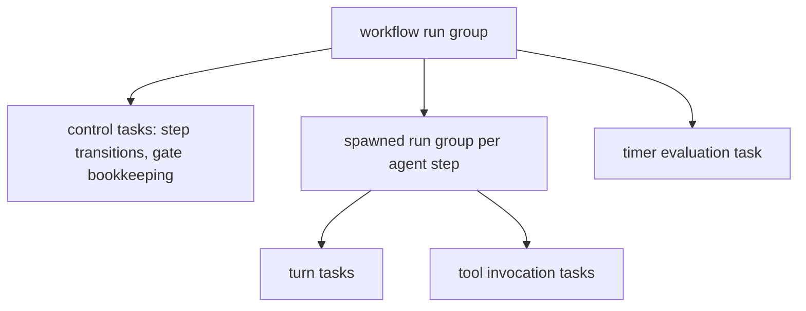

# 09 — Task Scheduler Runtime Semantics

The Task Scheduler's structural contract — SchedulerPort signatures, the supervision tree,
named bounded pools, backpressure policies, panic capture, and the scheduler work-item
vocabulary — is owned by Volume 3 chapter 08 (FR-ARCH-006, ADR-023); pool sizes and
saturation budgets are Volume 12's. This chapter specifies, on top of that contract and
without restating it, how the agent runtime and Workflow Engine **use** SchedulerPort: the
group topology of workflow runs, pool assignment of orchestration work, backpressure
handling, the mapping between domain entities and scheduler tasks, and the **durable timer**
contract behind every workflow timeout and gate expiry (ADR-051).

## Group topology and pool assignment

A Workflow Run's entire concurrent footprint hangs off **one scheduler group** created under
its session's group (Volume 3 chapter 08 supervision tree). Within it:

**Prose for the diagram.** The workflow run group parents three kinds of members: short-lived
control tasks executing step transitions and gate bookkeeping; one child group per spawned
Run (created and driven by the Agent Engine exactly as for interactive runs — turns and tool
invocations are its members); and the timer evaluation task described below. The constraints
this topology encodes: cancelling the workflow run cancels exactly its subtree — every
spawned Run, control task, and timer (FR-ARCH-004); a spawned Run's failure propagates to
the Workflow Engine as a step outcome, not as group first-error abortion (spawned run groups
are joined per step, so one step's failure is data for routing, chapter 06, rather than a
group-wide cancellation); and gates hold no group members at all while waiting (ADR-053).

Pool assignment (pool names per Volume 3 chapter 08; sizes per Volume 12):

| Work | Pool | Saturation behavior |
|---|---|---|
| Step transitions, gate bookkeeping, `step_states` persistence hand-off | `interactive` | Block-with-deadline (control work is user-visible latency) |
| Spawned Run work (turns, tools) | `interactive` / `tools` per the Agent Engine's own rules | Per those pools' declared policies |
| Timer evaluation sweep | `background` | Reject-with-E-ARCH-005; the sweep re-schedules itself — a missed sweep delays firing, never loses a deadline |
| Artifact content storage, rollback report assembly | `background` | Reject → defer with `workflow.step.deferred` and retry with 1 s–60 s exponential backoff |

**Backpressure handling.** A control-task submission that exhausts its block deadline, or a
`background` rejection (E-ARCH-005), never fails the Workflow Run by itself: the engine
defers the work, emits `workflow.step.deferred` with the pool and queue depths, and retries
with exponential backoff (initial 1 s, factor 2, cap 60 s). Deferral time still counts
against step timeouts and the run deadline — overload becomes visible latency and eventually
a truthful E-WF-009, never unbounded queuing (ADR-023).

**Entity/scheduler distinction.** Domain **Task** entities (plan members, chapter 05 of this
volume) and scheduler work items are different things: `SchedTaskID` identifies scheduler
work; a domain Task is *executed by* one or more scheduler tasks dispatched by the Execution
Engine. The Workflow Engine never submits domain Tasks directly — agent steps spawn Runs,
whose plans' Tasks the Execution Engine schedules. Retry state lives on domain entities
(`attempt` counters), never in scheduler work items, which are disposable.

## Gates and waits hold no threads

Waiting states (`awaiting_approval`, `paused`, timer waits) MUST NOT occupy pool slots or
block goroutines (ADR-053). The engine implements waits as: persisted state (chapter 07) +
an EventBusPort subscription for the wake-up event (`workflow.gate.granted` and its
siblings, Approval decision events per Volume 9's event names, resume commands) + a durable
deadline. When a wake-up event arrives, a control task is submitted to continue the run. A
Workflow Run in `awaiting_approval` therefore costs one subscription and one persisted
deadline — nothing else — which is what makes hundreds of concurrently waiting runs viable
within Volume 12's resource budgets.

## Durable timers

All workflow timeouts — step timeouts, gate expiries, the run deadline (chapter 07) — use
one durable timer contract (ADR-051):

1. **Persist first.** Arming a timer writes the absolute UTC deadline (`deadline_at`) into
   `step_states` (or the run row for the run deadline) in the same transaction as the
   transition that armed it. The persisted deadline is the authority; in-process timers are
   an optimization.
2. **In-process scheduling.** The timer evaluation task maintains an in-memory schedule of
   armed deadlines and additionally sweeps all persisted deadlines of live workflow runs at
   least every 30 seconds. Firing latency is therefore bounded: a deadline fires at most
   30 s after its instant even if the in-memory schedule was lost or the process slept.
3. **Firing is a transition.** A firing submits a control task that re-reads the persisted
   state, verifies the deadline is still armed and past (guards against races with grants,
   pauses, and cancellations), applies the chapter 07 transition, and marks the deadline
   fired — all transactionally. Firing is idempotent: a deadline recorded as fired never
   re-fires (duplicate sweeps and post-resume re-evaluation are safe).
4. **Recovery.** On resume (chapter 07 T15) and on startup recovery, timers re-arm from
   persisted deadlines; deadlines already past fire immediately through the same idempotent
   path, in deadline order. `workflow.timer.restored` is emitted with counts. A failure to
   restore timers is an E-WF-012-class integrity condition for the affected run.
5. **Pause semantics.** Pausing suspends step timers by persisting the remaining budget and
   clearing `deadline_at`; resume re-derives the deadline from the remaining budget. Gate
   expiries and the run deadline are not suspended (chapter 07).
6. **Clock discipline.** Deadlines are wall-clock UTC instants; the sweep evaluates against
   the current wall clock, so system sleep, clock steps, and timezone changes cannot lose a
   deadline — a backward clock step delays firing by at most the step size, and a forward
   step fires pending deadlines at the next sweep. The interaction of Go's monotonic timers
   with system sleep on Tier 1 platforms determines only the *optimization* path's latency
   and is PENDING VALIDATION (register entry V4B-OQ-1); the 30-second wall-clock sweep bounds
   worst-case behavior regardless of the outcome.

Timer events: `workflow.timer.armed` (deadline persisted), `workflow.timer.fired` (transition
applied), `workflow.timer.restored` (recovery re-arm, with counts).

## Requirements

### FR-WF-009 — Workflow scheduling and supervision

- Type: Functional
- Status: Draft
- Priority: P0
- Phase: Beta
- Source: Design
- Owner: Workflow Engine (Volume 4)
- Affected components: Workflow Engine, Task Scheduler, Agent Engine, Event Bus
- Dependencies: FR-ARCH-006, FR-ARCH-004; ADR-023, ADR-053; FR-WF-003
- Related risks: RISK-ARCH-003

#### Description

The Workflow Engine MUST run every Workflow Run's concurrent work under one scheduler group
per run within the session's supervision subtree, submit all work through SchedulerPort on
the pools assigned by this chapter (no naked goroutines), join spawned-run groups per step
so step failures become routing data rather than group aborts, implement all waiting states
without occupying pool slots or goroutines, and handle backpressure by deferral with
`workflow.step.deferred` and bounded exponential backoff — never by unbounded queuing and
never by failing the run on a first rejection.

#### Motivation

Workflows multiply concurrency (parallel steps, spawned runs, timers); without the
supervision discipline, they would be the component most likely to leak goroutines, orphan
children, and stall the process — exactly what ADR-023 exists to prevent.

#### Actors

Workflow Engine; Task Scheduler; Agent Engine (spawned run groups).

#### Preconditions

Scheduler constructed with the pool registry; session group exists.

#### Main flow

1. Run start creates the workflow run group and the timer evaluation membership.
2. Control tasks and spawned run groups execute on their assigned pools.
3. Group cancellation on run cancel/shutdown reaches every member (FR-ARCH-004).

#### Alternative flows

- Pool saturation: deferral with backoff and `workflow.step.deferred`; elapsed deferral
  counts against timeouts.

#### Edge cases

- A spawned Run panics: the scheduler converts it to a captured `panicked` outcome; the
  Workflow Engine records the step `failed` with the correlated error — the process
  survives (FR-ARCH-006).
- Shutdown during parallel steps: group cancellation follows the Volume 3 chapter 08
  ordering; steps land `interrupted` per chapter 07 T14.
- A wake-up event arrives for an already-terminal run: the control task observes the
  terminal state and does nothing (idempotent continuation).

#### Inputs

Step dispatch decisions; scheduler outcomes; wake-up events; pool policies.

#### Outputs

Supervised execution; deferral events; step outcomes; zero orphaned goroutines or children.

#### States

Scheduler work-item vocabulary is Volume 3's; domain outcomes land in chapter 07 states.

#### Errors

E-ARCH-005 handled by deferral; step-level outcomes as E-WF-008/E-WF-009.

#### Constraints

No waiting state may hold a pool slot; no direct domain-Task submission by the Workflow
Engine; backoff parameters as declared (1 s initial, ×2, 60 s cap).

#### Security

Group cancellation guarantees no spawned process outlives its run's permission context
(FR-ARCH-004 security clause).

#### Observability

Deferral events with pool depths; per-run group member counts in scheduler stats; span per
control task under the run's trace.

#### Performance

Orchestration overhead per NFR-WF-003; waiting-run footprint (one subscription + one
persisted deadline) within Volume 12 budgets.

#### Compatibility

Pure in-process model; identical across platforms.

#### Acceptance criteria

- Given a workflow run with two parallel steps and an armed timer, when the run is
  cancelled, then every group member observes cancellation, no goroutine or child survives
  (NFR-ARCH-004 gates), and the run records `cancelled`.
- Given a saturated `background` pool, when artifact storage is submitted, then E-ARCH-005
  is handled by deferral, `workflow.step.deferred` is emitted, and the work completes after
  backoff without failing the run.
- Negative case: given a spawned Run that panics, when the step outcome is recorded, then
  the run continues per routing and the process did not restart.
- Observability case: given 100 runs in `awaiting_approval`, when scheduler stats are
  inspected, then they occupy zero pool slots.
- Permission case: given cancellation during a side-effecting step, when teardown completes,
  then the step's sandboxed process tree is terminated (FR-ARCH-004) and the partial effects
  are recorded for the resume Approval path.

#### Verification method

Scheduler-integration suite with cancellation storms and saturation fixtures (Volume 13);
goroutine/process leak gates (NFR-ARCH-004); waiting-state footprint tests; panic-injection
fixtures.

#### Traceability

PRD-008, PRD-010; ADR-023, ADR-053; FR-ARCH-004, FR-ARCH-006; NFR-WF-003.

### FR-WF-010 — Durable timers and timeout enforcement

- Type: Functional
- Status: Draft
- Priority: P0
- Phase: Beta
- Source: Design
- Owner: Workflow Engine (Volume 4)
- Affected components: Workflow Engine, Persistence Layer, Task Scheduler
- Dependencies: FR-WF-005, FR-WF-006; ADR-051; FR-ARCH-009
- Related risks: RISK-ARCH-004

#### Description

Every workflow timeout — step timeouts, gate expiries, the run deadline — MUST follow the
six-rule durable timer contract of this chapter: deadline persisted transactionally with the
arming transition; wall-clock sweep at least every 30 seconds bounding firing latency to
deadline + 30 s; transactional, guarded, idempotent firing; re-arm from persisted deadlines
on resume and recovery with immediate firing of past deadlines in deadline order; pause
suspending step timers only, by persisted remaining budget; wall-clock UTC authority immune
to in-memory timer loss.

#### Motivation

A workflow that forgets a deadline across a restart silently converts "bounded" into
"unbounded" — gate expiries and run deadlines are correctness properties of the safety
model, not conveniences.

#### Actors

Workflow Engine (arming, firing); recovery procedure (restore); Task Scheduler (sweep task).

#### Preconditions

Workspace database open; timer evaluation task running.

#### Main flow

1. A transition arms a deadline; both persist together.
2. The schedule or the sweep detects the past deadline; a control task fires it under
   guards.
3. The chapter 07 transition applies; the deadline is marked fired.

#### Alternative flows

- Grant races the gate expiry: the firing guard observes the recorded grant and does
  nothing.

#### Edge cases

- Process asleep across a deadline: firing occurs at the first sweep after wake, within
  30 s of wake.
- Backward clock step: firing delays by at most the step size; deadlines are never lost.
- Deadline in the past at arm time (clock skew between machines sharing a workspace): fires
  on the arming sweep, through the same guarded path.

#### Inputs

Arming transitions; wall clock; persisted deadlines; firing guards' state reads.

#### Outputs

Fired transitions; `workflow.timer.*` events; suspended-budget records on pause.

#### States

Deadlines annotate chapter 07 states; firing produces T6/T12 transitions or step failure
routing.

#### Errors

E-WF-007 (gate expiry), E-WF-009 (step/run timeout); timer restoration failure is an
E-WF-012-class integrity condition.

#### Constraints

The persisted deadline is authoritative; in-memory schedules are disposable; sweep interval
≤ 30 s; firing exactly once per armed deadline.

#### Security

Gate expiry always fails closed (E-WF-007 → routing); a lost timer can therefore delay but
never widen access.

#### Observability

`workflow.timer.armed/fired/restored` events; firing-latency metric (deadline-to-transition)
feeding Volume 12.

#### Performance

Sweep cost is one indexed query over live runs per interval; firing latency ≤ 30 s beyond
the deadline, typically the in-process schedule's latency.

#### Compatibility

Wall-clock semantics identical across platforms; the monotonic-clock optimization path is
platform-dependent and PENDING VALIDATION (V4B-OQ-1) without affecting the contract's bound.

#### Acceptance criteria

- Given an armed gate expiry and a process killed before it, when the process restarts after
  the deadline, then the gate expires through the guarded path within 30 s of recovery and
  `on_expired` routing applies.
- Given a grant recorded 1 ms before the expiry fires, when the firing guard runs, then the
  gate is `granted` and no expiry transition occurs.
- Negative case: given a deadline already marked fired, when a duplicate sweep evaluates it,
  then nothing fires (idempotence).
- Given a paused run, when 2 h pass and it resumes with 10 m of step budget remaining, then
  the step deadline re-derives as resume + 10 m, while the gate and run deadlines did not
  move.
- Observability case: every firing has `workflow.timer.fired` with deadline and actual
  instants, enabling the firing-latency metric.

#### Verification method

Timer property tests (arm/fire/idempotence under injected clock control); kill-restart
fixtures across deadlines; race tests grant-vs-expiry; pause/resume budget golden tests.

#### Traceability

PRD-010; ADR-051; FR-WF-005, FR-WF-006; RISK-ARCH-004; E-WF-007, E-WF-009.

## Non-functional requirements

### NFR-WF-003 — Workflow orchestration overhead

- Category: Performance
- Priority: P1
- Phase: Beta
- Metric: Engine-added latency per step transition — from step-terminal event (or gate grant) to the dependent step's dispatch — excluding step work itself, p95; plus per-waiting-run steady-state memory footprint
- Target: ≤ 50 ms p95 transition overhead on the Volume 12 reference hardware; ≤ 100 KiB steady-state per waiting run
- Minimum threshold: ≤ 100 ms p95 transition overhead; ≤ 256 KiB per waiting run
- Measurement method: instrumented no-op workflow benchmark (20 chained transform steps; 50 iterations) in the benchmark harness; heap accounting across 100 runs parked in `awaiting_approval`
- Test environment: Volume 12 reference machines, per its formal environment definitions
- Measurement frequency: per release; trend-tracked on mainline merges
- Owner: Workflow Engine (Volume 4) / Volume 12 (budget alignment)
- Dependencies: FR-WF-009; ADR-053
- Risks: RISK-ARCH-003
- Acceptance criteria: Benchmark reports p95 within target (release gate at minimum threshold); parked-run footprint within budget; no benchmark regression > 20% ships without a recorded justification.
