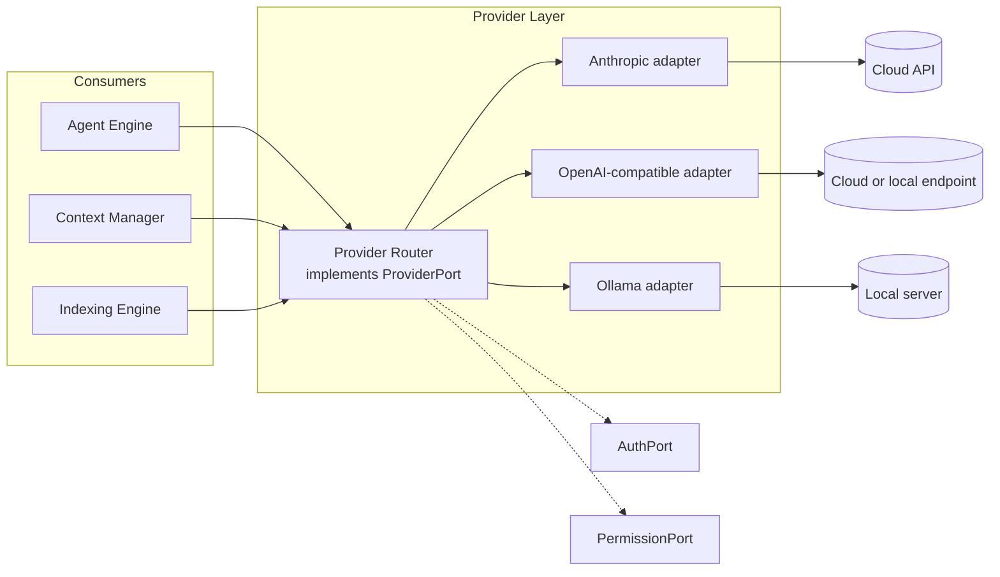

# 01 — Provider Contract

This chapter defines the behavioral contract of the Provider Layer: what every provider
adapter promises, how adapters declare themselves, and how the layer is registered,
configured, and observed. The `ProviderPort` interface — names, methods, signatures — is
frozen in Volume 3, chapter 02 (FR-ARCH-003); this chapter elaborates its semantics and MUST
be read as the single authoritative behavioral contract for that port (single-home matrix,
Volume 0, chapter 03). Entity semantics (Provider, Model, Capability, Credential,
Authentication Session) are Volume 2, chapter 05.

## Layer anatomy



Components and relations: consumers (Agent Engine, Context Manager, Indexing Engine, and any
other component needing inference) hold exactly one `ProviderPort` value — the **Provider
Router**, the composite that implements the port itself (Volume 3, chapter 02). The router
resolves each request to one configured Provider, obtains request credentials through
`AuthPort` (never raw secrets — chapter 08), consults `PermissionPort` for network-egress
grants, and drives the selected adapter. Each adapter is one package implementing
`ProviderPort` for one API family over stdlib `net/http` per ADR-019, with official SDK
adoption PENDING VALIDATION per adapter (register entry in `99-volume-register.md`, adapter
catalog chapter 09). Constraints: no consumer may hold an adapter directly; no adapter may
depend on another adapter or on any engine (Volume 3 dependency matrix, ADR-030/ADR-033).

## Behavioral contract per method

The six frozen methods carry the following normative semantics. All methods obey the port
conventions of Volume 3, chapter 02 (context-first cancellation, typed E-PROV errors, stream
discipline, thread safety).

| Method | Behavioral contract (normative) |
|---|---|
| `Chat` | One non-streaming inference turn. The adapter MUST send exactly one request, MUST map every outcome to a `ChatResponse` or an E-PROV error (chapter 06), and MUST populate the usage report from official provider accounting only (chapter 04). |
| `ChatStream` | Same request surface, incremental delivery per the unified stream event model (chapter 03). Exactly one terminal event; adapters MUST NOT emit events after it. |
| `Embed` | Batch embedding. The adapter MUST split batches larger than its declared batch limit, MUST preserve input order in outputs, and MUST report per-batch usage. |
| `DiscoverModels` | Enumerates currently offered models with capabilities (chapter 02). Adapters whose provider has no documented discovery mechanism MUST return the E-PROV-006 capability-unavailable error rather than a fabricated list. |
| `Capabilities` | Returns the effective capability set for one model (chapter 02 resolution rules). MUST be answerable offline from declaration and cached verification data — no network call on this path. |
| `CountTokens` | Counts tokens via the provider's official counting mechanism only; adapters without one MUST return E-PROV-006 so the Context Manager falls back to estimation (Volume 7). |

Request normalization: `ChatRequest` carries the model name, ordered messages (roles
`system`, `user`, `assistant`, `tool`; content parts `text`, `image`, `audio`, plus
tool-result parts), tool declarations and tool choice (chapter 03), sampling parameters
(`temperature`, `top_p`, `max_output_tokens`, `stop_sequences`), an optional response format
(chapter 03), the set of required capabilities, and correlation metadata (run, turn, trace
ULIDs per ADR-027). Vendor-specific request options travel only in `provider_options`, an
opaque table validated by the adapter's declared config schema — they MUST NOT be required
for any documented Andromeda behavior (Principle 1).

### FR-PROV-001 — Provider contract

- Type: Functional
- Status: Approved
- Priority: P0
- Phase: Core
- Source: Provided
- Owner: Provider Layer (Volume 5)
- Affected components: Provider Layer, Provider Router, all adapters, Agent Engine, Context Manager, Indexing Engine, Extension SDK
- Dependencies: FR-ARCH-003, FR-ARCH-004; ADR-019, ADR-030; FR-PROV-002
- Related risks: RISK-PROV-001, RISK-ARCH-002

#### Description

Every source of model inference MUST be integrated as an adapter implementing `ProviderPort`
under this chapter's behavioral contract. The contract is uniform: one request surface, one
stream event model (chapter 03), one capability vocabulary (chapter 02), one usage-accounting
discipline (chapter 04), one error family (chapter 06). No component outside the Provider
Layer may contain provider-specific logic (Principle 1); consumers reach providers only
through the Provider Router, which itself implements `ProviderPort`.

#### Motivation

Vendor agnosticism (PRD-002) is enforceable only if the provider boundary is a single,
specifiable contract. A uniform contract also makes SM-01 (adapter integration ≤ 16
person-hours) achievable, because a new adapter implements a known shape instead of
negotiating bespoke integration points.

#### Actors

Adapter implementers; the Provider Router; consumers of `ProviderPort`; conformance suite.

#### Preconditions

Provider registered in configuration (`[providers.<slug>]`); adapter declaration validated
(FR-PROV-002); authentication profile resolvable when `auth_kind` requires one (chapter 07).

#### Main flow

1. A consumer calls a `ProviderPort` method on the Provider Router with a request naming a
   model (or relying on configured defaults).
2. The router selects the target Provider and Model (chapter 05 routing rules) and verifies
   required capabilities against the effective capability set (chapter 02).
3. The router obtains request credentials via `AuthPort` and confirms the standing `network`
   permission grant for the provider scope via `PermissionPort`.
4. The adapter builds the wire request, sends it per ADR-019, and translates the response
   into contract types.
5. Usage accounting is extracted and emitted (chapter 04); the result returns to the
   consumer; `provider.request.completed` is emitted.

#### Alternative flows

- Streaming: step 4 delivers a `Stream[ChatEvent]` per chapter 03.
- Routing fallback: step 2 selects a fallback target under the guard rules of chapter 05;
  the change is announced (FR-PROV-013).
- Local provider without authentication (`auth_kind = none`): step 3 skips credential
  resolution but still requires the `network` grant for non-loopback endpoints; loopback
  endpoints are governed by the local-operation rules of chapter 10.

#### Edge cases

- Model named in the request is unknown to the provider: E-PROV-005; the router does not
  silently substitute a different model (FR-PROV-013).
- Provider reachable but responding outside its documented schema: E-PROV-008 with the raw
  payload preserved in safe technical detail (chapter 06).
- Context cancellation mid-request: the adapter MUST abort the underlying HTTP request and
  return E-PROV-011 (FR-ARCH-004).
- Concurrent requests exceeding the provider's configured concurrency limit queue or reject
  per chapter 05 pacing rules — never unbounded submission.

#### Inputs

Contract-typed requests (`ChatRequest`, `EmbedRequest`, `TokenCountRequest`); provider
configuration; credentials by reference.

#### Outputs

Contract-typed responses with usage reports; model descriptors; capability sets; E-PROV
errors; `provider.*` events.

#### States

Requests execute only against Providers in `available` or `degraded` connection states
(frozen names, Volume 2 chapter 09; full machine chapter 11). Adapters are stateless between
requests except caches declared in the adapter declaration.

#### Errors

E-PROV family, chapter 06. Adapters MUST NOT let any raw transport, driver, or provider
error type escape the layer.

#### Constraints

ADR-019 (stdlib HTTP baseline; SDK adoption per adapter PENDING VALIDATION); ADR-030
dependency rules; official documented APIs only (Volume 1 provided constraint). Adapter
packages MUST NOT read configuration directly — resolved values arrive via `ConfigPort`
injection at composition.

#### Security

Credentials attach per request from Secret Store references and MUST NOT persist in adapter
state or appear in logs, events, or errors (INV-CRED-01). Provider network egress binds to
the `network` permission with scope `provider` (enum names per Volume 9); a provider with no
standing grant is not routable. TLS verification MUST NOT be disabled by any adapter option.

#### Observability

Every request produces one span (TelemetryPort) attributed with provider slug, model name,
and correlation ULIDs; `provider.request.completed` / `provider.request.failed` events carry
the same attribution (event table below). Usage and cost surface per chapter 04.

#### Performance

Adapter overhead budgets (added latency per request and per stream chunk) are formalized by
Volume 12 (SM-08 ≤ 50 ms p95 added streaming overhead); this contract requires only that
adapters stream incrementally and never buffer a whole response before emitting.

#### Compatibility

The contract is a public surface under SM-20: additive changes in minor releases, breaking
changes only in a major release after deprecation. Adapters declare the contract version
they were built against (FR-PROV-002); the registry refuses adapters declaring an
incompatible major version.

#### Acceptance criteria

- Given the three MVP seed adapters (Volume 1 provider seed), when the provider conformance
  suite runs, then all pass identical contract checks with no adapter-specific test
  exclusions.
- Given any consumer package outside the Provider Layer, when the ADR-033 dependency check
  runs, then no import of any adapter package exists.
- Given a request to a provider with no standing `network` grant, when it is submitted,
  then the router returns a permission denial (surfaced via the E-SEC family, exit code 5 at
  the CLI boundary), no wire request is sent, and the denial is recorded.
- Negative case: given an adapter that returns a raw HTTP error, when contract tests run,
  then the suite fails the adapter (error-family leak).
- Observability case: given any completed request, when its records are inspected, then a
  span and a `provider.request.completed` event exist with matching correlation ULIDs.

#### Verification method

Provider conformance suite (Volume 13) against recorded fixtures and live seed providers;
ADR-033 dependency checks in CI; contract tests including cancellation and pre-cancelled
contexts (FR-ARCH-004); audit of SM-16(b) mediation on the network path.

#### Traceability

PRD-002, PRD-003, PRD-006; SM-01, SM-04, SM-20; ADR-019; FR-ARCH-003; Volume 2 chapter 05
invariants INV-PRV-01..04.

## The adapter declaration set

Every adapter ships a static, versioned **Adapter Declaration** — the machine-readable
manifest the registry validates before any request is routed. The declaration is the single
source of adapter facts; runtime behavior MUST NOT contradict it.

```pseudo
type AdapterDeclaration struct {
    // Identity
    AdapterID       string       // registry key, e.g. "openai_compatible", "anthropic", "ollama"
    DisplayName     string
    AdapterVersion  SemVer       // version of the adapter implementation (ADR-015)
    ContractVersion SemVer       // provider-contract version it targets
    Origin          OriginRef    // built_in | extension (Volume 6 identity for extensions)

    // Connection
    AuthMethods     []AuthMethodRef      // official mechanisms only; flows in chapter 07
    Endpoints       EndpointSpec         // base-URL template, documented path set, TLS floor
    ConfigSchema    JSONSchema           // validates adapter-owned [providers.<slug>] keys (ADR-024)

    // Capabilities and models
    ProviderCapabilities CapabilitySet             // provider-level values (chapter 02)
    ModelCapabilities    map[Pattern]CapabilitySet // per model-name pattern
    ContextWindows       map[Pattern]TokenLimits   // context window / max output where documented
    Modalities           map[Pattern]ModalitySpec  // input and output modalities
    Discovery            DiscoveryDeclaration      // model_discovery mechanics, if documented

    // Behavior mappings
    ToolCalling       ToolCallingDeclaration       // wire format; parallel support; limits
    Streaming         StreamingDeclaration         // wire protocol; event-mapping notes
    StructuredOutputs StructuredOutputsDeclaration // native modes supported (chapter 03)
    Reasoning         ReasoningDeclaration         // official reasoning surfaces, if any
    Embeddings        EmbeddingsDeclaration        // batch limits; dimensions

    // Accounting and limits
    UsageReporting   UsageDeclaration     // token fields the provider officially reports
    CostReporting    CostDeclaration      // official cost reporting, if any
    RateLimitSignals RateLimitDeclaration // documented rate-limit responses and metadata

    // Failure behavior
    ErrorMapping    []ErrorMapRule          // wire condition -> E-PROV code (chapter 06)
    RetryDefaults   RetryPolicy             // adapter-recommended overrides (chapter 05)
    TimeoutDefaults TimeoutPolicy
    Cancellation    CancellationDeclaration // wire-level abort semantics
    Idempotency     IdempotencyDeclaration  // documented idempotency mechanisms, if any

    // Operations
    Health       HealthProbeDeclaration // cheapest documented liveness probe (chapter 05)
    Metadata     map[string]string      // informational only; never behavioral
    Deprecations []DeprecationNotice    // dated, source-attributed sunset facts
}
```

The pseudocode names the declaration's required content; it is a contract type of the layer
(exported via the Extension SDK), not a port signature change. Field-level rules: every fact
in the declaration MUST be sourced from the provider's official documentation; where
documentation is silent, the field is declared absent and the corresponding capability is
absent (Principle 2) — per-provider gaps are recorded as PENDING VALIDATION in the adapter
catalog (chapter 09).

### FR-PROV-002 — Adapter declaration and registration

- Type: Functional
- Status: Approved
- Priority: P0
- Phase: Core
- Source: Provided
- Owner: Provider Layer (Volume 5)
- Affected components: Provider Layer, Configuration Manager, Extension SDK, Package Manager
- Dependencies: FR-PROV-001; ADR-024, ADR-015; ADR-055
- Related risks: RISK-PROV-001, RISK-PROV-002

#### Description

Every adapter MUST ship an Adapter Declaration containing all fields of the declaration set
above: identity, adapter version, authentication methods, endpoints, discovery, capabilities,
context windows, modalities, tool calling (including parallel tool calling), streaming,
structured outputs, reasoning, vision/audio modalities, embeddings, token usage reporting,
cost reporting, rate-limit signals, error mapping, retry and timeout defaults, cancellation,
idempotency, health probe, metadata, and deprecations. The registry MUST validate the
declaration at registration (schema per ADR-024, capability values per chapter 02, error-map
targets per chapter 06) and MUST refuse registration on any validation failure
(E-PROV-019). Registered declarations are immutable per adapter version; changing any fact
requires a new `AdapterVersion`.

#### Motivation

The declaration turns provider facts into checkable data: capability honesty (Principle 2),
routing decisions (chapter 05), and conformance testing all key off it. Immutability per
version makes behavior changes visible as version changes instead of silent drift.

#### Actors

Adapter implementers (core and extension); the adapter registry; Package Manager (extension
adapters); conformance suite.

#### Preconditions

Adapter binary or package available; for extension adapters, package verification per
Volume 6 has passed.

#### Main flow

1. At composition (built-in) or installation (extension), the registry loads the
   declaration.
2. The registry validates schema, capability vocabulary, error-map targets, version
   compatibility (`ContractVersion` major must equal the running contract major), and
   auth-method references.
3. The adapter becomes registrable; Providers in configuration may bind to its `AdapterID`
   (INV-PRV-02).

#### Alternative flows

- Extension adapter update: a new `AdapterVersion` re-validates; existing Provider rows
  re-bind only after validation succeeds; the previous version remains active until then.

#### Edge cases

- Declaration referencing an unknown capability value: refused (INV-CAP-02) — unknown values
  are validation errors, never ignored.
- Declaration whose `ContractVersion` major exceeds the running major: refused with guidance
  to update Andromeda (forward refusal mirrors ADR-029 discipline).
- Two adapters declaring the same `AdapterID`: second registration refused; `AdapterID` is a
  registry-unique natural key.

#### Inputs

Adapter Declaration document; registry state; running contract version.

#### Outputs

Registered adapter entry; validation report; E-PROV-019 on refusal.

#### States

Not stateful beyond registry membership; Provider connection states apply to configured
Providers, not adapters (chapter 11).

#### Errors

E-PROV-019 (declaration invalid); E-PROV-006 where a consumer requires a capability the
declaration does not grant.

#### Constraints

Declarations are data, not code paths: the registry MUST be able to validate a declaration
without executing adapter network code. Declared facts MUST cite official documentation
(source string per fact group) — undocumented facts are absent, not guessed.

#### Security

Declarations carry no secrets. Extension adapters register only after Volume 6 package
verification; their declared endpoints are subject to the same `network` permission scoping
as built-ins. Metadata fields are informational and MUST NOT drive any security decision.

#### Observability

Registration and refusal emit events in the `provider.*` family with the validation report
summary; the effective declaration for each provider is inspectable via CLI/TUI provider
views (Volume 8).

#### Performance

Declaration validation is local and MUST complete without network access; it is on the
startup path and inherits Volume 12 cold-start budgets.

#### Compatibility

`ContractVersion` gates compatibility; additive declaration fields follow SM-20 additive
rules. Persisted declarations from older adapter versions remain readable for attribution.

#### Acceptance criteria

- Given a declaration missing any required field, when registration runs, then it is refused
  with E-PROV-019 naming every missing field (all findings, not just the first).
- Given a declaration with an unknown capability string, when validated, then registration
  is refused and the unknown value is named.
- Given a registered adapter, when its behavior is compared against its declaration by the
  conformance suite, then every declared behavior mapping is exercised and no undeclared
  capability is exposed.
- Permission case: given an extension adapter whose package failed verification, when
  registration is attempted, then the registry refuses before reading the declaration.
- Observability case: refusals are recorded with the validation report in the event payload.

#### Verification method

Registry validation unit tests; conformance suite cross-checking declaration versus observed
behavior (SM-04 method); Volume 13 contract tests for the Extension SDK adapter template.

#### Traceability

PRD-002, PRD-007; SM-01, SM-20; ADR-055; INV-PRV-02, INV-CAP-01..03; FR-PROV-010.

## Registration, configuration, and lifecycle

A **Provider** is a configured instance binding a `slug` to an `AdapterID` plus endpoint and
authentication configuration (Volume 2 attributes). Configuration lives in
`[providers.<slug>]` tables; Volume 10 owns schema, precedence, and validation mechanics —
this volume owns the key content. Core keys minted here:

```toml
[providers]
default = "anthropic"          # slug of the default provider
discovery_ttl_hours = 24       # model-discovery cache lifetime

[providers.anthropic]
adapter = "anthropic"          # AdapterID (required)
enabled = true                 # participates in routing
base_url = "https://api.anthropic.com"  # optional override of the adapter default
default_model = "example-cloud-model"   # placeholder; models are user-selected, never assumed
auth_profile = "anthropic-personal"     # authentication profile label (chapter 07)

[providers.local]
adapter = "ollama"
enabled = true
base_url = "http://localhost:11434"
default_model = "example-local-model"   # placeholder
```

Model names in examples are illustrative user input, not shipped facts: Andromeda ships no
model list; models come from discovery (chapter 02) or explicit configuration. Additional key
groups — `limits`, `timeouts`, `retry`, `breaker` (chapter 05), `pricing` (chapter 04),
`structured_outputs` (chapter 03) — are minted in their owning chapters. Adapter-owned keys
beyond this closed set validate against the adapter's declared `ConfigSchema`.

Lifecycle: enabling, disabling, and removing providers drives the Provider connection machine
(frozen states `configured`, `verifying`, `available`, `degraded`, `unavailable`, `disabled`,
`removed`; full machine in chapter 11). Removal tombstones the Provider row (INV-PRV-01) so
historical attribution by `slug` survives.

## Request observability

| Event | Version | Producer | Payload (summary) | Correlation |
|---|---|---|---|---|
| `provider.request.completed` | 1 | Provider Layer | provider slug, model name, method, latency ms, usage summary, finish reason | run, turn, trace ULIDs |
| `provider.request.failed` | 1 | Provider Layer | provider slug, model name, method, E-PROV code, retryable flag, attempt count | run, turn, trace ULIDs |

Envelope, delivery semantics, persistence, and retention follow Volume 10 (FR-OBS-001 home);
payloads are redacted per Volume 9 — no message content, no credential material, no raw
provider payload bodies beyond the safe technical detail defined in chapter 06.

### NFR-PROV-001 — Provider integration effort

- Category: Maintainability
- Priority: P1
- Phase: Beta
- Metric: Person-hours for a contributor familiar with Go but new to the codebase to implement a new adapter for a documented OpenAI-compatible-class HTTP API, from the SDK adapter template to passing the provider conformance suite (SM-01 definition)
- Target: ≤ 16 person-hours
- Minimum threshold: ≤ 24 person-hours (exceeding it blocks the Beta and v1 phase gates per SM-01 governance)
- Measurement method: Timed reference-integration exercise at each phase gate (Beta, v1), plus sampling of real adapter-contribution PR effort records
- Test environment: Reference hardware per Volume 1 chapter 06; documented API with recorded fixtures
- Measurement frequency: Every phase gate; contribution records reviewed per release
- Owner: Provider Layer (Volume 5)
- Dependencies: FR-PROV-001, FR-PROV-002; Extension SDK adapter template (Volume 6)
- Risks: RISK-PROV-001
- Acceptance criteria: The Beta phase-gate exercise report shows a complete adapter (declaration, request/stream mapping, error mapping, conformance pass) within the target; the exercise log itemizes time per contract area so regressions are attributable.

### RISK-PROV-001 — Provider API drift breaks adapters

- Category: Technical / external
- Probability: High
- Impact: Medium
- Severity: High
- Mitigation: Adapter Declarations pin documented behavior and are versioned (FR-PROV-002); per-adapter contract tests run against recorded fixtures plus scheduled live checks against seed providers; error normalization (chapter 06) turns unrecognized responses into E-PROV-008 with preserved safe detail instead of undefined behavior; ADR-019 keeps drift repair local to one adapter package
- Detection: Scheduled live conformance runs; E-PROV-008 frequency metrics per provider; provider changelog review noted in adapter catalog maintenance (chapter 09)
- Owner: Provider Layer (Volume 5)
- Status: Open

This is the volume-level refinement of RISK-PRD-001: the corpus-level risk that provider
APIs change is handled here as a containment property — drift lands in exactly one adapter
package, is detected by fixtures and live runs, and degrades to a defined error class rather
than corrupting runs.
