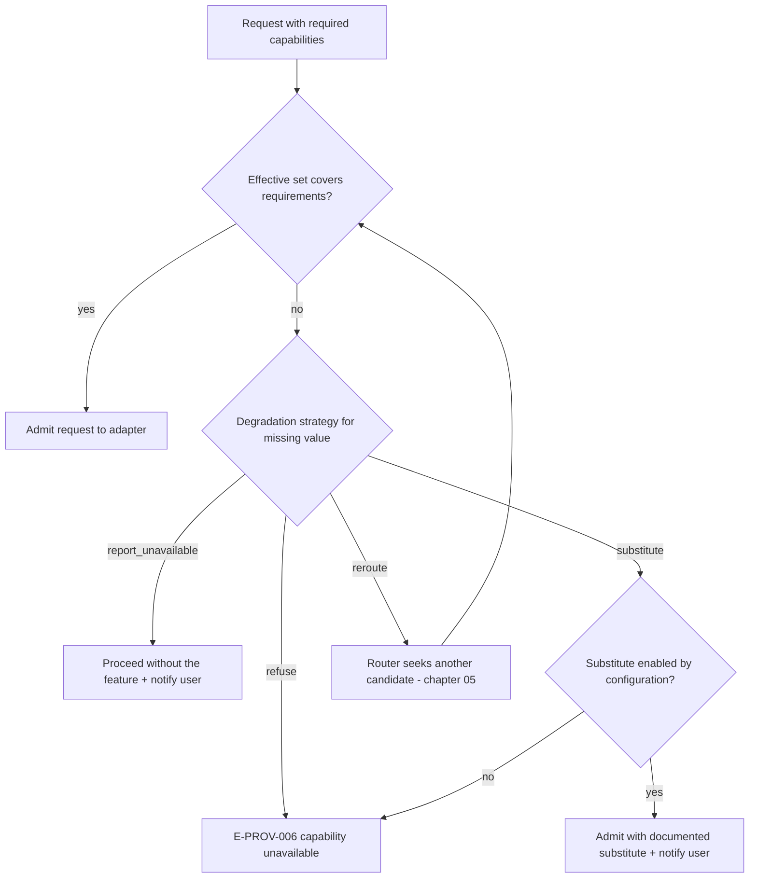

# 02 — Capabilities and Model Discovery

This chapter formalizes the **Capability** vocabulary (single home: Volume 5, per Volume 0
chapter 03), the resolution of effective capability sets, capability negotiation at request
time, degradation strategies, model discovery, and the notification duty for every provider
or model change. Behavior keys off declared capabilities, never off model or vendor names
(Principle 2; INV-MDL-02).

## The capability enum

The enum is **closed**: values are added only by ADR (INV-CAP-01). The seed vocabulary is
extended by exactly one value, `token_counting`, minted by ADR-056 — the frozen
`ProviderPort.CountTokens` method requires a declarable official counting mechanism that no
seed value expressed. Each value declares its level (`provider` | `model` | `both`) and a
testable meaning (Volume 2, Capability attributes).

| Capability | Level | Declaring it promises (testable meaning) |
|---|---|---|
| `chat` | model | The model completes `Chat`/`ChatStream` requests with role-structured messages |
| `streaming` | model | `ChatStream` delivers incremental events per chapter 03; not a local simulation over a blocking call |
| `tool_calling` | model | The model emits structured tool calls the adapter can map losslessly to the chapter 03 normal form |
| `parallel_tool_calling` | model | A single response may carry multiple independent tool calls, each individually addressable by ID |
| `structured_outputs` | model | The provider enforces an output schema natively (chapter 03 `native` mode) |
| `reasoning` | model | The provider officially exposes reasoning artifacts: summaries and/or reasoning token counts (Principle 7 — never private chain-of-thought) |
| `vision` | model | Image content parts are accepted as input |
| `audio_input` | model | Audio content parts are accepted as input |
| `audio_output` | model | The model can produce audio output parts |
| `embeddings` | model | `Embed` returns vectors for this model |
| `token_usage_reporting` | both | Responses carry official token usage; declared fields per the adapter's `UsageReporting` declaration (chapter 04) |
| `cost_reporting` | both | The provider officially reports monetary cost per request or account usage |
| `model_discovery` | provider | A documented enumeration mechanism backs `DiscoverModels` |
| `cancellation` | provider | Aborting the transport observably stops generation billing-side per provider documentation; absent it, cancellation is client-side only |
| `token_counting` | both | A documented counting mechanism backs `CountTokens` (ADR-056) |

Absence of a value means *not available*: no component may infer a capability from a name,
and no component may simulate an absent capability silently (INV-CAP-03).

## Effective capability set resolution

A model's **effective capability set** — what `Capabilities` returns and what negotiation
uses — is resolved deterministically from four provenance classes:

1. **`declared`** — the Adapter Declaration baseline (`ProviderCapabilities`,
   `ModelCapabilities` patterns). Fixed facts sourced from official documentation.
2. **`discovered`** — capability metadata officially reported by the provider's discovery
   mechanism, where one exists. Discovered data narrows or confirms declarations; it never
   adds values the adapter cannot map.
3. **`configured`** — user overrides in `[providers.<slug>.capability_overrides]`.
   Overrides may remove any value, and may add values only where the declaration marks the
   capability *configurable* (the generic OpenAI-compatible adapter marks `tool_calling`,
   `structured_outputs`, `vision`, `embeddings`, and `reasoning` configurable, because an
   arbitrary endpoint's support cannot be known statically).
4. **`verified` / `refuted`** — results of explicit verification probes. A refuted value is
   masked from the effective set until re-verified, regardless of declaration or
   configuration; a masked value emits `provider.capability.changed` and updates the Model
   row (INV-MDL-03).

Resolution order: start from `declared`, apply `discovered`, apply `configured`, apply
masks from `refuted`. Every value in the effective set carries its provenance class, and the
CLI/TUI provider views display it (Volume 8).

```toml
[providers.myendpoint.capability_overrides."llama-3*"]
add = ["tool_calling"]      # allowed: declaration marks it configurable
remove = ["vision"]         # always allowed

[providers.myendpoint]
verify_capabilities = "basic"   # "off" | "basic" | "probe"
```

`verify_capabilities` levels: `off` — declarations and configuration are trusted as-is;
`basic` (default) — reachability and model-presence checks during connection verification
(chapter 11); `probe` — capability probes (below) also run. Keys minted here; schema and
precedence per Volume 10.

## Negotiation and degradation



The diagram shows request admission: the router compares the request's required capabilities
against the effective set of the selected model. On a gap, the missing capability's
degradation strategy decides: `refuse` fails with E-PROV-006; `report_unavailable` proceeds
without the feature and notifies; `substitute` applies a documented substitute only when
configuration explicitly enables it; `reroute` re-enters routing to find a covering
candidate (bounded by chapter 05 candidate rules — the loop terminates when candidates are
exhausted, yielding E-PROV-016). Every degradation emits `provider.degradation.applied` and
a user notification (FR-PROV-013). Constraints: no strategy may silently simulate the
capability; substitutes are defined per capability below and nowhere else.

| Missing capability | Default strategy | Documented substitute (opt-in via `substitute`) |
|---|---|---|
| `chat` | refuse | none |
| `streaming` | report_unavailable | non-streaming `Chat` presented without incremental delivery — an absence, not a simulation |
| `tool_calling` | refuse (agent runs require it) | none — prompted pseudo-tool-calls are prohibited as silent simulation |
| `parallel_tool_calling` | report_unavailable | sequential tool calls |
| `structured_outputs` | reroute, then refuse | `tool_call` or `prompted` modes per chapter 03, each explicit and validated |
| `reasoning` | report_unavailable | none |
| `vision`, `audio_input`, `audio_output` | refuse when the request carries the modality | none |
| `embeddings` | refuse | none (Indexing Engine operates without embeddings per ADR-020 / Volume 7) |
| `token_usage_reporting` | report_unavailable | accounting records `cost_basis = unavailable` (chapter 04) |
| `cost_reporting` | report_unavailable | local pricing tables yield estimates (chapter 04) |
| `model_discovery` | report_unavailable | models from explicit configuration only |
| `cancellation` | report_unavailable | client-side abort; possible provider-side token spend recorded as such |
| `token_counting` | report_unavailable | Context Manager estimation (Volume 7) |

### FR-PROV-010 — Capability declaration and the capability matrix

- Type: Functional
- Status: Approved
- Priority: P0
- Phase: Core
- Source: Provided
- Owner: Provider Layer (Volume 5)
- Affected components: Provider Layer, all adapters, Agent Engine, Context Manager, CLI/TUI
- Dependencies: FR-PROV-001, FR-PROV-002; ADR-056; Volume 2 INV-CAP-01..03
- Related risks: RISK-PROV-002

#### Description

Every provider and every model MUST carry an effective capability set drawn exclusively from
the closed enum above, resolved by the four-class provenance procedure. The runtime MUST key
all capability-dependent behavior off effective sets — never off provider or model names.
The per-model **capability matrix** (models × capabilities with provenance) MUST be
queryable offline via `Capabilities` and inspectable in CLI/TUI provider views.

#### Motivation

PRD-002 and Principle 2 make honesty about capability differences a product identity
property; a single closed vocabulary with provenance makes honesty mechanically checkable.

#### Actors

Adapters (declare); users (configure, inspect); router (negotiate); conformance suite
(verify).

#### Preconditions

Adapter declaration validated (FR-PROV-002); provider configured.

#### Main flow

1. Resolution computes the effective set per the four-class procedure.
2. `Capabilities` serves the set (offline path — no network).
3. Consumers declare required capabilities per request; negotiation admits or degrades.

#### Alternative flows

- Discovery metadata changes a model's set: the Model row updates and
  `provider.capability.changed` is emitted (INV-MDL-03).
- User override adds a non-configurable capability: configuration validation rejects the
  override (E-CFG family at load time, per Volume 10 validation; the capability rule itself
  is this requirement's).

#### Edge cases

- Persisted set containing a value unknown to the running enum (downgrade scenario):
  surfaced as a validation error, not ignored (INV-CAP-02).
- Conflicting pattern matches in `ModelCapabilities`: the most specific pattern wins;
  ties are a declaration validation error (FR-PROV-002).

#### Inputs

Adapter Declarations; discovery metadata; configuration overrides; probe results.

#### Outputs

Effective capability sets with provenance; capability matrix views; change events.

#### States

None beyond Model registry rows; Provider connection states gate probe execution only.

#### Errors

E-PROV-006 (capability unavailable) at negotiation; declaration and override validation
errors per FR-PROV-002 and Volume 10.

#### Constraints

Enum closed (INV-CAP-01); additions only by ADR. Effective-set resolution MUST be
deterministic and reproducible from persisted inputs (run reproducibility, SM-12).

#### Security

Capability overrides are configuration and follow Volume 10 trust rules; no override may
grant a provider network access it lacks a permission grant for. Probe requests carry no
workspace content (fixed synthetic prompts only).

#### Observability

`provider.capability.changed` and `provider.capability.verified` events; provenance visible
in provider views; effective sets snapshotted into run records (Volume 4/10) for SM-12.

#### Performance

`Capabilities` answers from local state; Volume 12 budgets apply to the lookup path.

#### Compatibility

Enum versioning travels with the provider contract version; serialized sets are sorted
string arrays (Volume 2).

#### Acceptance criteria

- Given any code path in the Runtime, when audited, then no branch conditions on provider or
  model name strings exist outside adapters (ADR-033 prohibited-construct scan).
- Given a model whose effective set lacks `tool_calling`, when an agent run requiring tools
  selects it, then negotiation fails with E-PROV-006 before any wire request.
- Given an override adding `tool_calling` to a configurable declaration, when resolution
  runs, then the value appears with provenance `configured` and is visible in provider views.
- Negative case: given an override adding a non-configurable value, when configuration
  loads, then validation rejects it and names the offending key.
- Observability case: given a refuted capability, when masking applies, then
  `provider.capability.changed` carries old set, new set, and provenance.

#### Verification method

Conformance suite capability-honesty checks (SM-04); ADR-033 scans; unit tests of the
resolution procedure; CLI/TUI view tests (Volume 8/13).

#### Traceability

PRD-002; SM-04; ADR-056; INV-CAP-01..03, INV-MDL-02..03; FR-PROV-011, FR-PROV-012.

### FR-PROV-011 — Capability negotiation, verification, and degradation

- Type: Functional
- Status: Approved
- Priority: P0
- Phase: MVP
- Source: Provided
- Owner: Provider Layer (Volume 5)
- Affected components: Provider Router, adapters, Agent Engine, Workflow Engine
- Dependencies: FR-PROV-010; FR-PROV-013; ADR-056
- Related risks: RISK-PROV-002, RISK-PRD-006

#### Description

Every request MUST declare its required capabilities; the router MUST negotiate them against
the target's effective set before dispatch. A missing capability MUST resolve through that
capability's degradation strategy (table above): silent simulation is prohibited, absence is
reported to the user, documented substitutes require explicit configuration, and a
capability mandatory for the requesting workflow produces E-PROV-006. Verification probes
(level `probe`) MUST use fixed synthetic prompts, MUST run only during connection
verification or on explicit user command, and MUST record `verified`/`refuted` provenance.

#### Motivation

Negotiation-before-dispatch converts capability gaps from mid-run surprises into precise,
early, recorded decisions — the Principle 2 contract and the practical answer to local-model
capability variance (RISK-PRD-006).

#### Actors

Router; adapters; Agent/Workflow Engines (declare requirements); users (configure
substitutes, trigger probes).

#### Preconditions

Effective sets resolved (FR-PROV-010).

#### Main flow

Per the negotiation diagram above: compare, admit, or apply the strategy; emit
`provider.degradation.applied` and notify on any degradation.

#### Alternative flows

- `reroute` strategy: routing re-selects among configured candidates (chapter 05); if no
  candidate covers the requirement, E-PROV-016.
- Probe run: each probed capability yields `verified` or `refuted`;
  `provider.capability.verified` is emitted per probe.

#### Edge cases

- Requirements empty (plain chat): negotiation requires only `chat`.
- Capability refuted mid-session by a failed request that unambiguously indicates absence
  (per adapter error mapping): the router masks it, emits the change event, and applies the
  strategy on the retry path — never a silent second attempt with different semantics.
- Probe timeout: the capability stays at its prior provenance; probes never *grant*
  provenance on failure.

#### Inputs

Request capability requirements; effective sets; degradation configuration.

#### Outputs

Admission decision; degradation records; probe results; E-PROV-006/E-PROV-016 errors.

#### States

Providers in `degraded` connection state remain negotiable; `unavailable`/`disabled` are
excluded before negotiation (chapter 05).

#### Errors

E-PROV-006 (mandatory capability missing); E-PROV-016 (no covering candidate).

#### Constraints

Strategy table is normative; new substitutes require amending this chapter. Probes MUST be
bounded: one request per probed capability per verification pass.

#### Security

Substitute activation is configuration, auditable via config source attribution (Volume
10). Probes carry no user content and no filesystem data.

#### Observability

`provider.degradation.applied` (capability, strategy, run correlation);
`provider.capability.verified` (capability, outcome). Both feed the Principle 7 visibility
list (active capabilities per run).

#### Performance

Negotiation is a local set comparison on the request hot path; its latency budget is inside
Volume 12's tool-dispatch and first-token budgets.

#### Compatibility

Degradation strategies are part of the public contract surface (SM-20).

#### Acceptance criteria

- Given a request requiring `structured_outputs` against a model without it and no
  substitute configured, when submitted, then E-PROV-006 is returned before dispatch and the
  error names the capability.
- Given `substitute` enabled for `structured_outputs` in `tool_call` mode, when the same
  request runs, then it succeeds via the documented substitute, the user is notified, and
  `provider.degradation.applied` is recorded.
- Negative case: given a conformance-suite scenario where an adapter silently emulates tool
  calling by prompt injection, when capability-honesty checks run, then the adapter fails
  the suite.
- Permission case: probes against a provider lacking a `network` grant are refused by the
  permission path, not silently skipped.
- Observability case: every degradation in the suite corpus has a matching event and user
  notification record.

#### Verification method

Conformance suite (SM-04) capability-honesty and degradation scenarios; unit tests per
strategy; fault-injection refutation tests (Volume 13).

#### Traceability

PRD-002, PRD-006; SM-04; ADR-056; FR-PROV-010, FR-PROV-013; RISK-PRD-006.

## Model discovery

### FR-PROV-012 — Model discovery and the model registry

- Type: Functional
- Status: Approved
- Priority: P1
- Phase: MVP
- Source: Provided
- Owner: Provider Layer (Volume 5)
- Affected components: Provider Layer, Persistence Layer, CLI/TUI
- Dependencies: FR-PROV-001, FR-PROV-010; Volume 2 Model entity (INV-MDL-01..04)
- Related risks: RISK-PROV-001

#### Description

For providers declaring `model_discovery`, `DiscoverModels` MUST enumerate offered models
from the documented mechanism and reconcile them into the Model registry: upsert by
`(provider_id, name)` (INV-MDL-01), set `discovered = true`, update `last_seen_at`, and
map officially reported metadata (context windows, capability hints) into declarations per
FR-PROV-010 class `discovered`. Models present in the registry but absent from a successful
discovery MUST be marked `deprecated = true` — never deleted (attribution). Discovery
results are cached with lifetime `providers.discovery_ttl_hours` (default 24); providers
without `model_discovery` take models exclusively from explicit configuration.

#### Motivation

The Model catalog drives selection, routing, and the capability matrix; discovery keeps it
truthful without manual curation, and the no-delete rule keeps history attributable.

#### Actors

Router (scheduled/verification-time discovery); users (on-demand refresh via CLI/TUI);
adapters.

#### Preconditions

Provider in `available` or `degraded` state; `model_discovery` declared.

#### Main flow

1. Discovery triggers: connection verification, cache expiry on use, or explicit refresh.
2. The adapter fetches the documented enumeration and returns `ModelDescriptor` values.
3. The registry reconciles rows; changes emit events; `provider.discovery.completed`
   summarizes counts (discovered, new, deprecated).

#### Alternative flows

- Discovery fails: the cached registry continues to serve; the failure is an E-PROV error
  on the discovery operation only — selection and requests keep working from cache.
- Offline: discovery is skipped without error where the cache is fresh; explicit refresh
  offline returns E-PROV-001 (chapter 10 rules for local providers still apply).

#### Edge cases

- A previously deprecated model reappears: `deprecated` resets to `false`; the change is
  evented.
- Two discovery runs race: reconciliation is serialized per provider (router-level), so the
  registry never interleaves partial runs.
- A discovered name matching no declaration pattern: registered with only the capabilities
  the discovery metadata officially states, plus `chat` only if the adapter's declaration
  grants it as a provider-wide default.

#### Inputs

Documented enumeration responses; registry state; TTL configuration.

#### Outputs

Reconciled Model rows; `provider.discovery.completed`, `provider.model.deprecated`,
`provider.capability.changed` events.

#### States

Operates in `available`/`degraded`; contributes evidence to the connection machine's
verification transitions (chapter 11).

#### Errors

E-PROV-006 (no discovery mechanism); E-PROV-001/010/012 per chapter 06 for transport
failures; E-PROV-008 for undocumented response shapes.

#### Constraints

Discovery MUST NOT fabricate models or capabilities; only officially reported metadata maps
in. Registry writes go through the Persistence Layer to the global database (ADR-028).

#### Security

Discovery requests authenticate like any request; enumeration payloads are metadata and MUST
be redacted of any account-identifying values before event payloads (Volume 9 rules).

#### Observability

Events above; discovery latency and result-count metrics (Volume 12 taxonomy).

#### Performance

Discovery is off the request hot path (background or explicit); its timeout is
`timeouts.discovery_ms` (chapter 05).

#### Compatibility

`ModelDescriptor` is a contract type under SM-20; registry rows serialize per Volume 2.

#### Acceptance criteria

- Given a provider with `model_discovery`, when discovery completes, then the registry
  matches the enumeration exactly (new rows added, missing rows deprecated, no deletions).
- Given a fresh cache and no explicit refresh, when a request is admitted, then no
  discovery network call occurs on the request path.
- Negative case: given a discovery response that fails schema mapping, when reconciliation
  runs, then E-PROV-008 is recorded and the prior registry state is fully preserved.
- Permission/offline case: given the offline condition with a fresh cache, when selection
  runs, then cached models serve and no network attempt is observed (SM-05 method).
- Observability case: every reconciliation change is traceable to a
  `provider.discovery.completed` event with counts.

#### Verification method

Unit tests over reconciliation; recorded-fixture discovery tests per adapter; offline suite
checks (Volume 13); registry/event consistency assertions in the conformance suite.

#### Traceability

PRD-002, PRD-003; INV-MDL-01..04; FR-PROV-010; SM-04, SM-05.

## Change notification

### FR-PROV-013 — Provider and model change notification

- Type: Functional
- Status: Approved
- Priority: P0
- Phase: MVP
- Source: Provided
- Owner: Provider Layer (Volume 5)
- Affected components: Provider Router, Event Bus, CLI/TUI, Session/Run records
- Dependencies: FR-PROV-001; FR-PROV-011; chapter 05 routing/fallback
- Related risks: RISK-PROV-003

#### Description

Every provider or model change affecting a session — manual selection, automatic routing,
fallback activation, degradation substituting behavior, capability set change on a model in
use, or model deprecation — MUST be announced to the user and recorded before or together
with the first response produced under the new provider/model. Announcement is never
suppressed by quiet or non-interactive modes: presentation may compress to a single line
(CLI) or badge (TUI, per Volume 8), but the event and run-record entry always persist
(Volume 1, principles-in-tension rule 1).

#### Motivation

Principle 7 and Principle 1 make silent provider switches a defect class: users must always
know which vendor received their content and produced their answer, and cost attribution
depends on it.

#### Actors

Router (produces changes); drivers CLI/TUI (present); Event Bus and run records (persist).

#### Preconditions

A session or run holds an active provider/model selection.

#### Main flow

1. A change decision is made (routing, fallback, degradation, manual).
2. The router emits the specific event (`provider.route.selected`,
   `provider.fallback.activated`, `provider.degradation.applied`, or
   `provider.capability.changed`) with old/new identity and reason.
3. The active driver presents the announcement; the run record appends the change entry.

#### Alternative flows

- Non-interactive/headless runs: the announcement lands in structured output and events
  only; anything requiring consent (chapter 05 fallback approval rules) resolves from
  policy, and absence of a policy grant denies the change (PRD-009).

#### Edge cases

- Change during an in-flight stream: prohibited — changes apply only at request boundaries
  (chapter 05 fallback rules); the stream fails first, then the change is announced.
- Deprecation notice for a model currently configured as a default: surfaced at session
  start and on selection, not just at discovery time.

#### Inputs

Change decisions with reasons; old/new provider slug and model name.

#### Outputs

Events (above); driver announcements; run-record entries.

#### States

None of its own; consumes routing and connection state changes.

#### Errors

Failure to record a change is an E-PROV-012-class internal defect surfaced to the run;
announcements themselves never fail the underlying request.

#### Constraints

The record precedes or accompanies the first output under the new identity — never after.

#### Security

Announcements carry identity and reason, never request content; payload redaction per
Volume 9.

#### Observability

The four change events above; run-record change entries; SM-13 chain applies (each change
attributable to its trigger).

#### Performance

Announcement is a local emit; no added provider latency.

#### Compatibility

Event payloads versioned per Volume 10 envelope rules.

#### Acceptance criteria

- Given fallback activates mid-run at a request boundary, when the next response begins,
  then the user-visible announcement and the run-record entry already exist with old/new
  identity and reason.
- Given `--json` non-interactive output (Volume 8), when a change occurs, then the
  structured stream contains the change object — quiet flags do not remove it.
- Negative case: given a simulated router defect that switches without announcing, when the
  SM-13 audit-chain test runs, then the unattributed switch is detected as a failure.
- Permission case: a fallback requiring approval (chapter 05) that lacks a policy grant in
  headless mode is denied and the denial is recorded — no silent proceed.
- Observability case: every change event carries run/session correlation ULIDs resolvable
  to the announcing record.

#### Verification method

Integration tests over routing/fallback scenarios asserting event-before-output ordering;
SM-13 audit-chain test; Volume 8 driver presentation tests.

#### Traceability

PRD-001 (UC-10), PRD-006; Principle 1, Principle 7; FR-PROV-011; chapter 05 fallback rules.

## Discovery and capability observability

| Event | Version | Producer | Payload (summary) | Correlation |
|---|---|---|---|---|
| `provider.discovery.completed` | 1 | Provider Layer | provider slug, counts (offered, new, deprecated), duration ms | trace ULID |
| `provider.model.deprecated` | 1 | Provider Layer | provider slug, model name, evidence (absent-from-discovery or dated notice) | trace ULID |
| `provider.capability.changed` | 1 | Provider Layer | provider slug, model name, old set, new set, provenance | run/session when in use |
| `provider.capability.verified` | 1 | Provider Layer | provider slug, model name, capability, outcome (`verified`/`refuted`) | trace ULID |
| `provider.degradation.applied` | 1 | Provider Layer | capability, strategy, provider slug, model name, reason | run, turn ULIDs |

Envelope and delivery semantics per Volume 10; payloads redacted per Volume 9.

### NFR-PROV-002 — Local-model conformance

- Category: Compatibility
- Priority: P1
- Phase: v1
- Metric: Pass rate of the local-provider conformance suite (agent loop, tool calling, streaming, capability declaration honesty) against models that declare the required capabilities, on ≥ 2 local serving paths: the Ollama adapter and the generic OpenAI-compatible adapter against a local server (SM-04 definition)
- Target: ≥ 95% of applicable conformance checks pass on each supported local serving path
- Minimum threshold: ≥ 90% on each path (below it, the phase gate blocks per SM governance; the gap analysis is attached to the gate report)
- Measurement method: Automated conformance suite (Volume 13) run per release against pinned local models on reference hardware; model pinning per the Volume 1 open question V1-OQ-4
- Test environment: Reference hardware (Volume 1, chapter 06); local serving paths only, offline-capable configuration
- Measurement frequency: Every release; trend reviewed at phase gates
- Owner: Provider Layer (Volume 5)
- Dependencies: FR-PROV-010, FR-PROV-011; Volume 13 suite definition
- Risks: RISK-PROV-002, RISK-PRD-006
- Acceptance criteria: Per-release conformance report shows the pass rate per serving path with per-check outcomes; capability-honesty checks (no silent simulation, declared-set accuracy) are individually itemized and all pass.

### RISK-PROV-002 — Capability misdeclaration

- Category: Technical
- Probability: Medium
- Impact: High
- Severity: High
- Mitigation: Declarations sourced from official documentation only (FR-PROV-002); configurable capabilities are explicit user decisions with provenance; verification probes and conformance honesty checks refute over-declaration (FR-PROV-011); refuted values are masked and evented, and mandatory-capability gaps fail precisely (E-PROV-006) instead of corrupting runs
- Detection: `provider.capability.changed` masking events; conformance suite honesty checks (SM-04); E-PROV-019/E-PROV-008 patterns indicating declaration/behavior mismatch
- Owner: Provider Layer (Volume 5)
- Status: Open

Over-declaration (claiming `tool_calling` an endpoint lacks) causes mid-run failures;
under-declaration silently withholds value. Both are contained by provenance-tracked
resolution, probing, and honest negotiation — the failure mode becomes a visible, recorded
capability change rather than undefined behavior.
