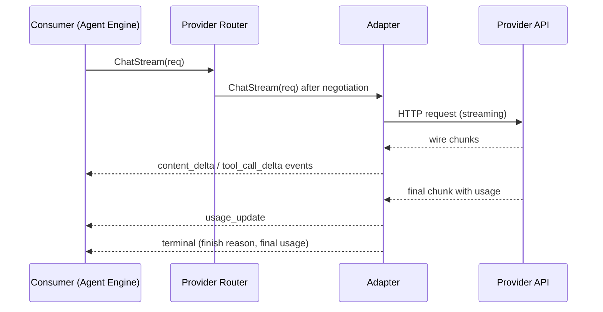

# 03 — Streaming, Tool Calling, and Structured Outputs

This chapter normalizes the three behavior surfaces where provider wire formats diverge
most. Adapters translate every provider's wire protocol into one **unified stream event
model**, one **tool-calling normal form**, and one **structured-output request surface** —
consumers never see wire-level differences (Principle 1; ADR-057).

## Unified stream event model

`ChatStream` yields `Stream[ChatEvent]`. `ChatEvent` is the tagged union frozen in shape by
Volume 3, chapter 02 (content delta, tool-call delta, usage, terminal); this chapter fixes
its members and ordering:

| Event kind | Content | Ordering rules |
|---|---|---|
| `content_delta` | part index, part kind (`text` \| `reasoning_summary`), UTF-8 text fragment | Fragments of one part arrive in order; parts may interleave only across distinct indexes |
| `tool_call_delta` | call index, call ID (once known), tool name (once known), argument JSON fragment | Fragments of one call arrive in order; parallel calls interleave across indexes |
| `usage_update` | cumulative official token usage known so far | Monotonically non-decreasing; optional — only where the provider streams usage |
| `terminal` | finish reason, final usage report, provider request ID where documented | Exactly one, always last |

Normative rules:

1. Every stream MUST end with exactly one `terminal` event or with a stream error — never
   both, never neither. After `terminal`, `Next` returns end-of-stream.
2. Finish reasons are the closed set `stop`, `length`, `tool_calls`, `content_filter`,
   `cancelled`, `error`. Adapters MUST map provider-specific reasons into this set and
   preserve the raw reason string in the terminal event's safe metadata.
3. Adapters MUST emit deltas as received — no whole-response buffering, no coalescing beyond
   transport framing (SM-08 overhead budget applies per chunk).
4. `reasoning_summary` parts appear only when the provider officially exposes reasoning
   artifacts (`reasoning` capability); adapters MUST NOT synthesize them (Principle 7).
5. A transport failure after one or more deltas terminates the stream with E-PROV-009
   (stream interrupted), carrying how much content was delivered; usage for interrupted
   streams reports tokens consumed up to abort when determinable (Volume 3 port rule).
6. Context cancellation ends the stream with E-PROV-011; the adapter MUST abort the
   underlying HTTP request (FR-ARCH-004) and, where the provider declares `cancellation`,
   the documented abort semantics apply provider-side.



The diagram shows one streamed turn: the consumer calls the router, which negotiates
capabilities (chapter 02) and selects the adapter; the adapter opens the wire stream and
translates chunks into ordered `ChatEvent` items, closing with exactly one `terminal`.
Constraints: the router adds no buffering stage; translation is per-chunk; the consumer owns
`Close` (Volume 3 stream discipline).

### FR-PROV-020 — Streaming contract

- Type: Functional
- Status: Draft
- Priority: P0
- Phase: MVP
- Source: Provided
- Owner: Provider Layer (Volume 5)
- Affected components: adapters, Provider Router, Agent Engine, TUI/CLI drivers
- Dependencies: FR-PROV-001; FR-ARCH-004; ADR-057
- Related risks: RISK-PROV-001

#### Description

Adapters for providers declaring `streaming` MUST implement `ChatStream` under the unified
event model and its six normative rules. The Provider Router MUST pass streams through
unmodified except for observability taps and the fallback boundary rule (chapter 05: no
provider change after the first delivered event).

#### Motivation

Streaming is an MVP minimum (Volume 1, item 16) and the TUI's live experience depends on
uniform incremental delivery regardless of vendor (PRD-008).

#### Actors

Adapters; router; Agent Engine; drivers rendering deltas.

#### Preconditions

Negotiation admitted the request; `streaming` in the effective capability set.

#### Main flow

As diagrammed: open, translate per chunk, terminate exactly once.

#### Alternative flows

- Model lacks `streaming`: degradation per chapter 02 (`report_unavailable` — the consumer
  receives the complete response without incremental delivery, and the user is notified).
- Provider streams usage only at end: `usage_update` is omitted; the terminal event carries
  final usage.

#### Edge cases

- Zero-content streams (immediate `tool_calls` finish): valid — tool-call deltas then
  terminal.
- Provider emits malformed chunk mid-stream: E-PROV-008 terminates the stream; delivered
  deltas remain valid data for the run record.
- Consumer closes early: `Close` cancels production; the adapter aborts the wire request;
  accounting records tokens up to abort when determinable.

#### Inputs

`ChatRequest`; wire chunks.

#### Outputs

Ordered `ChatEvent` stream; `provider.stream.interrupted` event on abnormal termination.

#### States

None beyond in-flight request bookkeeping; interrupted streams surface in the Run's records
(Volume 4), not in provider connection state (a single interruption is not a health verdict
— thresholds in chapter 05).

#### Errors

E-PROV-009 (interrupted), E-PROV-011 (cancelled), E-PROV-010 (timeout classes per chapter
05), E-PROV-008 (malformed chunk).

#### Constraints

No whole-response buffering; per-event bounded memory (ADR-023 backpressure); translation
MUST be allocation-bounded per chunk (Volume 12 measures).

#### Security

Stream content is user data: it flows to the consumer and run records under Volume 9
redaction rules; observability taps record sizes and timing, never content.

#### Observability

Span per stream with first-event latency, event counts, and termination class;
`provider.stream.interrupted` (payload: provider slug, model, delivered event count,
E-PROV code) on abnormal end.

#### Performance

First-token and inter-chunk latency budgets per Volume 12 (SM-08: ≤ 50 ms p95 added
overhead per chunk).

#### Compatibility

`ChatEvent` member set is a public contract surface (SM-20); additive members only within a
major line.

#### Acceptance criteria

- Given any conformance-suite streamed run, when events are recorded, then ordering rules
  1–2 hold and exactly one terminal event exists.
- Given a mid-stream transport cut (fault injection), when the stream ends, then the
  consumer receives E-PROV-009, delivered deltas are preserved in the run record, and
  `provider.stream.interrupted` is emitted.
- Given user cancellation mid-stream, when observed at the transport, then the HTTP request
  is aborted within the FR-ARCH-004 discipline and the stream ends with E-PROV-011.
- Negative case: an adapter buffering the full response before emitting fails the
  conformance suite's incrementality check (first event before final chunk on a paced
  fixture).
- Observability case: stream spans carry first-event latency and termination class for
  every suite run.

#### Verification method

Conformance suite with paced streaming fixtures; fault-injection (cuts, malformed chunks,
stalls); SM-08 overhead benchmarks (Volume 12); contract tests for cancellation.

#### Traceability

PRD-002, PRD-008; SM-08; ADR-057; FR-ARCH-004; Volume 1 MVP item 16.

## Tool calling normal form

Tool declarations cross the provider boundary in one shape: `name`, `description`, and an
input **JSON Schema** (ADR-024 dialect rules; Volume 6 owns the tool contract — the Provider
Layer transports declarations, it never interprets tool semantics). Adapters translate this
shape to the provider's documented format and translate responses back to:

- **Tool call**: call ID (provider-assigned where documented, adapter-minted ULID
  otherwise), tool name, arguments as one complete JSON document.
- **Tool choice** request modes: `auto` (model decides), `none` (tool calls disallowed),
  `required` (at least one call), `named(tool)` (force a specific tool) — adapters MUST
  refuse modes their provider does not document (E-PROV-007 with the unsupported mode named)
  rather than approximating.
- **Parallel calls**: multiple calls in one response are legal only when
  `parallel_tool_calling` is in the effective set; adapters for providers without it MUST
  surface calls one at a time as delivered.
- **Results**: tool results return as `tool`-role messages keyed by call ID on the next
  request; adapters map them to the provider's documented result format.

Malformed model output presenting as a tool call (unparseable JSON arguments, unknown
structure) normalizes to **E-PROV-018**; the router returns it as data to the Agent Engine,
whose retry/repair policy is Volume 4's — the Provider Layer never re-prompts on its own.

### FR-PROV-021 — Tool-calling normalization

- Type: Functional
- Status: Draft
- Priority: P0
- Phase: MVP
- Source: Provided
- Owner: Provider Layer (Volume 5)
- Affected components: adapters, Provider Router, Agent Engine, Tool Runtime (consumer of results)
- Dependencies: FR-PROV-001, FR-PROV-010; ADR-024, ADR-057
- Related risks: RISK-PROV-002

#### Description

Adapters MUST translate tool declarations, tool choice, tool calls (including parallel
calls and streamed argument deltas), and tool results between the normal form above and the
provider's documented format, losslessly in both directions for all schema constructs the
provider documents support for. Where a provider documents schema-subset limits, the
adapter declaration MUST state them and validation MUST reject unsupported constructs
before dispatch (E-PROV-007) — never silently strip them.

#### Motivation

Agents act through tools (PRD-004); the agent loop is portable across vendors only if tool
calling is one contract with honest limits.

#### Actors

Adapters; Agent Engine (issues declarations, consumes calls); conformance suite.

#### Preconditions

`tool_calling` in the effective capability set (chapter 02 — mandatory for agent runs).

#### Main flow

1. The Agent Engine attaches tool declarations and a tool-choice mode to a request.
2. The adapter validates declarations against its declared schema-subset limits, then
   translates and dispatches.
3. Responses stream tool-call deltas (streamed) or return complete calls (non-streamed).
4. Results return as `tool`-role messages on the subsequent request.

#### Alternative flows

- Streamed arguments: the Agent Engine receives argument fragments per the event model and
  assembles the complete JSON document at call completion (terminal or call-complete
  boundary); incomplete calls at stream interruption are recorded as interrupted data,
  never executed.

#### Edge cases

- Model calls an undeclared tool name: normalized to E-PROV-018 (data to the agent), never
  dispatched to the Tool Runtime.
- Duplicate call IDs in one response: adapter re-keys with minted ULIDs and flags the
  anomaly in safe metadata.
- Empty arguments where the schema requires fields: passed through as a call; input
  validation at the Tool Runtime (Volume 6) is the authority on tool-input validity.

#### Inputs

Tool declarations (name, description, JSON Schema); tool-choice mode; provider responses.

#### Outputs

Normalized tool calls with IDs; translated result messages; E-PROV-007/018 errors.

#### States

None; call assembly state is per-request.

#### Errors

E-PROV-007 (unsupported declaration or mode, pre-dispatch), E-PROV-018 (malformed call,
post-response).

#### Constraints

The Provider Layer MUST NOT execute, validate the semantics of, or filter tool calls — that
is the Tool Runtime's mediation (Volume 6); this layer guarantees only faithful transport
and normalization.

#### Security

Tool-call arguments are untrusted model output: they flow to the Tool Runtime's validation
and permission pipeline unmodified; the Provider Layer strips nothing and adds nothing
(SM-13 attribution requires fidelity). Argument content in events/spans is summarized and
redacted per Volume 9.

#### Observability

Tool-call counts and assembly timing on request spans; malformed-call occurrences carry
E-PROV-018 in `provider.request.failed` or as call-level data in the run record.

#### Performance

Argument assembly is incremental with bounded buffers per call (limits from the adapter
declaration).

#### Compatibility

Normal form is a public contract surface (SM-20); schema-subset declarations follow the
adapter versioning rules (FR-PROV-002).

#### Acceptance criteria

- Given the conformance suite's round-trip corpus (declarations with nested objects,
  arrays, enums, unions), when translated to each seed provider's format and back, then the
  normalized calls match the corpus expectations with zero loss.
- Given a declaration using a construct outside an adapter's declared subset, when
  validated, then E-PROV-007 names the construct and no wire request is sent.
- Given `parallel_tool_calling` absent, when a request is admitted, then the request is
  translated in the provider's documented single-call form and any multi-call response
  surfaces calls sequentially.
- Negative case: unparseable arguments normalize to E-PROV-018 and are never delivered to
  the Tool Runtime as a valid call.
- Observability case: every tool call in a run record resolves to its originating request
  span (SM-13).

#### Verification method

Round-trip conformance corpus per adapter; fault-injection with malformed model output;
SM-04 tool-calling checks on local paths; Volume 13 contract tests.

#### Traceability

PRD-004, PRD-002; SM-04, SM-13; ADR-024, ADR-057; FR-PROV-010, FR-PROV-020.

## Structured outputs

A `ChatRequest` MAY carry a **response format**: a named JSON Schema (ADR-024) the response
must satisfy. Three modes exist:

| Mode | Mechanism | Availability |
|---|---|---|
| `native` | The provider enforces the schema server-side per its documented structured-output mechanism | Requires `structured_outputs` capability |
| `tool_call` | The schema is presented as a single forced tool call and the arguments are the output | Requires `tool_calling`; explicit degradation per chapter 02 |
| `prompted` | Schema and instructions are rendered into the prompt; output is parsed | Opt-in only (`allow_prompted = true`); weakest guarantees |

Regardless of mode, Andromeda MUST validate the returned document locally against the schema
(jsonschema/v6 per ADR-024) — provider enforcement claims are verified, not trusted. A
validation failure is **E-PROV-017**, returned as data with the raw output preserved for
the consumer; re-request policy belongs to the caller (Agent Engine, Volume 4), bounded by
`validation_retries` as the router-enforced ceiling per turn.

```toml
[providers.myendpoint.structured_outputs]
allow_prompted = false   # prompted mode requires explicit opt-in
validation_retries = 1   # router-enforced ceiling on re-requests per turn
```

Which providers document native structured-output enforcement, and for which model families,
is recorded per adapter in the catalog (chapter 09) and is PENDING VALIDATION per adapter
against official documentation (register entry in `98-register-a.md`).

### FR-PROV-022 — Structured outputs

- Type: Functional
- Status: Draft
- Priority: P1
- Phase: MVP
- Source: Provided
- Owner: Provider Layer (Volume 5)
- Affected components: adapters, Provider Router, Agent Engine, Workflow Engine
- Dependencies: FR-PROV-010, FR-PROV-011, FR-PROV-021; ADR-024
- Related risks: RISK-PROV-002

#### Description

Requests carrying a response format MUST resolve to one of the three modes by negotiation:
`native` when the capability is present; otherwise the chapter 02 degradation path may
select `tool_call`; `prompted` only when explicitly enabled. The selected mode MUST be
recorded on the request span and run record. Local validation per ADR-024 MUST run on every
structured response in every mode; failures normalize to E-PROV-017 with the raw output
preserved as data.

#### Motivation

Workflows and the CLI's `--json` surfaces (Volume 8) depend on schema-valid machine output;
trust-but-verify keeps provider claims honest (Principle 2).

#### Actors

Consumers declaring response formats; router (mode selection); adapters (translation).

#### Preconditions

Response format schema validates as a schema (ADR-024 meta-validation) at request build.

#### Main flow

1. Negotiation selects the mode.
2. The adapter translates schema + request per the mode's documented mechanism.
3. The response document is locally validated; success returns typed content, failure
   returns E-PROV-017 data.

#### Alternative flows

- Retry within `validation_retries`: the caller may re-request; the router enforces the
  ceiling and fails the turn with E-PROV-017 when exhausted.

#### Edge cases

- Schema uses constructs the provider's native mechanism does not document: the adapter
  MUST reject `native` for that request (E-PROV-007) so negotiation can degrade — silent
  partial enforcement is prohibited.
- Streaming with response format: deltas deliver incrementally; validation runs on the
  assembled document at terminal.
- Empty or non-JSON output in `prompted` mode: E-PROV-017 with the raw text preserved.

#### Inputs

Response format (name + JSON Schema); mode configuration.

#### Outputs

Validated structured content or E-PROV-017 data; mode records.

#### States

None.

#### Errors

E-PROV-017 (validation failed), E-PROV-007 (schema constructs unsupported for the mode).

#### Constraints

Local validation is not skippable by configuration; `prompted` is never selected
implicitly.

#### Security

Schemas and outputs are user/workspace data under Volume 9 redaction; validation runs
locally (no schema leaves the machine beyond the provider request itself).

#### Observability

Mode, validation outcome, and retry count on the request span; failures carry E-PROV-017 in
events.

#### Performance

Validation cost is local and bounded; budgets under Volume 12's turn-latency envelope.

#### Compatibility

Modes and their selection rules are public contract surface (SM-20).

#### Acceptance criteria

- Given `structured_outputs` present, when a response-format request runs, then mode
  `native` is selected, the output validates locally, and the mode is on the span.
- Given the capability absent and `tool_call` degradation enabled, when the request runs,
  then the forced-tool mechanism produces output that validates against the same schema and
  the degradation is announced (FR-PROV-013).
- Given `allow_prompted = false` and no other mode available, when negotiation runs, then
  the request fails with E-PROV-006 — `prompted` is never auto-selected.
- Negative case: a provider response violating the schema in `native` mode yields
  E-PROV-017 with raw output preserved; the violation is not masked by re-serialization.
- Observability case: validation retries are countable per turn from spans and never exceed
  `validation_retries`.

#### Verification method

Conformance suite schema corpus across modes; fault injection with schema-violating
fixtures; SM-04 structured-output checks where local models declare support; Volume 13
contract tests.

#### Traceability

PRD-002, PRD-009; SM-04, SM-20; ADR-024, ADR-057; FR-PROV-011, FR-PROV-013.

## Stream observability

| Event | Version | Producer | Payload (summary) | Correlation |
|---|---|---|---|---|
| `provider.stream.interrupted` | 1 | Provider Layer | provider slug, model name, delivered event count, E-PROV code, delivered-usage snapshot | run, turn, trace ULIDs |

Envelope per Volume 10; redaction per Volume 9 (counts and codes, never content).
