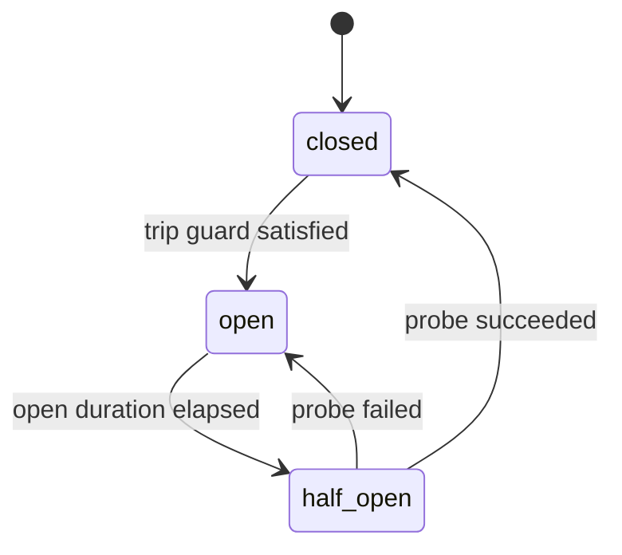

# 05 — Resilience, Routing, and Fallback

This chapter defines how the Provider Layer behaves when providers are slow, saturated, or
failing: timeout policy, rate-limit handling, retries, the per-provider circuit breaker,
health verification, routing, and fallback — including the guard rules that prevent unsafe
or costly fallback. Retry/fallback *policy* lives in the Provider Router, above adapters
(Volume 3, chapter 02); adapters supply mechanism and declared defaults (FR-PROV-002). The
Provider connection state machine these mechanisms drive is specified in chapter 11; this
chapter uses its frozen state names only.

## Timeout policy

Five timeout classes govern every request; effective values resolve per Volume 10 precedence
from `[providers.<slug>.timeouts]` (keys minted here), adapter declaration defaults, and the
layer defaults below:

| Key | Default | Applies to |
|---|---|---|
| `connect_ms` | 10000 | TCP/TLS connection establishment |
| `request_ms` | 120000 | Non-streaming request, send to complete response |
| `first_token_ms` | 60000 | Stream: request send to first `ChatEvent` |
| `stream_idle_ms` | 60000 | Stream: maximum gap between consecutive events |
| `stream_total_ms` | 600000 | Stream: total duration ceiling |
| `discovery_ms` | 30000 | `DiscoverModels` / health probes |
| `embed_ms` | 60000 | `Embed` batches |

Expiry normalizes to E-PROV-010 with the class named; timeout errors map to exit code 8 at
the CLI boundary (ADR-016). A timeout MUST abort the underlying request (FR-ARCH-004).

## Rate limits

Two mechanisms, both bounded:

- **Local pacing** — `[providers.<slug>.limits]`: `max_concurrent_requests` (default 4) and
  optional `requests_per_minute` (unset = no local pacing). Submissions beyond concurrency
  queue FIFO with a queue-wait deadline equal to the request's timeout class; queue overflow
  behavior follows ADR-023 backpressure (bounded queue, reject beyond bound with
  E-PROV-003 marked locally-generated).
- **Provider signals** — a documented rate-limit response (HTTP 429 or the provider's
  documented equivalent) normalizes to E-PROV-003. A documented retry-delay signal
  (`Retry-After` or equivalent metadata) is honored, capped by `retry.retry_after_cap_ms`
  (default 60000). Which metadata each provider documents is an adapter-catalog fact
  (chapter 09), PENDING VALIDATION per adapter (register entry in `98-register-a.md`).

Sustained rate pressure (breaker window statistics below) moves the Provider connection
state to `degraded`, which routing treats as eligible-but-deprioritized (chapter 11 machine).

## Retry policy

Retries are router-owned, keyed exclusively to the normalized error's retryability class
(chapter 06 matrix) — never to raw wire conditions. `[providers.<slug>.retry]` keys:

| Key | Default | Meaning |
|---|---|---|
| `max_attempts` | 3 | Total attempts (1 initial + up to 2 retries) |
| `base_delay_ms` | 500 | First backoff delay |
| `backoff_multiplier` | 2.0 | Exponential factor |
| `max_delay_ms` | 10000 | Backoff ceiling |
| `retry_after_cap_ms` | 60000 | Ceiling on honored provider retry-delay signals |

Rules: full jitter (uniform random 0..computed delay); provider retry-delay signals replace
the computed delay when present (capped); non-retryable classes never retry; streaming
requests retry only when no event has been delivered to the consumer — after first delivery,
failure surfaces as E-PROV-009 and the turn-level decision belongs to the Agent Engine
(Volume 4). Retries that reach the provider may duplicate token spend: each attempt with
usage produces its own attempt-numbered Cost Record (FR-PROV-030), and
`provider.request.retried` makes retry spend visible.

## Circuit breaker

Each configured Provider has one router-owned breaker — an internal mechanism, not a domain
entity machine; its observable projection is the Provider connection state (full machine,
chapter 11).



Prose (all twelve machine elements): **initial state** `closed` (requests flow; outcomes
feed a rolling window). **Terminal states**: none — the breaker lives while its Provider is
registered and resets to `closed` on process start (state is in-memory; **persistence** is
none by design, so a restart re-probes reality rather than trusting stale verdicts).
**Transitions/events/guards**: `closed → open` when, within `window_s`, failures of
breaker-eligible classes (chapter 06 matrix column "breaker") reach `failure_threshold`
consecutively or `failure_ratio` with at least `min_samples`; emits
`provider.breaker.opened`. `open → half_open` after the open duration (starts at
`open_base_s`, doubles per consecutive reopen up to `open_max_s`); **timeouts** are these
durations. `half_open → closed` when the single allowed probe (**retries**: exactly one
in-flight probe; other requests are rejected) succeeds; emits `provider.breaker.closed`.
`half_open → open` when the probe fails. **Side effects**: while `open`/`half_open`
(non-probe), submissions are rejected locally with E-PROV-015 without touching the wire;
connection state projects `open → unavailable`, `half_open → verifying`, sustained
window pressure without trip → `degraded`. **Cancellation**: process shutdown discards
breaker state; in-flight probes obey context cancellation like any request.
**Recovery**: restart-to-closed plus health verification (below). **Errors**: E-PROV-015
(rejection); probe failures carry their own normalized codes.

`[providers.<slug>.breaker]` keys: `enabled` (default true), `failure_threshold` (5),
`failure_ratio` (0.5), `min_samples` (10), `window_s` (60), `open_base_s` (30),
`open_max_s` (600).

## Health verification

Each adapter declares its cheapest documented liveness probe (`Health` declaration,
FR-PROV-002 — typically the model-enumeration endpoint; never an undocumented path).
Verification runs: on provider enablement, on breaker `half_open` probes, on explicit user
command, and on a re-verification interval while `unavailable` (default 300 s, key
`[providers.<slug>].reverify_s`). Verification outcomes are the evidence that drives the
connection machine's `verifying → available | degraded | unavailable` transitions
(chapter 11). Probes are subject to `discovery_ms` timeouts and carry no user content.

## Routing

The Provider Router resolves every request to one (provider, model) target:

1. **Explicit selection wins.** A request naming provider+model (agent profile
   `model_selector`, CLI flag, workflow step) is used exactly as named; failing that target
   is an error or a fallback decision — never a silent substitution (FR-PROV-013).
2. **`preference_list`** — when selection is delegated (`[providers.routing]`
   `strategy = "preference_list"`), the router walks the ordered `preference` list of
   provider slugs, using each provider's `default_model` unless the request names a model.
3. **Capability filter always applies**: candidates lacking the request's required
   capabilities are skipped (chapter 02 negotiation), as are providers in `unavailable`,
   `disabled`, or `removed` connection states or with an open breaker; `degraded` providers
   are eligible after non-degraded candidates of equal preference.
4. Cost- or latency-scored automatic routing is a Beta candidate under FR-PROV-042
   compatibility rules; at MVP the strategies are exactly `explicit` and `preference_list`.

Every routed selection that was not explicitly named emits `provider.route.selected` with
the reason chain (preference position, skips and their causes) and is announced per
FR-PROV-013.

```toml
[providers.routing]
strategy = "explicit"            # "explicit" | "preference_list"
preference = ["anthropic", "local"]

[[providers.fallback.chains]]
name = "cloud-to-local"
from = "anthropic"               # source provider slug
targets = ["local"]              # ordered fallback candidates
triggers = ["unreachable", "rate_limited", "timeout", "internal_error", "breaker_open"]
allow_local_to_cloud = false     # egress guard (rule F2)
max_price_multiplier = 1.0       # cost guard (rule F5)
require_approval = false         # interactive approval before first activation per run
```

## Fallback

Fallback re-targets a *failed or unroutable request* to the next candidate of a configured
chain. Triggers are the normalized classes named in the chain's `triggers` (vocabulary:
`unreachable`, `auth_failed`, `rate_limited`, `quota_exhausted`, `timeout`,
`internal_error`, `breaker_open`, `capability_gap` — the chapter 06 matrix maps codes to
classes).

**Guard rules (normative, evaluated in order):**

- **F1 — Explicit chains only.** No fallback occurs outside a configured chain matching the
  source provider. No implicit candidates exist.
- **F2 — Egress guard.** A chain step from a provider whose endpoint is loopback/local to a
  non-local provider MUST be refused unless the chain sets `allow_local_to_cloud = true`
  AND a standing `network` permission grant (scope `provider`) exists for the target —
  local-to-cloud fallback is a data-egress decision, never a resilience default.
- **F3 — Capability guard.** A target lacking any required capability of the request is
  skipped (no degraded-capability fallback without the chapter 02 strategy explicitly
  permitting it).
- **F4 — Policy guard.** Targets excluded by the effective policy (Policy Engine, Volume 9
  scopes) are skipped; in headless mode, absence of a policy grant for `require_approval`
  chains denies activation (PRD-009).
- **F5 — Cost guard.** When pricing data exists for both source and target (chapter 04),
  a target whose estimated unit price exceeds `max_price_multiplier` × source price
  requires interactive approval (or policy grant) regardless of `require_approval`; when
  pricing is unknown for the target, the chain step proceeds only if `require_approval`
  resolved positively or the chain explicitly sets `max_price_multiplier` absent.
- **F6 — Stream boundary.** No fallback after the first delivered stream event; the
  failure surfaces to the Agent Engine (chapter 03 rule 5).
- **F7 — No auth masking.** `auth_failed` triggers fallback only when the chain names it
  explicitly — falling back on authentication failures by default would hide credential
  problems (chapter 07/08 own the remediation flow).
- **F8 — Announcement.** Every activation emits `provider.fallback.activated` and a user
  notification before the first response from the target (FR-PROV-013); every exhausted
  chain yields E-PROV-016 naming every candidate and why it was skipped.

### FR-PROV-040 — Timeouts, rate limits, and retries

- Type: Functional
- Status: Draft
- Priority: P0
- Phase: MVP
- Source: Provided
- Owner: Provider Layer (Volume 5)
- Affected components: Provider Router, adapters, Task Scheduler
- Dependencies: FR-PROV-001; FR-ARCH-004; ADR-023, ADR-059; chapter 06 retryability matrix
- Related risks: RISK-PROV-004, RISK-PROV-001

#### Description

Every provider request MUST run under the five-class timeout policy, local pacing limits,
and the router-owned retry policy defined above, with all values configurable per provider
and all defaults as stated. Retry eligibility MUST derive solely from the normalized
retryability class; provider retry-delay signals are honored capped; streaming retries stop
at first delivery.

#### Motivation

Unbounded waits and naive retry storms are the two classic failure amplifiers; fixed
classes with jittered backoff and visible retry spend keep failures bounded and honest.

#### Actors

Router (policy); adapters (mechanism); users (configuration).

#### Preconditions

Request admitted by negotiation and routing.

#### Main flow

1. Submission acquires a concurrency slot (or queues within bounds).
2. The attempt runs under its timeout class.
3. On a retryable failure with attempts remaining, the router waits (jittered backoff or
   capped provider signal) and re-attempts; `provider.request.retried` is emitted per retry.

#### Alternative flows

- Queue-wait deadline reached before a slot frees: E-PROV-003 (locally generated) without
  wire traffic.
- Non-retryable failure: immediate normalization and return (chapter 06).

#### Edge cases

- Timeout racing completion: the first outcome wins; a response arriving after abort is
  discarded and MUST NOT produce a second result or record beyond the attempt's usage when
  determinable.
- Retry-delay signal exceeding the cap: the cap applies and the discrepancy is recorded in
  safe metadata.
- `max_attempts = 1`: no retries; policy still applies timeouts and pacing.

#### Inputs

Requests; configured policy values; normalized failures.

#### Outputs

Completed responses; attempt-numbered failures; retry events; attempt-level Cost Records.

#### States

Feeds breaker windows and connection-state evidence; owns no entity state.

#### Errors

E-PROV-010 (timeout, class named), E-PROV-003 (rate limited, origin marked local or
provider), plus pass-through of terminal classes.

#### Constraints

ADR-023 bounded queues; no retry without jitter; no retry on non-retryable classes; no
sleep beyond `retry_after_cap_ms`.

#### Security

Pacing and retries never bypass permission checks (evaluated once per logical request,
valid across its attempts); retry metadata carries no content.

#### Observability

`provider.request.retried` (payload: provider slug, model, attempt, delay ms, trigger
code); retry/timeout/pacing metrics per Volume 12 taxonomy.

#### Performance

Defaults above; Volume 12 owns latency budgets and may tighten defaults via its NFRs.

#### Compatibility

Key set is public configuration surface (Volume 10 schema versioning).

#### Acceptance criteria

- Given a provider stalling beyond `first_token_ms`, when a stream starts, then the attempt
  aborts with E-PROV-010 naming the class, and the wire request is cancelled.
- Given a retryable failure with `max_attempts = 3`, when attempts proceed, then delays
  follow jittered exponential backoff within bounds and exactly two retries occur.
- Given a provider retry-delay signal of 5 s, when a retry is scheduled, then the delay is
  5 s (signal replaces backoff) and is recorded.
- Negative case: a non-retryable class (chapter 06 matrix) never produces a retry in the
  fault-injection suite.
- Permission case: retries reuse the original grant; no additional permission prompt occurs
  mid-request.
- Observability case: every retry in the suite corpus has a `provider.request.retried`
  event with attempt numbering consistent with Cost Records.

#### Verification method

Fault-injection suite (stalls, 429s with and without signals, connection drops); timer
tests with fake clocks; conformance checks for abort-on-timeout (FR-ARCH-004); Volume 13
contract tests.

#### Traceability

PRD-005, PRD-006; ADR-023, ADR-059; FR-PROV-030 (retry spend visibility); chapter 06
matrix.

### FR-PROV-041 — Circuit breaker and health verification

- Type: Functional
- Status: Draft
- Priority: P1
- Phase: MVP
- Source: Provided
- Owner: Provider Layer (Volume 5)
- Affected components: Provider Router, adapters, connection state machine (chapter 11)
- Dependencies: FR-PROV-040; ADR-059; chapter 11 machine
- Related risks: RISK-PROV-004

#### Description

Each configured Provider MUST have a router-owned circuit breaker implementing the
mechanism above (trip guards, open durations with doubling, single half-open probe,
restart-to-closed), and a health-verification path using only the adapter's declared
documented probe. Breaker and verification outcomes are the only automatic evidence that
moves Provider connection states; manual `disabled` always wins over automatic states.

#### Motivation

Failing fast locally (E-PROV-015) protects runs from queuing on dead providers, avoids
hammering saturated services, and gives routing a truthful availability signal.

#### Actors

Router (breaker); adapters (probe); users (explicit verify command, disable/enable).

#### Preconditions

Provider registered and enabled.

#### Main flow

Outcomes feed the window; trips reject locally; half-open probes re-admit on success;
verification drives connection transitions per chapter 11.

#### Alternative flows

- Explicit user verification while `open`: runs the probe immediately; success closes the
  breaker without waiting for the open duration.

#### Edge cases

- All providers of a preference list open: routing yields E-PROV-016 listing breaker
  rejections per candidate; nothing waits on open breakers.
- Flapping (open/close cycles): consecutive reopens double the open duration up to
  `open_max_s`, bounding probe traffic.
- Breaker disabled by configuration: requests flow; connection states then move only on
  verification and hard failures.

#### Inputs

Attempt outcomes by class; probe results; configuration.

#### Outputs

Local rejections (E-PROV-015); breaker events; connection-state evidence.

#### States

Breaker states `closed`/`open`/`half_open` (internal mechanism); projections onto frozen
connection states as specified above; full machine chapter 11.

#### Errors

E-PROV-015 (rejection); probe failures normalize per chapter 06.

#### Constraints

One probe in flight per provider; no persistence of breaker state; eligible failure classes
fixed by the chapter 06 matrix.

#### Security

Probes use documented endpoints only, carry no user content, and authenticate via the
provider's normal credential path.

#### Observability

`provider.breaker.opened` (window statistics, consecutive-reopen count) and
`provider.breaker.closed` (probe latency); breaker-state metrics per provider (Volume 12).

#### Performance

Rejection is a local constant-time check on the hot path; probe cost bounded by
`discovery_ms`.

#### Compatibility

Uniform across adapters; local providers get the same mechanism (a crashed local server
trips like a cloud outage).

#### Acceptance criteria

- Given 5 consecutive eligible failures within the window, when the next request arrives,
  then it is rejected with E-PROV-015 without wire traffic and
  `provider.breaker.opened` has been emitted.
- Given an open breaker past its duration, when the next request arrives, then exactly one
  probe is admitted and concurrent requests keep receiving E-PROV-015.
- Given a successful probe, when the breaker closes, then routing re-admits the provider
  and the connection state leaves `unavailable` per chapter 11.
- Negative case: non-eligible classes (e.g., E-PROV-007 request-invalid) never contribute
  to the trip guard in fault-injection runs.
- Observability case: breaker transitions and connection-state transitions correlate 1:1
  in the event stream for every suite scenario.

#### Verification method

Fault-injection with scripted failure sequences and fake clocks; concurrency tests on the
single-probe rule; chapter 11 machine conformance tests (Volume 13).

#### Traceability

PRD-005; ADR-059; FR-PROV-040; chapter 11 Provider connection machine; E-PROV-015.

### FR-PROV-042 — Routing and selection

- Type: Functional
- Status: Draft
- Priority: P0
- Phase: MVP
- Source: Provided
- Owner: Provider Layer (Volume 5)
- Affected components: Provider Router, Agent Engine (profiles), CLI/TUI selection surfaces
- Dependencies: FR-PROV-010, FR-PROV-011, FR-PROV-013; ADR-060
- Related risks: RISK-PROV-004

#### Description

The Provider Router MUST resolve every request per the four routing rules above: explicit
selection is used exactly as named; delegated selection walks the configured preference
list; the capability filter and state/breaker exclusions always apply; automatic strategies
beyond `preference_list` do not exist at MVP. Selection MUST be deterministic given
identical inputs (routing state snapshot recorded for SM-12 reproducibility).

#### Motivation

Provider selection is user- and policy-controlled by principle (Principle 1); deterministic,
explainable routing is what makes provider changes announceable and auditable.

#### Actors

Users and profiles (explicit selection); router; policy (exclusions).

#### Preconditions

At least one enabled provider; effective capability sets resolved.

#### Main flow

Resolve target per rules 1–3; emit `provider.route.selected` when delegated; dispatch.

#### Alternative flows

- Explicit target unavailable: the request fails with the target's normalized error unless
  a fallback chain covers it (FR-PROV-043) — no silent substitution.

#### Edge cases

- Preference list empty or fully excluded: E-PROV-016 with per-candidate reasons.
- Two providers exposing the same model name: distinct targets (INV-MDL-01) — selection is
  always by (provider, model), never by bare model name.
- Provider `degraded`: eligible after equal-preference non-degraded candidates; the
  deprioritization is part of the recorded reason chain.

#### Inputs

Explicit selections; routing configuration; capability sets; connection/breaker states.

#### Outputs

A (provider, model) target with recorded reason chain; E-PROV-016 on exhaustion.

#### States

Consumes connection states; owns none.

#### Errors

E-PROV-016 (no eligible target); target errors pass through normalized.

#### Constraints

Determinism given identical snapshots; no name-based heuristics (Principle 2); routing
never overrides `disabled`.

#### Security

Policy exclusions (Volume 9) apply before dispatch; routing cannot select a provider
without a standing `network` grant (FR-PROV-001 security).

#### Observability

`provider.route.selected` (payload: chosen target, strategy, reason chain with skipped
candidates and causes); routing decisions land in run records (SM-12 snapshot).

#### Performance

Selection is local set arithmetic; hot-path budget within Volume 12's dispatch envelope.

#### Compatibility

Adding strategies is additive under SM-20; `strategy` values are a closed set per release.

#### Acceptance criteria

- Given an explicit (provider, model) selection, when routing runs, then exactly that
  target is used or the request fails with the target's error — no substitution occurs.
- Given `preference_list` with the first candidate's breaker open, when routing runs, then
  the second candidate is selected and the reason chain records the skip cause.
- Given identical routing snapshots (SM-12 replay), when selection re-runs, then the same
  target results.
- Negative/permission case: a provider without a `network` grant is skipped with the skip
  recorded as permission-based, and no wire request reaches it.
- Observability case: every delegated selection in the suite corpus has a
  `provider.route.selected` event resolvable to its run.

#### Verification method

Unit tests over selection with synthetic snapshots; replay determinism tests (SM-12
method); integration tests with breaker/state exclusions; permission-path tests.

#### Traceability

PRD-002, PRD-006; SM-12; ADR-060; FR-PROV-011, FR-PROV-013, FR-PROV-043.

### FR-PROV-043 — Fallback and its guard rules

- Type: Functional
- Status: Draft
- Priority: P0
- Phase: MVP
- Source: Provided
- Owner: Provider Layer (Volume 5)
- Affected components: Provider Router, Permission Manager, Policy Engine, CLI/TUI
- Dependencies: FR-PROV-042, FR-PROV-013, FR-PROV-031; ADR-060
- Related risks: RISK-PROV-004

#### Description

Fallback MUST occur only through configured chains and MUST evaluate guard rules F1–F8 in
order for every candidate step. Chains declare source, ordered targets, trigger classes,
and guard parameters (`allow_local_to_cloud`, `max_price_multiplier`, `require_approval`).
Activation is announced before the target's first response; exhaustion yields E-PROV-016
with per-candidate reasons.

#### Motivation

Fallback trades one provider's failure for another provider's cost, jurisdiction, and
capability profile — a decision that belongs to users and policy (Principle 1), bounded by
rules that make the expensive and the surprising impossible by default.

#### Actors

Users (configure chains, approve); router (evaluate); Permission Manager and Policy Engine
(F2/F4/F5 gates).

#### Preconditions

A chain matches the failing source; a trigger class fired.

#### Main flow

1. A request fails with a class listed in a matching chain's `triggers`.
2. Guards F1–F8 evaluate against the next target; approvals raise through PermissionPort
   `Request` where required.
3. On pass, the request re-dispatches to the target; `provider.fallback.activated` and the
   user notification precede its first response.

#### Alternative flows

- Approval denied or expired: the step is skipped with the denial recorded; the chain
  continues to the next target (denial of one step is not chain abort).
- Headless (PRD-009): approval-requiring steps resolve from policy; absent a grant, the
  step is denied and recorded.

#### Edge cases

- Fallback during streaming after first delivered event: prohibited (F6); the failure
  surfaces and the Agent Engine owns the turn decision.
- Chains chaining (target itself has a chain): activation does not cascade — one chain, the
  matching source's, governs a request; targets' own chains apply only to requests
  originally routed to them.
- Trigger class `capability_gap`: fires only from negotiation-time gaps under the `reroute`
  strategy (chapter 02), reusing the same guard evaluation.

#### Inputs

Chain configuration; normalized failure classes; pricing data (F5); permission/policy
decisions.

#### Outputs

Re-dispatched requests; activation events and notifications; E-PROV-016 on exhaustion.

#### States

None owned; consumes connection/breaker states via routing.

#### Errors

E-PROV-016 (exhausted, with reasons); guard refusals are recorded skip reasons, not errors.

#### Constraints

Guards evaluate in the fixed order F1–F8; no implicit chains; no cascading; no mid-stream
switches.

#### Security

F2 makes local→cloud egress an explicit configuration plus permission decision; F4 binds
fallback to policy scopes; approvals persist as Approval records (Volume 9 states) —
fallback can never widen data egress silently.

#### Observability

`provider.fallback.activated` (payload: chain name, from/to targets, trigger class, guard
results summary); skips and denials recorded per candidate; SM-13 chain applies.

#### Performance

Guard evaluation is local; re-dispatch inherits the target's timeout/retry policy fresh.

#### Compatibility

Chain schema is public configuration surface; new guard parameters are additive with
guard-order stability (SM-20).

#### Acceptance criteria

- Given a chain from a local provider to a cloud provider with `allow_local_to_cloud`
  unset, when the trigger fires, then the step is refused (F2), the refusal is recorded,
  and no data reaches the cloud target.
- Given pricing data where the target exceeds `max_price_multiplier`, when evaluation
  runs, then activation blocks pending approval and proceeds only on a positive decision
  (F5), which is persisted as an Approval record.
- Given all targets skipped, when the chain exhausts, then E-PROV-016 lists every candidate
  with its skip reason and exit code 7 applies at the CLI boundary.
- Negative case: no fallback occurs for a failure class not in `triggers`, and no fallback
  ever occurs without a configured chain (F1) in the whole fault-injection corpus.
- Permission case: headless activation without policy grant is denied and recorded (F4).
- Observability case: activation events precede first-target-response records in every
  suite scenario (FR-PROV-013 ordering).

#### Verification method

Guard-rule unit tests (order and outcomes); integration scenarios per guard; headless
policy tests; SM-13 audit-chain verification of announcements and approvals.

#### Traceability

PRD-001 (UC-10), PRD-005, PRD-006, PRD-009; ADR-060; FR-PROV-013, FR-PROV-031,
FR-PROV-042; RISK-PROV-004.

## Resilience observability

| Event | Version | Producer | Payload (summary) | Correlation |
|---|---|---|---|---|
| `provider.request.retried` | 1 | Provider Router | provider slug, model, attempt number, delay ms, trigger E-PROV code, delay source (backoff/signal) | run, turn, trace ULIDs |
| `provider.route.selected` | 1 | Provider Router | target (provider, model), strategy, reason chain (skipped candidates + causes) | run, turn, trace ULIDs |
| `provider.fallback.activated` | 1 | Provider Router | chain name, from/to (provider, model), trigger class, guard summary, approval reference when present | run, turn, trace ULIDs |
| `provider.breaker.opened` | 1 | Provider Router | provider slug, window statistics, consecutive-reopen count | trace ULID |
| `provider.breaker.closed` | 1 | Provider Router | provider slug, probe latency ms | trace ULID |

Envelope per Volume 10; payloads carry identities, numbers, and codes — never content.

### RISK-PROV-004 — Fallback amplifies cost or data exposure

- Category: Security / product
- Probability: Medium
- Impact: High
- Severity: High
- Mitigation: Guard rules F1–F8 (explicit chains, egress guard, capability guard, policy guard, cost guard, stream boundary, no auth masking, mandatory announcement); approvals persisted as Approval records; attempt-level Cost Records make fallback spend visible (FR-PROV-030)
- Detection: `provider.fallback.activated` audit trail; cost-basis and per-provider spend metrics; SM-13 audit-chain tests asserting no unattributed provider switches
- Owner: Provider Layer (Volume 5)
- Status: Open

The residual risk is a user configuring a permissive chain and approving by habit; scoped
approvals, per-activation announcements, and visible spend keep even permissive
configurations inspectable and reversible.
