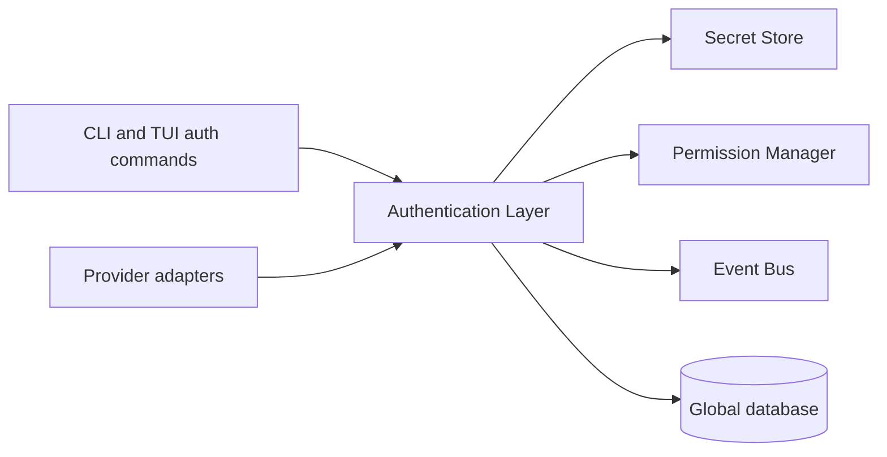

# 07 — Authentication Layer

This chapter specifies the **Authentication Layer**: the component that acquires, refreshes,
rotates, and revokes credentials for providers and provider-adjacent services, behind the
frozen **AuthPort** interface (Volume 3, chapter 02). The single-home split applies throughout:
this volume owns the authentication *flows*; Volume 9 owns the credential-*storage model*
(keystone FR-SEC-102) that this layer consumes through **SecretStorePort** per ADR-014; the
Credential and Authentication Session *entities* are Volume 2's (chapter 05), and their state
names are frozen in Volume 2 chapter 09. The full Authentication Session machine is defined in
[chapter 11](11-state-machines.md). Errors in this area belong to the `E-AUTH` family and map
to exit code 4 at the CLI boundary unless an individual envelope states otherwise
([chapter 08](08-credential-lifecycle.md) defines the catalog).

## Position in the architecture

The diagram shows the Authentication Layer's relations. Two consumer classes exist: the CLI/TUI
`auth` command family (grammar owned by Volume 8) drives interactive flows, and Provider Layer
adapters request per-request authentication material. The layer resolves secret material
exclusively through the Secret Store (SecretStorePort; ADR-014 backends), evaluates
`credential_access` permission through the Permission Manager before any material resolution,
publishes `auth.*` events on the Event Bus, and persists Credential and Authentication Session
rows in the global database (ADR-028 — credentials are machine-level, never workspace-level).
Constraint: no component other than the Authentication Layer may call SecretStorePort for
provider credentials; adapters receive short-lived, zeroize-on-release material scoped to one
request cycle and MUST NOT persist it.

## Authentication method families

| Family | Provider `auth_kind` | Credential `kind` | Flow requirement | Phase |
|---|---|---|---|---|
| No authentication (local servers) | `none` | — (no Credential row) | FR-PROV-084 | MVP |
| API key | `api_key` | `api_key` | FR-AUTH-002 | MVP |
| OAuth 2.0 authorization code + PKCE | `oauth` | `oauth_refresh_token` | FR-AUTH-003 | Beta |
| OAuth 2.0 device authorization grant | `oauth` | `oauth_refresh_token` | FR-AUTH-004 | Beta |
| Service account / managed identity | `custom` | `custom` | FR-AUTH-005 | v1 |
| HTTP basic (self-hosted gateways only) | `custom` | `basic` | FR-AUTH-002 (same intake rules) | v1 |
| Account/subscription-based | `oauth` or `custom` | per mechanism | FR-AUTH-001 gate; PENDING VALIDATION per provider | Future |

The `auth_kind` and `kind` enums are frozen in Volume 2 chapter 05. Account/subscription-based
authentication has no validated official mechanism for any catalog provider at authoring time;
the gate in FR-AUTH-001 keeps it closed per provider until one is validated (open question
V5B-OQ-4, register fragment).

## Requirements

### FR-AUTH-001 — Official-mechanisms-only authentication

- Type: Functional
- Status: Approved
- Priority: P0
- Phase: Core
- Source: Provided
- Owner: Authentication Layer (Volume 5)
- Affected components: Authentication Layer, Provider Layer, Secret Store, Configuration Manager, CLI, TUI
- Dependencies: ADR-014, ADR-019; Volume 2 INV-AUTHS-04; Volume 9 storage model (FR-SEC-102)
- Related risks: RISK-AUTH-003

#### Description

Andromeda MUST authenticate against providers and services exclusively through mechanisms that
are official, publicly documented by the service operator, and authorized for use by
third-party clients. The following mechanisms are prohibited absolutely — in every phase, mode,
configuration, extension, and debug facility:

1. Reverse engineering of clients, protocols, or token formats.
2. Captured or replayed browser cookies.
3. Tokens extracted from other applications, their caches, or their keychains.
4. Private APIs of any service.
5. Undocumented endpoints, parameters, or headers relied on for access.
6. Automation of web user interfaces to evade access restrictions.
7. Any mechanism contrary to the service's terms of service.

A user's account or subscription with a provider MUST NOT be treated as implying programmatic
access. Andromeda MAY use an account or subscription only where the provider offers an
official, documented mechanism authorized for third-party clients; each such mechanism is
individually PENDING VALIDATION and disabled until validated and recorded via the change
procedure.

#### Motivation

This is a provided product constraint (Volume 1, chapter 05 Out of scope item 5) and the
second-highest item in the corpus precedence order. Violating it exposes users to account
termination and the project to legal risk.

#### Actors

Authentication Layer; adapter authors (built-in and Extension); reviewers; the conformance
suite.

#### Preconditions

An adapter declares its authentication method(s) in its declaration set (FR-PROV-001).

#### Main flow

1. An adapter declaration names only mechanisms from the method-family table with a citation
   of the provider's public documentation.
2. Registry validation accepts the declaration; flows execute per FR-AUTH-002..005.
3. Runtime authentication uses exactly the declared mechanism.

#### Alternative flows

- A configuration or extension requests an undeclared or prohibited mechanism: the
  Authentication Layer refuses with E-AUTH-007 before any network or secret access occurs.

#### Edge cases

- A provider later publishes an official account-based mechanism: it enters through the change
  procedure with a recorded validation, never through runtime detection.
- A previously official mechanism is withdrawn by the provider: the adapter's declaration is
  amended; existing sessions using it are invalidated on next refresh.

#### Inputs

Adapter declarations; configuration; documentation citations.

#### Outputs

Accepted or refused authentication configurations; E-AUTH-007 refusals.

#### States

Not applicable — this requirement gates which flows may drive the Authentication Session
machine; it has no machine of its own.

#### Errors

E-AUTH-007 (prohibited mechanism requested).

#### Constraints

The prohibition list is closed to weakening: removing an item is a MAJOR change under Volume 0
chapter 10. No phase, including Future, schedules any prohibited mechanism.

#### Security

The gate removes the entire class of stolen-token and impersonation pathways from the product
surface; Volume 9's threat model builds on its holding.

#### Observability

E-AUTH-007 refusals emit `auth.mechanism.refused` with the requesting component, mechanism
name, and provider slug (no secret data).

#### Performance

Declaration validation is a registry-time check; no runtime overhead beyond one enum
comparison per flow start.

#### Compatibility

Uniform across platforms and providers; extensions are subject to identical validation
(Principle 4 uniform citizenship applied to adapters).

#### Acceptance criteria

- Given an adapter declaring only documented mechanisms, when it registers, then registration
  succeeds and its flows are executable.
- Given a configuration naming a mechanism outside the adapter's declaration, when any auth
  flow starts, then it fails with E-AUTH-007, exit code 3, and no network request or Secret
  Store access occurs.
- Negative case: given a hypothetical extension attempting to read another application's token
  cache path, when the conformance suite's prohibited-path scan runs, then the extension fails
  conformance.
- Observability case: given an E-AUTH-007 refusal, when events are inspected, then
  `auth.mechanism.refused` carries provider slug and mechanism name and no credential data.

#### Verification method

Registry validation unit tests; conformance suite prohibited-mechanism cases (Volume 13);
adapter review checklist; secret-scanning and prohibited-path static checks in CI.

#### Traceability

PRD-002; Volume 1 chapter 05 (Out of scope item 5); Volume 2 INV-AUTHS-04; ADR-014; ADR-019.

### FR-AUTH-002 — API key authentication

- Type: Functional
- Status: Approved
- Priority: P0
- Phase: MVP
- Source: Provided
- Owner: Authentication Layer (Volume 5)
- Affected components: Authentication Layer, Secret Store, Provider adapters, CLI, TUI, Configuration Manager
- Dependencies: FR-AUTH-001, FR-AUTH-009; ADR-014
- Related risks: RISK-AUTH-001, RISK-AUTH-002

#### Description

The Authentication Layer MUST support static API keys as the baseline credential family. Three
intake paths exist, in this order of preference:

1. **Interactive intake**: the `auth` command family prompts with hidden input; the key is
   written to the Secret Store, a Credential row (`kind = api_key`) is created, and only the
   `secret_ref` and a fingerprint remain outside the store.
2. **Environment indirection**: `[providers.<slug>] api_key_env = "<VAR>"` names an
   environment variable holding the key. The value is read at session establishment, used as
   an **ephemeral credential** — held in memory for the process lifetime, never persisted, and
   recorded as a Credential-less Authentication Session bound to the profile.
3. **Standard input for automation**: `auth` accepts the key on stdin when `--no-input` modes
   apply (Volume 8 conventions), with the same storage semantics as interactive intake.

Key material MUST NOT be accepted as a literal value in any configuration file or flag;
`andromeda.toml` is never a credential carrier (ADR-014 constraint).

#### Motivation

API keys are the documented mechanism for most catalog providers and the only cloud mechanism
required at MVP (method-family table).

#### Actors

User; CI systems (environment indirection); Authentication Layer; adapters.

#### Preconditions

Provider registered with `auth_kind = api_key`; Secret Store backend available (or explicit
fallback selected per ADR-014).

#### Main flow

1. Intake via one of the three paths; `credential_access` permission is evaluated for the
   write.
2. Material stored (paths 1 and 3); Credential row created with fingerprint.
3. On first use, an Authentication Session is established (`unauthenticated` →
   `authenticating` → `active`; chapter 11): the adapter issues its declared verification
   request; success activates the session.
4. Per request, the adapter receives the material through the layer and injects it per its
   declaration (for example `Authorization: Bearer` or `x-api-key` header).

#### Alternative flows

- Verification request rejected by the provider: session → `failed`, E-AUTH-002 surfaced with
  the provider's documented error semantics normalized per chapter 06.
- `api_key_env` names an unset variable: E-AUTH-001 with the variable name in safe context.

#### Edge cases

- Keys with leading/trailing whitespace from stdin: trimmed exactly once; empty result is
  E-AUTH-001.
- The same key entered under two labels: two Credential rows, two fingerprints; the layer does
  not deduplicate material (fingerprints are non-reversible, INV-CRED-02).
- Provider offering no verification endpoint: the session activates optimistically and the
  first inference request acts as verification (declared in the adapter's declaration set).

#### Inputs

Key material (hidden prompt, stdin, or named environment variable); provider slug; profile
label.

#### Outputs

Credential row + `secret_ref`; active Authentication Session; fingerprint for display.

#### States

Authentication Session machine, chapter 11. Ephemeral env-sourced sessions traverse the same
states but persist no Credential row.

#### Errors

E-AUTH-001 (not found), E-AUTH-002 (rejected), E-AUTH-006 (store unavailable).

#### Constraints

Material never appears in argv (process listings leak argv); prompt input is not echoed;
ephemeral credentials are redacted identically to stored ones.

#### Security

`credential_access` permission gates intake and resolution; NFR-AUTH-001/002 bind; env-sourced
keys are treated as secrets from the instant of read.

#### Observability

`auth.credential.created` on intake; `auth.session.established` / `auth.session.failed` on
verification; fingerprint only, never material.

#### Performance

Intake is interactive; per-request resolution overhead is bounded by NFR-AUTH-003.

#### Compatibility

Backends per ADR-014 on macOS and Linux; environment indirection behaves identically on all
Tier 1 platforms.

#### Acceptance criteria

- Given an interactive intake, when the user enters a key, then a Credential row exists whose
  serialization contains no key material and the Secret Store holds the material.
- Given `api_key_env` naming a set variable, when a run starts in CI, then requests
  authenticate without any Secret Store write and without persistence of the value.
- Negative case: given a key literal placed in `andromeda.toml`, when configuration is
  validated, then validation fails (Volume 10 schema marks no key-material field as existing)
  and no credential is created.
- Permission case: given `credential_access` denied for the caller, when intake or resolution
  is attempted, then the operation fails as a permission denial (exit code 5) with no store
  access.
- Observability case: given intake and first use, when logs and events are inspected, then only
  fingerprints appear.

#### Verification method

Unit and integration tests over all three intake paths; canary-secret leak scan across logs,
events, and errors (NFR-AUTH-002 method); CI test with environment indirection; permission
enforcement tests.

#### Traceability

PRD-002, PRD-005; FR-AUTH-001, FR-AUTH-009; ADR-014; SM-16.

### FR-AUTH-003 — OAuth 2.0 authorization code flow with PKCE

- Type: Functional
- Status: Approved
- Priority: P1
- Phase: Beta
- Source: Provided
- Owner: Authentication Layer (Volume 5)
- Affected components: Authentication Layer, Secret Store, CLI, TUI, PAL (browser launch)
- Dependencies: FR-AUTH-001, FR-AUTH-009, FR-AUTH-010; ADR-063
- Related risks: RISK-AUTH-002, RISK-AUTH-003

#### Description

For providers whose public documentation offers OAuth 2.0 to third-party clients, the
Authentication Layer MUST implement the authorization code flow per ADR-063: a loopback
redirect listener on `127.0.0.1` with an ephemeral port, PKCE (S256) on every authorization
request, a single-use `state` parameter checked on return, and system-browser launch through
the PAL. Received refresh tokens are stored via SecretStorePort (`kind =
oauth_refresh_token`); access tokens live behind the Authentication Session's `token_ref`.
Per-provider availability of OAuth for third-party clients is PENDING VALIDATION at each
adapter's implementation (V5B-OQ-2).

#### Motivation

OAuth is the brief-mandated mechanism for providers that document it; PKCE and loopback
redirects are the current best practice for native applications and avoid embedded secrets.

#### Actors

User (browser interaction); Authentication Layer; provider authorization server.

#### Preconditions

Adapter declares OAuth endpoints (authorization, token) from public documentation; an
interactive environment with a launchable browser exists (otherwise FR-AUTH-004 applies).

#### Main flow

1. Flow start: session → `authenticating`; listener bound; browser launched with the
   authorization URL (PKCE challenge + state).
2. User authorizes; redirect hits the loopback listener with code + state.
3. State verified; code exchanged at the token endpoint with the PKCE verifier.
4. Tokens stored (refresh token → Credential; access token → `token_ref`); session →
   `active`; scopes recorded in the session row.

#### Alternative flows

- User denies consent at the provider: E-AUTH-004; session → `failed`.
- Browser cannot be launched: the layer prints the authorization URL for manual opening and
  continues waiting; if the provider documents the device grant, the layer offers FR-AUTH-004
  as the alternative.

#### Edge cases

- Redirect arrives with mismatched or reused `state`: the response is rejected, the listener
  keeps waiting until timeout, and the mismatch is logged as a security event.
- Two concurrent flows for different providers: distinct listeners and states; flows are
  independent.
- Token endpoint returns no refresh token: the session is `active` until expiry, then requires
  full re-authentication (recorded in the session's `failure` context on expiry).

#### Inputs

Adapter OAuth endpoint declarations; user consent via browser; configured scopes.

#### Outputs

Credential row (refresh token ref); active Authentication Session with scopes and
`expires_at`.

#### States

Authentication Session machine (chapter 11); flow timeout returns the session to
`unauthenticated` via cancellation semantics.

#### Errors

E-AUTH-004 (denied/failed), E-AUTH-005 (flow timeout), E-AUTH-002 (exchange rejected),
E-AUTH-006 (store unavailable).

#### Constraints

PKCE is unconditional; implicit grant and password grant MUST NOT be implemented; redirect
listener binds loopback only, never a routable interface; flow timeout default 300 seconds
(`auth.flow_timeout_seconds`).

#### Security

Loopback + PKCE + single-use state defeat code interception and CSRF classes; tokens never
transit logs or events; listener responds with a static completion page containing no token
data.

#### Observability

`auth.session.established` / `auth.session.failed`; state-mismatch security event; flow
duration metric.

#### Performance

Human-paced flow; the token exchange request obeys the provider HTTP baseline (ADR-019)
timeout defaults.

#### Compatibility

Browser launch via PAL on macOS and Linux; headless environments MUST be detected and routed
to FR-AUTH-004 rather than hanging (PRD-009).

#### Acceptance criteria

- Given a provider adapter declaring documented OAuth endpoints, when the user completes the
  browser flow, then the session is `active`, a refresh-token Credential exists, and scopes
  are recorded.
- Given a forged redirect with a wrong `state`, when it arrives, then no exchange occurs, a
  security event is emitted, and the flow continues awaiting the legitimate redirect.
- Negative case: given user denial at the provider, when the redirect returns the error, then
  E-AUTH-004 surfaces with exit code 4 and the session is `failed`.
- Error case: given flow timeout with no redirect, then E-AUTH-005 surfaces, the listener is
  released, and the session returns to `unauthenticated`.
- Observability case: logs and events for a completed flow contain no code, verifier, state
  value, or token.

#### Verification method

Integration tests against a local mock authorization server covering success, denial, state
mismatch, missing refresh token, and timeout; static check that no implicit/password grant
code path exists; leak scan with canary tokens.

#### Traceability

PRD-002; FR-AUTH-001, FR-AUTH-010; ADR-063; Volume 2 INV-AUTHS-02.

### FR-AUTH-004 — OAuth 2.0 device authorization grant

- Type: Functional
- Status: Approved
- Priority: P1
- Phase: Beta
- Source: Provided
- Owner: Authentication Layer (Volume 5)
- Affected components: Authentication Layer, Secret Store, CLI, TUI
- Dependencies: FR-AUTH-003 (shared token handling), ADR-063
- Related risks: RISK-AUTH-003

#### Description

For providers that document the device authorization grant, the Authentication Layer MUST
support it as the browserless establishment flow: request a device code and user code from the
declared device authorization endpoint, present the verification URI and user code to the user
(CLI text and TUI panel, plus QR-free plain text for SSH sessions), and poll the token
endpoint at the server-provided interval, honoring `slow_down` by increasing the interval and
`authorization_pending` by continuing, until success, denial, or expiry. Token storage and
session activation are identical to FR-AUTH-003.

#### Motivation

Device grant is the documented path for SSH sessions, containers, and machines without a
launchable browser — environments core to Andromeda's personas.

#### Actors

User (secondary device); Authentication Layer; provider authorization server.

#### Preconditions

Adapter declares a documented device authorization endpoint; interactive presentation surface
exists (the flow requires a human on some device).

#### Main flow

1. Device code requested; session → `authenticating`.
2. Verification URI + user code displayed; polling starts at the provider-declared interval.
3. User completes authorization elsewhere; polling receives tokens.
4. Storage and activation as FR-AUTH-003 step 4.

#### Alternative flows

- Provider returns `slow_down`: interval increases by the documented increment; polling
  continues.
- User denies: E-AUTH-004; session → `failed`.

#### Edge cases

- Device code expires before completion: E-AUTH-005; the layer offers to restart the flow with
  a fresh code.
- Non-interactive invocation (`--no-input`): the flow MUST refuse to start with a usage error
  rather than print a code nobody can act on (PRD-009 — no hanging prompts in CI).

#### Inputs

Adapter device-flow endpoint declaration; user action on a secondary device.

#### Outputs

Same as FR-AUTH-003.

#### States

Authentication Session machine; polling occurs wholly inside `authenticating`.

#### Errors

E-AUTH-004, E-AUTH-005, E-AUTH-002, E-AUTH-006.

#### Constraints

Polling MUST NOT exceed the provider-declared rate; total flow duration bounds at the
provider's `expires_in`; cancellation (Ctrl-C) stops polling immediately and returns the
session to `unauthenticated`.

#### Security

User code display carries a warning to verify the URI before entering the code; no token data
in any output; polling responses are redacted in logs.

#### Observability

Same events as FR-AUTH-003 plus a polling-attempt counter metric.

#### Performance

Poll interval is provider-controlled; the layer adds no polling beyond it.

#### Compatibility

Fully functional over SSH and in TUI-less terminals; identical behavior on Tier 1 platforms.

#### Acceptance criteria

- Given a provider documenting the device grant, when the user authorizes on another device,
  then the session activates and tokens are stored per INV-AUTHS-02.
- Given a `slow_down` response, when polling continues, then the interval increases and no
  request violates the provider's declared rate.
- Negative case: given expiry without authorization, then E-AUTH-005 surfaces with exit code 8
  and no credential is created.
- Permission/automation case: given `--no-input`, when the flow is requested, then it exits
  with a usage error (exit code 2) without starting.
- Observability case: the displayed user code appears in the terminal but never in logs or
  events.

#### Verification method

Integration tests against a mock device-authorization server (success, slow_down, denial,
expiry, cancellation); SSH-session manual test at Beta gate; leak scan.

#### Traceability

PRD-002, PRD-009; FR-AUTH-003; ADR-063.

### FR-AUTH-005 — Service accounts and managed identity

- Type: Functional
- Status: Approved
- Priority: P2
- Phase: v1
- Source: Provided
- Owner: Authentication Layer (Volume 5)
- Affected components: Authentication Layer, Secret Store, Provider adapters
- Dependencies: FR-AUTH-001, FR-AUTH-009
- Related risks: RISK-AUTH-003

#### Description

Where a provider officially documents service-account credentials or platform-managed
identity for API access, the Authentication Layer MUST support them as declared adapter
mechanisms: (a) **service-account keys** are imported into the Secret Store as `kind = custom`
Credentials with the adapter-declared exchange flow producing short-lived access tokens
(handled as Authentication Sessions), and (b) **managed identity** consumes ambient
platform-issued tokens through the provider's documented metadata or token endpoint, creating
an ephemeral session with no stored Credential. Concrete providers and their exchange details
are individually PENDING VALIDATION at adapter implementation (V5B-OQ-3); the abstraction is
fixed here so adapters slot in without contract change.

#### Motivation

Enterprise deployments mandated in the brief authenticate workloads with service accounts and
managed identities; supporting them only through official token-exchange mechanisms preserves
FR-AUTH-001.

#### Actors

Operators (key import); Authentication Layer; platform identity services.

#### Preconditions

Adapter declares the documented mechanism and endpoints; for managed identity, the process
runs on the issuing platform.

#### Main flow

1. Operator imports a service-account key (`auth` command family) or enables managed identity
   in the profile.
2. Session establishment runs the declared exchange; short-lived token → `token_ref`.
3. Refresh (FR-AUTH-010) re-runs the exchange before expiry.

#### Alternative flows

- Managed identity unavailable (not on the platform): E-AUTH-001 with a cause naming the
  ambient source; the profile falls back only if the user configured an explicit fallback
  credential.

#### Edge cases

- Key files MUST be imported, not referenced in place: leaving material in a world-readable
  path defeats the storage model; after import the layer prints a reminder to delete the
  source file (it MUST NOT delete user files itself).
- Clock skew larger than the token lifetime margin: exchange succeeds but tokens appear
  expired; the layer surfaces the skew in the E-AUTH-003 technical message.

#### Inputs

Service-account key material; platform ambient identity; adapter exchange declaration.

#### Outputs

`custom` Credential (service accounts) or ephemeral session (managed identity); active
Authentication Session.

#### States

Authentication Session machine; exchanges occur in `authenticating`/`refreshing`.

#### Errors

E-AUTH-001, E-AUTH-002, E-AUTH-003, E-AUTH-006.

#### Constraints

No mechanism ships before its provider documentation is validated and recorded; exchange
endpoints come from the adapter declaration only.

#### Security

Key import is `credential_access`-gated; imported material follows INV-CRED-01; ambient
tokens are never persisted.

#### Observability

Standard `auth.session.*` events; the session row records the mechanism family in `scopes`
context.

#### Performance

Exchange requests obey ADR-019 baseline timeouts; refresh is proactive per FR-AUTH-010.

#### Compatibility

Managed identity is inherently platform-conditional; absence on a platform is a clean
E-AUTH-001, never a crash.

#### Acceptance criteria

- Given an imported service-account key for a validated provider mechanism, when a session is
  established, then a short-lived token is stored behind `token_ref` and requests
  authenticate.
- Given managed identity on the issuing platform, when the profile selects it, then no
  Credential row is created and the session activates from ambient tokens.
- Negative case: given managed identity off-platform, then E-AUTH-001 surfaces with exit code
  4 and a cause naming the missing ambient source.
- Observability case: no key material or exchanged token appears in logs, events, or errors.

#### Verification method

Integration tests with a mock token-exchange endpoint; platform-conditional tests for ambient
identity behind fakes; leak scan; validation record check per provider before enablement.

#### Traceability

PRD-002; FR-AUTH-001, FR-AUTH-009, FR-AUTH-010.

### FR-AUTH-006 — Enterprise proxies and trust anchors

- Type: Functional
- Status: Approved
- Priority: P1
- Phase: Beta
- Source: Provided
- Owner: Authentication Layer (Volume 5)
- Affected components: Authentication Layer, Provider Layer (HTTP baseline), Configuration Manager
- Dependencies: ADR-019, ADR-067
- Related risks: RISK-AUTH-002

#### Description

All provider and authentication HTTP traffic MUST be routable through enterprise proxies per
ADR-067: the standard `HTTPS_PROXY`/`HTTP_PROXY`/`NO_PROXY` environment variables are honored
by default, and the `[auth.proxy]` configuration table overrides them explicitly (`url`,
`no_proxy`, `credential`, `ca_bundle`). Proxy credentials are Credentials like any other
(stored per FR-AUTH-009, referenced by label). Custom trust anchors are supported by pointing
`ca_bundle` at a PEM file appended to the system roots for provider connections. TLS server
verification MUST NOT be disableable for non-loopback endpoints: no configuration key,
environment variable, or flag may skip verification; the sanctioned path for interception
proxies is `ca_bundle`.

#### Motivation

Enterprise networks (brief mandate) interpose authenticated proxies and TLS-inspection roots;
without first-class support users resort to plaintext workarounds.

#### Actors

Operators; Authentication Layer; Provider Layer HTTP baseline.

#### Preconditions

Proxy reachable; `ca_bundle` file readable when configured.

#### Main flow

1. Configuration resolution yields effective proxy settings with source attribution
   (ConfigPort).
2. Provider and auth requests connect via the proxy, presenting the proxy credential when
   configured.
3. TLS to the provider verifies against system roots plus `ca_bundle`.

#### Alternative flows

- Proxy authentication rejected: E-AUTH-011 with the proxy host in safe context (never the
  credential).

#### Edge cases

- `NO_PROXY` matching a local inference server: traffic bypasses the proxy — required for
  FR-PROV-084 loopback locality.
- `ca_bundle` unreadable or unparsable: configuration error at resolution time (Volume 10
  E-CFG semantics), not a mid-request failure.

#### Inputs

Proxy environment variables; `[auth.proxy]` keys; PEM bundle.

#### Outputs

Proxied, verified provider connections.

#### States

Not applicable — connection-level behavior beneath the session machine.

#### Errors

E-AUTH-011 (proxy authentication failed); TLS failures normalize per chapter 06 into the
E-PROV family.

#### Constraints

No verification bypass for non-loopback endpoints (absolute); proxy settings apply uniformly
to every adapter (ADR-019 uniformity).

#### Security

Interception roots are explicit and visible in resolved configuration; proxy credentials
follow the full storage model; loopback exemption cannot be widened by hostname tricks —
locality is determined per FR-PROV-084, not by name matching.

#### Observability

Resolved proxy source (env vs config) appears in `andromeda doctor` output and connection
diagnostics; no credential material in either.

#### Performance

Proxy hops add provider-external latency; timeouts per ADR-019 baseline are unchanged.

#### Compatibility

Identical behavior on Tier 1 platforms; PEM is the only accepted bundle format.

#### Acceptance criteria

- Given `HTTPS_PROXY` set, when a provider request executes, then it transits the proxy, and
  `[auth.proxy].url` set to a different value wins over the variable.
- Given an authenticating proxy with a stored proxy credential, when requests execute, then
  they authenticate and the credential never appears in diagnostics.
- Negative case: given any attempt to configure TLS verification off for a cloud endpoint,
  then configuration validation fails — no such key exists and unknown keys are rejected per
  Volume 10.
- Error case: given a wrong proxy credential, then E-AUTH-011 surfaces with exit code 4.
- Observability case: connection diagnostics name the proxy host and the configuration source
  of the setting.

#### Verification method

Integration tests against a local authenticating proxy (env-driven, config-driven, `no_proxy`
bypass, wrong credential, custom CA); static check that no verification-bypass code path
exists for non-loopback endpoints.

#### Traceability

PRD-002; ADR-019, ADR-067; FR-AUTH-009.

### FR-AUTH-007 — Temporary credentials

- Type: Functional
- Status: Approved
- Priority: P2
- Phase: Beta
- Source: Provided
- Owner: Authentication Layer (Volume 5)
- Affected components: Authentication Layer, Secret Store
- Dependencies: FR-AUTH-009; chapter 11 machine
- Related risks: RISK-AUTH-002

#### Description

The Authentication Layer MUST support credentials with a known expiry and no renewal path
(short-lived tokens issued out-of-band by an operator's identity tooling): intake records
`expires_at` on the Credential; sessions established from it inherit the expiry; at expiry the
Credential's recorded status becomes `expired`, dependent sessions transition to `expired`
(chapter 11), and every subsequent use surfaces E-AUTH-003 with a recommended action to
re-acquire. Expiry evaluation uses the Credential's recorded `expires_at` against the local
clock with a configurable safety margin (`auth.refresh_lead_time_seconds` reused as the
margin).

#### Motivation

Enterprise identity systems issue time-boxed tokens; treating them as first-class avoids
users parking long-lived keys where short-lived ones are policy.

#### Actors

Operator; Authentication Layer.

#### Preconditions

Intake path per FR-AUTH-002 with an `--expires-at` value (or provider-declared lifetime).

#### Main flow

1. Intake with expiry; Credential stored with `expires_at`.
2. Sessions use the material until the margin before expiry.
3. At expiry: statuses update, events emit, uses fail typed.

#### Alternative flows

- Operator replaces the token before expiry: rotation per FR-AUTH-011; sessions re-establish
  from the successor.

#### Edge cases

- Expiry in the past at intake: refused at intake with E-AUTH-003 semantics (nothing stored).
- Local clock skew: expiry checks are advisory ahead of provider enforcement; a provider
  rejection before local expiry marks the session `expired` and records skew evidence in the
  technical message.

#### Inputs

Token material + expiry metadata.

#### Outputs

Time-boxed Credential and sessions; typed expiry failures.

#### States

Credential recorded status `active` → `expired`; session machine per chapter 11.

#### Errors

E-AUTH-003.

#### Constraints

No automatic renewal exists for this family by definition; renewal is a new intake or a
rotation.

#### Security

Identical storage and redaction rules; expired material is deleted from the Secret Store by
the expiry sweep (chapter 08).

#### Observability

`auth.credential.expired` and `auth.session.expired` events; expiry countdown visible in
`auth` status output.

#### Performance

Expiry checks are in-memory timestamp comparisons on the request path.

#### Compatibility

Platform-neutral.

#### Acceptance criteria

- Given a temporary credential with a future expiry, when the margin is reached, then new
  sessions are refused with E-AUTH-003 while the status flips to `expired` and events emit.
- Negative case: given intake with a past expiry, then intake fails and the Secret Store is
  untouched.
- Error case: given provider rejection before local expiry, then the session is `expired` and
  the technical message records the divergence.
- Observability case: status output shows remaining validity without exposing material.

#### Verification method

Clock-controlled unit tests (fake clock) for margin, expiry, past-expiry intake, and
provider-first expiry; sweep test verifying Secret Store deletion.

#### Traceability

FR-AUTH-009, FR-AUTH-011; Volume 2 Credential attributes.

### FR-AUTH-008 — Multiple authentication profiles

- Type: Functional
- Status: Approved
- Priority: P1
- Phase: MVP
- Source: Provided
- Owner: Authentication Layer (Volume 5)
- Affected components: Authentication Layer, Configuration Manager, CLI, TUI, Provider Layer
- Dependencies: ADR-062; FR-AUTH-009
- Related risks: RISK-AUTH-001

#### Description

The Authentication Layer MUST support named **Authentication Profiles** per ADR-062: a profile
is a named binding `{provider slug, credential label, options}` declared in
`[auth.profiles.<name>]`. Multiple profiles MAY target the same provider (work/personal keys,
region variants). Selection resolves in this order: explicit CLI flag > Agent Profile
binding > workspace configuration > `auth.default_profile` > single-candidate inference (when
exactly one profile exists for the provider). `AuthPort.ListProfiles` enumerates profiles with
fingerprints and status, never material. Every run records the profile used (run
reproducibility, SM-12).

#### Motivation

The brief mandates multiple profiles; engineers hold separate billing/identity contexts for
the same provider.

#### Actors

User; Authentication Layer; Configuration Manager.

#### Preconditions

Profiles declared in configuration; referenced credentials exist.

#### Main flow

1. A run resolves its provider; profile selection applies the precedence above.
2. The profile's credential establishes/reuses the Authentication Session.
3. The run records `{provider slug, profile name}`.

#### Alternative flows

- Referenced credential missing: E-AUTH-001 naming the profile and label.
- No profile resolvable and provider requires auth: E-AUTH-010 listing candidates.

#### Edge cases

- Two profiles for one provider and no selector: E-AUTH-010 (ambiguity is an error, never a
  silent pick).
- Profile renamed while sessions exist: sessions bind to Credential ULIDs, not names; the
  rename is transparent to live sessions and recorded output uses the name at run time.

#### Inputs

`[auth.profiles.<name>]` tables; selection flags; Agent Profile bindings.

#### Outputs

Resolved profile per run; `ListProfiles` listings.

#### States

Profiles are configuration, not stateful entities; sessions they resolve to follow chapter 11.

#### Errors

E-AUTH-001, E-AUTH-010.

#### Constraints

Profile names are `[a-z0-9_-]{1,64}`; profiles carry no secret material (they reference
labels).

#### Security

Listing requires no permission (metadata only); resolution to material remains
`credential_access`-gated.

#### Observability

Run records carry the profile name; `auth.profile.selected` event emits at session
establishment with profile and provider slug.

#### Performance

Resolution is a pure configuration lookup.

#### Compatibility

Profiles are platform-neutral configuration.

#### Acceptance criteria

- Given two profiles for one provider and a CLI selector, when a run starts, then the selected
  profile is used and recorded.
- Given no selector and two candidates, then E-AUTH-010 with exit code 3 lists both names.
- Negative case: given a profile referencing a deleted credential, then E-AUTH-001 names
  profile and label.
- Observability case: `ListProfiles` output and events contain fingerprints and names only.

#### Verification method

Configuration-resolution unit tests over the full precedence matrix; ambiguity and
missing-credential cases; record-completeness check that runs persist the profile name
(SM-12 validator).

#### Traceability

PRD-002, PRD-006; ADR-062; SM-12.
