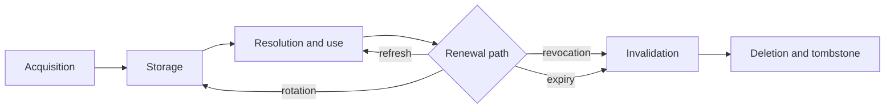

# 08 — Credential Lifecycle

This chapter specifies the lifecycle of credential material end to end — acquisition, storage,
resolution, refresh, rotation, revocation, expiry, and deletion — as the Authentication Layer
drives it over **AuthPort** and **SecretStorePort** (both frozen, Volume 3 chapter 02). The
storage *model* (backends, encryption, fallback consent, display rules) is Volume 9's keystone
FR-SEC-102 implementing ADR-014; this chapter binds the flows to that model and never restates
it. The Credential entity, its recorded status vocabulary (`active`, `rotated`, `revoked`,
`expired`), and invariants INV-CRED-01..04 are Volume 2's (chapter 05). The chapter closes with
the `E-AUTH` error catalog and the `auth.credential.*` events this volume mints.

## Lifecycle overview



The diagram shows the six lifecycle stages and their relations. **Acquisition** is one of the
chapter 07 flows (FR-AUTH-002..005). **Storage** writes material behind a `secret_ref`
(SecretStorePort `Set`) and creates the metadata row. **Resolution and use** is the request-path
`Get`, gated by `credential_access`, returning zeroize-on-release material. Renewal takes one of
three paths: **refresh** (new short-lived token under the same Credential, FR-AUTH-010),
**rotation** (successor Credential, FR-AUTH-011), or terminal **invalidation** by revocation or
expiry. **Deletion** removes the Secret Store slot first and then tombstones the row
(INV-CRED-04 ordering). Constraints: no stage ever serializes material outside the store
(INV-CRED-01), and every stage transition emits an event.

## Requirements

### FR-AUTH-009 — Credential storage and resolution through the Secret Store

- Type: Functional
- Status: Approved
- Priority: P0
- Phase: MVP
- Source: Provided
- Owner: Authentication Layer (Volume 5)
- Affected components: Authentication Layer, Secret Store, Persistence Layer, Permission Manager
- Dependencies: ADR-014, ADR-028; Volume 9 FR-SEC-102; Volume 2 INV-CRED-01..04
- Related risks: RISK-AUTH-001, RISK-AUTH-002

#### Description

All credential and token material MUST live exclusively in the Secret Store: writes go through
`SecretStorePort.Set` at acquisition, refresh, and rotation; reads go through `Get` on the
request path; `Delete` precedes any Credential row deletion (INV-CRED-04); `List` powers
inventory display without material. Plaintext persistence of material — in configuration,
databases, logs, events, exports, crash dumps the layer controls, or any file the layer writes
— is prohibited in every mode. Metadata (label, kind, fingerprint, status, expiry) lives in the
global database `credentials` table (ADR-028). Every `Get` is preceded by a `credential_access`
permission evaluation (PermissionPort) attributable to the requesting run or command, and every
resolution is audit-recorded per Volume 9 Audit Log semantics.

#### Motivation

The metadata/material split is the product's core credential defense (ADR-014); this
requirement makes the split mandatory on every path rather than a storage-layer convention.

#### Actors

Authentication Layer; Secret Store; Permission Manager; users managing credentials.

#### Preconditions

A Secret Store backend is available: OS keychain, or the age-encrypted file fallback after
explicit opt-in (ADR-014).

#### Main flow

1. Acquisition flow yields material; `Set` stores it; the Credential row is created with
   `secret_ref` and fingerprint.
2. Request path: `credential_access` check → `Get` → material injected by the adapter →
   wrapper zeroized at request completion.
3. Deletion: `Delete` on the slot → row tombstoned → `auth.credential.deleted`.

#### Alternative flows

- Backend unavailable (E-PORT-003 beneath): E-AUTH-006 surfaces with guidance to unlock the
  keychain or explicitly opt into the fallback; no degraded plaintext path exists.

#### Edge cases

- Orphaned slot (row deleted, slot remains after a crash between steps): the startup orphan
  sweep (Volume 9) deletes it; the sweep is idempotent.
- Orphaned row (slot missing): resolution fails E-AUTH-001 with a repair hint (`auth` repair
  command re-intakes material under the same label).
- Fallback file present while a keychain becomes available again: the store keeps the user's
  explicit backend choice; migration is a deliberate command, never automatic.

#### Inputs

Material from acquisition flows; labels; metadata.

#### Outputs

`secret_ref` handles; resolved zeroize-on-release material; tombstoned rows.

#### States

Credential recorded status vocabulary (Volume 2 chapter 09); no additional machine.

#### Errors

E-AUTH-001, E-AUTH-006.

#### Constraints

`secret_ref` never leaves the machine (excluded from exports per Volume 2); material never
crosses a port other than SecretStorePort; workspace databases and workspace exports carry no
credential metadata at all (ADR-028 placement).

#### Security

This requirement operationalizes INV-CRED-01; combined with NFR-AUTH-001/002 it bounds the
blast radius of every other defect class: nothing outside the store is worth stealing.

#### Observability

`auth.credential.created` / `auth.credential.deleted` events; audit records per resolution;
fingerprint-only display everywhere.

#### Performance

Resolution overhead bounded by NFR-AUTH-003; session-scoped in-memory caching of resolved
material is permitted within a single process, zeroized on session end.

#### Compatibility

macOS Keychain, Linux Secret Service, and the fallback per ADR-014; Windows Credential Manager
arrives with the v2 platform phase without contract change.

#### Acceptance criteria

- Given any acquisition flow, when it completes, then material exists only behind the
  `secret_ref` and the row serialization contains none of it.
- Given a deletion, when it executes, then the store slot is deleted before the row tombstone
  and both events emit in order.
- Negative case: given a simulated backend outage, when resolution is attempted, then
  E-AUTH-006 surfaces (exit code 3) and no plaintext fallback file appears.
- Permission case: given `credential_access` denied, when resolution is attempted, then the
  decision is recorded and `Get` is never called.
- Observability case: given a full lifecycle (create, use, delete), when audit records are
  inspected, then every material access is attributable to its run or command.

#### Verification method

Contract tests over SecretStorePort usage ordering (including crash injection between delete
steps); canary-secret scans over all persisted artifacts; permission-enforcement tests; audit
completeness check (SM-13 method applied to credential access).

#### Traceability

PRD-005, PRD-006; ADR-014, ADR-028; Volume 2 INV-CRED-01..04; Volume 9 FR-SEC-102.

### FR-AUTH-010 — Token refresh

- Type: Functional
- Status: Approved
- Priority: P1
- Phase: Beta
- Source: Provided
- Owner: Authentication Layer (Volume 5)
- Affected components: Authentication Layer, Secret Store, Provider adapters
- Dependencies: ADR-064; FR-AUTH-003, FR-AUTH-005, FR-AUTH-009; chapter 11 machine
- Related risks: RISK-AUTH-003

#### Description

For sessions whose credential family supports renewal (OAuth refresh tokens, service-account
exchanges), the Authentication Layer MUST refresh per ADR-064: **proactively**, when a session
is used within `auth.refresh_lead_time_seconds` (default 300) of `expires_at`; and
**on demand**, when a provider rejects a request with its documented expired-credential
signal. Refreshes for one Authentication Session are single-flight: concurrent requests block
on the one in-flight refresh rather than racing. A successful refresh replaces the material
behind `token_ref` (`Set` on the same slot), updates `expires_at` and `last_refreshed_at`, and
emits `auth.session.refreshed`. Failure classification and resulting states are defined by the
chapter 11 machine.

#### Motivation

Proactive refresh keeps long agent runs from failing mid-turn on predictable expiries;
single-flight prevents refresh-token invalidation races (many providers rotate the refresh
token on use).

#### Actors

Authentication Layer; provider token endpoints; running agents (implicit trigger).

#### Preconditions

Active session with renewal path and known `expires_at`.

#### Main flow

1. Trigger (lead-time window or provider signal).
2. Session → `refreshing`; single-flight latch taken.
3. Declared renewal exchange executes; material replaced; session → `active`.

#### Alternative flows

- Transient failure (timeout, 5xx-class): bounded retries within `refreshing` per the retry
  policy below; on exhaustion with still-valid old material, session returns to `active` and
  the next window retries.
- Definitive failure (invalid/revoked refresh token): session → `expired` or `failed` per
  chapter 11; E-AUTH-003 surfaces to waiting callers.

#### Edge cases

- Refresh response rotates the refresh token: the new refresh token replaces the Credential's
  material atomically before the old access token is discarded; a crash between the two writes
  is recovered by the chapter 11 recovery rules (re-establishment).
- `expires_at` unknown (provider does not report lifetime): only on-demand refresh applies.
- Offline at the refresh window: refresh fails fast per FR-PROV-085; old material remains
  until provider-side expiry.

#### Inputs

Session state; provider renewal endpoint responses.

#### Outputs

Renewed token material; updated session row; events.

#### States

`active` → `refreshing` → `active` | `expired` | `failed` (chapter 11).

#### Errors

E-AUTH-003; transient classes normalize per chapter 06 before classification.

#### Constraints

Single-flight per session; retries: at most 3 attempts with exponential backoff starting at 1
second, jittered, capped at 30 seconds total; refresh never blocks unrelated sessions.

#### Security

Renewal responses are redacted; the old material is zeroized after replacement; refresh uses
only the declared official endpoint.

#### Observability

`auth.session.refreshed` / `auth.session.expired` / `auth.session.failed`; refresh latency and
failure-count metrics.

#### Performance

Proactive refresh happens off the request critical path when triggered by the lead-time
window during idle; on-demand refresh adds one exchange round-trip to the failing request's
retry.

#### Compatibility

Family-conditional (API keys never refresh); platform-neutral.

#### Acceptance criteria

- Given a session within the lead-time window, when a request arrives, then refresh executes
  once and the request proceeds with renewed material.
- Given 10 concurrent requests during refresh, then exactly one exchange occurs (single
  flight) and all 10 proceed after it.
- Negative case: given a revoked refresh token, then the session leaves `refreshing` for the
  terminal-of-renewal state per chapter 11 and callers receive E-AUTH-003 (exit code 4).
- Error case: given a transient token-endpoint timeout with valid old material, then the
  session returns to `active` and no user-visible failure occurs.
- Observability case: every refresh outcome emits its event with the session ULID and no
  token data.

#### Verification method

Mock token-endpoint integration tests (proactive, on-demand, single-flight under concurrency,
rotation-on-use, transient vs definitive failures, offline); fake-clock lead-time tests; leak
scan.

#### Traceability

PRD-010; ADR-064; FR-AUTH-003; chapter 11 machine.

### FR-AUTH-011 — Credential rotation and revocation

- Type: Functional
- Status: Approved
- Priority: P1
- Phase: MVP
- Source: Provided
- Owner: Authentication Layer (Volume 5)
- Affected components: Authentication Layer, Secret Store, Provider Layer
- Dependencies: FR-AUTH-009; Volume 2 INV-CRED-03; AuthPort `Rotate`/`Revoke`
- Related risks: RISK-AUTH-002

#### Description

**Rotation** (`AuthPort.Rotate`) replaces a Credential's material with a successor: a new
Credential row is created with the new material, the predecessor's status becomes `rotated`
with `rotated_to_id` linking the successor, all Authentication Sessions derived from the
predecessor are invalidated (`revoked` terminal state; INV-CRED-03), and profiles referencing
the label follow it to the successor (the label moves; the old row keeps a derived archival
label). **Revocation** (`AuthPort.Revoke` and the `auth` command family) invalidates without
successor: status `revoked`, dependent sessions → `revoked`, store slot deleted. Where the
provider documents a credential-revocation API for third-party clients, Andromeda MUST
additionally call it and report its outcome; where none is documented, revocation is local
only and the user message says so explicitly (provider-side availability per adapter is
PENDING VALIDATION, V5B-OQ-6).

#### Motivation

Rotation is routine key hygiene and the mandated response to suspected exposure; the cascade
rule prevents zombie sessions outliving a dead credential.

#### Actors

User/operator; Authentication Layer; provider revocation endpoints where documented.

#### Preconditions

Credential exists with status `active`.

#### Main flow

1. Rotation: new material intake → successor row → predecessor `rotated` → session cascade →
   `auth.credential.rotated`.
2. Revocation: provider-side call where declared → local invalidation → slot deletion →
   `auth.credential.revoked`.

#### Alternative flows

- Provider-side revocation call fails: local invalidation proceeds regardless; E-AUTH-009 is
  reported with the provider outcome; the command exits nonzero so operators notice.

#### Edge cases

- Rotation while a refresh is in flight: the single-flight latch (FR-AUTH-010) is awaited,
  then the cascade applies — no session survives on predecessor material.
- Revoking an already-`rotated` credential: allowed (defense in depth); it deletes any
  remaining slot and re-emits the event idempotently.
- Runs in progress during cascade: their next provider request fails with E-AUTH-002/003 and
  the run's own retry/fallback policy applies; the cascade never kills runs directly.

#### Inputs

Successor material (rotation); credential label or ULID.

#### Outputs

Updated statuses; rotation linkage; deleted slots; RotationReport per AuthPort.

#### States

Credential recorded statuses `active` → `rotated` | `revoked`; session cascade per chapter 11.

#### Errors

E-AUTH-008 (rotation failed), E-AUTH-009 (provider-side revocation failed).

#### Constraints

Rotation is atomic from the consumer's view: at no instant do zero usable credentials exist
for the label unless rotation fails entirely (then the predecessor remains `active`).

#### Security

Suspected-exposure response is one command; audit records tie rotation/revocation to the
operator; deleted slots are unrecoverable by design.

#### Observability

`auth.credential.rotated` / `auth.credential.revoked` with predecessor and successor ULIDs;
cascade emits per-session `auth.session.revoked`.

#### Performance

Cascade cost is proportional to live sessions per credential (in practice ≤ a handful).

#### Compatibility

Provider-side revocation is adapter-conditional per declaration; local semantics are uniform.

#### Acceptance criteria

- Given a rotation, when it completes, then the successor serves new sessions, the
  predecessor is `rotated` with linkage, and every predecessor-derived session is `revoked`.
- Given a rotation failure at intake, then the predecessor remains `active` and no successor
  row exists.
- Negative case: given revocation of a nonexistent label, then E-AUTH-001 (exit code 4).
- Error case: given a failing provider revocation endpoint, then local invalidation still
  completes and E-AUTH-009 reports the partial outcome.
- Observability case: audit records attribute both operations to the invoking principal with
  correlation IDs.

#### Verification method

Integration tests for rotation atomicity, cascade completeness (INV-CRED-03 check), idempotent
re-revocation, and provider-endpoint failure injection; audit-chain verification.

#### Traceability

PRD-005, PRD-006; Volume 2 INV-CRED-03; FR-AUTH-009, FR-AUTH-010.

## Non-functional requirements

### NFR-AUTH-001 — No plaintext credential material at rest

- Category: Security
- Priority: P0
- Phase: MVP
- Metric: Count of credential/token material occurrences outside the Secret Store across all files, databases, and artifacts written by Andromeda during the full test corpus, detected by canary-secret scanning
- Target: 0 occurrences
- Minimum threshold: 0 occurrences (identity property; no tolerance)
- Measurement method: Canary credentials with unique high-entropy markers are used across the acceptance, integration, and crash-injection suites; a post-run scanner searches every artifact (config, databases, logs, exports, temp dirs) for the markers
- Test environment: Tier 1 platforms, both keychain and explicit-fallback backends
- Measurement frequency: Every CI run of the affected suites; release gate
- Owner: Authentication Layer (Volume 5) with Volume 9 (storage model)
- Dependencies: FR-AUTH-009; ADR-014
- Risks: RISK-AUTH-002
- Acceptance criteria: The scanner reports zero marker occurrences outside Secret Store backends on every gated run, including runs with injected crashes between lifecycle steps.

### NFR-AUTH-002 — Credential redaction in logs, events, errors, and memory records

- Category: Security
- Priority: P0
- Phase: MVP
- Metric: Count of credential/token material occurrences in emitted logs, events, error envelopes, traces, and Memory Records during the full test corpus (canary method)
- Target: 0 occurrences
- Minimum threshold: 0 occurrences
- Measurement method: The NFR-AUTH-001 canary scanner applied to the observability outputs (log files, persisted events, exported traces) and memory database of every gated suite run, including failure paths that print technical messages
- Test environment: Tier 1 platforms; verbose/debug logging enabled to maximize surface
- Measurement frequency: Every CI run of the affected suites; release gate
- Owner: Authentication Layer (Volume 5) with Volume 10 (redaction mechanics)
- Dependencies: FR-AUTH-009; Volume 10 logging redaction rules
- Risks: RISK-AUTH-002
- Acceptance criteria: Zero marker occurrences in all observability channels on every gated run, with debug verbosity active and at least one forced failure per E-AUTH code exercised.

### NFR-AUTH-003 — Credential resolution latency

- Category: Performance
- Priority: P2
- Phase: Beta
- Metric: Added latency of authentication material resolution on the provider request path: (a) first resolution per session (backend read); (b) subsequent resolutions (session cache)
- Target: (a) ≤ 100 ms p95; (b) ≤ 1 ms p95
- Minimum threshold: (a) ≤ 250 ms p95; (b) ≤ 5 ms p95
- Measurement method: Instrumented timestamps around resolution in the benchmark harness, 200 iterations per backend per platform, p95, reference hardware per Volume 1 chapter 06 reference conditions
- Test environment: Tier 1 platforms; macOS Keychain (subprocess path), Linux Secret Service, and file fallback measured separately
- Measurement frequency: Per release benchmark run
- Owner: Authentication Layer (Volume 5); budgets consolidated by Volume 12
- Dependencies: FR-AUTH-009; ADR-014 (macOS subprocess note)
- Risks: RISK-AUTH-001
- Acceptance criteria: Benchmark report shows both percentiles within target on every Tier 1 platform and backend; regressions beyond the minimum threshold block the release.

## Risks

### RISK-AUTH-001 — Secret Store backend unavailability and fallback overuse

- Category: Security / operational
- Probability: Medium
- Impact: Medium
- Severity: Medium
- Mitigation: E-AUTH-006 guidance flow distinguishes locked-keychain, missing-D-Bus, and headless cases; the encrypted-file fallback requires explicit opt-in and is persistently marked lower-security (ADR-014); documentation leads with the keychain path; `andromeda doctor` diagnoses backend health
- Detection: E-AUTH-006 frequency metric; doctor checks; support-channel signal
- Owner: Authentication Layer (Volume 5)
- Status: Open

Headless Linux and containerized environments frequently lack a Secret Service implementation
(ADR-014 risk note). If the fallback is too convenient, users adopt it on desktops where the
keychain is available, silently lowering their protection; if it is too buried, users park keys
in environment variables permanently. The mitigation keeps the fallback one explicit, informed
step away.

### RISK-AUTH-002 — Credential leakage through logs, errors, or crash artifacts

- Category: Security
- Probability: Medium
- Impact: High
- Severity: High
- Mitigation: NFR-AUTH-001/002 as release gates with the canary method; zeroize-on-release
  wrappers (SecretStorePort contract); technical messages built from typed fields rather than
  raw provider responses; secret scanning in CI over the repository and artifacts
- Detection: Canary scanner in every gated run; secret-scanning alerts; audit of E-AUTH
  technical messages at review
- Owner: Authentication Layer (Volume 5)
- Status: Open

The most probable leak path is not the store — it is an error message embedding a raw HTTP
response that contains a token, or a debug log dumping request headers. Building envelopes from
typed fields and gating releases on the canary scan makes this class detectable before it
ships.

### RISK-AUTH-003 — Provider authentication mechanism drift

- Category: External dependency
- Probability: Medium
- Impact: Medium
- Severity: Medium
- Mitigation: Mechanisms live in adapter declarations, not core code; per-adapter contract
  tests with recorded fixtures detect drift in CI (ADR-019 mitigation); chapter 09 catalog
  rows carry PENDING VALIDATION markers re-checked at each adapter's implementation and at
  phase gates; deprecation events (`provider.deprecation.announced`, chapter 09) surface
  provider notices to users
- Detection: Adapter contract-test failures; provider changelog review at phase gates;
  authentication failure-rate metrics per provider
- Owner: Provider Layer / Authentication Layer (Volume 5)
- Status: Open

Providers change token lifetimes, deprecate auth endpoints, and introduce new mechanisms.
Because every mechanism is declared per adapter and exercised by fixture-based contract tests,
drift surfaces as a failing test in one leaf package rather than a product-wide incident.

## E-AUTH error catalog

Every error below declares the full ADR-016 envelope. Shared envelope facts for the family:
telemetry events follow the error's named event; security implications include, for every
code, that user and technical messages are built from typed fields and never embed request or
response bodies (NFR-AUTH-002). HTTP mapping applies only where an error surfaces over the
ADR-012 IPC surface; codes without a stated mapping have none.

### E-AUTH-001 — Credential not found

- Category: authentication
- Severity: error
- User message: "No credential found for {profile/label}. Run the auth login command for
  {provider} or check the profile's credential label."
- Technical message: lookup key kind (label, ULID, env var name), profile name, provider slug.
- Cause: missing Credential row, unset `api_key_env` variable, deleted store slot, or absent
  ambient identity.
- Safe context data: profile name, label, provider slug, lookup kind.
- Recoverability: recoverable by intake (FR-AUTH-002..005) or repair.
- Retry policy: not retryable automatically.
- Recommended action: run the intake flow or fix the profile reference.
- Exit code: 4.
- HTTP mapping: 401 over IPC.
- Telemetry event: `auth.session.failed`.
- Security implications: message must not reveal whether other labels exist beyond the queried
  scope.

### E-AUTH-002 — Authentication rejected by provider

- Category: authentication
- Severity: error
- User message: "{provider} rejected the credential for profile {name}. The key may be
  invalid, revoked, or lack access to the requested resource."
- Technical message: normalized provider error class (chapter 06), provider request ID when
  available, session ULID.
- Cause: invalid/revoked key, insufficient entitlements, or wrong endpoint for the credential.
- Safe context data: provider slug, profile name, normalized class, provider request ID.
- Recoverability: recoverable with a valid credential.
- Retry policy: not retryable with the same material; rotation or re-intake required.
- Recommended action: verify the key in the provider console; rotate if exposure is suspected.
- Exit code: 4.
- HTTP mapping: 401 over IPC.
- Telemetry event: `auth.session.failed`.
- Security implications: repeated occurrences across providers are a compromise indicator and
  feed the Volume 9 audit trail.

### E-AUTH-003 — Credential expired and renewal failed

- Category: authentication
- Severity: error
- User message: "The credential for {profile} has expired and could not be renewed.
  Re-authenticate to continue."
- Technical message: expiry timestamp, renewal attempts and their normalized failure classes,
  clock-skew evidence when detected.
- Cause: expired temporary credential, expired/rotated-away refresh token, or renewal endpoint
  definitively rejecting the exchange.
- Safe context data: profile name, provider slug, `expires_at`, attempt count.
- Recoverability: recoverable by re-authentication.
- Retry policy: renewal already retried per FR-AUTH-010; the surfacing error is not
  auto-retried.
- Recommended action: run the auth flow again; check system clock if skew evidence is shown.
- Exit code: 4.
- HTTP mapping: 401 over IPC.
- Telemetry event: `auth.session.expired`.
- Security implications: none beyond family baseline.

### E-AUTH-004 — Authorization flow denied

- Category: authentication
- Severity: error
- User message: "Authorization was denied at {provider}. No credential was stored."
- Technical message: flow kind (authorization code / device), provider error code from the
  documented error response.
- Cause: user denied consent, or the provider refused the authorization request.
- Safe context data: provider slug, flow kind, documented error code.
- Recoverability: recoverable by rerunning the flow.
- Retry policy: not auto-retried (human decision).
- Recommended action: rerun and approve, or check organizational policy at the provider.
- Exit code: 4.
- HTTP mapping: not applicable (interactive flows are not IPC-initiated).
- Telemetry event: `auth.session.failed`.
- Security implications: denial is recorded but never bypassed.

### E-AUTH-005 — Authorization flow timed out

- Category: timeout
- Severity: error
- User message: "The authorization flow expired before completion. Run it again to get a new
  code."
- Technical message: flow kind, configured timeout or provider `expires_in`, elapsed time.
- Cause: no redirect/approval within the flow's lifetime.
- Safe context data: provider slug, flow kind, timeout value.
- Recoverability: recoverable by rerunning.
- Retry policy: not auto-retried; a rerun mints fresh codes.
- Recommended action: rerun the flow and complete it within the shown lifetime.
- Exit code: 8.
- HTTP mapping: not applicable.
- Telemetry event: `auth.session.failed`.
- Security implications: expired codes are discarded; nothing partial is stored.

### E-AUTH-006 — Secret store unavailable

- Category: environment
- Severity: error
- User message: "The system credential store is unavailable ({backend}). Unlock it, or set up
  the encrypted-file fallback explicitly."
- Technical message: backend kind, underlying E-PORT-003 detail, probe result.
- Cause: locked keychain, missing Secret Service/D-Bus, or unreadable fallback file.
- Safe context data: backend kind, platform, probe classification.
- Recoverability: recoverable by unlocking/installing a backend or explicit fallback opt-in.
- Retry policy: retryable after the environment is fixed; no automatic retry.
- Recommended action: follow the printed backend-specific guidance; run `andromeda doctor`.
- Exit code: 3.
- HTTP mapping: 503 over IPC.
- Telemetry event: `auth.credential.access_failed`.
- Security implications: the error text never suggests plaintext workarounds.

### E-AUTH-007 — Prohibited authentication mechanism requested

- Category: validation
- Severity: error
- User message: "The requested authentication mechanism is not an official, documented
  mechanism for {provider} and cannot be used."
- Technical message: requested mechanism name, requesting component (config path or extension
  identity), FR-AUTH-001 clause matched.
- Cause: configuration or extension requested a mechanism outside the adapter's validated
  declaration.
- Safe context data: mechanism name, provider slug, requesting component identity.
- Recoverability: not recoverable except by using an official mechanism.
- Retry policy: never retried.
- Recommended action: use a documented mechanism; report the need through the provider's
  official channels.
- Exit code: 3.
- HTTP mapping: 400 over IPC.
- Telemetry event: `auth.mechanism.refused`.
- Security implications: occurrences from extensions feed trust evaluation (Volume 6) and the
  audit trail.

### E-AUTH-008 — Credential rotation failed

- Category: authentication
- Severity: error
- User message: "Rotation for {label} failed; the existing credential remains active and
  unchanged."
- Technical message: failing step (intake, storage, cascade), underlying error code.
- Cause: successor intake failed, store write failed, or verification of successor material
  failed.
- Safe context data: label, provider slug, failing step.
- Recoverability: recoverable by rerunning rotation.
- Retry policy: not auto-retried; rotation is operator-driven.
- Recommended action: rerun with valid successor material; check store health.
- Exit code: 4.
- HTTP mapping: 500 over IPC.
- Telemetry event: `auth.credential.rotation_failed`.
- Security implications: atomicity guarantee (FR-AUTH-011) means a failure never leaves the
  label without a usable credential.

### E-AUTH-009 — Provider-side revocation failed

- Category: authentication
- Severity: warning
- User message: "The credential was invalidated locally, but revoking it at {provider} failed.
  Revoke it in the provider console to complete the revocation."
- Technical message: provider revocation endpoint outcome (normalized class), local steps
  completed.
- Cause: revocation endpoint unreachable, rejected the call, or the provider documents no
  revocation API (reported distinctly).
- Safe context data: provider slug, endpoint outcome class, whether an API exists.
- Recoverability: recoverable manually at the provider.
- Retry policy: one automatic retry on transient classes; then surfaced.
- Recommended action: complete revocation in the provider console.
- Exit code: 4 (command exits nonzero so the partial outcome is visible).
- HTTP mapping: 502 over IPC when endpoint-caused.
- Telemetry event: `auth.credential.revoked` (with partial-outcome payload field).
- Security implications: the exposed material may remain valid provider-side; the message
  states this plainly.

### E-AUTH-010 — Authentication profile not found or ambiguous

- Category: configuration
- Severity: error
- User message: "No authentication profile could be resolved for {provider}: {none found |
  candidates: a, b}. Select one with the profile flag or set auth.default_profile."
- Technical message: resolution trace through the FR-AUTH-008 precedence chain.
- Cause: zero or multiple candidate profiles with no selector.
- Safe context data: provider slug, candidate profile names.
- Recoverability: recoverable by configuration or explicit selection.
- Retry policy: never retried.
- Recommended action: pass the profile selector or set the default.
- Exit code: 3.
- HTTP mapping: 400 over IPC.
- Telemetry event: `auth.profile.resolution_failed`.
- Security implications: candidate listing shows names only.

### E-AUTH-011 — Proxy authentication failed

- Category: environment
- Severity: error
- User message: "The configured proxy {host} rejected authentication. Check the proxy
  credential."
- Technical message: proxy host, HTTP status from the proxy, credential label used.
- Cause: wrong or expired proxy credential, or proxy policy rejection.
- Safe context data: proxy host, status code, credential label.
- Recoverability: recoverable with a valid proxy credential.
- Retry policy: not auto-retried (repeated failures can lock enterprise accounts).
- Recommended action: update the proxy credential; verify with the network operator.
- Exit code: 4.
- HTTP mapping: 407 over IPC.
- Telemetry event: `auth.session.failed`.
- Security implications: repeated attempts are rate-limited by the no-auto-retry rule.

## Events minted in this chapter

Names follow the Volume 0 grammar; the envelope, delivery semantics, persistence, and
retention are Volume 10's and are not restated. Payloads carry ULIDs, slugs, labels,
fingerprints, and normalized classes — never material.

| Event | Emitted when | Payload summary |
|---|---|---|
| `auth.credential.created` | Intake stores a new Credential | credential ULID, label, kind, provider slug, fingerprint |
| `auth.credential.rotated` | Rotation completes | predecessor ULID, successor ULID, label |
| `auth.credential.revoked` | Revocation completes (field marks provider-side outcome) | credential ULID, label, provider-side outcome |
| `auth.credential.expired` | Temporary credential reaches expiry | credential ULID, label, `expires_at` |
| `auth.credential.deleted` | Slot + row deletion completes | credential ULID, label |
| `auth.credential.access_failed` | Store resolution fails (E-AUTH-006 path) | backend kind, error code |
| `auth.credential.rotation_failed` | Rotation aborts (E-AUTH-008) | credential ULID, failing step |
| `auth.mechanism.refused` | FR-AUTH-001 gate refuses a mechanism | mechanism name, provider slug, requester |
| `auth.profile.selected` | Profile resolution succeeds at session establishment | profile name, provider slug |
| `auth.profile.resolution_failed` | Profile resolution fails (E-AUTH-010) | provider slug, candidate names |

Session-machine events (`auth.session.*`) are minted with the machine in
[chapter 11](11-state-machines.md).

## Configuration keys

Key content of the `[auth]` table (ownership per Volume 0 chapter 03; schema, precedence, and
validation are Volume 10's):

```toml
[auth]
default_profile = "default"          # profile used when no selector applies
refresh_lead_time_seconds = 300      # proactive refresh window and expiry margin
flow_timeout_seconds = 300           # browser/device flow lifetime ceiling

[auth.proxy]
url = ""                             # empty: honor HTTPS_PROXY/HTTP_PROXY env
no_proxy = ""                        # empty: honor NO_PROXY env
credential = ""                      # credential label for authenticating proxies
ca_bundle = ""                       # PEM file appended to system trust anchors

[auth.profiles.default]
provider = "local-ollama"            # provider slug ([providers.<slug>])
credential = ""                      # credential label; empty for auth_kind = none
```

This volume additionally mints two authentication-related keys inside `[providers.<slug>]`
tables: `auth_profile` (profile binding override per provider) and `api_key_env` (environment
variable indirection, FR-AUTH-002). All other `[providers.*]` key content is defined in
chapters 01–06.
