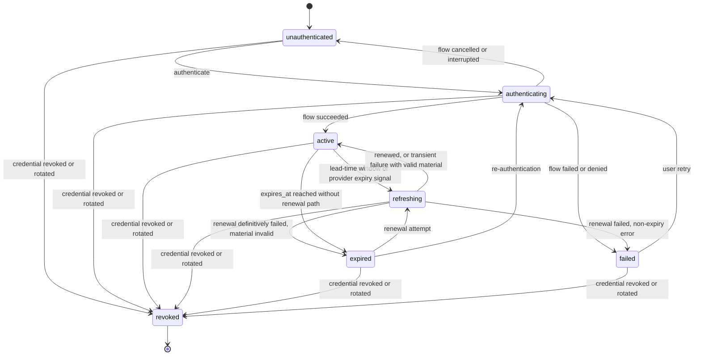
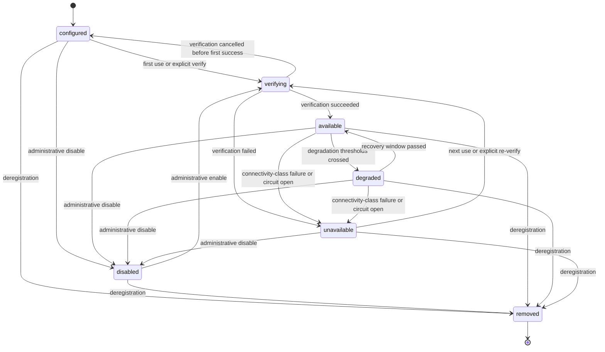

# 11 — State Machines: Authentication Session and Provider Connection

This chapter defines the two full state machines this volume owns per Volume 2 chapter 09:
**Authentication Session** and **Provider (connection)**. State names are frozen by Volume 2
and used exactly; each machine defines the twelve mandatory elements of Volume 0 chapter 02
(initial state, terminal states, transitions, events, guards, side effects, persistence,
recovery, timeouts, cancellation, retries, errors). Both machines persist in the global
database (ADR-028) and emit an event on every transition (Volume 2 INV-EVT-03; envelope per
Volume 10).

## Authentication Session machine

Entity: Authentication Session (Volume 2 chapter 05, table `auth_sessions`). Frozen states:
`unauthenticated`, `authenticating`, `active`, `refreshing`, `expired`, `failed`, `revoked`.

The diagram shows the session lifecycle. A session is created `unauthenticated` when a profile
first resolves a (Credential, Provider) pair; an establishment flow (chapter 07) moves it
through `authenticating` to `active` or `failed`; renewal cycles between `active` and
`refreshing`; expiry parks it in `expired` (a resting state — the row waits for renewal or
re-authentication); credential revocation or rotation terminates any non-terminal state at
`revoked`. Constraint: at most one non-terminal session per (Credential, Provider) pair
(INV-AUTHS-03) — the machine's create path enforces it by reusing the existing row.

### Machine elements

1. **Initial state:** `unauthenticated`.
2. **Terminal states:** `revoked` only. `expired` and `failed` are resting, recoverable
   states.
3. **Transitions, events, guards, side effects:**

| From → To | Trigger | Guard | Side effects and emitted event |
|---|---|---|---|
| `unauthenticated` → `authenticating` | `AuthPort.Authenticate` (CLI/TUI flow or first use) | Profile resolves; mechanism passes FR-AUTH-001; `credential_access` granted | Flow started; no event until outcome |
| `authenticating` → `active` | Flow success | Verification passed (or optimistic per adapter declaration) | Token material → `token_ref` (INV-AUTHS-02); `established_at`, `expires_at`, `scopes` recorded; `auth.session.established` |
| `authenticating` → `failed` | Flow denial/failure | — | `failure` summary recorded (stable code + safe context); `auth.session.failed` |
| `authenticating` → `unauthenticated` | Cancellation (user or context) or flow timeout with nothing stored | — | Partial material purged; listener/polling released; `auth.session.failed` with cancellation class |
| `active` → `refreshing` | Lead-time window on use, or provider expired-credential signal | Credential kind has a renewal path; single-flight latch free | Latch taken; no event until outcome |
| `refreshing` → `active` | Renewal success; or transient failure with old material still valid | On success: new material verified stored | On success: material replaced then old zeroized, `expires_at`/`last_refreshed_at` updated, `auth.session.refreshed`; on transient-with-valid-material: latch released, retry scheduled at next window, no state-change event |
| `refreshing` → `expired` | Renewal definitively failed and material no longer valid | Failure classified as expiry (chapter 06 normalization) | `failure` recorded; waiting callers get E-AUTH-003; `auth.session.expired` |
| `refreshing` → `failed` | Renewal failed with a non-expiry definitive error | — | `failure` recorded; `auth.session.failed` |
| `active` → `expired` | `expires_at` reached with no renewal path (temporary credentials, FR-AUTH-007) | — | `auth.session.expired`; expiry sweep deletes `token_ref` slot |
| `expired` → `refreshing` | Renewal attempt (use or explicit) | Renewal path exists | As `active` → `refreshing` |
| `expired` → `authenticating` | Re-authentication flow started | Interactive surface available (else E-AUTH-003 stands) | As `unauthenticated` → `authenticating` |
| `failed` → `authenticating` | User-initiated retry | — | As `unauthenticated` → `authenticating` |
| any non-terminal → `revoked` | Credential revocation or rotation cascade (FR-AUTH-011, INV-CRED-03) | — | `token_ref` slot deleted; `auth.session.revoked` |

4. **Events:** `auth.session.established`, `auth.session.refreshed`, `auth.session.expired`,
   `auth.session.failed`, `auth.session.revoked` — payloads carry session ULID, credential
   ULID, provider slug, state, and normalized failure class; never token data.
5. **Guards:** as tabled; globally, every transition into a flow requires the FR-AUTH-001
   mechanism gate and `credential_access`.
6. **Side effects:** all Secret Store writes/deletes as tabled; every effect is ordered
   material-first, metadata-second so a crash never leaves metadata pointing at absent
   material without the recovery rule below catching it.
7. **Persistence:** every transition commits the row (`state`, timestamps, `failure`,
   `revision`) in the global database before its event is published.
8. **Recovery:** at startup, rows found `authenticating` are reset to `unauthenticated`
   (interrupted flows are never assumed complete — PRD-010); rows found `refreshing` are
   reconciled: if `expires_at` is in the future the row returns to `active`, otherwise it
   moves to `expired`; a `token_ref` that no longer resolves forces `expired` regardless.
9. **Timeouts:** establishment flows bound at `auth.flow_timeout_seconds` (default 300) or
   the provider's documented flow lifetime, whichever is smaller; renewal exchanges bound at
   the ADR-019 baseline request timeout; timeout outcomes follow the cancellation and
   failure rows above.
10. **Cancellation:** context cancellation during `authenticating` follows the cancellation
    row (nothing persisted, resources released); during `refreshing` it releases the latch
    and leaves the prior material governing (the machine returns to `active` if material is
    valid, else `expired`).
11. **Retries:** only within `refreshing`, per FR-AUTH-010 (≤ 3 attempts, exponential
    backoff from 1 s, jittered, ≤ 30 s total). Establishment flows are never auto-retried.
12. **Errors:** E-AUTH-001..007 map to the failure transitions as defined in chapter 08;
    every `failure` field carries the stable code.

## Provider connection machine

Entity: Provider (Volume 2 chapter 05, table `providers`, attribute `connection_state`).
Frozen states: `configured`, `verifying`, `available`, `degraded`, `unavailable`, `disabled`,
`removed`.

The diagram shows the connection lifecycle. A registered Provider starts `configured` (never
verified in this environment); verification — on first use or on demand — moves it to
`available` or `unavailable`; live service quality moves it between `available`, `degraded`,
and `unavailable`; administrative action parks it in `disabled` or tombstones it at `removed`.
Constraints: only providers in `available` or `degraded` participate in routing (`degraded`
participation is policy-controlled, chapter 05); `verifying` is entered only from
`configured`, `unavailable`, and `disabled`-enable — re-verification of an `available` or
`degraded` provider runs *without* leaving its state, so transient checks never flap routing.

### Machine elements

1. **Initial state:** `configured`.
2. **Terminal states:** `removed` only. All other non-initial states are resting.
3. **Transitions, events, guards, side effects:**

| From → To | Trigger | Guard | Side effects and emitted event |
|---|---|---|---|
| `configured` → `verifying` | First request routed to the provider, or explicit verify command | `enabled = true`; auth session establishable when `auth_kind ≠ none` | Verification probe per adapter declaration starts |
| `verifying` → `available` | Probe succeeded | Declared capabilities validated (INV-PRV-03) | `last_verified_at` set; model catalog refreshed via `DiscoverModels` where declared; `provider.connection.verified` |
| `verifying` → `unavailable` | Probe failed (connectivity, auth, malformed response) | — | Failure class recorded; `provider.connection.lost` |
| `verifying` → `configured` | Cancellation before any successful verification | — | No verification result recorded; no event |
| `available` → `degraded` | Degradation thresholds crossed (error rate, rate-limit pressure; thresholds and windows per chapter 05) | Thresholds are configured, not hardcoded | Routing weight adjusted per policy; `provider.connection.degraded` |
| `degraded` → `available` | Recovery observation window passed below thresholds | — | `provider.connection.recovered` |
| `available`/`degraded` → `unavailable` | Connectivity-class failure (FR-PROV-085) or circuit breaker open (chapter 05) | — | Excluded from routing; `provider.connection.lost` |
| `unavailable` → `verifying` | Next real use or explicit re-verification (never background polling, ADR-066) | — | Probe starts |
| any non-terminal → `disabled` | `enabled = false` or CLI disable | — | Excluded from routing; in-flight requests complete; `provider.connection.disabled` |
| `disabled` → `verifying` | Administrative enable | — | `provider.connection.enabled`, then probe |
| any non-terminal → `removed` | Deregistration | No Agent Profile references it, or user confirms breaking them | Row tombstoned (INV-PRV-01 slug retention); dependent Authentication Sessions revoked; `provider.connection.removed` |

4. **Events:** `provider.connection.verified`, `provider.connection.degraded`,
   `provider.connection.recovered`, `provider.connection.lost`,
   `provider.connection.disabled`, `provider.connection.enabled`,
   `provider.connection.removed` — payloads carry provider ULID, slug, prior state, new
   state, and failure class where applicable. Every state change is user-visible in
   provider status (Principle 7).
5. **Guards:** as tabled; the routing-participation rule (`available`, plus `degraded` per
   policy) is enforced by the Provider Layer router, not by callers.
6. **Side effects:** model-catalog refresh on successful verification; routing-set updates
   on every entry/exit of the participating states; session revocation cascade on removal.
7. **Persistence:** `connection_state` commits with `revision` on every transition, before
   the event publishes; failure classes persist in the row's adapter-neutral status fields.
8. **Recovery:** at startup, rows found `verifying` revert to their verification source
   state (`configured` if `last_verified_at` is null, else `unavailable`) — an interrupted
   probe proves nothing; persisted `available`/`degraded` states are trusted until first
   use, whose real outcome reconciles them (no startup probing, ADR-066).
9. **Timeouts:** verification probes bound at the ADR-019 baseline request timeout;
   degradation and recovery windows are configuration-driven (chapter 05 keys); there is no
   timeout that moves a resting state by itself — only use, explicit action, or thresholds
   do.
10. **Cancellation:** cancelling verification follows the `verifying` → source-state rule
    (the `configured` row in the table; `unavailable` remains `unavailable`); cancelling
    in-flight requests never changes connection state by itself.
11. **Retries:** none inside this machine — request-level retries are chapter 05 policy;
    re-verification of `unavailable` providers happens on next use or explicit command,
    never on an automatic schedule.
12. **Errors:** verification and request failures normalize per chapter 06 into E-PROV
    classes recorded with the transition; auth-caused verification failures surface the
    underlying E-AUTH code in the failure class.

## Interaction between the machines

An Authentication Session in `expired` or `failed` does not by itself change its Provider's
connection state: connection state reflects observed service, not credential health. The
coupling points are exactly two: (a) verification of a provider with `auth_kind ≠ none`
requires an establishable session — establishment failure fails verification with the
E-AUTH class recorded; (b) provider removal revokes its dependent sessions. This separation
keeps "my key is bad" (fix: chapter 07 flows) diagnostically distinct from "the service is
down" (fix: wait or reroute) in every user surface.
