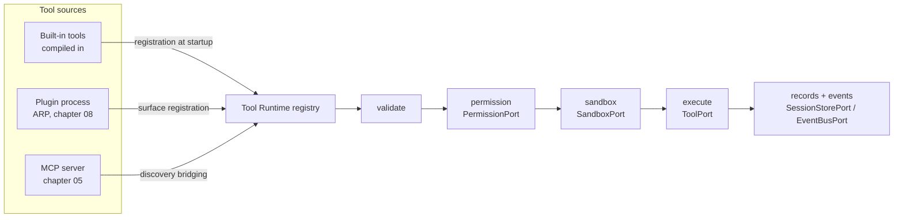

# 01 — Tool SDK and Contract

This chapter is the single home of the **tool contract** (Volume 0, chapter 03): the complete
declaration every tool makes, the behavioral contract behind the frozen `ToolPort` interface
(Volume 3, chapter 02), and the **Extension SDK** surface with which tools are authored. It
mints the keystones FR-TOOL-001 (tool contract) and FR-SDK-001 (extension SDK). Entity shapes
(Tool, Tool Invocation, Tool Result) are Volume 2's; permission semantics are Volume 9's;
this chapter defines what a tool *is* and how one is built.

## The tool boundary

Everything an agent does to the world passes through tools (PRD-004, Principle 4). Tools have
exactly three origins — `builtin`, `plugin`, `mcp` (closed enum, Volume 2) — and all three are
equal citizens of one contract: same declaration, same validation, same permission mediation,
same sandbox placement, same records, same observability. Third-party tool code never runs
inside Andromeda's process (ADR-073); it reaches the Tool Runtime as a `ToolPort`
implementation registered by the Plugin Runtime (over the Andromeda Runtime Protocol, chapter
08) or the MCP Runtime (chapter 05).



The diagram shows the two halves of the tool boundary: on the left, the three sources push
`ToolPort` implementations into the registry (built-ins at startup, plugin surfaces at
`running`, bridged MCP tools at `ready`); on the right, every invocation traverses the fixed
pipeline — validate, then permission, then sandbox, then execute — ending in persisted
records and events. The order is normative and not reorderable (FR-TOOL-005), and no
component other than the Tool Runtime may drive a `ToolPort` (Volume 3 consumer rules).

## Tool declaration

A tool declaration is one self-describing JSON document. It is supplied by the tool's author
(for built-ins, in source; for plugins, in the plugin manifest's tool entries; for MCP tools,
synthesized by the MCP Runtime from server-provided metadata plus registration policy) and is
validated at registration (FR-TOOL-002). An incomplete declaration is rejected, never
defaulted into existence (INV-TOOL-02).

### Author-declared fields

| Field | Content | Rules |
|---|---|---|
| `name` | Canonical dotted name | Grammar of FR-TOOL-003 / ADR-070; ≤ 64 chars |
| `namespace` | First segment of `name` | MUST equal the first segment; reserved namespaces per ADR-070 |
| `description` | Model- and human-facing purpose text | 1–1024 chars; no control characters; shown wherever the tool is offered |
| `version` | Tool contract version | SemVer (ADR-015); breaking schema changes bump MAJOR |
| `author` | Author or maintainer identification | Free text ≤ 256 chars; for packaged tools, matches package metadata (chapter 09) |
| `input_schema` | JSON Schema of the input | Drafts 2020-12, 2019-09, 7, 6, or 4 (ADR-024); root MUST be an object schema |
| `output_schema` | JSON Schema of the `success` payload | Same draft rules; root MUST be an object schema |
| `permissions` | `required` and `optional` permission lists with resource selectors | Names from the closed Volume 9 enum only (FR-TOOL-005) |
| `risks` | Statements of what can go wrong when this tool acts | ≥ 1 entry for any tool declaring a side-effecting permission; shown in approval prompts |
| `limits` | `default_timeout_ms`, `max_timeout_ms`, `max_output_bytes`, `max_concurrency` | Bounded by `[tools]` configuration caps (chapter 02) |
| `retry` | `idempotent` (boolean), `max_auto_retries` | Automatic retries per ADR-072; `idempotent = true` asserts re-execution safety |
| `streaming` | Whether partial output is emitted; which stream event kinds | Kinds from the ToolEvent union below |
| `cancellation` | `cooperative` or `kill_only` | `cooperative` tools honor context cancellation themselves; `kill_only` rely on sandbox teardown |
| `lifecycle` | `per_invocation` or `resident` | `resident` marks tools whose hosting process holds warm state between calls (plugin/MCP tools) |
| `sandbox_profile` | Requested sandbox profile reference | Profile vocabulary owned by Volume 9; the reserved value `default` requests the standard tool profile; the Sandbox Engine decides the effective profile |
| `errors` | Tool-local error conditions: `code`, `meaning`, `retryable` | Surfaced inside the Tool Result error object under E-TOOL-006; tool-local codes are namespaced by the tool, never `E-<AREA>` codes |
| `events` | ToolEvent kinds the tool emits during execution | Subset of the ToolEvent union; lifecycle events are runtime-owned, not declarable |
| `telemetry` | Additional span attribute keys the tool records | Keys MUST be safe context data per ADR-016; secrets and file contents are prohibited values |
| `compatibility` | `tool_contract` (targeted contract version), `platforms` | Platforms from the Volume 3 platform matrix; absence means all Tier 1 |
| `tests` | Conformance fixture reference | Location of the declaration's test fixtures (FR-SDK-001); required for built-ins, recorded when present for other origins |
| `examples` | `description`, `input`, `output` triples | ≥ 1 example; inputs/outputs MUST validate against the schemas — the registry rejects declarations whose examples do not validate |

### Registration-assigned fields

`origin`, `origin_ref`, `trust_level`, `enabled`, and `registered_at` are assigned by the Tool
Runtime at registration and are **not author-writable**: a tool cannot self-declare its origin
or trust classification (INV-TOOL-03; trust vocabulary owned by Volume 9). Both are visible
wherever the tool is offered to a model or a user.

### Example declaration

```json
{
  "name": "fs.read",
  "namespace": "fs",
  "description": "Read a file or list a directory inside the workspace, with optional byte range.",
  "version": "1.0.0",
  "author": "Andromeda maintainers",
  "input_schema": {
    "$schema": "https://json-schema.org/draft/2020-12/schema",
    "type": "object",
    "properties": {
      "path": { "type": "string", "description": "Workspace-relative path" },
      "offset": { "type": "integer", "minimum": 0 },
      "limit": { "type": "integer", "minimum": 1 }
    },
    "required": ["path"],
    "additionalProperties": false
  },
  "output_schema": {
    "$schema": "https://json-schema.org/draft/2020-12/schema",
    "type": "object",
    "properties": {
      "kind": { "enum": ["file", "directory"] },
      "content": { "type": "string" },
      "entries": { "type": "array", "items": { "type": "string" } },
      "size_bytes": { "type": "integer" },
      "truncated": { "type": "boolean" }
    },
    "required": ["kind", "truncated"],
    "additionalProperties": false
  },
  "permissions": { "required": ["read"], "optional": [] },
  "risks": ["Reads file contents into model context; sensitive file contents may reach the configured provider."],
  "limits": { "default_timeout_ms": 10000, "max_output_bytes": 1048576, "max_concurrency": 8 },
  "retry": { "idempotent": true, "max_auto_retries": 2 },
  "streaming": { "partial_output": false, "event_kinds": ["progress"] },
  "cancellation": "cooperative",
  "lifecycle": "per_invocation",
  "sandbox_profile": "default",
  "errors": [
    { "code": "not_found", "meaning": "Path does not exist", "retryable": false },
    { "code": "not_permitted_scope", "meaning": "Path outside permitted scopes", "retryable": false }
  ],
  "events": ["progress"],
  "telemetry": ["tool.fs.bytes_read"],
  "compatibility": { "tool_contract": "1.0", "platforms": ["darwin-arm64", "linux-x86_64", "linux-arm64"] },
  "tests": { "fixtures_ref": "internal/tools/fs/testdata/read" },
  "examples": [
    {
      "description": "Read a small file",
      "input": { "path": "README.md" },
      "output": { "kind": "file", "content": "# Andromeda", "size_bytes": 11, "truncated": false }
    }
  ]
}
```

The example is normative for shape, not for the `fs.read` schema itself (chapter 03 owns the
catalog sketches). A declaration document MUST NOT exceed 256 KiB; schemas count toward the
bound.

## ToolPort behavioral contract

The frozen `ToolPort` methods (Volume 3, chapter 02) carry these Volume 6 semantics:

- **`Describe`** returns the registered declaration plus registration-assigned fields. It is
  stable for the lifetime of a registration: any change to the declaration is a
  re-registration under a new `version` (or a rejected collision, ADR-070).
- **`Validate`** checks input against `input_schema` (ADR-024 validator) and MAY apply
  tool-specific semantic checks (e.g., path shape) — all without side effects. The Tool
  Runtime always validates before execution; tools MUST NOT assume callers did.
- **`Execute`** runs exactly one Tool Invocation and emits an ordered stream of **ToolEvent**
  items. The ToolEvent union has five kinds: `progress` (fractional or phase progress),
  `log` (diagnostic line, redacted per Volume 9), `output_delta` (partial output text for
  live display), `artifact` (reference to a produced Artifact), and exactly one terminal
  `result` event that becomes the Tool Result. A stream without a terminal `result` is a
  broken stream and terminates the invocation as `failed`.
- **`Cancel`** requests cooperative cancellation by invocation ULID. Tools declaring
  `cancellation = cooperative` MUST stop within the teardown grace budget (chapter 02);
  the sandbox teardown path is the enforcement backstop for both declarations.

Tool errors are data: a failing tool emits a `result` event with an error Tool Result.
`Execute` returns a transport-level error only when the invocation could not start or the
stream broke (Volume 3 rule).

## Extension SDK

The Extension SDK (`sdk/` module, `andromeda-sdk`, ADR-031) is the authoring surface for
every extension kind; this chapter specifies its tool kit: a typed `ToolPort` authoring
interface with context-first cancellation (FR-ARCH-004 discipline), a declaration builder
emitting the JSON document above, schema helpers bound to the ADR-024 validator, a local
test harness running the runtime's own validate → execute stages with conformance fixtures,
and scaffolding templates measured by SM-02. The same kit serves built-in authorship
(in-tree) and the tool-serving side of plugins (chapter 08); the protocol, not the SDK, is
the contract for non-Go authors (ADR-009).

The `E-SDK` error area is allocated to this volume but this specification mints no `E-SDK`
codes: every SDK-detectable defect either fails the author's own build and tests — outside
the product's error boundary — or reaches the registry and is rejected as E-TOOL-002. This is
a deliberate decision, revisited only if the SDK ever gains a runtime-resident surface.

## Requirements

### FR-TOOL-001 — Tool contract

- Type: Functional
- Status: Approved
- Priority: P0
- Phase: Core
- Source: Provided
- Owner: Tool Runtime (Volume 6)
- Affected components: Tool Runtime, Extension SDK, Plugin Runtime, MCP Runtime, Execution Engine, Permission Manager, Sandbox Engine
- Dependencies: ADR-016, ADR-021, ADR-024, ADR-070, ADR-071, ADR-072, ADR-073; FR-ARCH-003
- Related risks: RISK-TOOL-001, RISK-TOOL-002

#### Description

Every tool, regardless of origin, MUST be described by the complete declaration of this
chapter — identity (`name`, `namespace`, `description`, `version`, `author`), typed
`input_schema` and `output_schema` (ADR-024 drafts), `permissions` from the closed Volume 9
enum, `risks`, `limits` (timeout, output, concurrency), `retry` with declared idempotency,
`streaming`, `cancellation`, `lifecycle`, `sandbox_profile`, tool-local `errors`, `events`,
`telemetry`, `compatibility`, `tests`, and `examples` — plus the registration-assigned
`origin` and `trust_level`. The Tool Runtime MUST reject registration of any tool whose
declaration is incomplete or invalid and MUST mediate every invocation of every registered
tool through the uniform pipeline. The declaration is the whole contract: behavior a tool
exhibits but does not declare (undeclared permissions, undeclared side effects) is a defect.

#### Motivation

One contract for all origins is what makes third-party capability safe to adopt (PRD-004,
PRD-007, Principle 4): permission mediation, sandboxing, records, and observability attach to
the declaration, so anything undeclarable is inexpressible.

#### Actors

Tool authors (built-in contributors, plugin authors, MCP server operators via bridging); the
Tool Runtime; agents invoking tools; users approving them.

#### Preconditions

Tool Runtime operational; for non-builtin origins, the providing Plugin is `running` or the
MCP Client Connection is `ready`.

#### Main flow

1. A source presents a declaration for registration.
2. The Tool Runtime validates the document (FR-TOOL-002) and the name (FR-TOOL-003), assigns
   `origin`, `origin_ref`, and `trust_level`, and stores the registration.
3. The tool becomes resolvable and is offered to agents with origin and trust visible.
4. Invocations execute under the declaration's permissions, limits, and sandbox profile.

#### Alternative flows

- MCP tools: the MCP Runtime synthesizes the declaration from server metadata; fields the
  server cannot supply (permissions, limits) come from registration policy defaults declared
  in chapter 05 — never silently from the server.
- Re-registration with a changed declaration: accepted only under a new `version`.

#### Edge cases

- A declaration valid under an older supported JSON Schema draft registers under that draft's
  semantics (ADR-024); mixed-draft input/output schemas are legal.
- A tool declaring zero permissions is registerable; it is read-nothing/touch-nothing by
  contract and any attempted side effect is a sandbox violation (FR-TOOL-006).
- A declaration whose `examples` fail schema validation is rejected — examples are executable
  documentation, not prose.

#### Inputs

Declaration JSON documents; registration policy for bridged origins.

#### Outputs

Registered Tool rows (Volume 2), registry listings, `Describe` results.

#### States

Registration lifecycle per FR-TOOL-004; invocations per the chapter 04 machine.

#### Errors

E-TOOL-002 (registration rejected); E-TOOL-001 (unknown tool at resolution).

#### Constraints

Declaration ≤ 256 KiB; name grammar per ADR-070; only official mechanisms behind any
network-facing tool (ADR-074).

#### Security

The declaration is the security anchor: permissions bind to the Volume 9 enum, risks feed
approval prompts, trust and origin are non-self-declarable, and undeclared behavior is
containable because sandbox policy derives from the declaration.

#### Observability

Registration and rejection events (`tool.registration.completed`,
`tool.registration.rejected`); every invocation produces the chapter 04 event set and spans.

#### Performance

Declaration validation is registration-time work; resolution from the registry is an
in-memory lookup. Invocation-path budgets are Volume 12's.

#### Compatibility

`version` follows SemVer; `compatibility.tool_contract` records the targeted contract version
for SM-20 tracking. Contract evolution is additive within a major line.

#### Acceptance criteria

- Given a complete declaration, when it is registered, then `Describe` returns it verbatim
  plus registration-assigned fields, and the tool resolves by name.
- Given a declaration missing any required field, when registration is attempted, then it is
  rejected with E-TOOL-002, no Tool row exists, and `tool.registration.rejected` is emitted.
- Given a registered tool, when an agent lists tools, then `origin` and `trust_level` are
  present in the listing (negative: a listing omitting either is a defect).
- Given a tool with `permissions.required = ["write"]`, when it is invoked without a
  satisfying grant, then the pipeline resolves permission first and the invocation reaches
  `denied` (permission case), with the denial recorded and delivered as structured data.
- Given any invocation, when it terminates, then its records (Tool Invocation, Tool Result
  where applicable) exist and correlate to run, task, and permission decisions
  (observability case).

#### Verification method

Tool contract conformance suite (Volume 13) run against every built-in tool and the SDK
fixtures; registration fuzzing with mutated declarations; SM-16(b)-style mediation tests
attempting unmediated execution.

#### Traceability

PRD-004, PRD-005, PRD-007; Principle 4; ADR-070..074; Volume 2 chapter 04 invariants.

### FR-TOOL-002 — Declaration and payload schema validation

- Type: Functional
- Status: Approved
- Priority: P0
- Phase: Core
- Source: Derived
- Owner: Tool Runtime (Volume 6)
- Affected components: Tool Runtime, Extension SDK, MCP Runtime, Plugin Runtime
- Dependencies: ADR-024; FR-TOOL-001
- Related risks: RISK-TOOL-001

#### Description

The Tool Runtime MUST validate: (a) every declaration document at registration — structure,
field rules of this chapter, schema well-formedness under a supported draft, and example
conformance; (b) every invocation's `arguments` against `input_schema` before permission
evaluation (INV-TINV-04); and (c) every `success` payload against `output_schema` before a
`success` Tool Result is recorded. All validation uses the single product validator
(ADR-024). Nonconforming output MUST be recorded as an `error` result with the raw output
spilled to an Artifact — never coerced, never silently accepted (INV-TRES-04).

#### Motivation

Schemas are the contract's teeth. Unvalidated input wastes user consent on malformed calls;
unvalidated output lets a defective or malicious tool feed unconstrained data to models and
records.

#### Actors

Tool Runtime; tool authors; agents producing arguments.

#### Preconditions

Registered declaration with parseable schemas.

#### Main flow

1. Arguments arrive with an invocation request.
2. Input validation runs; failures terminate the invocation as `failed` with E-TOOL-003 and
   no side effects.
3. After execution, the terminal `result` payload is validated; failures record an `error`
   result with E-TOOL-004 and the raw output as a spillover Artifact.

#### Alternative flows

- Cached compiled schemas: the runtime MAY reuse compiled validators per registration; cache
  invalidation is tied to re-registration.

#### Edge cases

- Unsupported schema drafts are a registration rejection (E-TOOL-002), not a runtime surprise.
- `$ref` resolution is confined to the declaration document; remote refs MUST NOT be fetched.
- Output exceeding size caps is validated untruncated where it can be held, then spilled per
  ADR-071; otherwise the result is an E-TOOL-009 error with spillover.

#### Inputs

Declarations, invocation arguments, result payloads.

#### Outputs

Validation verdicts; error Tool Results with precise instance paths and failing keywords
(ADR-016 envelope detail).

#### States

Failures land in `failed` per the chapter 04 machine.

#### Errors

E-TOOL-002, E-TOOL-003, E-TOOL-004, E-TOOL-009.

#### Constraints

Validation MUST NOT perform network access; validator semantics are draft-correct per
ADR-024.

#### Security

Input validation runs before permission evaluation so approval prompts never present
malformed requests; remote-ref prohibition prevents schema-driven exfiltration probes.

#### Observability

Validation failures carry instance path and keyword in the technical message; counts surface
as metrics per Volume 10 conventions.

#### Performance

Compiled-validator reuse keeps per-invocation validation off the allocation hot path; budgets
per Volume 12.

#### Compatibility

Supported drafts follow ADR-024 (2020-12, 2019-09, 7, 6, 4); draft support changes follow
ADR-024 review conditions.

#### Acceptance criteria

- Given arguments violating `input_schema`, when invoked, then the invocation terminates
  `failed` with E-TOOL-003, no permission prompt occurs, and no side effect exists (negative
  and permission case).
- Given a tool returning a payload violating `output_schema`, when it completes, then the
  Tool Result is `error` with E-TOOL-004 and the raw output is retrievable via the spillover
  Artifact.
- Given a declaration with a remote `$ref`, when registered, then registration is rejected
  and no network request was attempted (observability: no egress recorded).
- Given a valid invocation, when validated, then validation adds no user-visible prompt and
  the invocation proceeds.

#### Verification method

Volume 13 contract suite: official JSON Schema test vectors per draft, mutation fixtures,
output-nonconformance fixtures, network-isolation assertion during validation.

#### Traceability

PRD-004; ADR-024; INV-TINV-04, INV-TRES-04 (Volume 2); FR-TOOL-001.

### FR-TOOL-003 — Tool naming, namespaces, and resolution

- Type: Functional
- Status: Approved
- Priority: P0
- Phase: Core
- Source: Design
- Owner: Tool Runtime (Volume 6)
- Affected components: Tool Runtime, Plugin Runtime, MCP Runtime, CLI, TUI
- Dependencies: ADR-070; FR-TOOL-001
- Related risks: RISK-TOOL-002

#### Description

Tool names MUST match `^[a-z][a-z0-9_]*(\.[a-z][a-z0-9_]*)+$` with a total length ≤ 64
characters; the first segment is the namespace. The built-in namespaces (`fs`, `git`,
`terminal`, `process`, `http`, `browser`, `docker`, `kubernetes`, `sqlite`, `github`,
`gitlab`, `jira`, `notion`, `slack`, `linear`, `andromeda`) are reserved to `builtin` origin.
Resolution by name MUST select the highest enabled version within the single origin owning
that name. A registration colliding with an enabled tool of a different origin or
`origin_ref` MUST be rejected (E-TOOL-002, `tool.registration.rejected`); user-declared
aliases in `[tools]` configuration are the only coexistence mechanism, and records always pin
the canonical registered name and exact Tool row (Volume 2).

#### Motivation

Deterministic, non-impersonable names keep prompts portable, audits unambiguous, and the
built-in vocabulary trustworthy (ADR-070 rationale).

#### Actors

Tool sources registering names; agents and users resolving them.

#### Preconditions

Registry operational.

#### Main flow

1. A registration presents a name; grammar and reservation checks run.
2. Collision detection runs against enabled registrations.
3. On success the name resolves; on collision the registration is rejected and surfaced.

#### Alternative flows

- Alias declared in configuration: the alias resolves to the aliased registration; listings
  display both alias and canonical name.

#### Edge cases

- Disabled tools do not block name claims; re-enabling into a now-claimed name fails with the
  collision error, surfaced for user resolution.
- Multiple versions of one `(name, origin, origin_ref)` coexist; resolution picks the highest
  enabled version; records pin the exact row.
- Alias cycles are rejected at configuration validation (Volume 10 reports the finding).

#### Inputs

Names in registrations; alias configuration; resolution requests.

#### Outputs

Resolved Tool rows; rejection events.

#### States

Not applicable beyond registration lifecycle (FR-TOOL-004).

#### Errors

E-TOOL-001 (resolution failure), E-TOOL-002 (grammar, reservation, or collision rejection).

#### Constraints

Grammar and reservations per ADR-070; namespace list changes require an ADR.

#### Security

Reserved namespaces prevent impersonation of trusted built-ins; collision rejection prevents
silent semantic replacement of an already-offered name.

#### Observability

Rejections emit `tool.registration.rejected` with the colliding parties identified; listings
always show origin next to name.

#### Performance

Resolution is an indexed in-memory lookup; no measurable budget beyond Volume 12's dispatch
target.

#### Compatibility

Names are public contract surface (SM-20): removing or re-owning a shipped built-in name is a
breaking change.

#### Acceptance criteria

- Given an MCP server offering a tool named `fs.read`, when bridged registration runs, then
  it is rejected, the built-in `fs.read` is unchanged, and the rejection is user-visible
  (negative and security case).
- Given a plugin tool `deploy.preview` and a later MCP tool `deploy.preview`, when the second
  registers, then it is rejected until the user declares an alias, after which both resolve
  under distinct names.
- Given a name violating the grammar, when registered, then rejection cites the grammar rule
  in the technical message.
- Given a resolution of an aliased name, when invoked, then records pin the canonical name
  and exact Tool row (observability case).

#### Verification method

Registry unit and property tests (grammar fuzzing, collision matrices); conformance fixtures
for alias behavior; audit checks that records pin canonical identities.

#### Traceability

ADR-070; PRD-006, PRD-007; INV-TOOL-01 (Volume 2).

### FR-SDK-001 — Extension SDK

- Type: Functional
- Status: Approved
- Priority: P1
- Phase: Beta
- Source: Provided
- Owner: Extension SDK (Volume 6)
- Affected components: Extension SDK, Tool Runtime, Plugin Runtime, Testing stack
- Dependencies: ADR-009, ADR-024, ADR-031, ADR-073; FR-TOOL-001
- Related risks: RISK-TOOL-001

#### Description

Andromeda MUST ship an Extension SDK (`andromeda-sdk`, the `sdk/` module of ADR-031) whose
tool kit lets an author produce a contract-conformant tool without reading Andromeda's
internals: a typed authoring interface mirroring `ToolPort`, a declaration builder emitting
the chapter's JSON document, schema tooling bound to the product validator (ADR-024), a local
test harness executing the runtime's own validate → execute pipeline stages against the
author's tool, conformance fixtures (schema conformance, output validation, truncation
marking, cancellation-within-budget, idempotency double-execution probe), and scaffolding
templates. The SDK MUST NOT import `internal/` packages (ADR-031) and MUST version per
ADR-015 with contract compatibility recorded per SM-20. The kit is the authoring surface for
built-in tools and for the tool-serving side of plugins; it is not a runtime loading channel
(ADR-073).

#### Motivation

SM-02 commits to ≤ 4 person-hours from template to a registered, invocable tool; that number
is achievable only if the SDK embeds the contract so conformance is the path of least
resistance.

#### Actors

Extension authors; in-tree contributors; CI running SDK fixtures.

#### Preconditions

Published `sdk/` module and templates for the targeted contract version.

#### Main flow

1. Author scaffolds from the tool template.
2. Author implements the execution function and fills the declaration builder.
3. The harness runs conformance fixtures locally; failures cite the violated contract rule.
4. The tool ships in-tree (builtin) or inside a plugin (chapter 08) and registers.

#### Alternative flows

- Non-Go authors implement the ARP tool surface directly against the protocol contract
  (ADR-009); the SDK's fixtures remain usable as a black-box conformance harness over ARP.

#### Edge cases

- SDK/product contract skew: the declaration's `compatibility.tool_contract` gates
  registration; an SDK targeting a newer contract than the runtime supports is rejected at
  registration with E-TOOL-002, with the version mismatch named.
- Harness-passing tools can still be rejected at registration for environment reasons
  (collision, policy); the harness asserts contract conformance, not deployment.

#### Inputs

Author code; templates; fixture definitions.

#### Outputs

Conformant tool implementations and declarations; harness reports.

#### States

Stateless library.

#### Errors

SDK misuse fails the author's build/tests; defective declarations reaching the runtime are
rejected with E-TOOL-002. No E-SDK codes are minted (decision recorded in this chapter).

#### Constraints

No `internal/` imports; minimal dependency budget (ADR-031); fixtures runnable offline.

#### Security

The SDK makes safe declarations the default: templates declare least permissions, the harness
flags undeclared-permission probes, and documentation is normative about prohibited behavior
(secrets in outputs, undeclared network access).

#### Observability

Conformance fixtures include observability assertions: the events and result shapes a tool
must produce are part of the fixture pass criteria.

#### Performance

Harness runtime is developer-facing; no product budget. SM-02 measures authoring time, not
runtime.

#### Compatibility

SDK minor releases stay compatible within a tool-contract major line; the mirror-equivalence
check (Volume 3) keeps SDK types equal to `internal/ports` contracts.

#### Acceptance criteria

- Given the tool template, when a competent Go developer new to the codebase implements a
  working tool with schemas, permissions, and tests, then elapsed effort is ≤ 4 person-hours
  (NFR-SDK-001 measurement).
- Given a tool that passes the harness, when registered in a real workspace, then
  registration succeeds and the tool executes under the declared limits (compatibility case).
- Given a tool whose output violates its own schema, when the harness runs, then the fixture
  fails citing E-TOOL-004 semantics before the tool ever ships (negative case).
- Given a tool declaring `idempotent = true`, when the double-execution probe detects
  divergent side effects, then the harness fails the idempotency fixture (error case).

#### Verification method

SDK tutorial walkthrough automated in CI (SM-02 method); mirror-equivalence check; fixture
suite self-tests; timed authoring exercises at phase gates.

#### Traceability

PRD-007; SM-02; ADR-009, ADR-031, ADR-073; FR-TOOL-001.

### NFR-SDK-001 — Tool creation time

- Category: Usability
- Priority: P1
- Phase: Beta
- Metric: Person-hours for a contributor familiar with Go but new to the codebase to create a working tool with the Extension SDK — schemas, permission declaration, tests — registered and invocable in a session (SM-02 definition)
- Target: ≤ 4 person-hours
- Minimum threshold: ≤ 4 person-hours (SM-02 target adopted without weakening)
- Measurement method: Timed reference exercise against the SDK tool template at each phase gate; SDK tutorial walkthrough automated in CI; sampled real contribution records (PR open-to-merge effort) as corroboration
- Test environment: Reference hardware per Volume 1 chapter 06; pinned SDK and toolchain versions
- Measurement frequency: Every phase gate (Beta, v1); tutorial walkthrough every release
- Owner: Extension SDK (Volume 6)
- Dependencies: FR-SDK-001
- Risks: RISK-TOOL-001
- Acceptance criteria: The Beta and v1 phase-gate exercises complete within 4 person-hours with a tool passing the full conformance harness; the CI tutorial walkthrough passes on every release; an exercise exceeding the threshold blocks the phase gate until the SDK friction is addressed.
