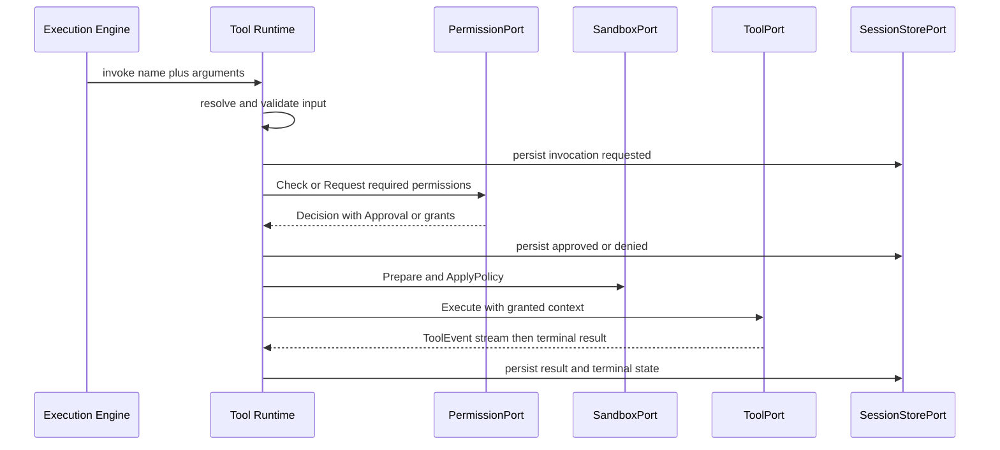

# 02 — Tool Lifecycle, Permissions, and Trust

This chapter specifies how tools enter, live in, and leave the registry; how every invocation
is permission-mediated and sandbox-placed; how origin and trust govern execution policy; the
`[tools]` configuration keys; and the E-TOOL error catalog. The permission model itself —
enum, scopes, decisions, precedence — is Volume 9's (keystone FR-SEC-100); the sandbox model
is Volume 9's (keystone FR-SEC-101); this chapter binds tools to both.

## Registration lifecycle

A Tool row is a stateless registry entry with an `enabled` flag (Volume 2): tools have no
state machine of their own — their availability follows their providers.

1. **Built-in tools** are materialized from the binary at startup, before any session
   activates. They are not persisted rows; invocation records still pin name/version
   snapshots (Volume 2).
2. **Plugin tools** register when their Plugin completes the ARP handshake and surface
   registration (Plugin state `running`, chapter 08). Only surfaces declared in the plugin
   manifest may register (INV-PLG-01). When the Plugin leaves `running`, its tools become
   unavailable; invocation attempts fail with E-TOOL-010.
3. **MCP tools** register when their MCP Client Connection reaches `ready` (chapter 05) and
   the MCP Runtime bridges discovered tools through registration policy. Requests against a
   connection in any other state fail (INV-MCPC-03), surfacing as E-TOOL-010 at the tool
   boundary.

Every registration passes declaration validation (FR-TOOL-002) and naming rules
(FR-TOOL-003) and is recorded with `tool.registration.completed` or rejected with
`tool.registration.rejected`. Disabling (user action, Extension cascade per INV-EXT-03, or
policy) keeps the row and flips `enabled`, emitting `tool.enablement.changed`.
Unregistration never deletes referenced rows — they are disabled and retained for
attribution (INV-TOOL-04); removal of a providing Plugin, MCP Server, or Package disables
its tools through the provider's own lifecycle (chapters 05, 08, 09).

## The invocation pipeline



The sequence shows one invocation through the fixed pipeline: **validate → permission →
sandbox → execute → record**. The Execution Engine (or Agent Engine) requests invocation
from the Tool Runtime — never from a `ToolPort` directly. The runtime resolves the name,
validates input, persists `requested`, evaluates permissions through `PermissionPort`
(raising an Approval only where interaction is permitted and required), prepares a sandbox
handle, drives `Execute`, and persists every transition and the terminal result. The order
is normative: validation precedes permission so malformed requests never consume user
attention; permission precedes sandbox so denied work allocates nothing; nothing executes
outside a sandbox handle (ADR-021).

Non-interactive paths (CI mode, headless mode per ADR-032, non-interactive CLI flags) treat
any decision other than `allow` as denial (PRD-009; Volume 3 PermissionPort semantics): an
`ask` outcome becomes `denied` with the policy resolution recorded (INV-APR-03).

## Permission declaration and mediation

A tool's `permissions` field declares `required` and `optional` lists using only the closed
Volume 9 permission enum: `read`, `write`, `execute`, `network`, `credential_access`,
`git_mutation`, `process_spawn`, `container_access`, `external_service_access`, `clipboard`,
`notifications`, `package_installation`, `system_modification`. Entries MAY carry resource
selectors (path globs, command patterns, hosts — selector grammar owned by Volume 9) that
narrow what will be asked for. Rules:

1. `required` permissions are evaluated for every invocation; an unsatisfied required
   permission is a denial, never a downgrade.
2. `optional` permissions widen behavior when granted (e.g., `fs.search` following symlinks
   out of the workspace only with a broader `read` scope); tools MUST behave correctly, with
   reduced capability, when optional permissions are absent — and MUST NOT probe for them at
   execution time outside the declared list.
3. A tool MUST NOT perform any action whose permission class it did not declare. The sandbox
   enforces this structurally where mechanisms allow (ADR-021); a detected undeclared action
   terminates the invocation (E-TOOL-009 limits or an E-SEC sandbox refusal) and is a
   reportable defect of the tool.
4. Permissionless tools (empty `required`, empty `optional`) execute without prompts
   (Volume 9 decides which read-only cases qualify) but still pass the full pipeline and
   produce full records — mediation is universal even when consent is trivial (SM-16(b)).

Denial is first-class data: a denied invocation reaches `denied` with the deciding Approval
or Permission recorded and a structured denial delivered to the agent (INV-TINV-05), which
MUST be able to continue reasoning (propose an alternative, ask the user) rather than crash.

## Origin, trust, and execution policy

The trust vocabulary is owned by Volume 9; this volume binds it at the tool boundary:

- `origin` and `trust_level` are assigned at registration (never author-declared) and are
  visible wherever a tool is offered — registry listings, model tool declarations, approval
  prompts, TUI panels (INV-TOOL-03).
- `builtin` tools carry the highest trust classification (Volume 2); `plugin` and `mcp`
  tools derive trust from their provider's registration, package signature state
  (INV-PKG-02, chapter 09), and Volume 9 policy.
- Trust never bypasses the pipeline; it parameterizes *defaults* within it: Volume 9 policy
  MAY auto-resolve decisions for higher-trust tools and MUST require explicit consent for
  lower-trust side-effecting actions; sandbox strictness for lower-trust origins is
  policy-tightened, never loosened.
- Approval prompts for third-party tools MUST display name, version, origin, provider
  identity, trust level, declared `risks`, and the concrete resources requested.

## Configuration

Key content of the `[tools]` table (this volume owns it; schema, precedence, and validation
are Volume 10's):

| Key | Type | Default | Meaning |
|---|---|---|---|
| `tools.default_timeout_ms` | integer | `60000` | Effective timeout when a declaration omits `default_timeout_ms` |
| `tools.max_timeout_ms` | integer | `600000` | Hard cap on any effective timeout |
| `tools.max_output_bytes` | integer | `1048576` | Installation cap on inline output (ADR-071) |
| `tools.max_concurrent_invocations` | integer | `8` | Global concurrent invocation bound (scheduler `tools` pool) |
| `tools.teardown_grace_ms` | integer | `2000` | Cooperative-stop budget after cancel/timeout before termination escalates |
| `tools.teardown_kill_ms` | integer | `3000` | Budget after terminate before kill; grace + kill is the total teardown budget (Volume 3 ToolPort rule) |
| `tools.max_auto_retries` | integer | `2` | Installation cap on automatic retries (ADR-072) |
| `tools.disabled` | array of string | `[]` | Tool name selectors disabled regardless of provider state |
| `tools.allowed_origins` | array of string | `["builtin", "plugin", "mcp"]` | Origins permitted to register tools |
| `tools.aliases` | table | empty | User-declared alias → canonical name mappings (FR-TOOL-003) |

```toml
[tools]
default_timeout_ms = 60000
max_timeout_ms = 600000
max_output_bytes = 1048576
max_concurrent_invocations = 8
teardown_grace_ms = 2000
teardown_kill_ms = 3000
max_auto_retries = 2
disabled = []
allowed_origins = ["builtin", "plugin", "mcp"]

[tools.aliases]
"deploy.preview_mcp" = "deploy.preview"
```

## Requirements

### FR-TOOL-004 — Tool registration, availability, and enablement

- Type: Functional
- Status: Draft
- Priority: P0
- Phase: MVP
- Source: Derived
- Owner: Tool Runtime (Volume 6)
- Affected components: Tool Runtime, Plugin Runtime, MCP Runtime, Persistence Layer, Event Bus
- Dependencies: FR-TOOL-001, FR-TOOL-002, FR-TOOL-003; FR-MCP-001, FR-PLUG-001
- Related risks: RISK-TOOL-001, RISK-TOOL-002

#### Description

The Tool Runtime MUST maintain the tool registry across the three origins with the lifecycle
of this chapter: validated registration, provider-coupled availability (plugin `running`,
MCP connection `ready`), enable/disable with cascade from Extensions (INV-EXT-03), retention
of referenced rows on unregistration (INV-TOOL-04), and registry listings that always carry
origin and trust. Registration, rejection, and enablement changes MUST emit their events and
persist per Volume 2 scoping rules.

#### Motivation

The registry is the source of truth for what an agent can do; its lifecycle discipline is
what keeps availability honest and attribution permanent (PRD-006, PRD-007).

#### Actors

Tool sources; users enabling/disabling; agents listing and resolving.

#### Preconditions

Workspace open; providers in their serving states for non-builtin origins.

#### Main flow

1. Sources register declarations; validation and naming checks run.
2. Accepted registrations become resolvable; listings expose origin/trust.
3. Provider state changes flip availability without deleting registrations.
4. Disable/enable actions flip `enabled` and emit `tool.enablement.changed`.

#### Alternative flows

- Origin excluded by `tools.allowed_origins`: registration is refused with E-TOOL-002 and the
  policy cause named.
- Workspace-scoped versus global-scoped providers register into the matching database
  (ADR-028; Volume 2 persistence rules).

#### Edge cases

- Provider crash: tools of a `failed` Plugin stay registered but unavailable; invocations
  fail fast with E-TOOL-010, never queue on a dead provider.
- Startup with a provider absent: registrations load; availability waits for the provider.
- A resuming run referencing a now-disabled tool fails resolution (E-TOOL-001) and surfaces
  the change to the user.

#### Inputs

Declarations, provider state transitions, enablement commands, configuration.

#### Outputs

Registry state, listings, events, persisted rows.

#### States

Availability derives from provider machines (chapters 05/08); the Tool row itself is
stateless with `enabled`.

#### Errors

E-TOOL-001, E-TOOL-002, E-TOOL-010.

#### Constraints

Registry operations are workspace-local and offline-capable; no network is required to list
or resolve tools (Principle 3).

#### Security

Availability coupling prevents invoking tools of dead or compromised providers with stale
handles; retention rules keep audit chains resolvable forever.

#### Observability

`tool.registration.completed`, `tool.registration.rejected`, `tool.enablement.changed`;
registry listings queryable via CLI/TUI (Volume 8 surfaces).

#### Performance

Listing and resolution are in-memory; registration cost is validation-bound (Volume 12
budgets).

#### Compatibility

Registry rows follow Volume 2 serialization; scope split per ADR-028.

#### Acceptance criteria

- Given a plugin that stops, when its tool is invoked, then the invocation fails with
  E-TOOL-010, the registration persists, and availability recovers when the plugin returns
  (error case).
- Given a user disabling a tool, when an agent lists tools, then the tool is absent from
  offers, the row persists, and `tool.enablement.changed` was emitted (observability case).
- Given `tools.allowed_origins = ["builtin"]`, when a plugin registers a tool, then
  registration is refused citing policy (permission/policy case).
- Given an unregistered tool with historical invocations, when audit resolves those records,
  then the Tool row is present and attributable (negative deletion case).

#### Verification method

Integration tests over provider lifecycle transitions; registry persistence tests per scope;
audit-chain resolution tests (Volume 13).

#### Traceability

PRD-006, PRD-007; INV-TOOL-01..04, INV-EXT-03 (Volume 2); FR-TOOL-001.

### FR-TOOL-005 — Permission mediation for every invocation

- Type: Functional
- Status: Draft
- Priority: P0
- Phase: MVP
- Source: Provided
- Owner: Tool Runtime (Volume 6)
- Affected components: Tool Runtime, Permission Manager, Execution Engine, Audit Log
- Dependencies: FR-TOOL-001; FR-SEC-100; ADR-016
- Related risks: RISK-TOOL-001

#### Description

Every tool invocation MUST pass permission evaluation through `PermissionPort` after input
validation and before sandbox placement — with no alternative path. Required permissions are
evaluated against grants and policy; interactive consent is raised as an Approval only where
the mode permits; non-interactive modes resolve `ask` to denial (PRD-009). An invocation
MUST NOT enter `executing` before its permission context is recorded (INV-TINV-03). Denials
are recorded, evented (`tool.invocation.denied`), and delivered to the agent as structured
data (INV-TINV-05). Optional permissions are requested only when the invocation's arguments
require them, never speculatively.

#### Motivation

This is the enforcement point of SM-16(b): 100% of side-effecting invocations mediated. One
path means one place to audit and one place that cannot be forgotten.

#### Actors

Agents issuing invocations; Permission Manager; users deciding Approvals; policy in
unattended modes.

#### Preconditions

Registered, available tool; validated input.

#### Main flow

1. The runtime computes the concrete permission set: declared classes narrowed by argument
   resources (paths, hosts, commands).
2. `Check` evaluates standing grants and policy; `allow` proceeds; `deny` terminates as
   `denied`.
3. On `ask` in interactive mode, `Request` raises an Approval; the invocation waits in
   `awaiting_approval`.
4. The decision and grant references persist on the invocation before any execution step.

#### Alternative flows

- Expired Approval: resolves denied-class (INV-APR-05); the invocation reaches `denied`.
- Revoked grant between approval and execution: re-evaluation runs at the `approved` →
  `executing` guard; a now-unsatisfied requirement returns the invocation to permission
  evaluation rather than executing on stale consent.

#### Edge cases

- Permissionless tools skip consent but still record an empty permission context and pass
  the same pipeline.
- Concurrent invocations sharing one standing grant each reference it individually — no
  implicit widening by concurrency.
- An Approval cancelled because its run was cancelled ends the invocation `cancelled`, not
  `denied`.

#### Inputs

Declared permissions, arguments, grants, policy verdicts, user decisions.

#### Outputs

Decisions, Approval records, permission references on invocations, denial payloads.

#### States

`requested` → `awaiting_approval` → `approved`/`denied` per chapter 04.

#### Errors

E-TOOL-005 (denial as surfaced error class); evaluation failures surface from the E-SEC
family and terminate the invocation `failed`.

#### Constraints

Permission names only from the Volume 9 enum; no prompt content may include unredacted
secrets (Volume 9 redaction).

#### Security

The single-path rule is load-bearing: any code path dispatching a `ToolPort` without a
recorded permission context is a defect class tested for explicitly (unmediated side-effect
probes).

#### Observability

`tool.invocation.denied` and approval events; every decision auditable with correlation IDs
(SM-13 chain).

#### Performance

`Check` on the hot path is a local evaluation (no network); prompting latency is
user-bound and excluded from dispatch budgets.

#### Compatibility

Uniform across interactive TUI, CLI, CI, and headless modes; only the `ask` disposition
differs by mode (PRD-009).

#### Acceptance criteria

- Given a tool requiring `write` and no grant, when invoked interactively, then an Approval
  prompt shows tool identity, origin, trust, risks, and concrete paths; on grant the
  invocation proceeds; on deny it reaches `denied` with structured denial delivered
  (permission case).
- Given the same invocation in CI mode, when policy does not pre-allow, then it reaches
  `denied` without prompting and the deciding policy is recorded (negative case).
- Given a revoked grant after approval, when execution would start, then the invocation does
  not execute on the stale grant (error case).
- Given any denial, when records are inspected, then Approval/Permission references and the
  `tool.invocation.denied` event exist and correlate (observability case).

#### Verification method

Permission matrix tests per mode; unmediated-execution probes (SM-16(b) method); Approval
expiry and revocation race tests; audit-chain verification (Volume 13).

#### Traceability

PRD-004, PRD-005, PRD-009; FR-SEC-100; INV-TINV-03/05, INV-APR-03/05 (Volume 2).

### FR-TOOL-006 — Execution limits, sandbox placement, and teardown

- Type: Functional
- Status: Draft
- Priority: P0
- Phase: MVP
- Source: Derived
- Owner: Tool Runtime (Volume 6)
- Affected components: Tool Runtime, Sandbox Engine, Terminal Engine, Task Scheduler
- Dependencies: FR-TOOL-001; FR-SEC-101; ADR-021, ADR-071
- Related risks: RISK-TOOL-004

#### Description

Every executing invocation MUST run under a sandbox handle whose policy derives from the
tool's declaration (`sandbox_profile`, permission classes, resource selectors) as decided by
the Sandbox Engine (Volume 9 model, ADR-021 layers), and under effective limits: timeout =
min(declared `default_timeout_ms` or `tools.default_timeout_ms`, `tools.max_timeout_ms`);
inline output cap per ADR-071; per-tool `max_concurrency` from the declaration and the
global `tools.max_concurrent_invocations` bound on the scheduler's `tools` pool. Cancellation
and timeout MUST terminate the invocation's entire process tree within the teardown budget:
cooperative stop within `tools.teardown_grace_ms`, escalation to terminate, then kill after
`tools.teardown_kill_ms`. The effective containment level is recorded per execution
(ADR-021); process-level controls MUST NOT be described as OS-level isolation.

#### Motivation

Approval is not a grant of unlimited side effects (ADR-021): limits and containment bound
what even a permitted tool can do, and honest teardown is what makes cancellation a real
user power (PRD-005, PRD-008).

#### Actors

Tool Runtime, Sandbox Engine, Terminal Engine (for command-running tools), Task Scheduler.

#### Preconditions

Permission context recorded; sandbox mechanisms probed at startup.

#### Main flow

1. The runtime computes effective limits and requests `Prepare`/`ApplyPolicy`.
2. Execution proceeds inside the handle; output accounting runs against the caps.
3. On terminal events, the handle is torn down and resources released.

#### Alternative flows

- Timeout: cooperative cancel at expiry, escalation per budgets, terminal state `timed_out`
  with an error Tool Result (E-TOOL-007).
- Cap breach: invocation terminates `failed` with E-TOOL-009; produced output up to the cap
  is preserved with spillover per ADR-071.

#### Edge cases

- In-process built-in tools have no child process; the "sandbox" reduces to policy checks,
  resource accounting, and cooperative cancellation — the recorded containment level says so
  honestly.
- A tool spawning children (declared `process_spawn`): teardown terminates the full tree via
  the PAL Process Trees surface; surviving children are a containment defect (FR-ARCH-004).
- Concurrency saturation: submissions beyond bounds queue per scheduler policy; queue
  rejection surfaces as E-TOOL-011.

#### Inputs

Declarations, configuration caps, sandbox policies, cancellation signals.

#### Outputs

Sandbox handles, execution records with containment level, teardown reports.

#### States

`executing` and its exits per chapter 04.

#### Errors

E-TOOL-007, E-TOOL-008, E-TOOL-009, E-TOOL-011; sandbox refusals surface from E-SEC.

#### Constraints

All child processes launch exclusively through `SandboxPort.ExecuteIn` (Volume 3); direct
spawning is a defect (ADR-009 risk rule).

#### Security

Deny-by-default environment filtering keeps Secret Store material out of tool children
(ADR-014/ADR-021); path policy bounds writes to permitted scopes; limits blunt
resource-exhaustion attacks (RISK-TOOL-004).

#### Observability

Effective containment level, limits, and teardown timings recorded per execution;
`tool.output.truncated` on cap-triggered spillover.

#### Performance

Teardown budget total ≤ `teardown_grace_ms + teardown_kill_ms` (default 5 s); dispatch and
teardown latency budgets are Volume 12's.

#### Compatibility

Containment mechanisms differ per platform and phase (ADR-021, PENDING VALIDATION items are
Volume 9's/Volume 3's); the limit semantics of this requirement are platform-uniform.

#### Acceptance criteria

- Given a tool that ignores cooperative cancellation, when cancelled, then its process tree
  is gone within the teardown budget and the invocation records `cancelled` with the
  escalation noted (negative case).
- Given output exceeding the effective cap, when the invocation completes, then the inline
  payload is marked truncated with spillover, or the invocation failed with E-TOOL-009 —
  never silent loss (error case).
- Given an invocation, when its records are read, then the effective containment level and
  limits applied are present (observability case).
- Given MVP process-level containment, when any surface describes it, then it is not called
  OS-level isolation (honesty case, ADR-021).

#### Verification method

Fault-injection suite (hang, fork-bomb, output-flood fixtures); teardown timing tests per
platform; containment-level record assertions; SM-10 measurement includes limit behavior.

#### Traceability

PRD-005, PRD-008; ADR-021, ADR-071; FR-SEC-101; FR-ARCH-004.

## Risks

### RISK-TOOL-001 — Dishonest or over-broad tool declarations

- Category: Security / contract
- Probability: High
- Impact: High
- Severity: Critical
- Mitigation: Registration validation (FR-TOOL-002); least-permission templates and
  idempotency probes in the SDK (FR-SDK-001); sandbox enforcement independent of declaration
  honesty (FR-TOOL-006); trust policy consequences and user-visible risks at approval
  (FR-TOOL-005); conformance suite for built-ins (NFR-TOOL-001)
- Detection: Undeclared-action sandbox refusals; conformance failures; SM-16(b) probes; user
  reports against visible declarations
- Owner: Tool Runtime (Volume 6)
- Status: Open

A third-party tool may declare less than it does (hiding side effects behind granted classes)
or more than it needs (normalizing over-consent). The declaration is untrusted input; the
mitigation stack assumes it lies and contains the blast radius structurally.

### RISK-TOOL-002 — Name shadowing and typosquatting across origins

- Category: Security / supply chain
- Probability: Medium
- Impact: High
- Severity: High
- Mitigation: Reserved namespaces and collision rejection (ADR-070, FR-TOOL-003); origin and
  trust always visible (INV-TOOL-03); user-initiated aliasing as the only coexistence path
- Detection: `tool.registration.rejected` events; registry audits comparing near-identical
  names across origins; Volume 9 supply-chain monitoring
- Owner: Tool Runtime (Volume 6)
- Status: Open

An attacker-controlled MCP server or plugin may attempt to claim or imitate trusted tool
names (`fs.read` vs `fs.reader`). Reservation plus rejection eliminates exact-name capture;
near-name imitation remains and is a Volume 9 threat-model entry, mitigated at the prompt
surface by provenance display.

## E-TOOL error catalog

Every code below declares the full ADR-016 envelope. "Safe context data" lists what may
appear in logs/events; anything else is redacted per Volume 9.

### E-TOOL-001 — Tool not found

- Category: validation
- Severity: error
- User message: "Tool '{name}' is not available."
- Technical message: name resolution failed — unknown name, disabled registration, or no enabled version
- Cause: unregistered/disabled tool, alias misconfiguration, resuming run referencing removed tools
- Safe context data: requested name, nearest-name suggestions, origin filter in force
- Recoverability: recoverable — the agent can choose another tool; the user can enable or install
- Retry policy: not retryable (deterministic until registry changes)
- Recommended action: list available tools; enable or install the provider
- Exit code: 6 (Volume 8 maps user-typed unknown names on the CLI surface to 2 as a usage error)
- HTTP mapping: none
- Telemetry event: `tool.invocation.failed`
- Security implications: none beyond name disclosure in logs

### E-TOOL-002 — Tool registration rejected

- Category: validation
- Severity: error
- User message: "Tool '{name}' could not be registered: {reason-summary}."
- Technical message: declaration invalid (missing field, schema/draft error, oversize, failing examples), name grammar/reservation violation, collision, contract-version mismatch, or origin excluded by policy
- Cause: defective or malicious declaration; namespace conflict; policy
- Safe context data: name, origin, origin_ref identity, violated rule, colliding party
- Recoverability: recoverable by fixing the declaration, aliasing, or adjusting policy
- Retry policy: not retryable without change
- Recommended action: fix the declaration or declare an alias
- Exit code: 6
- HTTP mapping: none
- Telemetry event: `tool.registration.rejected`
- Security implications: rejection text must not echo attacker-controlled description content unsanitized into terminals

### E-TOOL-003 — Input validation failed

- Category: validation
- Severity: error
- User message: "The tool call's inputs are invalid."
- Technical message: arguments violate `input_schema` at {instance path}, keyword {keyword}
- Cause: agent produced malformed arguments; schema/version skew
- Safe context data: tool name/version, instance path, failing keyword (never full argument values — they may contain sensitive content)
- Recoverability: recoverable — structured error returns to the agent for correction
- Retry policy: not retryable unchanged
- Recommended action: agent corrects arguments; author checks schema documentation
- Exit code: 6
- HTTP mapping: none
- Telemetry event: `tool.invocation.failed`
- Security implications: argument values are redacted in all channels

### E-TOOL-004 — Output validation failed

- Category: execution
- Severity: error
- User message: "The tool returned output that does not match its contract."
- Technical message: `success` payload violates `output_schema` at {instance path}; raw output spilled to artifact {artifact id}
- Cause: defective tool; provider-side schema drift (MCP); truncated upstream data
- Safe context data: tool name/version/origin, instance path, keyword, artifact reference
- Recoverability: recoverable — error result is data; raw output retrievable from the artifact
- Retry policy: retryable only per ADR-072 conditions
- Recommended action: report to the tool author; inspect the spilled artifact
- Exit code: 6
- HTTP mapping: none
- Telemetry event: `tool.invocation.failed`
- Security implications: nonconforming output is quarantined as an artifact, not delivered as trusted structure

### E-TOOL-005 — Invocation denied

- Category: permission
- Severity: warning
- User message: "Permission to run '{name}' was denied."
- Technical message: denial by Approval {id}, standing deny grant, or policy resolution of `ask` in a non-interactive mode
- Cause: user or policy decision (PRD-005, PRD-009)
- Safe context data: tool identity, permission names requested, deciding record reference, decider kind
- Recoverability: recoverable — the agent receives the structured denial and continues
- Retry policy: never retried automatically (ADR-072 exclusion)
- Recommended action: proceed differently, or the user grants the permission and re-invokes
- Exit code: 5
- HTTP mapping: none
- Telemetry event: `tool.invocation.denied`
- Security implications: denial reasons must not leak policy internals beyond the deciding rule reference

### E-TOOL-006 — Tool execution failed

- Category: execution
- Severity: error
- User message: "Tool '{name}' failed: {tool-local meaning}."
- Technical message: tool reported error result; tool-local code {code}; detail per tool
- Cause: the tool's own declared error conditions or unexpected internal failure
- Safe context data: tool identity, tool-local code, declared meaning, duration
- Recoverability: per the declared `retryable` flag of the tool-local code
- Retry policy: automatic only per ADR-072; otherwise caller-decided
- Recommended action: per tool-local meaning; inspect the error result payload
- Exit code: 6
- HTTP mapping: none
- Telemetry event: `tool.invocation.failed`
- Security implications: tool-provided error text is untrusted; sanitized before terminal rendering per Volume 8/9 rules

### E-TOOL-007 — Invocation timed out

- Category: timeout
- Severity: error
- User message: "Tool '{name}' exceeded its time limit ({timeout})."
- Technical message: effective timeout {ms} elapsed in `executing`; teardown completed within {ms}; partial output {bytes} preserved
- Cause: slow tool, hung child process, unavailable external dependency
- Safe context data: tool identity, effective timeout, teardown timings, partial-output size
- Recoverability: recoverable; partial output preserved with truncation marked
- Retry policy: retryable automatically only for idempotent tools (ADR-072)
- Recommended action: raise the tool's timeout within caps, or investigate the dependency
- Exit code: 8
- HTTP mapping: none
- Telemetry event: `tool.invocation.timed_out`
- Security implications: teardown must be verified complete — a survived process after timeout is a containment defect

### E-TOOL-008 — Invocation cancelled

- Category: cancellation
- Severity: info
- User message: "Tool '{name}' was cancelled."
- Technical message: cancellation via user interrupt, run cancellation, or context deadline of the owning scope; cooperative stop {within|exceeded} grace
- Cause: deliberate cancellation (PRD-005 user control)
- Safe context data: tool identity, cancellation reason, teardown timings
- Recoverability: recoverable — cancellation is an expected outcome
- Retry policy: never automatic
- Recommended action: none; re-invoke deliberately if wanted
- Exit code: 8
- HTTP mapping: none
- Telemetry event: `tool.invocation.cancelled`
- Security implications: same teardown-completeness obligation as E-TOOL-007

### E-TOOL-009 — Resource limit exceeded

- Category: resource
- Severity: error
- User message: "Tool '{name}' exceeded its resource limits."
- Technical message: breach of {limit kind: output-bytes | memory | cpu-time | artifact-count} at {value} against cap {cap}
- Cause: runaway or malicious tool behavior; undersized caps for a legitimate workload
- Safe context data: tool identity, limit kind, cap, measured value
- Recoverability: recoverable; output up to the cap preserved per ADR-071
- Retry policy: not retryable unchanged (deterministic against the same input and caps)
- Recommended action: raise the specific cap deliberately, or report the tool
- Exit code: 6
- HTTP mapping: none
- Telemetry event: `tool.invocation.failed`
- Security implications: this is the resource-exhaustion tripwire (RISK-TOOL-004); breaches are audit-relevant

### E-TOOL-010 — Tool origin unavailable

- Category: availability
- Severity: error
- User message: "Tool '{name}' is temporarily unavailable — its provider is not running."
- Technical message: providing Plugin not `running` / MCP Client Connection not `ready`; provider state {state}
- Cause: provider crash, restart backoff, disabled provider, connection loss
- Safe context data: tool identity, provider identity, provider state
- Recoverability: recoverable when the provider returns
- Retry policy: retryable per ADR-072 for idempotent tools; fails fast, never queues on a dead provider
- Recommended action: check provider status (chapters 05/08 surfaces); restart or re-enable
- Exit code: 6
- HTTP mapping: none
- Telemetry event: `tool.invocation.failed`
- Security implications: none beyond provider-state disclosure

### E-TOOL-011 — Concurrency capacity exhausted

- Category: resource
- Severity: error
- User message: "Too many tools are running; '{name}' was not started."
- Technical message: scheduler `tools` pool rejected submission (queue bound) or per-tool `max_concurrency` reached with non-queueing policy
- Cause: saturation; overly parallel plan; undersized bounds
- Safe context data: tool identity, pool occupancy, configured bounds
- Recoverability: recoverable; capacity frees as invocations finish
- Retry policy: retryable with backoff (idempotency irrelevant — nothing executed)
- Recommended action: reduce parallelism or raise `tools.max_concurrent_invocations`
- Exit code: 6
- HTTP mapping: none
- Telemetry event: `tool.invocation.failed`
- Security implications: none

### E-TOOL-012 — Execution interrupted

- Category: integrity
- Severity: error
- User message: "Tool '{name}' was interrupted before finishing; its effects may be incomplete."
- Technical message: recovery reconciliation found the invocation in `executing` at startup; side effects unknown; resolved to `failed` per chapter 04 recovery
- Cause: crash or forced shutdown mid-execution (PRD-010)
- Safe context data: tool identity, invocation id, last persisted transition timestamp
- Recoverability: partially — work is not assumed complete; the user reviews recorded File Changes and artifacts
- Retry policy: never automatic (side-effect state unknown, even for declared-idempotent tools — declaration honesty is not assumed after a crash)
- Recommended action: inspect the run's records and workspace state before re-running
- Exit code: 6
- HTTP mapping: none
- Telemetry event: `tool.invocation.failed`
- Security implications: interrupted side-effecting invocations are flagged for user review; recovery must not silently mark them complete
