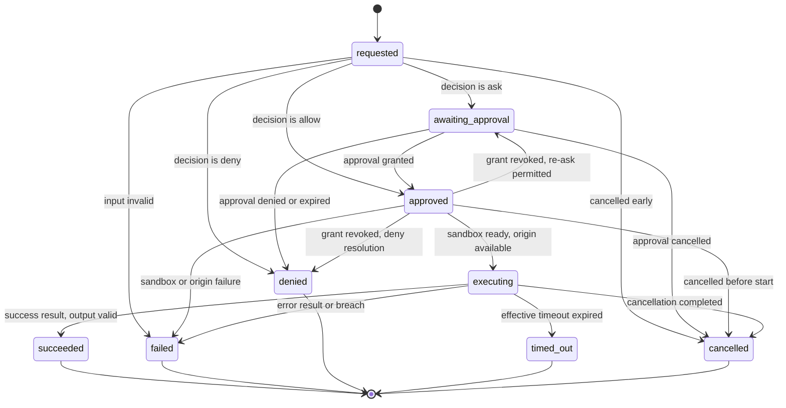

# 04 — Tool Invocation State Machine

The full machine for the **Tool Invocation** entity, using the frozen state names of Volume 2
chapter 09: `requested`, `awaiting_approval`, `approved`, `executing`, `succeeded`, `failed`,
`denied`, `timed_out`, `cancelled`. This chapter defines all twelve mandatory machine
elements (Volume 0, chapter 02). The Tool Runtime drives this machine exclusively; no other
component transitions an invocation.

The diagram shows the four live states and five terminal outcomes. An invocation is born
`requested`; validation and permission evaluation resolve it toward `approved` (directly or
through `awaiting_approval`), `denied`, or early `failed`/`cancelled`. From `approved` the
runtime places the sandbox and starts execution; `executing` ends in exactly one of four
outcomes. A grant revoked while an invocation waits in `approved` re-enters permission
evaluation before anything executes: a re-`ask` returns it to `awaiting_approval` under a
new Approval, and a `deny` — or `ask` in a non-interactive mode — resolves it `denied`
(transitions 16 and 17). There is no `interrupted` state for invocations: crash recovery resolves live
invocations to terminal states (below), because a tool call — unlike a run — cannot resume
mid-flight without re-executing side effects.

## Machine elements

### Initial state

`requested` — created when the Tool Runtime accepts an invocation request; the row persists
with its name/version/origin snapshot before anything else happens (INV-TINV-02).

### Terminal states

`succeeded`, `failed`, `denied`, `timed_out`, `cancelled`. Terminal invocations are
immutable; a Tool Result row exists for exactly `succeeded`, `failed`, and `timed_out`
(INV-TRES-01), with `status` consistency per INV-TRES-03.

### Transitions, events, and guards

| # | From → To | Trigger | Guard | Side effects |
|---|---|---|---|---|
| 1 | `requested` → `failed` | Input validation verdict | Arguments violate `input_schema` (E-TOOL-003) | Error Tool Result written; no side effects exist (INV-TINV-04); `tool.invocation.failed` |
| 2 | `requested` → `approved` | Permission decision | Decision `allow`: every required permission resolves to recorded grants, or tool requires none | `permission_ids` recorded (INV-TINV-03); `tool.invocation.approved` |
| 3 | `requested` → `awaiting_approval` | Permission decision | Decision `ask` and interactive consent permitted in this mode | Approval created (`requested` state, Volume 9 machine); `tool.invocation.requested` already emitted at creation |
| 4 | `requested` → `denied` | Permission decision | Decision `deny`, or `ask` in non-interactive mode (PRD-009) | Denial recorded with decider; structured denial payload to agent; `tool.invocation.denied` |
| 5 | `requested` → `cancelled` | Run/context cancellation | Before any decision | `tool.invocation.cancelled`; no Tool Result (INV-TRES-01) |
| 6 | `awaiting_approval` → `approved` | Approval `granted` | Grant covers the requested scope | `approval_id` + minted grants recorded; `tool.invocation.approved` |
| 7 | `awaiting_approval` → `denied` | Approval `denied` or `expired` | Expiry resolves denied-class (INV-APR-05) | As transition 4 |
| 8 | `awaiting_approval` → `cancelled` | Approval `cancelled` | Subject run/invocation cancelled before decision | `tool.invocation.cancelled` |
| 9 | `approved` → `executing` | Sandbox prepared, `Execute` started | Origin available (E-TOOL-010 otherwise); concurrency capacity (E-TOOL-011 otherwise); grants still valid — a revoked grant re-enters permission evaluation via transition 16 or 17 | `started_at` set; sandbox handle bound; `tool.invocation.started` |
| 10 | `approved` → `failed` | Sandbox/origin failure | Preparation failed or origin left service | Error Tool Result (E-TOOL-010 or surfaced E-SEC); `tool.invocation.failed` |
| 11 | `approved` → `cancelled` | Cancellation | Before `Execute` begins | `tool.invocation.cancelled`; no Tool Result |
| 12 | `executing` → `succeeded` | Terminal `result` event, `success` | Output validates (FR-TOOL-002); caps respected (spillover per ADR-071 as needed) | `success` Tool Result written atomically with the transition; `ended_at`; `tool.invocation.succeeded` |
| 13 | `executing` → `failed` | Terminal `result` error, output-validation failure, limit breach, or broken stream | E-TOOL-004/006/009 classes | Error Tool Result; teardown; `tool.invocation.failed` |
| 14 | `executing` → `timed_out` | Effective timeout expiry | Timeout clock (below) elapsed | Cooperative cancel then teardown escalation; error Tool Result (E-TOOL-007) with partial output preserved; `tool.invocation.timed_out` |
| 15 | `executing` → `cancelled` | `Cancel` / context cancellation | Teardown completed within budget | Error-free termination record; Tool Result policy: a `cancelled` invocation that produced committed side effects records them via File Change/Command Execution rows even though no Tool Result exists; `tool.invocation.cancelled` |
| 16 | `approved` → `awaiting_approval` | Grant revocation detected at the transition-9 guard | Re-evaluation returns `ask` and interactive consent is permitted in this mode | New Approval created (`requested` state, Volume 9 machine); revoked grant reference retained on the row for audit; no new `tool.invocation.requested` — the invocation resolves onward via transitions 6/7/8 |
| 17 | `approved` → `denied` | Grant revocation detected at the transition-9 guard | Re-evaluation returns `deny`, or `ask` in a non-interactive mode (PRD-009) | As transition 4 |

### Side effects

Side effects are recorded, never implied: File Change, Command Execution, Patch, and
Artifact rows attach to the invocation as they occur (Volume 2 attribution invariants), so a
terminal state never has to be trusted about what happened — the records say. Denials and
cancellations deliver structured payloads to the agent so the loop can continue reasoning
(INV-TINV-05).

### Persistence

The invocation row is written at `requested` and updated at **every** transition through
`SessionStorePort.AppendRunRecords`, transactionally with the records the transition
produces (Tool Result with terminal transitions 12–14; grant references with 2/6). A
transition is not observable to consumers until persisted (Volume 2, chapter 10 write
discipline). `sequence_no` orders invocations densely within the run (ADR-027: ULIDs are
identity, `sequence_no` is ordering authority).

### Recovery

On startup after a crash or forced shutdown (`MarkInterrupted` scope, Volume 3), the Tool
Runtime reconciles invocations left in live states:

- `requested`, `awaiting_approval`, `approved` → `cancelled`, reason `interrupted`; pending
  Approvals are cancelled through their own machine (Volume 9). No Tool Result is written
  (INV-TRES-01 permits none for pre-execution cancellation).
- `executing` → `failed` with an E-TOOL-012 error Tool Result: side effects are unknown, the
  work is never assumed complete (PRD-010), and the run surfaces the flagged invocation for
  user review before any re-execution. Declared idempotency is deliberately not trusted
  across a crash (ADR-072 exclusion).

Recovery transitions persist and emit events exactly like live transitions.

### Timeouts

One timeout governs execution: `effective timeout = min(declaration default or
tools.default_timeout_ms, tools.max_timeout_ms)`, recorded on the row (`timeout_ms`) at
creation. The clock starts at transition 9 (`executing`) — approval wait time never counts
against the tool (Approval expiry is the Volume 9 machine's own `expires_at`). At expiry:
cooperative cancel, then teardown escalation per `tools.teardown_grace_ms` +
`tools.teardown_kill_ms` (chapter 02), then transition 14.

### Cancellation

Cancellation may arrive at any live state — user interrupt, run cancellation, budget/policy
cancellation, context deadline of the owning scope — and always wins: transitions 5, 8, 11,
15. During `executing`, cancellation is cooperative first (`Cancel` on ToolPort), forceful
after the grace budget (sandbox teardown of the whole process tree). Cancellation of the
Approval subject cancels the Approval, not vice versa. A cancelled invocation is never
retried automatically (ADR-072).

### Retries

A retry is a **new** invocation chained by `retry_of_id` (acyclic, same run — INV-TINV-06),
created only under the ADR-072 conditions: declared idempotent, retryable terminal error,
attempt caps respected, not denied/cancelled. The retry re-enters this machine at
`requested`; still-valid grants carry over without re-prompting, expired or revoked grants
force re-evaluation. `tool.invocation.retried` is emitted with both invocation IDs.

### Errors

All error classes of this machine are the chapter 02 catalog: E-TOOL-003 (transition 1),
E-TOOL-005 (4, 7, 17 — surfaced denial class), E-TOOL-010/E-TOOL-011 (9's guard failures →
transition 10), E-TOOL-004/E-TOOL-006/E-TOOL-009 (13), E-TOOL-007 (14), E-TOOL-008 (15's
surfaced class), E-TOOL-012 (recovery). Evaluation failures inside the Permission Manager
surface from the E-SEC family and terminate the invocation `failed` — an evaluation error is
never treated as consent (fail-closed).

## Events minted at the tool boundary

Envelope, delivery, ordering, retention, and redaction semantics are Volume 10's; payloads
carry correlation IDs (run, turn, task, invocation, approval) per the SM-13 chain. Names
follow the Volume 0 grammar.

| Event | Emitted on | Payload summary |
|---|---|---|
| `tool.registration.completed` | Registration accepted | tool name/version/origin/origin_ref, trust level, scope |
| `tool.registration.rejected` | Registration refused | name, origin, violated rule, colliding party (E-TOOL-002 detail) |
| `tool.enablement.changed` | Enable/disable | tool identity, new flag, actor (user/policy/cascade) |
| `tool.invocation.requested` | Row created | invocation ID, tool snapshot, run/turn/task/agent IDs |
| `tool.invocation.approved` | Transitions 2, 6 | invocation ID, approval ID or grant refs, decider kind |
| `tool.invocation.denied` | Transitions 4, 7, 17 | invocation ID, deciding record, decider kind, requested permissions |
| `tool.invocation.started` | Transition 9 | invocation ID, sandbox containment level, effective limits |
| `tool.invocation.succeeded` | Transition 12 | invocation ID, duration, payload size, truncated flag |
| `tool.invocation.failed` | Transitions 1, 10, 13; recovery | invocation ID, E-TOOL code, tool-local code where present |
| `tool.invocation.timed_out` | Transition 14 | invocation ID, effective timeout, teardown timings |
| `tool.invocation.cancelled` | Transitions 5, 8, 11, 15; recovery | invocation ID, reason, teardown timings where applicable |
| `tool.invocation.retried` | Retry creation | new and prior invocation IDs, attempt number |
| `tool.output.truncated` | Spillover applied | invocation ID, untruncated size, artifact ID (ADR-071) |
| `terminal.execution.started` | Command process start | execution ID, invocation ID, pty flag, sandbox profile ref |
| `terminal.execution.ended` | Command process end | execution ID, outcome, exit code/signal, durations |
| `terminal.output.truncated` | Capture cap reached | execution ID, stream, captured/total bytes |

## Requirements

### FR-TOOL-008 — Tool Invocation machine conformance

- Type: Functional
- Status: Approved
- Priority: P0
- Phase: MVP
- Source: Derived
- Owner: Tool Runtime (Volume 6)
- Affected components: Tool Runtime, Execution Engine, Persistence Layer, Event Bus, Sandbox Engine
- Dependencies: FR-TOOL-002, FR-TOOL-005, FR-TOOL-006; ADR-016, ADR-027, ADR-072
- Related risks: RISK-TOOL-004

#### Description

The Tool Runtime MUST drive every invocation through exactly this machine: the states,
transitions, guards, side effects, persistence discipline, recovery rules, timeout
semantics, cancellation semantics, and retry rules of this chapter, using the frozen state
names. No transition may be skipped, reordered, or left unpersisted; no component other than
the Tool Runtime may transition an invocation; every transition emits its event.

#### Motivation

The machine is the auditable spine of agent action (PRD-004, PRD-006): if the machine is
exact, every action is explainable from records alone; if it leaks, the audit chain lies.

#### Actors

Tool Runtime (driver); Execution Engine and Agent Engine (requesters); Permission Manager
and Sandbox Engine (guard providers); recovery at startup.

#### Preconditions

Registered tool; open workspace; persistence available.

#### Main flow

The happy path: transitions 2 → 9 → 12 with records and events at each step.

#### Alternative flows

Approval path (3 → 6 → 9 → 12); denial paths (4, 7, 17); revoked-grant re-evaluation
(16, then 6, 7, or 8); failure paths (1, 10, 13); timeout (14); cancellation (5, 8, 11,
15); retry chains per ADR-072.

#### Edge cases

- Simultaneous timeout and terminal result: the first persisted transition wins; the loser
  is discarded (single-writer per invocation).
- Cancellation racing approval grant: if cancellation persists first, the Approval is
  cancelled; a granted-but-cancelled invocation never executes.
- Crash between terminal `result` receipt and persistence: recovery finds `executing` and
  resolves E-TOOL-012 — the unpersisted result is lost by design (persisted truth wins,
  Volume 2 chapter 10).

#### Inputs

Invocation requests, decisions, ToolEvent streams, cancellation signals, recovery scans.

#### Outputs

State transitions, Tool Results, records, the event set of this chapter.

#### States

This machine (frozen names, Volume 2 chapter 09).

#### Errors

Per the Errors element above; all from the chapter 02 catalog.

#### Constraints

Single-writer per invocation; transitions persist before dependent work proceeds; terminal
states immutable.

#### Security

Fail-closed guards (evaluation error ≠ consent); recovery never assumes completion;
executing without recorded permission context is structurally impossible (INV-TINV-03).

#### Observability

Every transition emits exactly one event with correlation IDs; SM-13's audit chain resolves
every terminal invocation to its decision records.

#### Performance

Transition persistence rides the SessionStorePort hot path; budgets are Volume 12's
(tool-dispatch and session-persistence targets).

#### Compatibility

State names are frozen corpus-wide; the machine is identical across platforms and modes
(interactive, CI, headless).

#### Acceptance criteria

- Given the happy path, when an invocation completes, then persisted transitions are exactly
  `requested` → `approved` → `executing` → `succeeded`, each with its event, and a `success`
  Tool Result exists (INV-TRES-01/03).
- Given a kill −9 during `executing`, when Andromeda restarts, then the invocation is
  `failed` with an E-TOOL-012 result, flagged for review, and no record claims completion
  (negative/recovery case).
- Given an Approval that expires, when the invocation resolves, then it is `denied` with the
  expiry recorded and a structured denial delivered (permission case).
- Given a retryable idempotent failure, when the runtime retries, then a new invocation
  exists with `retry_of_id` set, the chain is acyclic within the run, and
  `tool.invocation.retried` was emitted (observability case).
- Given any two persisted invocations of one run, when ordered by `sequence_no`, then the
  order is dense and matches event order (integrity case).

#### Verification method

State-machine property tests (transition matrix exhaustion, illegal-transition rejection);
crash-injection at every transition boundary (SM-11 method); race tests
(cancel-vs-grant, timeout-vs-result); audit-chain resolution over suite runs (Volume 13).

#### Traceability

PRD-004, PRD-005, PRD-006, PRD-010; Volume 2 chapter 09 (frozen states), chapter 04
invariants; ADR-072.

### NFR-TOOL-002 — Invocation record and event completeness

- Category: Observability
- Priority: P0
- Phase: MVP
- Metric: Fraction of terminal tool invocations across instrumented suite runs whose full record chain resolves — invocation row with permission context, Tool Result where required by INV-TRES-01, all transition events with correlation IDs, and side-effect records attributable per Volume 2
- Target: 100%; 0 orphan side effects at the tool boundary
- Minimum threshold: 100% (this is the tool-boundary slice of the SM-13 identity property; no tolerance)
- Measurement method: Automated audit-chain test over integration and E2E suites: enumerate terminal invocations and side effects, resolve each to its complete chain; crash-injection runs included
- Test environment: Reference hardware and repository per Volume 1 chapter 06; Tier 1 platforms
- Measurement frequency: Every release; continuously in CI on the integration suite
- Owner: Tool Runtime (Volume 6)
- Dependencies: FR-TOOL-008; FR-TOOL-005
- Risks: RISK-TOOL-004
- Acceptance criteria: The audit-chain report shows 100% resolution with zero orphans on every release candidate; any orphan side effect or unresolvable invocation blocks the release as an integrity defect.

## Risks

### RISK-TOOL-004 — Output flooding and resource exhaustion through tools

- Category: Reliability / security
- Probability: Medium
- Impact: High
- Severity: High
- Mitigation: Effective output caps with spillover (ADR-071); resource limits and sandbox
  teardown budgets (FR-TOOL-006); bounded `tools` scheduler pool with rejection (E-TOOL-011);
  capture limits in the Terminal Engine (truncation always marked); E-TOOL-009 as an
  audit-relevant tripwire
- Detection: Limit-breach events and metrics; scheduler saturation stats; fault-injection
  fixtures (output-flood, fork-bomb, hang) in every release run
- Owner: Tool Runtime (Volume 6)
- Status: Open

A defective or malicious tool can attempt to exhaust memory, disk, or attention (megabytes
of output entering model context). The bounded pipeline — caps, pools, budgets, marked
truncation — turns each exhaustion vector into a recorded, terminating error instead of a
degraded product.
