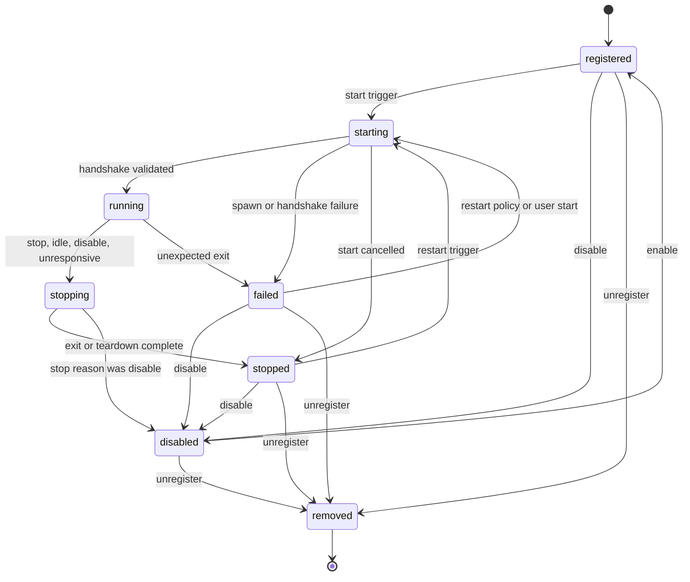
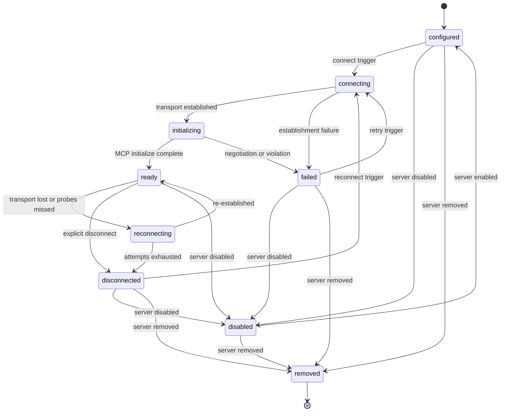
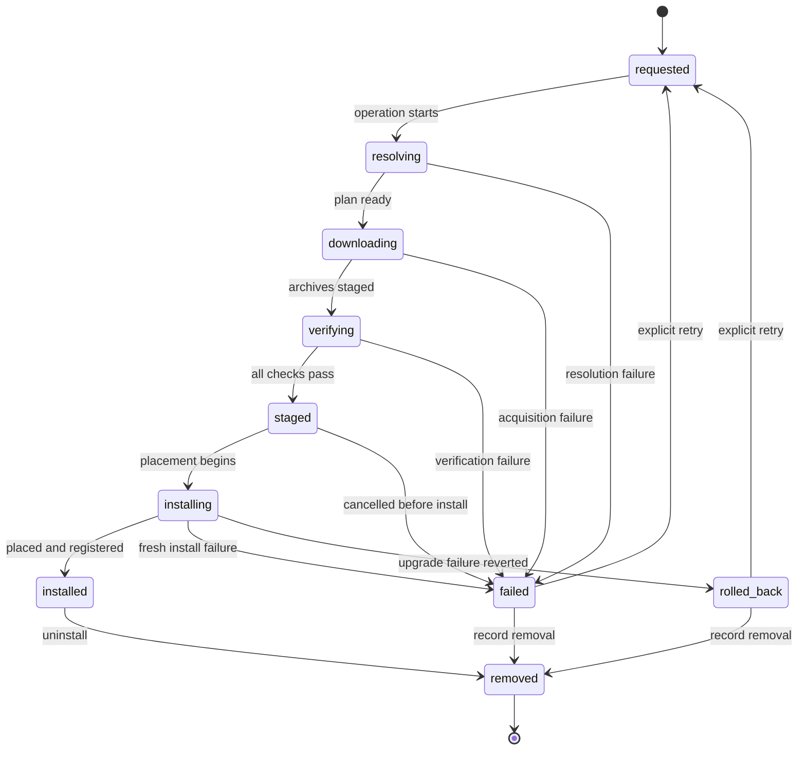

# 10 — State Machines: Plugin, MCP Client Connection, Package Installation

This chapter defines the full machines — all twelve mandatory elements of Volume 0,
chapter 02 — for the three remaining stateful entities this volume owns (the Tool Invocation
machine is [chapter 04](04-tool-invocation-state-machine.md)). State names are the frozen
enums of Volume 2, chapter 09, used exactly. Each machine is driven by exactly one component:
the Plugin Runtime, the MCP Runtime, and the Package Manager respectively; no other component
transitions these entities. Every transition persists before it is observable (Volume 2,
chapter 10 write discipline) and emits exactly one event from the owning chapter's family.

## Plugin machine

Operational policy (health probing, restart backoff, idle stop) is defined in
[chapter 08](08-plugin-runtime-and-arp.md), FR-PLUG-004; this section owns the transitions.

The diagram shows one resting entry state (`registered`), a two-phase start (`starting`
covers spawn plus handshake), the long-lived `running` state, an orderly two-phase stop
(`stopping` → `stopped`), the restartable `failed` resting state, the administrative
`disabled` state, and the single terminal tombstone `removed`. There is no `interrupted`
state: process truth is runtime truth, and startup reconciliation (below) resolves stale
running-family rows.

### Initial state

`registered` — created when a validated manifest registers the plugin (installation via
chapter 09, or direct registration of a local path). The row exists with its manifest,
trust classification, and Extension record before any process runs (INV-PLG-01).

### Terminal states

`removed` only. `stopped`, `failed`, and `disabled` are resting states (Volume 2
semantics): restartable, retryable, and re-enablable respectively.

### Transitions, events, and guards

| # | From → To | Trigger | Guard | Side effects |
|---|---|---|---|---|
| 1 | `registered` → `starting` | Start trigger: `autostart` at workspace open, first surface use, or explicit command | `plugins.enabled`; plugin enabled; `process_spawn` decision `allow`; trust policy passes (first start below threshold raises an Approval) | Sandbox prepared (plugin tier); manifest-declared credentials resolved and delivered as filtered environment (audit-logged); process spawned via `SandboxPort.ExecuteIn`; `plugin.started` on spawn success (containment level recorded) |
| 2 | `starting` → `running` | Valid `arp.initialize` response within budget | Mutual protocol version; response consistent with manifest (surfaces ⊆ declarations) | Surfaces registered atomically with their governing components; `arp.initialized` sent; `protocol_version` persisted (INV-PLG-02); `plugin.handshake.completed` |
| 3 | `starting` → `failed` | Spawn failure, handshake timeout, version refusal, protocol violation, or manifest inconsistency | Failure class recorded: E-PLUG-001/002/003/007 | Process tree torn down; `last_error` set; `plugin.handshake.failed`; restart policy schedules only transient classes (FR-PLUG-004) |
| 4 | `starting` → `stopped` | Stop request or context cancellation during start | Cancellation wins over completion | Teardown; no surfaces were registered; `plugin.stopped` (cause `user` or `shutdown`) |
| 5 | `running` → `stopping` | Stop request (user, shutdown), idle stop (`idle_stop_minutes`), disable request, removal request, or unresponsiveness escalation (3 missed `arp.ping`) | None — stop is always permitted | In-flight invocations receive cancellation (Tool Invocation machine, chapter 04); `arp.shutdown` sent with reason |
| 6 | `running` → `failed` | Unexpected process exit (crash, OS kill, clean exit outside a stop request) | Exit detected by the supervisor (PAL process notification) | In-flight invocations fail with E-PLUG-005; surfaces deregistered; `last_error`; `plugin.crashed`; restart policy applies |
| 7 | `stopping` → `stopped` | Clean exit within `plugins.stop_timeout_ms`, or sandbox teardown (kill) after it | None | Surfaces deregistered; `plugin.stopped` with cause class; a crash during `stopping` counts as stop completion (FR-PLUG-004 edge case) |
| 8 | `stopping` → `disabled` | Stop completion where the stop reason was an administrative disable | Same as 7 | As 7, plus `plugin.disabled` with actor |
| 9 | `stopped` → `starting` | Restart trigger (as 1) | As 1 | As 1 |
| 10 | `failed` → `starting` | Restart-policy attempt (backoff elapsed, attempts remaining, transient failure class) or explicit user start | Deterministic failure classes (E-PLUG-002, E-PLUG-006, manifest-inconsistency E-PLUG-003/007) never auto-restart; disable/removal pending cancels the attempt | As 1, plus `plugin.restarted` with attempt number and cause class |
| 11 | `registered`/`stopped`/`failed` → `disabled` | Administrative disable (user or policy) | None | Pending restart cancelled; `plugin.disabled` |
| 12 | `disabled` → `registered` | Enable | Manifest still validates | Event via `plugin.registered` payload marker (re-enable); restart requires a normal start trigger |
| 13 | `registered`/`stopped`/`failed`/`disabled` → `removed` | Unregistration or package removal (chapter 09) | Process confirmed terminated (INV-PLG-04); a `running` plugin passes through 5–7 first | Tools disabled (INV-PLG-04); Extension tombstoned; `plugin.removed` |

### Side effects

Registration and deregistration of surfaces are atomic with transitions 2, 6, and 7: between
a dead process and a completed new handshake, the plugin's surfaces do not exist, and
invocations in that gap fail with E-PLUG-005 semantics rather than queue (FR-PLUG-004).
Credential deliveries, permission decisions, and every disable/remove action append Audit
Records.

### Persistence

The Plugin row (`plugins` table, per scope) persists `state`, `protocol_version`,
`last_started_at`, and `last_error` at every transition, with `revision` optimistic
concurrency. Restart counters and probe state are supervisor runtime state, summarized into
diagnostics — not persisted as truth (INV-PLG-03).

### Recovery

On startup, rows found in `starting`, `running`, or `stopping` are reconciled to `stopped`
before any restart policy applies (INV-PLG-03); reconciliation persists and emits
`plugin.stopped` with cause `shutdown`. Autostart plugins then start through transition 1
with fresh containment — no state carries over from the dead process.

### Timeouts

Handshake: `plugins.handshake_timeout_ms` (default 10000) bounds transition 2/3. Stop:
`plugins.stop_timeout_ms` (default 5000) bounds `stopping` before kill escalation. Health:
`plugins.health_interval_ms` (default 30000) probes with a fixed 5000 ms per-ping budget;
three consecutive misses trigger transition 5. Idle: `idle_stop_minutes` (manifest, per-plugin
override) triggers transition 5 with cause `idle`. All timers are monotonic.

### Cancellation

Context cancellation during `starting` takes transition 4; during `running` it is a stop
request (transition 5). A stop or disable request during a restart backoff cancels the
pending attempt (guard of transition 10). Cancellation is always honored: no transition
blocks awaiting a hung plugin beyond its teardown budget.

### Retries

The only automatic retry is the restart policy (FR-PLUG-004): exponential backoff from
`plugins.restart_backoff_initial_ms` (default 500), doubling, capped at 30000 ms, at most
`plugins.restart_max_attempts` (default 5) per 10-minute window, counters reset after 10
minutes of stable `running`. ARP requests are never retried automatically; invocation-level
retries belong to the Tool Invocation machine under ADR-072.

### Errors

E-PLUG-001 (transition 3, spawn class; transition 10 respawn failure), E-PLUG-002
(transition 3, deterministic), E-PLUG-003 (transition 3 and post-handshake violations
feeding transition 5/6), E-PLUG-004 (probe/request timeouts feeding transition 5), E-PLUG-005
(transition 6 and the surface-gap semantics), E-PLUG-006/E-PLUG-007 (registration-time and
handshake-consistency failures). Permission and sandbox refusals surface as E-SEC through
E-PLUG-001's cause chain.

### FR-PLUG-008 — Plugin lifecycle machine conformance

- Type: Functional
- Status: Draft
- Priority: P0
- Phase: Beta
- Source: Design
- Owner: Plugin Runtime (Volume 6)
- Affected components: Plugin Runtime, Task Scheduler, Sandbox Engine, Persistence Layer
- Dependencies: FR-PLUG-001, FR-PLUG-004; INV-PLG-01..04
- Related risks: RISK-PLUG-001, RISK-PLUG-002

#### Description

The Plugin Runtime MUST implement the Plugin machine exactly as specified: only the
transitions of the table, with their triggers, guards, and side effects; persistence before
observability at every transition; startup reconciliation per the recovery rules; the
timeout, cancellation, and retry semantics above; and exactly one `plugin.*` event per
transition. Any observed transition outside the table is a defect.

#### Motivation

The machine is the contract that supervision, diagnostics, records, and the TUI all read;
divergence between specified and implemented transitions makes plugin failures undiagnosable
and restart behavior untrustworthy.

#### Actors

Plugin Runtime supervisors; conformance and chaos test suites; consumers of `plugin.*`
events and diagnostics.

#### Preconditions

Registered plugins with fixture manifests; controllable fixture plugin processes.

#### Main flow

1. The runtime drives every lifecycle operation through the table's transitions.
2. Each transition persists, emits its event, and updates diagnostics.

#### Alternative flows

- Recovery flow: startup reconciliation transitions stale rows per the recovery rules before
  normal operation resumes.

#### Edge cases

- Simultaneous stop request and crash: the first persisted transition wins; the loser is
  recorded as a no-op with the observed order in logs.
- Disable arriving during `starting`: start is cancelled (transition 4), then transition 11.
- Removal request for a `running` plugin chains 5 → 7 → 13 and only then tombstones.

#### Inputs

Lifecycle triggers, process exit notifications, probe results, configuration.

#### Outputs

Persisted state transitions, `plugin.*` events, diagnostics, audit records.

#### States

The complete frozen Plugin enum; this requirement governs the machine itself.

#### Errors

The machine's error mapping above; conformance failures are defects, not runtime errors.

#### Constraints

Single driver (Plugin Runtime); one supervisor per plugin; monotonic timers; persistence
before observability.

#### Security

Guards on transitions 1/9/10 are the permission and trust enforcement points for plugin
execution; conformance testing MUST include attempts to start plugins bypassing them
(expected: no path exists).

#### Observability

Exactly one event per transition with plugin ULID and correlation IDs; restart counters and
last-error visible in diagnostics.

#### Performance

Transition overhead is bounded by its persistence write; budgets per Volume 12.

#### Compatibility

State names frozen (Volume 2); transitions extend only through the change procedure with a
Volume 2 amendment where states would change.

#### Acceptance criteria

- Given the full transition matrix, when property tests drive every legal trigger in every
  state, then only table transitions occur and each persists exactly once with exactly one
  event.
- Given crash injection at every transition boundary, when the process restarts, then
  reconciliation yields `stopped` for running-family rows and no surface registration
  survives from the dead process.
- Negative case: given a trigger illegal in the current state (e.g., enable while
  `running`), when delivered, then the state is unchanged and the rejection is logged.
- Permission case: given a start trigger without `process_spawn`, when evaluated, then the
  row remains in its prior state with the denial recorded (no `starting` entry).
- Observability case: chaos runs (kill, hang, crash-loop) produce event sequences that
  reconstruct the exact transition history.

#### Verification method

Transition-matrix property tests; chaos suite (kill, hang, garbage, crash-loop,
clean-exit-loop); crash-injection recovery tests; audit/event-sequence reconstruction
tests (SM-13 pattern).

#### Traceability

FR-PLUG-001, FR-PLUG-004; INV-PLG-01..04; Volume 2 chapter 09; chapter 08 events and
errors.

## MCP Client Connection machine

Connection policy (timeouts, probes, reconnection budgets) is defined in
[chapter 05](05-mcp-client-and-runtime.md); this section owns the transitions. Per
INV-MCPC-02, one row per server is live per process; within a process the row transitions —
across processes, recovery rests the old row and the next connection mints a new one.

The diagram shows the connect pipeline (`configured` → `connecting` → `initializing` →
`ready`), the automatic-recovery loop (`ready` ↔ `reconnecting`, giving up into
`disconnected`), the manual-retry resting states (`disconnected`, `failed`), administrative
`disabled`, and the terminal tombstone `removed`. Disable/remove arrows from `connecting`,
`initializing`, and `reconnecting` are omitted from the drawing for legibility but exist
(transitions 12–13): an in-progress connection attempt is aborted first, then the
administrative transition applies.

### Initial state

`configured` — the registration is enabled and validated; no connection attempted in this
process. New rows are also minted `configured` when a process starts and a connection is
first needed (INV-MCPC-02 history rule).

### Terminal states

`removed` only. `disconnected`, `failed`, and `disabled` are resting (Volume 2).

### Transitions, events, and guards

| # | From → To | Trigger | Guard | Side effects |
|---|---|---|---|---|
| 1 | `configured` → `connecting` | First use, explicit connect command, or discovery command | Server `enabled`; registration valid (E-MCP-007 otherwise, no transition); for stdio: `process_spawn` decision; for non-loopback HTTP: `network` decision for the domain; credential reference resolvable when declared | stdio: sandbox prepare + spawn (MCP-server tier); HTTP: session establishment with TLS; credential applied per FR-MCP-004 |
| 2 | `connecting` → `initializing` | Transport established within `connect_timeout_ms` | None | MCP initialize request sent |
| 3 | `connecting` → `failed` | Establishment failure or timeout; authorization failure; permission/sandbox refusal | Failure class recorded: E-MCP-001 (phase `connecting`), E-MCP-005, E-SEC surfaced | Transport torn down (stdio process tree killed); `last_error`; `mcp.connection.failed` |
| 4 | `initializing` → `ready` | MCP initialize completes within `initialize_timeout_ms` | Negotiated revision within the SDK-supported set | `protocol_version` and `negotiated_capabilities` persisted; `connected_at`; `mcp.connection.established`; discovery scheduled (FR-MCP-003) |
| 5 | `initializing` → `failed` | Negotiation failure, initialize timeout, or protocol violation | E-MCP-002 / E-MCP-001 (phase `initializing`) / E-MCP-006 | As 3 |
| 6 | `ready` → `reconnecting` | Transport loss, or 3 consecutive health-probe failures (FR-MCP-005) | Automatic reconnection enabled (`reconnect_max_attempts` > 0) | Bridged surfaces disabled (INV-MCPS-04 semantics); in-flight requests fail with E-MCP-003/E-MCP-004; `mcp.connection.lost` |
| 7 | `reconnecting` → `ready` | Re-establishment + re-initialization succeed within the backoff schedule | Re-discovery runs with drift checks (E-MCP-008 policy) before surfaces re-enable | Surfaces re-enabled post-drift-check; `stats.reconnects` incremented; `mcp.connection.established` |
| 8 | `reconnecting` → `disconnected` | `reconnect_max_attempts` exhausted | None | `disconnected_at`; surfaces remain disabled; `mcp.connection.failed` (exhaustion class) |
| 9 | `ready` → `disconnected` | Explicit disconnect, orderly shutdown, or configuration change requiring reconnect | None | Transport closed; stdio tree terminated via teardown; surfaces disabled; `disconnected_at` |
| 10 | `disconnected` → `connecting` | Explicit reconnect or next use | As 1 | As 1 |
| 11 | `failed` → `connecting` | Explicit retry, or registration re-validated after a configuration fix | As 1 | As 1 |
| 12 | any non-terminal → `disabled` | Server disabled (INV-MCPS-04) | In-progress attempts aborted first | Transport terminated; surfaces disabled; approval state retained (chapter 06); `mcp.server.updated` |
| 13 | `disabled` → `configured` | Server enabled | Registration still valid | None beyond the event |
| 14 | any → `removed` | Server registration removed (INV-MCPS-04); packaged server uninstalled (chapter 09) | Transport confirmed terminated | Tools disabled with provenance retained; MCP Server row and Extension tombstoned; `mcp.server.removed` |

### Side effects

Bridged-surface enablement tracks the machine exactly: tools, resources, and prompts from a
server exist for agents only while its connection is `ready` (INV-MCPC-03); every departure
from `ready` disables them atomically with the transition, and every return re-runs drift
checks before re-exposure (chapter 06).

### Persistence

The connection row (`mcp_connections`, workspace database) persists `state`,
`protocol_version`, `negotiated_capabilities`, timestamps, `last_error`, and `stats` at
every transition with `revision` concurrency. Probe counters and backoff timers are runtime
state summarized into `stats`.

### Recovery

On startup, rows found in `connecting`, `initializing`, `ready`, or `reconnecting` are
reconciled to `disconnected` (INV-MCPC-04), persisting and emitting `mcp.connection.lost`
with cause `shutdown`. Connections are then re-established lazily on next use through new
rows (INV-MCPC-02), never eagerly at startup.

### Timeouts

`connect_timeout_ms` (default 10000) bounds transition 2/3; `initialize_timeout_ms`
(default 10000) bounds 4/5; `request_timeout_ms` (default 60000) bounds in-`ready` requests
(E-MCP-003, no transition by itself); the health probe (60 s interval, probe budget =
`request_timeout_ms`, 3 consecutive failures) feeds transition 6. Reconnection backoff:
initial `reconnect_backoff_initial_ms` (default 1000), doubling, capped at 30000 ms, at most
`reconnect_max_attempts` (default 5).

### Cancellation

Context cancellation aborts in-flight requests immediately (FR-ARCH-004) without a machine
transition; cancellation of a connection attempt (user interrupt during 1–4) takes the
`failed` transition with the cancellation cause. Teardown paths (9, 12, 14) always terminate
stdio process trees through sandbox teardown.

### Retries

Automatic retry exists only as the reconnection loop (6–8) and only after a connection
previously reached `ready` in this process; initial connection failures rest in `failed` for
explicit retry (matching E-MCP-001's retry policy). Individual requests are never retried
automatically except idempotent discovery listings, retried once (FR-MCP-003).

### Errors

E-MCP-001 (transitions 3, 5 by phase), E-MCP-002 (5), E-MCP-003 (request timeouts; probe
failures feeding 6), E-MCP-004 (requests routed outside `ready` — INV-MCPC-03 enforcement,
no transition), E-MCP-005 (3, authorization class), E-MCP-006 (5 and in-`ready` violations
feeding 6 when framing is corrupted), E-MCP-007 (guard of 1, no transition), E-MCP-008
(drift policy during 7 and discovery — suspends exposure, no connection transition).

### FR-MCP-008 — MCP Client Connection machine conformance

- Type: Functional
- Status: Draft
- Priority: P0
- Phase: Beta
- Source: Design
- Owner: MCP Runtime (Volume 6)
- Affected components: MCP Runtime, Sandbox Engine, Persistence Layer, Tool Runtime (bridge enablement)
- Dependencies: FR-MCP-001, FR-MCP-002, FR-MCP-005; INV-MCPC-01..04
- Related risks: RISK-MCP-001, RISK-MCP-002

#### Description

The MCP Runtime MUST implement the MCP Client Connection machine exactly as specified: only
the table's transitions with their triggers, guards, and side effects; bridged-surface
enablement atomic with every entry to and departure from `ready`; persistence before
observability; startup reconciliation to `disconnected` with new-row minting per
INV-MCPC-02; and the timeout, cancellation, and retry semantics above, with exactly one
`mcp.*` event per transition.

#### Motivation

The connection machine is what makes third-party server failures predictable: routing
correctness (INV-MCPC-03), reconnection behavior, and drift-gated re-exposure all hang off
its transitions being exactly as written.

#### Actors

MCP Runtime; conformance and fault-injection suites; consumers of `mcp.*` events.

#### Preconditions

Registered fixture servers for both transports; controllable failure injection.

#### Main flow

1. All connection operations flow through the table's transitions.
2. Surface enablement tracks `ready` atomically; events and persistence accompany every
   transition.

#### Alternative flows

- Recovery flow: startup reconciliation rests stale rows and next use mints a new row.

#### Edge cases

- Transport loss during `initializing` is transition 5 (establishment never completed), not
  6.
- A disable arriving during `reconnecting` aborts the backoff loop and takes transition 12.
- Probe failures below the threshold cause no transition and are visible only in `stats`.

#### Inputs

Connect/disconnect triggers, transport events, probe results, configuration changes,
administrative actions.

#### Outputs

Persisted transitions, `mcp.*` events, surface enablement changes, diagnostics.

#### States

The complete frozen MCP Client Connection enum.

#### Errors

The machine's error mapping above.

#### Constraints

Single driver (MCP Runtime); one live row per server per process (INV-MCPC-02); no request
routing outside `ready` (INV-MCPC-03).

#### Security

Guards of transition 1 are the permission enforcement points for MCP transports; drift
checks gate every re-exposure (transition 7); conformance tests MUST attempt routing in
every non-`ready` state (expected: E-MCP-004, no traffic).

#### Observability

One event per transition with connection ULID and server name; reconnect and probe counters
in `stats`.

#### Performance

Transition overhead bounded by persistence; reconnection cadence per the backoff schedule;
budgets per Volume 12.

#### Compatibility

State names frozen; transport-specific behavior differences (stdio teardown versus HTTP
session close) live inside side effects, never as extra states.

#### Acceptance criteria

- Given the transition matrix, when property tests drive every legal trigger in every
  state, then only table transitions occur, each persisted once with one event.
- Given a fixture server killed while `ready`, when the loss is detected, then surfaces
  disable atomically with the `reconnecting` transition and requests fail with E-MCP-004
  until `ready` returns.
- Given reconnection succeeding after a descriptor change on the server, when re-discovery
  runs, then changed tools stay suspended per E-MCP-008 policy while unchanged tools
  re-enable.
- Negative case: a request routed in `disconnected` returns E-MCP-004 and causes no
  transition and no transport traffic.
- Permission case: a stdio connect without `process_spawn` records the denial and the row
  moves `connecting` → `failed` with the E-SEC cause (per transition 3), never reaching the
  spawn.
- Observability case: crash-recovery runs show reconciliation events and fresh-row minting
  exactly as specified.

#### Verification method

Transition-matrix property tests; fault injection at each phase (hang, kill, garbage,
TLS failure); reconnection and drift-gating integration tests; crash-injection recovery
tests; routing-refusal probes in every non-`ready` state.

#### Traceability

FR-MCP-001/002/005/006; INV-MCPC-01..04, INV-MCPS-04; chapter 05 timeout table; chapter 06
drift policy.

## Package installation machine

Operation semantics are [chapter 09](09-package-manager-supply-chain.md)'s (FR-PLUG-005 –
FR-PLUG-007); this section owns the transitions. One machine instance exists per Package row
per operation attempt; mutating operations on one package serialize.

The diagram shows the linear acquisition pipeline (`requested` → `resolving` →
`downloading` → `verifying` → `staged` → `installing` → `installed`), failure edges from
every pipeline state into the resting `failed` state, the upgrade-specific `rolled_back`
resting state, retry re-entry into `requested`, and the terminal tombstone `removed`.
`installed` is the resting success state a package occupies for its useful life.

### Initial state

`requested` — an installation (or update) operation was accepted: the permission decision
exists and the row is created (or re-entered on retry) with its source request recorded.

### Terminal states

`removed` only. `installed`, `failed`, and `rolled_back` are resting (Volume 2 semantics).

### Transitions, events, and guards

| # | From → To | Trigger | Guard | Side effects |
|---|---|---|---|---|
| 1 | `requested` → `resolving` | Operation execution starts | `package_installation` decision recorded; no concurrent mutating operation on this package | `package.installation.started` |
| 2 | `resolving` → `downloading` | Resolution plan available (produced now per ADR-083, or a pre-produced plan validated as current) | Plan complete: versions, sources, checksums, signature references | Plan persisted with the row |
| 3 | `resolving` → `failed` | Resolution failure | E-PLUG-008 (all sources unusable) or E-PLUG-009 | `last_error`; `package.installation.failed` |
| 4 | `downloading` → `verifying` | Every plan archive acquired into the staging area | Byte counts match index-declared sizes where declared | Staging populated; for `path` sources this step copies locally |
| 5 | `downloading` → `failed` | Acquisition failure after the single automatic re-attempt (E-PLUG-010) | None | Staging cleaned; `package.installation.failed` |
| 6 | `verifying` → `staged` | Checksum, signature policy, and content verification all pass (FR-PLUG-007 order) | `signature_state` ≠ `invalid`; `unverified` passed policy (Approval where interactive) | Verification verdicts persisted (`checksum`, `signature_state`) |
| 7 | `verifying` → `failed` | Any verification failure (E-PLUG-011) | None | Staging cleaned; `package.verification.failed` and `package.installation.failed` |
| 8 | `staged` → `installing` | Placement begins | Conflict checks pass (INV-PKG-04 coexistence; file-collision check — E-PLUG-012 otherwise, → `failed`) | For upgrades: prior version's `files_manifest` journaled for rollback |
| 9 | `staged` → `failed` | Cancellation or conflict before placement | E-PLUG-013 / E-PLUG-012 | Staging cleaned; `package.installation.failed` |
| 10 | `installing` → `installed` | Files placed, `files_manifest` recorded (INV-PKG-03), delivered extensions registered and validated | Every registration succeeded (skill per FR-SKILL-001, plugin per FR-PLUG-001, MCP registration per chapter 05) | `installed_at`; prior version superseded per kind rules (chapter 09); `package.installation.completed` |
| 11 | `installing` → `failed` | Fresh-install failure (placement error, registration failure) | Not an upgrade (no prior good state) | All placed files reverted via the partial manifest; nothing registered remains; `package.installation.failed` |
| 12 | `installing` → `rolled_back` | Upgrade failure (placement or registration) | Prior good state exists | Prior version restored from its journaled manifest; prior extensions re-verified as registered; `package.rollback.completed` |
| 13 | `installed` → `removed` | Uninstall (chapter 09 `Remove`) | Dependents check passes or cascade forced (E-PLUG-012 otherwise); delivered plugin processes confirmed terminated (INV-PLG-04) | Extensions deregistered (INV-EXT-03); exactly `files_manifest` files deleted; tombstone; `package.removal.completed` |
| 14 | `failed` → `requested` | Explicit retry of the operation | Fresh permission decision (grants may have expired) | Row re-enters with a new attempt record; prior `last_error` retained in history |
| 15 | `rolled_back` → `requested` | Explicit retry of the upgrade | As 14 | As 14 |
| 16 | `failed`/`rolled_back` → `removed` | Record removal (user cleanup or delivering-source removal) | Nothing active to deregister (guaranteed by the failure invariants) | Tombstone; `package.removal.completed` |

### Side effects

The failure invariant is global: in every state except `installed`, no delivered content is
registered or executable (INV-PKG-01 guarantee); `failed` and `rolled_back` always mean
"nothing partially active". Every verification verdict, permission decision, and
placement/removal action appends Audit Records; the resolution plan and `files_manifest`
persist with the row as the operation's evidence.

### Persistence

The Package row (`packages` table, per scope) persists `state`, plan, verification verdicts,
`files_manifest`, `installed_at`, and `last_error` at every transition with `revision`
concurrency. Staging areas live under the scope's Andromeda state directory (ADR-022) and
are not part of row state.

### Recovery

On startup, rows found in pipeline states are reconciled: `requested`, `resolving`,
`downloading`, `verifying`, `staged` → `failed` with E-PLUG-013 (recovery marker) and
staging cleaned; `installing` → `failed` (fresh install; placed files reverted via the
partial manifest) or `rolled_back` (upgrade; prior version restored from the journal).
Reconciliation persists, emits the corresponding events, and never leaves partially active
content — the recovery paths are exactly transitions 11/12 with the recovery cause recorded.

### Timeouts

Acquisition is bounded per source by the source entry's `timeout_ms` (default 300000) per
fetch (transition 5 on expiry after the re-attempt). Resolution, verification, and placement
have no wall-clock timeout of their own: they are CPU/disk-bound, cancellable steps bounded
by context cancellation; hashing progress is reported through `InstallEvent` so stalls are
visible.

### Cancellation

Cancellation (user interrupt or context) in `requested`–`staged` takes the nearest failure
transition with E-PLUG-013 and cleanup. During `installing`, cancellation is honored at the
next safe boundary: a fresh install reverts (transition 11), an upgrade rolls back
(transition 12) — never a torn placement. During `removed`-bound removal, deletion completes
(removal is not resumable half-done; the manifest bounds the work).

### Retries

No automatic retries except the single in-operation re-attempt per archive (transition 5
guard). Operation-level retry is explicit (transitions 14/15) and re-enters the full
pipeline — including fresh verification — using the recorded plan for identity but never
skipping checks.

### Errors

E-PLUG-008/009 (transition 3), E-PLUG-010 (5), E-PLUG-011 (7), E-PLUG-012 (guards of 8/13 →
9 or refusal), E-PLUG-013 (cancellation and recovery classes on 9/11/12 and reconciliation);
registration-step failures surface the delivered kind's own codes (E-SKILL-001 class,
E-PLUG-006) as causes inside 11/12. E-SEC denials at transition 1 prevent machine entry
(no instance is created for a denied operation).

### FR-PLUG-009 — Package installation machine conformance

- Type: Functional
- Status: Draft
- Priority: P0
- Phase: Beta
- Source: Design
- Owner: Package Manager (Volume 6)
- Affected components: Package Manager, Persistence Layer, Skill Engine, Plugin Runtime, MCP Runtime
- Dependencies: FR-PLUG-005, FR-PLUG-006, FR-PLUG-007; INV-PKG-01..04
- Related risks: RISK-PLUG-003

#### Description

The Package Manager MUST implement the Package installation machine exactly as specified:
only the table's transitions with their triggers, guards, and side effects; the global
failure invariant (nothing partially active outside `installed`); persistence before
observability; startup reconciliation per the recovery rules including rollback of
interrupted upgrades; and the timeout, cancellation, and retry semantics above, with the
chapter 09 events emitted exactly as mapped.

#### Motivation

Supply-chain guarantees are exactly as strong as this machine's invariants under failure:
verification-before-activation and clean rollback must hold at every crash point, not just
on happy paths.

#### Actors

Package Manager; conformance and crash-injection suites; consumers of `package.*` events
and provenance records.

#### Preconditions

Fixture sources, archives, and plans covering all kinds and both fresh installs and
upgrades.

#### Main flow

1. Operations drive the machine through the table only.
2. Every transition persists, emits its event, and maintains the failure invariant.

#### Alternative flows

- Recovery flow: startup reconciliation applies transitions 11/12-equivalents and staging
  cleanup before any new operation runs.

#### Edge cases

- Crash between placement completion and registration completion (inside `installing`):
  recovery treats the attempt as failed/rolled-back — registration is part of the atom.
- Retry after `rolled_back` re-runs verification even though the archive was previously
  verified (checks are never skipped, transition 15).
- Bundle members fail atomically: one member's registration failure fails the whole bundle
  installation.

#### Inputs

Operation requests, plans, archives, permission decisions, crash/cancellation signals.

#### Outputs

Persisted transitions, `package.*` events, manifests, tombstones, audit records.

#### States

The complete frozen Package installation enum.

#### Errors

The machine's error mapping above.

#### Constraints

Single driver (Package Manager); serialized mutations per package; staging cleanup on every
failure path; plans immutable once execution starts.

#### Security

Guards of transitions 1 and 6 are the permission and supply-chain enforcement points;
conformance tests MUST attempt content activation from every pre-`installed` state
(expected: impossible — nothing is registered or executable).

#### Observability

One event per transition; the audit chain decision → plan → verification → placement →
registration reconstructs every attempt offline.

#### Performance

Transition overhead bounded by persistence and hashing; budgets per NFR-PLUG-003.

#### Compatibility

State names frozen; kind-specific registration differences live inside transition 10's side
effects, never as extra states.

#### Acceptance criteria

- Given the transition matrix, when property tests drive every legal trigger in every
  state, then only table transitions occur, each persisted once with its mapped event.
- Given crash injection at every state boundary of a fresh install, when recovery runs,
  then the row is `failed`, staging is empty, no files outside staging exist, and nothing
  is registered.
- Given crash injection during an upgrade's `installing`, when recovery runs, then the row
  is `rolled_back`, the prior version passes `Verify`, and its extensions remain
  registered.
- Negative case: an attempt to register delivered content from a `staged` package (bypass
  attempt) finds no path — registration APIs require an `installing` context handle.
- Permission case: a denied `package_installation` decision creates no machine instance and
  no row mutation, with the denial recorded.
- Observability case: for any attempt, the event sequence plus persisted row reconstruct
  the full transition history including recovery actions.

#### Verification method

Transition-matrix property tests; crash injection at every boundary (fresh and upgrade
paths); cancellation tests at each state; bundle-atomicity tests; audit-chain
reconstruction; staging-cleanup assertions after every failure class.

#### Traceability

FR-PLUG-005/006/007; INV-PKG-01..04, INV-EXT-03, INV-PLG-04; chapter 09 events and errors;
Volume 2 chapter 09.
