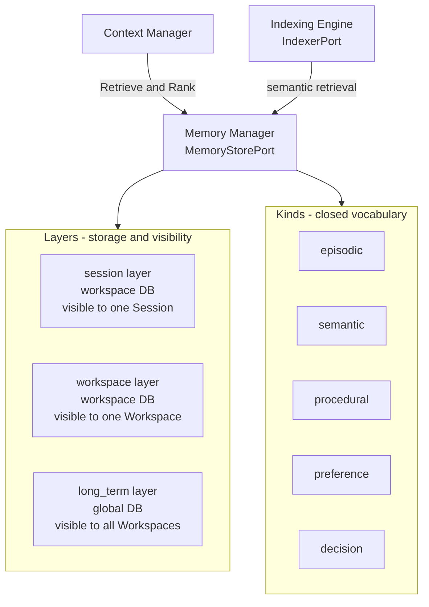

# 01 — Memory Model

This chapter defines Andromeda's memory model: what the Memory Manager remembers, in which
layers and kinds, with what provenance and trust, and under which privacy constraints. The
entity shapes are frozen in Volume 2 (chapter 07: Memory Record, with the `layer` values
`session` | `workspace` | `long_term` and the recorded status vocabulary `active`, `archived`,
`expired`, `deleted`); this chapter mints the behavioral requirements over those shapes and the
closed **memory kind** vocabulary. Lifecycle mechanics (ingestion through deletion and export)
are chapter [02](02-memory-lifecycle.md); how memory reaches model requests is chapter
[03](03-context-manager.md); semantic retrieval structures are chapters
[04](04-indexing-engine.md) and [05](05-index-state-machine.md).

The Memory Manager implements **MemoryStorePort** (`Ingest`, `Retrieve`, `Rank`, `Expire`,
`Delete`, `Export` — names frozen by FR-ARCH-003). Its component boundary, allowed
dependencies, and phase are fixed in Volume 3, chapter 03. Storage follows ADR-028: `session`
and `workspace` layers persist in the workspace database (`.andromeda/state.db`); the
`long_term` layer persists in the global database.

## Two-axis taxonomy

ADR-085 fixes the taxonomy as two orthogonal axes:

- **Layer** — where a record lives and who can see it: `session`, `workspace`, `long_term`
  (attribute values frozen by Volume 2). The layer decides storage home (ADR-028), visibility
  scope, and default retention (chapter 02).
- **Kind** — what a record *is*. Closed vocabulary, minted here per Volume 2's delegation:

| Kind | Meaning | Typical layer |
|---|---|---|
| `episodic` | A dated occurrence: what happened in a run, an outcome, an observation tied to a moment | `session`, `workspace` |
| `semantic` | Durable knowledge independent of when it was learned: facts about the codebase, APIs, conventions | `workspace`, `long_term` |
| `procedural` | How to do something in this environment: build commands, test invocations, deployment steps | `workspace` |
| `preference` | A user preference: style, tone, tool choices, workflow habits | `long_term`, `workspace` |
| `decision` | A recorded decision with rationale: choices made in or about the work, and why | `workspace` |

The kind vocabulary is closed: new kinds require a Volume 7 amendment through the Volume 0
change procedure. The product concepts mandated for this volume map onto the axes as follows —
**Session Memory** = the `session` layer; **Workspace Memory** = the `workspace` layer;
**Long-Term Memory** = the `long_term` layer; **Episodic Memory** = kind `episodic`;
**Semantic Memory** = kind `semantic`; **User Preferences** = kind `preference`; **Project
Knowledge** = kind `semantic` at the `workspace` layer; **Decision Memory** = kind `decision`.
No memory concept exists outside this grid, and no concept has two names (Volume 0 glossary
discipline).

The diagram shows the two axes and the consumers: the Memory Manager owns records classified
by layer (which fixes the database per ADR-028 and the visibility boundary) and kind (which
fixes the structured projection and retention defaults). The Context Manager retrieves and
re-ranks memory through MemoryStorePort only; semantic similarity retrieval is delegated to
the Indexing Engine through IndexerPort (the Memory Manager never calls ProviderPort — Volume
3 prohibited-dependency rule). Constraints: every record sits in exactly one layer and has
exactly one kind; layer/scope attribute consistency is INV-MEM-01 (Volume 2); cross-layer
promotion is an explicit lifecycle operation (chapter 02), never an implicit copy.

## Visibility and isolation rules

1. A `session`-layer record is retrievable only for its owning Session.
2. A `workspace`-layer record is retrievable only within its owning Workspace.
3. A `long_term` record is retrievable from any workspace on the machine, subject to the
   retrieval filters of FR-MEM-001.
4. Memory MUST NOT leak across workspaces except through the `long_term` layer or explicit
   export/import by the user; cross-workspace isolation is verified by Volume 13's
   cross-layer isolation tests.

## Requirements

### FR-MEM-001 — Memory model

- Type: Functional
- Status: Draft
- Priority: P0
- Phase: MVP
- Source: Provided
- Owner: Memory Manager (Volume 7)
- Affected components: Memory Manager, Persistence Layer, Context Manager, Indexing Engine, CLI, TUI
- Dependencies: ADR-028, ADR-085, ADR-027; Volume 2 chapter 07 (Memory Record); FR-ARCH-003 (MemoryStorePort freeze)
- Related risks: RISK-MEM-001, RISK-MEM-002

#### Description

Andromeda MUST provide persistent memory organized on the two-axis taxonomy of this chapter:
layers `session`, `workspace`, `long_term` and kinds `episodic`, `semantic`, `procedural`,
`preference`, `decision`. The Memory Manager MUST implement MemoryStorePort with exactly the
frozen method set: `Ingest` (batch, transactional, provenance-stamped), `Retrieve` (filtered
by layer, kind, workspace/session scope, provenance, time range, status, and content match),
`Rank` (re-scoring of an explicit candidate set), `Expire` (retention pass), `Delete` (purge),
and `Export` (streaming canonical JSON). Retrieval MUST return only records with status
`active` (plus `archived` when the query explicitly opts in) and MUST honor the visibility
rules of this chapter. Ranking MUST combine, with configurable weights: relevance (lexical
match score or semantic similarity via IndexerPort), recency (exponential decay on
`created_at` and `last_accessed_at`), importance (the record's `importance` hint), and trust
(FR-MEM-002 ordering). Every retrieval that surfaces a record MUST update
`last_accessed_at`.

#### Motivation

Agents that forget everything between turns re-derive project knowledge at token cost and
repeat mistakes; agents that remember without structure accumulate unattributable beliefs.
The layered model bounds visibility (privacy precedence, Volume 0 chapter 01), and the kind
vocabulary makes retention, projection, and conflict rules definable per class of memory
instead of per record.

#### Actors

Agent Engine (retrieval during runs, proposed ingestion), Context Manager (retrieval and
re-ranking), user (memory commands in CLI/TUI per Volume 8), retention scheduler (background
`Expire` passes).

#### Preconditions

Workspace open (for `session`/`workspace` layers); global database available (for
`long_term`); memory enabled (`memory.enabled`, chapter 02 configuration).

#### Main flow

1. A caller invokes `Retrieve` with a `MemoryQuery` naming layers, kinds, scope, and an
   optional content query.
2. The Memory Manager resolves the storage homes per ADR-028, applies visibility rules, and
   evaluates the content match — lexically against record content, or semantically through
   IndexerPort when a memory semantic index is `ready` (chapter 04).
3. Matching records are scored (relevance, recency, importance, trust), ordered, and
   returned with full provenance attributes; `last_accessed_at` updates are batched in the
   same transaction scope.
4. The Context Manager MAY call `Rank` to re-score a working set for a specific turn intent
   without re-querying.

#### Alternative flows

- No semantic index available (not configured, `failed`, or offline remote provider):
  content matching degrades to lexical only; results carry a degradation marker and the
  assembly records it (FR-CTX-004).
- Query names a layer whose database is unavailable (e.g., global DB locked): available
  layers are served; the response reports the omitted layer with E-MEM-003 detail rather
  than failing entirely.

#### Edge cases

- Empty stores return empty results, not errors.
- A record whose `session_id` refers to an `ended` session remains retrievable within its
  layer rules (history is readable; sessions are never a retrieval hole).
- Records with equal scores order deterministically by ULID ascending, so identical queries
  return identical orderings (SM-12 replay support).
- `Retrieve` with `status` filter `deleted` returns tombstone metadata only — never content
  (content is erased at purge, chapter 02).

#### Inputs

`MemoryQuery` (layers, kinds, scope ULIDs, time range, status filter, content query, limit),
`MemoryRecordDraft` batches for `Ingest` (chapter 02), ranking weight configuration.

#### Outputs

Ordered `MemoryRecord` sets with provenance; `RankedMemory` scores; updated access
timestamps; `memory.*` events (chapter 02 catalog).

#### States

Memory Record recorded status vocabulary (`active`, `archived`, `expired`, `deleted` —
frozen, Volume 2 chapter 09). No state machine: transitions are lifecycle operations
(chapter 02), not a governed machine.

#### Errors

E-MEM-001 (validation), E-MEM-003 (store unavailable), E-MEM-004 (record not found); family
catalog in chapter 02.

#### Constraints

Layer/scope consistency per INV-MEM-01; provenance per INV-MEM-02 and FR-MEM-002; content
immutability per INV-MEM-05 (corrections supersede, chapter 02); retrieval MUST NOT bypass
status filters; the Memory Manager MUST NOT call ProviderPort (Volume 3 dependency matrix).

#### Security

Redaction gate per FR-MEM-003 precedes every persistence path. Retrieval respects layer
visibility — a compromised or misbehaving run in one workspace cannot read another
workspace's memory through this port. Memory content never appears in logs or events; events
carry ULIDs and counts only (Volume 10 redaction rules).

#### Observability

Events per chapter 02; layer size and record count metrics via TelemetryPort; every
retrieval that feeds a model request is attributable through Context Item rows (Volume 2)
sharing correlation IDs (PRD-006).

#### Performance

Retrieval latency budgets are minted by Volume 12 (memory retrieval row of its target
catalog); this requirement fixes behavior, not numbers. Ranking cost is bounded by the query
`limit` and the ADR-020 scale assumption for semantic scoring.

#### Compatibility

Identical behavior on all Tier 1 platforms; storage via the Persistence Layer only (ADR-007,
ADR-028). Export format compatibility per FR-MEM-009.

#### Acceptance criteria

- Given records in all three layers, when `Retrieve` runs scoped to one workspace, then only
  that workspace's `session`/`workspace` records and `long_term` records return, and no
  record from any other workspace appears (isolation, negative case).
- Given two records identical except `created_at`, when ranked with default weights, then
  the more recent record scores strictly higher (recency).
- Given a query while the global database is unavailable, when `Retrieve` runs, then
  workspace-layer results return, the response names the omitted layer, and an E-MEM-003
  diagnostic is logged (error case).
- Given an agent-scoped caller without an open session, when it queries the `session` layer,
  then the result is empty and no cross-session record is returned (permission/visibility
  case).
- Given any retrieval, when it completes, then `memory.record.retrieved` is not emitted per
  record (retrieval is metric-counted, not event-per-record) and `last_accessed_at` is
  updated for returned records (observability case).

#### Verification method

Volume 13 unit and property tests (isolation, ordering determinism, decay monotonicity);
contract test suite over MemoryStorePort; cross-layer isolation suite; offline suite for the
degraded path.

#### Traceability

PRD-003, PRD-006, PRD-010; ADR-020, ADR-028, ADR-085; Volume 2 chapter 07 invariants
INV-MEM-01..05; chapter 02 lifecycle requirements.

### FR-MEM-002 — Provenance, trust, and source attribution

- Type: Functional
- Status: Draft
- Priority: P0
- Phase: MVP
- Source: Provided
- Owner: Memory Manager (Volume 7)
- Affected components: Memory Manager, Context Manager, Agent Engine, TUI
- Dependencies: FR-MEM-001; Volume 2 INV-MEM-02; ADR-085
- Related risks: RISK-MEM-001

#### Description

Every Memory Record MUST carry machine-checkable provenance: `source_kind` (`user`, `agent`,
`system` — Volume 2 attribute), `source_run_id` (mandatory when `source_kind = agent`,
INV-MEM-02), and `source_message_id` when derivable. The Memory Manager MUST derive a
**trust level** from provenance with the fixed ordering `user` > `system` > `agent`, and
ranking (FR-MEM-001) MUST weight trust so that, at equal relevance and recency, a
user-authored record outranks an agent-authored one. Retrieval results and the TUI memory
views (Volume 8) MUST expose provenance so the user can always answer "why does Andromeda
believe this?" — and an agent-authored record MUST never be presented as user-stated fact.
Conflict handling binds to trust: an agent-produced record MUST NOT supersede a
user-authored record of the same subject (FR-MEM-005 guard); such conflicts surface for user
confirmation.

#### Motivation

Memory is only auditable if every belief has an origin (PRD-006). Trust ordering prevents a
model's confabulation, once stored, from outranking what the user actually said — the
highest-leverage mitigation for memory poisoning (RISK-MEM-001).

#### Actors

Memory Manager (stamping, enforcement), Agent Engine (supplies run/message provenance),
user (inspects provenance, resolves conflicts).

#### Preconditions

FR-MEM-001 storage in place; ingestion path (chapter 02) supplies caller identity.

#### Main flow

1. `Ingest` receives drafts; the Memory Manager stamps `source_kind` from the authenticated
   caller path (user command, agent run, or system process) — callers cannot self-declare an
   arbitrary source.
2. For agent-produced drafts, `source_run_id` is taken from the run supervision context;
   absence is a validation failure.
3. Trust level is derived, stored with the record's structured projection, and used by every
   subsequent ranking.

#### Alternative flows

- System-derived records (e.g., a `decision` record written from an Approval outcome) carry
  `source_kind = system` and reference the originating entity ULID in their structured
  projection.

#### Edge cases

- Imported records (FR-MEM-009 export/import round-trip) preserve their original provenance
  and gain an import annotation in the structured projection; they never gain trust by
  transit.
- A record whose provenance Run has been pruned still carries the ULID; dangling provenance
  is reported by the doctor diagnostics (Volume 8) but never silently rewritten.

#### Inputs

Drafts with caller context; provenance attributes; trust weight configuration.

#### Outputs

Provenance-stamped records; trust-weighted rankings; provenance display data for CLI/TUI.

#### States

Not applicable — provenance is immutable record data, not stateful.

#### Errors

E-MEM-001 for provenance validation failures (missing `source_run_id` on agent drafts,
caller/source mismatch).

#### Constraints

Provenance attributes are immutable after ingestion (INV-MEM-05 immutability); trust
ordering is fixed and not configurable (weights scale trust's influence, never invert the
ordering).

#### Security

Prevents provenance spoofing: `source_kind` derives from the execution path, not caller
input. Agent-authored content cannot silently displace user-authored preferences — a
prompt-injection vector into long-lived state (Volume 9 threat catalog covers the attack;
this is the structural defense).

#### Observability

Provenance is queryable in every retrieval; `memory.record.ingested` events carry
`source_kind` and provenance ULIDs (no content).

#### Performance

Trust derivation is a constant-time lookup at ingestion; no measurable ranking overhead
beyond one weighted factor.

#### Compatibility

Provenance survives export/import (FR-MEM-009 canonical JSON carries all provenance
attributes).

#### Acceptance criteria

- Given an agent-produced draft without `source_run_id`, when `Ingest` runs, then the batch
  fails with E-MEM-001 and nothing persists (negative case).
- Given a user record and an agent record with identical content and timestamps, when
  ranked, then the user record orders first (trust ordering).
- Given an agent proposes a `preference` record whose subject matches a user-authored one,
  when ingestion runs, then the user record is not superseded and the conflict is surfaced
  per FR-MEM-005 (permission/conflict case).
- Given any ingested record, when inspected via the memory commands (Volume 8), then its
  `source_kind`, provenance ULIDs, and trust level are displayed (observability case).

#### Verification method

Unit tests on stamping and ordering; contract tests asserting E-MEM-001 on missing
provenance; TUI/CLI inspection tests (Volume 13); adversarial supersession tests.

#### Traceability

PRD-006; INV-MEM-02; FR-MEM-005 (conflict guard); RISK-MEM-001; Volume 9 threat catalog
(memory poisoning, referenced by name).

### FR-MEM-003 — Secret and sensitive-content exclusion

- Type: Functional
- Status: Draft
- Priority: P0
- Phase: MVP
- Source: Provided
- Owner: Memory Manager (Volume 7)
- Affected components: Memory Manager, Context Manager, Indexing Engine
- Dependencies: Volume 2 INV-MEM-03; Volume 9 redaction model (by name); ADR-014
- Related risks: RISK-MEM-001

#### Description

Memory MUST NOT store secrets. Every content path into memory — ingestion (chapter 02),
summarization output (FR-MEM-006), and import — MUST pass the Volume 9 redaction scanner
before persistence. Content in which the scanner detects credential material (API keys,
tokens, private keys, passwords, or Secret Store references resolved to material) MUST be
refused with E-MEM-002: the record is not persisted, not silently redacted, and the refusal
names the detection class without echoing the detected value. There is **no configuration
that permits storing credential material in memory** (INV-MEM-03 is unconditional). For
sensitive-but-non-credential content classes defined by Volume 9 (e.g., personal data
patterns), ingestion MUST require explicit per-record user confirmation; the confirmation is
recorded with the record's structured projection. This realizes the mandate "memory MUST NOT
store secrets without explicit authorization" under the stricter Volume 2 invariant:
credential material never, sensitive classes only with explicit authorization.

#### Motivation

Memory is long-lived, exported, and fed to models — the worst possible place for a secret.
Refusal (rather than silent redaction) keeps stored content faithful to what the author
approved and makes leakage attempts visible.

#### Actors

Memory Manager (gate), Volume 9 redaction scanner (detection), user (confirmation for
sensitive classes), agents (whose drafts are gated).

#### Preconditions

Redaction scanner available (it is in-process and local; no network).

#### Main flow

1. A draft arrives at `Ingest`.
2. The redaction scanner classifies the content.
3. Clean content persists; credential detections refuse with E-MEM-002; sensitive-class
   detections trigger the confirmation flow (interactive contexts) or refuse (non-interactive
   contexts, PRD-009 parity: anything but explicit confirmation is denial).

#### Alternative flows

- Summarization (FR-MEM-006) output is scanned identically before persistence — a model
  summary that reproduces a secret from context is refused the same way.
- Import (FR-MEM-009) scans every record; a partially clean import persists clean records
  and reports refusals per record.

#### Edge cases

- False positives: the user MAY re-submit with the flagged span removed; the error's safe
  context names the detection class and location span, never the matched bytes.
- Secret Store references (`secret_ref` identifiers) are permitted in memory content —
  references carry no material (ADR-014 model); resolved material is not.

#### Inputs

Drafts, summaries, imports; Volume 9 detection classes.

#### Outputs

Persisted clean records; E-MEM-002 refusals; confirmation records for sensitive classes.

#### States

Not applicable — gate behavior, no stateful entity.

#### Errors

E-MEM-002 (redaction gate refusal), chapter 02 catalog.

#### Constraints

Unconditional for credential material; scanning is local-only; the gate MUST run before any
write, including cache or index writes (an embedding of secret-bearing content is itself a
leak — the gate precedes IndexerPort ingestion of memory content).

#### Security

This requirement is a structural control for the secret-exfiltration threat class (Volume 9
catalog): memory and its derived embeddings can never become a credential store. Refusal
events are security-relevant and feed the Audit Log (by name, Volume 9).

#### Observability

`memory.ingestion.refused` event with detection class and caller correlation IDs; refusal
counts as a metric; no content in any signal.

#### Performance

Scanning is linear in content size and bounded by the ingestion content cap (chapter 02
configuration); it adds no network round-trips.

#### Compatibility

Detection classes and patterns are Volume 9's single-home content; this requirement binds
their application point, so scanner evolution needs no change here.

#### Acceptance criteria

- Given a draft containing a value matching a credential detection class, when `Ingest`
  runs, then E-MEM-002 returns, no row is written, no embedding is created, and
  `memory.ingestion.refused` is emitted with the class name and no matched bytes (negative +
  observability case).
- Given a sensitive-class detection in an interactive session, when the user explicitly
  confirms, then the record persists with the confirmation recorded (permission case).
- Given the same detection in a non-interactive run, when ingestion runs, then it refuses
  (PRD-009 parity, permission case).
- Given a summarization output containing a secret, when the consolidation pass runs, then
  the summary is refused and the source records remain unchanged (error case).

#### Verification method

Fixture-driven gate tests with Volume 9 detection fixtures; property tests that no write
path bypasses the gate (Volume 13); security enforcement tests attempting bypass through
import and summarization.

#### Traceability

PRD-005, PRD-006; INV-MEM-03; ADR-014; Volume 9 redaction model and secret-exfiltration
threat (by name); FR-MEM-006, FR-MEM-009.

### NFR-MEM-001 — Memory privacy and locality

- Category: Privacy
- Priority: P0
- Phase: MVP
- Metric: Bytes of memory content transmitted off-machine by memory operations whose configuration names no remote provider; distinct network connections attempted by the Memory Manager during the offline suite
- Target: 0 bytes and 0 connection attempts
- Minimum threshold: 0 bytes and 0 connection attempts (identity property; no tolerance)
- Measurement method: OS-level egress capture during the Volume 13 offline suite and during instrumented memory-operation runs with only local providers configured; static dependency check that the Memory Manager imports no network-capable port besides IndexerPort
- Test environment: Volume 12 reference hardware, offline condition (all interfaces disabled) and instrumented-online condition
- Measurement frequency: every release; offline suite per CI run
- Owner: Memory Manager (Volume 7)
- Dependencies: FR-MEM-001, FR-MEM-010; ADR-028
- Risks: RISK-MEM-001
- Acceptance criteria: The offline suite completes all memory operations (ingest, retrieve, rank, expire, delete, export) with zero observed egress; with a remote embedding provider explicitly configured, only IndexerPort-mediated embedding calls produce egress and each is attributable to index configuration (FR-IDX-003).

### RISK-MEM-001 — Memory poisoning and stale-knowledge drift

- Category: Security / data quality
- Probability: Medium
- Impact: High
- Severity: High
- Mitigation: Mandatory provenance and fixed trust ordering (FR-MEM-002); redaction gate (FR-MEM-003); supersession instead of mutation with user-guarded conflicts (FR-MEM-005); retention and expiry defaults (FR-MEM-007); user inspection and deletion commands (Volume 8); context-level conflict detection and freshness weighting (FR-CTX-004)
- Detection: Conflict-detection events; provenance inspection; divergence between memory-derived assertions and workspace ground truth surfaced during runs; user reports
- Owner: Memory Manager (Volume 7)
- Status: Open

Adversarial or merely wrong content can enter memory through agent outputs influenced by
untrusted inputs (the injection family in Volume 9's catalog) and then bias every later run;
honest memories also rot as the codebase moves. The mitigations bound both: nothing enters
without provenance, nothing user-stated is silently displaced, everything expires by default,
and everything is inspectable and deletable.
