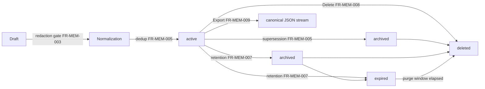

# 02 — Memory Lifecycle

This chapter defines how memory moves through time: ingestion and normalization,
deduplication and conflict resolution with supersession-based versioning, consolidation
(compression and summarization), retention and expiration, deletion and purge cascades,
export, encryption posture, and offline operation. It also mints the E-MEM error catalog, the
`memory.*` event names, and the `[memory]` configuration keys (key content owned here; schema,
precedence, and validation by Volume 10).

Memory Records are immutable content with a recorded status (`active`, `archived`, `expired`,
`deleted` — frozen vocabulary, Volume 2 chapter 09). There is no state machine: the lifecycle
below is a set of guarded operations over that vocabulary.



The diagram shows the operation graph over the recorded status vocabulary: drafts pass the
redaction gate and normalization before becoming `active` rows; supersession and retention
move rows to `archived`; retention moves `archived` (or directly `active`, when archiving is
disabled) rows to `expired`; explicit deletion or the post-expiry purge window produces
`deleted` tombstones with erased content. Export reads without transitioning. Constraints:
all arrows are forward-only (a superseded or expired record is never reactivated — a
correction is a new record), and every transition is transactional in the record's owning
database and emits exactly one `memory.*` event.

## Requirements

### FR-MEM-004 — Ingestion and normalization

- Type: Functional
- Status: Draft
- Priority: P0
- Phase: MVP
- Source: Provided
- Owner: Memory Manager (Volume 7)
- Affected components: Memory Manager, Agent Engine, CLI, TUI
- Dependencies: FR-MEM-001, FR-MEM-002, FR-MEM-003; ADR-085
- Related risks: RISK-MEM-001, RISK-MEM-002

#### Description

`MemoryStorePort.Ingest` MUST accept batches of `MemoryRecordDraft` values and persist them
transactionally: a batch either fully persists or writes nothing (port contract, Volume 3).
Three ingestion modes exist, selected by `memory.ingestion.mode`: `explicit` (only user
commands write memory), `assisted` (the default: agents propose drafts, which persist
automatically for `session`-layer records and require the standing policy or user
confirmation for `workspace`/`long_term` records), and `off` (no writes; retrieval still
works). Normalization before persistence MUST: trim and collapse whitespace, strip terminal
control sequences, enforce the content cap `memory.max_content_bytes` (oversized drafts are
refused with E-MEM-001, never silently truncated), stamp provenance (FR-MEM-002), and
validate the kind-specific structured projection: `preference` requires `{subject, value}`,
`decision` requires `{subject, decision, rationale}`, other kinds MAY carry `{subject}`.
`subject` is the normalized topic key used for deduplication and conflict resolution
(FR-MEM-005).

#### Motivation

A single, transactional, normalized entry path is what makes every other lifecycle rule
enforceable: the redaction gate, provenance, dedup, and retention all attach here.

#### Actors

User (explicit adds via Volume 8 memory commands), Agent Engine (proposed drafts), Workflow
Engine (decision records at gate outcomes), Memory Manager (validation and persistence).

#### Preconditions

Target layer's database open; mode permits the write; drafts pass FR-MEM-003.

#### Main flow

1. Caller submits a draft batch with layer, kind, content, and structured projection.
2. Redaction gate (FR-MEM-003), then normalization and validation run per draft.
3. Deduplication (FR-MEM-005) resolves each draft to insert, coalesce, or supersede.
4. The batch commits in one transaction per target database; minted ULIDs return in input
   order; `memory.record.ingested` emits per new record.

#### Alternative flows

- Assisted-mode agent draft targeting `workspace`/`long_term` without a standing policy:
  the draft is held for user confirmation in interactive contexts and refused in
  non-interactive contexts (PRD-009 parity).
- A batch spanning workspace and global databases is split into one transaction per
  database; the port reports per-database outcomes (cross-database atomicity is not claimed
  — ADR-028 rule 6).

#### Edge cases

- Cancelled context mid-batch: nothing persists (port contract).
- Duplicate drafts within one batch coalesce before insert.
- Empty content after normalization is a validation failure (E-MEM-001).

#### Inputs

Draft batches; ingestion mode; content cap; kind projection schemas.

#### Outputs

Persisted records with ULIDs; `memory.record.ingested` events; refusals per FR-MEM-003.

#### States

Records enter as `active` (recorded status vocabulary).

#### Errors

E-MEM-001 (validation), E-MEM-002 (redaction refusal), E-MEM-003 (store unavailable).

#### Constraints

One transaction per database per batch; normalization is deterministic (identical drafts
normalize identically on every platform); no silent truncation anywhere.

#### Security

Only the gate-passing path writes; agent-proposed writes to durable layers are
consent-gated, so a prompt-injected agent cannot silently plant long-lived memory
(RISK-MEM-001 mitigation).

#### Observability

`memory.record.ingested` carries record ULID, layer, kind, `source_kind`, byte size — no
content. Ingestion counts and refusal counts are metrics.

#### Performance

Batch-transactional writes on the SessionStorePort-adjacent hot path are bounded by
`memory.max_content_bytes` and batch size; budgets are Volume 12's.

#### Compatibility

Normalization rules are platform-independent; drafts serialize as canonical JSON (Volume 2
chapter 10).

#### Acceptance criteria

- Given a batch of three valid drafts and one oversized draft, when `Ingest` runs, then the
  whole batch fails with E-MEM-001 naming the offending draft index and nothing persists
  (negative + transactional case).
- Given `memory.ingestion.mode = "explicit"`, when an agent proposes a draft, then it is
  refused and the refusal is observable to the agent as a structured denial (permission
  case).
- Given assisted mode and a `workspace`-layer agent draft in a non-interactive run, when
  ingestion runs, then it refuses without prompting (PRD-009 case).
- Given a successful batch, when events are inspected, then exactly one
  `memory.record.ingested` per record exists with correlation IDs linking to the
  originating run (observability case).

#### Verification method

Contract tests over `Ingest` (transactionality, cancellation, ordering); mode-matrix tests;
normalization determinism property tests (Volume 13).

#### Traceability

PRD-005, PRD-006, PRD-009; FR-MEM-001..003, FR-MEM-005; ADR-028.

### FR-MEM-005 — Deduplication, conflict resolution, and supersession versioning

- Type: Functional
- Status: Draft
- Priority: P1
- Phase: MVP
- Source: Provided
- Owner: Memory Manager (Volume 7)
- Affected components: Memory Manager, Context Manager
- Dependencies: FR-MEM-002, FR-MEM-004; Volume 2 INV-MEM-05
- Related risks: RISK-MEM-001, RISK-MEM-002

#### Description

Memory content is immutable (INV-MEM-05): every correction or update is a new record that
**supersedes** the old one. The Memory Manager MUST implement: (a) **exact deduplication** —
a draft whose normalized content hash equals an `active` record's in the same layer, kind,
and scope is coalesced (the existing ULID returns; ingestion is idempotent); (b) **subject
conflict resolution** — a draft whose `subject` matches an `active` record of the same kind
and scope but whose content differs supersedes it, subject to the trust guard: an
agent-sourced draft MUST NOT supersede a user-sourced record — it is instead held for user
confirmation (interactive) or stored as a non-superseding conflicting record flagged in both
records' structured projections (non-interactive); (c) **supersession mechanics** — the old
record's status becomes `archived`, its projection gains `superseded_by = <new ULID>`, the
new record gains `supersedes = <old ULID>`, and `memory.record.superseded` emits. The
supersession chain is the record's version history and MUST be traversable in both
directions. Retrieval (FR-MEM-001) returns only chain heads unless the query opts into
history.

#### Motivation

Immutable supersession gives versioning, auditability ("what did it believe last week, and
why did it change"), and a conflict-resolution rule that cannot destroy user-stated truth.

#### Actors

Memory Manager; user (confirms trust-guarded supersessions); Context Manager (consumes
chain heads and conflict flags).

#### Preconditions

FR-MEM-004 normalization computed content hash and `subject`.

#### Main flow

1. Ingestion resolves each draft against `active` records by content hash, then by
   `(layer, kind, scope, subject)`.
2. Exact match → coalesce. Subject match with trust permitting → supersede atomically (new
   insert + old archive in one transaction). No match → plain insert.

#### Alternative flows

- Trust-guarded conflict in an interactive session: a confirmation prompt (through the
  standard approval-style interaction, Volume 8) resolves to supersede or to keep both
  flagged.
- User explicitly edits a memory via Volume 8 commands: implemented as user-sourced
  supersession — never in-place mutation.

#### Edge cases

- Supersession chains never branch: superseding a non-head record is a validation failure
  (E-MEM-001) — corrections apply to heads.
- Two concurrent supersessions of one head: the second transaction loses on the optimistic
  `revision` check and retries against the new head (ADR-023 discipline).
- `deleted` and `expired` records are not dedup or conflict candidates.

#### Inputs

Normalized drafts with hashes and subjects; trust levels; confirmation outcomes.

#### Outputs

Coalesced ULIDs; supersession chains; conflict flags; `memory.record.superseded` events.

#### States

`active` → `archived` for superseded records (recorded vocabulary; forward-only).

#### Errors

E-MEM-001 (branching supersession, invalid subject), E-MEM-004 (superseding a missing
record).

#### Constraints

Atomic supersession; chains acyclic and linear; the trust guard is not configurable.

#### Security

The trust guard is the enforcement point that keeps agent output from displacing
user-stated preferences (RISK-MEM-001); confirmations are recorded.

#### Observability

`memory.record.superseded` carries old and new ULIDs and trust levels; conflict-flag counts
are metrics; chains render in Volume 8 memory views.

#### Performance

Dedup lookups are indexed by content hash and `(layer, kind, subject)`; cost is
per-draft constant lookups.

#### Compatibility

Chains export with both link directions (FR-MEM-009), so history survives round-trips.

#### Acceptance criteria

- Given an identical draft re-ingested, when `Ingest` runs, then the existing ULID returns
  and no new row exists (idempotency).
- Given an agent draft whose subject matches a user record, when ingested
  non-interactively, then both records exist, both carry conflict flags, and the user
  record remains the chain head (negative/trust case).
- Given a user supersession of an agent record, when it commits, then old status is
  `archived`, links are bidirectional, and `memory.record.superseded` emitted exactly once
  (observability case).
- Given a draft superseding a non-head record, when ingested, then E-MEM-001 returns and
  the chain is unchanged (error case).

#### Verification method

Property tests over chain linearity and idempotency; concurrency tests on head contention;
trust-guard adversarial tests (Volume 13).

#### Traceability

PRD-006; INV-MEM-05; FR-MEM-002; RISK-MEM-001.

### FR-MEM-006 — Compression and summarization (consolidation)

- Type: Functional
- Status: Draft
- Priority: P2
- Phase: Beta
- Source: Provided
- Owner: Memory Manager (Volume 7)
- Affected components: Memory Manager, Agent Engine, Provider Layer (via Agent Engine requests)
- Dependencies: FR-MEM-003, FR-MEM-004, FR-MEM-005, FR-MEM-007
- Related risks: RISK-MEM-001, RISK-MEM-002

#### Description

The Memory Manager MUST provide a **consolidation pass** that compresses memory by
summarization: clusters of related `episodic` records (grouped by scope, subject, and time
window) are summarized into fewer `semantic` or `procedural` records, and the source records
are archived with links to the summary. Because summarization requires model inference, the
Memory Manager MUST NOT call providers itself (Volume 3 dependency rule): it produces
consolidation *proposals*; the Agent Engine executes the summarization request as a normal
run with the configured summarization model, and the resulting drafts re-enter through
`Ingest` — passing the FR-MEM-003 gate and carrying `source_kind = system` with provenance
to the consolidation run. Consolidation MUST be: opt-in via `memory.consolidation.enabled`
(default `false` until Beta defaults are set by Volume 15 sequencing), offline-aware
(deferred, never failed, when no capable provider is reachable — FR-MEM-010), lossless in
audit terms (sources archived, never deleted, by consolidation), and bounded per pass
(`memory.consolidation.max_records_per_pass`).

#### Motivation

Episodic memory accumulates fast and loses retrieval value raw; consolidation preserves the
knowledge at a fraction of the storage and token cost while the supersession/archive model
keeps the originals auditable (RISK-MEM-002 mitigation).

#### Actors

Retention scheduler (triggers), Memory Manager (clustering, proposals, archival), Agent
Engine (summarization runs), user (enable/disable, review).

#### Preconditions

Consolidation enabled; a provider with `chat` capability configured; candidate clusters
exceed the pass thresholds.

#### Main flow

1. The scheduled pass clusters candidates and emits proposals.
2. The Agent Engine executes summarization; drafts return.
3. Drafts ingest (gate, provenance); sources archive with `consolidated_into` links; the
   pass reports counts and emits `memory.consolidation.completed`.

#### Alternative flows

- Offline or no capable provider: the pass records a deferral and reschedules; no error
  state accrues.
- Summary refused by the redaction gate: that cluster is skipped and its sources remain
  `active`; the refusal is reported (FR-MEM-003 flow).

#### Edge cases

- Clusters spanning a record under concurrent supersession retry after the chain settles.
- A summary larger than its sources is discarded (no negative compression); the cluster is
  marked exempt for future passes.

#### Inputs

Cluster thresholds, pass bounds, model selection configuration.

#### Outputs

Summary records; archived sources with links; pass reports; events.

#### States

Sources: `active` → `archived`. Summaries enter `active`.

#### Errors

E-MEM-005 (consolidation pass failure: clustering or link-write errors); provider-side
failures surface as the summarization run's errors (E-AGT family, by area name), never as
memory corruption.

#### Constraints

Consolidation never deletes; never runs on `session`-layer records of a live session; total
tokens per pass are bounded by configuration; cost accrues to Cost Records attributed to
the consolidation run (Volume 2 accounting).

#### Security

Summaries pass the same redaction gate as any content; consolidation runs execute under the
standard permission model with no tool access beyond memory ingestion.

#### Observability

`memory.consolidation.completed` with cluster/record/token counts; deferral events; storage
delta metrics.

#### Performance

Pass bounds cap cost; consolidation runs in a background scheduler pool (ADR-023) and MUST
NOT contend with interactive latency (Volume 12 pool budgets).

#### Compatibility

Summaries are ordinary records; consumers need no awareness of consolidation.

#### Acceptance criteria

- Given a qualifying episodic cluster, when the pass completes, then a summary record
  exists with system provenance, sources are `archived` with `consolidated_into` links, and
  counts in the event match rows (main case).
- Given offline operation, when the pass triggers, then it defers without error and memory
  remains fully queryable (offline case).
- Given a summary containing credential material, when ingestion runs, then it is refused
  and sources remain `active` (error/security case).
- Given `memory.consolidation.enabled = false`, when the scheduler fires, then no pass runs
  and no provider request occurs (negative case).

#### Verification method

Consolidation integration tests with a scripted provider double; offline deferral tests;
archive-link integrity property tests (Volume 13).

#### Traceability

PRD-003, PRD-006; FR-MEM-003, FR-MEM-005, FR-MEM-007, FR-MEM-010; RISK-MEM-002.

### FR-MEM-007 — Retention and expiration

- Type: Functional
- Status: Draft
- Priority: P1
- Phase: MVP
- Source: Provided
- Owner: Memory Manager (Volume 7)
- Affected components: Memory Manager, Task Scheduler, Persistence Layer
- Dependencies: FR-MEM-001; ADR-023, ADR-028
- Related risks: RISK-MEM-002

#### Description

Every Memory Record MUST be governed by a per-layer retention policy. Defaults (overridable
in `[memory]` configuration): `session` layer — records expire 90 days after their owning
session ends; `workspace` layer — 365 days after `last_accessed_at` (or `created_at` when
never accessed); `long_term` layer — retained indefinitely (`0` = no expiry) because
preferences do not rot on a clock. When `memory.archive_before_expire` is `true` (default),
records pass through `archived` for `memory.archive_grace_days` (default 30) before
`expired`; `expired` records are excluded from all retrieval and are purged (content erased,
tombstone per FR-MEM-008 mechanics) after `memory.purge_after_days` (default 30).
`MemoryStorePort.Expire` executes one policy pass and returns an `ExpireReport` (counts per
layer/kind/transition). Passes run as supervised background tasks (SchedulerPort) on
workspace open and at most once per 24 h thereafter, and are user-invocable via Volume 8
maintenance commands. A record with an explicit `expires_at` set at ingestion expires at
that instant regardless of layer defaults; `importance` above the configured protection
threshold defers expiry by one grace period at a time, never indefinitely.

#### Motivation

Default-bounded retention is both a privacy property (data minimization) and the structural
cap on RISK-MEM-002 growth; per-layer defaults match how each layer's value decays.

#### Actors

Retention scheduler, Memory Manager, user (configuration and manual passes).

#### Preconditions

Owning database open; policy resolved from configuration (ConfigPort).

#### Main flow

1. A pass loads the effective policy and scans eligible records per layer.
2. Transitions apply transactionally in batches: `active` → `archived` → `expired` →
   purge, each step honoring its window.
3. The report returns; `memory.retention.completed` emits with counts.

#### Alternative flows

- Cancellation mid-pass: completed batches stand (each transactional); the report marks the
  pass partial; the next pass resumes — passes are idempotent over the same policy.
- Policy invalid (negative windows, unknown layer): E-MEM-006 without any transition.

#### Edge cases

- Clock skew backwards never un-expires (transitions are forward-only).
- Records referenced by a pinned Context Item (FR-CTX-005) still expire — pins hold context
  copies for their turn, not lifecycle locks; the pin's source reference degrades to a
  tombstone hash per INV-CTXI-04.
- Purge cascades to Embeddings in the same maintenance pass (INV-EMB-03).

#### Inputs

Retention configuration, explicit `expires_at`, importance protection threshold.

#### Outputs

Status transitions, `ExpireReport`, `memory.record.archived` / `memory.record.expired`
events, purge counts.

#### States

Recorded vocabulary transitions: `active` → `archived` → `expired` → `deleted`
(forward-only).

#### Errors

E-MEM-006 (invalid policy), E-MEM-003 (store unavailable mid-pass).

#### Constraints

Passes are idempotent and bounded per batch; retention never touches records of a live
session's `session` layer; audit precedence — Audit Records about memory operations are
never subject to memory retention (they are Volume 9's, with their own policy).

#### Security

Expiry narrows the window in which poisoned or sensitive-adjacent content can influence
runs; purge guarantees follow NFR-MEM-002.

#### Observability

Per-pass events with counts; layer size metrics before/after; next-scheduled-pass timestamp
in diagnostics (Volume 8 doctor).

#### Performance

Batched, indexed scans (`expires_at`, `status`); background pool, never on the interactive
path (Volume 12 budgets).

#### Compatibility

Policy keys per this chapter's `[memory]` table; Volume 10 validates shape.

#### Acceptance criteria

- Given a workspace-layer record unaccessed for 366 days with defaults, when a pass runs,
  then it becomes `archived`, and after the grace window a later pass makes it `expired`
  (main case).
- Given `expired` records older than the purge window, when a pass runs, then content is
  erased, embeddings are gone, and tombstones remain (cascade case).
- Given a pass cancelled mid-way, when re-run, then final counts equal an uninterrupted
  pass over the same input (idempotency case).
- Given a policy with a negative window, when a pass starts, then E-MEM-006 returns and no
  record changed (negative case).
- Given any pass, when complete, then `memory.retention.completed` counts equal observed
  row transitions (observability case).

#### Verification method

Property tests (idempotency, forward-only); time-travel fixtures; cascade verification
suite shared with FR-MEM-008 (Volume 13).

#### Traceability

PRD-003 (data minimization posture), PRD-010; ADR-023, ADR-028; NFR-MEM-002; RISK-MEM-002.

### FR-MEM-008 — Deletion and purge cascade

- Type: Functional
- Status: Draft
- Priority: P0
- Phase: MVP
- Source: Provided
- Owner: Memory Manager (Volume 7)
- Affected components: Memory Manager, Indexing Engine, Persistence Layer
- Dependencies: FR-MEM-007; Volume 2 INV-MEM-04, INV-EMB-03, INV-CTXI-04
- Related risks: RISK-MEM-002

#### Description

`MemoryStorePort.Delete` MUST hard-delete records by ULID: content and structured
projection are erased, the row remains as a tombstone with status `deleted` (INV-MEM-04
terminality), and the cascade removes every derived copy — Embeddings of the record
(INV-EMB-03) and lexical index entries — within the same maintenance pass. Context Items
that referenced the record keep only their content hash (INV-CTXI-04): the fact that
something was sent to a model survives; its content does not. Deletion MUST be available
per record, per supersession chain, per layer, per session, and per workspace (the Volume 8
`memory` command family exposes these scopes); layer- and workspace-scoped deletion require
interactive confirmation or an explicit non-interactive override flag (Volume 8
conventions). Deletion events record who deleted what and when — the deletion itself is
auditable even though the content is gone (audit precedence, Volume 2).

#### Motivation

The user's right to make Andromeda forget is absolute within audit precedence; a deletion
that leaves embeddings retrievable would be a lie (NFR-MEM-002 makes this measurable).

#### Actors

User (commands), Memory Manager (execution), Indexing Engine (cascade), agents (never —
see Security).

#### Preconditions

Records exist; confirmation satisfied for scoped deletions.

#### Main flow

1. `Delete` resolves ULIDs, erases content, tombstones rows.
2. The cascade purges embeddings and lexical entries in the same pass; affected indexes
   emit `index.scope.invalidated` when entries were removed (chapter 04).
3. `memory.record.deleted` emits per record with actor attribution.

#### Alternative flows

- Deleting a chain: every record in the chain tombstones; links persist between tombstones
  (structure without content).
- Unknown ULIDs: E-MEM-004 listing the missing IDs; found IDs in the same call still
  delete (per-ID outcomes reported).

#### Edge cases

- Deleting an already-`deleted` record is a no-op success (idempotent).
- Crash between tombstone and cascade: the next maintenance pass detects tombstones with
  surviving embeddings and completes the cascade (recovery is idempotent; NFR-MEM-002
  measures the end state).

#### Inputs

ULID sets or scope selectors; confirmation state; actor identity.

#### Outputs

Tombstones; cascade purges; per-ID outcome report; events.

#### States

Any non-`deleted` status → `deleted` (terminal).

#### Errors

E-MEM-004 (not found), E-MEM-003 (store unavailable).

#### Constraints

`deleted` is terminal and content-free; cascade completion is an invariant checked by
maintenance passes, not a best effort.

#### Security

Deletion is a user-initiated operation: agents MUST NOT invoke `Delete` (no tool exposes
it; the Memory Manager rejects agent-context callers) — an injected agent must not be able
to destroy the user's accumulated memory. Deletions are audit-logged (Volume 9 Audit Log,
by name).

#### Observability

`memory.record.deleted` with actor, scope, and counts; cascade-completion metric; doctor
check for orphaned embeddings.

#### Performance

Per-batch transactional deletes; cascade cost proportional to derived copies; background
completion for large scopes.

#### Compatibility

Tombstone rows keep exports and chains structurally valid (FR-MEM-009 exports tombstones as
metadata-only entries).

#### Acceptance criteria

- Given a deleted record, when any retrieval or index query runs, then neither content nor
  vector is reachable through any path (main case, verified by NFR-MEM-002 method).
- Given an agent-context caller, when it invokes deletion, then it is rejected with a
  structured denial and an audit record exists (permission case).
- Given a crash between tombstone and cascade, when the next pass runs, then no orphaned
  embedding survives (recovery case).
- Given a workspace-scoped delete without confirmation in an interactive session, when
  invoked, then nothing is deleted (negative case).

#### Verification method

NFR-MEM-002 measurement suite; crash-injection cascade tests; permission enforcement tests
(Volume 13).

#### Traceability

PRD-005, PRD-006; INV-MEM-04, INV-EMB-03, INV-CTXI-04; NFR-MEM-002.

### FR-MEM-009 — Export and portability

- Type: Functional
- Status: Draft
- Priority: P2
- Phase: MVP
- Source: Provided
- Owner: Memory Manager (Volume 7)
- Affected components: Memory Manager, CLI
- Dependencies: FR-MEM-002, FR-MEM-003; ADR-014 (age), Volume 2 chapter 10 export forms
- Related risks: RISK-MEM-001

#### Description

`MemoryStorePort.Export` MUST stream records matching a `MemoryQuery` as canonical JSON
entity documents (Volume 2 chapter 10 export forms), preserving provenance, supersession
links, status, and timestamps; tombstones export as metadata-only entries. The Volume 8
`memory export` command exposes it with layer/kind/scope filters. Every exported record
re-passes the Volume 9 redaction scan at export time (defense in depth: patterns unknown at
ingestion time still get caught). Export MAY encrypt the output with `age` (the ADR-014
file-fallback tool, reused deliberately — no new cryptography dependency) when the user
supplies a recipient key. Import (the reverse command) re-enters through `Ingest` with full
gates (FR-MEM-003, FR-MEM-004) and preserves original provenance per FR-MEM-002. When an
agent-context caller invokes export through a tool surface, the `write` permission for the
destination path MUST be granted through the permission model (enum name per the frozen
seed) before any byte is written.

#### Motivation

Memory is the user's data: portability out (backup, migration, inspection) and controlled
re-entry keep it so (Volume 1 open-architecture and transparency objectives).

#### Actors

User (commands), Memory Manager (streaming), Permission Manager (agent-invoked writes).

#### Preconditions

Query resolves; destination writable; optional recipient key valid.

#### Main flow

1. `Export` streams matching records in ULID order (deterministic output for identical
   stores).
2. Each record passes the export-time redaction scan; findings are excluded and reported.
3. Output writes plain or age-encrypted; `memory.export.completed` emits with counts and a
   content-free digest of the export.

#### Alternative flows

- Import: parse, validate, gate, ingest; per-record outcomes reported; imported records
  carry the import annotation (FR-MEM-002).
- Stream consumer cancels: partial file is truncated-marked, never silently valid.

#### Edge cases

- Exports spanning workspace and global layers read both databases; ordering remains
  global-ULID-sorted.
- Zero-match queries produce a valid empty document, exit code 0.

#### Inputs

Query filters, destination, optional age recipient, import files.

#### Outputs

Canonical JSON stream (optionally encrypted); reports; events.

#### States

Export never transitions status; import creates `active` records.

#### Errors

E-MEM-005 (export/import I/O or encryption failure), E-MEM-001 (import validation),
E-MEM-002 (import gate refusal).

#### Constraints

Deterministic ordering; no partial file presented as complete; encryption only via the
ADR-014-established tool.

#### Security

Export-time re-scan; agent-invoked exports bind to `write` permission; encrypted exports
never embed the recipient's private material anywhere.

#### Observability

`memory.export.completed` with record counts, excluded counts, destination hash; import
outcome events per batch.

#### Performance

Streaming (bounded memory) regardless of store size; Volume 12 owns throughput budgets.

#### Compatibility

Canonical JSON export form is a public contract surface (SM-20 regime applies from its
first release); version field per Volume 2 chapter 10.

#### Acceptance criteria

- Given a store with chains and tombstones, when exported and re-imported into an empty
  store, then retrieval-observable state (heads, links, provenance) is equivalent, and
  tombstones remain content-free (round-trip case).
- Given a record matching a new redaction pattern, when exported, then it is excluded and
  the report names the class (security case).
- Given an agent-invoked export without `write` permission for the destination, when
  invoked, then no file is created and a structured denial returns (permission case).
- Given an invalid age recipient, when export starts, then E-MEM-005 returns before any
  plaintext write (error case).

#### Verification method

Round-trip suites; determinism tests; permission enforcement tests; encryption fixture
tests (Volume 13).

#### Traceability

PRD-006, PRD-007; ADR-014; Volume 2 chapter 10; FR-MEM-002, FR-MEM-003.

### FR-MEM-010 — Offline memory operation

- Type: Functional
- Status: Draft
- Priority: P0
- Phase: MVP
- Source: Provided
- Owner: Memory Manager (Volume 7)
- Affected components: Memory Manager, Indexing Engine
- Dependencies: FR-MEM-001, FR-MEM-006; Volume 1 Principle 3 (offline guarantee item 2)
- Related risks: RISK-MEM-002

#### Description

Every memory operation — ingest, retrieve, rank, expire, delete, export, import — MUST
complete without network access. Semantic re-ranking uses embeddings only when they can be
produced within the offline condition (local embedding provider) or already exist in the
index cache; otherwise ranking degrades to lexical + recency + importance + trust with a
recorded degradation marker, and NEVER queues content for later transmission.
Consolidation (FR-MEM-006) defers offline. This requirement realizes offline guarantee
item 2 of Volume 1 ("querying local memory") and is measured by NFR-MEM-001.

#### Motivation

Local-first is an identity property (PRD-003); memory that needs a network is a diary that
phones home.

#### Actors

Memory Manager, Indexing Engine, offline test suite.

#### Preconditions

None — this is the unconditioned baseline.

#### Main flow

1. Any memory operation runs with all interfaces disabled.
2. It completes with local resources; semantic scoring applies only over cached vectors or
   local providers.

#### Alternative flows

- A remote embedding provider is configured but unreachable: retrieval degrades (marker
  recorded); no error, no retry storm (retry policy belongs to the index build path,
  FR-IDX-003).

#### Edge cases

- First-ever run offline (no caches): everything works lexically.
- Export to a network filesystem path that hangs: the PAL filesystem timeout applies; the
  failure is E-MEM-005 I/O, not a network dependency of memory logic.

#### Inputs

The full memory operation surface, offline condition.

#### Outputs

Identical results modulo the documented semantic degradation.

#### States

Not applicable — no additional states; degradation is marked per operation.

#### Errors

None specific — absence of network MUST NOT surface as an error for any memory operation.

#### Constraints

No queued-for-later content transmission of any kind; degradation markers are mandatory
(silent degradation is a defect per Principle 2's reporting discipline applied to memory).

#### Security

Offline operation guarantees no accidental egress path exists in the memory subsystem
(NFR-MEM-001's 0-egress invariant).

#### Observability

Degradation markers in retrieval results and assembly records (FR-CTX-004); offline-suite
results per release.

#### Performance

Lexical fallback latency budgets per Volume 12; no timeout-then-degrade stalls — provider
reachability is checked against the Provider connection state (`available` etc., Volume 5
machine), not by waiting on dead sockets.

#### Compatibility

Identical across Tier 1 platforms; verified in the offline suite.

#### Acceptance criteria

- Given all interfaces disabled, when the full memory operation surface executes, then all
  operations succeed and zero egress is observed (main case, NFR-MEM-001 method).
- Given a configured but unreachable remote embedding provider, when retrieval runs, then
  results return with a degradation marker and no connection attempt blocks the operation
  beyond the provider-state check (degradation case).
- Given offline consolidation triggers, when the pass runs, then it defers without error
  (negative case).

#### Verification method

Volume 13 offline suite (OS-level interface disablement) covering every memory operation;
egress capture per NFR-MEM-001.

#### Traceability

PRD-003; Volume 1 Principle 3 item 2; NFR-MEM-001; FR-CTX-004; FR-IDX-005.

### NFR-MEM-002 — Deletion completeness

- Category: Privacy
- Priority: P0
- Phase: MVP
- Metric: Fraction of deleted Memory Records whose content or derived vectors remain reachable through any retrieval path (MemoryStorePort, IndexerPort, direct cache inspection) after the deletion's maintenance pass completes
- Target: 0 reachable remnants
- Minimum threshold: 0 reachable remnants (identity property; no tolerance)
- Measurement method: Deletion suite: ingest fixtures (including indexed and superseded records), delete via every scope, run the maintenance pass, then exhaustively query all ports and scan `state.db`/`global.db`/`index.db` for content bytes and vectors; crash-injection variant between tombstone and cascade
- Test environment: Volume 12 reference hardware; Volume 13 fixture workspaces
- Measurement frequency: every CI run (suite); every release (crash-injection variant)
- Owner: Memory Manager (Volume 7)
- Dependencies: FR-MEM-008; INV-MEM-04, INV-EMB-03
- Risks: RISK-MEM-002
- Acceptance criteria: The deletion suite finds zero content bytes and zero vectors for deleted records in all databases and via all query paths, including after injected crashes with one subsequent maintenance pass; tombstone metadata (ULIDs, timestamps, actor) remains present.

### RISK-MEM-002 — Unbounded memory and embedding growth

- Category: Technical / operational
- Probability: Medium
- Impact: Medium
- Severity: Medium
- Mitigation: Default-bounded retention per layer (FR-MEM-007); consolidation (FR-MEM-006); content cap at ingestion (FR-MEM-004); purge cascade (FR-MEM-008); index cache exclusion from authoritative backups (ADR-028) with `index.max_chunks` bounds (chapter 04)
- Detection: Layer size and growth-rate metrics; doctor diagnostics thresholds; ADR-020 corpus-size observability
- Owner: Memory Manager (Volume 7)
- Status: Open

SQLite files that grow without bound degrade the backup-before-migration discipline
(ADR-029) and retrieval latency. Defaults keep growth bounded without user action; metrics
make the exception visible before it hurts.

## Error catalog (E-MEM)

Every code below follows the ADR-016 envelope. Exit codes map per Volume 0 chapter 03; HTTP
mappings apply only where the ADR-012 IPC surface exposes the operation.

### E-MEM-001 — Memory record validation failure

- Category: Validation
- Severity: Error
- User message: "The memory entry is invalid: <reason>."
- Technical message: draft index, violated rule (layer/scope per INV-MEM-01, provenance per INV-MEM-02, projection schema, content cap, chain-head rule), offending field
- Cause: malformed draft, missing provenance, oversized content, branching supersession
- Safe-to-log data: draft index, rule name, field name, byte size — never content
- Recoverability: recoverable — correct the draft and retry
- Retry policy: no automatic retry (deterministic failure)
- Recommended action: fix the named field; for oversized content, shorten or split
- Exit-code mapping: 1 (2 when caused by invalid CLI arguments)
- HTTP mapping: 400 over IPC
- Telemetry event: `memory.ingestion.refused`
- Security implications: none beyond refusal; content never logged

### E-MEM-002 — Redaction gate refusal

- Category: Security
- Severity: Error
- User message: "This content cannot be stored in memory: it appears to contain <detection class>."
- Technical message: detection class, span offsets, ingestion path (ingest/import/consolidation)
- Cause: credential material or unconfirmed sensitive-class content in a draft (FR-MEM-003)
- Safe-to-log data: detection class, span offsets, caller correlation IDs — never matched bytes
- Recoverability: recoverable — remove the flagged span, or confirm explicitly where the class permits confirmation
- Retry policy: no automatic retry
- Recommended action: remove the secret from the content; store a Secret Store reference instead
- Exit-code mapping: 5 when a confirmation was denied; otherwise 1
- HTTP mapping: 422 over IPC
- Telemetry event: `memory.ingestion.refused`
- Security implications: security-relevant; feeds the Audit Log; repeated refusals from one run are a signal of exfiltration-shaped behavior (Volume 9)

### E-MEM-003 — Memory store unavailable

- Category: Storage
- Severity: Error
- User message: "Andromeda's memory storage is currently unavailable: <scope>."
- Technical message: database path, layer, underlying Persistence Layer error chain
- Cause: locked/missing/corrupted workspace or global database; migration mismatch (ADR-029)
- Safe-to-log data: database scope (workspace/global), sanitized cause, lock holder PID where known
- Recoverability: recoverable after remediation; corruption follows ADR-029 backup-restore
- Retry policy: one automatic retry after lock-wait for transient locks; none for corruption
- Recommended action: close competing processes; for integrity failures follow the ADR-029 recovery procedure
- Exit-code mapping: 9 for integrity/migration failures; otherwise 1
- HTTP mapping: 503 over IPC
- Telemetry event: within the `memory.*` family with error envelope
- Security implications: none; content not exposed in diagnostics

### E-MEM-004 — Memory record not found

- Category: Not found
- Severity: Warning
- User message: "No memory entry exists with the given identifier."
- Technical message: missing ULIDs, operation (retrieve/delete/supersede), scope searched
- Cause: unknown, purged, or out-of-scope ULID
- Safe-to-log data: ULIDs, operation, scope
- Recoverability: recoverable — nothing to undo
- Retry policy: no automatic retry
- Recommended action: list memory to confirm identifiers; deletion of missing IDs is reported per ID
- Exit-code mapping: 1
- HTTP mapping: 404 over IPC
- Telemetry event: within the `memory.*` family with error envelope
- Security implications: scope-respecting — existence outside the caller's visibility is reported as not found (no cross-scope existence oracle)

### E-MEM-005 — Memory maintenance or transfer failure

- Category: Execution
- Severity: Error
- User message: "A memory maintenance operation failed: <operation>."
- Technical message: operation (consolidation/export/import), step, I/O or encryption error chain
- Cause: consolidation link-write failure; export destination I/O; age encryption error; import parse failure
- Safe-to-log data: operation, step, destination path hash, error class
- Recoverability: recoverable — operations are idempotent or resumable per FR-MEM-006/009
- Retry policy: automatic retry only for the pass scheduler (next scheduled pass); manual retry otherwise
- Recommended action: check destination and key material; re-run the command
- Exit-code mapping: 1
- HTTP mapping: 500 over IPC
- Telemetry event: within the `memory.*` family with error envelope
- Security implications: partial exports are truncation-marked so an incomplete file is never mistaken for a complete one

### E-MEM-006 — Invalid retention policy

- Category: Configuration
- Severity: Error
- User message: "The memory retention configuration is invalid: <reason>."
- Technical message: offending key, value, constraint (non-negative windows, known layers, grace ≤ retention)
- Cause: invalid `[memory]` retention keys or an invalid `ExpirePolicy` argument
- Safe-to-log data: key names and values (retention values are not sensitive)
- Recoverability: recoverable after configuration fix
- Retry policy: no automatic retry
- Recommended action: correct the named key; validation details per Volume 10
- Exit-code mapping: 3
- HTTP mapping: 400 over IPC
- Telemetry event: within the `memory.*` family with error envelope
- Security implications: none

## Events minted (memory family)

Names follow `<area>.<noun>.<verb-past>` (Volume 0 chapter 03); envelope, ordering,
delivery, persistence, retention, and redaction semantics are Volume 10's — payloads here
are content-free by construction.

| Event | Emitted when | Payload (summary) |
|---|---|---|
| `memory.record.ingested` | A new record persists (FR-MEM-004) | record ULID, layer, kind, source_kind, byte size, correlation IDs |
| `memory.record.superseded` | A supersession commits (FR-MEM-005) | old/new ULIDs, trust levels, subject hash |
| `memory.record.archived` | Retention or consolidation archives a record (FR-MEM-006/007) | ULID, reason |
| `memory.record.expired` | Retention expires a record (FR-MEM-007) | ULID, layer, kind |
| `memory.record.deleted` | Deletion tombstones a record (FR-MEM-008) | ULID, scope, actor kind |
| `memory.retention.completed` | A retention pass finishes (FR-MEM-007) | per-layer transition counts, partial flag |
| `memory.consolidation.completed` | A consolidation pass finishes (FR-MEM-006) | cluster/record/token counts |
| `memory.ingestion.refused` | The gate refuses content (FR-MEM-003) | detection class, path, correlation IDs |
| `memory.export.completed` | An export stream closes complete (FR-MEM-009) | record count, excluded count, destination digest |

## Configuration: `[memory]` table

Key content minted here; schema, precedence, env-var mapping, and validation are Volume 10's
(single-home matrix). Defaults shown are normative.

```toml
[memory]
enabled = true                      # false disables writes and retrieval returns empty
max_content_bytes = 16384           # ingestion cap per record (FR-MEM-004)

[memory.ingestion]
mode = "assisted"                   # "explicit" | "assisted" | "off" (FR-MEM-004)

[memory.retention]
session_days = 90                   # after session end; 0 = never expire (FR-MEM-007)
workspace_days = 365                # after last access; 0 = never expire
long_term_days = 0                  # 0 = retained indefinitely
archive_before_expire = true
archive_grace_days = 30
purge_after_days = 30
importance_protect_threshold = 8    # importance >= threshold defers expiry one grace period

[memory.ranking]
weight_relevance = 0.4              # FR-MEM-001 ranking weights; sum need not be 1.0
weight_recency = 0.3
weight_importance = 0.15
weight_trust = 0.15

[memory.consolidation]
enabled = false                     # FR-MEM-006 (Beta)
max_records_per_pass = 200
max_tokens_per_pass = 50000
```
