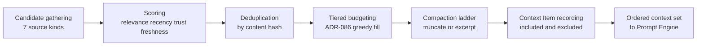

# 03 — Context Manager

This chapter defines the Context Manager: the component that decides **exactly what a model
sees**. It gathers candidate content from the context sources, scores it, fits it into the
model's token budget deterministically, records every inclusion and exclusion as Context
Items (Volume 2 chapter 07), and makes each assembled request reproducible. The component
boundary is Volume 3 chapter 03: the Context Manager assembles; it does not persist memory
(Memory Manager), build indexes (Indexing Engine), or render prompts (Prompt Engine — the
Context Manager supplies material; the Prompt Engine shapes it). It consumes MemoryStorePort,
IndexerPort, WorkspacePort, and ProviderPort (`CountTokens`, `Capabilities`) only.

## Context sources and priority tiers

The `source_kind` vocabulary is frozen by Volume 2: `message`, `memory`, `file`,
`index_result`, `tool_result`, `skill`, `system_prompt`. ADR-086 fixes assembly as a
**deterministic, priority-tiered pipeline** with this tier order (1 = filled first, never
evicted by lower tiers):

| Tier | Content | Source kinds | Mandatory? |
|---|---|---|---|
| 1 | System and profile prompts (Prompt Engine output), active skill instructions | `system_prompt`, `skill` | Yes |
| 2 | User-pinned items (FR-CTX-005) | any | Yes (see pin cap) |
| 3 | Current intent: latest user message, active plan/task state | `message` | Yes |
| 4 | Recent conversation history, newest first | `message` | No |
| 5 | Current-run tool results, newest first, truncated per FR-CTX-006 | `tool_result` | No |
| 6 | Memory records, ranked per FR-MEM-001 | `memory` | No |
| 7 | Index retrieval hits, ranked | `index_result` | No |
| 8 | Additional file content requested by heuristics or profile | `file` | No |

Tiers 1–3 are the **mandatory set**: if they alone exceed the budget, assembly fails with
E-CTX-001 rather than silently dropping any of them (RISK-CTX-001 control). Within a tier,
candidates order by score descending with ULID ascending as the tie-break, so identical
inputs always assemble identically.



The diagram shows the six pipeline stages. Candidate gathering queries the sources; scoring
attaches the ranking factors; deduplication collapses identical content across sources;
tiered budgeting fills the token budget in tier order; the compaction ladder shrinks
borderline items instead of dropping them where rules allow; recording persists every
candidate as a Context Item with `included` true or false; the ordered result goes to the
Prompt Engine. Constraints: the pipeline is pure with respect to its inputs (no model calls,
no network), stages run in fixed order, and stage parameters all come from configuration and
the model's declared capabilities — never from model-name special-casing (Principle 2).

## Requirements

### FR-CTX-001 — Context assembly

- Type: Functional
- Status: Approved
- Priority: P0
- Phase: MVP
- Source: Provided
- Owner: Context Manager (Volume 7)
- Affected components: Context Manager, Agent Engine, Planner, Workflow Engine, Prompt Engine
- Dependencies: ADR-086; FR-MEM-001; FR-IDX-001; FR-CTX-002; Volume 2 chapter 07 (Context Item)
- Related risks: RISK-CTX-001

#### Description

For every model request, the Context Manager MUST assemble the context set through the
fixed pipeline: gather candidates from the seven source kinds, score them (relevance to the
turn intent, recency, trust per FR-CTX-004, freshness), deduplicate by content hash
(keeping the highest-tier occurrence), fit them into the FR-CTX-002 budget in ADR-086 tier
order with deterministic intra-tier ordering, apply the FR-CTX-006 compaction ladder to
borderline items, and record every candidate — included or excluded — as a Context Item row
per Volume 2 (INV-CTXI-01..04). Assembly MUST be deterministic: identical candidate sets,
configuration, and model capabilities produce byte-identical assembled context. Assembly
MUST NOT invoke model inference or any network operation; it reads only local state and
port-mediated queries.

#### Motivation

Context selection is where agent quality is won or lost and where token money is spent.
Determinism plus total recording is what turns "why did it answer that?" into a queryable
fact (PRD-006) and makes replay possible (SM-12).

#### Actors

Agent Engine, Planner, and Workflow Engine (request assembly per turn); Context Manager
(pipeline); Prompt Engine (downstream consumer).

#### Preconditions

Turn intent available; model resolved with declared capabilities (Volume 5); budget
computable per FR-CTX-002.

#### Main flow

1. Gather: tier-relevant queries run against history, tool results, MemoryStorePort
   (`Retrieve`/`Rank`), IndexerPort (`Query`), and workspace files.
2. Score, dedup, and fill tiers greedily within the budget.
3. Compact borderline items per FR-CTX-006; drop what still does not fit, recording
   `included = false` with the losing score.
4. Persist Context Items (positions unique and dense among included items, INV-CTXI-03);
   emit `context.assembly.completed`; hand the ordered set to the Prompt Engine.

#### Alternative flows

- A source port fails (E-MEM-003, E-IDX-005): the tier is assembled without that source,
  the degradation is recorded in the assembly metadata, and assembly proceeds — source
  failure never fails a turn unless the mandatory set is affected.
- Mandatory set exceeds budget: E-CTX-001, no request is sent (FR-CTX-002).

#### Edge cases

- Empty candidate tiers are legal (first turn in an empty workspace assembles tiers 1 and
  3 only).
- Two candidates with identical content in different tiers: the higher tier wins;
  the lower records `included = false` with reason `duplicate`.
- A candidate mutated between gathering and recording (file changed mid-assembly): the
  recorded `content_hash` is of the bytes actually sent (INV-CTXI-02); gathering re-reads
  at hash time when the source is a live file.

#### Inputs

Turn intent, run history, tool results, memory query results, index hits, file content,
pins/exclusions (FR-CTX-005), configuration, model capabilities.

#### Outputs

Ordered budgeted context set; persisted Context Item rows; assembly metadata (tier fill
counts, degradations); `context.assembly.completed` event.

#### States

Not applicable — Context Items are immutable records (Volume 2); the pipeline holds no
persistent state of its own.

#### Errors

E-CTX-001 (infeasible budget), E-CTX-002 (source read failure — degrades unless
mandatory), E-CTX-003 (snapshot persistence failure).

#### Constraints

No inference, no network; fixed stage order; deterministic tie-breaks; every candidate
recorded (INV-CTXI discipline); assembly reads capabilities, never model names
(Principle 2).

#### Security

Context content is exactly as trusted as its sources: provenance travels with each item
(FR-CTX-004), and the assembly never widens visibility (a session-layer memory of another
session can never be a candidate — FR-MEM-001 visibility applies at the source).

#### Observability

`context.assembly.completed` with counts, token totals, and degradations; per-tier fill
metrics; every included/excluded candidate queryable via Context Item rows (Principle 7
"context state").

#### Performance

Assembly overhead budgets are Volume 12's; structurally, cost is bounded by candidate
limits per tier (configuration) and the absence of network and inference.

#### Compatibility

Works against any provider through declared capabilities; absence of `token_usage_reporting`
or token counting support degrades per FR-CTX-002, never fails assembly.

#### Acceptance criteria

- Given identical inputs and configuration, when assembly runs twice, then the assembled
  byte sequences and the Context Item rows (minus ULIDs/timestamps) are identical
  (determinism case).
- Given a memory store failure, when assembly runs, then tiers other than `memory` fill
  normally, the degradation is recorded, and the turn proceeds (degradation case).
- Given duplicate content in tiers 4 and 6, when assembled, then only the tier-4 item is
  included and the tier-6 candidate records `included = false` with reason `duplicate`
  (dedup case).
- Given any completed assembly, when Context Item rows are read, then included items have
  dense unique positions and every excluded candidate carries a reason and score
  (observability case, INV-CTXI-03).
- Given a pinned item and an otherwise full budget, when assembly runs, then the pinned
  item is present and lower-tier items were evicted instead (priority case).

#### Verification method

Determinism and property tests (Volume 13); golden assembly fixtures; replay-mode
divergence tests (SM-12 method); source-failure injection tests.

#### Traceability

PRD-002, PRD-006; SM-12 (Volume 10 formalization); ADR-086; INV-CTXI-01..04; FR-CTX-002,
FR-CTX-004..007.

### FR-CTX-002 — Token budgeting and model window enforcement

- Type: Functional
- Status: Approved
- Priority: P0
- Phase: MVP
- Source: Provided
- Owner: Context Manager (Volume 7)
- Affected components: Context Manager, Provider Layer (consumed via ProviderPort)
- Dependencies: ADR-087; FR-CTX-001; ProviderPort (`Capabilities`, `CountTokens`)
- Related risks: RISK-CTX-001

#### Description

The Context Manager MUST compute, per request, the usable input budget:
`budget = window − reserved_output − safety_margin`, where `window` is the model's declared
context window (from `Capabilities`, Volume 5 declaration set), `reserved_output` is
`context.budget.reserve_output_tokens` (bounded by the model's declared maximum output
where declared), and `safety_margin` is `context.budget.safety_margin_ratio × window`.
Token costs per item come from `ProviderPort.CountTokens` when the provider offers an
official counting mechanism; otherwise the ADR-087 estimation applies: `ceil(utf8_bytes/4)`
per text item plus a fixed per-item overhead of 8 tokens, multiplied by the estimation
inflation factor 1.15 (estimates only — exact counts are never inflated). Counts are cached
by `(model, content_hash)`. Assembly MUST NOT emit a request whose measured or estimated
input exceeds the budget; when the mandatory set alone exceeds it, assembly fails with
E-CTX-001 naming the overflow and the smallest mandatory items that would need to shrink.
Per-model overrides (`context.models.<name>.max_input_tokens`) MAY tighten (never widen)
declared windows.

#### Motivation

Provider-side context-length rejections waste a round-trip, leak money, and produce the
worst error messages in the product; budgeting upstream with declared data and honest
estimation margins makes overflow structurally rare (NFR-CTX-001 makes it measurable).

#### Actors

Context Manager; Provider Layer (counting, capability declaration); user (overrides).

#### Preconditions

Model capabilities resolvable; configuration valid.

#### Main flow

1. Resolve window and compute the budget.
2. Cost each candidate (counted or estimated; cache hits preferred).
3. Fill per ADR-086; verify the final total; hand off.

#### Alternative flows

- `CountTokens` returns the capability-unavailable error class (port contract, Volume 3):
  estimation path engages for this model; the assembly metadata records `estimated = true`.
- Window undeclared by the provider: the configured per-model override is required;
  without it, assembly refuses with E-CTX-001 detail `unknown window` rather than guessing.

#### Edge cases

- Non-text items (image parts, where the model declares `vision`) cost per the provider's
  documented accounting when declared; otherwise such parts are excluded with reason
  `uncountable` — never sent uncosted.
- Estimation cache invalidates by content hash automatically (hash-keyed).
- A model change mid-run (fallback, Volume 5) recomputes the budget before the next
  assembly; recorded per Principle 7.

#### Inputs

Capabilities, configuration, candidate content and hashes.

#### Outputs

Budget figures, per-item costs, verified totals in assembly metadata.

#### States

Not applicable — stateless computation with a cache.

#### Errors

E-CTX-001 (infeasible/unknown budget); estimation is never an error (marked, not failed).

#### Constraints

Exact counts preferred over estimates whenever officially available; inflation applies
only to estimates; overrides tighten only; no model-name heuristics (Principle 2 — the
estimation divisor is content-based, not model-based).

#### Security

None specific; token counts and budgets are non-sensitive and safe to log.

#### Observability

Budget, totals, estimated-vs-counted flags per assembly in metadata and the
`context.assembly.completed` payload; overflow refusals emit `context.budget.exceeded`.

#### Performance

Counting is cached; estimation is O(bytes); budget verification adds one summation per
assembly (Volume 12 owns the overhead budget).

#### Compatibility

Degrades gracefully across providers with and without counting support; window data
consumed only through the Volume 5 declaration set.

#### Acceptance criteria

- Given a provider with official counting, when assembly completes, then every included
  item's cost came from `CountTokens` or its cache and the final total is ≤ budget
  (main case).
- Given counting unavailable, when assembly completes, then estimates with the 1.15
  inflation were used, `estimated = true` is recorded, and the total is ≤ budget
  (degradation case).
- Given a mandatory set exceeding the budget, when assembly runs, then E-CTX-001 returns,
  no provider request is emitted, and `context.budget.exceeded` is observed (negative +
  observability case).
- Given an undeclared window and no override, when assembly runs, then E-CTX-001 with
  `unknown window` detail returns (error case).

#### Verification method

Unit tests over budget arithmetic and cache behavior; contract-double tests for the
counting-unavailable path; integration measurement per NFR-CTX-001 (Volume 13).

#### Traceability

PRD-002; ADR-087; NFR-CTX-001; ProviderPort semantics (Volume 3 chapter 02); Volume 5
capability declaration set (by name).

### FR-CTX-003 — Deduplication and compression of context

- Type: Functional
- Status: Approved
- Priority: P1
- Phase: MVP
- Source: Provided
- Owner: Context Manager (Volume 7)
- Affected components: Context Manager
- Dependencies: FR-CTX-001, FR-CTX-002, FR-CTX-006; FR-MEM-006 (summaries, Beta)
- Related risks: RISK-CTX-001

#### Description

Assembly MUST deduplicate candidates by exact content hash across all tiers (highest tier
wins; FR-CTX-001) and MUST additionally collapse **containment duplicates**: an
`index_result` chunk wholly contained in an included `file` item, or a `message` quoting an
included `tool_result` verbatim, is excluded with reason `contained`. Compression is
non-generative at MVP: the compaction ladder (in order: strip trailing whitespace runs;
drop repeated tool-result banners; excerpt files per FR-CTX-006; truncate tool results per
FR-CTX-006) MUST be applied to items that would otherwise be excluded at the budget line,
and every compaction is recorded in the item's score detail with original and final token
counts. Generative summarization of context (replacing old history with model-written
summaries) is Beta: it reuses consolidation summaries from FR-MEM-006 when
`context.summarization.use_memory_summaries` is `true`, and MUST never happen inline during
assembly (no inference in the pipeline — FR-CTX-001 constraint).

#### Motivation

Duplicate and bloated context wastes budget that better candidates could use; recorded,
deterministic compaction keeps the saving auditable without adding inference cost or
nondeterminism to the hot path.

#### Actors

Context Manager; Memory Manager (summary supply at Beta).

#### Preconditions

Candidates gathered and costed.

#### Main flow

1. Hash-dedup, then containment-dedup.
2. Greedy fill; at the budget line, apply the ladder to the borderline item; include if it
   now fits, else exclude with the losing score.

#### Alternative flows

- Beta summaries: when enabled and a history window has a consolidation summary, the
  summary candidates replace the raw records in tier 6, and the replaced records are
  excluded with reason `summarized`.

#### Edge cases

- The ladder never compacts tier 1–3 items except tool results in tier 3 context (plan
  state is never compacted).
- Compaction that would reduce an item below `context.compaction.min_tokens` excludes it
  instead (a 10-token stump of a file helps nobody).

#### Inputs

Costed candidates; ladder configuration; summaries (Beta).

#### Outputs

Deduplicated, compacted context set; compaction records in score detail.

#### States

Not applicable — pipeline behavior.

#### Errors

None minted — compaction failures degrade to exclusion, recorded per item.

#### Constraints

Deterministic; non-generative at MVP; every compaction recorded with before/after counts
(INV-CTXI-02 applies to the final bytes).

#### Security

Compaction never merges content across trust levels; an excerpt carries its source item's
provenance unchanged.

#### Observability

Compaction and dedup counts in assembly metadata; per-item reasons queryable in Context
Item rows.

#### Performance

Hashing is already computed for recording; containment checks bound by included-set size;
ladder steps are O(item size).

#### Compatibility

No provider dependence; summaries at Beta remain ordinary memory records.

#### Acceptance criteria

- Given an index hit contained in an included file, when assembled, then the hit is
  excluded with reason `contained` (containment case).
- Given a borderline oversized tool result, when the ladder truncates it within budget,
  then it is included, and its score detail records original and final token counts
  (compaction case).
- Given compaction below the minimum, when assembled, then the item is excluded, not
  stump-included (negative case).
- Given MVP configuration, when any assembly runs, then no model call occurs during the
  pipeline (constraint case, verified by instrumentation).

#### Verification method

Property tests (dedup idempotency, ladder determinism); golden fixtures with containment
cases; instrumentation assertions on the no-inference constraint (Volume 13).

#### Traceability

PRD-006; FR-CTX-001, FR-CTX-002, FR-CTX-006; FR-MEM-006.

### FR-CTX-004 — Freshness, trust, provenance, and conflict detection

- Type: Functional
- Status: Approved
- Priority: P1
- Phase: MVP
- Source: Provided
- Owner: Context Manager (Volume 7)
- Affected components: Context Manager, Agent Engine
- Dependencies: FR-MEM-002, FR-CTX-001; Volume 2 chapter 07
- Related risks: RISK-CTX-001, RISK-MEM-001

#### Description

Every candidate MUST carry provenance into scoring: source kind, source entity ULID or
path+hash, trust level (from FR-MEM-002 for memory; tool origin trust per Volume 6's
vocabulary for tool results, referenced by name; `user` for user messages and pins), and
freshness. Freshness rules: `file` and `index_result` candidates are verified against
current content hashes at assembly — a stale index hit (hash mismatch, INV-EMB-02 analog at
query time) is re-read from the file when cheap or excluded with reason `stale`; memory
candidates carry recency decay; messages and tool results carry turn distance. **Conflict
detection**: when two candidates of the same subject (memory `subject` keys, or identical
file paths at different hashes) disagree, the Context Manager MUST keep the
higher-trust-then-fresher candidate, exclude the other with reason `conflict`, annotate the
included item with a conflict marker visible to the agent, and emit
`context.conflict.detected`. Unresolvable conflicts (equal trust and freshness) include
both, both marked — the model is told, never silently fed one side.

#### Motivation

Context that mixes stale, untrusted, and contradictory content without marking is how
agents confidently do the wrong thing; marked conflicts turn contradiction into something
the agent can reason about and the user can audit.

#### Actors

Context Manager; Agent Engine (sees markers); user (audits via context views, Volume 8).

#### Preconditions

Provenance available from sources (guaranteed by FR-MEM-002 and Volume 2 shapes).

#### Main flow

1. Stamp provenance and trust per candidate at gathering.
2. Verify freshness for hash-bearing sources.
3. Detect subject conflicts within the candidate set; resolve or double-include with
   markers; record and emit.

#### Alternative flows

- Degraded sources (FR-MEM-010 offline markers) lower the freshness component, never the
  trust component.

#### Edge cases

- A pinned item losing a conflict is still included (pins are mandatory) — both items
  carry markers and the event fires.
- File renamed between indexing and assembly: hit excluded as `stale`; the re-read path
  does not chase renames (the next index update handles it, FR-IDX-004).

#### Inputs

Candidates with provenance; hash verification reads; trust vocabularies.

#### Outputs

Trust/freshness-scored candidates; conflict markers; `context.conflict.detected` events.

#### States

Not applicable — per-assembly behavior.

#### Errors

E-CTX-002 when a mandatory candidate's source read fails during verification.

#### Constraints

Trust ordering fixed (FR-MEM-002); conflict resolution deterministic; markers travel into
the assembled request as structured annotations the Prompt Engine renders (its rendering
rules, Volume 4's prompt-engine chapter, referenced by name).

#### Security

Trust weighting bounds the influence of untrusted tool output over user-stated content in
the same window — the context-level complement of FR-MEM-002's storage-level guard
(injection threat family, Volume 9, by name).

#### Observability

Conflict events with subject hashes and both ULIDs; stale-exclusion counts; trust
distribution per assembly in metadata.

#### Performance

Hash verification is one read per hash-bearing included candidate, bounded by tier limits;
conflicts detected on the already-gathered set.

#### Compatibility

Source-agnostic: any future source kind (closed vocabulary change through amendment)
plugs into the same stamping.

#### Acceptance criteria

- Given a stale index hit, when assembly runs, then the hit is excluded as `stale` or
  re-read to current bytes, and the recorded hash matches what was sent (freshness case,
  INV-CTXI-02).
- Given a user memory and a contradicting agent memory of the same subject, when
  assembled, then the user record is included with a conflict marker, the agent record is
  excluded with reason `conflict`, and the event is emitted (trust case).
- Given two equal-trust fresh conflicting records, when assembled, then both are included
  and both are marked (unresolvable case).
- Given a mandatory item whose file read fails, when assembly runs, then E-CTX-002
  surfaces and no request is sent (error case).

#### Verification method

Fixture-driven conflict matrices; staleness injection tests; adversarial trust tests
shared with FR-MEM-002 (Volume 13).

#### Traceability

PRD-005, PRD-006; FR-MEM-002; RISK-MEM-001, RISK-CTX-001; Volume 6 tool trust vocabulary
and Volume 9 injection threats (by name).

### FR-CTX-005 — User pinning and exclusion

- Type: Functional
- Status: Approved
- Priority: P1
- Phase: MVP
- Source: Provided
- Owner: Context Manager (Volume 7)
- Affected components: Context Manager, CLI, TUI
- Dependencies: FR-CTX-001, FR-CTX-002
- Related risks: RISK-CTX-001

#### Description

The user MUST be able to **pin** content into context and **exclude** content from it, per
session and per workspace, through the Volume 8 `context` command family and TUI context
panel (by name). Pins accept: file paths (with optional line ranges), memory record ULIDs,
and free text notes; pinned items enter tier 2 and are mandatory. The total pinned cost is
capped at `context.pinning.max_ratio` of the budget (default 0.5); a pin set exceeding the
cap fails the pin operation with E-CTX-004 at pin time — pins never silently drop at
assembly. Exclusions accept file paths, glob patterns, memory ULIDs, and source kinds
(e.g., exclude `index_result` entirely for a session); excluded content MUST NOT appear in
any tier, and matching candidates record `included = false` with reason `excluded`. Pins
and exclusions persist with their scope (session ones in session state, workspace ones in
workspace state), survive resume (PRD-010), are listable and removable, and every change
emits `context.pin.changed` or `context.exclusion.changed`.

#### Motivation

The user always knows things the ranking cannot: pinning is the manual override that keeps
critical content present; exclusion is the manual guard for content that is irrelevant,
distracting, or sensitive-adjacent.

#### Actors

User (commands/TUI); Context Manager (enforcement); Agent Engine (sees pinned content like
any tier-2 content).

#### Preconditions

Session or workspace open; referenced entities exist at pin time.

#### Main flow

1. User pins/excludes via command or panel.
2. Validation (existence, cap, pattern syntax) → persisted scope state → event.
3. Every subsequent assembly honors the sets: pins into tier 2 with fresh reads
   (FR-CTX-004 freshness applies), exclusions filtered at gathering.

#### Alternative flows

- Pinned file deleted later: assembly records the pin as failed with E-CTX-002 detail in
  metadata and surfaces it in the TUI; the run proceeds without it unless the user marked
  the pin `required`, in which case assembly fails the turn with E-CTX-002.

#### Edge cases

- Pinning already-excluded content is rejected at pin time (E-CTX-004 conflict detail) —
  the two sets are disjoint by construction.
- Exclusion added mid-run applies from the next assembly; already-persisted Context Items
  are history and are not rewritten (INV-CTXI immutability).
- Pin of a memory record later purged: tombstone semantics — pin reported failed, hash
  retained (INV-CTXI-04).

#### Inputs

Pin/exclusion specifications, scope, `required` flags.

#### Outputs

Persisted pin/exclusion sets; tier-2 candidates; filtered gathering; events.

#### States

Not applicable — pins/exclusions are scope state, not a machine.

#### Errors

E-CTX-004 (invalid pin/exclusion: cap exceeded, unknown reference, conflict, bad
pattern), E-CTX-002 (required pin unreadable at assembly).

#### Constraints

Pin cap enforced at pin time and re-verified at assembly (budget may shrink when the model
changes); sets are scope-local and never global; free-text pins pass the FR-MEM-003 gate
class checks (a pin is not a secret-storage loophole).

#### Security

Exclusion is honored absolutely — an excluded path can never re-enter via index hits or
memory references to the same content hash (filter applies at content level, not only at
source level). Pin content passes redaction scanning like any stored content.

#### Observability

Pin/exclusion change events with actor and scope; per-assembly pin fulfillment status in
metadata; sets listable via commands.

#### Performance

Set sizes bounded by the pin cap and pattern limits; exclusion filtering is a hash/glob
check at gathering.

#### Compatibility

Persisted with scope state through the Persistence Layer; survives resume and export of
session state per Volume 10 storage rules.

#### Acceptance criteria

- Given a pin set at 0.6 of budget with default cap, when the pin is attempted, then
  E-CTX-004 returns and no pin is stored (cap case).
- Given an excluded glob, when assembly runs, then no candidate matching it appears in any
  tier and matching candidates record reason `excluded` (exclusion case).
- Given a `required` pin whose file is deleted, when assembly runs, then the turn fails
  with E-CTX-002 naming the pin (error case).
- Given a session resume, when the session reopens, then pins and exclusions are intact
  (persistence case, PRD-010).
- Given any pin change, when it commits, then `context.pin.changed` carries scope, actor,
  and reference — no content (observability case).

#### Verification method

Command-level integration tests (Volume 13); assembly filter property tests; resume
round-trip tests; cap arithmetic unit tests.

#### Traceability

PRD-005, PRD-006, PRD-010; FR-CTX-001, FR-CTX-002; RISK-CTX-001.

### FR-CTX-006 — Tool-result, large-file, and binary-content handling

- Type: Functional
- Status: Approved
- Priority: P1
- Phase: MVP
- Source: Provided
- Owner: Context Manager (Volume 7)
- Affected components: Context Manager, Tool Runtime (result shapes, by name)
- Dependencies: FR-CTX-001, FR-CTX-002, FR-CTX-003
- Related risks: RISK-CTX-001

#### Description

**Tool results**: each `tool_result` candidate is capped at
`context.tool_results.max_tokens_per_result`; oversized results are middle-truncated
(head and tail preserved) with an explicit truncation marker naming the omitted token
count and the Tool Result ULID, so the agent can fetch the full result through a tool if
needed; the full result remains persisted untruncated (Volume 2 Tool Result). **Large text
files**: files above `context.files.max_file_bytes` are never inlined whole; they enter as
excerpts — the spans matched by index hits or line ranges named by pins — each excerpt
marked with path, line span, and file size. **Binary content**: files detected as binary
(NUL byte within the first 8192 bytes, or extension in the configured binary list) are
never inlined; they are represented by a metadata stub (path, size, detected type) and
excluded from chunking and embedding entirely (FR-IDX-002 applies the same detection).
Every truncation, excerpting, and stub substitution is recorded in the Context Item score
detail with reason and original size.

#### Motivation

One `cat` of a lockfile can eat a whole budget; binary bytes in a prompt are pure waste
and can break providers. Deterministic caps with honest markers preserve budget while
keeping the agent aware of what it is not seeing.

#### Actors

Context Manager; agents (see markers and stubs; may fetch full content via tools under
their own permissions).

#### Preconditions

Candidates gathered with sizes and content available for detection.

#### Main flow

1. Detect binary → stub. Detect large text → excerpt selection. Detect oversized tool
   result → middle truncation.
2. Cost the transformed item (FR-CTX-002); record the transformation.

#### Alternative flows

- A pin names a line range in a large file: the range is the excerpt; no heuristics
  needed.
- No index hits exist for a heuristically wanted large file: head excerpt of
  `context.files.excerpt_tokens` is used and marked.

#### Edge cases

- Zero-byte files inline trivially (no stub).
- Files that are valid UTF-8 but exceed the byte cap remain "large text", not binary.
- A tool result exactly at the cap is not truncated (cap is inclusive).

#### Inputs

Candidates, detection configuration, index hit spans, pin ranges.

#### Outputs

Stubs, excerpts, truncated results with markers; transformation records.

#### States

Not applicable — per-assembly transformations.

#### Errors

None minted — transformations are recorded degradations, not failures; unreadable
sources follow E-CTX-002 (FR-CTX-004 flow).

#### Constraints

Markers are mandatory (silent truncation is a defect); persisted originals never mutate;
detection is deterministic and platform-independent.

#### Security

Stubs prevent binary exfiltration-by-context of files the agent could not otherwise
read — stubs carry metadata only, and file reads still occur under `read` permission
scopes (permission model, Volume 9, by name).

#### Observability

Transformation counts and byte savings in assembly metadata; markers visible in context
views (Volume 8).

#### Performance

Detection reads at most 8192 bytes per file; truncation is O(result size) once.

#### Compatibility

Marker formats are stable strings documented for prompt templates (Volume 4 Prompt Engine
renders them; referenced by name).

#### Acceptance criteria

- Given a 100k-token tool result with a 4k cap, when assembled, then head and tail are
  present, the marker names omitted tokens and the Tool Result ULID, and the persisted
  result is untouched (truncation case).
- Given a binary file candidate, when assembled, then only a stub appears and no binary
  bytes exist in the assembled request (binary case).
- Given a large file with index hits, when assembled, then only hit spans appear, each
  marked with path and line span (excerpt case).
- Given any transformation, when Context Items are inspected, then reason and original
  size are recorded (observability case).

#### Verification method

Golden fixtures for each transformation; property tests on detection determinism;
byte-level assertions that no NUL-bearing content reaches assembled requests (Volume 13).

#### Traceability

PRD-006, PRD-008; FR-CTX-002, FR-CTX-003; FR-IDX-002 (shared detection).

### FR-CTX-007 — Context snapshots and reproducibility

- Type: Functional
- Status: Approved
- Priority: P0
- Phase: MVP
- Source: Provided
- Owner: Context Manager (Volume 7)
- Affected components: Context Manager, Persistence Layer, CLI
- Dependencies: FR-CTX-001; Volume 2 INV-CTXI-01..04; SessionStorePort (by name)
- Related risks: RISK-CTX-001

#### Description

Every assembly MUST persist a complete **context snapshot** for its turn: all Context Item
rows (included and excluded, per INV-CTXI rules) plus an assembly metadata record carrying
the budget figures, tier fill counts, degradations, conflict markers, compactions,
pin/exclusion set hashes, configuration digest, and the model/provider identity used for
costing. The snapshot MUST be sufficient to (a) display "exactly this went to the model"
in CLI/TUI context views (Volume 8, by name), and (b) reproduce the assembled byte
sequence given the recorded sources and hashes — the Volume 10 replay regime (SM-12)
consumes these records. Snapshots persist through the run record stream (SessionStorePort
append discipline, by name) in the same transaction scope as the turn's records, before
the provider request is sent: an unpersisted assembly MUST NOT be sent. When snapshot
persistence fails, assembly fails with E-CTX-003 (integrity precedence over convenience).

#### Motivation

Reproducibility is a product objective, not a debugging luxury (PRD-006, SM-12): the
snapshot is the evidence chain between "what Andromeda knew" and "what the model said".

#### Actors

Context Manager (recording), Persistence Layer (storage), user and replay tooling
(consumers).

#### Preconditions

Turn record stream writable.

#### Main flow

1. Assembly completes in memory.
2. Context Items + metadata append transactionally to the run records.
3. Only then does the request proceed to the Prompt Engine and provider.

#### Alternative flows

- Replay mode (Volume 10 regime): assembly is reconstructed from the snapshot; divergence
  between reconstruction and recorded hashes is a replay failure, reported with the first
  divergent item.

#### Edge cases

- Excluded-candidate rows MAY be pruned earlier than included ones per Volume 2 retention
  note; the snapshot's reproducibility guarantee binds to included items only.
- Source content deleted later (memory purge): reproduction of those bytes is impossible
  by design (INV-CTXI-04); replay reports the tombstoned hash as `unreproducible` rather
  than failing silently.

#### Inputs

Assembled set, metadata, run record stream.

#### Outputs

Persisted snapshot; context views; replay inputs.

#### States

Not applicable — immutable records.

#### Errors

E-CTX-003 (snapshot persistence failure — the turn does not proceed).

#### Constraints

Persist-before-send is unconditional; snapshots are immutable; metadata contains hashes
and figures, never duplicated content (INV-CTXI-04 content-ownership rule).

#### Security

Snapshots inherit source redaction (content lives at sources, already gated); the
configuration digest excludes secret-bearing keys by construction (Volume 10 redaction).

#### Observability

The snapshot *is* the observability surface: context state per Principle 7; sizes and
counts as metrics; `context.assembly.completed` links the snapshot ULIDs.

#### Performance

One transactional append per turn on the hot path; latency budget within the Volume 12
turn-overhead budget.

#### Compatibility

Snapshot shapes follow Volume 2 chapter 07/10; replay tooling versioning per Volume 10.

#### Acceptance criteria

- Given any completed turn, when its snapshot is read, then every included item's hash
  matches the bytes sent and positions are dense (main case, INV-CTXI-02/03).
- Given snapshot persistence failure, when assembly runs, then no provider request is
  emitted and E-CTX-003 surfaces (error/integrity case).
- Given a replayed recorded run, when assembly is reconstructed, then zero divergence in
  included items and order (SM-12 case).
- Given a purged memory source, when replayed, then the item reports `unreproducible`
  with its tombstone hash (privacy-interaction case).

#### Verification method

Record-completeness validator over all suite runs (SM-12 method, Volume 10); replay
divergence tests; crash-injection between assembly and send (Volume 13).

#### Traceability

PRD-006, PRD-010; SM-12 (Volume 10 formalization); INV-CTXI-01..04; FR-CTX-001.

### NFR-CTX-001 — Context window compliance

- Category: Reliability
- Priority: P0
- Phase: MVP
- Metric: Provider request rejections attributable to context-length overflow, per 10,000 requests, measured where the model's window was declared or overridden; plus mandatory-set overflow refusals (E-CTX-001) correctly raised before send
- Target: 0 overflow rejections per 10,000 requests; 100% of infeasible assemblies refused before send
- Minimum threshold: ≤ 1 overflow rejection per 10,000 requests (accounting for provider-side counting divergence on estimation-path models); 100% pre-send refusal of detected infeasibility
- Measurement method: Runtime metrics over integration and E2E suites classifying provider error codes (Volume 5 normalization) against assembly metadata; fault-matrix runs across counted and estimated models
- Test environment: Volume 12 reference hardware; provider doubles plus pinned local models
- Measurement frequency: every CI run (suites); per release (fault matrix)
- Owner: Context Manager (Volume 7)
- Dependencies: FR-CTX-002; ADR-087
- Risks: RISK-CTX-001
- Acceptance criteria: Suite runs show zero (threshold ≤ 1 per 10,000 on estimation-path models) overflow rejections; every seeded infeasible case produces E-CTX-001 with no provider request observed.

### RISK-CTX-001 — Critical-content eviction under budget pressure

- Category: Product / technical
- Probability: Medium
- Impact: High
- Severity: High
- Mitigation: Mandatory tiers 1–3 with refusal-over-drop semantics (E-CTX-001, FR-CTX-001/002); user pinning with pin-time cap enforcement (FR-CTX-005); compaction-before-exclusion ladder (FR-CTX-003); full exclusion recording with reasons for post-hoc diagnosis (FR-CTX-007)
- Detection: `context.budget.exceeded` events; excluded-candidate analysis in context views; user reports of agents "forgetting" instructions correlated with exclusion records
- Owner: Context Manager (Volume 7)
- Status: Open

Under tight budgets (small local models) the assembler must drop something; the risk is
dropping what mattered. The design converts silent quality loss into visible, queryable
records — and for the mandatory set, into explicit refusal.

## Error catalog (E-CTX)

### E-CTX-001 — Context budget infeasible

- Category: Validation
- Severity: Error
- User message: "The request cannot fit the model's context window: <detail>."
- Technical message: window, budget arithmetic, mandatory-set cost, per-item costs of the largest mandatory items; or `unknown window` with the model identity
- Cause: mandatory set exceeds the computed budget, or no window is declared/overridden
- Safe-to-log data: token figures, model identity, tier fill counts — no content
- Recoverability: recoverable — reduce pins, shrink the prompt/profile, choose a larger-window model, or set the per-model override
- Retry policy: no automatic retry (deterministic)
- Recommended action: the message lists the smallest changes that would fit (e.g., unpin N tokens)
- Exit-code mapping: 1
- HTTP mapping: 413 over IPC
- Telemetry event: `context.budget.exceeded`
- Security implications: none; figures only

### E-CTX-002 — Context source read failure

- Category: Execution
- Severity: Warning (degradation) / Error (mandatory item)
- User message: "Some context could not be read: <source>." / "A required context item could not be read: <source>."
- Technical message: source kind, reference, underlying port or filesystem error chain
- Cause: file vanished/renamed, memory purged mid-assembly, index unavailable, permission refusal from the filesystem
- Safe-to-log data: source kind, reference (path or ULID), error class
- Recoverability: recoverable — non-mandatory sources degrade automatically; mandatory items need the source restored or the pin removed
- Retry policy: one re-read attempt for transient filesystem errors; none for missing sources
- Recommended action: verify the path or unpin; degradations need no action
- Exit-code mapping: 1 when a turn fails; otherwise none (recorded degradation)
- HTTP mapping: 424 over IPC when a turn fails
- Telemetry event: within the `context.*` family with error envelope
- Security implications: reads honor filesystem permissions; failure detail never includes content

### E-CTX-003 — Context snapshot persistence failure

- Category: Storage
- Severity: Error
- User message: "The request was not sent because its context record could not be saved."
- Technical message: turn ULID, append batch size, Persistence Layer error chain
- Cause: workspace database unavailable or write failure during the pre-send snapshot append
- Safe-to-log data: turn/run ULIDs, batch size, sanitized cause
- Recoverability: recoverable when storage recovers; the turn may be retried by the user
- Retry policy: one automatic retry on transient lock contention; then fail the turn
- Recommended action: resolve storage condition (see E-MEM-003 remediation); re-issue the turn
- Exit-code mapping: 9 for integrity failures; otherwise 1
- HTTP mapping: 503 over IPC
- Telemetry event: within the `context.*` family with error envelope
- Security implications: enforces persist-before-send — no unrecorded request can reach a provider (PRD-006)

### E-CTX-004 — Invalid pin or exclusion

- Category: Validation
- Severity: Error
- User message: "The pin or exclusion is invalid: <reason>."
- Technical message: operation, reference, violated rule (cap exceeded, unknown reference, pin/exclusion conflict, malformed glob)
- Cause: user pin/exclusion request violating FR-CTX-005 rules
- Safe-to-log data: operation, reference, rule name, cap figures
- Recoverability: recoverable — adjust the request
- Retry policy: no automatic retry
- Recommended action: the message names the rule and the current cap usage
- Exit-code mapping: 2 (usage error at the CLI boundary)
- HTTP mapping: 400 over IPC
- Telemetry event: within the `context.*` family with error envelope
- Security implications: none

## Events minted (context family)

| Event | Emitted when | Payload (summary) |
|---|---|---|
| `context.assembly.completed` | A snapshot persists and the set is handed off (FR-CTX-001/007) | turn/run ULIDs, budget figures, tier fill counts, included/excluded counts, degradations, estimated flag |
| `context.budget.exceeded` | Assembly refuses an infeasible mandatory set (FR-CTX-002) | token figures, model identity |
| `context.conflict.detected` | Conflicting candidates found (FR-CTX-004) | subject hash, both ULIDs, resolution |
| `context.pin.changed` | A pin is added or removed (FR-CTX-005) | scope, actor, reference, cap usage |
| `context.exclusion.changed` | An exclusion is added or removed (FR-CTX-005) | scope, actor, pattern or reference |

## Configuration: `[context]` table

```toml
[context]

[context.budget]
reserve_output_tokens = 2048        # FR-CTX-002; bounded by declared max output
safety_margin_ratio = 0.05          # fraction of window held back

[context.history]
max_turns = 50                      # tier 4 gathering bound
max_tokens_ratio = 0.5              # tier 4 cap as fraction of budget

[context.tool_results]
max_tokens_per_result = 4000        # FR-CTX-006 truncation cap

[context.files]
max_file_bytes = 262144             # FR-CTX-006 large-file threshold
excerpt_tokens = 800                # head excerpt size when no spans exist

[context.compaction]
min_tokens = 64                     # FR-CTX-003 exclusion floor

[context.pinning]
max_ratio = 0.5                     # FR-CTX-005 pin cap as fraction of budget

[context.summarization]
use_memory_summaries = false        # FR-CTX-003 (Beta)
```

Per-model overrides live under `[context.models.<name>]` with the single key
`max_input_tokens` (tighten-only, FR-CTX-002); the table name pattern and validation are
Volume 10's.
