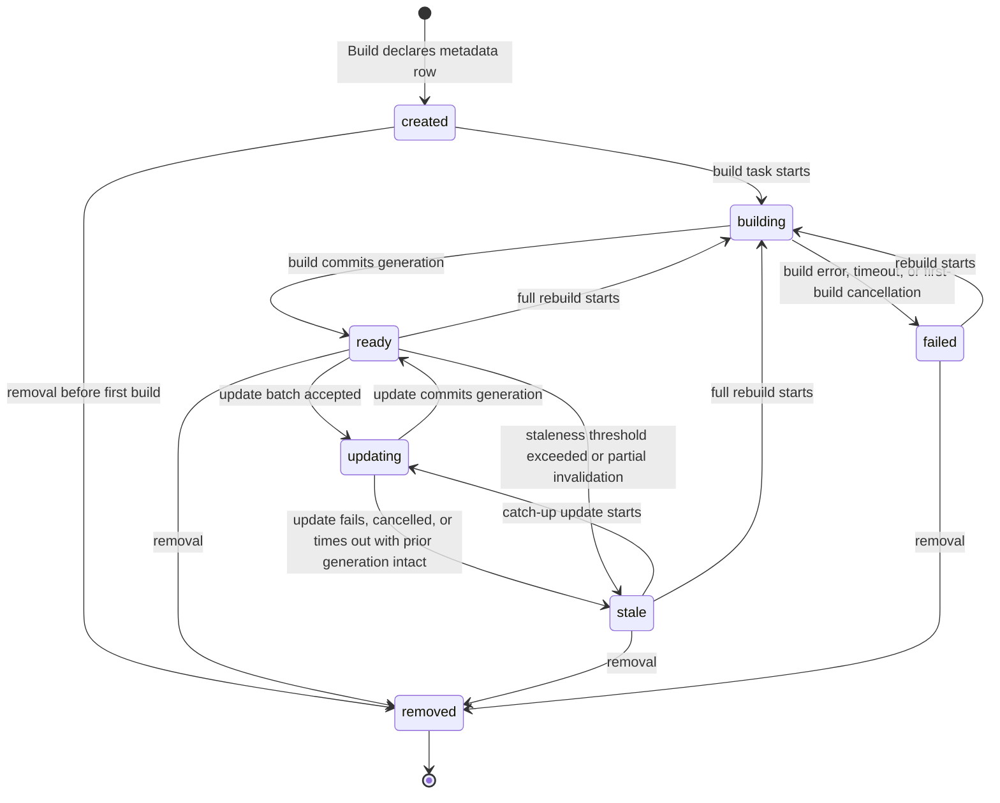

# 05 — Index State Machine

This chapter defines the full state machine for the **Index** entity — the one machine Volume
7 owns (Volume 2 chapter 09 ownership table). State names are frozen by Volume 2: `created`,
`building`, `ready`, `updating`, `stale`, `failed`, `removed`. This chapter supplies the
twelve mandatory machine elements (Volume 0 chapter 02): initial state, terminal states,
transitions, events, guards, side effects, persistence, recovery, timeouts, cancellation,
retries, and errors.

## Diagram

Prose description — components, relations, constraints: the machine has one initial state
(`created`, entered when `IndexerPort.Build` writes the metadata row), one terminal state
(`removed`), two resting states an index can legitimately occupy indefinitely (`ready`,
`stale`; `failed` is also resting per Volume 2 marking), and two mutation states (`building`,
`updating`) that are always occupied by exactly one supervised task — the single-mutator rule
of FR-IDX-001. `building` produces a whole generation from scratch; `updating` produces the
next generation from the prior one; both commit atomically, which is why every exit from a
mutation state lands in a state whose queryability is exactly known: `ready` (fresh committed
generation), `stale` (intact prior generation, known out of date), or `failed` (no committed
generation trustworthy — not queryable). `removed` is reachable from every non-mutation
state; removal during a mutation first cancels the mutator (cancellation rules below), then
removes. There are no other transitions: in particular, `failed` never moves directly to
`ready` (a rebuild must pass through `building`), and `removed` is unreachable directly from
`building`/`updating` (cancel first — visible in the transition table, not the diagram, to
keep the diagram acyclic on mutation exits).

## Transition table

| # | From | To | Trigger event | Guard | Side effects |
|---|---|---|---|---|---|
| T1 | — | `created` | `Build` call declares the index | name unique per workspace (INV-IDX-01); semantic spec names a configured embedding space (else E-IDX-002 refusal, no row) | metadata row written; `index.state.changed` |
| T2 | `created` | `building` | build task starts (scheduler dispatch) | no mutator on this index (E-IDX-007); workspace open | `index.build.started`; task registered |
| T3 | `building` | `ready` | build commits | all phases succeeded; chunk bound honored or degraded per configuration | generation 1..n committed atomically in `index.db`; `built_at`, stats updated; `index.build.completed`; `index.state.changed` |
| T4 | `building` | `failed` | build error / timeout / cancellation / crash recovery | — | partial work discarded; `last_error` recorded; `index.build.failed`; `index.state.changed` |
| T5 | `ready` | `updating` | update batch accepted | no mutator; batch non-empty after scope filtering | task registered; `index.state.changed` |
| T6 | `updating` | `ready` | update commits | affected recomputation succeeded | generation +1 atomically; `last_updated_at`, stats; `index.update.completed`; `index.state.changed` |
| T7 | `updating` | `stale` | update fails / cancelled / times out / crash recovery | prior generation intact (always true — commits are atomic) | failed batch re-queued as pending changes; `last_error`; `index.state.changed` |
| T8 | `ready` | `stale` | staleness threshold exceeded, or `Invalidate` on a partial scope | pending count or age beyond `[index.stale]` thresholds, or scope invalidated | invalidated entries marked unservable; `index.scope.invalidated`; `index.state.changed` |
| T9 | `stale` | `updating` | catch-up update starts | no mutator; provider reachable for semantic re-embedding needs (else remain `stale`) | as T5 |
| T10 | `stale` | `building` | full rebuild starts (whole-index invalidation, cache loss, layout version change) | no mutator | as T2; prior generation kept servable until T3 commit only for threshold-staleness rebuilds — cache-loss/corruption rebuilds serve nothing |
| T11 | `ready` | `building` | full rebuild requested (user command, `index_schema_version` change) | no mutator | as T2 |
| T12 | `failed` | `building` | rebuild (user command, next workspace open, or scheduled retry) | retry budget available or manual trigger | as T2 |
| T13 | `created`/`ready`/`stale`/`failed` | `removed` | removal (user command, workspace forget) | any running mutator cancelled first | metadata tombstoned; cache data dropped; `index.state.changed` |

## Machine elements

1. **Initial state** — `created` (T1). The metadata row exists before any task runs, so
   `Build`'s returned ULID is immediately valid for `Status` (port contract).
2. **Terminal states** — `removed` only. `failed` and `stale` are resting, recoverable
   states (Volume 2 marking).
3. **Transitions** — the table above is exhaustive; anything else is a defect and MUST be
   rejected by the engine with an internal-contract error (surfaced as E-IDX-001/E-IDX-007
   context, never applied to the row).
4. **Events** — every transition emits `index.state.changed` (from/to/trigger) plus the
   specific events named in the side-effects column; INV-EVT-03 (Volume 2) is satisfied by
   the generic transition event.
5. **Guards** — single mutator per index (T2, T5, T9–T12); name uniqueness and embedding
   space configuration at declaration (T1); provider reachability for semantic catch-up
   (T9); retry budget for automatic rebuilds (T12).
6. **Side effects** — generation commits, statistics and timestamp updates, pending-change
   queue mutations, cache drops on removal, and event emissions, exactly as tabled. Side
   effects listed with a commit are atomic with it: a crash between "generation committed"
   and "stats updated" is resolved by recovery recomputing stats from the committed
   generation (stats are derived data).
7. **Persistence** — the current state lives in the `state` column of `content_indexes`
   (workspace database, Volume 2 chapter 10 write discipline); generations and index data
   live in `.andromeda/index.db` (non-authoritative cache, ADR-028). State transitions
   write the metadata row transactionally with `revision` increments; the cache commit
   protocol writes the new generation fully before flipping the generation pointer, so the
   pointer flip is the atomic commit point.
8. **Recovery** — on workspace open, for each index row: state `building` with no live
   task → T4 to `failed` (first build) — the recovery event records `interrupted` as the
   cause detail, satisfying the corpus rule that interrupted work is never assumed
   complete (PRD-010); state `updating` with no live task → T7 to `stale` (prior
   generation intact by the commit protocol); cache database missing/corrupted (E-IDX-004)
   → semantic/lexical data unservable: rows in `ready`/`stale`/`updating` move to `stale`
   and a full rebuild schedules (T10), rows in `building` follow T4; `state.db` integrity
   failures are not this machine's concern (ADR-029 governs, exit code 9 upstream).
9. **Timeouts** — `[index.timeouts]` (chapter 04): builds default 1800 s, updates 300 s,
   enforced by the supervised task's context deadline (ADR-023). Timeout follows the same
   exits as cancellation: T4 from `building`, T7 from `updating`, with the timeout recorded
   in `last_error` and the error envelope (E-IDX-001 detail `timeout` for builds).
10. **Cancellation** — user cancellation (command or run cancellation propagating through
    the supervision tree, FR-ARCH-004) cancels the mutator's context: from `building` → T4
    (`failed`, cause `cancelled` — for a first build there is nothing to keep; for a
    rebuild from `ready`/`stale`, the engine restores the prior resting state instead of
    `failed` when a committed generation exists — recorded as T4 with restorative recovery
    in the same transaction, final state `stale`); from `updating` → T7 (`stale`, batch
    re-queued). Removal-during-mutation cancels first, then T13.
11. **Retries** — automatic: failed *updates* re-queue their batch and retry on the next
    change or catch-up trigger with exponential backoff (3 attempts per batch, then remain
    `stale` pending manual action or new changes); failed *builds* do not auto-retry in a
    loop — one retry is scheduled on the next workspace open, and further rebuilds are
    manual (T12 guard) — preventing crash-loop builds from burning CPU and embedding spend
    (RISK-IDX-001). Embedding batch retries inside a mutation are FR-IDX-003's (3 attempts,
    backoff) and do not drive machine transitions.
12. **Errors** — E-IDX-001 (build failure, T4), E-IDX-002 (embedding unavailability:
    refusal at T1, queueing at T9's guard), E-IDX-003 (space violation → mutation failure
    path T4/T7), E-IDX-004 (cache corruption → recovery rules), E-IDX-005 (query against
    `created`/`failed`/`removed` or unknown), E-IDX-006 (scale bound at T3's guard),
    E-IDX-007 (mutator conflict at T2/T5/T9–T12 guards). Every error carries the ADR-016
    envelope defined in chapter 04.

## Queryability by state

| State | Queryable? | Served from |
|---|---|---|
| `created` | No (E-IDX-005) | — |
| `building` | First build: no (E-IDX-005). Rebuild with a prior committed generation: yes | prior generation |
| `ready` | Yes | current generation |
| `updating` | Yes | prior committed generation (FR-IDX-001 isolation) |
| `stale` | Yes — hits carry the old generation; `Status` reports staleness | last committed generation, minus invalidated scopes (T8 side effect) |
| `failed` | No (E-IDX-005) | — |
| `removed` | No (E-IDX-005) | — |

## Requirements

### FR-IDX-006 — Index state machine conformance and recovery

- Type: Functional
- Status: Draft
- Priority: P0
- Phase: MVP
- Source: Design
- Owner: Indexing Engine (Volume 7)
- Affected components: Indexing Engine, Persistence Layer, Workspace Engine
- Dependencies: FR-IDX-001, FR-IDX-004; Volume 2 chapter 09 (frozen states); ADR-023, ADR-028
- Related risks: RISK-IDX-001

#### Description

The Indexing Engine MUST drive every Index through exactly the machine of this chapter:
the frozen state names, the exhaustive transition table T1–T13, the guards, the atomic
generation-commit protocol (pointer flip as the commit point), the recovery rules on
workspace open, the timeout and cancellation exits, and the bounded retry policy. No other
state value may ever be persisted in the `state` column, no transition outside the table
may occur, and every transition MUST emit `index.state.changed` plus its tabled events in
the same logical step as the row update.

#### Motivation

The machine is the contract that makes indexes trustworthy infrastructure: consumers
(Context Manager, search commands) reason entirely from state + generation, and crash
recovery (PRD-010) depends on every persisted state having exactly one defined meaning.

#### Actors

Indexing Engine (owner), Workspace Engine (open-time recovery trigger), Task Scheduler
(mutator supervision), consumers reading `Status`.

#### Preconditions

Workspace database available; chapter 04 configuration resolved.

#### Main flow

1. Lifecycle operations trigger table transitions under their guards.
2. Each transition persists the row (state, `revision`, stats/timestamps as tabled) and
   emits its events.
3. Recovery on open reconciles rows against live tasks per element 8.

#### Alternative flows

- Guard rejection (mutator conflict, unreachable provider): the request is rejected or
  queued per the guard's rule; the state does not change.
- Restorative cancellation of a rebuild (element 10): the prior resting state returns in
  the same transaction that ends the mutator.

#### Edge cases

- Crash exactly between cache pointer flip and metadata row update: recovery observes a
  committed generation newer than the row's — it completes the row update forward
  (the pointer flip is the commit point; the row is derived).
- Two processes opening one workspace: the Volume 10 single-writer rules over the
  workspace database serialize recovery; the engine takes the mutator role in at most one
  process.
- Removal racing a mutator start: T13's cancel-first rule wins; the mutator observes
  cancellation before its first commit.

#### Inputs

Port calls, scheduler task outcomes, watch feeds, timeouts, cancellations, recovery scans.

#### Outputs

Persisted state trajectories, generations, events, `Status` reports.

#### States

The frozen seven, exactly as tabled — this requirement is the machine.

#### Errors

E-IDX-001..007 mapped per machine element 12.

#### Constraints

Exhaustive transitions; atomic commits; single mutator; recovery idempotence (running
recovery twice changes nothing the second time).

#### Security

State and generation are non-sensitive; recovery never rebuilds scope beyond what the
row's `scope_config` grants (a corrupted cache cannot trick the engine into indexing
excluded paths).

#### Observability

`index.state.changed` on every transition with trigger attribution; recovery emits its
transitions with cause `interrupted`; state-duration metrics.

#### Performance

Transitions are single-row transactions plus event emission; recovery is O(indexes) at
open with rebuilds deferred to background tasks (Volume 12 open-time budget applies).

#### Compatibility

Identical machine on all Tier 1 platforms; state names appear verbatim in CLI/TUI output
and the IPC surface (frozen-name rule, Volume 2).

#### Acceptance criteria

- Given any sequence of port calls, watch feeds, and injected faults, when states are
  sampled continuously, then only the frozen seven values and only tabled transitions are
  observed (conformance case, property-tested).
- Given a crash during a first build, when the workspace reopens, then the index is
  `failed` with cause `interrupted`, one rebuild is scheduled, and no partial generation
  is queryable (recovery + negative case).
- Given a crash during an update, when the workspace reopens, then the index is `stale`,
  the prior generation answers queries, and the interrupted batch is re-queued (recovery
  case).
- Given a cancelled rebuild of a `ready` index, when the cancellation lands, then the
  index rests in `stale` with its committed generation intact (restorative cancellation
  case).
- Given a timed-out build, when the deadline passes, then the mutator terminates within
  the ADR-023 teardown discipline, the state is `failed` with detail `timeout`, and
  `index.build.failed` is observed (timeout + observability case).
- Given recovery executed twice, when the second pass runs, then zero transitions occur
  (idempotence case).

#### Verification method

State-machine property suite driving randomized operation/fault sequences against the
transition table (Volume 13); crash-injection per NFR-IDX-002's harness; recovery
idempotence tests; event-completeness assertions per transition.

#### Traceability

PRD-010; Volume 2 chapter 09 (Index enum, ownership); NFR-IDX-002; FR-IDX-001, FR-IDX-004;
ADR-023, ADR-028.
