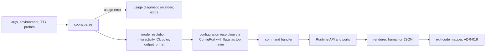

# 01 — CLI Architecture

This chapter defines the architecture of the `andromeda` command-line interface: its position
in the Volume 3 layering, its execution pipeline, the complete command tree, the grammar that
governs every command name and invocation shape (keystone FR-CLI-001), the mediation rules
that keep the CLI free of business logic, the hand-off to the TUI, and the extension-command
surface. Chapters [02](02-cli-conventions.md) (conventions), [03](03-cli-commands-core.md)–
[06](06-cli-commands-maintenance.md) (command specifications) build on the rules fixed here.

## Position in the architecture

The CLI is an **L4 driver** (ADR-030; Volume 3, chapter 06): it translates invocations into
Runtime API calls and port calls, renders results, and maps outcomes to exit codes. It is
built on cobra with pflag (ADR-005), holds no persistent state of its own, contains no
business logic, and never touches an L3 adapter directly. One process invocation executes one
command (Volume 3 concurrency note); the interactive TUI is a separate driver in the same
binary that the root command hands off to (FR-CLI-003).

The CLI consumes:

- the **Runtime API** for everything that executes agents, sessions, runs, plans, workflows,
  and context operations;
- **ConfigPort** — parsed flag values are handed to the Configuration Manager as the
  highest-precedence layer (ADR-005 rule 2); command handlers read resolved configuration,
  never raw flags, for any value that also exists in `andromeda.toml`;
- **AuthPort** (`auth` family), **GitPort** (`git` family), **MemoryStorePort** (`memory`,
  `export`), **IndexerPort** (`index`), **UpdaterPort** (`update`), **PackagePort**
  (`plugin`, `skill`, `mcp` installation surfaces);
- **EventBusPort** subscriptions for live output during streaming commands;
- **PermissionPort** indirectly: in interactive mode the CLI registers the plain-terminal
  approval presenter (Volume 3, chapter 06 internal API); in non-interactive mode no
  presenter exists and permission resolution is policy-only (PRD-009, ADR-102).

## Execution pipeline



The pipeline stages, in order:

1. **Parse.** cobra/pflag parses argv against the declarative command tree. Unknown
   commands, unknown flags, and arity violations terminate with E-CLI-001 or E-CLI-002 and
   exit code 2 before any other stage runs.
2. **Mode resolution.** Interactivity (ADR-102 order), CI mode, color (ADR-103 order), and
   output format (`--json`) are each resolved once, producing an immutable invocation-mode
   record that `--debug` prints and every later stage consults. No stage re-probes the
   terminal.
3. **Configuration resolution.** Parsed flag values enter the Configuration Manager as the
   highest-precedence layer; the handler receives resolved configuration with source
   attribution (ConfigPort semantics). Configuration errors terminate with the E-CFG family
   (Volume 10) and exit code 3.
4. **Handler execution.** The handler calls the Runtime API or ports with a context derived
   from the process signal handlers, so `interrupt` cancels in-flight work end-to-end
   (FR-ARCH-004) and the Volume 3 shutdown ordering applies.
5. **Rendering.** Exactly one renderer runs per invocation — human or JSON (FR-CLI-006) —
   writing payload to stdout and diagnostics to stderr (FR-CLI-007).
6. **Exit.** The exit-code mapper translates the terminal outcome — success, or one error
   envelope — to the closed ADR-016 scheme. Every command's specification states its
   producible exit codes (Volume 0 rule).

The diagram and stages above describe one relation set: parse feeds mode resolution; mode
resolution and configuration feed the handler; the handler alone reaches the Runtime API and
ports; rendering and exit-code mapping are downstream of the handler and never invoke
runtime work of their own. The constraint the pipeline enforces is single-direction flow —
renderers cannot trigger execution, and handlers cannot write to streams except through the
renderer.

## The command tree

The complete top-level tree, with the owning specification chapter for each family:

```text
andromeda                                        root: TUI hand-off          ch 03
├── run        <goal> | --resume                 execute an agent run        ch 03
├── plan       new | list | show | approve | reject                          ch 03
├── exec       tool | command                    single mediated execution   ch 03
├── init                                         initialize a workspace      ch 03
├── session    list | show | resume | end        session management          ch 03
├── config     get | set | unset | list | validate | path | edit             ch 03
├── auth       login | logout | status | list | rotate                       ch 03
├── provider   list | show | add | remove | test | enable | disable          ch 04
├── model      list | show | capabilities | default                          ch 04
├── tool       list | show | enable | disable | test                         ch 04
├── plugin     list | show | install | uninstall | enable | disable          ch 04
├── skill      list | show | install | uninstall | enable | disable          ch 04
├── workflow   list | show | run | status | resume | cancel | validate       ch 04
├── mcp        list | show | add | remove | enable | disable | status | tools ch 04
├── memory     search | show | add | delete | export                         ch 05
├── context    show | pin | unpin | exclude                                  ch 05
├── index      build | update | status | search | invalidate | remove        ch 05
├── git        status | diff | log | stage | unstage | commit | branch | switch | apply  ch 05
├── logs                                         query and follow logs       ch 05
├── trace      list | show                       inspect run traces          ch 05
├── export     session | run | memory | audit    data portability            ch 05
├── doctor                                       environment diagnostics     ch 06
├── update     (default) | check | rollback      self-update                 ch 06
├── version                                      version information         ch 06
├── completion bash | zsh | fish                 completion scripts          ch 06
└── x          <extension> <command> …           reserved extension mount    FR-CLI-004
```

The `session` group is a recorded grammar addition beyond the brief's minimum command list:
session listing, resumption, and closure are required non-interactively by PRD-009 and
PRD-010 (UC-11 must be executable in automation, not only in the TUI), and no mandated
command exposes them. The addition is recorded in this volume's register.

## Requirements

### FR-CLI-001 — CLI command grammar

- Type: Functional
- Status: Draft
- Priority: P0
- Phase: Core
- Source: Provided
- Owner: CLI (Volume 8)
- Affected components: CLI; Extension SDK (manifest-declared commands); all volumes that name CLI commands
- Dependencies: ADR-005, ADR-100, ADR-104, ADR-015 (stability regime); FR-ARCH-003 discipline applied to the command surface
- Related risks: RISK-CLI-001

#### Description

The `andromeda` command surface is exactly the tree above, governed by this grammar:

```text
invocation    = "andromeda" , { flag } , [ command-path ] , { positional | flag } ,
                [ "--" , { passthrough } ] ;
command-path  = name , { name } ;            (* depth ≤ 3 below the binary name *)
flag          = "--" long-name [ "=" value | " " value ] | "-" short-char [ " " value ] ;
name          = lowercase ASCII word, no abbreviations ;
long-name     = kebab-case lowercase ASCII ;
```

Grammar rules, all normative:

1. Resource groups use singular nouns; their subcommands come from the closed shared verb
   vocabulary `list`, `show`, `add`, `remove`, `install`, `uninstall`, `enable`, `disable`,
   `test`, `status`, `validate`, `search`, `export` — one meaning per verb corpus-wide.
   Domain verbs outside this set are permitted only where the tree above declares them
   (e.g., `commit` under `git`, `rotate` under `auth`, `pin` under `context`).
2. Action leaf commands (`run`, `plan new`, `exec`, `init`, `logs`, `export`, `doctor`,
   `update`, `version`, `completion`) take their operand as positional arguments; resource
   subcommands take the resource identifier as their first positional.
3. Flags follow GNU conventions via pflag: `--long`, `--long=value`, `--long value`;
   single-character short flags exist only for the frozen set defined in FR-CLI-005.
   `--` terminates flag parsing; everything after it is passthrough where the command
   accepts passthrough (`exec command`), and a usage error (E-CLI-002) where it does not.
4. Entity references accept a full ULID (ADR-027) or a unique prefix of at least six
   characters; an ambiguous prefix fails with E-CLI-002 listing the candidates.
5. Command paths, flag names, and defaults are public contract under the SM-20 regime:
   removals and renames require a DEPRECATED alias emitting a warning for at least one
   minor release before removal. There are no aliases otherwise (ADR-100).
6. The top-level namespace is closed: new top-level commands require amending this
   requirement through the Volume 0 change procedure; extensions mount only under `x`
   (FR-CLI-004). `help`, `completion`, `x`, and cobra's hidden completion machinery are
   reserved names.
7. Every command MUST support `--help` and `--json` (FR-CLI-006) and MUST declare its
   producible exit codes in this volume.

#### Motivation

The grammar is the CLI's contract with humans and scripts (PRD-008, PRD-009). Fixing it as
a closed, testable vocabulary makes twenty-plus command families — authored in parallel
chapters and extended by third parties — one predictable language, and makes grammar drift
a lint/test failure instead of a review judgment (ADR-100 rationale).

#### Actors

Users at terminals; scripts and CI; extension authors (via FR-CLI-004); documentation and
completion generators; grammar golden tests.

#### Preconditions

The binary is installed and invocable; no workspace, configuration, or network is required
to parse any invocation.

#### Main flow

1. A caller composes an invocation from the tree and grammar rules.
2. cobra parses it against the declarative tree; the mode record is resolved.
3. The named command executes per its chapter 03–06 specification.

#### Alternative flows

- `andromeda help <path>` and `andromeda <path> --help` render the same generated help for
  any tree node, exit 0.
- A DEPRECATED alias resolves to its replacement, executes it, and emits a deprecation
  warning on stderr plus a `warnings` entry in JSON output.

#### Edge cases

- Empty invocation (`andromeda` with no command): root behavior per FR-CLI-003.
- Unknown command: E-CLI-001, exit 2, with a "did you mean" suggestion when the edit
  distance to a known name is 1–2; suggestions never auto-execute.
- Unknown flag on a known command: E-CLI-001, exit 2.
- A ULID prefix shorter than six characters: E-CLI-002 even if unique, so scripts do not
  come to depend on prefixes that new rows can invalidate.
- Depth-4 path attempts (`andromeda git branch create extra`): parsed as arguments of the
  depth-3 command and validated by its arity rules.

#### Inputs

argv; the declarative command tree; the shared verb vocabulary; extension registry rows
(for the `x` subtree only).

#### Outputs

A parsed, validated invocation bound to exactly one command handler, or a usage diagnostic
with exit code 2.

#### States

None. Parsing is stateless and side-effect-free; no entity state machine is involved.

#### Errors

E-CLI-001 (unknown command or flag), E-CLI-002 (invalid argument), both defined in chapter
[02](02-cli-conventions.md); no other errors can originate in the grammar layer.

#### Constraints

Parsing MUST NOT perform I/O beyond reading argv and environment: no configuration load, no
workspace discovery, no network, no database open before a command is bound. cobra types
stay confined to the CLI package (ADR-005 reversal plan discipline).

#### Security

The grammar layer runs before permission evaluation; it MUST NOT execute anything.
Suggestion output for unknown commands MUST NOT echo argv content beyond the mistyped word
(argv can contain secrets passed by mistake).

#### Observability

`cli.command.started` carries the resolved command path and mode record; usage failures
emit `cli.command.failed` with E-CLI-001/E-CLI-002 before exit (chapter 02 events table).

#### Performance

Grammar parse and tree assembly lie on the cold-start path budgeted by Volume 12 (SM-06a);
the `x` subtree assembly reads local registry rows only.

#### Compatibility

The tree and grammar are identical on all Tier 1 platforms; shell-specific behavior exists
only inside generated completion scripts (FR-CLI-012).

#### Acceptance criteria

- Given the published tree, when grammar golden tests enumerate every path, then each parses
  to its handler and every verb used by a resource group appears in the shared vocabulary
  or the declared domain-verb list.
- Given `andromeda provdier list` (typo), when parsed, then exit code is 2, stderr names
  E-CLI-001 and suggests `provider`, and nothing executes.
- Given any command with `--json --help`, when invoked, then help renders and exit code is
  0 (help wins; no usage error).
- Given a release that renames a command path, when the old path is invoked during the
  deprecation window, then it executes the new handler and emits the deprecation warning;
  after the window, it fails as unknown (negative case).
- Observability: given any parse failure, when it terminates, then `cli.command.failed`
  was emitted with the error code and no permission was evaluated.

#### Verification method

Grammar golden tests over the full tree (Volume 13 CLI suite); fuzzing of argv against the
parser (no panics, only E-CLI-001/002); contract-diff of the tree between releases per
SM-20; consolidation audit that chapters 03–06 specify every tree node.

#### Traceability

PRD-008, PRD-009; ADR-005, ADR-100, ADR-104; SM-20; UC-07; brief command-list mandate
(Provided).

### FR-CLI-002 — Runtime mediation and driver parity

- Type: Functional
- Status: Draft
- Priority: P0
- Phase: Core
- Source: Design
- Owner: CLI (Volume 8)
- Affected components: CLI; Runtime; all engines reached through the Runtime API
- Dependencies: FR-ARCH-002 (composition), FR-ARCH-004 (cancellation); ADR-030; PRD-009
- Related risks: RISK-CLI-001

#### Description

Every CLI command effects its behavior exclusively through the Runtime API and the Volume 3
ports listed in this chapter. The CLI MUST NOT: implement business logic (planning,
execution, permission evaluation, provider selection); import or invoke L3 adapters
directly; persist state of its own; or bypass the Permission Manager for any side-effecting
operation. Capabilities are driver-symmetric: a capability exposed by a CLI command MUST be
reachable through the Runtime API such that the TUI and the IPC surface (FR-ARCH-007) can
expose the same capability, and features MUST NOT exist in only one driver unless this
volume explicitly scopes them (Volume 3, chapter 06 parity note).

#### Motivation

Parity is structural or it is fiction (PRD-009): if a command grows logic of its own, the
same operation behaves differently in CI, TUI, and IPC — the exact failure mode ADR-032
rejects. Mediation also keeps the CLI testable as a thin translation layer.

#### Actors

CLI command handlers; Runtime; TUI and IPC drivers (parity beneficiaries); reviewers and CI
enforcing the dependency matrix (ADR-033).

#### Preconditions

The Runtime API and ports of Volume 3 are constructed by the composition root.

#### Main flow

1. A handler validates rendered-input shape only (arity, formats).
2. It calls Runtime API/port methods with a signal-derived context.
3. It renders returned values/streams; the exit-code mapper closes out.

#### Alternative flows

- Streaming commands subscribe via EventBusPort and render events as they arrive,
  interleaved with the port call's returned stream where both exist.

#### Edge cases

- Operations the Runtime rejects (permission denial, capability unavailable) render as
  structured outcomes — the CLI never retries or "fixes up" runtime decisions.
- A port method that blocks past `--timeout` is cancelled through its context; the CLI
  never abandons a call without cancellation (FR-ARCH-004).

#### Inputs

Validated invocations; resolved configuration; Runtime API results and event streams.

#### Outputs

Rendered output and exit codes only; no files, rows, or sockets owned by the CLI layer.

#### States

None owned. The CLI observes entity states (frozen vocabularies, Volume 2 chapter 09) and
renders them verbatim — state names in output MUST be the frozen names.

#### Errors

Runtime/port errors pass through with their owning family's code and mapped exit code;
CLI-originated errors are confined to the E-CLI family (chapter 02).

#### Constraints

Dependency rules enforced per ADR-033 (depguard: the CLI package imports L2 via the Runtime
API and ports only). Handlers MUST be constructible without global state (ADR-005
testability convention).

#### Security

All permission evaluation happens in the Permission Manager; the CLI's only security role
is presentation (approval prompts in interactive mode) and honest rendering of denials.
The CLI MUST NOT widen, cache, or replay permission decisions.

#### Observability

Command lifecycle events (chapter 02); every Runtime call carries the invocation's
correlation ID so CLI-initiated work joins the SM-13 chain.

#### Performance

The CLI adds rendering and parsing overhead only; streaming render overhead is bounded by
the SM-08 budget (Volume 12 formalizes).

#### Compatibility

Identical mediation on all Tier 1 platforms; no platform-conditional handler logic outside
the PAL (Volume 3, chapter 07).

#### Acceptance criteria

- Given the import graph, when ADR-033 checks run, then the CLI package has no L3 adapter
  or engine-internal imports (negative case: a synthetic violating import fails CI).
- Given the same operation issued via CLI and via the IPC surface with equal policy, when
  both complete, then persisted records differ only in driver identity fields (parity
  record-comparison per FR-ARCH-008 verification).
- Given a permission denial, when a CLI command triggers it, then the command renders the
  structured denial, exits 5, and no side effect occurred.
- Observability: given any side-effecting CLI command, when audited, then its records chain
  to a permission decision per SM-13.

#### Verification method

Dependency-rule CI checks (ADR-033); CLI/IPC parity record-comparison tests; permission
mediation enforcement tests (SM-16b); code review against the Volume 3 component table.

#### Traceability

PRD-001, PRD-005, PRD-009; FR-ARCH-002, FR-ARCH-007, FR-ARCH-008; ADR-030, ADR-032,
ADR-033.

### FR-CLI-003 — Root command and TUI hand-off

- Type: Functional
- Status: Draft
- Priority: P1
- Phase: MVP
- Source: Provided
- Owner: CLI (Volume 8)
- Affected components: CLI; TUI
- Dependencies: FR-CLI-001; ADR-102 (interactivity resolution); ADR-006 (TUI stack); FR-TUI-001 (TUI shell, this volume chapter 07)
- Related risks: RISK-CLI-002

#### Description

`andromeda` with no command is the TUI entry point. Behavior of the bare invocation:

1. If the invocation resolves interactive (ADR-102) **and** stdout is a terminal **and**
   `TERM` is neither `dumb` nor unset, the CLI hands control to the TUI driver in the same
   process: it finalizes CLI-side rendering, emits `cli.tui.launched`, and transfers the
   resolved mode record, workspace path, and profile to the TUI shell (chapter 07). The
   hand-off is a control transfer, not a widget import (Volume 3 prohibited-dependency
   rule).
2. Otherwise, the CLI prints short usage (command groups, one line each) to stderr and
   exits 2 — a bare invocation in a non-interactive context is an ambiguous request, not a
   TUI candidate.
3. `andromeda --help` prints full generated help to stdout, exit 0. `andromeda --version`
   is an alias for `andromeda version` (the single sanctioned flag-form alias, frozen
   here).

Global flags valid on the bare invocation (`--workspace`, `--profile`, `--config`,
`--color`, `--debug`) pass into the TUI session unchanged.

#### Motivation

The brief mandates `andromeda` as a command; the product's primary interactive surface is
the TUI (PRD-008). Launching it from the bare name gives the TUI the discoverability of
the product name itself while keeping scripted contexts deterministic (exit 2, not a hung
full-screen program in a pipeline).

#### Actors

Users at terminals; scripts that mistakenly invoke the bare name (served by branch 2); the
TUI shell.

#### Preconditions

None beyond installation. Workspace discovery happens after hand-off (the TUI's start
screen handles no-workspace contexts, chapter 09).

#### Main flow

1. User runs `andromeda` in a terminal.
2. Mode resolution confirms interactivity and terminal adequacy.
3. `cli.tui.launched` is emitted; the TUI shell takes over the terminal.

#### Alternative flows

- `andromeda` piped into a file or run in CI: usage to stderr, exit 2, nothing launched.
- `TERM=dumb andromeda`: branch 2 applies even on a TTY (the TUI cannot render).

#### Edge cases

- Terminal smaller than the TUI minimum (80×24, chapter 07): the hand-off still occurs;
  small-terminal behavior is the TUI's contract (FR-TUI-001), not a CLI refusal.
- `--json` with no command: usage error E-CLI-002, exit 2 — there is no JSON rendering of
  "launch a full-screen program".
- Hand-off failure (TUI initialization error): the error renders through the CLI error
  path (FR-UX-001) with the E-TUI family code and its mapped exit code.

#### Inputs

argv (bare), mode record, environment (`TERM`), TTY probes.

#### Outputs

Either a running TUI session (exit code determined by TUI session end) or usage text with
exit 2.

#### States

None owned; the TUI session's Session entity states are Volume 4's.

#### Errors

E-CLI-002 for `--json` on the bare invocation; E-TUI family (chapter 07) after hand-off.

#### Constraints

The hand-off MUST occur before any workspace database is opened, so the TUI owns the full
open/recovery flow exactly as it would when launched any other way.

#### Security

Branch 2 (non-interactive) MUST NOT auto-launch anything; a full-screen takeover of a
non-TTY stream is an output-corruption hazard, and refusal is the safe default.

#### Observability

`cli.tui.launched` with terminal dimensions and color tier; branch-2 refusals emit
`cli.command.failed` with E-CLI-002.

#### Performance

Bare-invocation-to-TUI-interactive falls under the SM-06b budget (Volume 12).

#### Compatibility

Identical on Tier 1 platforms; `TERM` handling is POSIX-terminal semantics via the PAL
terminal surface.

#### Acceptance criteria

- Given an interactive terminal, when `andromeda` is invoked bare, then the TUI launches
  and `cli.tui.launched` is emitted with the mode record.
- Given `andromeda | cat`, when invoked, then stderr carries short usage, exit code is 2,
  and no TUI escape sequences reach stdout (negative case).
- Given `TERM=dumb`, when invoked bare on a TTY, then branch 2 applies.
- Given `andromeda --version`, when invoked, then output equals `andromeda version` output
  byte-for-byte in both human and JSON modes.

#### Verification method

teatest-driven launch tests (ADR-017); pipe/CI matrix tests asserting exit 2 and clean
stdout; golden comparison of `--version` alias; SM-06b benchmark harness.

#### Traceability

PRD-008; UC-01 (entry), UC-11 (resume entry); ADR-006, ADR-102; FR-TUI-001.

### FR-CLI-004 — Extension-contributed commands

- Type: Functional
- Status: Draft
- Priority: P2
- Phase: Beta
- Source: Design
- Owner: CLI (Volume 8)
- Affected components: CLI; Plugin Runtime; Package Manager; Extension SDK
- Dependencies: ADR-104, ADR-009; FR-CLI-001 (reserved `x` namespace); FR-PLUG-001 (plugin runtime, Volume 6); FR-SEC-100 (permission model, Volume 9)
- Related risks: RISK-CLI-001

#### Description

Installed extensions that declare commands in their manifest (format owned by Volume 6)
appear under `andromeda x <extension-name> <command> [args…]` per ADR-104. The CLI
assembles the `x` subtree at startup from local Extension registry rows; declared help,
arguments, and flags render through the standard help system labeled with the extension's
name, origin, and trust level. Invocation dispatches through the Plugin Runtime over the
Andromeda Runtime Protocol; global flags are parsed by Andromeda and never forwarded;
output uses the FR-CLI-006 envelope with extension payload under `data`; all side effects
pass the Permission Manager under the extension's granted permissions.

#### Motivation

Commands are a named extension surface (Principle 6, PRD-007). A structural namespace makes
third-party growth collision-free and visibly trust-bounded (ADR-104 rationale).

#### Actors

Extension authors; users invoking extension commands; Plugin Runtime; Package Manager.

#### Preconditions

The extension is installed (`installed` package state) and its plugin can start.

#### Main flow

1. Startup assembly reads Extension rows and mounts declared commands under `x`.
2. `andromeda x fmt-suite check --json` parses, resolves modes, and dispatches over ARP.
3. Results render through the standard envelope; exit code maps per ADR-016.

#### Alternative flows

- Plugin not running: the Plugin Runtime starts it per its machine (`registered` →
  `starting` → `running`); startup failure surfaces the E-PLUG family error and exit code
  6.
- `andromeda x` alone lists installed extension commands with origins and trust levels.

#### Edge cases

- Extension uninstalled between assembly and dispatch: E-CLI-004 with a refreshed listing
  hint.
- Manifest declares a flag colliding with a global flag name: registration is rejected at
  install time (Volume 6 validation), so the collision cannot reach the parser.
- Two installed extensions with the same command word: no conflict — paths differ by
  extension name.

#### Inputs

Extension registry rows; manifest command declarations; user argv.

#### Outputs

Envelope-wrapped extension results; help listings with provenance labels.

#### States

Plugin states (frozen, Volume 2) observed during dispatch; the CLI owns none.

#### Errors

E-CLI-004 (extension command unavailable, chapter 02); E-PLUG family (Volume 6) for
protocol/runtime failures, exit code 6.

#### Constraints

The `x` subtree is assembled from local rows only — no network, no filesystem scanning
beyond the registry. Extension commands cannot register at top level, cannot shadow
built-ins, and cannot claim global flag names (structural, per ADR-104).

#### Security

Extension command dispatch is tool-equivalent: permission declarations come from the
manifest, evaluation from the Permission Manager, execution inside the plugin's sandbox
profile (Volume 9). Help output always shows trust level so invocation is informed.

#### Observability

`cli.command.started`/`completed`/`failed` carry the extension identity; ARP dispatch
produces the plugin observability Volume 6 defines.

#### Performance

Assembly cost is proportional to installed extensions and lies on the cold-start budget;
unavailable-plugin detection must not add network or retry delays at parse time.

#### Compatibility

Extension commands inherit CLI conventions mechanically; a manifest cannot opt out of
`--json`, exit-code mapping, or permission mediation.

#### Acceptance criteria

- Given an installed extension declaring `check`, when `andromeda x <name> check --json`
  runs, then output is a valid FR-CLI-006 envelope and the run's records chain to the
  extension's permission grants.
- Given an extension attempting to register `auth` at top level, when installed, then
  registration fails at validation and the top-level tree is unchanged (negative case).
- Given a stopped plugin, when its command is invoked, then the plugin starts through its
  frozen states or the invocation fails with the E-PLUG family and exit 6 — never a hang.
- Permission case: given an extension command whose declared permission is not granted,
  when invoked non-interactively, then denial is recorded and exit code is 5.

#### Verification method

Extension-command conformance suite in the SDK fixtures (Volume 6); namespace-closure
tests; permission mediation tests over extension origins (SM-16b); help-labeling golden
tests.

#### Traceability

PRD-005, PRD-007; Principle 4, Principle 6; ADR-104, ADR-009; FR-PLUG-001, FR-SEC-100.

## Risks

### RISK-CLI-001 — Grammar and surface sprawl across releases

- Category: Product / process
- Probability: Medium
- Impact: High
- Severity: High
- Mitigation: closed top-level namespace and closed verb vocabulary under change control (FR-CLI-001, ADR-100); extension mount confined to `x` (ADR-104); SM-20 contract-diff over the tree per release; grammar golden tests fail on undeclared verbs or paths
- Detection: contract-diff reports; grammar golden test failures; consolidation audit of chapters 03–06 against the tree
- Owner: CLI (Volume 8)
- Status: Open

The failure mode is cumulative: each release adds "one obvious command" or "one convenient
alias" until the surface is inconsistent and un-renameable — the pattern is endemic in
long-lived CLIs. The controls make additions expensive by construction: anything new must
amend FR-CLI-001 through the change procedure, and anything inconsistent fails mechanical
checks rather than relying on reviewer vigilance.

### RISK-CLI-002 — TUI hand-off misdetection corrupting scripted output

- Category: Technical
- Probability: Low
- Impact: Medium
- Severity: Medium
- Mitigation: hand-off requires all three conditions (interactive resolution, stdout TTY, adequate `TERM`); refusal branch is the default; ADR-102's explicit signals always available to force non-interactive behavior
- Detection: pipe/CI matrix tests asserting clean stdout and exit 2; field reports of escape sequences in captured output
- Owner: CLI (Volume 8)
- Status: Open

A full-screen program writing to a misdetected stream corrupts captured output and can hang
pipelines. The conjunction of three independent checks plus deterministic overrides bounds
the probability; the matrix test detects regressions before release.
