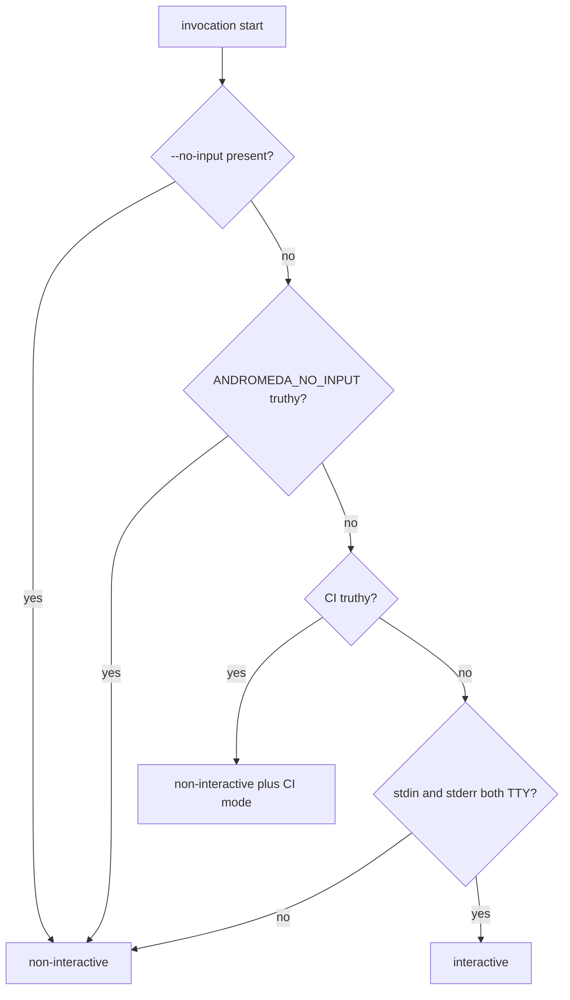

# 02 — CLI Conventions

This chapter fixes the conventions every command in chapters [03](03-cli-commands-core.md)–
[06](06-cli-commands-maintenance.md) obeys: global flags, exit-code application, the dual
human/JSON output contract, stream discipline, verbosity modes, non-interactive and CI
behavior, confirmations, environment variables, shell completion, presentation standards,
the `[cli]` configuration keys, the `cli.*` event family, and the E-CLI error catalog.
Command specifications state only their deltas from this chapter.

## Global flags

Global flags are accepted by every command (and, where noted, the bare root invocation).
The short-flag set below is frozen; new short flags require amending FR-CLI-005.

| Flag | Short | Value | Effect |
|---|---|---|---|
| `--help` | `-h` | — | Generated help for the node; exit 0 |
| `--json` | — | — | Structured output per FR-CLI-006 |
| `--quiet` | `-q` | — | Suppress informational stderr (FR-CLI-008) |
| `--verbose` | `-v` | — | Diagnostic detail on stderr (FR-CLI-008) |
| `--debug` | — | — | Debug diagnostics; implies `--verbose` |
| `--no-input` | — | — | Force non-interactive mode (ADR-102) |
| `--yes` | `-y` | — | Auto-confirm destructive confirmations (FR-CLI-010) |
| `--approve-destructive` | — | — | Per-invocation consent for class-D destructive git operations in non-interactive contexts (FR-CLI-010, Volume 11) |
| `--workspace` | `-C` | path | Workspace root override (before discovery) |
| `--profile` | — | name | Configuration Profile selection |
| `--config` | — | path | Explicit configuration file (ConfigPort layer input) |
| `--color` | — | `auto`\|`always`\|`never` | Styling override (ADR-103) |
| `--timeout` | — | duration | Whole-invocation deadline; expiry cancels and exits 8 |
| `--version` | — | — | Root only; alias of `andromeda version` (FR-CLI-003) |

## Exit codes

The closed exit-code scheme is Volume 0's (chapter 03; ADR-016). CLI application rules:

1. Exactly one exit code per invocation, taken from the exit-code mapping of the error
   envelope that terminated the command; success is 0.
2. Commands that continue past per-item failures (`--json` batch listings, `doctor`) record
   per-item outcomes in `data` and exit with the code of the **most severe** class
   encountered, using the fixed severity order `9 > 5 > 4 > 3 > 7 > 6 > 8 > 2 > 1`
   (integrity, permission, authentication, configuration, provider, tool, timeout, usage,
   general).
3. Signals: `interrupt` during execution cancels work (FR-ARCH-004) and exits 8 unless the
   command completed before cancellation took effect.
4. Every command specification in chapters 03–06 states its producible exit codes; a code
   observed outside a command's declared set is a defect (Volume 13 asserts this in the CLI
   suite).

## Requirements: invocation conventions

### FR-CLI-005 — Global flags and invocation modes

- Type: Functional
- Status: Approved
- Priority: P0
- Phase: Core
- Source: Design
- Owner: CLI (Volume 8)
- Affected components: CLI; Configuration Manager (flag layer)
- Dependencies: FR-CLI-001; ADR-005, ADR-102, ADR-103; FR-CFG-001 (precedence, Volume 10)
- Related risks: RISK-CLI-003

#### Description

Every command accepts the global flag set above with identical semantics. Flag values that
correspond to configuration keys enter the Configuration Manager as the highest-precedence
layer (Volume 10 precedence; ADR-005 rule 2). Mode-affecting flags (`--json`, `--quiet`,
`--verbose`, `--debug`, `--no-input`, `--yes`, `--color`, `--timeout`) are resolved once
into the invocation-mode record (chapter 01 pipeline) and are immutable for the invocation.
Contradictory modes fail: `--quiet` with `--verbose` or `--debug` is E-CLI-006, exit 2.
`--timeout` accepts Go-style durations (`30s`, `5m`, `1h30m`); `0s` means no deadline.

#### Motivation

Uniform global flags are what make the surface learnable once and scriptable generically
(PRD-008, PRD-009); routing values through ConfigPort keeps precedence single-homed.

#### Actors

All callers; the Configuration Manager; command handlers reading the mode record.

#### Preconditions

None; global flags parse before any I/O.

#### Main flow

1. pflag parses global and command flags together.
2. Mode record is resolved; config-relevant values enter the flag layer.
3. The handler executes under the mode record.

#### Alternative flows

- `--help` anywhere in argv renders help and exits 0, overriding other flags.

#### Edge cases

- Repeated scalar flags: last occurrence wins (pflag semantics), and `--debug` notes the
  override.
- `--timeout` shorter than fixed internal floors still applies; work is cancelled and exit
  is 8 (no silent extension).
- `--yes` in interactive mode: valid; confirmations are auto-answered and logged as such.

#### Inputs

argv; environment (for defaulting per FR-CLI-011).

#### Outputs

The immutable mode record; the flag configuration layer.

#### States

None.

#### Errors

E-CLI-001, E-CLI-002, E-CLI-006 (this chapter).

#### Constraints

No command may redefine a global flag name or short form for local purposes; extension
manifests cannot claim them (FR-CLI-004).

#### Security

`--config` and `--workspace` accept attacker-visible paths in shared environments; both
resolve through the PAL and the Configuration Manager's validation — the CLI itself never
loads or executes content from them.

#### Observability

The mode record (minus values, plus flag names) is part of `cli.command.started`.

#### Performance

Flag parsing is on the SM-06a cold-start budget (Volume 12).

#### Compatibility

Identical across Tier 1 platforms and inside extension commands.

#### Acceptance criteria

- Given any command in the tree, when invoked with each global flag, then behavior matches
  this section (matrix test).
- Given `--quiet --verbose`, when invoked, then exit is 2 with E-CLI-006 (negative case).
- Given `--timeout 50ms` on a long operation, when it expires, then the operation is
  cancelled through its context, records show `cancelled`, and exit is 8.
- Given `--config ./custom.toml`, when resolved, then ConfigPort source attribution names
  that file for values it supplied (observability case).

#### Verification method

Global-flag matrix tests over the full tree; golden help output; cancellation tests with
short timeouts; ConfigPort attribution assertions (Volume 13 CLI suite).

#### Traceability

PRD-008, PRD-009; ADR-005, ADR-102, ADR-103; FR-CFG-001; SM-06.

### FR-CLI-006 — Structured JSON output for every command

- Type: Functional
- Status: Approved
- Priority: P0
- Phase: Core
- Source: Provided
- Owner: CLI (Volume 8)
- Affected components: CLI; Observability (schema publication); Extension SDK
- Dependencies: ADR-101, ADR-016, ADR-024; FR-OBS-001 (event envelope, Volume 10)
- Related risks: RISK-CLI-003

#### Description

Every command supports `--json`. Single-result commands emit exactly one result envelope on
stdout:

```json
{
  "schema": "andromeda.cli.provider.list.v1",
  "command": "provider list",
  "ok": true,
  "exit_code": 0,
  "data": {
    "providers": []
  },
  "error": null,
  "warnings": [],
  "meta": {
    "andromeda_version": "0.4.0",
    "correlation_id": "01JZWY4R8M3N5P7Q9S1T2V4X6Z",
    "workspace": null,
    "duration_ms": 12
  }
}
```

Envelope rules:

1. Outer fields are exactly `schema`, `command`, `ok`, `exit_code`, `data`, `error`,
   `warnings`, `meta`; command-specific content lives only under `data`. `meta` fields are
   the four shown; additions follow the change procedure.
2. On failure, `ok` is `false`, `error` carries the ADR-016 machine subset (`code`,
   `category`, `severity`, `message`, `detail`, `recoverable`, `retryable`,
   `recommended_action`, `correlation_id`), and `data` holds whatever partial result the
   command's specification defines (default `null`).
3. Streaming commands emit NDJSON: zero or more stream documents wrapping the Volume 10
   event envelope, then exactly one result envelope as the final line:

```text
{"schema":"andromeda.cli.stream.v1","event":{...volume 10 envelope...}}
{"schema":"andromeda.cli.stream.v1","event":{...volume 10 envelope...}}
{"schema":"andromeda.cli.run.v1","command":"run","ok":true,"exit_code":0,...}
```

4. Schemas are named `andromeda.cli.<command-path>.v<major>`, published as JSON Schema
   (ADR-024) in the repository, and versioned under SM-20 (NFR-CLI-001). Every command
   section in chapters 03–06 defines its `data` payload.
5. JSON output is UTF-8, one line per document in streams, no ANSI styling ever, and
   redacted per Volume 9/10 rules exactly as logs are.

#### Motivation

PRD-009: automation parity requires structure from every command, not from a blessed
subset. The self-describing envelope is what makes captured output verifiable contract
surface (SM-20) and reusable as fixtures.

#### Actors

Scripts, CI, editor integrations, other agents; contract-diff tooling; extension commands
(inherit mechanically).

#### Preconditions

None; `--json` works for every command including failures of the command itself.

#### Main flow

1. Caller passes `--json`.
2. The renderer serializes the handler's result into the envelope.
3. Process exits with `exit_code` equal to the envelope field.

#### Alternative flows

- Streaming: stream documents flush line-buffered as events arrive; the terminal line is
  written after the handler completes or fails.

#### Edge cases

- Usage errors before a handler is bound still emit a result envelope on stdout (with
  `command` set to the best-known path) when `--json` was parseable from argv; if argv is
  unparseable, the usage diagnostic goes to stderr and stdout stays empty.
- Serialization failure of a result: E-CLI-008 envelope is emitted instead (it serializes
  by construction), exit 1.
- Empty results are explicit (`"providers": []`), never omitted fields.

#### Inputs

Handler results; error envelopes; stream events.

#### Outputs

Envelope documents on stdout; nothing else on stdout (FR-CLI-007).

#### States

None.

#### Errors

E-CLI-008 (output failure); otherwise errors pass through inside the envelope.

#### Constraints

One result envelope per invocation, always the last stdout line; `warnings` carries
deprecation and degradation notices as structured strings.

#### Security

The envelope passes the same redaction pipeline as logs; secrets, credential material, and
raw provider payloads marked unsafe never appear (Volume 9 rules). `correlation_id`
enables audit joins without exposing content.

#### Observability

The envelope's `correlation_id` equals the invocation correlation ID in `cli.*` events,
joining CLI output to the SM-13 record chain.

#### Performance

Streaming serialization overhead falls under the SM-08 added-overhead budget (Volume 12).

#### Compatibility

Envelope and schemas identical across platforms; schema evolution per SM-20 (NFR-CLI-001).

#### Acceptance criteria

- Given every command in the tree invoked with `--json` (success and induced failure),
  when output is parsed, then it validates against the command's published schema and the
  envelope schema (matrix test).
- Given a streaming `run --json`, when consumed line-by-line during execution, then each
  line parses independently and the final line is the result envelope.
- Given a permission denial (exit 5), when `--json` is set, then `error.code` is the
  denying family's code and `exit_code` is 5 (permission case).
- Negative case: given `--json`, when stdout is inspected across the matrix, then no
  non-JSON bytes appear.

#### Verification method

Schema conformance matrix in CI (every command, success + failure paths); NDJSON strict
line-parser test; SM-20 contract-diff over published schemas; redaction leak tests
(Volume 13).

#### Traceability

PRD-006, PRD-009; ADR-101, ADR-016, ADR-024; SM-12, SM-13, SM-20; UC-07, UC-08.

### FR-CLI-007 — Stream discipline: stdout, stderr, exit code

- Type: Functional
- Status: Approved
- Priority: P0
- Phase: Core
- Source: Design
- Owner: CLI (Volume 8)
- Affected components: CLI
- Dependencies: FR-CLI-006, FR-CLI-008; ADR-101
- Related risks: RISK-CLI-003

#### Description

The three process channels have fixed roles:

- **stdout** carries payload only: the human-format result, or JSON envelope documents.
  Help requested with `--help` is payload. Nothing else — no progress, no prompts, no
  warnings, no log echo — is ever written to stdout.
- **stderr** carries everything human-directed that is not payload: diagnostics, progress
  (FR-UX-003), warnings, deprecation notices, confirmation prompts, verbose/debug detail,
  and error presentation (FR-UX-001).
- **exit code** carries the outcome class per ADR-016.

Consequences: `andromeda … | consumer` receives exactly the payload; `2>/dev/null`
suppresses commentary without corrupting results; a human error report never mixes into
piped data.

#### Motivation

Stream discipline is the substrate of scriptability (PRD-009, UC-07, UC-08): every
pipeline convention on Unix assumes it, and every violation is a parser break downstream.

#### Actors

All callers; the renderer and progress writer (the only components allowed to write).

#### Preconditions

None.

#### Main flow

1. The renderer writes payload to stdout.
2. Diagnostics and progress write to stderr as they occur.
3. The mapper sets the exit code.

#### Alternative flows

- Pager use (FR-UX-002): when enabled and stdout is a TTY, human payload routes through
  the pager; piped stdout never invokes a pager.

#### Edge cases

- Closed stdout (EPIPE): the command stops producing, cleans up, and exits with E-CLI-008
  semantics — no error text on stdout.
- Prompts are impossible with non-TTY stderr by ADR-102 resolution (which requires stderr
  TTY for interactivity), so prompts never land in redirected diagnostic files.

#### Inputs

Renderer output, diagnostic writes.

#### Outputs

Disciplined streams as specified.

#### States

None.

#### Errors

E-CLI-008 for output failures.

#### Constraints

No component below the driver may hold the process's stdout/stderr handles; engines log
through Logging, never print (Volume 3 boundaries).

#### Security

Prompts on stderr cannot be silently captured by a stdout-consuming parent expecting data;
error presentation on stderr keeps secrets-adjacent diagnostics out of piped payload.

#### Observability

Not applicable beyond the events already defined; stream roles are structural.

#### Performance

Line buffering on stderr; block or line buffering on stdout per mode (JSON streams flush
per line, FR-CLI-006).

#### Compatibility

Identical on Tier 1 platforms.

#### Acceptance criteria

- Given the full command matrix with stdout and stderr captured separately, when analyzed,
  then stdout contains only payload bytes and stderr only commentary (automated
  classification by mode).
- Given a command failing mid-stream, when stdout is parsed, then it contains either valid
  partial payload per the command's spec or nothing after the last complete line — never
  interleaved error prose (negative case).
- Given `2>/dev/null`, when a command succeeds, then results are byte-identical to the
  uncaptured run's stdout.

#### Verification method

Stream-classification matrix tests in the Volume 13 CLI suite; EPIPE fault injection;
golden comparisons under redirection.

#### Traceability

PRD-008, PRD-009; ADR-101; UC-07, UC-08.

### FR-CLI-008 — Verbosity modes: quiet, verbose, debug

- Type: Functional
- Status: Approved
- Priority: P1
- Phase: MVP
- Source: Provided
- Owner: CLI (Volume 8)
- Affected components: CLI; Logging (echo integration)
- Dependencies: FR-CLI-007; Volume 1 tension rule 1 (presentation vs. recording)
- Related risks: RISK-CLI-003

#### Description

Three mutually layered stderr verbosity levels (stdout payload is never affected):

- **`--quiet`**: suppresses informational stderr — progress, notices, update notes.
  Errors, warnings, and prompts still render. Recording is never reduced: events, logs,
  and audit records are identical to a normal run (Volume 1 tension rule 1).
- **default**: progress and concise status per FR-UX-003.
- **`--verbose`**: adds resolved mode record, configuration source attributions for values
  the command used, provider/model identity, timing per stage, and correlation IDs.
- **`--debug`**: implies `--verbose`; additionally echoes the invocation's debug-level log
  records to stderr (through the Logging pipeline's redaction, ADR-011) and prints the
  interactivity/color decision paths (ADR-102/ADR-103).

`--quiet` with `--verbose` or `--debug` is E-CLI-006 (exit 2).

#### Motivation

Diagnosis without recompilation (PRD-006) and quiet composition in scripts; the
tension-rule guarantee keeps "quiet" from ever meaning "unrecorded".

#### Actors

Users; support workflows (`--debug` output is the support artifact); scripts using
`--quiet`.

#### Preconditions

None.

#### Main flow

1. Mode record fixes the level.
2. stderr writers filter by level; the Logging echo attaches only in `--debug`.

#### Alternative flows

- `cli.*` config keys never set verbosity: it is per-invocation only, to keep captured
  behavior reproducible from argv.

#### Edge cases

- `--debug` with `--json`: debug text goes to stderr; stdout remains pure JSON — the
  combination is the standard automation-diagnosis mode.
- Log echo failures degrade to a single stderr notice; they never fail the command
  (Logging's own rule).

#### Inputs

Mode record; log stream (debug only).

#### Outputs

Filtered stderr commentary.

#### States

None.

#### Errors

E-CLI-006 for contradictions.

#### Constraints

Debug echo passes the same redaction as persisted logs; there is no "raw" mode
(Volume 9 redaction is not bypassable from the CLI).

#### Security

Verbose/debug output includes identifiers and timings, never secret material; the
redaction leak suite covers both levels.

#### Observability

The chosen level is recorded in `cli.command.started`.

#### Performance

Debug echo is bounded by the Logging pipeline's buffering; it may slow rendering but MUST
NOT reorder or drop payload.

#### Compatibility

Identical across platforms.

#### Acceptance criteria

- Given `--quiet`, when a run completes, then stderr contains no informational lines and
  persisted events/logs equal the default run's (recording-parity assertion).
- Given `--debug`, when a value's configuration source is asked, then stderr names the
  layer that supplied each consumed key.
- Given `--quiet --debug`, when invoked, then exit 2 with E-CLI-006 (negative case).
- Given `--debug` with a secret in configuration, when echoed, then the secret is redacted
  (security case).

#### Verification method

Recording-parity tests (events/logs diff between quiet and default runs); redaction leak
tests; golden stderr classification per level.

#### Traceability

PRD-006, PRD-008; Volume 1 tension rule 1; ADR-011.

### FR-CLI-009 — Non-interactive and CI modes

- Type: Functional
- Status: Approved
- Priority: P0
- Phase: MVP
- Source: Provided
- Owner: CLI (Volume 8)
- Affected components: CLI; Permission Manager (policy-only resolution)
- Dependencies: ADR-102; FR-CLI-010; FR-SEC-100 (permission model, Volume 9); PRD-009
- Related risks: RISK-CLI-002

#### Description

Interactivity resolves once per invocation, first match wins:



The diagram shows a strict decision ladder with three components: explicit controls (flag,
then Andromeda-scoped variable), the CI convention variable, and the TTY probe as the final
heuristic; its constraint is that no later rule can override an earlier match, and no rule
can force interactivity when the probe fails. Truthy values for `ANDROMEDA_NO_INPUT` and
`CI` are exactly: `1`, `true`, `yes`, `on` (case-insensitive); anything else, including
empty, is falsy.

Non-interactive semantics: prompts are structurally impossible — confirmations fail per
FR-CLI-010; permission approvals resolve from policy and unresolved permissions are
denied without prompting (PRD-009; the denial is the E-SEC family's, Volume 9). Inside
an agent run, the denial reaches the agent as a structured Tool Result (denial-as-data,
Volume 4) and the run's own outcome governs the exit code per the
[exit-code rules](#exit-codes); exit 5 applies when the denial terminates the command —
a direct command denial, or a run that cannot proceed past it. **CI mode** additionally
defaults color to off (ADR-103 step 4), replaces transient progress with milestone lines
(FR-UX-003), and suppresses update notices (`cli.update_notice` ignored). Detection of
vendor-specific CI variables beyond `CI` is PENDING VALIDATION (register entry); the
explicit tiers make it unnecessary for correctness.

#### Motivation

UC-07/UC-08 make the CLI a CI citizen; the asymmetry of failure (a hung prompt stalls a
pipeline indefinitely) demands deterministic, probe-independent resolution (ADR-102).

#### Actors

CI systems; scripts; the Permission Manager (policy-only path); users overriding detection.

#### Preconditions

None.

#### Main flow

1. The ladder resolves the mode.
2. Handlers consult only the mode record; nothing re-probes.
3. Non-interactive paths deny-or-proceed without blocking on humans.

#### Alternative flows

- Interactive resolution with `--yes`: prompts for confirmations are skipped as confirmed;
  approval prompts still occur (ADR-102 scope rule).

#### Edge cases

- Pseudo-TTY CI runners: `CI` matches at step 3, so the probe never runs.
- `ANDROMEDA_NO_INPUT=0` explicitly falsy: ladder continues to the next rule — setting the
  variable to a falsy value does not force interactivity.
- stdin TTY but stderr redirected: non-interactive (prompts would be invisible).

#### Inputs

argv, `ANDROMEDA_NO_INPUT`, `CI`, TTY probes.

#### Outputs

Mode record fields: `interactive`, `ci`.

#### States

None.

#### Errors

None of its own; downstream effects use E-CLI-003 (confirmations) and E-SEC family
(denials).

#### Constraints

The ladder is evaluated exactly once; commands MUST NOT prompt outside the confirmation
and approval presenters, so the mode's guarantees are structural.

#### Security

Non-interactive mode can never widen authority: it removes the prompt path and leaves
policy evaluation intact (Volume 1 tension rule 2). Denials are recorded (PRD-005).

#### Observability

`cli.command.started` carries `interactive`/`ci`; `--debug` prints the deciding rule.

#### Performance

Resolution is O(1) environment/TTY reads on the cold-start budget.

#### Compatibility

TTY probing via the PAL terminal surface; identical ladder on all platforms.

#### Acceptance criteria

- Given each ladder rule isolated in a test environment, when resolved, then the mode
  matches the table above (decision-table test).
- Given a pseudo-TTY environment with `CI=true`, when any command needing confirmation
  runs without `--yes`, then it fails fast with E-CLI-003 — no prompt, no hang (negative +
  CI case).
- Given a non-interactive run whose tool needs an ungranted permission, when executed,
  then the denial is recorded and the agent receives it as a structured Tool Result;
  when the run cannot proceed and terminates on the denial the exit code is 5, and when
  the agent adapts and the run concludes the exit code follows the run's own outcome
  (permission case).
- Observability: `cli.command.started.interactive` equals the resolved mode across the
  matrix.

#### Verification method

Decision-table unit tests; NFR-CLI-003 prompt-free matrix in CI (every command piped,
asserting no TTY reads); parity tests with policy fixtures (Volume 13).

#### Traceability

PRD-005, PRD-009; UC-07, UC-08; ADR-102; FR-SEC-100; Volume 1 tension rule 2.

### FR-CLI-010 — Confirmation behavior

- Type: Functional
- Status: Approved
- Priority: P0
- Phase: MVP
- Source: Provided
- Owner: CLI (Volume 8)
- Affected components: CLI; Audit Log (confirmation records)
- Dependencies: ADR-102; FR-CLI-009; Principle 8
- Related risks: RISK-CLI-002

#### Description

Command-level destructive confirmations are CLI-local checkpoints, distinct from
permission Approvals (Volume 9). The confirmation class is closed and enumerated per
command in chapters 03–06; its members share these properties: the operation destroys or
overwrites user-visible state (`index remove`, `session end`, `init --force` overwrite,
`plugin uninstall`, `memory delete`, the `update` consent gate and `update rollback`;
destructive `git` operations surface their own Volume 11 confirmations through the same
presenter).

Behavior:

1. Interactive: prompt on stderr naming the exact object and consequence, default **No**;
   only `y`/`yes` (case-insensitive) confirms. EOF or `interrupt` declines.
2. `--yes`: confirms silently; the record notes `yes_flag` as the source.
3. Non-interactive without `--yes`: immediate E-CLI-003 (exit 2) naming the subject and
   the consenting flag; nothing partial executed.
4. Every resolution emits `cli.confirmation.resolved` (outcome: `confirmed`, `declined`,
   `unavailable`; source: `prompt`, `yes_flag`) and is auditable.

`--yes` never affects permission Approvals (ADR-102 decision 2). One narrowly scoped
consent surface exists for **class-D destructive git operations** (Volume 11 taxonomy):
`--approve-destructive`, a per-invocation flag that satisfies the class-D Approval
requirement in non-interactive contexts, only for the class-D operations the invoked
command itself performs. It never widens permissions, never affects any other Approval,
and every use is audit-recorded with source `approve_destructive_flag`. In `--no-input`
mode a class-D operation without the flag is denied with E-SEC-001 (exit code 5); `--yes`
is not a substitute.

#### Motivation

Principle 8: destructive operations require explicit confirmation. The closed class plus
recorded resolutions keeps the checkpoint meaningful without turning every command into a
prompt.

#### Actors

Users; scripts consenting via `--yes`; auditors reading confirmation records.

#### Preconditions

The invoking command reached a destructive step.

#### Main flow

1. The handler requests confirmation from the presenter with subject and consequence.
2. The presenter resolves per mode; the resolution is recorded.
3. Confirmed → proceed; declined/unavailable → abort with the declared outcome.

#### Alternative flows

- Decline in interactive mode: exit 1 with a "declined" diagnostic unless the command
  defines a milder outcome (e.g., listing what would have been removed).

#### Edge cases

- Multiple confirmations in one command (batch delete): one prompt per distinct subject
  class, not per item; `--yes` covers all.
- Prompt text MUST include the irreversible consequence ("removes the semantic index;
  rebuild requires re-indexing"), not just the object name.

#### Inputs

Subject, consequence text, mode record, `--yes`.

#### Outputs

Proceed/abort decision; confirmation record; `cli.confirmation.resolved`.

#### States

None owned.

#### Errors

E-CLI-003 (unavailable confirmation), E-CLI-007 (prompt read failure).

#### Constraints

No configuration key may disable confirmations globally (Principle 8: broadened autonomy
is policy through Volume 9, not a config toggle); prompts render only on TTY stderr.

#### Security

The two-tier consent split (confirmations vs. Approvals) is load-bearing: `--yes` cannot
grant permissions, so scripts carrying it cannot escalate an agent's authority.

#### Observability

`cli.confirmation.resolved` events; audit records with subject, outcome, source.

#### Performance

Not applicable (human-paced path).

#### Compatibility

Identical semantics everywhere; prompts are ASCII text.

#### Acceptance criteria

- Given an interactive `index remove`, when the user answers Enter (default), then nothing
  is removed and exit is 1 (default-No case).
- Given `--yes` non-interactively, when the same command runs, then removal proceeds and
  the confirmation record shows `yes_flag`.
- Given non-interactive mode without `--yes`, when a confirmation is reached, then
  E-CLI-003, exit 2, and the target object is intact (negative case).
- Given any resolution, when audited, then `cli.confirmation.resolved` exists with
  outcome and source (observability case).

#### Verification method

Prompt-driving tests (PTY harness, ADR-017); non-interactive matrix; audit-record
assertions; golden prompt texts naming consequences.

#### Traceability

PRD-005; Principle 8; ADR-102; UC-14.

### FR-CLI-011 — Environment variables

- Type: Functional
- Status: Approved
- Priority: P1
- Phase: MVP
- Source: Provided
- Owner: CLI (Volume 8)
- Affected components: CLI; Configuration Manager (mapping algorithm owner)
- Dependencies: FR-CFG-001 (precedence and mapping, Volume 10); ADR-102, ADR-103
- Related risks: RISK-CLI-003

#### Description

CLI-relevant environment variables, all read once at invocation start:

| Variable | Effect | Flag equivalent |
|---|---|---|
| `ANDROMEDA_CONFIG` | Explicit configuration file path | `--config` |
| `ANDROMEDA_WORKSPACE` | Workspace root override | `--workspace` |
| `ANDROMEDA_PROFILE` | Configuration Profile | `--profile` |
| `ANDROMEDA_NO_INPUT` | Non-interactive when truthy (FR-CLI-009) | `--no-input` |
| `ANDROMEDA_NO_COLOR` | Styling off when truthy (ADR-103) | `--color=never` |
| `NO_COLOR` | Styling off when non-empty (ecosystem convention) | — |
| `CI` | CI mode when truthy (FR-CLI-009) | — |
| `TERM` | Terminal adequacy (`dumb`/unset disables styling and TUI hand-off) | — |
| `PAGER` | Pager command when paging enabled (FR-UX-002) | — |
| `VISUAL`, `EDITOR` | Editor for `config edit` (`VISUAL` first) | — |

Flags always take precedence over environment variables, which take precedence over
configuration files — the full precedence order is Volume 10's (FR-CFG-001); the general
`ANDROMEDA_*` ↔ configuration-key mapping algorithm is likewise Volume 10's and is not
restated here. Variables in this table beyond that mapping (`ANDROMEDA_NO_INPUT`,
`ANDROMEDA_NO_COLOR`) are CLI execution controls minted by this volume.

#### Motivation

Environment control is how CI and wrappers configure tools they do not own argv for; the
scoped `ANDROMEDA_*` variants let wrappers steer Andromeda without disturbing other tools.

#### Actors

CI systems, wrappers, shells; the Configuration Manager.

#### Preconditions

None.

#### Main flow

1. Variables are read once into mode resolution and the ConfigPort environment layer.
2. Precedence applies per Volume 10.

#### Alternative flows

- Both `NO_COLOR` and `--color=always`: flag wins (ADR-103 order).

#### Edge cases

- Empty-string values: `NO_COLOR` requires non-empty (its convention); truthy-parsing
  variables treat empty as falsy; path variables treat empty as unset.
- Unknown `ANDROMEDA_*` variables that map to no configuration key: Volume 10's validation
  reports them; the CLI adds a `--debug` notice.

#### Inputs

Process environment.

#### Outputs

Mode record contributions; ConfigPort environment layer.

#### States

None.

#### Errors

Invalid values in mapped configuration variables surface as the E-CFG family (exit 3);
CLI execution variables have no invalid values (truthy parse is total).

#### Constraints

The CLI reads the environment only at start (no re-reads mid-invocation); child processes
receive environments per Sandbox Engine policy, not the CLI's copy.

#### Security

Environment values are attacker-influenced in some contexts; path variables resolve
through the PAL and never execute content; values are not echoed except under `--debug`
with redaction.

#### Observability

`--debug` prints each consulted variable and whether it decided anything.

#### Performance

O(1) reads at start.

#### Compatibility

`NO_COLOR`, `CI`, `PAGER`, `VISUAL`/`EDITOR`, `TERM` follow ecosystem conventions
(register assumptions); Windows-phase mapping is a PAL concern.

#### Acceptance criteria

- Given each variable set in isolation, when the matrix runs, then the documented effect
  and only that effect occurs.
- Given `ANDROMEDA_NO_INPUT=true` and `--no-input` absent, when a confirmation is reached
  without `--yes`, then E-CLI-003 (env-only activation case).
- Given `NO_COLOR=1` with `--color=always`, when human output renders on a TTY, then
  styling is on (precedence case).
- Negative case: given `ANDROMEDA_NO_INPUT=maybe`, when resolved, then the value is falsy
  and the ladder continues.

#### Verification method

Environment matrix tests; precedence tests against ConfigPort attribution; truthy-parser
unit tests (Volume 13).

#### Traceability

PRD-009; FR-CFG-001; ADR-102, ADR-103; UC-07.

### FR-CLI-012 — Shell completion

- Type: Functional
- Status: Approved
- Priority: P2
- Phase: MVP
- Source: Provided
- Owner: CLI (Volume 8)
- Affected components: CLI
- Dependencies: ADR-005 (cobra completion generation); FR-CLI-001
- Related risks: RISK-CLI-001

#### Description

`andromeda completion <shell>` prints a completion script to stdout for `bash`, `zsh`, or
`fish` (MVP set; `powershell` ships with the native Windows phase, v2). Completion covers:
the full command tree, flags with value hints, and **dynamic resource completion** —
provider names, model identifiers, session/run ULIDs, plugin/skill/extension names,
workflow names, configuration keys — served by the hidden completion machinery (ADR-005)
from local state only. Dynamic completion MUST be offline, read-only, side-effect-free,
and fail silent-empty (never an error into the user's shell); it does not require a
workspace and completes what global state offers when none is open. Unknown shell argument
fails with E-CLI-002 listing supported shells.

#### Motivation

Discoverability at typing speed (PRD-008); generated-from-the-tree scripts cannot drift
from the grammar (ADR-005 rationale).

#### Actors

Shell users; shell init scripts.

#### Preconditions

None; generation needs no workspace or configuration.

#### Main flow

1. `andromeda completion zsh` prints the script.
2. The user sources it per their shell's convention (documented in help text).
3. Tab completion serves tree, flags, and dynamic resources.

#### Alternative flows

- Dynamic requests when no state exists: empty candidate list, silently.

#### Edge cases

- Completion during a broken configuration: dynamic completion swallows the error and
  returns empty (a shell prompt is no place for E-CFG diagnostics); static tree completion
  still works.
- ULID candidates render with a short descriptive suffix where the shell supports
  descriptions (zsh/fish); bash receives bare candidates.

#### Inputs

Shell name; hidden completion invocations from shells.

#### Outputs

Completion script on stdout (exit 0); candidate lists for the machinery.

#### States

None.

#### Errors

E-CLI-002 (unsupported shell).

#### Constraints

Dynamic completion MUST complete within the input-latency spirit of SM-07 — it reads local
rows only and MUST NOT open network connections, start plugins, or take locks that block
the runtime.

#### Security

Candidate lists never include secret material or credential references; completion runs
with no permission grants and can trigger no side effects.

#### Observability

None (completion is deliberately unevented to keep prompts quiet; failures are silent by
contract).

#### Performance

Candidate generation is bounded by local reads; Volume 12 budgets the completion
round-trip.

#### Compatibility

Scripts are shell-specific artifacts of the same tree; packaging installs them per
Volume 14 conventions.

#### Acceptance criteria

- Given each supported shell, when the script is generated and loaded in that shell's
  harness, then completing `andromeda pro` yields `provider` and completing
  `andromeda provider ` yields its verb set.
- Given configured providers, when completing `andromeda auth login `, then registered
  provider names appear as candidates (dynamic case).
- Given a corrupted configuration, when completing dynamically, then the shell receives an
  empty list and no error text (negative case).
- Given `andromeda completion tcsh`, when invoked, then E-CLI-002, exit 2, listing
  supported shells.

#### Verification method

Per-shell completion harness tests in CI; dynamic-completion tests over fixture state;
fault-injection for silent-empty behavior.

#### Traceability

PRD-008; ADR-005; SM-07 (spirit); FR-CLI-001.

## Presentation standards

### FR-UX-001 — Error presentation standard

- Type: Functional
- Status: Approved
- Priority: P0
- Phase: MVP
- Source: Design
- Owner: CLI (Volume 8)
- Affected components: CLI; all error-producing components (rendered uniformly)
- Dependencies: ADR-016 (envelope); FR-CLI-006, FR-CLI-007
- Related risks: RISK-CLI-003

#### Description

Every error, from any family, renders through one presenter. Human format on stderr:

```text
error[E-CLI-002]: invalid value for --timeout: "5x"
  detail: expected a duration such as 30s, 5m, 1h30m
  hint:   andromeda run --timeout 5m "add input validation"
```

Rules: first line is `error[<code>]: <user message>`; `detail:` lines carry the technical
message when it adds information; `hint:` carries the envelope's recommended action,
including a corrected re-invocation where one is computable; the correlation ID prints on
its own line under `--verbose`/`--debug`; multi-error commands (e.g., `config validate`)
render one block per finding. JSON mode renders the same envelope subset under `error`
(FR-CLI-006 rule 2). Messages come from the error's ADR-016 envelope — the presenter never
invents text, so wording is owned where the error is minted.

#### Motivation

One error shape teaches users to read every failure, and puts the recommended action — the
envelope field that resolves incidents — in front of eyes and scripts alike (PRD-006,
Principle 9).

#### Actors

Users; scripts parsing `error.code`; support reading `--debug` output.

#### Preconditions

An error envelope reached the presenter.

#### Main flow

1. The terminating envelope arrives at the presenter.
2. It renders per mode; the exit-code mapper uses its mapping.

#### Alternative flows

- Warnings render as `warning[<code>]: …` on stderr and in `warnings` in JSON, without
  affecting the exit code.

#### Edge cases

- Errors before mode resolution (unparseable argv): plain-text presentation, exit 2.
- Nested causes render as indented `cause:` lines, deepest last, bounded to five levels.

#### Inputs

Error envelopes (any family).

#### Outputs

stderr blocks; `error` objects in JSON envelopes.

#### States

None.

#### Errors

Presentation failure falls back to a minimal one-line write; it MUST NOT mask the original
exit code.

#### Constraints

No stack traces in any mode (`--debug` includes the technical message and correlation ID;
traces live in logs); color usage per ADR-103 only.

#### Security

The presenter renders only envelope fields classified safe (user message, detail,
recommended action); redaction happened at minting time (ADR-016 envelope discipline) and
the presenter MUST NOT append raw underlying errors.

#### Observability

`cli.command.failed` carries the same code the user saw — support can join a screenshot to
records by code + correlation ID.

#### Performance

Not applicable.

#### Compatibility

ASCII layout; identical across platforms.

#### Acceptance criteria

- Given each E-CLI error induced, when rendered, then the block matches the golden format
  and the JSON `error.code` equals the block's code.
- Given a provider failure (E-PROV family), when rendered, then the same format applies —
  no family-specific layouts (uniformity case).
- Given an error carrying secret-adjacent context, when rendered in all modes, then leak
  tests find no secret material (security case).
- Negative case: given a healthy command, when it succeeds, then stderr contains no
  `error[` prefix.

#### Verification method

Golden-format tests per family; leak tests; JSON/human parity assertions on code and
message (Volume 13).

#### Traceability

PRD-006; Principle 9; ADR-016; SM-13.

### FR-UX-002 — Terminal capability adaptation and paging

- Type: Functional
- Status: Approved
- Priority: P1
- Phase: MVP
- Source: Design
- Owner: CLI (Volume 8)
- Affected components: CLI
- Dependencies: ADR-103; ADR-026 (token vocabulary); chapter 08 mapping table (this volume)
- Related risks: RISK-CLI-002

#### Description

Human output adapts to the terminal by exactly two mechanisms: the styling decision
(ADR-103's six-step, per-stream order) and paging. When styling is on, the CLI uses the
16-color-safe subset of the chapter 08 token mapping; when off, output is plain text with
identical content and layout (styling MUST NOT carry information alone). Paging: when
`cli.pager` resolves `auto` (default) and stdout is a TTY and the payload exceeds the
terminal height, human payload routes through `cli.pager_command`, else `PAGER`, else no
pager; `never` disables; `always` pages any TTY payload. JSON mode never pages and never
styles. CLI human output uses ASCII-safe characters by default; extended-glyph policy is
chapter 12's (this volume).

#### Motivation

Captured output must be clean, live output must be readable, and neither goal may corrupt
the other (PRD-008 versus UC-07 discipline).

#### Actors

Users; pipelines; pager programs.

#### Preconditions

None.

#### Main flow

1. Styling resolves per stream; paging resolves for stdout.
2. Renderers consult both; content is identical either way.

#### Alternative flows

- Pager exits early (user quits): the command finishes cleanly, EPIPE handled per
  FR-CLI-007.

#### Edge cases

- Pager command fails to start: fall back to direct output with one stderr warning; exit
  code unaffected.
- `--color=always` into a pipe: styling honored (deliberate capture).

#### Inputs

Mode record; `cli.pager*` keys; `PAGER`; terminal height probe.

#### Outputs

Styled or plain payload, paged or direct.

#### States

None.

#### Errors

None of its own (pager failure degrades; styling has no failure mode).

#### Constraints

Information is never encoded in color alone — every styled distinction has a textual
carrier (state names, markers), aligning with the accessibility rules of chapter 12.

#### Security

The pager command comes from configuration/environment and runs as the user without
Andromeda-granted permissions; payload passed to it is already redacted.

#### Observability

Resolved styling/paging decisions appear under `--debug` and in `doctor` output.

#### Performance

Height probing and pager spawn are O(1); no content buffering beyond one screen for the
`auto` decision.

#### Compatibility

`TERM`-based downgrade per chapter 08's tier table; behavior identical across Tier 1
platforms.

#### Acceptance criteria

- Given a TTY and a 200-line result with defaults, when rendered, then the pager receives
  the payload; given stdout piped, then no pager and no ANSI bytes (dual case).
- Given `--color=never`, when a run's states render, then all information present in the
  styled variant is present in text (no-color parity case).
- Given a failing pager command, when rendering, then payload appears directly, one
  warning on stderr, exit code unchanged (negative case).

#### Verification method

Byte-classification tests over the TTY/pipe matrix; parity diff between styled and plain
renders; pager fault injection.

#### Traceability

PRD-008; ADR-103, ADR-026; UC-03 (diff review readability).

### FR-UX-003 — Progress reporting outside the TUI

- Type: Functional
- Status: Approved
- Priority: P1
- Phase: MVP
- Source: Design
- Owner: CLI (Volume 8)
- Affected components: CLI
- Dependencies: FR-CLI-007, FR-CLI-008; FR-CLI-006 (stream documents)
- Related risks: RISK-CLI-002

#### Description

Long-running commands report progress on stderr, adapted to context:

1. **TTY stderr, default verbosity**: a single transient status line (ASCII spinner,
   operation, elapsed time, and counts where known), rewritten in place and cleared on
   completion; long phases add milestone lines that persist.
2. **Non-TTY stderr or CI mode**: no rewriting, no spinner — persistent milestone lines
   only, at state transitions and at most one heartbeat line per 10 seconds per operation.
3. **`--quiet`**: no progress at all.
4. **`--json`**: progress travels only as NDJSON stream documents on stdout (FR-CLI-006);
   stderr stays quiet of progress.

Progress is presentation only: it derives from events the operation already emits, adds no
recording, and its absence changes nothing persisted.

#### Motivation

Visible activity is part of the PRD-008 bar; unbounded silent operations read as hangs and
get killed in CI — milestone lines are the difference between diagnosis and mystery.

#### Actors

Users watching operations; CI log readers; `--json` consumers.

#### Preconditions

The command performs work long enough to emit progress events.

#### Main flow

1. The handler's event subscription feeds the progress writer.
2. The writer renders per the context rules above.
3. Completion clears transient state and writes the final status.

#### Alternative flows

- Multiple concurrent operations (index build during a run): one aggregated status line on
  TTY; per-operation milestone lines otherwise.

#### Edge cases

- Terminal resize mid-line: the writer re-measures and never wraps its own status line.
- Progress events after completion (stragglers): dropped by the writer.

#### Inputs

Event subscription (EventBusPort); mode record.

#### Outputs

stderr progress rendering; nothing on stdout in human mode.

#### States

None.

#### Errors

None of its own; a failed subscription degrades to no progress with a `--debug` notice.

#### Constraints

Spinner glyphs are ASCII by default (chapter 12 owns extended-glyph tiers); heartbeat
cadence is fixed at 10 seconds to keep CI logs bounded.

#### Security

Progress lines carry operation names and counts, never content or secrets.

#### Observability

Progress consumes existing events; it emits none.

#### Performance

Rendering is rate-limited (≥ 100 ms between rewrites) so busy event streams cannot consume
the terminal; overhead falls under SM-08's budget.

#### Compatibility

Rewriting uses carriage-return only (no cursor addressing) for maximal terminal support.

#### Acceptance criteria

- Given a TTY run of an index build, when observed, then one status line updates in place
  and is absent from `2>file` captures of a piped run (context case).
- Given CI mode, when a 60-second operation runs, then stderr shows milestone lines and
  ≤ 7 heartbeat lines, no carriage returns (bounded-noise case).
- Given `--json`, when progress occurs, then stdout stream documents carry it and stderr
  has none (mode case).
- Negative case: given `--quiet`, then no progress bytes on either stream, while persisted
  events are unchanged (recording parity).

#### Verification method

PTY and pipe capture tests with byte classification; heartbeat cadence tests with mock
clocks; recording-parity assertions (Volume 13).

#### Traceability

PRD-006, PRD-008; SM-08; UC-05, UC-07.

## Configuration keys

The `[cli]` table content is minted here; schema, precedence, and validation are
Volume 10's (FR-CFG-001):

```toml
[cli]
color = "auto"          # "auto" | "always" | "never"      (ADR-103 step 2)
pager = "auto"          # "auto" | "always" | "never"      (FR-UX-002)
pager_command = ""      # empty = use PAGER, else none
editor = ""             # empty = use VISUAL/EDITOR        (config edit)
update_notice = true    # show update-available notice     (chapter 06)
default_timeout = "0s"  # default --timeout; "0s" = none
```

| Key | Type | Default | Meaning |
|---|---|---|---|
| `cli.color` | string enum | `auto` | Styling preference below flag level |
| `cli.pager` | string enum | `auto` | Paging policy for TTY human output |
| `cli.pager_command` | string | `""` | Pager executable and arguments |
| `cli.editor` | string | `""` | Editor override for `config edit` |
| `cli.update_notice` | bool | `true` | Post-command update-available notice |
| `cli.default_timeout` | duration string | `"0s"` | Deadline when `--timeout` absent |

## Events

The `cli.*` event family, envelope and delivery semantics per Volume 10 (FR-OBS-001);
payloads listed here are the family's content contract. All carry the invocation
correlation ID; argv values are never included (flag names and command path only —
redaction by construction).

| Event | Version | Producer | Typical consumers | Payload summary |
|---|---|---|---|---|
| `cli.command.started` | 1 | CLI | Observability, Audit Log | command path, mode record (interactive, ci, json, quiet/verbose/debug, color), flag names present |
| `cli.command.completed` | 1 | CLI | Observability | command path, exit code 0, duration_ms |
| `cli.command.failed` | 1 | CLI | Observability, Audit Log | command path, error code, exit code, duration_ms |
| `cli.confirmation.resolved` | 1 | CLI | Audit Log, Observability | subject class, outcome (`confirmed`/`declined`/`unavailable`), source (`prompt`/`yes_flag`) |
| `cli.tui.launched` | 1 | CLI | Observability | terminal columns/rows, color decision, workspace presence |
| `cli.update.notified` | 1 | CLI | Observability | installed version, available version, channel |

## Error catalog: E-CLI

### E-CLI-001 — Unknown command or flag

- Category: Usage
- Severity: Error
- User message: "Unknown command or flag: <token>."
- Technical message: token, nearest matches with edit distance, parse position
- Cause: argv names a command path or flag not in the tree
- Safe-to-log data: mistyped token, suggestions, command path prefix
- Recoverability: recoverable by correcting the invocation
- Retry policy: not retryable unchanged
- Recommended action: use the suggestion or `andromeda <path> --help`
- Exit-code mapping: 2
- HTTP mapping: not applicable
- Telemetry event: `cli.command.failed`
- Security implications: suggestions echo only the mistyped token, never remaining argv

### E-CLI-002 — Invalid argument or flag value

- Category: Usage
- Severity: Error
- User message: "Invalid value for <flag/argument>: <summary of expectation>."
- Technical message: offending value class, expected grammar, validation rule identifier
- Cause: arity violation, malformed value (duration, ULID prefix, enum), ambiguous prefix
- Safe-to-log data: flag/argument name, expectation, value length class (not the value)
- Recoverability: recoverable by correcting the invocation
- Retry policy: not retryable unchanged
- Recommended action: corrected re-invocation printed as hint where computable
- Exit-code mapping: 2
- HTTP mapping: not applicable
- Telemetry event: `cli.command.failed`
- Security implications: raw values are excluded from messages and telemetry (may contain secrets pasted in error)

### E-CLI-003 — Confirmation required but unavailable

- Category: Usage
- Severity: Error
- User message: "This operation requires confirmation; re-run with --yes to consent non-interactively."
- Technical message: confirmation subject class, interactivity resolution rule that fired
- Cause: destructive confirmation reached in non-interactive mode without `--yes`
- Safe-to-log data: subject class, mode record
- Recoverability: recoverable with explicit consent
- Retry policy: not retryable unchanged
- Recommended action: re-run with `--yes`, or interactively
- Exit-code mapping: 2
- HTTP mapping: not applicable
- Telemetry event: `cli.confirmation.resolved` (outcome `unavailable`)
- Security implications: fails closed; never defaults to consent (Principle 8)

### E-CLI-004 — Extension command unavailable

- Category: Environment
- Severity: Error
- User message: "Extension command not available: <extension>; it may have been uninstalled or disabled."
- Technical message: extension name, registry row state, assembly-time vs dispatch-time discrepancy
- Cause: extension uninstalled/disabled between subtree assembly and dispatch, or manifest invalid
- Safe-to-log data: extension name, package state (frozen vocabulary)
- Recoverability: recoverable by reinstalling/enabling the extension
- Retry policy: single re-assembly retry, then fail
- Recommended action: `andromeda x` to list available extension commands
- Exit-code mapping: 1
- HTTP mapping: not applicable
- Telemetry event: `cli.command.failed`
- Security implications: never dispatches to an extension whose registry state is not active

### E-CLI-005 — Interactive terminal required

- Category: Environment
- Severity: Error
- User message: "This operation needs an interactive terminal and none is available."
- Technical message: operation, interactivity resolution rule that fired, TTY probe results
- Cause: an inherently interactive flow (browser-flow login fallback prompt, `config edit`) in a non-interactive context with no non-interactive alternative flag provided
- Safe-to-log data: operation name, mode record
- Recoverability: recoverable interactively or via the documented non-interactive alternative
- Retry policy: not retryable unchanged
- Recommended action: the error names the non-interactive alternative (e.g., `--api-key-stdin`)
- Exit-code mapping: 1
- HTTP mapping: not applicable
- Telemetry event: `cli.command.failed`
- Security implications: never falls back to reading interactive input from a pipe

### E-CLI-006 — Conflicting flags

- Category: Usage
- Severity: Error
- User message: "Flags <a> and <b> cannot be combined."
- Technical message: conflicting pair, conflict rule identifier
- Cause: contradictory mode flags (`--quiet` with `--verbose`/`--debug`)
- Safe-to-log data: flag names
- Recoverability: recoverable by correcting the invocation
- Retry policy: not retryable unchanged
- Recommended action: drop one of the named flags
- Exit-code mapping: 2
- HTTP mapping: not applicable
- Telemetry event: `cli.command.failed`
- Security implications: none

### E-CLI-007 — Input read failure

- Category: I/O
- Severity: Error
- User message: "Could not read input from <source>."
- Technical message: source (stdin, file path), OS error class, bytes read before failure
- Cause: unreadable input file, broken stdin pipe, interrupted prompt read
- Safe-to-log data: source kind, errno class
- Recoverability: recoverable after fixing the input source
- Retry policy: not retryable automatically
- Recommended action: verify the file/pipe feeding the command
- Exit-code mapping: 1
- HTTP mapping: not applicable
- Telemetry event: `cli.command.failed`
- Security implications: partial input is discarded, never processed as complete

### E-CLI-008 — Output write failure

- Category: I/O
- Severity: Error
- User message: "Could not write output."
- Technical message: stream, OS error class (EPIPE distinguished), serialization failure detail where applicable
- Cause: closed stdout/stderr (downstream consumer exited), disk-full on redirection, envelope serialization failure
- Safe-to-log data: stream name, errno class
- Recoverability: environment-dependent
- Retry policy: none (writing more output to a broken stream is the failure)
- Recommended action: check the consuming pipeline
- Exit-code mapping: 1
- HTTP mapping: not applicable
- Telemetry event: `cli.command.failed`
- Security implications: cleanup still runs; in-flight work is cancelled, not orphaned

### E-CLI-009 — Invocation deadline exceeded

- Category: Timeout
- Severity: Error
- User message: "The command did not complete within <timeout> and was cancelled."
- Technical message: configured deadline, phase at expiry, cancellation propagation summary
- Cause: `--timeout`/`cli.default_timeout` expired before completion
- Safe-to-log data: deadline, phase, elapsed
- Recoverability: recoverable with a longer deadline or smaller operation
- Retry policy: caller-driven; the CLI performs no automatic retry
- Recommended action: re-run with a larger `--timeout` or narrow the operation
- Exit-code mapping: 8
- HTTP mapping: not applicable
- Telemetry event: `cli.command.failed`
- Security implications: cancellation tears down sandboxed children (FR-ARCH-004); no work continues past the reported failure

## Non-functional requirements

### NFR-CLI-001 — Structured-output schema stability

- Category: Compatibility
- Priority: P0
- Phase: Beta
- Metric: Breaking changes to published `andromeda.cli.*` JSON schemas (field removal, type change, semantics change) shipped outside a major release; deprecation-window compliance
- Target: 0 breaking changes outside a major release; 100% of breaks preceded by ≥ 1 minor release of deprecation (SM-20 applied to the CLI surface)
- Minimum threshold: same as target; no tolerance
- Measurement method: contract-diff of published schemas per release; CI validation of every command's emitted output against its published schema
- Test environment: CI on release candidates
- Measurement frequency: every release
- Owner: CLI (Volume 8); release audit Volume 14
- Dependencies: FR-CLI-006; ADR-101
- Risks: RISK-CLI-003
- Acceptance criteria: Release contract-diff reports zero removed/re-typed fields within a major line; every schema change is listed in release notes with its version bump class.

### NFR-CLI-002 — Help and reference completeness

- Category: Usability
- Priority: P1
- Phase: MVP
- Metric: Fraction of command-tree nodes whose generated help contains synopsis, description, at least one example, and the producible exit codes; fraction of nodes present in generated reference documentation
- Target: 100% on both counts
- Minimum threshold: 100% (a node missing help is a defect, not debt)
- Measurement method: automated help-coverage check walking the tree in CI; docs generation job fails on missing nodes
- Test environment: CI
- Measurement frequency: every PR touching the CLI; every release
- Owner: CLI (Volume 8)
- Dependencies: FR-CLI-001; ADR-005 (generation)
- Risks: RISK-CLI-001
- Acceptance criteria: The help-coverage check passes over the full tree, including the `x` group's assembly-time labeling; reference docs build reproducibly from the tree.

### NFR-CLI-003 — Prompt-free non-interactive operation

- Category: Reliability
- Priority: P0
- Phase: MVP
- Metric: Interactive reads (prompt attempts, TTY reads) observed while executing the full command matrix in non-interactive mode
- Target: 0 across the matrix, including induced confirmation and approval paths
- Minimum threshold: 0 (a single hang is a release blocker)
- Measurement method: CI matrix running every command with stdin/stdout/stderr piped, instrumented for TTY reads, with confirmation- and approval-requiring fixtures
- Test environment: CI (Linux and macOS runners)
- Measurement frequency: every PR touching CLI or Permission Manager presentation; every release
- Owner: CLI (Volume 8)
- Dependencies: FR-CLI-009, FR-CLI-010; ADR-102
- Risks: RISK-CLI-002
- Acceptance criteria: Matrix passes with zero TTY reads; confirmation paths fail fast with E-CLI-003; approval paths deny with exit 5 within the command's normal runtime.

## Risks

### RISK-CLI-003 — Structured-output drift breaking automation

- Category: Technical / process
- Probability: Medium
- Impact: High
- Severity: High
- Mitigation: fixed envelope under change control (FR-CLI-006); published JSON Schemas with CI conformance validation per command; SM-20 contract-diff per release (NFR-CLI-001); stdout purity tests (FR-CLI-007)
- Detection: schema conformance failures in CI; contract-diff reports; downstream consumer defect reports correlating to a release
- Owner: CLI (Volume 8)
- Status: Open

The CLI's JSON output is consumed by parties who upgrade on their own schedule; an
innocent-looking field rename breaks them silently at parse time. The mitigation stack
turns every schema change into a mechanically visible, versioned event rather than a
diff-review judgment call.
