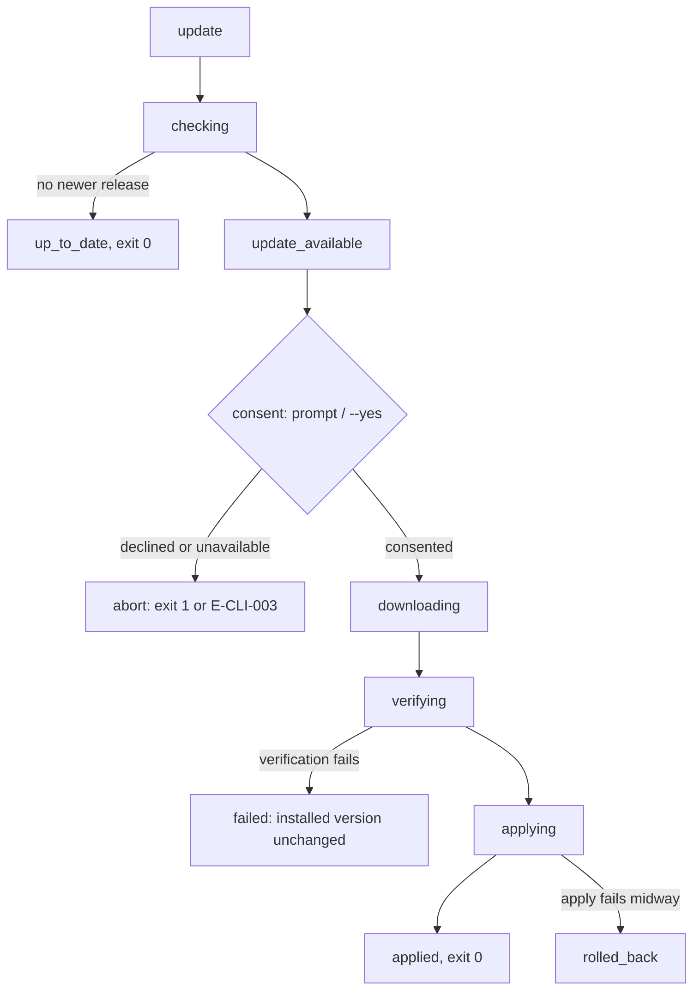

# 06 — CLI Commands: Maintenance

This chapter specifies the maintenance families: `doctor`, `update`, `version`, and
`completion`, plus the post-command update notice. Chapter [02](02-cli-conventions.md)
conventions apply throughout. Every command in this chapter is **Phase: MVP** (`update` is
MVP minimum item 23; `doctor`, `version`, and `completion` support installation and
diagnosis from the first release). FR-CLI-016 binds these sections normatively.

## `andromeda doctor`

Environment diagnostics: verifies that the installation, configuration, storage, and
external prerequisites are in a state where Andromeda can operate, and names the
remediation for anything that is not. `doctor` is diagnosis-only — it performs no
mutations, no repairs, and (by default) no network access; remediation happens through the
commands its hints name. An automated `--fix` mode is deliberately absent at MVP: repairs
route through the owning commands (`config`, `auth`, `update`) so every mutation stays
inside its declared permission and confirmation rules.

```text
andromeda doctor [--network] [--check <id> ...]
```

| Flag | Default | Meaning |
|---|---|---|
| `--network` | off | Adds the network-dependent checks (`providers`, `update`) |
| `--check` | all applicable | Run only the named checks (repeatable) |

The check set is closed and identified; each check reports `pass`, `warn`, or `fail` with a
one-line summary and, on `warn`/`fail`, a remediation hint:

| Check ID | Verifies | On failure |
|---|---|---|
| `binary` | Installed version, build metadata, release channel | Informational; never fails |
| `paths` | Data/config/cache directories exist and are writable (ADR-022) | `fail`, configuration class (exit 3) |
| `config` | Every configuration layer validates (ConfigPort `Validate`); all findings reported | `fail`, E-CFG family class (exit 3) |
| `storage` | Global and (when in a workspace) workspace databases open; integrity checks pass; schema version is current or migratable (ADR-028, ADR-029) | `fail`, integrity class (exit 9) |
| `git` | System git present and version ≥ 2.40 (ADR-025) | `fail`, configuration class (exit 3) |
| `secretstore` | Secret Store backend available: OS keychain reachable or the configured fallback active (ADR-014) | `fail`, class per the owning E-SEC envelope (Volume 9) |
| `terminal` | TTY status, `TERM`, resolved color decision and deciding rule (ADR-103), dimensions vs. the TUI minimum 80×24 | `warn` only |
| `workspace` | Workspace discovery outcome and `.andromeda/` state presence | `warn` only (absence of a workspace is not a defect) |
| `disk` | Free space at the data directories is at least 500 MiB | `warn` only |
| `providers` | (`--network`) Each configured Provider verifies per its frozen connection states | `fail`, E-PROV class (exit 7) |
| `update` | (`--network`) UpdaterPort `Check` against the configured channel | `warn` when `update_available` or the check itself fails |

Behavior: checks run in the table's order and **continue past failures** (chapter 02 exit
rule 2); per-check outcomes are always complete in the output. Human mode renders one line
per check plus hints; `--json` carries the full check list under `data.checks` in every
case. With one or more `fail` outcomes the envelope sets `ok: false`, `error` carries the
most severe failing check's error envelope, and the exit code follows the chapter 02
severity aggregation over the failing checks' classes. Without `--network`, zero network
access occurs — `doctor` is on the offline path by default.

**Permissions:** none by default (local reads only); `network` with `--network`.
**Exit codes:** 0 (no `fail` outcomes; `warn` does not affect the exit code), 1, 2, 3, 4,
5, 7, 8, 9 (aggregated per chapter 02 rule 2 from the failing checks' classes).

**JSON result (`data`):**

```json
{
  "checks": [
    {
      "id": "git",
      "outcome": "fail",
      "summary": "git 2.34 found; 2.40 or newer is required",
      "hint": "upgrade git via your system package manager",
      "error_code": "E-GIT-001"
    }
  ],
  "passed": 8,
  "warned": 1,
  "failed": 1
}
```

`error_code` is present only on `fail` outcomes and names the owning family's code where
one applies (the example shows the shape; the concrete E-GIT code is Volume 11's).

**Examples:**

```text
$ andromeda doctor                                   # valid, offline
$ andromeda doctor --network --json                  # valid, adds provider/update checks
$ andromeda doctor --check config --check storage    # valid, subset
$ andromeda doctor --check nosuch                    # invalid
error[E-CLI-002]: invalid value for --check: unknown check "nosuch"
  hint:   known checks: binary, paths, config, storage, git, secretstore, terminal, workspace, disk, providers, update
```

**Errors:** E-CLI-002/008. Check findings are data, not command errors: the only errors
`doctor` itself raises are usage and output failures; everything else is a recorded
finding with its aggregated exit code.

## `andromeda update`

Self-update over UpdaterPort (full update semantics, channels, and the Update process
machine are Volume 14's; the frozen state names are Volume 2, chapter 09's). MVP minimum
item 23: check, download, verify, apply.

```text
andromeda update [--channel <name>]
andromeda update check [--channel <name>]
andromeda update rollback
```

| Flag | Default | Meaning |
|---|---|---|
| `--channel` | configured channel (`[update]`, Volume 14) | Channel override for this invocation only |



The diagram shows the default flow's components: the check step (the only step before a
consent decision), the consent gate, and the download → verify → apply pipeline over the
frozen Update states. Its relations and constraints: consent always precedes `downloading`;
`applying` is unreachable without a passed `verifying` step for the same artifact set
(UpdaterPort rule); a failure in `verifying` terminates in `failed` with the installed
version untouched, and a failure inside `applying` terminates in `rolled_back` with the
prior version restored — no path exits the flow with a half-replaced installation.

Behavior: the default invocation runs the full flow, streaming each frozen state transition
as progress (FR-UX-003; NDJSON stream documents under `--json`). Applying an update
overwrites the installed version, so the consent gate is a destructive confirmation
(FR-CLI-010): interactive mode prompts with the installed and available versions and the
channel; `--yes` consents; non-interactive mode without `--yes` fails with E-CLI-003 after
reporting `update_available` — `andromeda update --yes --no-input` is the sanctioned
unattended form. `update check` runs only the `checking` step and reports `up_to_date` or
`update_available` (both exit 0 — the check succeeded); it is the only subcommand that
requires the network and MUST fail cleanly offline with the E-REL family's connectivity
class. `update rollback` restores the previously retained version from local artifacts —
fully offline (SM-19), and a destructive confirmation whose prompt names both versions. At
most one update operation runs machine-wide (UpdaterPort lock); a concurrent attempt fails
with the E-REL family's lock class. Scheduled background checks and auto-update policy are
Volume 14's; this command is the manual surface.

**Permissions:** `network` (`check`, and the default flow's check/download steps);
`system_modification` (apply and rollback).
**Exit codes:** 0, 1, 2, 3, 5, 8, 9 (E-REL family failures map within 1/8/9 per their
Volume 14 envelopes; consent refusals per FR-CLI-010).

**JSON result (default flow, final envelope `data`):**

```json
{
  "state": "applied",
  "from_version": "0.4.0",
  "to_version": "0.4.1",
  "channel": "stable",
  "verified": true,
  "duration_ms": 8410
}
```

`update check` reports `{"state": "up_to_date" | "update_available", "installed": …,
"available": …, "channel": …}` with the same field conventions; `state` is always a frozen
Update state name.

**Examples:**

```text
$ andromeda update check --json                      # valid, network
$ andromeda update --yes --no-input                  # valid, unattended CI shape
$ andromeda update rollback                          # valid; prompts (default No)
$ andromeda update check --channel weekly            # invalid channel name
error[E-CLI-002]: invalid value for --channel: unknown channel "weekly"
```

**Errors:** E-CLI-002/003/009; E-REL family (Volume 14) for check, download, verification,
apply, and rollback failures.

## `andromeda version`

Version information. This command performs no I/O beyond its output: no configuration
load, no workspace discovery, no network — it is the SM-06a cold-start measurement target
(Volume 12 formalizes) and must work in a broken environment precisely because `doctor`
and support flows depend on it.

```text
andromeda version
```

Human output is a single line:

```text
andromeda 0.4.1 (commit 1a2b3c4, built 2026-07-11, darwin/arm64, stable)
```

**Permissions:** none. **Exit codes:** 0, 1 (output failure only), 2.

**JSON result (`data`):**

```json
{
  "version": "0.4.1",
  "commit": "1a2b3c4d5e6f7a8b9c0d1e2f3a4b5c6d7e8f9a0b",
  "build_date": "2026-07-11T08:00:00Z",
  "go_version": "go1.24.4",
  "os": "darwin",
  "arch": "arm64",
  "channel": "stable"
}
```

`andromeda --version` is the sanctioned alias and is byte-identical in both modes
(FR-CLI-003).

**Examples:**

```text
$ andromeda version                                  # valid
$ andromeda version --json                           # valid
$ andromeda version extra                            # invalid
error[E-CLI-002]: invalid value for version: no arguments are accepted
```

**Errors:** E-CLI-002/008.

## `andromeda completion`

Shell completion script generation; the normative behavior — supported shells, coverage,
dynamic resource completion, offline and silent-failure rules — is FR-CLI-012 (chapter
02). This section fixes the command surface.

```text
andromeda completion bash
andromeda completion zsh
andromeda completion fish
```

The generated script prints to stdout (it is payload, FR-CLI-007); installation
instructions per shell render in `--help` text, not in the script output. `--json` wraps
the script in the standard envelope with `data.script` and `data.shell` — provided for
tooling that provisions shells, and never required for normal use.

**Permissions:** none. **Exit codes:** 0, 1, 2.

**JSON result (`data`):**

```json
{
  "shell": "zsh",
  "script": "#compdef andromeda ..."
}
```

**Examples:**

```text
$ andromeda completion zsh > ~/.zsh/completions/_andromeda    # valid
$ andromeda completion fish | source                          # valid (fish)
$ andromeda completion tcsh                                   # invalid
error[E-CLI-002]: invalid value for <shell>: supported shells: bash, zsh, fish
```

**Errors:** E-CLI-002/008.

## Update notice

The post-command update notice referenced by the `cli.update_notice` configuration key
(chapter 02) behaves as follows:

1. After a command completes in human mode with `cli.update_notice` set to `true`, the CLI
   reads the **locally cached** result of the most recent update check (written by
   `update check`, the default `update` flow, or Volume 14's scheduled checks). The notice
   path itself never performs network access.
2. When the cache shows an applicable newer Release, one line renders on stderr naming the
   installed version, available version, and `andromeda update`; the CLI emits
   `cli.update.notified` and records the notice time in global state.
3. Throttle: at most one notice per 24 hours across all invocations.
4. Suppression: the notice never renders under `--quiet`, `--json`, CI mode (FR-CLI-009),
   non-TTY stderr, or inside `update`/`version`/`completion`/`doctor` invocations (they
   carry the information themselves or must stay script-clean).

## Requirements

### FR-CLI-016 — Maintenance command family behavior

- Type: Functional
- Status: Draft
- Priority: P1
- Phase: MVP
- Source: Provided
- Owner: CLI (Volume 8)
- Affected components: CLI; Updater; Configuration Manager; Persistence Layer; Git Engine; Secret Store; Provider Layer
- Dependencies: FR-CLI-001, FR-CLI-005–FR-CLI-012; UpdaterPort semantics (Volume 3); FR-REL-001 (release pipeline, Volume 14); ADR-014, ADR-022, ADR-025, ADR-029
- Related risks: RISK-CLI-002, RISK-CLI-003

#### Description

The commands specified in this chapter — `doctor`, `update`, `version`, `completion` — and
the update-notice behavior MUST behave exactly as their sections define. Family invariants:
`doctor` and `version` are read-only over local state; nothing in the family touches the
network except the sections' declared paths (`doctor --network`, `update` check/download);
every rendered update state is a frozen Update state name; the update consent gate and
`update rollback` are destructive confirmations under FR-CLI-010; `version` requires no
working configuration, workspace, or storage.

#### Motivation

The family is the product's self-maintenance surface: MVP minimum item 23 (`update`) plus
the diagnostic loop that makes every other failure recoverable — `doctor` names the broken
prerequisite, `version` anchors every support exchange, and the update notice keeps
installations current without ever interrupting scripted use.

#### Actors

Users; support workflows consuming `doctor --json` and `version` output; CI provisioning
shells via `completion`; the Updater; Volume 13 suites.

#### Preconditions

None beyond installation. `doctor` and `version` MUST run meaningfully in a broken
environment (invalid configuration, corrupted workspace database): `version` is unaffected
by construction; `doctor` reports the breakage as findings rather than failing to start.

#### Main flow

1. A caller invokes a family command per its syntax.
2. `doctor` executes its check list; `update` drives UpdaterPort through the frozen
   states; `version` renders build identity; `completion` generates from the tree.
3. Output, exit code, and records match the sections' declarations.

#### Alternative flows

- Default `update` finding `up_to_date`: reports it and exits 0 without any consent gate.
- `doctor --check` subsets run only the named checks; aggregation applies to that subset.

#### Edge cases

- `update` interrupted during `downloading`/`verifying`: the installed version is
  untouched; the Update instance records `failed`; re-running starts a fresh instance.
- `update rollback` with no retained prior version: fails with the E-REL family's
  no-rollback-target class; nothing is modified.
- `doctor` in a directory that is not a workspace: the `workspace` check reports `warn`;
  workspace-scoped checks are skipped and marked as such, not failed.
- `completion` output redirected to an unwritable file: the shell reports the redirection
  failure; Andromeda sees EPIPE/closed stdout and applies FR-CLI-007's E-CLI-008 handling.

#### Inputs

Check identifiers, channel names, shell names; the local update cache; UpdaterPort
results.

#### Outputs

Check reports, update progress and outcomes, version identity, completion scripts — per
the sections' JSON schemas; update history records are the Updater's (Volume 14).

#### States

`update` renders the frozen Update process states verbatim and owns none of them (full
machine: Volume 14). `doctor` check outcomes (`pass`/`warn`/`fail`) are command output
vocabulary, not an entity state machine.

#### Errors

E-CLI family (chapter 02); E-REL family (Volume 14) for update operations; findings
surfaced by `doctor` carry their owning families' codes as data.

#### Constraints

`doctor` performs no mutations and offers no repair mode; the update notice never blocks,
never prompts, and never triggers network access; `version` MUST NOT read configuration
(its output cannot depend on state that `doctor` may be diagnosing); `update` MUST refuse
`applying` without a passed verification for the same artifacts (UpdaterPort rule).

#### Security

`update` verification (checksums, and signatures/provenance when enabled per the Volume 1
signing viability note) gates activation of downloaded code — the highest-consequence
supply-chain boundary in the CLI; apply and rollback require `system_modification`.
`doctor` output names configuration keys and paths but never secret material; the
`secretstore` check reports backend availability without touching stored credentials.

#### Observability

Family commands emit the chapter 02 lifecycle events; update runs additionally emit the
Volume 14 update events correlated to the invocation; the update notice emits
`cli.update.notified`.

#### Performance

`version` is the SM-06a cold-start target; `doctor`'s default (offline) run is bounded by
local reads and MUST complete without network timeouts by construction; update transfer
time is bounded by SM-18 and rollback by SM-19 (Volume 14 formalizes both).

#### Compatibility

Identical grammar and output shapes on Tier 1 platforms; platform-specific check internals
(keychain probing, directory conventions) live behind the PAL and report through the same
check IDs.

#### Acceptance criteria

- Given a host with git 2.34 and an invalid configuration value, when `andromeda doctor
  --json` runs, then `data.checks` contains `fail` outcomes for `git` and `config` with
  remediation hints, `ok` is `false`, and the exit code is 3 (severity aggregation:
  configuration outranks general).
- Given the offline condition, when `andromeda doctor` (no `--network`) runs, then zero
  network attempts occur and the command completes (offline case).
- Given a release N−1 installation with N available on its channel, when
  `andromeda update --yes --no-input --json` runs against the release fixture, then NDJSON
  stream documents show the frozen state sequence through `applied`, the final envelope
  reports `to_version` N, and `andromeda version` reports N afterward.
- Given a tampered update artifact fixture, when the default flow reaches `verifying`,
  then the flow terminates in `failed`, the installed version is unchanged, and the exit
  code maps per the E-REL envelope (negative + security case).
- Given non-interactive mode without `--yes`, when the default flow reaches consent, then
  E-CLI-003 renders after `update_available` is reported and nothing was downloaded
  (permission/confirmation case).
- Given `update rollback` after the previous case's successful update, when confirmed,
  then the prior version is restored offline and `cli.command.completed` correlates with
  the rollback's update events (observability + SM-19 case).

#### Verification method

Volume 13 CLI suite: doctor fixture matrix (broken git, broken config, corrupted database,
missing keychain); update E2E against release fixtures including tampered artifacts and
interrupt injection (SM-18/SM-19 alignment); cold-start benchmark on `version` (SM-06a);
completion harness per FR-CLI-012; offline suite over `doctor` and `update rollback`.

#### Traceability

PRD-006, PRD-008, PRD-009; MVP minimum items 22, 23, 27; UC-07; SM-06, SM-18, SM-19;
FR-REL-001; ADR-013, ADR-014, ADR-022, ADR-025, ADR-029; FR-CLI-010, FR-CLI-012.
