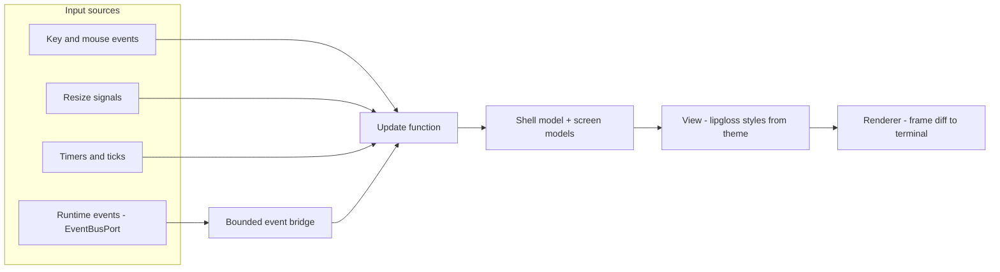

# 07 — TUI Architecture

The TUI is Andromeda's interactive driver: a full-screen terminal program built on the Charm
Bubble Tea v2 stack (ADR-006) that renders sessions, plans, executions, tool activity,
diffs, and approvals from the same Runtime API the CLI uses (Volume 3, chapter 06; PRD-009
driver parity). This chapter specifies the TUI shell (keystone FR-TUI-001), the panel
system, navigation and focus, keyboard and mouse input, resize behavior including the
80×24 minimum, and the event-driven rendering pipeline. Theming is chapter
[08](08-theming-and-design-tokens.md); the core screens are chapter
[09](09-wireframes-core.md); platform screens, interaction patterns, and
accessibility/compatibility are chapters 10–12.

## Position in the architecture

The TUI is an L4 driver (ADR-030): it owns presentation state only. All domain state comes
from the Runtime API and from EventBusPort subscriptions; all side-effecting user actions
travel back through the Runtime API, where the Permission Manager mediates them exactly as
it does for the CLI. The TUI never imports L3 adapters and never persists anything
authoritative — UI preferences flow through ConfigPort into the `[tui]` configuration
table.

The Elm-style architecture of Bubble Tea v2 reduces every input — a keypress, a mouse
event, a resize signal, a Runtime event, a timer tick — to a message folded into a single
model by an update function, after which a view function renders the full frame. This gives
deterministic, unit-testable state transitions and golden-frame regression tests via
teatest/v2 (ADR-017).



The diagram shows the single render loop. Components: four input sources — terminal input
events, resize signals, Runtime events arriving through an EventBusPort subscription, and
internal timers; the bounded event bridge, which converts Runtime events into Bubble Tea
messages under the backpressure rules of FR-TUI-007; the update function, the only place
state changes; the shell model, which composes per-screen sub-models; the view function,
which renders through the lipgloss styles bound to the resolved theme (chapter 08); and the
renderer, which diffs frames onto the terminal. Relations: all inputs converge on the
update function as messages; Runtime events pass through the bridge and nothing else does;
the view reads the model and never mutates it. Constraints: the update function MUST NOT
perform blocking I/O (all I/O runs as commands whose results return as messages), and the
bridge buffer is bounded so a busy run cannot stall input handling (SM-07 budget; Volume 12
formalizes the latency targets).

## Model decomposition

The shell model composes exactly these parts, each a sub-model with its own update and view
logic:

| Part | Responsibility |
|---|---|
| Shell chrome | Header bar, status bar, modal/overlay stack, toast area (patterns: chapter 11) |
| Screen registry | One sub-model per screen (chapters 09–10); exactly one screen is active |
| Layout manager | Computes panel geometry from terminal size and the active layout class (FR-TUI-002, FR-TUI-006) |
| Focus manager | The focus ring and the focused-panel pointer (FR-TUI-003) |
| Keymap | Resolves key events to actions per FR-TUI-004 |
| Theme | The resolved theme record (chapter 08); immutable per resolution |
| Event bridge state | Subscription handles, buffer occupancy, overflow counters (FR-TUI-007) |

Sub-models communicate only through messages routed by the shell update function; a screen
sub-model MUST NOT read or mutate another screen's state directly. This decomposition rule
is the mitigation for RISK-TUI-001.

## Requirements

### FR-TUI-001 — TUI shell

- Type: Functional
- Status: Draft
- Priority: P0
- Phase: MVP
- Source: Provided
- Owner: TUI (Volume 8)
- Affected components: TUI; CLI (hand-off); Runtime; Event Bus
- Dependencies: FR-CLI-003 (hand-off); ADR-006, ADR-107; FR-TUI-006, FR-TUI-007; theme resolution per FR-TUI-008
- Related risks: RISK-TUI-001, RISK-TUI-002

#### Description

The TUI shell is the root Bubble Tea v2 program that owns the terminal for the duration of
an interactive session. Its lifecycle:

1. **Entry.** The shell starts from the CLI hand-off (FR-CLI-003) with the resolved
   invocation-mode record, workspace path (possibly absent), and profile.
2. **Terminal acquisition.** The shell probes terminal capabilities (size, color tier per
   chapter 08, mouse support), enters the alternate screen, enables raw input mode, and —
   when `tui.mouse` is `true` — enables mouse reporting. Probe failure that prevents
   full-screen rendering is E-TUI-002.
3. **Theme resolution.** The theme resolves once per FR-TUI-008 before the first frame.
4. **Start screen.** With no workspace open, the shell shows the splash (FR-UX-043) and
   then workspace selection; with a workspace, it shows the splash per `tui.splash` policy
   and then the screen named by `tui.default_screen`.
5. **Run loop.** The shell processes messages per the pipeline above until quit.
6. **Suspend.** On the suspend key (Unix job control), the shell restores the terminal,
   suspends the process, and re-acquires the terminal (including a fresh resize probe) on
   resume.
7. **Exit.** On quit, the shell closes subscriptions, flushes pending Runtime interactions,
   leaves the alternate screen, restores the terminal mode, and emits `tui.shell.exited`.
   Terminal restoration MUST also run on panic and on fatal errors (E-TUI-003 records
   restoration failure); a crashed TUI MUST NOT leave the terminal in raw mode.

The shell exits with code 0 on user quit; fatal shell errors exit with the E-TUI envelope's
mapped code. Session and run outcomes do not change the TUI exit code — the TUI is a
viewer, and automation that needs run outcomes uses the CLI (PRD-009).

#### Motivation

PRD-008 makes the terminal experience a product pillar; MVP item 2 requires interactive
sessions with streaming, plan/task visibility, diff review, and permission prompts. A
single specified shell lifecycle is what makes those behaviors testable and keeps terminal
state corruption — the classic full-screen-app defect — a defined error rather than an
accident.

#### Actors

Users at interactive terminals; the CLI (hand-off); the Runtime; teatest/v2 harness.

#### Preconditions

Hand-off per FR-CLI-003 succeeded: stdout is a TTY, `TERM` is neither `dumb` nor unset.

#### Main flow

1. Shell receives the hand-off record and probes the terminal.
2. Theme resolves; the event bridge subscribes to the Runtime event families the active
   screens need.
3. Splash or start screen renders; `tui.shell.started` is emitted.
4. Messages are processed; screens render; the user works.
5. User quits; teardown runs; `tui.shell.exited` is emitted; process exits 0.

#### Alternative flows

- No workspace: workspace selection screen (chapter 09) precedes any session screen.
- Suspend/resume: terminal restored, process suspended; on resume the shell re-probes size
  and repaints fully.
- A run is active when quit is requested: the confirmation modal offers to keep the run
  executing in the Runtime (session persists per Volume 4 semantics) or to interrupt it;
  quitting never silently kills a run.

#### Edge cases

- Terminal reports 0×0 or absurd sizes during startup races: the shell renders nothing
  until the first valid resize message, with a 2 s deadline before E-TUI-002.
- `TERM` advertises capabilities the terminal does not honor: rendering degrades per the
  chapter 08 tier ladder; the shell never crashes on unsupported escape responses.
- Second TUI instance on the same workspace: allowed; concurrent-writer rules are the
  workspace database's (Volume 10); the TUI displays the shared state both instances read.
- Panic inside a screen's update or view: the shell catches it, restores the terminal,
  writes the E-TUI-006 envelope to stderr, and exits with its mapped code.

#### Inputs

Hand-off record (mode, workspace, profile); terminal input; Runtime events; configuration.

#### Outputs

Rendered frames; Runtime API calls; `tui.*` events; exit code.

#### States

The shell itself is not a persisted entity; it renders the frozen states of Session, Run,
Plan, Task, and Tool Invocation (Volume 2, chapter 09) exactly as named there.

#### Errors

E-TUI-001 (initialization), E-TUI-002 (unsupported terminal), E-TUI-003 (restore failure),
E-TUI-006 (render pipeline), E-TUI-007 (Runtime unavailable).

#### Constraints

Update functions MUST NOT block; all I/O is asynchronous commands. The shell MUST render
correctly at every size ≥ 80×24 (FR-TUI-006) and MUST use only `charm.land` v2 imports
(ADR-006).

#### Security

The shell displays permission prompts with precise scopes (chapter 09) and relays decisions
to the Permission Manager; it never evaluates permissions itself. Screen content honors the
redaction rules of Volumes 9/10 — secret material never reaches a frame.

#### Observability

`tui.shell.started` / `tui.shell.exited` with terminal size, tier, and duration;
interaction latency metrics per SM-07 instrumentation (budgets formalized in Volume 12).

#### Performance

TUI start to interactive prompt binds to SM-06(b) (≤ 500 ms p95, formalized in Volume 12);
the shell defers non-critical work (index status, cost history) until after first paint.

#### Compatibility

Tier 1 platforms (Volume 1); terminal compatibility matrix in chapter 12.

#### Acceptance criteria

- Given a TTY with a workspace open, when `andromeda` is invoked, then the shell reaches an
  interactive session screen and emits `tui.shell.started` with size and tier fields.
- Given an active run and a quit request, when the user confirms "keep running", then the
  process exits 0 and the run continues under the Runtime (verified via `andromeda run` CLI
  listing).
- Given a panic injected in a screen update (test hook), when it fires, then the terminal
  is restored (no raw mode, alternate screen left), stderr carries the E-TUI-006 envelope,
  and the exit code matches its mapping.
- Negative case: given `TERM=dumb`, when hand-off is attempted, then the CLI branch of
  FR-CLI-003 applies and the shell never starts.
- Permission case: given a run that requests a side-effecting action, when the TUI is the
  active driver, then the approval prompt renders per chapter 09 and the decision reaches
  the Permission Manager unchanged.
- Observability case: given any complete TUI session, when events are inspected, then
  started/exited events pair with matching correlation IDs.

#### Verification method

teatest/v2 golden frames for startup and teardown; PTY-level integration tests for raw-mode
restoration (including kill and panic injection); event assertions in the Volume 13 TUI
suite.

#### Traceability

PRD-008, PRD-009; MVP item 2; SM-06, SM-07; ADR-006, ADR-107; FR-CLI-003.

### FR-TUI-002 — Panel system and layout manager

- Type: Functional
- Status: Draft
- Priority: P0
- Phase: MVP
- Source: Design
- Owner: TUI (Volume 8)
- Affected components: TUI
- Dependencies: FR-TUI-001, FR-TUI-006; ADR-107
- Related risks: RISK-TUI-001

#### Description

Every screen is composed of **panels**: rectangular regions with a title, a border, an
optional scrollable viewport, and a focus state. The layout manager assigns panel geometry
from the terminal size and the screen's declared layout in one of three **layout classes**:

| Layout class | Trigger | Structure |
|---|---|---|
| `wide` | columns ≥ 120 and rows ≥ 24 | Sidebar panel (fixed 28–36 columns) + main panel group; header and status bars |
| `standard` | 80 ≤ columns < 120 and rows ≥ 24 | Single main panel group; sidebar content collapses into summary lines or on-demand overlays |
| `compact` | columns < 80 or rows < 24 | Single panel, reduced chrome (header and status bar compress to one line each); every function remains reachable |

Below 40 columns or 10 rows the shell suspends rendering of screen content and shows only a
size notice ("terminal too small — need at least 40×10; best at 120×32") until resized.
Chrome is constant across screens: header bar (screen name, workspace, provider/model),
panel area, status bar (key hints, run state, token/cost summary). Panels declare minimum
sizes; when a screen's declared panels cannot fit, the layout manager collapses
lowest-priority panels into status-bar indicators, never clipping interactive controls.

#### Motivation

A single layout system makes every screen's behavior under resize predictable and testable,
instead of per-screen ad-hoc geometry — and it is the mechanism behind the 80×24 guarantee
(NFR-TUI-001).

#### Actors

Screen sub-models (declare panels); the layout manager; users resizing terminals.

#### Preconditions

Shell started; a valid terminal size is known.

#### Main flow

1. A screen declares its panels with priorities and minimum sizes.
2. The layout manager selects the layout class from the current size.
3. Geometry is computed; panels render into their rectangles; the focus ring re-derives.

#### Alternative flows

- Size change crosses a class boundary: geometry recomputes, the frame repaints fully, and
  `tui.resize.applied` is emitted with the new class.
- A modal is open during reflow: the modal re-centers and clamps to the new size.

#### Edge cases

- Exactly 80×24: `standard` class MUST apply (boundary is inclusive), matching the chapter
  09 wireframes.
- A panel's minimum exceeds the available area in `compact`: the panel renders as a
  status-bar indicator and its content is reachable as a full-screen overlay via its
  go-to key.
- Zero-height transient sizes during window drags: rendering skips frames rather than
  emitting corrupt geometry.

#### Inputs

Panel declarations; terminal dimensions; focus state.

#### Outputs

Panel rectangles; layout class; resize events.

#### States

Not applicable — layout is derived state, recomputed from inputs.

#### Errors

E-TUI-006 if geometry computation fails invariantly (defect class).

#### Constraints

Layout computation MUST be pure (same inputs → same geometry) so golden-frame tests are
deterministic.

#### Security

None beyond FR-TUI-001; panels never widen redaction.

#### Observability

`tui.resize.applied` with columns, rows, and layout class.

#### Performance

Reflow completes within the SM-07 input-latency budget; layout is O(panel count).

#### Compatibility

Identical geometry rules across platforms; box-drawing fallback per chapter 12.

#### Acceptance criteria

- Given an 80×24 terminal, when any core screen renders, then it matches its chapter 09
  golden frame in the `standard` class.
- Given a 140×40 terminal, when the session screen renders, then the sidebar appears and
  content panels expand (wide-class golden frame).
- Given a resize from 120×30 to 70×20 during streaming, when reflow occurs, then no frame
  interleaves stale and new geometry and `tui.resize.applied` reports `compact`.
- Negative case: given a 38×8 terminal, when rendering is attempted, then only the size
  notice appears and input other than quit and resize is ignored.

#### Verification method

teatest/v2 golden frames per layout class per screen; property test that geometry is total
and non-overlapping for all sizes ≥ 40×10.

#### Traceability

PRD-008; MVP item 2; ADR-107; NFR-TUI-001; chapter 09 wireframes.

### FR-TUI-003 — Navigation and focus model

- Type: Functional
- Status: Draft
- Priority: P0
- Phase: MVP
- Source: Design
- Owner: TUI (Volume 8)
- Affected components: TUI
- Dependencies: FR-TUI-002, FR-TUI-004; ADR-107, ADR-108
- Related risks: RISK-TUI-001

#### Description

Navigation has three levels:

1. **Screens.** Exactly one active screen. The core screen ring, in order: session, plan,
   execution, tool calls, diff, git, files, context, memory, logs, costs. `]` and `[` move
   forward/backward through the ring; go-to chords (FR-TUI-004) jump directly; the command
   palette (chapter 10) reaches every screen including platform screens, which are not in
   the ring. Workspace selection and the splash sit outside the ring. `Esc` returns to the
   previous screen (one-deep history per screen change; the stack does not grow unbounded —
   it holds the last 16 entries).
2. **Panels.** Within a screen, exactly one focused panel, marked by an accent border and a
   focus indicator in its title. `Tab` / `Shift+Tab` cycle the focus ring in declaration
   order (left-to-right, top-to-bottom). Keyboard input routes to the focused panel except
   global keys (FR-TUI-004).
3. **Overlays.** Modals, the palette, and prompts stack above screens and trap focus:
   while an overlay is open, `Tab` cycles only within it, `Esc` dismisses the topmost, and
   underlying panels receive no input. Approval prompts are modal and cannot be dismissed
   with `Esc` without recording an explicit outcome (the Approval remains `requested`;
   dismissing defers rendering, never decides).

Focus is never ambiguous: on screen entry, the screen's declared default panel is focused;
after an overlay closes, focus returns to the panel that held it.

#### Motivation

Deterministic navigation is what makes a dense multi-screen TUI learnable and scriptable in
tests; focus trapping is a correctness property for approval prompts (a keystroke intended
for the transcript must never answer a permission question).

#### Actors

Users; screen sub-models; the focus manager; the modal stack.

#### Preconditions

Shell running; a screen active.

#### Main flow

1. User presses a navigation key.
2. The keymap resolves it (overlay first, then focused panel, then global).
3. Focus or active screen changes; `tui.screen.changed` is emitted on screen change.

#### Alternative flows

- Mouse click on an unfocused panel focuses it (FR-TUI-005) before delivering the click.
- Palette navigation: selecting a screen entry activates it exactly as a go-to chord.

#### Edge cases

- Screen with one panel: `Tab` is a no-op (no wrap-around flicker).
- Overlay opens while a text input is focused: input buffer is preserved and restored on
  return.
- Rapid `Esc` sequences: dismiss one overlay per keypress; never fall through to quitting.

#### Inputs

Key/mouse events; screen and panel declarations.

#### Outputs

Focus state; active screen; `tui.screen.changed` events.

#### States

Not applicable — navigation state is presentation state; no persisted machine.

#### Errors

None minted; misrouted input is a defect caught by golden tests.

#### Constraints

An approval overlay MUST trap focus until an outcome key is pressed or the Approval leaves
`requested` (expiry/cancellation per Volume 9).

#### Security

Focus trapping on approval prompts prevents accidental grants (typed-ahead keys are
discarded when an approval overlay opens; a deliberate keypress after render is required).

#### Observability

`tui.screen.changed` with from/to screen and trigger (`key`, `palette`, `mouse`, `auto`).

#### Performance

Focus and screen switches render within the SM-07 budget.

#### Compatibility

Identical across platforms and tiers; focus marking degrades per chapter 08 (reverse video
at the no-color tier).

#### Acceptance criteria

- Given the session screen, when `g d` is pressed, then the diff screen activates and
  `tui.screen.changed` records trigger `key`.
- Given an approval overlay, when keys buffered before it opened would map to a decision,
  then they are discarded and the Approval remains `requested`.
- Given three stacked overlays, when `Esc` is pressed once, then only the topmost closes.
- Negative case: given a text input focused in the session screen, when `j` is typed, then
  it inserts into the input and does not scroll any panel.

#### Verification method

teatest/v2 interaction scripts covering ring order, chords, focus cycling, overlay
trapping, and typed-ahead discard; golden frames for focus marking.

#### Traceability

PRD-005, PRD-008; ADR-107, ADR-108; chapter 09 permission wireframe.

### FR-TUI-004 — Keyboard command map

- Type: Functional
- Status: Draft
- Priority: P0
- Phase: MVP
- Source: Design
- Owner: TUI (Volume 8)
- Affected components: TUI
- Dependencies: FR-TUI-003; ADR-108
- Related risks: RISK-TUI-001

#### Description

Key resolution order: overlay keymap → focused-panel keymap → global keymap. The global
keymap is fixed at MVP (remapping via `[tui.keymap]` is Beta per ADR-108, validated with
E-TUI-005):

| Key | Action |
|---|---|
| `Ctrl+C` | Interrupt the active run (confirmation per chapter 09); with no active run, open the quit confirmation |
| `Ctrl+Q` | Quit (confirmation when a run is active) |
| `Ctrl+Z` | Suspend (Unix job control) |
| `Ctrl+P` | Command palette (chapter 10) |
| `?` | Help overlay (chapter 10) |
| `Esc` | Dismiss topmost overlay; else previous screen |
| `Tab` / `Shift+Tab` | Focus next / previous panel |
| `[` / `]` | Previous / next screen in the ring |
| `g` + letter | Go-to chord (table below); 1.5 s chord timeout |
| `↑`/`↓` or `k`/`j` | Move selection or scroll one line |
| `PgUp` / `PgDn` | Page up / down |
| `Home` / `End` | Jump to start / end |
| `Enter` | Activate selection / submit input |
| `/` | Search in the focused panel (semantics: chapter 11) |

Go-to chords: `g s` session · `g p` plan · `g x` execution · `g t` tool calls · `g d` diff
· `g g` git · `g f` files · `g c` context · `g m` memory · `g l` logs · `g o` costs ·
`g w` workspace selection · `g h` help. This chord set is closed at MVP; additions require
amending this requirement. When a text input has focus, only `Ctrl`-modified globals,
`Esc`, and `Tab` apply; printable keys insert text. Every screen surfaces its contextual
keys in the status bar; the help overlay lists the complete effective map.

#### Motivation

One documented, closed keymap is learnable, avoids per-screen collisions, and is the
contract golden tests assert; vi-style aliases (`j`/`k`) serve the target population
without imposing modality.

#### Actors

Users; keymap resolver; screen and overlay sub-models.

#### Preconditions

Shell running.

#### Main flow

1. Key event arrives.
2. Resolution order applies; first match wins.
3. The bound action executes as a message.

#### Alternative flows

- Chord prefix `g` then timeout: prefix discarded; a transient hint toast shows available
  chord completions after 700 ms of waiting.
- Unbound key: ignored silently (no bell, no toast).

#### Edge cases

- Terminals that do not deliver `Shift+Tab` as a distinct sequence: focus cycling remains
  fully reachable via `Tab` (wrap-around); the help overlay marks the binding "where
  supported".
- Keys arriving during a full repaint: queued, never dropped.
- `Ctrl+C` twice within the confirmation modal: the second press confirms interruption
  (explicit affordance shown in the modal), so the panic-driven double-press does the safe
  expected thing.

#### Inputs

Terminal key events (including bracketed paste, handled per chapter 11).

#### Outputs

Action messages; hint toasts.

#### States

Chord-pending is transient presentation state with a 1.5 s timeout.

#### Errors

E-TUI-005 (invalid keymap configuration) at Beta when `[tui.keymap]` remapping ships.

#### Constraints

Bindings MUST NOT require key-release events or simultaneous multi-key chords beyond
standard modifiers — terminals do not deliver them reliably.

#### Security

Decision keys inside approval overlays are distinct from navigation keys (digits, chapter
09), so no global binding can be mistaken for a grant.

#### Observability

Keymap resolution is not evented per keystroke (volume); the help overlay renders the
effective map, and `tui.screen.changed` captures navigation outcomes.

#### Performance

Resolution is a map lookup; within the SM-07 budget.

#### Compatibility

The map avoids function keys and exotic modifiers whose escape sequences vary across
terminals and multiplexers (chapter 12 matrix).

#### Acceptance criteria

- Given any core screen, when each global key is pressed, then the bound action occurs
  (scripted matrix over all bindings).
- Given `g` then 2 s of silence, when a subsequent `d` is pressed, then it routes to the
  focused panel, not the chord.
- Given a focused text input, when `q` is typed, then it inserts and the shell does not
  quit.
- Negative case: given an unbound key `%` on the logs screen, when pressed, then the model
  hash before and after is identical.

#### Verification method

teatest/v2 scripted keystroke matrix; fuzz test feeding random key sequences asserting no
panics and no unintended quits/grants.

#### Traceability

PRD-008; ADR-108; FR-TUI-003; chapter 11 (search, paste), chapter 12 (terminal matrix).

### FR-TUI-005 — Mouse input

- Type: Functional
- Status: Draft
- Priority: P2
- Phase: MVP
- Source: Design
- Owner: TUI (Volume 8)
- Affected components: TUI
- Dependencies: FR-TUI-002, FR-TUI-003; ADR-109
- Related risks: RISK-TUI-002

#### Description

Mouse support is an enhancement, never a requirement: every action reachable by mouse is
reachable by keyboard (ADR-109). When `tui.mouse = true` and the terminal supports mouse
reporting, the shell enables it with this behavior: left click focuses the panel under the
cursor and moves selection to the clicked row; double click activates (as `Enter`); wheel
scrolls the hovered panel three lines per notch; click on header/status-bar affordances
(screen name, palette hint) triggers their actions. Drag-selection of text is delegated to
the terminal: holding the platform's standard modifier bypasses application mouse mode
where the terminal supports it, and setting `tui.mouse = false` disables reporting
entirely so native selection always works — the status bar surfaces this hint in the help
overlay. Mouse events are never required for approvals: approval overlays accept clicks on
their decision entries but always show their digit keys.

#### Motivation

Wheel scrolling and click-to-focus are high-value, low-risk conveniences; but terminal
mouse reporting conflicts with native text selection, so the escape hatch is part of the
contract (ADR-109), not an afterthought.

#### Actors

Users with mouse-capable terminals; the layout manager (hit testing).

#### Preconditions

`tui.mouse = true`; terminal grants mouse reporting.

#### Main flow

1. Mouse event arrives with coordinates.
2. Hit testing maps coordinates to a panel/affordance via layout geometry.
3. The mapped action executes (focus, select, activate, scroll).

#### Alternative flows

- `tui.mouse = false`: no mouse reporting is requested; the terminal handles selection
  natively.
- Terminal without mouse support: the shell detects the absence silently; no degradation
  events.

#### Edge cases

- Click during reflow: coordinates validate against current geometry; stale hits are
  dropped.
- Wheel over an unfocused panel: scrolls that panel without moving focus (hover-scroll),
  matching common terminal-app behavior.
- Click on a modal's backdrop: ignored (modals close only via their controls or `Esc`).

#### Inputs

Mouse press/release/wheel events with coordinates.

#### Outputs

Focus/selection/scroll changes; activated affordances.

#### States

Not applicable — no persisted state.

#### Errors

None minted; unsupported reporting is silent.

#### Constraints

No action may be mouse-only (keyboard parity is absolute); no hover-dependent information
may be the sole carrier of meaning.

#### Security

Approval decisions by click follow the same explicit-outcome rule as keys (FR-TUI-003
typed-ahead discard applies to clicks buffered before the overlay opened).

#### Observability

None per event (volume); `tui.shell.started` records whether mouse reporting is active.

#### Performance

Hit testing is O(visible panels); within the SM-07 budget.

#### Compatibility

Mouse reporting support varies by terminal and multiplexer; the feature detects and
degrades silently (chapter 12 matrix).

#### Acceptance criteria

- Given mouse enabled, when a row in an unfocused panel is clicked, then the panel gains
  focus and the row is selected in one event.
- Given `tui.mouse = false`, when the TUI runs, then no mouse reporting sequence is sent
  (PTY capture asserts absence).
- Given an approval overlay, when a click lands on "deny once", then the Approval outcome
  is `denied` exactly as if its digit were pressed.
- Negative case: given a click at coordinates outside every panel (border gutter), when
  processed, then the model is unchanged.

#### Verification method

teatest/v2 with synthetic mouse events; PTY capture tests for reporting enable/disable
sequences.

#### Traceability

PRD-008; ADR-109; FR-TUI-003.

### FR-TUI-006 — Resize and small-terminal behavior

- Type: Functional
- Status: Draft
- Priority: P0
- Phase: MVP
- Source: Provided
- Owner: TUI (Volume 8)
- Affected components: TUI
- Dependencies: FR-TUI-002; NFR-TUI-001
- Related risks: RISK-TUI-001

#### Description

The TUI is fully functional at every terminal size of at least 80×24 (the reference size of
the chapter 09 wireframes) and remains operable down to 40×10 in `compact` class. Resize
events recompute layout immediately: the active screen reflows, viewports preserve their
scroll anchor (topmost visible item stays visible when possible), text inputs preserve
content and cursor, overlays re-center and clamp. Below 40×10 only the size notice renders
(FR-TUI-002). Growing across a class boundary restores richer layout automatically —
layout class is always a pure function of current size, never sticky. During streaming,
resize repaints MUST NOT interleave frames computed for different sizes (a full repaint
follows every applied resize).

#### Motivation

Terminals get resized constantly — splits, tmux panes, SSH sessions from small screens.
The brief mandates defined small-terminal behavior; making 80×24 the guaranteed floor and
40×10 the operable floor turns "works on my terminal" into a testable contract.

#### Actors

Users resizing terminals or multiplexer panes; the layout manager.

#### Preconditions

Shell running.

#### Main flow

1. Resize signal arrives with new dimensions.
2. Layout class resolves; geometry recomputes; full repaint renders.
3. `tui.resize.applied` is emitted.

#### Alternative flows

- Burst of resize signals during a drag: coalesced — geometry computes for the latest size;
  intermediate sizes MAY skip repaints, and the final size always renders.

#### Edge cases

- Resize while a chord is pending: chord state survives.
- Resize below 40×10 during an approval overlay: the size notice includes "approval
  pending" so the state is not invisible; the Approval's expiry clock (Volume 9) is
  unaffected.
- Resize storms from window managers (dozens per second): coalescing bounds repaints to at
  most one per 50 ms without dropping the final state.

#### Inputs

Resize signals; current model.

#### Outputs

Recomputed layout; full repaint; resize event.

#### States

Layout class (`wide`, `standard`, `compact`) is derived, not persisted.

#### Errors

E-TUI-006 if repaint after resize fails.

#### Constraints

Scroll anchoring MUST prefer content stability over cursor stability in read-only
viewports, and cursor stability in editable inputs.

#### Security

The size notice never elides a pending approval's existence (edge case above).

#### Observability

`tui.resize.applied` with columns, rows, layout class, and coalesced-count.

#### Performance

Reflow plus repaint within the SM-07 input-latency budget for sizes up to 400×120.

#### Compatibility

Resize delivery mechanisms differ per platform (PAL, Volume 3 signals surface); behavior
above the delivery mechanism is identical.

#### Acceptance criteria

- Given the session screen at 120×40 with the transcript scrolled to a marked turn, when
  resized to 80×24, then the marked turn remains visible and the layout matches the
  standard-class golden frame.
- Given 100 resize signals in 1 s (scripted), when processed, then at most 20 repaints
  occur and the final frame matches the final size.
- Given a terminal shrunk to 39×9, when rendered, then only the size notice appears; grown
  back to 80×24, then the previous screen state returns intact.
- Negative case: given a resize mid-stream, when frames are captured, then no frame mixes
  old and new widths (golden width assertion per frame).

#### Verification method

teatest/v2 resize scripts with frame capture; property test that layout class is a pure
function of size; PTY integration test with real SIGWINCH delivery on Unix.

#### Traceability

PRD-008; MVP item 2; NFR-TUI-001; FR-TUI-002; chapter 12 (SSH and CI environments).

### FR-TUI-007 — Runtime event rendering and streaming pipeline

- Type: Functional
- Status: Draft
- Priority: P0
- Phase: MVP
- Source: Provided
- Owner: TUI (Volume 8)
- Affected components: TUI; Event Bus
- Dependencies: FR-TUI-001; EventBusPort (Volume 3); envelope semantics per Volume 10
- Related risks: RISK-TUI-002

#### Description

The TUI renders live state from EventBusPort subscriptions bridged into Bubble Tea
messages. The bridge contract:

1. **Subscriptions.** The shell subscribes per event family needed by active screens
   (run/turn/task/tool/provider/git/memory/index/cost families as named by their owning
   volumes) with bounded per-subscriber buffers (ADR-012).
2. **Coalescing.** Streaming content deltas (model output, tool output) for one target
   coalesce per frame: all deltas that arrived since the last frame render together.
   Rendering is scheduled, not per-event: at most one repaint per 16 ms under load, and at
   least one repaint per 100 ms while any stream is active (liveness floor).
3. **Overflow.** If a buffer overflows, presentation-grade events drop oldest-first and the
   affected viewport shows an explicit elision marker ("… output elided — full record in
   logs"); E-TUI-008 is surfaced as a toast counter, and the TUI re-reads authoritative
   state from the Runtime API at the next quiet point. State-transition events are rendered
   from authoritative reads, so a dropped event never leaves a stale state badge
   permanently.
4. **Authority.** The TUI is a view: persisted records (Volume 10) are authoritative, and
   any discrepancy resolves by re-reading, never by trusting the frame.

#### Motivation

Streaming is the TUI's defining load (MVP item 16); an unbounded or per-event-repaint
design fails SM-07/SM-08 under fast providers. The bridge rules make the failure mode —
too many events — a specified, visible degradation instead of a frozen UI.

#### Actors

Event Bus; the bridge; screen sub-models; the renderer.

#### Preconditions

Shell started; subscriptions established.

#### Main flow

1. Runtime events arrive on subscription streams.
2. The bridge tags and enqueues them as messages within buffer bounds.
3. Update folds them into screen state; the scheduler renders coalesced frames.

#### Alternative flows

- Screen change: subscriptions for families only the departed screen needs are closed;
  needed ones are established before first render of the new screen (gap covered by an
  authoritative read).
- Reconnect after overflow: full state re-read, then incremental rendering resumes.

#### Edge cases

- Events for entities the TUI has never displayed (run started by a concurrent CLI):
  rendered into listings on the affected screens; the status bar shows multi-run activity.
- Out-of-order arrival across families: per-topic ordering is guaranteed per Volume 10;
  cross-family ordering is not assumed — screens key on entity state reads for
  correctness.
- A stream that emits no deltas for 30 s: the spinner and elapsed time keep updating from
  ticks (liveness is not event-dependent).

#### Inputs

Event streams; authoritative Runtime reads; tick timers.

#### Outputs

Coalesced frames; elision markers; overflow toasts.

#### States

Renders frozen entity states exactly as named in Volume 2, chapter 09.

#### Errors

E-TUI-007 (Runtime unavailable — screens show their offline/degraded states per chapter
11); E-TUI-008 (subscription overflow).

#### Constraints

The update function processes each message in O(affected content); full-transcript rescans
per delta are prohibited (virtualization: chapter 11).

#### Security

Event payload rendering honors redaction (payloads arrive pre-redacted per Volume 10; the
TUI adds no secret material).

#### Observability

Overflow counters in `tui.shell.exited`; `tui.render.failed` on pipeline errors; SM-08
streaming-overhead instrumentation points.

#### Performance

Streaming added overhead binds to SM-08 (≤ 50 ms p95, formalized in Volume 12); the
coalescing floor guarantees visible progress at ≥ 10 frames/s during streaming.

#### Compatibility

Identical across platforms; frame rates degrade gracefully on slow SSH links (chapter 12).

#### Acceptance criteria

- Given a mock provider emitting 1,000 deltas/s for 10 s, when the session screen streams,
  then input latency stays within the SM-07 budget, at least one repaint occurs per 100 ms,
  and the final transcript equals the persisted turn content byte-for-byte.
- Given a forced buffer overflow (test hook), when it occurs, then the elision marker
  renders, an E-TUI-008 toast appears with a count, and the post-quiet-point transcript
  matches the persisted record.
- Given the Runtime socket torn down mid-session (fault injection), when screens next
  read, then E-TUI-007's degraded state renders and recovery follows reconnection.
- Negative case: given no active streams, when 5 s pass, then zero repaints occur beyond
  clock/status updates (idle CPU discipline, Volume 12 budgets).

#### Verification method

Load tests with mock streaming provider (teatest/v2 + instrumented timestamps);
fault-injection suites for overflow and Runtime loss; byte-equality checks against
persisted records.

#### Traceability

PRD-006, PRD-008; MVP item 16; SM-07, SM-08; ADR-012; RISK-TUI-002.

## Non-functional requirements

### NFR-TUI-001 — Small-terminal functional completeness

- Category: Usability
- Priority: P1
- Phase: MVP
- Metric: Fraction of TUI functions (every action reachable at 120×40) that remain reachable and operable at 80×24, and fraction of screens that render without truncation of interactive controls at 80×24
- Target: 100% of functions reachable; 100% of screens free of interactive-control truncation at 80×24
- Minimum threshold: same as target (the 80×24 floor is a contract, not an aspiration)
- Measurement method: scripted teatest/v2 traversal of every screen and every keymap action at 80×24, asserting reachability and golden frames; manual audit at phase gates
- Test environment: PTY harness at exactly 80×24, Tier 1 platforms
- Measurement frequency: every release; golden frames on every merge
- Owner: TUI (Volume 8)
- Dependencies: FR-TUI-002, FR-TUI-006
- Risks: RISK-TUI-001
- Acceptance criteria: The 80×24 traversal suite passes with zero unreachable actions and zero truncated controls; compact-class (40×10) smoke traversal completes core session, approval, and quit flows.

### NFR-TUI-002 — Rendering determinism for golden-frame testing

- Category: Maintainability
- Priority: P1
- Phase: MVP
- Metric: Fraction of TUI frames that are byte-identical across repeated runs given identical inputs (size, theme, tier, scripted events with fixed timestamps)
- Target: 100% byte-identical frames across the golden suite
- Minimum threshold: 100% — a nondeterministic frame is a defect (flaky golden tests destroy the regression net)
- Measurement method: run the full teatest/v2 golden suite twice per CI run and diff frame outputs; clock and ULID sources injected as fixtures
- Test environment: CI, all Tier 1 platforms, tiers truecolor/256/16/none × modes dark/light
- Measurement frequency: every merge
- Owner: TUI (Volume 8)
- Dependencies: FR-TUI-001, FR-TUI-002; ADR-017
- Risks: RISK-TUI-001
- Acceptance criteria: Double-run frame diff is empty across the entire golden matrix; any intentional visual change lands as an explicit golden-file update in its own commit.

## Risks

### RISK-TUI-001 — Presentation-state monolith erodes maintainability and latency

- Category: Technical
- Probability: Medium
- Impact: Medium
- Severity: Medium
- Mitigation: The model decomposition rule of this chapter (screen sub-models communicate only via routed messages); pure layout computation; per-screen golden suites that keep refactors safe; the Volume 12 latency budgets as CI gates catching regressions early
- Detection: Golden-suite runtime growth; SM-07 trend regression in CI benchmarks; review flags on cross-screen state access
- Owner: TUI (Volume 8)
- Status: Open

The Elm architecture concentrates state in one model (ADR-006 negative consequence). As
screens accumulate, an undisciplined model becomes a monolith where every message touches
everything — first hurting update latency, then making changes risky. The decomposition
rule and pure-layout constraints exist to keep growth linear.

### RISK-TUI-002 — Event flood renders the TUI unresponsive or misleading

- Category: Technical
- Probability: Medium
- Impact: High
- Severity: High
- Mitigation: FR-TUI-007's bounded bridge, frame coalescing, explicit elision markers, and authoritative re-reads; load tests at 10× expected delta rates in Volume 13's TUI suite
- Detection: SM-07/SM-08 instrumentation under load tests; overflow counters in `tui.shell.exited`; user reports of frozen frames
- Owner: TUI (Volume 8)
- Status: Open

Fast local models and parallel tool fan-out can emit events far faster than a terminal can
render. Without the bridge contract, the failure is either a frozen UI (unbounded queue) or
silent data loss presented as truth. The specified behavior — drop visibly, re-read
authoritatively — keeps the TUI honest under pressure.

## Error catalog: E-TUI (shell and pipeline)

Theme configuration errors (E-TUI-004) are defined in chapter
[08](08-theming-and-design-tokens.md). All envelopes follow ADR-016.

### E-TUI-001 — TUI initialization failure

- Category: Environment
- Severity: Error
- User message: "The interactive interface could not start: <summary>."
- Technical message: failing init phase (probe, alt-screen, raw mode, subscription), underlying error
- Cause: terminal rejected required modes; event bridge could not subscribe; theme resolution failed fatally
- Safe-to-log data: init phase, `TERM` value, terminal dimensions, tier decision
- Recoverability: recoverable by fixing the environment or using the CLI
- Retry policy: not retryable automatically; user may re-invoke
- Recommended action: run `andromeda doctor`; use CLI commands as the non-interactive path
- Exit-code mapping: 1
- HTTP mapping: not applicable
- Telemetry event: `tui.render.failed`
- Security implications: none; environment description only

### E-TUI-002 — Terminal capabilities insufficient

- Category: Environment
- Severity: Error
- User message: "This terminal cannot run the interactive interface. The CLI remains available: try `andromeda --help`."
- Technical message: failed capability (size below 40×10 persisting past deadline, alt-screen unsupported, input mode rejected), probe evidence
- Cause: the terminal or multiplexer does not honor capabilities its `TERM` advertised, or is persistently below the operable floor
- Safe-to-log data: `TERM`, reported size, failed capability name
- Recoverability: recoverable in a capable terminal
- Retry policy: not retryable in the same environment
- Recommended action: resize or switch terminals; consult the chapter 12 compatibility matrix
- Exit-code mapping: 1
- HTTP mapping: not applicable
- Telemetry event: `tui.render.failed`
- Security implications: none

### E-TUI-003 — Terminal state restoration failure

- Category: Environment
- Severity: Warning
- User message: "Andromeda exited but your terminal may need a reset. Run: reset"
- Technical message: restoration step that failed (raw mode exit, alt-screen leave, mouse disable), underlying write error
- Cause: terminal closed mid-teardown; PTY vanished; write errors during restore
- Safe-to-log data: failed step, whether exit was orderly, panic, or signal-driven
- Recoverability: recoverable by the user (`reset`); does not affect persisted state
- Retry policy: restore sequence is attempted exactly once per step; failures do not block exit
- Recommended action: run `reset`; report if reproducible
- Exit-code mapping: does not override the exit code of the terminating path; standalone occurrence maps to 1
- HTTP mapping: not applicable
- Telemetry event: `tui.shell.exited` (with restoration-failure flag)
- Security implications: none

### E-TUI-005 — Invalid keymap configuration

- Category: Configuration
- Severity: Error
- User message: "Your key bindings configuration is invalid: <finding>. Default bindings are in effect."
- Technical message: offending `[tui.keymap]` key, parse or conflict finding (unknown action, unparsable chord, duplicate binding)
- Cause: `[tui.keymap]` (Beta, ADR-108) names an unknown action, an unparsable key, or conflicts with a reserved binding
- Safe-to-log data: offending key name, finding class
- Recoverability: recoverable by correcting configuration; the TUI runs with defaults meanwhile
- Retry policy: re-validated on configuration change
- Recommended action: `andromeda config validate`; consult the keymap reference in help
- Exit-code mapping: 3 (when surfaced by validation commands); in-TUI occurrence degrades to defaults without exit
- HTTP mapping: not applicable
- Telemetry event: `tui.render.failed`
- Security implications: reserved approval-decision keys cannot be remapped (validation rejects), preventing grant-key spoofing

### E-TUI-006 — Render pipeline failure

- Category: Internal
- Severity: Critical
- User message: "The interface hit an internal rendering error and must close. Your session is preserved."
- Technical message: panic value or renderer error, active screen, model size summary, last message type
- Cause: defect in update/view/layout logic
- Safe-to-log data: screen name, message type, stack hash (not raw content)
- Recoverability: session state is persisted (Volume 10); relaunch resumes
- Retry policy: not retryable in-process; relaunch is the recovery
- Recommended action: relaunch; `andromeda session resume` path; report with the stack hash
- Exit-code mapping: 1
- HTTP mapping: not applicable
- Telemetry event: `tui.render.failed`
- Security implications: crash output excludes frame content (may contain user code); stack hash only

### E-TUI-007 — Runtime unavailable to the interface

- Category: Internal
- Severity: Error
- User message: "Lost connection to the Andromeda runtime. Retrying — your work is preserved."
- Technical message: failing Runtime API call or subscription, reconnect attempt count
- Cause: runtime component failure inside the process or IPC loss in split deployments (ADR-032)
- Safe-to-log data: failed surface name, attempt count, downtime duration
- Recoverability: recoverable on reconnect; screens render degraded states meanwhile (chapter 11)
- Retry policy: automatic reconnect with exponential backoff, 1 s initial, 30 s cap, indefinite while the shell runs
- Recommended action: none if recovery succeeds; otherwise quit and inspect `andromeda logs`
- Exit-code mapping: 1 (only if the shell must terminate without recovery)
- HTTP mapping: not applicable
- Telemetry event: `tui.render.failed`
- Security implications: none

### E-TUI-008 — Event subscription overflow

- Category: Internal
- Severity: Warning
- User message: "Display fell behind a fast stream; some live output was elided. Complete records are preserved."
- Technical message: family, buffer size, dropped count, quiet-point re-read outcome
- Cause: event production rate exceeded the bounded bridge buffer (FR-TUI-007)
- Safe-to-log data: event family, dropped count, buffer capacity
- Recoverability: self-recovering — authoritative re-read at the next quiet point
- Retry policy: not applicable; drops are presentation-only by design
- Recommended action: none; persisted records are complete (SM-12)
- Exit-code mapping: none in-TUI; never terminates the shell (standalone mapping 1 is unused in practice)
- HTTP mapping: not applicable
- Telemetry event: `tui.render.failed` (overflow variant payload)
- Security implications: none; drops never affect the permission or persistence paths

## Events

The `tui.*` family; envelope and delivery semantics per Volume 10. Payloads never include
frame content or user text — structural and timing data only.

| Event | Version | Producer | Typical consumers | Payload summary |
|---|---|---|---|---|
| `tui.shell.started` | 1 | TUI | Observability | terminal columns/rows, tier, mode, mouse active, workspace presence |
| `tui.shell.exited` | 1 | TUI | Observability | duration_ms, exit reason (`quit`, `error`, `signal`), overflow counters, restoration-failure flag |
| `tui.screen.changed` | 1 | TUI | Observability | from screen, to screen, trigger (`key`, `palette`, `mouse`, `auto`) |
| `tui.resize.applied` | 1 | TUI | Observability | columns, rows, layout class, coalesced count |
| `tui.render.failed` | 1 | TUI | Observability | error code, screen, phase |

## Configuration keys

`[tui]` table content minted here; `[tui.theme]` is chapter 08's. Schema, precedence, and
validation are Volume 10's.

```toml
[tui]
mouse = true                # enable terminal mouse reporting (FR-TUI-005)
splash = "auto"             # "auto" | "always" | "never" (FR-UX-043)
default_screen = "session"  # screen shown on start when a workspace is open
```

| Key | Type | Default | Meaning |
|---|---|---|---|
| `tui.mouse` | bool | `true` | Mouse reporting on/off; `false` guarantees native text selection |
| `tui.splash` | string enum | `"auto"` | Splash policy: `auto` (first run and version changes), `always`, `never` |
| `tui.default_screen` | string enum | `"session"` | Start screen with an open workspace; any core-ring screen name |

`[tui.keymap]` (user remapping) ships at Beta per ADR-108 and is specified with it;
E-TUI-005 already defines its validation failure envelope.
