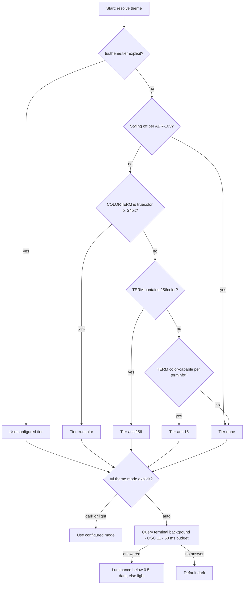

# 08 — Theming and Design Tokens

This chapter is the single home for design tokens and theming (Volume 0, chapter 03). It
completes the ADR-026 closed vocabulary by **fixing the Danger token** (ADR-105), defines
the derived palette both themes render from, specifies the token-to-ANSI mapping for the
four degradation tiers, defines the light-terminal fallback theme, and mints the
`[tui.theme]` configuration keys. The CLI's sparse styling consumes the 16-color-safe
subset of these tables per ADR-103; the TUI consumes all tiers.

All contrast figures in this chapter are WCAG 2.x relative-luminance contrast ratios,
rounded to two decimals. The normative thresholds (NFR-UX-040): **≥ 4.5:1** for any text
role, **≥ 3:1** for non-text interactive or state-bearing elements. Decorative elements
(borders, dividers) carry no threshold.

## Brand tokens

The closed token vocabulary (ADR-026, completed here):

| Token | Value | Role anchor |
|---|---|---|
| **Primary** | `#7C5CFF` | Violet accent: selection, focus, interactive affordances, brand marks |
| **Secondary** | `#8C7B6E` | Warm taupe: muted/secondary text, de-emphasized chrome |
| **Tertiary** | `#F5F2ED` | Warm off-white: body text on dark; the light theme background |
| **Neutral** | `#121417` | Near-black: the dark theme background; text on light |
| **Danger** | `#FF6B6B` | Soft red: errors, destructive actions, denial states — **fixed by this chapter** (ADR-105) |

Danger contrast on Neutral `#121417` is **6.65:1**, exceeding the 4.5:1 criterion ADR-026
left open; this closes ADR-026's PENDING VALIDATION item (see the volume register). Danger
on the light background fails (2.49:1 on Tertiary), so the light theme renders Danger
through the derived value `#B3261E` (5.85:1) — same token, theme-resolved value, exactly
as Primary and Secondary resolve to readable variants per theme below.

Semantic states beyond danger (success, warning) introduce **no new hue tokens**: the
vocabulary is closed (ADR-026). Success renders as Primary-family values with a `ok`/`✓`
textual marker; warnings render as Secondary-family values with a `!` marker. Danger, too,
is never color-only: every danger-classified element carries a textual marker or label at
every tier (NFR-UX-040 criterion), so meaning survives monochrome terminals and color
vision deficiencies.

## Derived palette

Derived values are part of the closed vocabulary (changing one is a specification change).
Each is derived from exactly one token.

### Dark theme (default)

| Name | Value | Derived from | Purpose | Contrast on `#121417` |
|---|---|---|---|---|
| `bg` | `#121417` | Neutral | Screen background | — |
| `surface` | `#1A1D22` | Neutral | Panels, modals, status bar | 1.16 (decorative) |
| `selection` | `#251F3D` | Neutral+Primary | Selected row background | 1.30 (decorative) |
| `border` | `#2E333B` | Neutral | Borders, dividers | 1.45 (decorative) |
| `text` | `#F5F2ED` | Tertiary | Body text | **16.52** |
| `text_muted` | `#8C7B6E` | Secondary | Secondary text on `bg` | **4.55** |
| `text_muted_hi` | `#B0A396` | Secondary | Secondary text on `surface`/`selection` | **7.49** |
| `accent` | `#7C5CFF` | Primary | Non-text accents: focus borders, bars, spinners | **4.25** (≥ 3 non-text) |
| `accent_text` | `#A48CFF` | Primary | Accent-colored text, links, keys | **6.83** |
| `danger` | `#FF6B6B` | Danger | Danger text and markers | **6.65** |

Text-on-surface checks: `text` on `surface` 15.13, on `selection` 14.01; `accent_text` on
`surface` 6.26, on `selection` 5.79; `danger` on `surface` 6.09; `text_muted_hi` on
`surface` 6.86. All pass 4.5:1. Rule derived from the numbers: **Primary `#7C5CFF` itself
is never used for normal-size text on dark** (4.25 < 4.5) — text roles use `accent_text`;
Primary paints non-text elements and bold/large headings only. Likewise `text_muted` is
legal only on `bg`; raised surfaces use `text_muted_hi`.

### Light fallback theme

| Name | Value | Derived from | Purpose | Contrast on `#F5F2ED` |
|---|---|---|---|---|
| `bg` | `#F5F2ED` | Tertiary | Screen background | — |
| `surface` | `#FFFFFF` | Tertiary | Panels, modals, status bar | 1.12 (decorative) |
| `selection` | `#E9E4DB` | Tertiary | Selected row background | 1.13 (decorative) |
| `border` | `#DDD6CA` | Tertiary | Borders, dividers | 1.29 (decorative) |
| `text` | `#121417` | Neutral | Body text | **16.52** |
| `text_muted` | `#665749` | Secondary | Secondary text | **6.22** |
| `accent` | `#7C5CFF` | Primary | Non-text accents | **3.89** (≥ 3 non-text) |
| `accent_text` | `#5B3DD6` | Primary | Accent-colored text, links, keys | **6.10** |
| `danger` | `#B3261E` | Danger | Danger text and markers | **5.85** |

Text-on-surface checks: `text` on `surface` 18.45, on `selection` 14.57; `accent_text` on
`surface` 6.81, on `selection` 5.38; `danger` on `surface` 6.54, on `selection` 5.16;
`text_muted` on `surface` 6.94, on `selection` 5.48. All pass 4.5:1. The raw Secondary
`#8C7B6E` (3.64) and raw Danger `#FF6B6B` (2.49) fail on light and are not used as light
text values.

## Degradation tiers

Four tiers (ADR-026): `truecolor` → `ansi256` → `ansi16` → `none`. Tier selection is
FR-TUI-008 / ADR-106. The truecolor tier renders the tables above exactly. The lower tiers:

### ansi256 tier

Nearest xterm-256 palette entries (6×6×6 cube and grayscale ramp), chosen so text roles
keep ≥ 4.5:1 against the tier's background entry:

| Role | Dark: index (value) | Contrast on 233 | Light: index (value) | Contrast on 255 |
|---|---|---|---|---|
| `bg` | 233 (`#121212`) | — | 255 (`#EEEEEE`) | — |
| `surface` | 234 (`#1C1C1C`) | decorative | 231 (`#FFFFFF`) | decorative |
| `selection` | 235 (`#262626`) | decorative | 253 (`#DADADA`) | decorative |
| `border` | 237 (`#3A3A3A`) | decorative | 250 (`#BCBCBC`) | decorative |
| `text` | 255 (`#EEEEEE`) | 16.15 | 233 (`#121212`) | 16.15 |
| `text_muted` | 101 (`#87875F`) | 5.05 | 240 (`#585858`) | 6.13 |
| `text_muted_hi` | 144 (`#AFAF87`) | 8.30 | 240 (`#585858`) | 6.13 |
| `accent` (non-text) | 99 (`#875FFF`) | 4.56 | 99 (`#875FFF`) | 3.54 (≥ 3) |
| `accent_text` | 141 (`#AF87FF`) | 6.90 | 56 (`#5F00D7`) | 7.33 |
| `danger` | 203 (`#FF5F5F`) | 6.29 | 124 (`#AF0000`) | 6.41 |

### ansi16 tier

The 16-color tier maps roles to the named ANSI indices below. Actual colors are defined by
the user's terminal palette, so exact ratios cannot be guaranteed at this tier; the mapping
is chosen so that the de-facto standard VGA palette (the reference recorded as a register
assumption) meets the thresholds, and variance is RISK-UX-040. Backgrounds are never
painted at this tier — the terminal's default background is used, selection renders as
reverse video, and surfaces are delimited by borders only.

| Role | Dark: ANSI index | VGA reference contrast | Light: ANSI index | VGA reference contrast |
|---|---|---|---|---|
| `text` | 15 (bright white) | 21.0 on black | 0 (black) | 21.0 on white |
| `text_muted` | 7 (white) | 9.04 | 8 (bright black) | 7.46 |
| `accent` / `accent_text` | 13 (bright magenta) | 8.00 | 5 (magenta) | 6.38 |
| `danger` | 9 (bright red) | 5.25 | 1 (red) | 7.75 |
| `border` | 8 (bright black) | decorative | 7 (white) | decorative |
| `selection` | reverse video | — | reverse video | — |

### none tier (no-color / monochrome)

No color attributes at all. Meaning is carried by text attributes and markers:

| Role | Rendering |
|---|---|
| `text` | plain |
| `text_muted` | plain (position and labels carry the distinction) |
| `accent` / focus | **bold**; focused-panel border doubles its corner markers |
| `selection` | reverse video |
| `danger` | **bold** plus the mandatory textual marker (`!` prefix or an explicit label such as `error`, `denied`) |
| `border` | plain ASCII/box characters |

The no-color tier applies when the ADR-103 resolution disables styling (`NO_COLOR`,
`--color=never`, non-TTY) or when `tui.theme.tier = "none"`.

## Tier and mode resolution



The diagram shows the two-stage resolution FR-TUI-008 specifies. Components: the tier
ladder (configuration override, then the ADR-103 styling decision, then the `COLORTERM`
convention, then `TERM` inspection backed by terminfo) and the mode branch (configuration
override, else a background-color query with a bounded 50 ms budget, defaulting to dark).
Relations: tier resolves before mode; both resolve exactly once at shell start and again
only on explicit configuration change (`tui.theme.*` watch), never mid-frame. Constraints:
the `COLORTERM` convention and the OSC 11 background query are ecosystem conventions with
uneven support — recorded as a register assumption and an open question respectively; when
they are absent the ladder degrades conservatively (a truecolor-capable terminal that
advertises nothing renders at ansi256 or ansi16 correctly, just less faithfully).
Multiplexers: inside tmux/screen, `TERM` reflects the multiplexer; the ladder trusts
`COLORTERM` when the multiplexer passes it through and otherwise lands on ansi256 —
deliberate conservatism over invented capability probing.

## Requirements

### FR-UX-040 — Closed design-token vocabulary with fixed Danger

- Type: Functional
- Status: Approved
- Priority: P0
- Phase: MVP
- Source: Provided
- Owner: TUI (Volume 8); consumed by CLI per ADR-103
- Affected components: TUI; CLI; documentation surfaces
- Dependencies: ADR-026, ADR-105; NFR-UX-040
- Related risks: RISK-UX-040

#### Description

The five brand tokens with the values in this chapter — including Danger fixed at
`#FF6B6B` — plus the derived palettes (dark and light) form the complete, closed styling
vocabulary. Every styled element in the TUI and the CLI MUST reference a role from this
chapter's tables; hardcoded color values outside these tables are defects. Semantic states
introduce no new hues (success/warning render via Primary/Secondary families with textual
markers). Danger-classified content always carries a textual marker in addition to color.
Additions or changes to tokens, derived values, or role mappings occur only through the
Volume 0 change procedure with re-validated contrast figures.

#### Motivation

ADR-026 fixed four tokens and delegated Danger to this volume under a contrast criterion;
a closed vocabulary is what makes brand identity testable (golden frames assert exact
values) and accessibility provable (every pair is enumerable and checked).

#### Actors

TUI theme engine; CLI styling writer; extension surfaces that render through provided
styles; documentation toolchain.

#### Preconditions

None — the vocabulary is static specification content.

#### Main flow

1. A component requests a style by role name.
2. The theme engine resolves role → value for the active theme and tier.
3. The lipgloss style renders with that value.

#### Alternative flows

- Tier below truecolor: the role resolves through the tier tables instead of hex values.
- Extension-provided panels (post-MVP surface): receive resolved styles, never raw
  freedom to pick colors.

#### Edge cases

- A role used on a background it has no validated pair for: prohibited by construction —
  the role tables enumerate legal foreground/background pairs; the theme engine exposes
  only those pairs.
- Terminal palettes that redefine ANSI colors at the ansi16 tier: RISK-UX-040; the
  mapping targets the reference palette and variance is documented, with `tui.theme.tier`
  as the user override.

#### Inputs

Role names; active theme and tier.

#### Outputs

Resolved styles; identical values across TUI and CLI for shared roles (ADR-103 risk
mitigation).

#### States

Not applicable — static vocabulary.

#### Errors

None at runtime for the vocabulary itself; misuse is a build-time/review defect backed by
the golden suite.

#### Constraints

No component may embed hex values or ANSI indices outside the theme engine; a repository
grep gate enforces this (Volume 13 TUI suite).

#### Security

None; color values carry no data.

#### Observability

`tui.theme.resolved` reports the active theme identity per session.

#### Performance

Role resolution is a table lookup, done at style-construction time, not per frame.

#### Compatibility

Values chosen render within sRGB and quantize acceptably to the 256-color cube (tables
above).

#### Acceptance criteria

- Given the golden-frame suite, when any frame is rendered at the truecolor tier, then
  every emitted color value appears in this chapter's tables (frame scanner assertion).
- Given the repository, when the color-literal grep gate runs, then zero hex or ANSI
  literals exist outside the theme engine package.
- Given a danger-classified element at any tier, when rendered, then a textual danger
  marker is present in the frame text.
- Negative case: given a hypothetical style request pairing `text_muted` on `selection`
  (an unvalidated pair), when compiled against the theme engine API, then no such pair is
  constructible.

#### Verification method

Golden-frame color scanning across the tier×mode matrix; static grep gate in CI; contrast
recomputation script over the tables (Volume 13 owns the check's placement).

#### Traceability

PRD-008; ADR-026, ADR-105; NFR-UX-040; single-home matrix (design tokens → Volume 8).

### FR-UX-041 — Token-to-ANSI degradation tiers

- Type: Functional
- Status: Approved
- Priority: P0
- Phase: MVP
- Source: Provided
- Owner: TUI (Volume 8)
- Affected components: TUI; CLI (16-color-safe subset)
- Dependencies: FR-UX-040, FR-TUI-008; ADR-103, ADR-106
- Related risks: RISK-UX-040

#### Description

Rendering degrades through exactly four tiers — `truecolor`, `ansi256`, `ansi16`, `none` —
using the mapping tables of this chapter. Tier behavior is total: every role has a defined
rendering at every tier, so no element disappears or falls back to terminal defaults
unexpectedly. At `ansi16` no backgrounds are painted and selection is reverse video; at
`none` only text attributes (bold, reverse) and markers carry meaning. The active tier is
uniform for the whole shell — mixed-tier frames are prohibited.

#### Motivation

ADR-026 mandates normatively defined tiers rather than runtime approximation heuristics;
total, per-role tables are what make degraded terminals a designed experience and
golden-testable.

#### Actors

Theme engine; renderer; users on limited terminals.

#### Preconditions

Tier resolved per FR-TUI-008.

#### Main flow

1. Tier resolves at shell start.
2. The theme engine binds every role to its tier rendering.
3. All frames render with that binding.

#### Alternative flows

- Configuration change to `tui.theme.tier`: re-resolution and full repaint
  (`tui.theme.resolved` re-emitted).

#### Edge cases

- Terminal advertises 256 colors but renders the cube inaccurately: accepted variance;
  the mapping targets the standard cube values (register assumption).
- `TERM` unset inside the TUI (changed environment mid-session): tier never re-probes
  mid-session; the start-time decision stands.

#### Inputs

Resolved tier; role tables.

#### Outputs

Tier-consistent frames.

#### States

Not applicable — tier is resolved configuration, not a state machine.

#### Errors

None minted; unsupported sequences simply render degraded per tier choice.

#### Constraints

The CLI styles only with the `ansi16` dark/light rows (ADR-103 decision 3); the TUI uses
all tiers.

#### Security

None.

#### Observability

Tier in `tui.shell.started` and `tui.theme.resolved`.

#### Performance

Tier binding at start; zero per-frame cost.

#### Compatibility

Tier tables cover every terminal class in the chapter 12 matrix.

#### Acceptance criteria

- Given each tier forced via `tui.theme.tier`, when the golden matrix renders, then
  frames contain only sequences legal for that tier (no truecolor SGR at ansi256/16/none;
  no color SGR at none).
- Given the ansi16 tier, when any frame renders, then no background SGR is emitted and
  selection appears as reverse video.
- Given the none tier, when a permission prompt renders, then decision entries are
  distinguishable via text and attributes alone (scripted assertion).
- Negative case: given a truecolor terminal with `tui.theme.tier = "ansi16"`, when
  rendered, then output honors ansi16 (user override wins over capability).

#### Verification method

Golden frames per tier; SGR-sequence scanners asserting tier legality; matrix in Volume
13's TUI suite.

#### Traceability

PRD-008; ADR-026, ADR-103, ADR-106; chapter 12 compatibility matrix.

### FR-UX-042 — Light-terminal fallback theme

- Type: Functional
- Status: Approved
- Priority: P1
- Phase: MVP
- Source: Provided
- Owner: TUI (Volume 8)
- Affected components: TUI; CLI (light-variant 16-color subset)
- Dependencies: FR-UX-040, FR-TUI-008; ADR-105, ADR-106
- Related risks: RISK-UX-040

#### Description

The light theme renders on light backgrounds using the light derived palette: Tertiary
background, Neutral text, `accent_text` `#5B3DD6`, `text_muted` `#665749`, `danger`
`#B3261E` — every text pair ≥ 4.5:1 as tabulated. The light theme exists at every tier
(its ansi256 and ansi16 columns above). Mode selection: `tui.theme.mode` explicit, else
background detection with dark as the default when detection is unavailable (ADR-106).
The light theme is a first-class rendering — every screen, overlay, and golden frame
exists in both modes (NFR-TUI-002 matrix).

#### Motivation

Light-background terminals are common; ADR-026 rejected dark-only as a usability failure.
An unspecified "inverted" theme would break the contrast guarantees this chapter proves.

#### Actors

Users on light terminals; theme engine.

#### Preconditions

Mode resolved per FR-TUI-008.

#### Main flow

1. Mode resolves to light.
2. The light palette binds; frames render.

#### Alternative flows

- Mode misdetection (dark terminal detected as light): user sets `tui.theme.mode`; the
  configured value always wins.

#### Edge cases

- Terminal background changes mid-session (user switches profile): no re-probe
  mid-session; the user toggles `tui.theme.mode` (watched, applies with full repaint).
- Light mode at the none tier: attributes-only rendering is background-agnostic; mode has
  no effect at `none`.

#### Inputs

Resolved mode; light palette tables.

#### Outputs

Light-mode frames meeting the same contrast criteria as dark.

#### States

Not applicable.

#### Errors

None minted (detection failure defaults dark silently).

#### Constraints

No light-mode value may fall below the NFR-UX-040 thresholds; raw Secondary and raw Danger
are prohibited as light text values (they fail: 3.64 and 2.49).

#### Security

None.

#### Observability

Mode and its source (`config`, `detected`, `default`) in `tui.theme.resolved`.

#### Performance

Same as dark; palette binding at start.

#### Compatibility

OSC 11 detection support varies (open question in the register); the default-dark
fallback keeps behavior defined everywhere.

#### Acceptance criteria

- Given `tui.theme.mode = "light"`, when the golden matrix renders, then every text
  foreground/background pair in emitted frames appears in the light tables (scanner).
- Given a terminal answering the background query with a light color within 50 ms, when
  mode is `auto`, then the light theme activates and `tui.theme.resolved` records source
  `detected`.
- Given no answer to the background query, when mode is `auto`, then dark activates
  within the 50 ms budget (no visible stall).
- Negative case: given raw Danger `#FF6B6B` requested as a light text value, when
  compiled against the theme engine API, then no such binding exists.

#### Verification method

Golden frames in light mode across tiers; scripted OSC 11 responder in the PTY harness;
contrast scanner over light-mode frames.

#### Traceability

PRD-008; ADR-026 (light fallback mandate), ADR-105, ADR-106; NFR-UX-040.

### FR-TUI-008 — Theme configuration and resolution

- Type: Functional
- Status: Approved
- Priority: P1
- Phase: MVP
- Source: Design
- Owner: TUI (Volume 8)
- Affected components: TUI; Configuration Manager (schema/precedence per Volume 10)
- Dependencies: FR-UX-040, FR-UX-041, FR-UX-042; ADR-103, ADR-106
- Related risks: RISK-UX-040

#### Description

The `[tui.theme]` table configures theming:

```toml
[tui.theme]
mode = "auto"   # "auto" | "dark" | "light"
tier = "auto"   # "auto" | "truecolor" | "ansi256" | "ansi16" | "none"
```

| Key | Type | Default | Meaning |
|---|---|---|---|
| `tui.theme.mode` | string enum | `"auto"` | Theme mode; `auto` uses background detection with dark default |
| `tui.theme.tier` | string enum | `"auto"` | Color tier; `auto` uses the ADR-106 ladder |

Resolution runs once at shell start per the flowchart above and re-runs only on watched
configuration change of these keys (full repaint, `tui.theme.resolved` emitted). Invalid
values are E-TUI-004: at TUI start the shell falls back to the defaults (`auto`/`auto`)
and shows a toast; validation commands surface the same envelope with exit code 3.

#### Motivation

Users need deterministic overrides for every automatic decision (misdetected backgrounds,
lying `TERM` values); two closed-enum keys cover the whole space without inviting per-key
color overrides that would break the closed vocabulary.

#### Actors

Users; Configuration Manager; theme engine.

#### Preconditions

Configuration resolved via ConfigPort.

#### Main flow

1. Shell reads `tui.theme.*` from the resolved configuration.
2. Tier then mode resolve per the ladder.
3. `tui.theme.resolved` is emitted; styles bind.

#### Alternative flows

- Watched change: re-resolve, repaint, re-emit.
- Environment override (`ANDROMEDA_TUI_THEME_MODE`, per the Volume 10 mapping): behaves
  as any configuration layer; precedence is Volume 10's.

#### Edge cases

- `tier = "truecolor"` on a 16-color terminal: honored — the user override is
  authoritative; output may render inaccurately, which the doctor command reports as a
  diagnosis (chapter 06 family).
- Both keys invalid: single E-TUI-004 with both findings; defaults for both.

#### Inputs

`tui.theme.mode`, `tui.theme.tier`; environment signals per ADR-106.

#### Outputs

Resolved theme record (mode, tier, source attributions); repaint on change.

#### States

Not applicable — resolved configuration, no machine.

#### Errors

E-TUI-004 (invalid theme configuration).

#### Constraints

Resolution MUST complete within the 50 ms detection budget plus configuration read time;
it MUST NOT block first paint beyond SM-06(b)'s allocation.

#### Security

None; theme keys carry no sensitive data.

#### Observability

`tui.theme.resolved` with mode, tier, and per-decision source (`config`, `env`,
`detected`, `default`, `ladder`).

#### Performance

Once per start and per change; never per frame.

#### Compatibility

Enum values are stable API (SM-20 discipline applies to configuration schema per Volume
10).

#### Acceptance criteria

- Given `tui.theme.tier = "ansi16"` in workspace configuration, when the shell starts on
  a truecolor terminal, then frames are ansi16-legal and `tui.theme.resolved` records
  source `config`.
- Given `tui.theme.mode` changed while running, when the watch fires, then a full repaint
  in the new mode occurs without restart.
- Given `tui.theme.tier = "plasma"`, when the TUI starts, then defaults apply, a toast
  cites E-TUI-004, and `andromeda config validate` exits 3 with the same code.
- Observability case: given any start, when `tui.theme.resolved` is inspected, then every
  decision carries a source attribution.

#### Verification method

Configuration-matrix tests in the PTY harness; watch-triggered repaint test; validation
command tests asserting exit code 3.

#### Traceability

PRD-008; ADR-106; Volume 10 configuration schema and env-mapping; E-TUI-004.

## Non-functional requirements

### NFR-UX-040 — Contrast and non-color redundancy

- Category: Accessibility
- Priority: P0
- Phase: MVP
- Metric: (a) WCAG 2.x contrast ratio of every text foreground/background pair emitted by TUI and CLI styling, per theme and tier where values are specification-controlled (truecolor, ansi256); (b) fraction of danger- and state-classified elements whose meaning is carried by text or attributes in addition to color
- Target: (a) ≥ 4.5:1 for all text pairs and ≥ 3:1 for non-text interactive elements; (b) 100%
- Minimum threshold: same as target — a failing pair is a defect, not a tolerance
- Measurement method: automated contrast computation over the chapter tables (spec side) and over scanned golden-frame color pairs (implementation side); frame-text scan for danger markers
- Test environment: golden-frame matrix, tiers truecolor and ansi256, modes dark and light, Tier 1 platforms
- Measurement frequency: every merge touching theme code or tables; every release
- Owner: TUI (Volume 8)
- Dependencies: FR-UX-040, FR-UX-041, FR-UX-042; ADR-105
- Risks: RISK-UX-040
- Acceptance criteria: The contrast scanner reports zero text pairs below 4.5:1 and zero non-text interactive pairs below 3:1 at specification-controlled tiers; the marker scan finds a textual danger marker for 100% of danger-classified elements at every tier including `none`; ansi16-tier reference-palette figures are published in this chapter and re-verified when the mapping changes.

## Risks

### RISK-UX-040 — User-palette variance at the ansi16 tier breaks contrast or brand

- Category: Technical / UX
- Probability: Medium
- Impact: Medium
- Severity: Medium
- Mitigation: The ansi16 mapping targets the de-facto VGA reference palette with published reference ratios; no backgrounds are painted at that tier (the terminal's own contrast baseline is preserved); reverse video carries selection; danger and state meaning is never color-only (NFR-UX-040); `tui.theme.tier = "none"` is a one-key escape to attribute-only rendering
- Detection: chapter 12 terminal-matrix testing on popular emulators and their bundled palettes; user reports; doctor output includes the resolved tier for support triage
- Owner: TUI (Volume 8)
- Status: Open

Terminals let users redefine the 16 ANSI colors arbitrarily; a palette with, say, dim red
on dark gray degrades danger visibility below any threshold Andromeda can verify. The
design accepts this honestly: at ansi16 the specification controls mapping, not color
values, and the redundancy rules guarantee meaning survives even a hostile palette.

## Error catalog: E-TUI (theming)

### E-TUI-004 — Invalid theme configuration

- Category: Configuration
- Severity: Error
- User message: "Theme configuration is invalid: <key> = <value class>; expected <enum>. Using defaults."
- Technical message: offending key path, expected enum values, configuration source layer (from ConfigPort attribution)
- Cause: `tui.theme.mode` or `tui.theme.tier` set to a value outside its closed enum
- Safe-to-log data: key path, expected values, source layer (never the raw value beyond its class)
- Recoverability: recoverable by correcting configuration; TUI proceeds on defaults
- Retry policy: re-validated on configuration change
- Recommended action: `andromeda config validate`; set one of the documented enum values
- Exit-code mapping: 3 (validation/CLI surfaces); in-TUI occurrence degrades to defaults without exit
- HTTP mapping: not applicable
- Telemetry event: `tui.theme.resolved` (with error flag)
- Security implications: raw values excluded from messages and telemetry per the E-CLI-002 precedent

## Events

| Event | Version | Producer | Typical consumers | Payload summary |
|---|---|---|---|---|
| `tui.theme.resolved` | 1 | TUI | Observability | mode, tier, per-decision source (`config`, `env`, `detected`, `default`, `ladder`), error flag |
