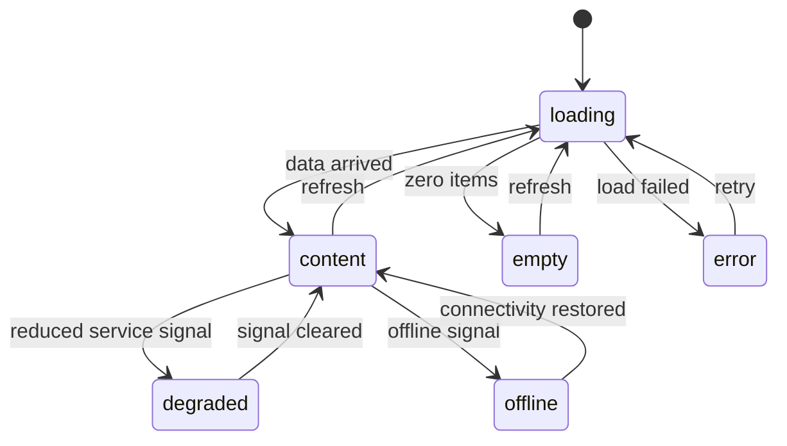

# 11 — Interaction Patterns

This chapter defines the interaction patterns every TUI screen composes: streaming
rendering, activity indication (spinners and progress bars), modal overlays and
confirmations, toast notifications, the canonical view states (empty, loading, offline,
degraded, error), copy and paste, and data navigation (search, filtering, pagination,
virtualization). Patterns are specified once here and referenced by the screen chapters
(09, 10); the shell that hosts them (panels, focus, keys, resize) is chapter 07's; CLI
progress and error presentation outside the TUI are FR-UX-003 and FR-UX-001.

## Streaming rendering

Model output, tool activity, and log tails arrive as ordered stream items (`ChatStream`
events, `ToolEvent` streams, Event Bus subscriptions). The TUI renders them into
**append-only stream regions**: content is only ever appended or finalized, never
retroactively rewritten, so scrollback stays truthful and linear rendering (accessible
output mode, chapter 12) works from the same data.

### FR-UX-070 — Streaming output rendering

- Type: Functional
- Status: Approved
- Priority: P0
- Phase: MVP
- Source: Provided
- Owner: TUI (Volume 8)
- Affected components: TUI, Event Bus
- Dependencies: ADR-006; ADR-012 (bounded subscriber buffers); FR-UX-074
- Related risks: RISK-UX-080

#### Description

Stream deltas are folded into the Bubble Tea model as messages and rendered in coalesced
frames: at most one layout pass per 33 ms under sustained input, and any pending delta
MUST be rendered within 100 ms of arrival. Ordering follows the source stream exactly; a
streaming region shows an insertion-point activity indicator (FR-UX-071) while open and a
terminal marker when the stream ends (`completed`, `failed`, `cancelled` — the outcome
word of the owning entity, verbatim). Interrupting (the session interrupt action) cancels
via the run's context (FR-ARCH-004); content received up to cancellation remains rendered
and persisted. All streamed content is sanitized before rendering: terminal control
sequences in model or tool output MUST be neutralized (rendered as visible escapes), with
only line breaks and tabs honored.

#### Motivation

Live output is the product's heartbeat (PRD-008; MVP item 16); coalescing bounds render
cost under token floods; sanitization closes the terminal-escape injection channel from
untrusted model/tool output.

#### Actors

Users; providers (via ProviderPort streams); Tool Runtime; Event Bus.

#### Preconditions

An active session with a streaming source.

#### Main flow

1. Deltas arrive as messages; the model appends to the region's buffer.
2. The coalescer schedules a frame within the 33/100 ms windows.
3. The stream's terminal event finalizes the region with its outcome marker.

#### Alternative flows

- Cancellation: the region finalizes with `cancelled`; partial content persists.
- Provider stream error: the region finalizes with `failed` plus the envelope summary
  (FR-UX-001), and the error lands in the error center.

#### Edge cases

- Burst larger than one frame's budget: coalescing accumulates; no delta is dropped —
  backpressure is absorbed by the bounded subscription buffer per ADR-012 policy, and a
  buffer overflow surfaces as a visible degradation (FR-UX-074), never silent loss.
- Very long lines: soft-wrapped at render; the underlying content is not truncated.
- Multiple concurrent streams (parallel tool calls): each region renders independently;
  frame coalescing is global so total render rate stays bounded.

#### Inputs

Ordered stream items; terminal events with outcomes.

#### Outputs

Rendered append-only regions; no mutation of the underlying records.

#### States

Region open → finalized; outcome words come from the owning entity's frozen vocabulary.

#### Errors

Stream failures render envelopes; TUI-internal render failures are the E-TUI family
(chapter 07).

#### Constraints

Append-only discipline; sanitization before layout; coalescing windows as stated (33 ms
minimum interval, 100 ms maximum staleness).

#### Security

Neutralized escapes prevent output-driven terminal manipulation (cursor moves, title
changes, clipboard writes via OSC injection) — a malicious-model-output mitigation
(Volume 9 threat model).

#### Observability

Rendering emits no events per delta (hot path); stream lifecycle events belong to their
owning subsystems. Dropped-frame and staleness counters feed Volume 12 metrics.

#### Performance

Andromeda-added latency per chunk ≤ 50 ms p95 (SM-08, formalized by Volume 12); the
33/100 ms coalescing rule is the mechanism this requirement fixes.

#### Compatibility

Identical behavior across tiers; in the `ascii` glyph set the insertion-point indicator
uses the ASCII spinner (FR-TUI-067).

#### Acceptance criteria

- Given a mock provider emitting 200 deltas in 1 s, when rendered, then every delta's text
  appears in order and no frame interval undercuts 33 ms (ordering/coalescing case).
- Given a delta containing `ESC ] 52` or cursor-addressing sequences, when rendered, then
  the sequence appears as visible escaped text and the terminal state is unaffected
  (security case).
- Given an interrupt during streaming, when the run cancels, then the region finalizes
  with `cancelled` and prior content persists (cancellation case).
- Negative case: given a stream error mid-flow, then the region finalizes with `failed`
  and the envelope reaches the error center — no region is left open.
- Observability case: staleness counters are exported per the Volume 12 measurement
  method.

#### Verification method

teatest with a scripted mock stream (ordering, coalescing timing, sanitization fixtures);
SM-08 benchmark harness; escape-injection fixture corpus in the Volume 13 TUI suite.

#### Traceability

PRD-008, PRD-005; ADR-006, ADR-012; SM-08 (Volume 12 formalization); FR-ARCH-004.

## Activity indication

### FR-UX-071 — Spinners and progress bars

- Type: Functional
- Status: Approved
- Priority: P1
- Phase: MVP
- Source: Provided
- Owner: TUI (Volume 8)
- Affected components: TUI
- Dependencies: FR-TUI-067 (glyph sets); FR-UX-070; NFR-UX-077
- Related risks: RISK-UX-080

#### Description

Two indicator forms, selected by what is known: a **determinate progress bar** whenever
total quantity is known (bytes, steps, items) — filled/unfilled track, percentage, and
absolute figures (`12.3 / 19.2 MB`), updated at most 10 times per second; an
**indeterminate spinner** otherwise — `unicode` set: braille frames at a 120 ms tick;
`ascii` set: `-\|/` — always accompanied by a label naming the operation and, after 2 s,
elapsed time, and, after 10 s, the cancel hint where the operation is cancellable. An
indeterminate operation whose total becomes known upgrades to a bar in place. With
`tui.reduce_motion = true` (chapter 12) spinners render as a static `...` marker whose
elapsed-time text updates at most once per second, and bars update at most once per
second. Every long-running operation visible on screen MUST carry exactly one indicator;
the status bar shows a global aggregate when activity is off-screen.

#### Motivation

Unlabeled or duplicated activity indicators are how interfaces lie; indicators tied to
operations, with elapsed time and cancel affordances, keep long agent work honest
(PRD-008) and accessible (chapter 12 motion rules).

#### Actors

Users; any component reporting progress through events or port streams.

#### Preconditions

A visible operation in flight.

#### Main flow

1. Operation starts → indicator appears within the NFR-UX-077 deadline.
2. Progress events update it; completion replaces it with the outcome marker.

#### Alternative flows

- Total unknown → spinner; total learned → in-place upgrade to a bar.
- Off-screen activity → status-bar aggregate only.

#### Edge cases

- Zero-length work (instant completion): no indicator flashes in and out; outcomes render
  directly when work completes inside one frame.
- Progress regression (a retry restarts a download): the bar resets with a retry
  annotation rather than running backwards silently.
- Stalled progress (no event for 30 s): the indicator gains a `stalled` annotation; it
  never keeps animating as if healthy (RISK-UX-080).

#### Inputs

Progress events (fraction or absolute), operation labels, cancellability flags.

#### Outputs

Rendered indicators; no side effects.

#### States

Indicator states: absent → indeterminate/determinate → outcome; `stalled` is an
annotation, not a state machine.

#### Errors

None of its own; failed operations end their indicator with the `failed` outcome and the
envelope path.

#### Constraints

Update rate caps as stated; one indicator per operation; labels are mandatory.

#### Security

Labels and figures never include secret material; byte counts and paths follow the
Volume 9 redaction rules applied to their sources.

#### Observability

Indicators render observable state; they emit no events themselves.

#### Performance

Spinner ticks and bar updates ride the FR-UX-070 coalescer; caps (120 ms tick, 10/s bar,
1/s reduced-motion) bound render cost.

#### Compatibility

Both glyph sets render both forms; reduced motion honors the same information content.

#### Acceptance criteria

- Given a download with known size, when rendered, then a determinate bar shows percent
  and absolute figures and updates at most 10 times per second (form-selection case).
- Given `tui.reduce_motion = true`, when an operation spins for 5 s, then no animated
  frames render and elapsed text updates at most once per second (accessibility case).
- Given a stalled operation at 30 s without progress, when rendered, then the `stalled`
  annotation appears (negative case).
- Given a cancellable operation past 10 s, when rendered, then the cancel hint is visible
  and functional (cancellation case).

#### Verification method

teatest time-controlled scripts per form and glyph set; reduced-motion golden frames;
stall-injection fixture.

#### Traceability

PRD-008; FR-UX-070, FR-TUI-067, NFR-UX-077; FR-UX-003 (CLI counterpart).

## Modal overlays and confirmations

### FR-UX-072 — Modal overlays and confirmation tiers

- Type: Functional
- Status: Approved
- Priority: P0
- Phase: MVP
- Source: Provided
- Owner: TUI (Volume 8)
- Affected components: TUI, Permission Manager (presentation only)
- Dependencies: ADR-110 (destructiveness classes); FR-CLI-010 (CLI counterpart);
  chapter 07 focus rules
- Related risks: RISK-UX-079, RISK-UX-080

#### Description

Modal overlays capture focus exclusively and stack at most two deep (a confirmation may
open above the palette or help; nothing opens above a confirmation). The background dims
(or renders a `[modal]` marker line in the no-color tier). `esc` closes any non-destructive
modal without effect. Confirmations bind to the action's declared destructiveness class:
**tier 1** (reversible) — no confirmation; **tier 2** (destructive but recoverable:
cancel a run, disable a provider, apply an update) — a modal with explicit `y`/`enter`
on the affirmative and `n`/`esc` defaulting to No; **tier 3** (irreversible or
high-impact: discard interrupted work, remove a plugin, bulk discard) — typed
confirmation of the target's name. Approval prompts for permission decisions are rendered
by the approval presenter (Volume 9 semantics; chapter 09 wireframe) using this modal
mechanic but their decision vocabulary and expiry come from Volume 9 — this requirement
governs presentation only. Confirmation prompts MUST state the concrete consequence
("discards 2 unfinished tasks; records are kept"), never a generic "are you sure".

#### Motivation

One overlay discipline prevents focus ambiguity and keystroke leakage into destructive
buttons; graded confirmations keep the common case frictionless while making the
irreversible case deliberate (Volume 1 precedence: data integrity above convenience).

#### Actors

Users; actions with destructiveness classes; the approval presenter.

#### Preconditions

An action requiring confirmation, or an overlay-opening action.

#### Main flow

1. Action invoked → its class resolves the tier → modal renders with consequence text.
2. Affirmative input executes; negative/`esc` cancels with zero effect.

#### Alternative flows

- Tier 3: the input field accepts only the exact target name; mismatch keeps the modal
  open with a mismatch note.
- Modal open when a second confirmation triggers (background failure): the second queues;
  confirmations never replace each other silently.

#### Edge cases

- Keystrokes in flight when a modal opens: input buffered before the modal renders is
  discarded, not applied to the modal — no accidental affirmatives from typing momentum.
- Terminal resize with a modal open: the modal re-centers; below overlay minimums it goes
  full-screen.
- Paste into a tier-3 field: allowed (bracketed paste, FR-UX-075) — typing is the
  friction, not the clipboard.

#### Inputs

Action destructiveness class; consequence text; user input.

#### Outputs

Confirmed execution or clean cancellation.

#### States

Modal stack depth 0–2; no persistence.

#### Errors

None of its own; refusals and failures belong to the confirmed action.

#### Constraints

Stack depth ≤ 2; `enter` MUST NOT be bound to the affirmative of tier-3 modals; buffered
input discard as stated.

#### Security

Approval prompts always render above everything and cannot be obscured by other overlays
(chapter 07 z-order rule); consequence text comes from the action declaration, not from
free-form strings supplied by extensions without the origin tag.

#### Observability

Confirmations resolve as part of `tui.action.invoked` (accepted/cancelled disposition in
the payload); approval outcomes are Volume 9 events.

#### Performance

Modal render within the NFR-UX-077 deadline.

#### Compatibility

Both glyph sets; no-color tier uses the marker-line dimming substitute.

#### Acceptance criteria

- Given a tier-2 action, when `enter` is pressed at default focus, then nothing executes
  (default-to-No case).
- Given a tier-3 discard of `fix/flaky-index`, when `fix/flaky-inde` is typed, then the
  modal refuses and stays open (mismatch negative case).
- Given buffered keystrokes when a modal opens, when it renders, then none apply to it
  (keystroke-leak case).
- Given a pending approval prompt, when the palette open is attempted, then it is refused
  with a status notice (exclusive-focus case).
- Observability case: a cancelled confirmation records disposition `cancelled` in
  `tui.action.invoked`.

#### Verification method

teatest interaction scripts per tier; keystroke-buffer injection test; z-order golden
frames; resize scripts.

#### Traceability

PRD-005, PRD-006; ADR-110; FR-CLI-010 (non-interactive counterpart); Volume 9 approval
semantics.

## Toast notifications

### FR-UX-073 — Toasts

- Type: Functional
- Status: Approved
- Priority: P1
- Phase: MVP
- Source: Provided
- Owner: TUI (Volume 8)
- Affected components: TUI
- Dependencies: FR-TUI-064 (error center); FR-UX-072
- Related risks: RISK-UX-080

#### Description

Toasts are non-focus-stealing notices stacked at the top-right (top line in stacked
layouts), at most 3 visible with older ones queued. Severity levels and defaults: info and
success auto-dismiss after `tui.toast_duration_ms` (default 4000); warning after twice
that; error toasts persist until dismissed and always also record to the error center, so
dismissing a toast never loses information. Duplicate toasts within 5 s coalesce with a
count (`x3`). Toasts never contain secret material and never carry actions other than
"open" (deep link to the owning screen) and "dismiss" — decisions belong to modals, not
toasts. While a modal holds focus, toasts still render but their auto-dismiss timers pause.

#### Motivation

Background events (stream finished off-screen, provider degraded, update available) need a
visibility channel that cannot interrupt typing or steal focus mid-approval.

#### Actors

Users; any subsystem surfacing notices via events.

#### Preconditions

TUI running.

#### Main flow

1. An event mapped to a toast arrives; the toast renders in the stack.
2. Timer or `dismiss` removes it; `open` navigates to the owning screen.

#### Alternative flows

- Stack full: new toasts queue FIFO; errors jump the queue.
- Accessible output mode: toasts render as appended notice lines (chapter 12), no timers.

#### Edge cases

- Toast storm (event flood): coalescing plus the queue bound rendering; the queue depth
  beyond 20 collapses into a single "N more notices — see logs" toast.
- A toast's target screen is gone (element removed): `open` lands on the owning list
  screen with a "no longer present" notice.

#### Inputs

Mapped events; severity; dedupe keys.

#### Outputs

Rendered notices; navigation on `open`.

#### States

Visible stack + FIFO queue; timers per toast; paused under modals.

#### Errors

None of its own; error toasts reference envelopes recorded elsewhere.

#### Constraints

Maximum 3 visible; timer defaults as stated; error toasts always double-record to the
error center.

#### Security

No secrets; content derives from envelope user-message fields and event summaries already
subject to redaction.

#### Observability

Toasts are presentation; the underlying events are the record. No per-toast events.

#### Performance

Toast render rides the frame coalescer; storms are bounded by coalescing and queue
collapse.

#### Compatibility

Both glyph sets; severity is conveyed by word and position, color only additionally
(chapter 12 parity rule).

#### Acceptance criteria

- Given an error toast dismissed, when the error center opens, then the envelope is
  present (no-information-loss case).
- Given 4 toasts in 1 s, when rendered, then at most 3 are visible and the fourth queues
  (bound case).
- Given the same warning 3 times in 5 s, when rendered, then one toast shows `x3`
  (coalescing case).
- Given a modal open, when a toast's timer would expire, then it remains until the modal
  closes (focus-safety case).
- Negative case: no toast ever captures focus or consumes a keystroke not addressed to it.

#### Verification method

teatest timing scripts (dismissal, queue, coalescing, modal pause); storm-injection
fixture.

#### Traceability

PRD-008; FR-TUI-064; FR-UX-072, FR-UX-074.

## Canonical view states

Every panel and screen renders exactly one of six canonical view states at any time. The
vocabulary is UI-level and distinct from entity states (which render *inside* the
`content` state).

The diagram shows the six view states and their transitions. `loading` is initial; there
are no terminal states — views live as long as their screen. Transitions are driven by
data arrival, zero-result detection, load failure, and runtime signals: `degraded` enters
on reduced-service signals (provider `degraded`, index `stale`, sandbox level lowered,
event-buffer overflow) and exits when the signal clears; `offline` enters on the runtime's
offline signal and exits on restoration; `error` offers retry, which re-enters `loading`.
Guards: signals come from runtime state and events — the TUI performs no probing of its
own. Constraints: `degraded` and `offline` MUST preserve last-known content visibly marked
as such, and every state except `content` names its cause and next step.

### FR-UX-074 — Canonical view states: empty, loading, offline, degraded, error

- Type: Functional
- Status: Approved
- Priority: P0
- Phase: MVP
- Source: Provided
- Owner: TUI (Volume 8)
- Affected components: TUI
- Dependencies: FR-UX-071; FR-UX-001; Volume 5 provider states; PAL degradation events
- Related risks: RISK-UX-080

#### Description

Every panel implements the six-state vocabulary above. Required content per state:
`loading` — activity indicator with operation label (FR-UX-071); `empty` — a one-line
statement of what would be here plus the screen's primary action with its binding;
`error` — the envelope's user message and recommended action (FR-UX-001) plus retry where
policy allows; `offline` — the word `offline`, which capabilities remain available
(local-first framing, PRD-003), and what restores; `degraded` — the cause (named signal),
the consequence, and the remediation hint, over last-known content marked stale with its
age. Offline and degraded are additionally aggregated as persistent status-bar badges
visible from every screen. State signals derive exclusively from runtime state and events
(Provider connection states, Index states, `pal.capability.degraded`, buffer overflow
notices); the TUI never invents its own connectivity or health checks.

#### Motivation

Silent staleness and generic emptiness destroy trust in an agent console: the difference
between "no errors" and "error list failed to load" is the difference between confidence
and false confidence (RISK-UX-080).

#### Actors

Users; runtime signal sources.

#### Preconditions

None — the vocabulary applies from first render.

#### Main flow

1. Panel enters `loading` on mount or refresh.
2. Data or signals drive transitions per the machine above.

#### Alternative flows

- Refresh from `content` keeps last content visible under the loading indicator
  (non-destructive refresh).

#### Edge cases

- Conflicting signals (offline and degraded): `offline` wins the panel state; the degraded
  badge remains in the status bar.
- Flapping signals: transitions debounce at 1 s so the UI does not strobe between states.
- Zero items arriving with an active filter: the empty state names the filter and offers
  clearing it — filtered-empty is not plain empty.

#### Inputs

Data results; runtime signals; filter context.

#### Outputs

Rendered states; no side effects.

#### States

The six-state vocabulary as diagrammed; per-panel, in-memory only.

#### Errors

`error` state renders envelopes; rendering failures are the E-TUI family (chapter 07).

#### Constraints

Cause and next step named in every non-content state; last-known content preserved and
age-marked in `degraded`/`offline`; 1 s debounce.

#### Security

Offline/degraded texts derive from signal metadata, which carries no secrets; envelope
rendering follows FR-UX-001 redaction posture.

#### Observability

View-state transitions are presentation; the driving signals are already events. The
degraded badge's presence is testable UI state.

#### Performance

Transitions render within the coalescing budget; debounce bounds churn.

#### Compatibility

All tiers; state words are textual, satisfying the chapter 12 parity rule.

#### Acceptance criteria

- Given a provider entering `degraded`, when its screen renders, then the panel shows
  cause, consequence, and stale-marked content with age, and the status-bar badge appears
  (degraded case).
- Given the offline condition with a local provider active, when the session screen
  renders, then the offline state names still-available capabilities (PRD-003 case).
- Given a filtered list with zero matches, when rendered, then the empty state names the
  filter and offers clearing (filtered-empty negative case).
- Given signal flapping at 200 ms, when rendered, then at most one transition per second
  occurs (debounce case).
- Observability case: the degraded badge state corresponds to a live signal — removing the
  signal clears it within the debounce window.

#### Verification method

teatest state-driven scripts per panel; signal-injection fixtures (provider states, PAL
degradation, buffer overflow); offline suite (SM-05 method) assertions on offline
rendering.

#### Traceability

PRD-003, PRD-006, PRD-008; FR-UX-001, FR-UX-071; Volume 5 connection states; ADR-021
observable-degradation rule.

## Copy and paste

### FR-UX-075 — Copy and paste

- Type: Functional
- Status: Approved
- Priority: P1
- Phase: MVP
- Source: Provided
- Owner: TUI (Volume 8)
- Affected components: TUI, Platform Abstraction Layer (PAL)
- Dependencies: ADR-113; FR-UX-072
- Related risks: RISK-UX-079

#### Description

Copy is element-scoped: `y` copies the focused element in its canonical text form —
message body, code block, diff hunk, file path, table row (tab-separated), error
diagnostics (redacted envelope) — resolved per ADR-113 (native mechanism, OSC 52 fallback,
`tui.clipboard` / `tui.clipboard_max_bytes` bounds), with a success toast naming the kind
and size and a visible failure with guidance when no mechanism is available. When mouse
capture is active (chapter 07), terminal-native selection remains reachable via the
emulator's standard modifier passthrough, documented per terminal in the chapter 12
matrix. Paste targets text inputs only, uses bracketed paste where available, strips
control characters except line breaks and tabs, and never auto-submits: pasted line breaks
do not execute input. Pastes exceeding 64 lines or 64 KiB into a one-line input require a
tier-2 confirmation showing size and a preview of the first line.

#### Motivation

Getting content out of (diffs, diagnostics) and into (prompts, paths) the TUI is constant;
pastejacking and clipboard leakage are the two attacks this pattern must close (Volume 9
threat model; RISK-UX-079).

#### Actors

Users; PAL Clipboard surface; terminal emulator.

#### Preconditions

Copy: a focused copyable element. Paste: a focused text input.

#### Main flow

1. `y` resolves the element's canonical text, applies redaction rules for its kind, checks
   the size bound, writes via ADR-113, and toasts the outcome.
2. Paste inserts sanitized text at the cursor without submitting.

#### Alternative flows

- Oversize copy: refused with the export-to-file offer (chapter 05 `export` family).
- No clipboard mechanism: visible failure naming the missing path and the relevant
  multiplexer/terminal setting.

#### Edge cases

- Copy of a streaming (unfinalized) region: copies content up to the last rendered frame,
  annotated as partial in the toast.
- Paste containing bracketed-paste terminator sequences: neutralized by sanitization —
  the input cannot be broken out of.
- Binary or non-UTF-8 clipboard content on paste: rejected with a notice.

#### Inputs

Focused element; clipboard content; configuration keys.

#### Outputs

Clipboard writes; input insertions; `tui.clipboard.copied` events.

#### States

None persisted.

#### Errors

Copy/paste failures render as toasts with guidance; no E-codes of their own (mechanism
errors surface from the PAL family).

#### Constraints

Element-scoped copy only (no free rectangle selection at MVP); paste guard thresholds as
stated; sanitization mandatory.

#### Security

User-initiated copies only; agent/tool clipboard access is `clipboard`-permission-mediated
elsewhere (ADR-113); redaction before copy; paste never executes; OSC 52 exposure
documented (RISK-UX-079).

#### Observability

Every copy emits `tui.clipboard.copied` with kind and byte count, never content.

#### Performance

Copy resolution and sanitization are O(content); bounded by the size cap.

#### Compatibility

Native path on local macOS/Linux; OSC 52 over SSH/multiplexers per the chapter 12 matrix
(support PENDING VALIDATION per terminal, register entry); terminal-native selection always
documented as the fallback of last resort.

#### Acceptance criteria

- Given a focused diff hunk, when `y` is pressed, then the clipboard holds the hunk in
  unified diff form and a toast names kind and size (copy case).
- Given a 100 KiB paste into the prompt, when pasted, then a tier-2 confirmation shows
  size and first line before insertion (guard case).
- Given a paste containing a line break, when inserted into the prompt, then nothing
  submits (pastejacking case).
- Given `tui.clipboard = off`, when `y` is pressed, then a visible refusal explains the
  setting (permission/negative case).
- Observability case: the copy emits `tui.clipboard.copied` with kind `diff_hunk` and
  byte count, and content is absent from the event.

#### Verification method

teatest scripts per element kind; sanitization fixture corpus (escape and terminator
injection); clipboard mechanism fakes for native/OSC 52/off; event payload assertions.

#### Traceability

PRD-006, PRD-008; ADR-113; RISK-UX-079; chapter 12 compatibility matrix.

## Search, filtering, pagination, and virtualization

### FR-UX-076 — Data navigation: search, filtering, pagination, virtualization

- Type: Functional
- Status: Approved
- Priority: P1
- Phase: MVP
- Source: Provided
- Owner: TUI (Volume 8)
- Affected components: TUI, Persistence Layer (query shape only)
- Dependencies: ADR-027 (ordering); FR-UX-074; NFR-UX-078
- Related risks: RISK-UX-080

#### Description

Four composable behaviors for every list and long content view. **Search**: `/` opens
incremental search within the focused view; smart-case matching (case-insensitive unless
the query contains an uppercase letter); all matches highlighted with a `k of n` counter;
`n`/`N` navigate; `esc` clears; input debounced by `tui.search_debounce_ms` (default 150).
**Filtering**: `f` opens the facet bar; facets are typed (`state:failed`, `severity:error`,
`origin:plugin`) and free text; active facets render as removable chips; the filtered
count is always shown against the total (`7 of 212`). **Pagination**: collections load in
pages of `tui.list_page_size` (default 100) with windowed fetch on scroll; a boundary row
shows `N more…` while fetching; ordering is deterministic — the owning store's
`sequence_no`/ULID order (ADR-027) — so pages never shuffle. **Virtualization**: only
viewport rows (plus one page of overscan) are laid out; off-viewport rows release their
render state; row heights are measured once and cached; jump-to-top/bottom and search
navigation work across the full collection, fetching as needed.

#### Motivation

Sessions, logs, and error lists reach hundreds of thousands of records (Volume 12 large-
repo and long-session targets); unbounded rendering would violate the SM-09 memory
envelope, and undisciplined ordering breaks "the thing I saw is the thing I get".

#### Actors

Users; stores serving windowed queries (SessionStorePort, MemoryStorePort, IndexerPort,
log store).

#### Preconditions

A list or long content view with a windowed data source.

#### Main flow

1. The view renders the first page virtualized.
2. Scroll, search, and facets drive windowed fetches and highlight state.

#### Alternative flows

- Search hit outside the loaded window: the view fetches the containing page and scrolls
  to it, showing a fetch indicator meanwhile.
- Store cannot serve a facet (unindexed field): the facet is absent from that view — never
  silently ignored.

#### Edge cases

- Collection mutates under an active search (live lists): matches recompute on the
  debounce tick; the focused match is preserved by identity where it survives.
- Filter yielding zero: filtered-empty state per FR-UX-074.
- Extremely tall rows (a 10,000-line message): rows cap at one viewport height with an
  internal scroll and an open-full action.

#### Inputs

Queries, facets, scroll position; windowed query results.

#### Outputs

Rendered windows; highlight state; no data mutation.

#### States

Search active/inactive; facet set; loaded window ranges. None persisted beyond the
session's view state snapshot.

#### Errors

Fetch failures render the `error` view state inline at the boundary row with retry;
envelopes per FR-UX-001.

#### Constraints

Deterministic ordering; debounce as configured; overscan of one page; row-height cache
invalidated on resize and glyph-set change.

#### Security

Search and facets execute against already-authorized views; queries are not logged with
content (search text is user territory, absent from events and logs).

#### Observability

Fetch latencies feed Volume 12 metrics; no per-keystroke events.

#### Performance

Keystroke-to-highlight within the NFR-UX-077 deadline on loaded windows; memory bounded
per NFR-UX-078 regardless of collection size.

#### Compatibility

All tiers; highlights use reverse video plus a marker in no-color mode (chapter 12
parity).

#### Acceptance criteria

- Given a 100,000-row log view, when scrolled end to end, then fetches are windowed, and
  resident render state stays within the NFR-UX-078 ceiling (virtualization case).
- Given query `Fail` (uppercase), when matching, then case-sensitive matching applies;
  given `fail`, then case-insensitive (smart-case dual case).
- Given facet `state:failed` on the workflow runs list, when applied, then only `failed`
  runs render and the chip and `k of n` count show (filter case).
- Given a fetch failure mid-scroll, when rendered, then the boundary row shows the error
  with retry and the loaded content remains usable (error case).
- Negative case: no view renders more rows than viewport plus overscan, verified by
  render-state inspection.

#### Verification method

teatest with synthetic 100k-row stores; memory accounting per NFR-UX-078 method;
smart-case and facet grammar unit tests; fetch-fault injection.

#### Traceability

PRD-008, PRD-010; ADR-027; NFR-UX-078, NFR-UX-077; SM-09 envelope (Volume 12).

## Pattern-level non-functional requirements

### NFR-UX-077 — Interaction feedback deadline

- Category: Usability
- Priority: P1
- Phase: MVP
- Metric: Time from an input event that triggers work to the first visible feedback
  (echo, focus change, indicator appearance), p95, excluding model inference
- Target: ≤ 100 ms p95; any operation not completed within 200 ms shows an activity
  indicator (FR-UX-071) by the 100 ms mark
- Minimum threshold: ≤ 150 ms p95 at MVP; targets tighten to the stated values at Beta;
  this complements and never weakens the input-to-render target SM-07 formalized by
  Volume 12
- Measurement method: instrumented event timestamps under scripted interaction replay
  (the SM-07 harness) extended with feedback-classification assertions
- Test environment: Volume 12 reference hardware, reference repository, 80×24 and
  200×60 geometries
- Measurement frequency: per release; regressions gate per Volume 12 rules
- Owner: TUI (Volume 8)
- Dependencies: FR-UX-070 coalescer; FR-UX-071
- Risks: RISK-UX-080
- Acceptance criteria: Replay suite shows p95 within threshold per geometry, and zero
  interactions where work ran > 200 ms without an indicator visible by 100 ms.

### NFR-UX-078 — Virtualized view memory ceiling

- Category: Performance
- Priority: P1
- Phase: MVP
- Metric: Incremental resident memory attributable to a single virtualized view when its
  backing collection grows from 100 to 100,000 records
- Target: ≤ 50 MiB incremental for the 100,000-record view; render-state row count never
  exceeds viewport + one page of overscan
- Minimum threshold: ≤ 100 MiB incremental at MVP; ≤ 50 MiB from Beta; within the SM-09
  session envelope in all cases
- Measurement method: process accounting in the benchmark harness comparing identical
  views over synthetic 100-record and 100,000-record stores; render-state inspection via
  the teatest harness
- Test environment: Volume 12 reference hardware; synthetic stores per the Volume 13
  fixture rules
- Measurement frequency: per release
- Owner: TUI (Volume 8)
- Dependencies: FR-UX-076
- Risks: RISK-UX-080
- Acceptance criteria: Both measurements within threshold on both reference machines;
  render-state row count assertion holds across scroll, search, and filter scripts.

## Pattern risks

### RISK-UX-079 — Clipboard exposure of sensitive content

- Category: Security / privacy
- Probability: Medium
- Impact: High
- Severity: High
- Mitigation: ADR-113 policy — user-initiated writes only, redaction before copy, size
  bounds, agent access mediated by the `clipboard` permission, OSC 52 stream exposure
  documented; error-diagnostic copies restricted to redacted envelope fields (FR-UX-075)
- Detection: `tui.clipboard.copied` audit trail (kind and size); Volume 13 exfiltration
  probes attempting unmediated clipboard writes; redaction fixture tests
- Owner: TUI (Volume 8) with Volume 9 (permission model)
- Status: Open

Copied content traverses OS clipboards, multiplexer buffers, and — via OSC 52 — the
terminal stream itself, all outside Andromeda's control; and a compromised agent would
find the clipboard a convenient exfiltration channel. The mitigation splits the human path
(frictionless but audited and redacted) from the programmatic path (permission-mediated),
and bounds what any single copy can carry.

### RISK-UX-080 — Stale or masked view states misrepresenting reality

- Category: Product / UX integrity
- Probability: Medium
- Impact: High
- Severity: High
- Mitigation: FR-UX-074 mandatory cause-and-consequence rendering with age-marked stale
  content; ADR-021-aligned rule that degradations are observable, never silent; stalled
  annotation in FR-UX-071; append-only streaming (FR-UX-070); event-driven updates with
  identity-preserving focus (FR-TUI-060)
- Detection: signal-injection tests asserting badge and panel-state correspondence;
  debounce-window checks; golden frames for every non-content state per screen
- Owner: TUI (Volume 8)
- Status: Open

An agent console that keeps painting yesterday's `available` over today's `unavailable`
manufactures false confidence — worse than showing nothing. The mitigation makes non-
nominal states first-class rendered artifacts with mandatory content, and ties every badge
to a live signal so tests can prove correspondence.
