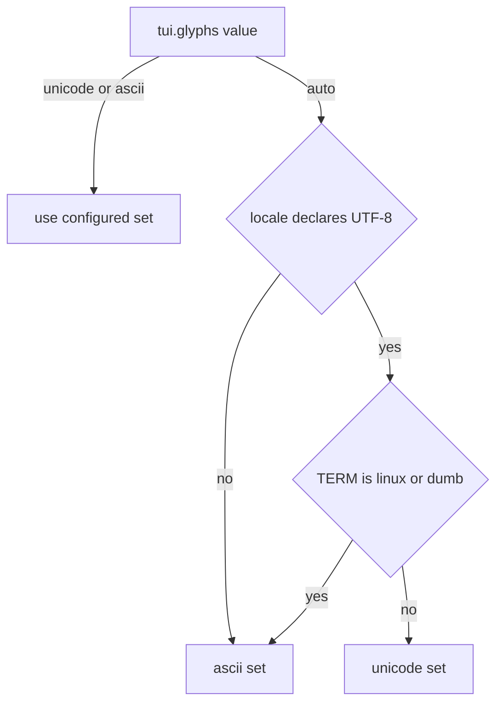

# 12 — Accessibility and Compatibility

This chapter defines how the TUI remains usable by people with different abilities and
across the real terminal population: the accessibility rules, the accessible output mode,
no-color operation, the glyph tiers and Unicode fallback, remote (SSH) and multiplexed
operation, CI and non-TTY behavior, and the terminal compatibility matrix. Color-tier
theming is chapter 08's; the CLI's color on/off decision is ADR-103's; the interaction
patterns referenced here are chapter 11's.

## Accessibility rules

The following rules bind every TUI surface. They are the pass conditions behind
NFR-TUI-069 and the golden-test dimensions of the Volume 13 TUI suite.

1. **Keyboard completeness.** Every action is executable without a pointer; the mouse is
   an accelerator, never a requirement (NFR-TUI-069; enforced via the ADR-110 registry).
2. **Textual parity.** Meaning is never carried by color alone or by a glyph alone: every
   colored or symbolic distinction has a textual carrier — state words, prefixes, markers.
   This extends FR-UX-002's constraint from the CLI to the TUI.
3. **Contrast.** Text roles meet the WCAG-style contrast criterion of chapter 08 (≥ 4.5:1
   against their backgrounds, including the Danger token chapter 08 fixes).
4. **Motion restraint.** Nothing blinks or flashes; animation is limited to the FR-UX-071
   indicator forms, and `tui.reduce_motion = true` (default `false`) replaces animation
   with static markers updated at most once per second.
5. **Focus visibility.** The focused element is identifiable in every color tier and both
   glyph sets — emphasized border plus the `>` marker, reverse video in no-color mode.
6. **Timing tolerance.** Nothing auto-dismisses that carries decisions (FR-UX-072); toast
   durations are configurable (`tui.toast_duration_ms`); no interaction requires timed
   keypresses.
7. **Explicit activation.** Accessibility profiles are user-activated (flag, key,
   configuration) — assistive technology is not detectable from a terminal, so Andromeda
   never guesses (ADR-111).

## Accessible output mode

### FR-TUI-065 — Accessible output mode

- Type: Functional
- Status: Draft
- Priority: P1
- Phase: Beta
- Source: Provided
- Owner: TUI (Volume 8)
- Affected components: TUI
- Dependencies: ADR-111; ADR-110 (parity by registry); FR-UX-070 (append-only regions)
- Related risks: RISK-TUI-071

#### Description

Accessible output mode is a rendering profile of the same TUI model (ADR-111): linear,
append-only output on the primary screen — no alternate screen, no cursor-addressed
repaints, no panel composition. Prompts render as numbered plain-text questions answered
by typed input; tables render as `label: value` lines; the palette renders as a numbered,
searchable list; every state transition that panel rendering would show as a badge or
color change is announced as an appended text line ("provider anthropic: available →
degraded"). Activation: `tui.accessible_output = true` or the `--accessible` flag; the
mode is announced at startup with its documentation pointer. Capability parity with panel
rendering is mandatory and registry-enforced: every registered action is reachable by
typed command. Streaming renders through the same append-only regions (FR-UX-070) without
in-place spinner animation — progress announcements are line-based and rate-limited to
one line per operation per 10 s. Suitability for specific screen readers (VoiceOver with
Terminal.app, Orca with GNOME Terminal) is PENDING VALIDATION (register entry, fragment
C); the rendering contract itself is normative independent of that validation.

#### Motivation

Reading order and change announcement are the structural blockers for assistive use of
full-screen TUIs (ADR-111); linear rendering solves both and also serves braille
displays, high magnification, and transcript workflows.

#### Actors

Users of assistive technology; users preferring linear output.

#### Preconditions

TUI started with the mode active; any terminal, including `TERM=dumb`-adjacent
environments that still provide a TTY.

#### Main flow

1. Startup announces the mode and the active workspace/session textually.
2. Interaction proceeds as prompt → typed answer → announced result, with streamed
   content appended linearly.

#### Alternative flows

- Mid-session activation is not supported at MVP-level granularity of this mode's phase:
  switching profiles requires TUI restart; the action exists and says so.
- Approval prompts render as numbered questions with the Volume 9 decision vocabulary as
  options; no default is pre-selected.

#### Edge cases

- Concurrent streams: regions are serialized with named headers ("[tool git.diff]"),
  never interleaved mid-line.
- Very chatty operations: the 10 s progress-line rate limit keeps announcement volume
  navigable.
- Screens with essentially spatial content (diff side-by-side): rendered in their linear
  form (unified diff), which is the canonical copy form anyway (FR-UX-075).

#### Inputs

The same model state as panel rendering; typed commands and answers.

#### Outputs

Linear transcript output; identical Runtime effects as panel rendering.

#### States

A rendering profile — no states of its own; `tui.render_profile.changed` records the
active profile at startup.

#### Errors

Identical envelopes and presentation rules (FR-UX-001), rendered as text blocks.

#### Constraints

No alternate screen, no cursor addressing beyond line appends, no animation; numbered
options for every choice; parity with the action registry.

#### Security

Identical permission mediation; approval prompts cannot be visually spoofed by content
because announced lines are prefixed with their source ("[approval]" prefix reserved to
the presenter).

#### Observability

`tui.render_profile.changed` at startup with profile `accessible`; all other events as in
panel rendering.

#### Performance

Line-append rendering is strictly cheaper than panel composition; the FR-UX-070 100 ms
staleness bound applies to appended output.

#### Compatibility

Works over SSH, multiplexers, and any TTY; independent of color tier and glyph set
(combines with `ascii` and no-color).

#### Acceptance criteria

- Given the mode active, when any screen's function is exercised, then the emitted bytes
  contain no alternate-screen or cursor-addressing sequences (structural case).
- Given a pending approval, when rendered, then a numbered question appears with no
  pre-selected default and typed selection resolves it (permission case).
- Given a registered action, when the palette's linear form is searched, then the action
  is reachable and executable by number (parity case).
- Negative case: mid-session profile switching is refused with the restart instruction.
- Observability case: startup emits `tui.render_profile.changed` with profile
  `accessible`.

#### Verification method

Byte-stream assertions over teatest runs (sequence denylist); registry-parity traversal
executing every action in linear form; the PENDING VALIDATION assistive-technology test
pass at Beta (VoiceOver/Terminal.app, Orca/GNOME Terminal) with findings recorded in the
register.

#### Traceability

PRD-008, PRD-009; ADR-111, ADR-110; FR-UX-070, FR-UX-001; RISK-TUI-071.

## No-color and monochrome operation

### FR-TUI-066 — No-color and monochrome operation

- Type: Functional
- Status: Draft
- Priority: P1
- Phase: MVP
- Source: Provided
- Owner: TUI (Volume 8)
- Affected components: TUI
- Dependencies: ADR-026 (tier ladder); ADR-103 (signal alignment); chapter 08 tier
  mapping
- Related risks: RISK-TUI-072

#### Description

The no-color tier (ADR-026's monochrome tier, mapped in chapter 08) MUST be a complete
experience, not a degraded one: identical layout, identical information, with color's
role taken over by text and typography attributes. The TUI honors the same disable
signals as the CLI (`NO_COLOR`, `ANDROMEDA_NO_COLOR`, `--color=never`, `tui.theme` keys —
resolution order aligned with ADR-103, full ladder per ADR-114) and additionally enters
the tier when chapter 08's probing resolves no color capability. In this tier: focus is
reverse video plus the `>` marker; severity renders as word prefixes (`error:`,
`warning:`); state words stand alone (they always do, rule 2); selection and match
highlights use reverse video and `*` markers; the modal dim becomes the `[modal]` marker
line (FR-UX-072). Where the terminal offers no attributes at all (no reverse/bold per
terminfo), markers alone carry everything, and the TUI still runs — attribute absence
never blocks the interface.

#### Motivation

`NO_COLOR` environments, monochrome terminals, and color-vision differences are all
served by one discipline: color is always an *addition* (rule 2). The tier also proves
the parity rule mechanically — if information disappears without color, rule 2 was
violated somewhere.

#### Actors

Users; terminals without color; users disabling color.

#### Preconditions

A disable signal or a no-color capability resolution.

#### Main flow

1. The render profile resolves the no-color tier (ADR-114 ladder).
2. All styling maps to the attribute-and-marker substitutions above.

#### Alternative flows

- Attribute-free terminal: marker-only rendering as described.

#### Edge cases

- Mixed streams (stdout TTY, stderr piped) do not occur inside the TUI (single screen);
  the CLI's per-stream rules are ADR-103's.
- Theme-dependent content in embedded command panes (a child program emitting color):
  passed through untouched — Andromeda governs its own chrome only.

#### Inputs

Disable signals; capability resolution; chapter 08 mapping.

#### Outputs

Monochrome rendering with full informational parity.

#### States

A resolved render profile; `tui.render_profile.changed` on change.

#### Errors

None of its own.

#### Constraints

Zero information difference against the colored rendering (parity diff must be empty);
layout identical across tiers.

#### Security

None beyond the general rendering rules.

#### Observability

The resolved tier appears in `doctor` output and `tui.render_profile.changed`.

#### Performance

Marker substitution is table-driven at render; no measurable overhead beyond the colored
path.

#### Compatibility

The tier is the floor of the ADR-026 ladder and runs on every supported terminal
including the Linux console.

#### Acceptance criteria

- Given `NO_COLOR=1`, when any chapter 09/10 screen renders, then emitted bytes contain
  zero SGR color sequences and all state/severity information is present in text
  (parity case).
- Given an attribute-free terminfo entry, when the TUI runs, then focus and selection
  remain identifiable via markers (floor case).
- Negative case: a parity diff between colored and no-color renderings of the same model
  state shows presentation-only differences — no missing information tokens.
- Observability case: the resolved tier and deciding signal appear in `doctor` output.

#### Verification method

Byte-classification tests; automated parity diff between tier renderings across the
golden-frame corpus; attribute-free terminfo fixture.

#### Traceability

PRD-008; ADR-026, ADR-103, ADR-114; FR-UX-002 (CLI counterpart); chapter 08 mapping.

## Glyph tiers and Unicode fallback

The two glyph sets and their selection are decided by ADR-112. The parity table is
normative: chrome MUST draw only from the selected set, and every `unicode` glyph maps to
the listed `ascii` equivalent with identical meaning.

| Role | `unicode` set | `ascii` set |
|---|---|---|
| Borders and separators | U+2500 box-drawing singles | `+`, `-`, `\|` |
| Focused-row marker | `→` | `>` |
| Spinner frames | braille cycle | `-`, `\`, `\|`, `/` |
| Ellipsis / truncation | `…` | `...` |
| List bullet | `•` | `*` |
| Success marker | `✓` | `ok` |
| Failure marker | `✗` | `x` |
| Brand star accent | `✦` | `*` |
| Progress track | `#` filled / `.` empty (both sets) | `#` / `.` |



The flowchart shows glyph-set resolution: an explicit `tui.glyphs` value (`unicode` or
`ascii`) is used as configured; under `auto`, the locale variables (`LC_ALL`, `LC_CTYPE`,
`LANG`, in that precedence) must declare UTF-8 *and* `TERM` must not be `linux` or `dumb`
for the `unicode` set to be chosen; every other combination resolves to `ascii`. The
resolution runs once at startup (and on explicit profile reload), is printed by `doctor`
with the deciding signal, and is recorded via `tui.render_profile.changed`. The constraint
the diagram encodes: there is no third outcome and no per-widget deviation — one set per
process, applied to all chrome.

### FR-TUI-067 — Glyph tiers and Unicode fallback

- Type: Functional
- Status: Draft
- Priority: P1
- Phase: MVP
- Source: Provided
- Owner: TUI (Volume 8)
- Affected components: TUI, CLI (human output glyphs)
- Dependencies: ADR-112; FR-UX-002 (CLI ASCII-safe default); chapter 08 tiers
- Related risks: RISK-TUI-072

#### Description

The TUI renders chrome exclusively from the resolved glyph set per ADR-112 and the
resolution above. The parity table is exhaustive for chrome: introducing a new chrome
glyph requires adding its row (both sets) through the change procedure. Emoji and
characters outside the inventory MUST NOT appear in chrome. Content (user text, model
output, file contents) passes through unmodified but is width-measured before layout;
width-ambiguous content renders in cells that truncate with the set's ellipsis rather
than shifting columns. The CLI's human output keeps its ASCII-safe default (FR-UX-002)
and MAY adopt the `unicode` set's markers under the same resolution when styling is on.

#### Motivation

Corrupted borders and mangled markers make an interface unusable in exactly the
environments (consoles, SSH, minimal fonts) where a terminal tool must keep working
(PRD-011); a closed inventory with declared parity makes degradation designed rather than
accidental (ADR-112).

#### Actors

Users on any terminal; the render profile resolver.

#### Preconditions

None — resolution always produces a set.

#### Main flow

1. Startup resolves the set; all chrome draws from it.

#### Alternative flows

- Explicit override changes the set for the next start (or profile reload).

#### Edge cases

- UTF-8 locale but a font missing box-drawing: the user overrides with
  `tui.glyphs = "ascii"`; `doctor` documents the symptom-to-setting mapping.
- Mixed-width content lines (CJK, emoji) inside virtualized rows: measured per row;
  truncation markers appear at cell boundaries (RISK-TUI-072 mitigation).

#### Inputs

Locale variables; `TERM`; `tui.glyphs`.

#### Outputs

A resolved glyph set; chrome rendered from it.

#### States

Part of the render profile; changes recorded via `tui.render_profile.changed`.

#### Errors

None of its own — resolution cannot fail (the `ascii` set is total).

#### Constraints

Closed inventory; single-cell chrome glyphs only; one set per process; wireframes in this
volume use the `ascii` set.

#### Security

None beyond content sanitization (FR-UX-070), which is independent of glyph sets.

#### Observability

`doctor` prints set and deciding signal; `tui.render_profile.changed` carries the set.

#### Performance

Set selection is O(1) at startup; width measurement is per-render-line and cached with
row heights (FR-UX-076).

#### Compatibility

`ascii` renders on every supported terminal; `unicode` restricted to single-cell,
box-drawing/braille/symbol inventory chosen for broad font coverage — verified per
terminal by the compatibility suite (matrix below).

#### Acceptance criteria

- Given `LANG=C` and `auto`, when the TUI starts, then all chrome bytes are ASCII
  (resolution case).
- Given a UTF-8 locale and `TERM=linux`, when resolved, then the `ascii` set is chosen
  (console case).
- Given `tui.glyphs = "ascii"` on a capable terminal, when rendered, then no chrome byte
  is outside ASCII (override case).
- Negative case: scanning rendered chrome for characters outside the resolved set's
  inventory finds zero occurrences across the golden-frame corpus.
- Observability case: `doctor` names the deciding signal (`config`, `locale`, `TERM`).

#### Verification method

Byte-inventory scans over golden frames per set; resolution unit tests over the
locale/TERM matrix; CJK/emoji width fixtures in virtualized views.

#### Traceability

PRD-011, PRD-008; ADR-112; FR-UX-002; RISK-TUI-072.

## Remote, multiplexed, and non-interactive environments

### FR-TUI-068 — SSH, multiplexer, and non-TTY operation

- Type: Functional
- Status: Draft
- Priority: P1
- Phase: MVP
- Source: Provided
- Owner: TUI (Volume 8)
- Affected components: TUI, CLI, Platform Abstraction Layer (PAL)
- Dependencies: ADR-114; ADR-113; Volume 3 constrained-environments contract; FR-CLI-009
- Related risks: RISK-TUI-072

#### Description

Over SSH the TUI runs with **no dedicated code path**: capability resolution (ADR-114)
reads the same signals from the remote TTY, clipboard resolves to OSC 52 (ADR-113),
notifications fall back to the terminal bell (PAL Notifications probe), and rendering is
unchanged — the FR-UX-070 coalescer already bounds update rate, which is what high-RTT
links need. Under tmux and GNU screen (first-class targets, Volume 3): the multiplexer's
advertised `TERM` drives resolution; OSC 52 requires the multiplexer's passthrough
setting, and the copy failure message names it; absent focus events degrade
focus-dependent niceties without functional loss. In non-TTY contexts the TUI does not
run: `andromeda` without a TTY resolves to non-interactive CLI behavior (FR-CLI-003,
FR-CLI-009), and explicitly requesting the TUI without a TTY fails with E-CLI-005 —
in CI this is the expected, tested behavior (Volume 3 CI contract). Headless serving is
ADR-032's surface, not a TUI mode.

#### Motivation

Remote and multiplexed terminals are primary environments for the audience (Volume 3
names them contract environments); behavior must be identical by construction, with the
differences confined to probed capabilities.

#### Actors

Users over SSH/multiplexers; CI systems; the interactivity resolver (ADR-102).

#### Preconditions

A TTY for TUI operation; none for the refusal path.

#### Main flow

1. Capability resolution runs against the presented TTY; the TUI renders per profile.

#### Alternative flows

- Non-TTY with TUI requested: E-CLI-005 with the CLI alternative named.
- Multiplexer without clipboard passthrough: copy fails visibly naming the setting
  (FR-UX-075).

#### Edge cases

- Nested multiplexers (tmux inside SSH inside screen): resolution reads the innermost
  advertised `TERM`; the matrix documents supported nestings as tested.
- Session detach/reattach (tmux detach, SSH drop with the process alive): the TUI
  receives resize/refresh on reattach and repaints fully; a killed process is the
  Volume 4 `interrupted` path and the recovery screen (FR-TUI-064) handles the return.
- Latency spikes: no timing-dependent interaction exists (accessibility rule 6), so
  slow links degrade smoothness, never correctness.

#### Inputs

TTY probes; `TERM`; multiplexer environment; interactivity resolution.

#### Outputs

Normal TUI operation, or the documented refusal.

#### States

None of its own; render profile per environment.

#### Errors

E-CLI-005 for the non-TTY refusal; PAL families for probe failures (degradations, not
errors).

#### Constraints

No SSH-specific rendering branch; refusal path deterministic (same bytes, same exit code
in CI and locally).

#### Security

OSC 52 exposure over the terminal stream per RISK-UX-079; approval prompts function
identically over SSH — no remote bypass; IPC/headless surfaces are governed by ADR-032
and Volume 9, not weakened by remoteness.

#### Observability

The resolved profile (and its remote-relevant capabilities) appears in `doctor` and
`tui.render_profile.changed`.

#### Performance

Coalescing (FR-UX-070) bounds bytes-per-second to the frame budget; no additional
remote tuning knobs at MVP.

#### Compatibility

tmux and GNU screen per the matrix below; nested cases as documented; CI per the
Volume 3 contract.

#### Acceptance criteria

- Given the TUI over SSH on a Tier A terminal, when the golden-frame suite runs through
  the remote TTY, then frames match local rendering for the same profile (parity case).
- Given tmux without clipboard passthrough, when copy is attempted, then the failure
  names the tmux setting (guidance case).
- Given a CI runner without TTY, when `andromeda` runs, then non-interactive behavior
  engages and an explicit TUI request exits with E-CLI-005 semantics (CI case).
- Negative case: byte capture over a simulated 300 ms RTT link shows no interaction
  requiring timed input and no frame-rate increase attempts.
- Observability case: `doctor` over SSH reports the probed clipboard path (`osc52` or
  unavailable).

#### Verification method

Remote-PTY harness running the golden suite over SSH and inside tmux/screen; clipboard
fault scripts; CI-context tests from the FR-CLI-009 suite exercising the refusal path.

#### Traceability

PRD-011, PRD-009; ADR-114, ADR-113, ADR-102, ADR-032; Volume 3 constrained environments;
E-CLI-005.

## Terminal compatibility matrix

The rows are Volume 3's reference emulators and multiplexers (the ADR-114 Tier A set)
plus the boundary environments. Cells state the **expected** capability profile used for
test planning; every cell is **PENDING VALIDATION** until the Volume 13 compatibility
suite has verified it on that terminal, per release (register entry, fragment C). Emulator
capabilities are external facts that change with emulator releases; this table never
substitutes for the probe (ADR-114 ladder) — a mismatch between probe and matrix on a
Tier A terminal fails the release gate.

| Terminal | Tier | Color (expected) | Glyphs | Mouse | Bracketed paste | OSC 52 |
|---|---|---|---|---|---|---|
| iTerm2 (macOS) | A | truecolor | unicode | yes | yes | yes |
| Terminal.app (macOS) | A | 256-color | unicode | yes | yes | no (expected) |
| GNOME Terminal | A | truecolor | unicode | yes | yes | to verify |
| Konsole | A | truecolor | unicode | yes | yes | to verify |
| Alacritty | A | truecolor | unicode | yes | yes | yes |
| kitty | A | truecolor | unicode | yes | yes | yes |
| WezTerm | A | truecolor | unicode | yes | yes | yes |
| tmux (over any above) | A | inherits ≤ outer | unicode | yes | yes | with passthrough setting |
| GNU screen (over any above) | A | ≤ 256-color | unicode | limited | to verify | with passthrough setting |
| Linux console | B | 16-color | ascii | no | no | no |
| Unknown `TERM` (resolvable) | B | 16-color baseline | per locale | no | no | no |
| `TERM=dumb` / non-TTY | — | CLI path only (E-CLI-005 for TUI) | — | — | — | — |

Prose reading of the matrix: Tier A rows gate releases (NFR-TUI-070) on both Tier 1
operating systems where the terminal exists; multiplexer rows are tested over at least
two distinct outer terminals. The Linux console row is the canonical `ascii` + 16-color
baseline environment. The last row is not a rendering profile: it is the documented
refusal path of FR-TUI-068. "to verify" and "expected" markers are the honest state of
external knowledge at authoring time — the compatibility suite replaces them with
verified values, and the register tracks the open question until then.

## Conformance requirements

### NFR-TUI-069 — Keyboard reachability and focus visibility

- Category: Accessibility
- Priority: P0
- Phase: MVP
- Metric: (a) Fraction of registered actions (ADR-110) executable via keyboard only;
  (b) fraction of golden frames in which the focused element is programmatically
  identifiable by its textual/attribute markers alone (no color channel)
- Target: (a) 100%; (b) 100%
- Minimum threshold: 100% for both — reachability and focus visibility admit no partial
  credit
- Measurement method: automated registry traversal executing every action through
  keyboard paths in teatest; golden-frame analysis locating focus markers with the color
  channel stripped
- Test environment: Volume 13 TUI suite, both glyph sets, all chapter 08 color tiers,
  80×24 and 200×60 geometries
- Measurement frequency: every merge to the TUI (CI); audited per release
- Owner: TUI (Volume 8)
- Dependencies: ADR-110; FR-TUI-066; chapter 07 keymap
- Risks: RISK-TUI-071
- Acceptance criteria: CI reports 100% on both metrics; any new action or screen failing
  traversal blocks merge; the no-color focus check passes on the full golden corpus.

### NFR-TUI-070 — Terminal compatibility conformance

- Category: Compatibility
- Priority: P1
- Phase: Beta
- Metric: Pass rate of the compatibility suite (capability probe correspondence, golden
  frames, clipboard/paste behaviors) on the Tier A terminal set; matrix-cell verification
  coverage
- Target: 100% pass on Tier A per release; 100% of Tier A matrix cells verified (no
  "to verify" markers remaining for Tier A)
- Minimum threshold: 100% pass on Tier A; a failing Tier A terminal blocks the release
  or moves to Tier B via a recorded decision
- Measurement method: the Volume 13 compatibility suite executed against real emulators
  or their headless equivalents per platform; probe-versus-matrix comparison per ADR-114
- Test environment: Tier 1 platforms with the Tier A terminal set; multiplexers over two
  outer terminals
- Measurement frequency: per release; matrix re-verification per release
- Owner: TUI (Volume 8)
- Dependencies: ADR-114; FR-TUI-067, FR-TUI-068
- Risks: RISK-TUI-072
- Acceptance criteria: Release audit shows Tier A at 100% with verified cells; deviations
  are recorded decisions, never silent tier changes.

## Risks

### RISK-TUI-071 — Assistive-technology experience remains impractical despite accessible output mode

- Category: Product / accessibility
- Probability: Medium
- Impact: High
- Severity: High
- Mitigation: ADR-111's structural approach (linear rendering) rather than cosmetic
  fixes; the Beta validation pass with named AT configurations (PENDING VALIDATION,
  register entry); announcement rate limits and numbered-choice interaction designed for
  auditory navigation; findings feed rendering adjustments before v1
- Detection: the AT validation pass; issue reports tagged accessibility; transcript
  review of announcement volume in long sessions
- Owner: TUI (Volume 8)
- Status: Open

Terminal screen readers vary widely in how they treat appended output, and no automated
test proves human usability. The mode's contract is verifiable; its sufficiency is not —
hence the explicit validation gate and the risk staying open until real-AT evidence
exists.

### RISK-TUI-072 — Character-width divergence corrupts layout in edge terminals

- Category: Technical / compatibility
- Probability: Medium
- Impact: Medium
- Severity: Medium
- Mitigation: ADR-112 confinement — chrome is single-cell by construction; content cells
  truncate instead of shifting columns; width tables centralized in one measurement
  function; CJK/emoji fixtures in the compatibility suite; `tui.glyphs = "ascii"` as the
  universal user escape hatch
- Detection: golden-frame diffs on width fixtures per Tier A terminal; issue reports of
  broken borders correlated with locale/font data from `doctor` output
- Owner: TUI (Volume 8)
- Status: Open

Emulators disagree about ambiguous-width and emoji rendering, and width libraries trail
Unicode releases. Confinement bounds the damage to single truncated cells — ugly but
navigable — rather than structural layout collapse.

## Configuration keys

This chapter mints the following `[tui]` keys (content owned here; schema, precedence,
and validation are Volume 10's): `tui.glyphs` (`"auto"` | `"unicode"` | `"ascii"`,
default `"auto"`), `tui.reduce_motion` (bool, default `false`), `tui.accessible_output`
(bool, default `false`). Chapter 11 mints `tui.clipboard`, `tui.clipboard_max_bytes`,
`tui.toast_duration_ms`, `tui.search_debounce_ms`, and `tui.list_page_size`; chapter 08
owns the `[tui.theme]` table.

```toml
[tui]
glyphs = "auto"            # auto | unicode | ascii (FR-TUI-067)
reduce_motion = false      # replaces animation with static markers
accessible_output = false  # linear rendering profile (FR-TUI-065)
clipboard = "auto"         # auto | osc52 | off (ADR-113)
clipboard_max_bytes = 1048576
toast_duration_ms = 4000
search_debounce_ms = 150
list_page_size = 100
```
