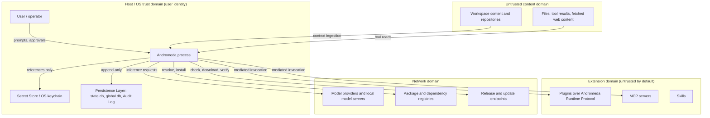

# 01 — Threat Model: Overview

This chapter is the entry point to Andromeda's threat model. It defines the protected **assets**,
the **trust boundaries** that separate what Andromeda controls from what it does not, the
**threat actors**, the **attack vectors**, and the **risk matrix** used to classify every threat.
Chapters [02](02-threats-injection.md), [03](03-threats-extensions-supply-chain.md), and
[04](04-threats-system.md) enumerate the 27 named threats as `RISK-SEC-NNN` entries.

This chapter mints no functional or non-functional requirements. The security *controls* the
threats reference — the permission model (keystone FR-SEC-100), the sandbox specification
(keystone FR-SEC-101), and credential and secret management (keystone FR-SEC-102) — are
formalized by the companion chapters 05–09 of this volume. The threat model states *what can go
wrong* and *which control mitigates it*; the control chapters state the control normatively.

## Purpose and method

The model is **asset-centric and STRIDE-informed**. Each threat names the asset at risk, the
actor, the vector, the preconditions that make it reachable, the impact, the preventive controls,
the detection and response, the recovery, and the residual risk after mitigation, plus the tests
that verify the mitigation. Threats are prioritized by the risk matrix below, not by narrative
prominence.

When threats conflict with other objectives, the precedence order of the project brief governs:
safety of the user, the system, and credentials first; legality and official-mechanisms-only
second; data integrity and recoverability third; then functional requirements, privacy,
compatibility, open architecture, observability, performance, and user experience. A threat's
mitigation MUST NOT be traded away for convenience without a recorded decision.

## Trust boundaries

Andromeda runs as a local process on the user's host under the user's own operating-system
identity (ADR-032 headless mode is invoker-owned; no privilege elevation). It draws input from
several domains of differing trust. The boundary between the Andromeda process and each domain is
a place where a control MUST sit.

The diagram shows five trust domains and the flows that cross their boundaries:

- **Host / OS trust domain.** The Andromeda process, the Secret Store (OS keychain or the
  age-encrypted file fallback, ADR-014), and the Persistence Layer databases (ADR-028) share the
  user's OS identity. This is the innermost domain; a compromise here is total. Controls at its
  edge exist to keep the other domains from reaching in.
- **Untrusted content domain.** Repository contents, files on disk, tool results, and any fetched
  content are **data, not instructions**. They are the primary vector for injection (chapter 02).
  Andromeda MUST treat their embedded directives as untrusted-content labeled input, never as
  privileged commands.
- **Extension domain.** Plugins run as separate subprocesses speaking the Andromeda Runtime
  Protocol over JSON-RPC 2.0 (ADR-009); MCP servers connect over the official SDK transports
  (ADR-010); skills are packaged prompt-and-capability units. All three are **untrusted by
  default** and mediated: they reach the host only through the Tool Runtime and the ports.
- **Network domain.** Model providers, dependency and package registries, and release/update
  endpoints are reached only through official, documented mechanisms. Network access is itself a
  permission (`network`) and, for providers, an egress that carries user content.
- **The boundaries themselves are the control points.** Every side-effecting action crosses from
  Andromeda into a lower-trust domain through exactly one mediated path: `PermissionPort` decides,
  `SandboxPort` contains, `SecretStorePort` shields credentials, and the Audit Log records. No
  path may bypass these (Principle 8; enforced structurally by ADR-030/ADR-033).

## Protected assets

| Asset | Description | Primary threats |
|---|---|---|
| Credentials and secrets | Provider API keys, OAuth tokens, and any secret material held by the Secret Store | Secret exfiltration, credential theft, log leakage |
| Workspace source and data | The user's code, files, and repository history under the workspace root | Path traversal, symlink attacks, malicious repositories, command injection |
| Host and OS | The user's machine, its filesystem, processes, and network position | Sandbox escape, privilege escalation, command injection, malicious extensions |
| Session and run records | Persisted sessions, runs, plans, tasks, and the append-only Audit Log | Memory poisoning, log leakage, record tampering |
| Permission grants and policy | Standing grants, scopes, and the Policy Engine configuration | Privilege escalation, social engineering, confused-deputy abuse |
| Provider budget and egress | Token spend and the content sent to providers | Compromised providers, prompt injection driving costly or exfiltrating calls |
| Memory and index stores | Long-term memory records and lexical/semantic indexes | Memory poisoning, index poisoning |
| The Andromeda distribution | The binary, its dependencies, CI, releases, and updates | Dependency attacks, CI compromise, release compromise, update compromise |
| Model context and outputs | The assembled context window and the model's responses that drive tool use | Prompt injection (direct and indirect), malicious model output, tool poisoning |

## Threat actors

| Actor | Trust | Capability and motive |
|---|---|---|
| Remote content author | Untrusted | Plants instructions in files, issues, web pages, or repository content the agent will read; aims to hijack the agent (indirect injection) |
| Malicious extension author | Untrusted | Publishes a plugin, skill, or MCP server that requests broad permissions or behaves differently once trusted |
| Compromised dependency maintainer | Semi-trusted → hostile | Ships a malicious version of a library Andromeda or an extension depends on |
| Network attacker | Untrusted | Intercepts or tampers with traffic to providers, registries, or update endpoints (man-in-the-middle) |
| Malicious or compromised provider | Semi-trusted | Returns crafted model output, harvests submitted content, or claims capabilities it does not honor |
| CI or release-infrastructure attacker | Untrusted | Subverts the build, signing, or publishing pipeline to distribute a tampered artifact |
| Social engineer | Untrusted | Crafts prompts or content that manipulate the user into approving a dangerous action |
| Confused-deputy model | Semi-trusted | The model itself, misled by injected content, uses its granted authority against the user's interest without malice |
| Curious or careless local user | Trusted | Not an attacker but a source of accidental over-permissioning; shapes default-deny design |

The threat model deliberately **excludes** a hostile actor who already holds the user's OS
account: an attacker with the user's uid can read the same files and keychain Andromeda can, so
in-process controls cannot defend against them. Defense there belongs to the operating system.
This exclusion is stated so that no threat overclaims protection it cannot provide (honesty of
guarantees, ADR-021).

## Attack vectors

The named threats enter through one or more of these vectors:

1. **Model context** — content the model reads (prompts, files, tool results, memory, index
   hits) that carries adversarial instructions.
2. **Tool and extension surface** — declarations, results, plugins, MCP servers, and skills that
   misrepresent themselves or abuse granted permissions.
3. **Command and path handling** — shell strings, filesystem paths, and symlinks that resolve
   outside intended scopes.
4. **Credential handling** — access to, and leakage of, secret material through logs, errors,
   memory, environment, or provider egress.
5. **Supply chain** — dependencies, CI, releases, and updates that deliver tampered code.
6. **Inference channel** — providers and local models that return crafted output or harvest
   submitted content.
7. **Human channel** — manipulation of the user's approval decisions.

## Risk matrix

Every `RISK-SEC-NNN` carries a Probability and an Impact, each `Low` / `Medium` / `High`. Their
combination yields the Severity classification, using this fixed matrix so severities are
reproducible rather than editorial:

| Probability \ Impact | Low | Medium | High |
|---|---|---|---|
| **High** | Medium | High | Critical |
| **Medium** | Low | Medium | High |
| **Low** | Low | Low | Medium |

Severity meanings:

- **Critical** — high-impact compromise is plausible under normal use; the vector reachable at a
  given phase MUST be mitigated by verified layered controls before that phase ships, and residual
  risk MUST be recorded.
- **High** — significant impact; mitigated by named controls with residual risk tracked and tested.
- **Medium** — bounded impact or lower likelihood; mitigated and monitored.
- **Low** — minor or unlikely; accepted with monitoring.

**Probability calibration is a design estimate.** Concrete field probabilities depend on
deployment data Andromeda does not yet have; they are prior estimates to be recalibrated from the
security telemetry of consenting installations (SM-16). This calibration dependency is recorded
as an assumption in the volume register.

## Threat register (all 27 threats)

| ID | Threat | Chapter | Category | Probability | Impact | Severity |
|---|---|---|---|---|---|---|
| RISK-SEC-001 | Prompt injection (direct) | 02 | Injection | High | High | Critical |
| RISK-SEC-002 | Indirect prompt injection | 02 | Injection | High | High | Critical |
| RISK-SEC-003 | Tool injection | 02 | Injection | Medium | High | High |
| RISK-SEC-004 | Tool poisoning | 02 | Injection | Medium | High | High |
| RISK-SEC-005 | MCP poisoning | 02 | Injection | Medium | High | High |
| RISK-SEC-006 | Malicious model output | 02 | Injection | High | Medium | High |
| RISK-SEC-007 | Memory poisoning | 02 | Injection | Medium | High | High |
| RISK-SEC-008 | Index poisoning | 02 | Injection | Medium | Medium | Medium |
| RISK-SEC-009 | Malicious files | 02 | Injection | High | Medium | High |
| RISK-SEC-010 | Malicious plugins | 03 | Extensions / supply chain | Medium | High | High |
| RISK-SEC-011 | Malicious skills | 03 | Extensions / supply chain | Medium | High | High |
| RISK-SEC-012 | Malicious repositories | 03 | Extensions / supply chain | High | High | Critical |
| RISK-SEC-013 | Dependency attacks | 03 | Extensions / supply chain | Medium | High | High |
| RISK-SEC-014 | CI compromise | 03 | Extensions / supply chain | Low | High | Medium |
| RISK-SEC-015 | Release compromise | 03 | Extensions / supply chain | Low | High | Medium |
| RISK-SEC-016 | Update compromise | 03 | Extensions / supply chain | Low | High | Medium |
| RISK-SEC-017 | Compromised providers | 03 | Extensions / supply chain | Low | High | Medium |
| RISK-SEC-018 | Compromised local models | 03 | Extensions / supply chain | Medium | Medium | Medium |
| RISK-SEC-019 | Command injection | 04 | System | High | High | Critical |
| RISK-SEC-020 | Path traversal | 04 | System | Medium | High | High |
| RISK-SEC-021 | Symlink attacks | 04 | System | Medium | Medium | Medium |
| RISK-SEC-022 | Secret exfiltration | 04 | System | Medium | High | High |
| RISK-SEC-023 | Credential theft | 04 | System | Medium | High | High |
| RISK-SEC-024 | Sandbox escape | 04 | System | Medium | High | High |
| RISK-SEC-025 | Privilege escalation | 04 | System | Low | High | Medium |
| RISK-SEC-026 | Log leakage | 04 | System | Medium | Medium | Medium |
| RISK-SEC-027 | Social engineering | 04 | System | Medium | High | High |

Note on the "supply chain" grouping: the project brief lists *supply chain* alongside its
concrete instances (dependency, CI, release, and update compromise). This model treats supply
chain as the **umbrella framing of chapter 03** and enumerates its four concrete, individually
mitigable instances as RISK-SEC-013 through RISK-SEC-016, rather than as a separate abstract
entry. This keeps every numbered threat testable and yields exactly 27 named threats.

## Control themes (defense in depth)

No single control stops the threat classes above; the design layers them, so a bypass of one is
caught by another. Each threat's `#### Prevention` names the specific controls; the recurring
themes are:

| Theme | Control home | Ports / components |
|---|---|---|
| Least-privilege mediation | Permission model, keystone FR-SEC-100 | `PermissionPort`, Permission Manager, Policy Engine |
| Containment of execution | Sandbox specification, keystone FR-SEC-101 (ADR-021) | `SandboxPort`, Sandbox Engine, Terminal Engine |
| Credential shielding | Credential and secret management, keystone FR-SEC-102 (ADR-014) | `SecretStorePort`, Secret Store |
| Untrusted-content labeling | This volume + Volume 6 trust model | Context Manager, Tool Runtime, MCP Runtime |
| Auditability and attribution | Chapter 08 (Audit Log, security events) | Audit Log, `EventBusPort`, `TelemetryPort` |
| Redaction | Chapter 07 + Volume 10 logging | Logging, Observability, error envelope (ADR-016) |
| Supply-chain integrity | Chapter 03 + ADR-013 / ADR-033 | Package Manager, Updater, CI checks |
| Human-in-the-loop confirmation | Approval machine, chapter 09 | Approval entity, `PermissionPort.Request` |

## How to read the threat chapters

Each threat is a `### RISK-SEC-NNN — Name` heading with the Volume 0 risk metadata bullets
(Category, Probability, Impact, Severity, Mitigation, Detection, Owner, Status) followed by ten
subsections: **Asset**, **Actor**, **Vector**, **Preconditions**, **Impact**, **Prevention**,
**Response**, **Recovery**, **Residual risk**, and **Tests**. The metadata `Mitigation` and
`Detection` bullets summarize the fuller `#### Prevention` and detection prose; the metadata
`Impact` bullet is the `Low`/`Medium`/`High` rating whose narrative is the `#### Impact`
subsection. Owner is the component or role accountable for keeping the mitigation in force.
