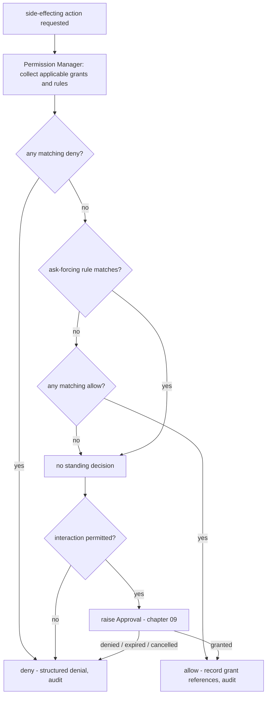

# 05 — Permission Model

This chapter is the corpus-wide authority for the permission model (single-home matrix,
Volume 0 chapter 03): the closed permission enum, the scope qualifiers, the decision
vocabulary, evaluation precedence, inheritance, revocation, persistence, and the audit
obligations of every decision. The **Permission Manager** implements this chapter behind the
frozen `PermissionPort` (Volume 3 chapter 02: `Check`, `Request`, `RecordDecision`); the
persisted **Permission** and **Approval** entities are Volume 2's (chapter 04); the Approval
full machine is chapter [09](09-approval-state-machine.md) of this volume. Every other volume
uses the names defined here and MUST NOT restate or extend them — the enums are closed
vocabularies; new values require an ADR (Volume 0 chapter 03).

## Decision path overview



**Prose.** The diagram shows the single decision path (Principle 8, PRD-005): a
side-effecting action enters the Permission Manager, which collects the applicable standing
grants (Permission rows) and configured policy rules, then resolves in a fixed precedence
order — deny overrides everything, an ask-forcing rule overrides allow, allow requires at
least one matching grant, and the absence of any standing decision falls through to
interaction. Where interaction is not permitted (non-interactive mode per PRD-009, headless
mode per ADR-032, or `Check` calls, which never prompt), the fall-through outcome is denial.
Where interaction is permitted, an Approval is raised and its terminal state decides the
action. Every box on the bottom row produces an Audit Record (chapter
[08](08-audit-and-incident-response.md)); there is no exit from this graph without one. The
constraint the diagram encodes: **no side-effecting path in the product may bypass this
graph** — Tool Runtime, Sandbox Engine, Git Engine, Terminal Engine, Package Manager, Updater,
and the IPC server all enter through `PermissionPort` (Volume 3 port ownership map).

## Permission enum

The closed permission enum. Canonical `snake_case` names, frozen for the corpus; extension
declarations (tools, plugins, MCP servers, skills — Volume 6) MUST declare required
permissions using exactly these names, and unknown names are validation errors, never
forward-compatible values (Volume 2 INV-PERM-01).

| Permission | Grants the class of action | Representative actions |
|---|---|---|
| `read` | Read files and metadata within qualified paths | file read, directory listing, search, diff computation |
| `write` | Create, modify, delete, or rename files within qualified paths | file write, patch apply, temp artifact creation outside sandbox temp |
| `execute` | Run commands and executables matching qualified command patterns | terminal command, test runner, build invocation |
| `network` | Open network connections to qualified hosts/domains | HTTP requests by tools, non-provider downloads |
| `credential_access` | Resolve secret material through the Secret Store | provider key resolution, integration-tool token resolution |
| `git_mutation` | Mutate repository state | stage, commit, branch create/switch, apply patch, worktree ops |
| `process_spawn` | Spawn processes beyond a tool's own sandboxed execution | background workers, watchers, plugin child processes |
| `container_access` | Interact with container or orchestration runtimes | docker/kubernetes tool operations (Volume 6 catalog) |
| `external_service_access` | Call third-party service APIs as an authenticated principal | GitHub/GitLab/Jira/Notion/Slack/Linear tool operations |
| `clipboard` | Read or write the system clipboard | copy diff/result to clipboard |
| `notifications` | Emit desktop/system notifications | completion or approval-needed notices |
| `package_installation` | Install, update, or remove packages/extensions | plugin/skill/MCP server install (Volume 6), self-update apply (Volume 14) |
| `system_modification` | Change machine state outside the workspace | global config writes, shell profile edits, OS settings |

Rules:

1. Provider inference traffic (model requests through `ProviderPort`) is authenticated,
   costed, and audited through its own layers (Volumes 5 and 10) and does not consume the
   `network` permission; `network` governs *tool-originated* connections. One exception:
   activating a local-to-cloud fallback chain step (Volume 5 chapter 05, egress guard F2)
   requires a standing `network` grant with a `provider` resource selector — the egress
   decision to leave the machine, not the per-request provider traffic, is what consumes
   the permission. This split keeps the permission surface aligned with what the user is
   actually asked to trust.
2. `credential_access` is required for any resolution of secret material on behalf of a tool,
   plugin, or MCP server; the Authentication Layer's own resolution for provider requests is
   covered by the credential's binding (chapter [07](07-credential-and-secret-management.md)).
3. `system_modification` is never grantable to extensions at `always_allow_policy`; see
   [Decision constraints](#decision-constraints).

## Scope qualifiers

The closed scope-qualifier enum, frozen names: `session`, `workspace`, `command`, `tool`,
`provider`, `host`, `path`, `domain`, `repository`, `organization`. Qualifiers bound *what* a
grant covers and *where* it lives:

- **Attachment qualifiers** — `session`, `workspace` — bind a grant's validity context. They
  materialize as the Permission row's grant scope (Volume 2: `invocation` | `run` | `session`
  | `workspace` | `global`, with `scope_ref` naming the entity). A session-attached grant dies
  with its Session (session-scoped grants expire when the session ends — Volume 4 session
  machine side effect); a workspace-attached grant persists in that workspace's database.
- **Resource qualifiers** — `command`, `tool`, `provider`, `host`, `path`, `domain`,
  `repository`, `organization` — constrain the resources a grant covers. They materialize as
  the Permission row's `resource_selector` (Volume 2), a JSON object whose keys are exactly
  these qualifier names.

### Resource selector grammar

```json
{
  "path": ["src/**", "docs/**"],
  "command": ["go test *", "npm run lint"],
  "tool": ["fs.read", "git.*"],
  "provider": ["anthropic"],
  "host": ["203.0.113.7", "198.51.100.0/24"],
  "domain": ["api.github.com", "*.example.com"],
  "repository": ["andromeda"],
  "organization": ["example-org"]
}
```

The example above shows every legal key. Matching rules per qualifier:

| Qualifier | Pattern form | Matching rule |
|---|---|---|
| `path` | glob, workspace-relative or absolute | `*` within one segment, `**` across segments; the queried path is symlink-resolved (chapter [06](06-sandbox-specification.md)) before matching; workspace-relative patterns resolve against the workspace root |
| `command` | space-separated word patterns | first word matches the executable basename or absolute path; each word may use `*` globbing; a final bare `*` word matches all remaining arguments; comparison is on the parsed argv, never on raw shell text |
| `tool` | canonical dotted tool name (Volume 6 grammar) | exact name or `namespace.*` |
| `provider` | provider label (Volume 2) | exact match |
| `host` | hostname, IP literal, or CIDR | exact hostname; IP within CIDR; no wildcard hostnames (use `domain`) |
| `domain` | DNS name, optional leading `*.` | exact name, or suffix match where `*.example.com` covers subdomains but NOT `example.com` itself |
| `repository` | repository slug or absolute path | exact match on the repository identity the Git Engine reports |
| `organization` | hosting namespace/organization name | exact match; covers all repositories the platform attributes to it |

A selector key that is present MUST match the query's corresponding attribute for the grant
to apply; an absent key is unconstrained. An empty pattern list for a present key matches
nothing (a safe way to disable a rule without deleting it). Unknown keys make the selector
invalid — the containing grant or rule is rejected at validation time (E-SEC-002 class at
load, per FR-SEC-103), never silently ignored.

## Grant scopes and inheritance

Grant scopes nest: `invocation` ⊂ `run` ⊂ `session` ⊂ `workspace` ⊂ `global`. A grant at an
enclosing scope applies to every narrower context inside it: a workspace-attached allow for
`read` on `src/**` covers every session, run, and invocation in that workspace. Inheritance is
evaluation-time only — no rows are copied downward, so revoking the workspace grant instantly
withdraws it from every enclosed context (INV-PERM-03).

Resource qualifiers refine, never widen, along inheritance: a query matches a grant only if
the grant's scope encloses the query's context AND its selector matches the query's resource
attributes. Two consequences are normative:

1. There is no "wider retry": if a grant for `path: ["src/**"]` does not cover
   `/etc/hosts`, no combination of narrower context makes it cover it.
2. Overlapping grants are legal (Volume 2, Permission identifiers note); the
   [evaluation order](#evaluation-algorithm) — not row age or scope width — resolves overlap.

## Decisions

The closed decision vocabulary, frozen names. Decisions are what a user (or policy) answers;
each maps deterministically to persisted effects:

| Decision | Persisted effect | Grant scope | Lifetime |
|---|---|---|---|
| `allow_once` | one allow Permission row, invocation-scoped, referenced by the subject's `permission_ids` | `invocation` | consumed by that invocation; a retry re-evaluates (Volume 4 gated-retry rule) |
| `allow_for_session` | allow Permission row attached to the Session | `session` | until session end or revocation |
| `allow_for_workspace` | allow Permission row attached to the Workspace | `workspace` | until revocation, or `permissions.workspace_grant_ttl` when non-zero |
| `always_allow_policy` | standing allow Permission row at `global` scope (workspace scope when the prompt's selector is workspace-relative), origin `approval` | `global` or `workspace` | until revocation; evaluated as standing policy thereafter |
| `deny_once` | one deny Permission row, invocation-scoped | `invocation` | that invocation only |
| `always_deny` | standing deny Permission row at `workspace` or `global` scope (same placement rule as `always_allow_policy`) | `workspace` or `global` | until revocation |
| `ask_every_time` | no new grant; matching standing *allow* grants at `session` and `workspace` scope are revoked (`revoked_by: user`) so future requests prompt again | — | immediate |

### Decision constraints

1. `always_allow_policy` and `always_deny` prompts MUST display the exact selector that will
   be persisted, and the persisted selector MUST be no broader than what was displayed.
2. `always_allow_policy` is refused (the option is not offered) for `system_modification`
   requests and for any request whose selector is unbounded on all resource qualifiers when
   the permission is `execute`, `write`, or `credential_access` — a standing "allow everything
   of this class everywhere" grant for those permissions is not expressible interactively.
   Users who genuinely want it write an explicit config rule (below), which is a deliberate,
   auditable act with a file diff.
3. `deny_once` and dismissal of a prompt (escape/timeout in the TUI) are distinct: dismissal
   without decision leaves the Approval pending until it expires (chapter 09); expiry resolves
   denied-class (INV-APR-05).

## Policy rules in configuration

Standing policy is configured in the `[permissions]` table (key content owned by this volume;
schema, layering, and precedence across config layers are Volume 10's — keystone FR-CFG-001):

```toml
[permissions]
approval_timeout = "10m"       # pending Approval expiry; "0s" disables expiry
workspace_grant_ttl = "0s"     # auto-expiry for allow_for_workspace grants; "0s" = none

[[permissions.rules]]
name = "allow-tests"
permission = "execute"
effect = "allow"
command = ["go test *"]

[[permissions.rules]]
name = "no-cloud-writes"
permission = "external_service_access"
effect = "deny"
organization = ["legacy-org"]

[[permissions.rules]]
name = "prompt-for-pushes"
permission = "git_mutation"
effect = "ask"
command = ["git push *"]
```

Rule fields: `name` (unique within its config layer, referenced by Approval `policy_ref` and
audit records), `permission` (enum value), `effect` (`allow` | `deny` | `ask`), plus any
resource-qualifier keys with the selector grammar above. Rules are evaluated as virtual grants
with `origin_kind: policy`; the config layer they come from determines their attachment
(project/workspace layers → workspace scope; global layer → global scope). An `effect: ask`
rule is the ask-forcing construct of the evaluation order — it pins prompting even where an
allow would otherwise match. Invalid rules (unknown permission, unknown selector key,
malformed pattern) fail configuration validation with an E-CFG class finding at load (Volume
10) and the containing configuration is rejected; a permission rule is never "best-effort".

### Built-in defaults

In the absence of any grant or rule, the model's defaults (virtual grants,
`origin_kind: default`) are:

| Permission | Default within the workspace | Default outside the workspace |
|---|---|---|
| `read` | allow (reading the opened workspace is the product's core function; every read remains attributable per PRD-006) | ask |
| all other permissions | ask | ask |

"Ask" resolves to denial wherever interaction is not permitted (PRD-009). There are no other
implicit allows: the first write, execute, network, or Git mutation in a fresh workspace
always prompts (Safe by Default, PRD-005).

## Evaluation algorithm

Normative order, implemented by `PermissionPort.Check` (steps 1–5) and `Request` (all steps):

1. **Normalize.** Resolve the query: permission name, resource attributes (symlink-resolved
   path, parsed argv, canonical tool name, provider label, host/domain, repository and
   organization identity), and subject context (invocation, run, session, workspace ULIDs).
2. **Collect.** Applicable candidates are: unrevoked, unexpired Permission rows whose grant
   scope encloses the subject context; policy rules from the resolved configuration; built-in
   defaults. Rows failing selector validation are excluded and reported (E-SEC-002).
3. **Filter.** Keep candidates whose permission name equals the query's and whose selector
   matches the query's resource attributes.
4. **Resolve.** In precedence order (ADR-121):
   1. any matching `deny` → **deny**;
   2. else any matching `ask` rule → **ask**;
   3. else any matching `allow` → **allow**;
   4. else → **ask**.
5. **Report.** `Check` returns the outcome (`allow` | `deny` | `ask` — this three-value
   evaluation vocabulary is distinct from the seven-value decision vocabulary) with the
   deciding grant/rule references; callers on non-interactive paths treat anything but
   `allow` as denial (PRD-009).
6. **Interact.** `Request`, when the outcome is `ask` and interaction is permitted, raises an
   Approval (chapter 09) and blocks on its terminal state. The Approval's decision is applied
   per the [decision table](#decisions), minting grants before the action proceeds.
7. **Record.** Every resolution — allow, deny, and every Approval decision — produces exactly
   one Audit Record naming the deciding grant, rule, or Approval (chapter 08). Evaluation
   failure at any step is E-SEC-002 and resolves as deny (fail-closed, ADR-125).

Tie-breaking within one precedence tier is irrelevant by construction: two matching allows
produce the same outcome, and the audit record lists every matching row consulted for the
winning tier.

## Revocation

1. Any standing grant is revocable at any time by the user (CLI/TUI surfaces per Volume 8) or
   by policy (a newly loaded deny rule does not edit rows but outranks them at evaluation).
   Revocation sets `revoked_at`/`revoked_by` and never deletes the row (INV-PERM-02).
2. Revocation takes effect for every evaluation that begins after the revocation commits.
   In-flight actions already holding a decision are NOT killed by revocation of the grant that
   decided them — cancellation of running work is an explicit act through the run/task
   machinery (Volume 4) — but any *new* permission check inside the same run re-evaluates
   and is denied (INV-PERM-03).
3. Revoking a Credential (chapter 07) implies denial of subsequent `credential_access`
   evaluations that would resolve it, independent of standing grants.
4. Session end expires session-attached grants as a machine side effect (Volume 4); expiry is
   recorded like revocation (`permission.grant.expired`).

## Persistence and audit

- Grants persist as Permission rows: workspace database for `invocation`/`run`/`session`/
  `workspace` scopes, global database for `global` scope (Volume 2 persistence; ADR-028).
- Approvals persist per Volume 2; the full machine, including crash recovery, is chapter 09.
- Retention follows audit retention (chapter 08), which takes precedence over run pruning
  (INV-AUD-04).
- Events minted by this chapter: `permission.decision.recorded` (every evaluation that decides
  an action), `permission.grant.created`, `permission.grant.revoked`,
  `permission.grant.expired`. Envelope and delivery per Volume 10 (keystone FR-OBS-001).

## Requirements

### FR-SEC-100 — Permission model

- Type: Functional
- Status: Draft
- Priority: P0
- Phase: Core
- Source: Provided
- Owner: Permission Manager (Volume 9)
- Affected components: Permission Manager, Policy Engine, Tool Runtime, Sandbox Engine, Git Engine, Terminal Engine, Package Manager, Updater, CLI, TUI, IPC server
- Dependencies: Volume 3 PermissionPort (FR-ARCH-003); Volume 2 Permission/Approval entities; ADR-121, ADR-125
- Related risks: Threat model chapters 01–04 (privilege escalation, command injection, secret exfiltration, social engineering)

#### Description

Andromeda enforces a single, closed permission model: 13 permissions, 10 scope qualifiers,
and 7 decisions, with the exact names and semantics of this chapter. Every side-effecting
action in the product — tool invocations, terminal commands, Git mutations, network access by
tools, credential resolution, package installation, clipboard, notifications, and system
modification — MUST be decided through `PermissionPort` before execution, and every decision
MUST be persisted and auditable. The enums are closed: adding a permission, qualifier, or
decision value requires an ADR through the Volume 0 change procedure.

#### Motivation

PRD-005 (Safe Agent Autonomy) makes the permission decision path the product's central safety
mechanism; SM-16(b) commits to 100% mediation of side-effecting tool invocations at MVP exit.
A single closed vocabulary is what makes grants portable across tools, plugins, and MCP
servers, and what makes the audit trail interpretable.

#### Actors

Users (interactive decisions); the Permission Manager and Policy Engine (evaluation); the
Tool Runtime, Sandbox Engine, Git Engine, Terminal Engine, Package Manager, Updater, and IPC
server (mediated callers); agents (subjects whose actions are decided).

#### Preconditions

Workspace open (for workspace-scoped state); configuration resolved (policy rules loaded and
validated); audit log writable.

#### Main flow

1. A component about to perform a side-effecting action builds a PermissionQuery (permission
   name, resource attributes, subject context).
2. It calls `Check` (non-interactive paths) or `Request` (interactive paths).
3. The Permission Manager evaluates per the [evaluation algorithm](#evaluation-algorithm).
4. On `allow`, the action proceeds; the deciding grant references are recorded on the subject
   (e.g., Tool Invocation `permission_ids`).
5. Decision and audit records are persisted before the action's effects are presented.

#### Alternative flows

- `ask` on an interactive path: an Approval is raised; its decision applies per the decision
  table; grants are minted before the action proceeds.
- `ask` on a non-interactive path: the action is denied with E-SEC-001; the structured denial
  reaches the agent as data (Volume 6 denial semantics), the CLI boundary maps exit code 5.
- Policy pre-resolution at run start: standing rules are recorded via `RecordDecision` so the
  run's decision context is inspectable before any action.

#### Edge cases

- Overlapping grants with conflicting effects: deny wins regardless of scope width or age.
- A grant expiring between `Check` and the action's start: the started action stands (the
  decision was valid when made); any new check re-evaluates.
- Concurrent revocation during evaluation: evaluation reads a consistent snapshot; a
  revocation committing first wins, one committing after affects the next evaluation.
- Unknown permission name in a query: E-SEC-002, resolved as deny — a defect, not a prompt.
- Clock skew and `valid_until`: expiry comparisons use the database clock source consistently
  (Volume 10 storage rules) so grants cannot resurrect by local clock changes.

#### Inputs

PermissionQuery (permission, resource attributes, subject context); standing Permission rows;
policy rules; built-in defaults.

#### Outputs

Evaluation outcome (`allow`/`deny`/`ask`) with deciding references; minted Permission rows;
Approval records; Audit Records; `permission.*` events.

#### States

Approval states per chapter 09 (frozen: `requested`, `granted`, `denied`, `expired`,
`cancelled`). Permission rows carry recorded validity, not a state machine (Volume 2).

#### Errors

E-SEC-001 (denied surfaced at a boundary), E-SEC-002 (evaluation failure, fail-closed);
E-SEC-014 blocks actions when the audit write fails (chapter 08).

#### Constraints

Closed enums; no bypass paths (Volume 3 dependency rules make `PermissionPort` the only
decision surface); evaluation MUST NOT require network access (local-first, PRD-003).

#### Security

This requirement *is* the enforcement point for agent containment. Denial is a decision value,
not an exception; agents receive structured denials they can plan around without the system
ever executing the denied action. Fail-closed behavior on evaluation failure is normative
(ADR-125).

#### Observability

`permission.decision.recorded`, `permission.grant.created/revoked/expired` events; every
decision audit-recorded with correlation IDs (SM-13); grant listings queryable via CLI/TUI
(Volume 8).

#### Performance

Non-interactive `Check` overhead is bounded by NFR-SEC-006 (p95 ≤ 5 ms at the reference grant
population); the decision path adds no network I/O ever.

#### Compatibility

Identical model on every Tier 1 platform; headless mode (ADR-032) uses policy-only resolution
with the same vocabulary; extension-facing names are frozen public contract (SM-20).

#### Acceptance criteria

- Given a fresh workspace with no grants, when a tool requests its first `write`, then an
  Approval is raised interactively, and in `--no-input` mode the invocation is denied with
  E-SEC-001 — inside an agent run the denial reaches the agent as a structured Tool Result
  (denial-as-data, FR-AGT-010) and the run continues; exit code 5 applies when the denial
  terminates the command (Volume 8 exit-code rules).
- Given a workspace deny rule and a session allow grant matching the same query, when
  evaluated, then the outcome is deny (deny-overrides), and the audit record references the
  deny rule.
- Given an `effect = "ask"` rule matching a query also covered by a workspace allow grant,
  when evaluated interactively, then a prompt is raised despite the standing allow.
- Given `allow_once` was granted for an invocation, when the same tool retries after failure,
  then a fresh evaluation occurs and no grant is silently reused.
- Given `ask_every_time` is chosen on a prompt where a workspace allow grant matched, when the
  decision is applied, then matching session/workspace allow grants are revoked
  (`revoked_by: user`) and the next identical request prompts again.
- Negative case: given a query with an unknown permission name, when evaluated, then the
  result is deny with E-SEC-002 and an audit record with outcome `denied`.
- Observability case: given any decided action, when its records are inspected, then the
  decision, deciding grant/rule/Approval, and Audit Record resolve through shared correlation
  IDs (SM-13).

#### Verification method

Permission-matrix unit tests over the evaluation algorithm (every precedence tier, every
qualifier); NFR-SEC-002 mediation probes attempting unmediated side effects; CLI/TUI
integration tests for prompt and non-interactive parity (Volume 8 fixtures); audit-chain
resolution tests (Volume 13).

#### Traceability

PRD-005, PRD-006, PRD-009; SM-13, SM-16; ADR-121, ADR-125; Volume 2 INV-PERM-01..04,
INV-APR-01..05; keystone consumers: FR-TOOL-001 (Volume 6), FR-CLI-001 (Volume 8),
FR-GIT-001 (Volume 11).

### FR-SEC-103 — Evaluation precedence and inheritance

- Type: Functional
- Status: Draft
- Priority: P0
- Phase: Core
- Source: Design
- Owner: Permission Manager (Volume 9)
- Affected components: Permission Manager, Policy Engine, Configuration Manager
- Dependencies: FR-SEC-100; ADR-121; Volume 10 configuration layering (keystone FR-CFG-001)
- Related risks: Threat model chapters 01–04 (privilege escalation, social engineering)

#### Description

Permission evaluation resolves candidates in exactly four tiers — deny, ask-forcing, allow,
default-ask — with grant-scope inheritance (`invocation` ⊂ `run` ⊂ `session` ⊂ `workspace` ⊂
`global`) and resource-selector matching per the grammar of this chapter. Selector validation
is strict: unknown keys or malformed patterns invalidate the containing grant or rule with a
reported error; nothing is skipped silently.

#### Motivation

Precedence disputes are where permission systems rot: any ambiguity between "most recent
wins", "most specific wins", and "deny wins" becomes an exploitable inconsistency.
Deny-overrides with an explicit ask-forcing tier is decidable in one pass and matches user
intuition about safety overrides (ADR-121 records the alternatives).

#### Actors

Permission Manager; Policy Engine; Configuration Manager (rule source); users authoring rules.

#### Preconditions

Configuration resolved and validated; grant store readable.

#### Main flow

Steps 1–5 of the [evaluation algorithm](#evaluation-algorithm).

#### Alternative flows

- Rule set changed at a reconfiguration point (Volume 10 watch semantics): subsequent
  evaluations use the new rules; no in-flight evaluation mixes rule generations.
- Candidate row fails selector validation: excluded, E-SEC-002 reported once per offending
  row per process lifetime (deduplicated), evaluation continues with valid candidates only
  when the invalid row is a stored grant; an invalid *config* rule fails configuration
  validation entirely (Volume 10).

#### Edge cases

- Same-tier conflicts (two denies, two allows): outcome identical; audit lists all matching
  rows of the winning tier.
- Selector present with empty list: matches nothing.
- `domain` wildcard `*.example.com` and query `example.com`: no match (suffix rule excludes
  the apex).
- Path patterns and paths outside the workspace: absolute patterns are legal; relative
  patterns never match outside the workspace root.
- CIDR `host` selectors with IPv6 queries: address-family mismatch never matches.

#### Inputs

Candidates (grants, rules, defaults); normalized query.

#### Outputs

Single outcome and deciding-reference set.

#### States

Not applicable — pure evaluation over records.

#### Errors

E-SEC-002 for evaluation/validation failures (fail-closed).

#### Constraints

One-pass evaluation; no rule may consult network or mutable external state; determinism —
identical inputs produce identical outcomes.

#### Security

Deny-overrides guarantees that a written deny is never outranked; strict selector validation
prevents typo-widened grants (a misspelled qualifier fails loudly instead of matching
everything).

#### Observability

Deciding tier and matched references appear in `permission.decision.recorded` payloads and
Audit Records.

#### Performance

Bounded by NFR-SEC-006.

#### Compatibility

Evaluation semantics identical across platforms and modes; config-layer precedence for rule
*sources* is Volume 10's and orthogonal to this requirement's *tier* precedence.

#### Acceptance criteria

- Given the full precedence matrix (deny/ask/allow/default × scopes × qualifiers), when the
  property-based evaluation suite runs, then every case resolves to the tier this chapter
  defines and evaluation is deterministic across 10,000 randomized orderings of candidates.
- Given a rule with an unknown selector key, when configuration loads, then validation fails
  with a config-error finding naming the rule and key (no partial application).
- Negative case: given a stored grant row with a malformed pattern, when evaluated, then the
  row is excluded, E-SEC-002 is reported, and the outcome is computed from remaining
  candidates — never from the malformed row.
- Permission case: given a global allow and a workspace deny for the same query, when
  evaluated in that workspace, then deny wins; in another workspace, allow wins.
- Observability case: audit records name the winning tier and every matched row in it.

#### Verification method

Property-based tests (ADR-017 rapid) over candidate permutations; golden decision-table
fixtures; config-validation negative tests; cross-platform determinism runs in CI matrix.

#### Traceability

FR-SEC-100; ADR-121; Volume 10 FR-CFG-001 (rule sourcing); SM-16.

### FR-SEC-104 — Grant persistence, expiry, and revocation

- Type: Functional
- Status: Draft
- Priority: P0
- Phase: MVP
- Source: Provided
- Owner: Permission Manager (Volume 9)
- Affected components: Permission Manager, Persistence Layer, CLI, TUI
- Dependencies: FR-SEC-100; Volume 2 Permission entity (INV-PERM-01..04); ADR-028
- Related risks: Threat model chapters 01–04 (privilege escalation, memory poisoning)

#### Description

Grants persist as append-only Permission rows in the database matching their scope
(workspace DB for invocation/run/session/workspace, global DB for global). Users can list,
inspect, and revoke any standing grant through CLI and TUI surfaces (commands per Volume 8).
Revocation and expiry follow the [revocation rules](#revocation): effective for all
subsequent evaluations, never retroactively killing in-flight work, never deleting history.

#### Motivation

PRD-006: what was permitted, when, by whom, must be reconstructible indefinitely. Append-only
grants with recorded revocation give the audit chain stable references and let users trust
that "revoke" means revoked-from-now, with evidence.

#### Actors

Users (list/revoke); Permission Manager (mint/expire/evaluate); Persistence Layer.

#### Preconditions

Databases open per ADR-028; migrations current.

#### Main flow

1. A decision mints a grant row (decision table) in the scope-appropriate database.
2. Later, the user lists grants and revokes one; `revoked_at`/`revoked_by` are set.
3. The next matching evaluation no longer sees the grant as applicable.

#### Alternative flows

- Session end: session-attached grants transition to expired as a Session machine side effect
  (Volume 4), emitting `permission.grant.expired`.
- `permissions.workspace_grant_ttl` non-zero: workspace grants carry `valid_until` at mint
  time; expiry is evaluated, not garbage-collected.

#### Edge cases

- Revoking an already-revoked grant: idempotent no-op, no second event.
- Revoking an invocation-scoped grant after its invocation ended: legal, no effect.
- Workspace database restored from backup (ADR-029): restored grants are valid as-of the
  backup; the recovery report (Volume 10) lists grants whose revocations may have been lost,
  and the audit chain in the global database still evidences the lost revocations.

#### Inputs

Decisions; revocation commands; TTL configuration.

#### Outputs

Permission rows; revocation updates; events; audit records.

#### States

Recorded validity (`valid_from`, `valid_until`, `revoked_at`) — no state machine (Volume 2).

#### Errors

E-SEC-002 for store failures during mint/revoke (the triggering action fails closed);
integrity failures follow ADR-029 (exit code 9).

#### Constraints

Append-only (INV-PERM-02); mint-before-act ordering — a grant row commits before the action
it authorizes starts.

#### Security

Grant history is evidence; deletion is prohibited inside audit retention. Revocation is the
user's kill-switch for standing trust and MUST be reachable in ≤ 2 interactions from the TUI
permission panel (Volume 8 wireframes).

#### Observability

`permission.grant.created/revoked/expired`; grant listings include origin (Approval/policy/
default), scope, selector, validity, and deciding Approval reference.

#### Performance

Grant listing and revocation are local DB operations; no network.

#### Compatibility

Same behavior all platforms; global grants apply machine-wide across workspaces by design
(ADR-028 split).

#### Acceptance criteria

- Given a workspace allow grant, when the user revokes it via CLI, then the row shows
  `revoked_at`/`revoked_by: user`, a `permission.grant.revoked` event and audit record exist,
  and the next matching request prompts (or is denied non-interactively).
- Given a session with session-scoped grants, when the session ends, then those grants no
  longer apply and expiry events exist.
- Negative case: given a revoked grant, when a matching query is evaluated, then the grant is
  not applicable and does not appear in the winning tier.
- Error case: given a store failure during grant mint, when a decision would proceed, then
  the action fails closed with E-SEC-002 and no unrecorded grant authorizes anything.
- Observability case: every grant row resolves to its minting Approval or policy rule.

#### Verification method

Persistence integration tests (crash injection between decision and mint — the action must
not proceed); revocation race tests; backup/restore divergence tests per ADR-029; CLI/TUI
listing golden tests (Volume 8).

#### Traceability

PRD-005, PRD-006; INV-PERM-02/03; ADR-028, ADR-029; FR-SEC-100.

### FR-SEC-105 — Non-interactive and policy-only enforcement

- Type: Functional
- Status: Draft
- Priority: P0
- Phase: MVP
- Source: Provided
- Owner: Permission Manager (Volume 9)
- Affected components: Permission Manager, CLI, IPC server, Workflow Engine
- Dependencies: FR-SEC-100; PRD-009; ADR-032; Volume 8 FR-CLI-009 (interactivity resolution)
- Related risks: Threat model chapters 01–04 (privilege escalation in unattended contexts)

#### Description

Where interaction is not available or not permitted — non-interactive CLI invocations
(Volume 8 interactivity rules), headless mode (ADR-032), CI, and every `Check` call — the
permission model resolves `ask` as deny with E-SEC-001. Unattended operation never weakens
the model: there is no "auto-approve" mode, no environment variable that converts `ask` to
`allow`, and no decision value that skips recording. Pre-authorizing unattended work is done
*before* the run, by minting standing grants or policy rules through the same audited
mechanisms.

#### Motivation

PRD-009 (Human and Automation Parity) and the Volume 1 "Safety vs. automation" tension rule:
automation parity is achieved by pre-declared policy, not by weakening consent at runtime.
An unattended bypass would make every injection threat (threat model chapter 02) directly
exploitable in CI.

#### Actors

CI systems and scripts; headless-mode invokers (IPC clients); Workflow Engine (unattended
stages); Permission Manager.

#### Preconditions

Interactivity resolved per Volume 8 FR-CLI-009; policy rules loaded.

#### Main flow

1. A non-interactive invocation triggers a permission query.
2. Evaluation runs identically to interactive mode through tier resolution.
3. An `ask` outcome is converted to deny with E-SEC-001; the denial is structured data to the
   agent and exit code 5 at the process boundary when it terminates the command.

#### Alternative flows

- Headless mode (ADR-032): `Request` never raises interactive Approvals; policy-resolved
  Approvals are still created and recorded (decided_by `policy`), preserving the one-record
  rule (Volume 2 Approval purpose).
- Workflow human-approval gates in unattended runs: the Workflow Run blocks in its
  `awaiting_approval` state until an interactive surface attaches or the Approval expires
  (Volume 4 semantics; expiry per chapter 09) — gates are never auto-granted.

#### Edge cases

- `--yes` (Volume 8) affects *confirmations*, not permissions: a permission `ask` still
  denies non-interactively. The two mechanisms are distinct by design.
- A TUI detaching mid-prompt: the pending Approval remains until decision or expiry;
  reattachment can still decide it within `approval_timeout`.

#### Inputs

Interactivity mode; permission queries; standing policy.

#### Outputs

Denials (E-SEC-001) or allows identical to interactive evaluation; audit records marking the
non-interactive resolution.

#### States

No additional states; Approval machine unchanged (chapter 09).

#### Errors

E-SEC-001 (deny at boundary, exit code 5); E-SEC-002 (evaluation failure, fail-closed).

#### Constraints

No configuration key, environment variable, or flag may convert `ask` to `allow` at
evaluation time; the only paths to `allow` are standing grants and policy rules.

#### Security

Closes the classic CI privilege hole: an injected instruction cannot self-approve in
unattended contexts; it can only be covered by pre-existing, audited policy.

#### Observability

Audit records carry the resolution mode (`interactive` | `non_interactive` | `policy_only`)
in their detail payload; denial events are emitted like interactive denials.

#### Performance

Identical to `Check` (NFR-SEC-006); no prompt latency by definition.

#### Compatibility

Applies identically to CLI non-interactive mode, CI mode, and headless IPC mode; parity with
interactive evaluation is testable (same fixtures, different mode flag).

#### Acceptance criteria

- Given no standing grant for `write`, when a non-interactive run's tool requests `write`,
  then the invocation is denied with E-SEC-001, the agent receives a structured denial, and
  the CLI exits 5 if the run cannot proceed.
- Given a workspace allow rule for `execute` on `go test *`, when the same run executes
  `go test ./...` non-interactively, then it is allowed with the rule recorded as decider.
- Negative case: given any documented environment variable set to any value, when an `ask`
  outcome occurs non-interactively, then the result is still deny (no bypass exists).
- Permission case: headless-mode `Request` produces policy-decided Approval records, never
  interactive prompts.
- Observability case: the audit record for a non-interactive denial carries resolution mode
  `non_interactive`.

#### Verification method

Mode-parity fixture suite (same queries, interactive vs non-interactive vs headless);
bypass-hunt tests iterating documented env vars and flags asserting no conversion path;
Volume 8 NFR prompt-free CI matrix; audit inspection tests.

#### Traceability

PRD-005, PRD-009; ADR-032; Volume 8 FR-CLI-009; FR-SEC-100; SM-16.

## Non-functional requirements

### NFR-SEC-002 — Permission mediation coverage

- Category: Security
- Priority: P0
- Phase: MVP
- Metric: Fraction of side-effecting tool invocations (file changes, command executions, Git mutations, tool network access, credential resolutions) decided through PermissionPort before execution (SM-16 b)
- Target: 100%
- Minimum threshold: 100% — a single unmediated side effect is a release-blocking defect
- Measurement method: enforcement test suite attempting unmediated side effects through every execution path (built-in tools, plugin surfaces, MCP-bridged tools, terminal, Git Engine, package operations); audit-chain resolution over instrumented E2E runs (SM-13 method)
- Test environment: CI on all Tier 1 platforms; instrumented integration and E2E suites
- Measurement frequency: every merge (gate) and every release (audit)
- Owner: Permission Manager (Volume 9)
- Dependencies: FR-SEC-100; Volume 6 invocation pipeline; Volume 13 suites
- Risks: Threat model chapters 01–04 (any bypass is a privilege-escalation primitive)
- Acceptance criteria: Enforcement suite shows zero side effects lacking a resolvable permission decision record; audit-chain test resolves 100% of observed side effects to decisions (SM-13); regression adding an unmediated path fails CI.

### NFR-SEC-006 — Permission decision latency

- Category: Performance
- Priority: P1
- Phase: MVP
- Metric: Latency of non-interactive `PermissionPort.Check`, p95, measured with a warm store containing 1,000 standing grants and 200 policy rules
- Target: ≤ 5 ms p95
- Minimum threshold: ≤ 10 ms p95
- Measurement method: micro-benchmark harness in the Volume 12 benchmark suite over the reference grant population; measured per release
- Test environment: reference hardware per Volume 1 chapter 06 reference conditions
- Measurement frequency: every release
- Owner: Permission Manager (Volume 9)
- Dependencies: FR-SEC-100, FR-SEC-103
- Risks: an oversized decision cost pressures callers to cache decisions, eroding revocation immediacy
- Acceptance criteria: Benchmark reports p95 within threshold on both reference machines; no caller-side decision caching exists outside the Permission Manager (code audit + Volume 13 static check).

## Error codes

### E-SEC-001 — Action denied by permission model

- Category: Permission
- Severity: Warning (expected policy outcome)
- User message: "Permission denied: <permission> for <resource summary>."
- Technical message: permission name, resource attributes, deciding tier, deciding grant/rule/Approval references, resolution mode
- Cause: evaluation resolved deny (standing deny, denied/expired/cancelled Approval, or `ask` in a non-interactive context)
- Safe-to-log data: permission name, selector summary, deciding reference IDs, resolution mode
- Recoverability: recoverable — grant the permission (interactively or via policy) and retry
- Retry policy: none automatic; gated retries re-evaluate (Volume 4)
- Recommended action: review the denial in the permission panel; grant a scoped permission or adjust `permissions.rules`
- Exit-code mapping: 5
- HTTP mapping: not applicable
- Telemetry event: `permission.decision.recorded` (outcome: denied)
- Security implications: denial is the model working as designed; the denied action was never started

### E-SEC-002 — Permission evaluation failure

- Category: Integrity
- Severity: Error
- User message: "A permission check could not be completed; the action was blocked."
- Technical message: failing step (normalize/collect/filter/resolve/record), store error detail, offending row or rule identity where applicable
- Cause: grant-store read failure, malformed stored selector, unknown permission name in a query, or decision-record write failure
- Safe-to-log data: step name, row/rule IDs, error class
- Recoverability: recoverable when the store recovers; malformed rows require operator cleanup (listed by `andromeda doctor`, Volume 8)
- Retry policy: single automatic retry for transient store errors; then fail closed
- Recommended action: run diagnostics; repair or revoke the malformed grant; retry the action
- Exit-code mapping: 5 (the action is denied); 9 when caused by store integrity failure
- HTTP mapping: not applicable
- Telemetry event: `permission.decision.recorded` (outcome: failed)
- Security implications: fail-closed by ADR-125 — evaluation failure never allows; repeated E-SEC-002 is an incident-response trigger (chapter 08)
