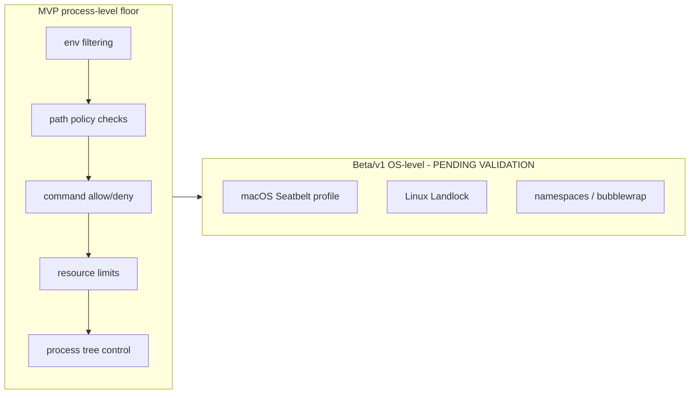

# 06 — Sandbox Specification

This chapter is the corpus-wide authority for the sandbox model (single-home matrix, Volume 0
chapter 03). The **Sandbox Engine** applies isolation policy to everything Andromeda
executes, behind the frozen `SandboxPort` (Volume 3 chapter 02: `Prepare`, `ApplyPolicy`,
`ExecuteIn`, `Teardown`). The layering strategy is fixed by ADR-021: **process-level controls
at MVP; OS-level isolation from Beta/v1, each mechanism PENDING VALIDATION** (macOS Seatbelt
via `sandbox-exec`, Linux Landlock / namespaces / bubblewrap). This chapter defines the
policy content, the enforcement honesty rules, and the five sandbox tiers. Launch discipline
is Volume 3's: the *only* process-spawning path for tools, plugins, terminal commands, and
stdio MCP servers is `SandboxPort.ExecuteIn` — direct spawning elsewhere is a defect.

## Policy model

A **SandboxPolicy** is the complete, serializable description of one execution environment.
Every execution records the policy that applied and the **effective containment level**
actually achieved (ADR-021 observability rule).

```json
{
  "tier": "tool",
  "isolation": "process",
  "working_dir": "${workspace}",
  "filesystem": {
    "writable_roots": ["${workspace}", "${sandbox_tmp}"],
    "readonly_roots": ["${home}/.cache/andromeda-readonly-example"],
    "denied_roots": ["${andromeda_state}", "${secret_store_paths}"],
    "follow_symlinks_out_of_roots": false
  },
  "network": {
    "stance": "permission_gated",
    "allowed": []
  },
  "environment": {
    "allowlist": ["PATH", "HOME", "USER", "LANG", "TERM", "TMPDIR", "SHELL", "TZ"],
    "extra": {},
    "secret_refs": []
  },
  "commands": {
    "allowlist": [],
    "denylist": ["sudo *", "su *", "doas *", "shutdown *", "reboot *", "mkfs*", "dd *"]
  },
  "limits": {
    "max_cpu_seconds": 300,
    "max_memory_mb": 2048,
    "max_processes": 64,
    "max_wall_clock_ms": 60000,
    "max_open_files": 512
  },
  "child_processes": "same_policy",
  "cleanup": "teardown_removes_tmp"
}
```

The example shows every policy field. Placeholders (`${workspace}`, `${sandbox_tmp}`,
`${home}`, `${andromeda_state}`, `${secret_store_paths}`) expand at `Prepare` time to
absolute, symlink-resolved paths. Field semantics:

| Field | Semantics |
|---|---|
| `tier` | One of the five [tiers](#sandbox-tiers); selects the base profile |
| `isolation` | Requested layer: `process` (MVP floor) or `os` (Beta/v1, PENDING VALIDATION per mechanism); `auto` in configuration resolves to the strongest validated layer available |
| `working_dir` | The execution's working directory; MUST be inside a writable root |
| `filesystem.writable_roots` | Directory trees where writes are permitted; everything else is read-only or denied |
| `filesystem.readonly_roots` | Trees explicitly readable when reads are otherwise restricted by tier |
| `filesystem.denied_roots` | Trees that MUST NOT be read or written regardless of grants: Andromeda's own state directories, Secret Store fallback file, audit databases |
| `filesystem.follow_symlinks_out_of_roots` | Always `false`; present so the record is explicit — see [Symlink handling](#symlink-handling) |
| `network.stance` | `permission_gated` (default: connections governed by the `network` permission; see [honesty note](#network-policy-honesty)) or `deny` (OS-level layers only) |
| `environment.allowlist` | Variables passed through from the parent environment; deny-by-default (ADR-021) |
| `environment.extra` | Variables injected by Andromeda (e.g., `ANDROMEDA_SANDBOX=1`) |
| `environment.secret_refs` | Secret Store references resolved into variables at launch, only under a `credential_access` decision; never persisted in the policy record — the record keeps the references, not the material |
| `commands.allowlist` / `commands.denylist` | Command patterns (chapter 05 grammar) evaluated by the Permission Manager before `ExecuteIn`; denylist wins; an empty allowlist means "not additionally restricted beyond the permission model" |
| `limits.*` | Resource ceilings; enforcement mechanism per platform is the PAL's, fidelity is recorded (see [Limits](#resource-limits)) |
| `child_processes` | `same_policy` (children inherit the sandbox and count against `max_processes`) or `deny` (any observed child triggers termination); there is no "unconfined children" value |
| `cleanup` | Teardown obligations; see [Temporary directories and cleanup](#temporary-directories-and-cleanup) |

## Sandbox tiers

Five tiers map execution subjects to base profiles. Tiers differ in lifetime, default
filesystem shape, and who supplies overrides (ADR-122).

| Tier | Subject | Lifetime | Default writable roots | Default environment | Overrides come from |
|---|---|---|---|---|---|
| `process` | Any child process Andromeda spawns that no other tier covers (e.g., `git` subprocesses via the PAL, ADR-025) | one command | none beyond the repository/working dir the operation targets | allowlist only | the owning engine's fixed profile |
| `tool` | One Tool Invocation (built-in or bridged) | one invocation | `${workspace}`, `${sandbox_tmp}` | allowlist only | tool declaration (Volume 6) intersected with grants |
| `workflow` | All executions of one Workflow Run stage | one stage | `${workspace}`, `${sandbox_tmp}` | allowlist only | workflow definition (Volume 4), never wider than the per-tool profiles it contains |
| `plugin` | A plugin process (Andromeda Runtime Protocol, ADR-009) | plugin `running` lifetime | `${plugin_data_dir}`, `${sandbox_tmp}` | allowlist only; no `ANDROMEDA_*` passthrough except protocol-declared variables | plugin manifest (Volume 6) intersected with grants |
| `mcp_server` | A locally launched (stdio transport) MCP server process | connection lifetime | `${mcp_server_data_dir}`, `${sandbox_tmp}` | allowlist only | MCP registration (Volume 6) intersected with grants |

Tier rules:

1. **Intersection, never union.** A subject's effective policy is its tier default
   intersected with its declaration and with the granted permissions. A tool declaring
   `path: ["src/**"]` inside a workspace grant for `docs/**` can write nowhere: the
   intersection is empty and the invocation is denied before launch.
2. **Workflow containment.** The `workflow` tier bounds its member tool sandboxes: a
   workflow-stage policy is a ceiling, and per-invocation `tool` policies apply beneath it.
3. **Remote MCP servers** (network transports) are not sandboxed by Andromeda — they run
   elsewhere. Their containment is the trust and authorization model of Volume 6; only
   locally spawned stdio servers get an `mcp_server` sandbox.
4. **Plugins and MCP servers never inherit secrets.** `environment.secret_refs` for these
   tiers is always empty unless a `credential_access` grant explicitly names the extension
   (chapter [07](07-credential-and-secret-management.md)).

## Layered enforcement



**Prose.** The diagram shows the two additive layers of ADR-021. The MVP floor is always
present: environment filtering, path policy, command allow/denylists, resource limits, and
process-tree control are applied by Andromeda's own code and portable OS primitives on every
execution. The OS-level layer is added per platform from Beta/v1 — Seatbelt profiles on
macOS, Landlock/namespaces/bubblewrap on Linux — and each mechanism remains PENDING
VALIDATION until its availability and behavior are validated on supported platform versions
(open-questions register, `99-volume-register.md`). The arrow from L1 to L2 is the additivity
constraint: OS-level enforcement wraps, never replaces, the floor, so a mechanism failure
degrades to the floor rather than to nothing. The **honesty rule** is normative: user-facing
surfaces and records MUST describe MVP containment as process-level controls and MUST NOT
claim OS-level isolation before the mechanism is validated and applied; the effective
containment level (`process` or `os:<mechanism>`) is recorded per execution and shown in the
TUI execution detail (Volume 8).

### Network policy honesty

At the `process` isolation layer, Andromeda cannot prevent an already-approved binary from
opening sockets (ADR-021 negative consequence). Therefore at MVP, `network.stance:
"permission_gated"` means: tools and extensions that *declare* network use are gated by the
`network` permission before launch, tool-originated connections through Andromeda's HTTP
surfaces are checked against `host`/`domain` selectors, and all of it is audited — but an
arbitrary subprocess's direct socket use is not kernel-blocked. The `deny` stance (actual
blocking of all network) becomes available only with a validated OS-level mechanism.
Documentation and prompts MUST state this boundary; overstating containment is a safety
defect (ADR-021).

## Filesystem policy

### Path policy

Every filesystem access performed by built-in tools and every path argument crossing
`SandboxPort` is checked against the policy roots after symlink resolution. Writes require
the target's resolved path inside a writable root; reads outside readable roots (tier
defaults plus `readonly_roots`) are denied for tiers that restrict reads; `denied_roots`
always win. Denials are E-SEC-005 with the offending resolved path in safe context.

### Symlink handling

1. Path checks resolve the full symlink chain (final and intermediate links) to a real path
   before comparing against roots; a link pointing outside the roots fails the check even
   when the link itself lives inside.
2. Creating a symlink whose target resolves outside the writable roots is a write-policy
   violation (E-SEC-005).
3. The MVP floor's resolve-then-act sequence has an inherent time-of-check/time-of-use gap
   against a concurrently mutating filesystem; the specification records this honestly as a
   floor limitation. OS-level layers close it (Landlock/Seatbelt evaluate at the kernel
   boundary) — one of the reasons L2 exists. Threat analysis: threat model chapter 04
   (symlink attacks).

### Temporary directories and cleanup

- `Prepare` creates a per-sandbox temporary directory `${sandbox_tmp}` under the workspace
  state area (`.andromeda/tmp/<sandbox-ulid>/`) with mode `0700`, and sets `TMPDIR` to it.
- `Teardown` terminates the process tree (grace then kill, budgets per Volume 6 teardown
  keys), removes `${sandbox_tmp}`, finalizes the execution records, and emits
  `sandbox.teardown.completed`. Teardown is idempotent.
- Orphan sweep: on workspace open, sandbox temp directories belonging to dead incarnations
  (Volume 3 recovery procedure) are removed and the sweep is audit-recorded. A directory that
  cannot be removed is reported (E-SEC-007) and listed by `andromeda doctor` (Volume 8).

## Environment and secret filtering

Deny-by-default passthrough (ADR-021): a child process receives exactly the allowlisted
variables, the policy's `extra` injections, and — only under a `credential_access` decision —
variables resolved from `secret_refs` at launch. Everything else in Andromeda's own
environment, including all `ANDROMEDA_*` configuration variables and any secrets the user's
shell exported, is withheld. The default allowlist is the `sandbox.env_allowlist`
configuration key's default: `PATH`, `HOME`, `USER`, `LOGNAME`, `LANG`, `LC_ALL`, `LC_CTYPE`,
`TERM`, `TMPDIR` (overridden to `${sandbox_tmp}`), `SHELL`, `TZ`. Additionally, values of
active secrets are scrubbed from any allowlisted variable's value by the redaction registry
(chapter 07) before passthrough — an allowlisted `PATH` cannot smuggle a key that a shell
init script planted in it.

## Resource limits

| Limit | MVP floor enforcement | Recorded fidelity |
|---|---|---|
| `max_wall_clock_ms` | timer + teardown; always enforced portably | `enforced` |
| `max_cpu_seconds` | POSIX rlimit CPU on the child where the platform honors it; teardown on breach detection otherwise | `enforced` or `monitored` per platform (PAL conformance tests decide, Volume 3) |
| `max_memory_mb` | rlimit where reliable (Linux); resident-set monitoring with teardown on breach where rlimits are unreliable (macOS) | `enforced` or `monitored` |
| `max_processes` | process-tree accounting via the PAL Process Trees surface; teardown on breach | `monitored` |
| `max_open_files` | rlimit NOFILE | `enforced` |

The per-execution record states, per limit, whether it was `enforced` (breach impossible) or
`monitored` (breach detected and terminated) — the same honesty rule as containment level.
Default values are the `[sandbox]` configuration keys below; tools and tiers may declare
lower ceilings, never higher than the configured maxima.

## Configuration

`[sandbox]` table content (key content owned by this volume; schema and precedence are
Volume 10's):

```toml
[sandbox]
isolation = "auto"            # auto | process | os
degradation = "ask"           # refuse | ask | allow — behavior when requested isolation is unavailable
env_allowlist = ["PATH", "HOME", "USER", "LOGNAME", "LANG", "LC_ALL", "LC_CTYPE", "TERM", "TMPDIR", "SHELL", "TZ"]
writable_roots = []           # extra writable roots added to tier defaults (workspace-relative or absolute)
readonly_roots = []           # extra explicitly readable roots
command_denylist = ["sudo *", "su *", "doas *", "shutdown *", "reboot *", "mkfs*", "dd *"]
command_allowlist = []        # empty = not additionally restricted beyond the permission model
max_cpu_seconds = 300
max_memory_mb = 2048
max_processes = 64
max_open_files = 512
```

`isolation = "auto"` selects the strongest *validated* layer on the running platform —
`process` everywhere at MVP by definition. `degradation` governs what happens when a policy
requests `os` and no validated mechanism is available: `refuse` fails the execution with
E-SEC-006; `ask` raises an Approval explaining the downgrade; `allow` proceeds at the floor
with the downgrade recorded and `sandbox.containment.degraded` emitted. Degradation is never
silent under any setting (ADR-021).

## Requirements

### FR-SEC-101 — Sandbox

- Type: Functional
- Status: Draft
- Priority: P0
- Phase: MVP
- Source: Provided
- Owner: Sandbox Engine (Volume 9)
- Affected components: Sandbox Engine, Tool Runtime, Terminal Engine, Plugin Runtime, MCP Runtime, Platform Abstraction Layer, Permission Manager
- Dependencies: ADR-021, ADR-122; Volume 3 SandboxPort (FR-ARCH-003); FR-SEC-100, FR-SEC-107, FR-SEC-108
- Related risks: Threat model chapters 02–04 (command injection, sandbox escape, secret exfiltration, symlink attacks)

#### Description

Every process Andromeda executes — terminal commands, tools, plugins, locally spawned MCP
servers, and engine subprocesses — runs inside a sandbox produced by the Sandbox Engine from
a complete SandboxPolicy: working directory, filesystem roots (writable/readonly/denied),
network stance, filtered environment, secret filtering, command allow/denylists, resource
limits, child-process control, symlink handling, per-sandbox temporary directory, and
teardown cleanup. Enforcement layers follow ADR-021: the process-level floor is always
applied; OS-level mechanisms are added per platform from Beta/v1 once validated. The
effective containment level and per-limit fidelity are recorded per execution and never
overstated.

#### Motivation

Approval is not a grant of unlimited side effects (ADR-021): an allowed command still must
not read the Secret Store fallback file, inherit the user's exported tokens, write outside
the workspace, or fork without bound. The sandbox converts a permission decision into a
bounded execution environment.

#### Actors

Sandbox Engine and PAL (enforcement); Tool Runtime, Terminal Engine, Plugin Runtime, MCP
Runtime (callers); Permission Manager (pre-launch decisions); users (degradation consent).

#### Preconditions

A permission decision covering the execution exists; the tier profile and declarations are
validated; workspace open.

#### Main flow

1. The caller requests `Prepare` with a SandboxSpec naming the tier and subject.
2. The Sandbox Engine computes the effective policy (tier default ∩ declaration ∩ grants),
   creates `${sandbox_tmp}`, and returns the handle.
3. `ApplyPolicy` binds or tightens the policy; the effective containment level becomes part
   of the handle's observable state.
4. `ExecuteIn` launches the command with the filtered environment inside the working
   directory; execution I/O proceeds via TerminalPort.
5. `Teardown` terminates the tree, removes temp state, finalizes records, emits events.

#### Alternative flows

- Requested `os` isolation unavailable: behavior per `sandbox.degradation` — refuse
  (E-SEC-006), ask (Approval), or allow-with-record; `sandbox.containment.degraded` emitted
  in the latter two when execution proceeds at the floor.
- Policy violation attempt at runtime (write outside roots, denied command, limit breach):
  the operation is blocked or the tree is terminated; E-SEC-005 recorded;
  `sandbox.violation.blocked` emitted; the Tool Result carries the structured error.

#### Edge cases

- Empty effective policy intersection (declaration incompatible with grants): refused before
  launch with E-SEC-005 — nothing starts.
- Working directory outside every writable root: `Prepare` fails validation.
- Teardown failure (unkillable process, undeletable temp): E-SEC-007 with severity critical;
  the execution record is finalized as `killed`/`failed` per Volume 2 outcome vocabulary;
  the orphan is listed for the startup sweep and `andromeda doctor`.
- Nested execution (a tool spawning a child): `child_processes: same_policy` applies the same
  sandbox and accounting; `deny` terminates on first observed child.
- Cancellation: context cancellation triggers teardown semantics (Volume 3 FR-ARCH-004); no
  child of the tree survives.

#### Inputs

SandboxSpec (tier, subject, declaration-derived requests); grants; configuration keys;
platform capability report from the PAL.

#### Outputs

Sandbox handle; execution records with effective containment level and limit fidelity;
`sandbox.*` events; Audit Records for violations and degradations.

#### States

Sandboxes are not catalog entities; their lifecycle is `Prepare` → executions → `Teardown`,
recorded per execution. Subject states live in their own machines (Tool Invocation, Plugin,
MCP Client Connection — Volume 6).

#### Errors

E-SEC-005 (policy violation), E-SEC-006 (isolation unavailable, degradation refused),
E-SEC-007 (teardown failure); tool-facing surfacing via the E-TOOL family (Volume 6).

#### Constraints

Launch exclusivity: `ExecuteIn` is the only spawn path for the covered subjects (Volume 3);
policies are serializable and recorded; no policy field may be widened by a child; MVP
containment described honestly (ADR-021).

#### Security

The sandbox is the containment half of Safe by Default (the permission model is the consent
half). Denied roots protect Andromeda's own state and the Secret Store from the very tools
it runs; environment filtering stops ambient credential leakage — the most common real-world
exfiltration path.

#### Observability

Every execution records: policy document, effective containment level, per-limit fidelity,
violations, degradations, teardown outcome. Events: `sandbox.prepared`,
`sandbox.policy.applied`, `sandbox.violation.blocked`, `sandbox.containment.degraded`,
`sandbox.teardown.completed`.

#### Performance

Sandbox setup/teardown overhead budgets are Volume 12's; the structural requirement is that
`Prepare`+`ExecuteIn` add no network I/O and no unbounded scans.

#### Compatibility

The policy model is platform-independent; enforcement mechanisms are per-platform inside the
PAL. Windows (v2 candidate) maps the same policy model to Windows primitives per Volume 3's
future platform chapter — the policy schema does not change.

#### Acceptance criteria

- Given a tool declaring writes to `src/**` with a matching grant, when it writes
  `src/a.go`, then the write succeeds; when it attempts `~/.ssh/config`, then the write is
  blocked with E-SEC-005 and a `sandbox.violation.blocked` event with the resolved path.
- Given a shell with `SECRET_TOKEN` exported, when any sandboxed command runs `env`, then
  `SECRET_TOKEN` is absent and only allowlisted variables appear.
- Given `sandbox.degradation = "refuse"` and a policy requesting `os` isolation on a platform
  without a validated mechanism, when execution is requested, then it fails with E-SEC-006
  and nothing launches.
- Given a command that forks beyond `max_processes`, when the breach is detected, then the
  tree is terminated, the outcome is recorded as `killed`, and the record shows the limit and
  fidelity.
- Negative case: given a symlink inside the workspace pointing to `/etc`, when a tool writes
  through it, then the resolved-path check denies with E-SEC-005.
- Permission case: given no `credential_access` grant, when a plugin starts, then
  `secret_refs` is empty and no secret material reaches its environment.
- Observability case: every execution record resolves to its policy document and containment
  level; degraded executions carry the degradation record.

#### Verification method

Sandbox conformance suite (Volume 13): escape attempts (path, symlink, env, fork), limit
breach fault injection, teardown timing, orphan-sweep crash tests, per-platform PAL
conformance for limit fidelity; documentation audit for containment honesty wording.

#### Traceability

PRD-005, PRD-006; ADR-021, ADR-122, ADR-125; SM-16; FR-SEC-100, FR-SEC-107, FR-SEC-108;
consumed by FR-TOOL-001 (Volume 6), FR-PLUG-001 (Volume 6), FR-MCP-001 (Volume 6).

### FR-SEC-106 — Sandbox tiers

- Type: Functional
- Status: Draft
- Priority: P0
- Phase: MVP
- Source: Design
- Owner: Sandbox Engine (Volume 9)
- Affected components: Sandbox Engine, Tool Runtime, Workflow Engine, Plugin Runtime, MCP Runtime
- Dependencies: FR-SEC-101; ADR-122; Volume 6 declarations (tool/plugin/MCP); Volume 4 workflow definitions
- Related risks: Threat model chapter 03 (malicious plugins, MCP poisoning, malicious skills)

#### Description

Five sandbox tiers — `process`, `tool`, `workflow`, `plugin`, `mcp_server` — bind execution
subjects to base profiles with the lifetimes, default roots, and override sources of the
[tier table](#sandbox-tiers). Effective policy is always the intersection of tier default,
subject declaration, and granted permissions; tiers for long-lived subjects (plugin,
mcp_server) never receive secret material without an explicit, extension-named
`credential_access` grant.

#### Motivation

One undifferentiated sandbox either over-restricts interactive tools or under-restricts
long-lived extension processes. Tiers encode the trust-relevant differences — lifetime,
declaration source, data directories — while keeping one policy schema and one enforcement
engine (ADR-122).

#### Actors

Sandbox Engine; the four runtime callers; extension authors (declarations).

#### Preconditions

Subject declaration validated (Volume 6); permission decisions available.

#### Main flow

1. A caller names the tier and subject in `Prepare`.
2. The engine loads the tier base profile, intersects with declaration and grants.
3. Execution proceeds under FR-SEC-101 mechanics.

#### Alternative flows

- Workflow stage: the Workflow Engine prepares a `workflow` sandbox ceiling; member tool
  invocations get `tool` sandboxes bounded by it.
- Plugin restart (Volume 6 machine): a fresh `Prepare` — policies are never reused across
  process incarnations.

#### Edge cases

- A tool bridged from an MCP server executes under the `mcp_server` process's sandbox for
  the server side and the `tool` tier for any local materialization of results; the two never
  merge.
- A plugin declaring a data directory inside the workspace: legal; the directory is added to
  its writable roots after path validation.
- Tier misuse (caller requests `process` tier for a plugin): rejected at `Prepare` — the
  subject kind determines the legal tier.

#### Inputs

Tier name, subject identity, declarations, grants.

#### Outputs

Effective policy per execution; records naming the tier.

#### States

Not applicable beyond FR-SEC-101; subject machines are Volume 6's.

#### Errors

E-SEC-005 (empty intersection, tier misuse), E-SEC-006, E-SEC-007 as in FR-SEC-101.

#### Constraints

Closed tier set; new tiers require an ADR; intersection semantics (never union).

#### Security

Long-lived extension processes are the supply-chain surface (threat model chapter 03); their
tiers default to no workspace write access beyond their data directories and no secrets.

#### Observability

Records and `sandbox.prepared` payloads carry the tier; per-tier violation metrics feed
Volume 10.

#### Performance

Tier resolution is table lookup plus intersection; covered by Volume 12 dispatch budgets.

#### Compatibility

Tier semantics identical across platforms; only enforcement mechanics differ per PAL.

#### Acceptance criteria

- Given each of the five subject kinds, when its execution is prepared, then the record names
  the matching tier and the tier's default roots applied.
- Given a plugin with no `credential_access` grant, when started, then its environment
  contains no secret material (probe asserts).
- Given a workflow stage ceiling excluding `network`, when a member tool with a network grant
  runs in that stage, then the intersection denies network and the denial is recorded.
- Negative case: `Prepare` with a tier not matching the subject kind fails validation.
- Observability case: per-tier violation counts are queryable from local metrics.

#### Verification method

Tier matrix integration tests (five subjects × declaration/grant combinations); workflow
ceiling tests; plugin/MCP environment probes; record audits (Volume 13).

#### Traceability

ADR-122; FR-SEC-101; Volume 6 FR-TOOL-001, FR-PLUG-001, FR-MCP-001; Volume 4 FR-WF-001.

### FR-SEC-107 — Environment and secret filtering

- Type: Functional
- Status: Draft
- Priority: P0
- Phase: MVP
- Source: Provided
- Owner: Sandbox Engine (Volume 9)
- Affected components: Sandbox Engine, PAL, Secret Store, Tool Runtime, Plugin Runtime, MCP Runtime
- Dependencies: FR-SEC-101, FR-SEC-102, FR-SEC-109; ADR-014, ADR-021
- Related risks: Threat model chapters 02 and 04 (secret exfiltration, credential theft, log leakage)

#### Description

Child environments are constructed, not inherited: exactly the allowlisted variables, policy
injections, and — under a `credential_access` decision — launch-time resolutions of named
`secret_refs`. All `ANDROMEDA_*` variables are withheld. Allowlisted variable *values* are
scrubbed against the redaction registry (chapter 07) before passthrough. Secret material
injected for a launch exists only in the child's environment and the launch code path; it is
never written to the policy record, logs, events, or errors.

#### Motivation

Ambient environment inheritance is the highest-frequency real-world secret leak: users export
tokens in shells, and every child sees them. Deny-by-default passthrough eliminates the class
(ADR-021 rationale), and registry scrubbing closes the "secret hidden inside an allowlisted
variable" corner.

#### Actors

Sandbox Engine (construction); Secret Store (resolution); extension processes (recipients).

#### Preconditions

Policy computed; for `secret_refs`, a `credential_access` decision naming the subject.

#### Main flow

1. `ExecuteIn` builds the environment map from allowlist ∩ parent env, applies redaction
   scrubbing to values, merges `extra`, resolves `secret_refs` via SecretStorePort.
2. The child launches with exactly that map.
3. The resolution is audit-recorded (`secret.accessed`, chapter 07).

#### Alternative flows

- Resolution failure (E-SEC-008/009/010): the launch fails; no partial environment with some
  secrets is ever used.
- No grant: `secret_refs` non-empty in a request without a decision is a caller defect;
  `ExecuteIn` refuses (E-SEC-005 class).

#### Edge cases

- A secret value coincidentally equal to a common string: registry scrubbing applies to
  values ≥ 8 characters only (chapter 07 redaction rules) to avoid mangling the environment.
- `TMPDIR` is always overridden to `${sandbox_tmp}` after allowlist processing.
- Empty allowlist in configuration: legal; children receive only `extra` injections.

#### Inputs

Parent environment; allowlist; policy `extra`; `secret_refs` plus decision.

#### Outputs

Constructed child environment; audit records for secret resolutions.

#### States

Not applicable.

#### Errors

E-SEC-005 (ungranted secret request), E-SEC-008/009/010 surfaced from the Secret Store.

#### Constraints

No code path may pass the parent environment wholesale; the environment map construction is
a single audited function in the Sandbox Engine (Volume 13 static check).

#### Security

Directly implements the ADR-021 "secrets already in the environment MUST NOT leak into child
processes by default" force; combined with chapter 07 redaction it bounds credential-theft
blast radius.

#### Observability

Audit records for every secret injection (which ref, which subject, which decision); no
values anywhere.

#### Performance

Environment construction is in-memory; secret resolution latency per chapter 07.

#### Compatibility

Identical semantics on all platforms; PAL handles per-OS environment mechanics.

#### Acceptance criteria

- Given arbitrary exported variables in the parent shell, when any sandboxed process dumps
  its environment, then only allowlisted names (plus injections) appear.
- Given an active credential and an allowlisted variable whose value embeds that secret, when
  the environment is constructed, then the value is scrubbed per chapter 07 rules.
- Given a granted `secret_refs` launch, when it runs, then the audit chain shows the
  resolution bound to the decision, and the policy record contains the reference, never the
  value.
- Negative case: `secret_refs` without a decision refuses launch.
- Error case: Secret Store unavailable fails the launch entirely (no partial secrets).
- Observability case: `secret.accessed` audit records resolve to subject and decision.

#### Verification method

Environment probe suite across all tiers and platforms; planted-secret scrub tests; static
check that exactly one environment-construction path exists; fault injection on resolution.

#### Traceability

ADR-014, ADR-021; FR-SEC-101, FR-SEC-102, FR-SEC-109; SM-16.

### FR-SEC-108 — Filesystem policy, symlinks, temp directories, and cleanup

- Type: Functional
- Status: Draft
- Priority: P0
- Phase: MVP
- Source: Provided
- Owner: Sandbox Engine (Volume 9)
- Affected components: Sandbox Engine, PAL, Tool Runtime, Workspace Engine
- Dependencies: FR-SEC-101; ADR-021, ADR-022
- Related risks: Threat model chapters 02 and 04 (path traversal, symlink attacks, malicious files)

#### Description

Filesystem access under a sandbox follows resolved-path policy: writes only inside writable
roots, reads per tier defaults plus `readonly_roots`, `denied_roots` absolute. Symlink chains
are fully resolved before checks; out-of-root link targets fail closed. Each sandbox gets a
private `0700` temporary directory wired as `TMPDIR`, removed at teardown; startup sweeps
remove orphans of dead incarnations. The floor's TOCTOU limitation is recorded honestly and
closed by the OS-level layer when validated.

#### Motivation

Path traversal and symlink escapes are the cheapest attacks against workspace-scoped agents
(threat model chapter 02); a private temp directory removes the shared-`/tmp` symlink and
squatting classes without user-visible cost.

#### Actors

Sandbox Engine, PAL (checks); tools and commands (subjects); Workspace Engine (sweeps).

#### Preconditions

Policy prepared; workspace root resolved.

#### Main flow

1. A filesystem operation's target path is resolved (all links, `..`, case per platform
   semantics) via the PAL.
2. The resolved path is compared against denied, writable, and readable roots in that order.
3. Allowed operations proceed; denials produce E-SEC-005 with resolved and requested paths.

#### Alternative flows

- Teardown removes `${sandbox_tmp}` and finalizes records; failures raise E-SEC-007.
- Startup sweep removes orphaned sandbox temp directories and audit-records the sweep.

#### Edge cases

- Hard links: policy checks apply to the path operated on; creating a hard link to a file
  outside writable roots is denied (link creation is a write at both ends).
- Case-insensitive filesystems (macOS default): root comparisons use the PAL's canonical
  form so `SRC/` cannot bypass a `src/` rule.
- Paths crossing mount points out of the workspace (bind/volume mounts): resolution operates
  on real paths; a mount that redirects outside the roots fails the check.
- Extremely deep or cyclic symlink chains: resolution depth is bounded (PAL constant);
  exceeding it is a denial, not a hang.

#### Inputs

Requested paths; policy roots; PAL resolution.

#### Outputs

Allowed operations; E-SEC-005 denials with both paths; sweep reports.

#### States

Not applicable.

#### Errors

E-SEC-005, E-SEC-007.

#### Constraints

Checks precede effects; resolution is bounded; temp directories are always per-sandbox,
never shared.

#### Security

Denied roots protect `.andromeda/` state, audit databases, and the Secret Store fallback
file from the workspace's own tooling — an agent-driven product must not be able to eat its
own evidence (INV-AUD-01 support).

#### Observability

Violations emit `sandbox.violation.blocked` with resolved paths in safe context; sweep
results appear in startup diagnostics and audit.

#### Performance

Resolution adds one realpath pass per checked operation; budgets per Volume 12 tool dispatch
targets.

#### Compatibility

Semantics identical; canonicalization rules per platform live in the PAL with conformance
tests (Volume 3).

#### Acceptance criteria

- Given a write target `../../etc/passwd` relative to the workspace, when checked, then the
  resolved path fails and E-SEC-005 records both paths.
- Given a symlink chain of depth within bounds ending inside a writable root, when written,
  then the operation succeeds; ending outside, it is denied.
- Given a sandbox execution, when it completes or is cancelled, then `${sandbox_tmp}` no
  longer exists and the teardown event was emitted.
- Given a crash mid-execution, when the workspace next opens, then the orphaned temp
  directory is removed and the sweep is audit-recorded.
- Negative case: hard-linking a denied-root file into the workspace is denied.
- Observability case: every denial resolves to its policy document and rule.

#### Verification method

Path-policy fuzzing (traversal, links, case, depth) per platform; crash-injection sweep
tests; teardown verification in the sandbox conformance suite (Volume 13).

#### Traceability

ADR-021, ADR-022; FR-SEC-101; threat model chapters 02/04; SM-16.

## Non-functional requirements

### NFR-SEC-004 — Secret leakage prevention across boundaries

- Category: Privacy
- Priority: P0
- Phase: MVP
- Metric: Count of un-redacted secret-material occurrences in child environments, logs, events, errors, Tool Results, memory records, and exports during the planted-secret test corpus (secrets planted in shell env, config-adjacent files, tool inputs, and provider traffic fixtures)
- Target: 0 occurrences
- Minimum threshold: 0 occurrences — any occurrence is a release-blocking defect
- Measurement method: automated leak-hunt suite scanning every sink after instrumented runs with known planted markers (Volume 13 fixtures); scheduled fuzzing of redaction paths
- Test environment: CI, all Tier 1 platforms, offline condition included
- Measurement frequency: every merge (gate) and every release
- Owner: Sandbox Engine / Secret Store (Volume 9)
- Dependencies: FR-SEC-107, FR-SEC-109, FR-SEC-102
- Risks: Threat model chapters 02/04 (secret exfiltration, log leakage)
- Acceptance criteria: Leak-hunt suite reports zero marker occurrences across all sinks on all platforms; new sink types added to the product register themselves with the suite (checklist enforced in review).

## Error codes

### E-SEC-005 — Sandbox policy violation

- Category: Security
- Severity: Error
- User message: "The action was blocked by the sandbox policy: <rule summary>."
- Technical message: tier, policy rule violated (path/command/env/limit/child), requested and resolved values, subject identity
- Cause: an execution attempted an operation outside its effective policy (write outside roots, denied command, out-of-policy symlink target, ungranted secret request, empty policy intersection, tier misuse)
- Safe-to-log data: tier, rule kind, resolved path or command pattern, subject IDs
- Recoverability: recoverable — widen the grant/declaration deliberately and retry
- Retry policy: none automatic
- Recommended action: inspect the violation record; if intended, grant the permission or adjust the declaration; if not, treat as a containment signal (chapter 08)
- Exit-code mapping: 5 when surfaced as a denial before launch; 6 when a running tool is terminated
- HTTP mapping: not applicable
- Telemetry event: `sandbox.violation.blocked`
- Security implications: repeated violations from one subject are an incident-response trigger (chapter 08); the violation itself was contained

### E-SEC-006 — Isolation mechanism unavailable

- Category: Environment
- Severity: Error
- User message: "The required isolation level is not available on this system, and policy does not allow running with reduced isolation."
- Technical message: requested layer/mechanism, platform capability report, degradation setting
- Cause: policy requested `os` isolation where no validated mechanism exists, and `sandbox.degradation = "refuse"` (or the user declined the degradation Approval)
- Safe-to-log data: requested mechanism, platform, degradation setting
- Recoverability: recoverable — allow degradation, change policy, or run on a platform with the mechanism
- Retry policy: none automatic
- Recommended action: review `sandbox.isolation`/`sandbox.degradation`; consult the platform isolation notes (PENDING VALIDATION status per mechanism)
- Exit-code mapping: 6
- HTTP mapping: not applicable
- Telemetry event: `sandbox.containment.degraded` (outcome: refused)
- Security implications: refusing is the safe default; running degraded is recorded and never silent (ADR-021)

### E-SEC-007 — Sandbox teardown failure

- Category: Integrity
- Severity: Critical
- User message: "A sandboxed process or its temporary data could not be fully cleaned up."
- Technical message: sandbox ULID, surviving PIDs, undeletable paths, escalation steps taken
- Cause: process tree not fully terminable within the kill budget, or temp directory removal failed (open handles, permissions)
- Safe-to-log data: sandbox ULID, PID count, path (workspace-relative)
- Recoverability: recoverable — startup sweep retries; manual cleanup guided by `andromeda doctor`
- Retry policy: teardown retried once after kill escalation; then recorded for sweep
- Recommended action: run `andromeda doctor`; terminate survivors manually if present
- Exit-code mapping: 6
- HTTP mapping: not applicable
- Telemetry event: `sandbox.teardown.completed` (outcome: failed)
- Security implications: a surviving process retains only its already-granted, filtered environment — but it is unaccounted; the record flags it for incident review (chapter 08)
