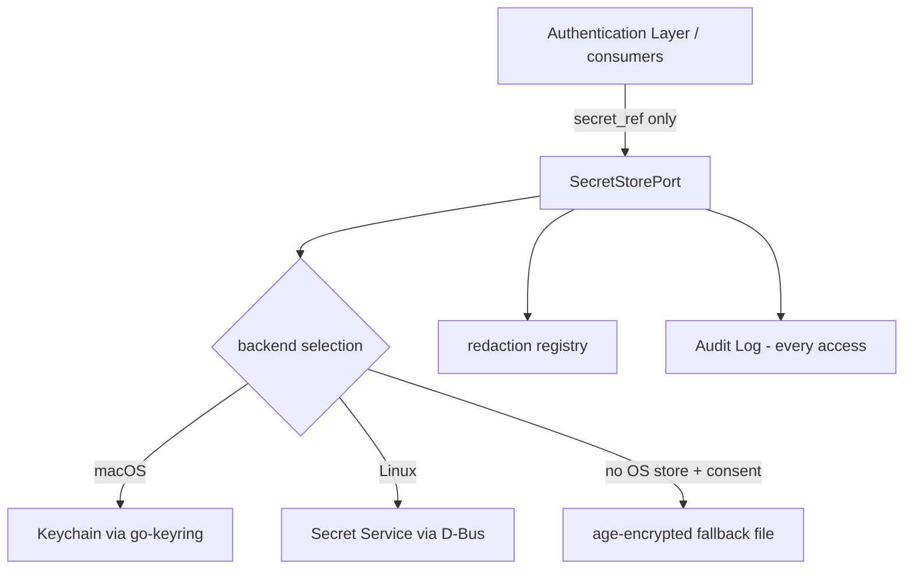

# 07 — Credential and Secret Management

This chapter owns the credential **storage model** (single-home matrix: Volume 9 owns the
model; Volume 5 owns provider auth *flows*). It implements ADR-014: the **Secret Store**
abstraction over OS keychains (zalando/go-keyring: macOS Keychain, Linux Secret Service,
Windows Credential Manager in the future phase) with an **opt-in, explicit,
age-encrypted file fallback**, behind the frozen `SecretStorePort` (Volume 3 chapter 02:
`Get`, `Set`, `Delete`, `List`). The Credential entity — metadata plus a `secret_ref`, never
material — is Volume 2's (INV-CRED-01..04). This chapter also owns redaction: how secret
material is kept out of logs, errors, events, memory, exports, and child environments.

## Storage model



**Prose.** The diagram shows the single bridge between references and material: consumers
(the Authentication Layer for provider flows per Volume 5, the Sandbox Engine for granted
launch-time injections per chapter 06, integration tools via the Tool Runtime) hold only
`secret_ref` handles and call `SecretStorePort`. The Secret Store selects the backend — the
platform keychain first, the encrypted-file fallback only where no OS store is usable *and*
the user has explicitly consented (FR-SEC-110). Every resolution feeds two side channels:
the **redaction registry** (so sinks can scrub the material, FR-SEC-109) and the **Audit
Log** (every access is evidence, chapter 08). The constraint the diagram encodes: no other
component touches credential bytes — material flows only along the `SecretStorePort` edges,
and references are what cross every other port (Volume 3 rule).

### References and naming

- `secret_ref` format: `sec_<ULID>` (26-character ULID per ADR-027), minted at `Set` time.
  References are opaque, unique, and meaningless without the store — safe to persist in the
  Credential row, configuration is NOT a legal home for them (`andromeda.toml` is never a
  credential carrier, ADR-014).
- Backend mapping: OS-keychain entries use service `andromeda` and account `<secret_ref>`;
  the fallback file keys entries by `secret_ref`.
- `SecretValue` is a zeroize-on-release wrapper (Volume 3): callers MUST NOT copy material
  into long-lived buffers, persist it, or log it; the wrapper zeroes its buffer when
  released and release is enforced at sandbox launch and request-send boundaries.

### Scope and placement

Credentials are machine-level: Credential rows live in the global database only (ADR-028;
Volume 2 persistence), and Secret Store slots are per OS user. Workspace databases and
workspace exports can never carry credential metadata or material by construction.

### Fingerprints and display

`fingerprint` (Volume 2, INV-CRED-02) derivation rules, owned here:

1. Compute SHA-256 over the secret material; the fingerprint's hash component is the first
   8 hex characters, displayed as `sha256:ab12cd34`.
2. For `api_key` kind material of length ≥ 20 characters, a display suffix of the last 4
   characters MAY be appended as `…wxyz`. Shorter material gets no suffix.
3. Display surfaces (CLI/TUI listings, prompts, errors) show at most label, kind, provider,
   status, fingerprint, and timestamps — never material, never full-length previews.

### Encrypted-file fallback

Where no OS store is usable (headless Linux without a D-Bus Secret Service is the canonical
case, ADR-014):

- **Opt-in and explicit** (FR-SEC-110): never selected silently; enabling requires the
  deliberate `security.fallback_store = true` configuration or the interactive consent flow,
  and the CLI/TUI mark the fallback as the lower-protection option relative to the OS
  keychain whenever it is in use.
- File: `<XDG data dir>/andromeda/secrets.age` (ADR-022 mapping), one age-encrypted document
  containing the entry map; file mode `0600`, parent directory `0700`, ownership checked at
  open.
- Encryption: age with a passphrase-derived identity (age's scrypt-based recipient). The
  passphrase is prompted per process session, held only in a `SecretValue`, and never
  written. Non-interactive processes without a cached-in-process passphrase fail resolution
  with E-SEC-011 — there is no passphrase file and no environment-variable passphrase path.
- Writes are atomic (temp file + rename) and serialized via PAL file locking; a corrupted or
  wrong-passphrase file yields E-SEC-012 without destroying the file.

### Orphan sweep

INV-CRED-04 owns both directions: deleting a Credential first deletes its Secret Store slot,
then the row. The sweep — run at global-database open and via `andromeda doctor` —
enumerates store entries (`List`) against Credential rows: a slot without a row is deleted
and audit-recorded (`secret.orphan.swept`); a row whose slot is missing is marked and
surfaced for re-authentication (Volume 5 flows).

## Redaction

Redaction is a definition-time property of every sink (ADR-016 envelope; ADR-124 records the
strategy). Three mechanisms compose:

1. **Registry-based exact matching.** The Secret Store maintains an in-process registry of
   active secret material (and its common encodings: base64, URL-encoded) for every secret
   resolved in the current process. Every sink boundary — log writer, event publisher, error
   envelope construction, Tool Result recording, memory ingestion, trace/metric attributes,
   exports, child-environment values (chapter 06) — scrubs registry matches of length ≥ 8
   characters, replacing them with `[REDACTED:<fingerprint>]`.
2. **Structural redaction.** Fields declared sensitive by schema (tool input/output schemas
   per Volume 6, config keys carrying `secret_ref`s, `Authorization`/`Proxy-Authorization`
   and provider-key headers in HTTP diagnostics per Volume 5) are redacted by name,
   independent of value.
3. **Pattern heuristics.** Generic high-risk shapes are scrubbed even when unregistered:
   `Bearer <token>` values, `key=value` pairs whose key matches
   (case-insensitively) `token|secret|password|passwd|api_key|apikey|private_key`, and PEM
   private-key blocks. Additional patterns are configurable
   (`security.redaction_patterns`). Heuristics are additive-only: they can only cause MORE
   redaction, never authorize weaker registry/structural behavior.

Redaction failure handling is fail-closed per ADR-125: if a sink cannot apply redaction
(registry unavailable during teardown, encoder error), the payload is dropped or replaced
with a redaction-failure marker — never emitted raw.

Memory discipline: the Memory Manager MUST NOT store secret material; ingestion passes the
registry scrub, and content matching the registry is rejected or redacted before persistence
(Volume 7 references this rule as its own constraint — the mechanism is minted here).

## Configuration

`[security]` table keys owned by this chapter (schema/precedence per Volume 10):

```toml
[security]
fallback_store = false        # opt-in consent for the age-encrypted file fallback (ADR-014)
redaction_patterns = []       # extra regex patterns scrubbed at every sink, additive-only
```

## Requirements

### FR-SEC-102 — Secret storage

- Type: Functional
- Status: Approved
- Priority: P0
- Phase: MVP
- Source: Provided
- Owner: Secret Store (Volume 9)
- Affected components: Secret Store, PAL, Authentication Layer, Persistence Layer, CLI, TUI
- Dependencies: ADR-014, ADR-022, ADR-027, ADR-028; Volume 3 SecretStorePort (FR-ARCH-003); Volume 2 INV-CRED-01..04
- Related risks: Threat model chapters 02–04 (credential theft, secret exfiltration, log leakage)

#### Description

All secret material — provider API keys, OAuth token material, service tokens, and any other
credential bytes — is stored exclusively through the Secret Store: platform keychain
backends first (macOS Keychain, Linux Secret Service; Windows Credential Manager in the
future phase), with the age-encrypted file fallback only under explicit consent
(FR-SEC-110). Material never appears in plaintext files, configuration, databases, logs,
events, errors, exports, or serialization of any entity (INV-CRED-01 is absolute). Only
`secret_ref` handles cross component boundaries; only `SecretStorePort` methods touch
material; every `Get` is audit-recorded.

#### Motivation

Credentials sit at the top of the Volume 0 precedence order ("safety of the user, the
system, and credentials"). One storage discipline with no exceptions is what makes the rest
of the corpus checkable: every other volume can reference this requirement instead of
re-deciding storage locally.

#### Actors

Authentication Layer (primary writer via Volume 5 flows); Sandbox Engine (granted launch
injections); integration tools via Tool Runtime (granted resolutions); users (consent,
inspection, deletion); the PAL (backend mechanics).

#### Preconditions

Global database open; a usable backend (OS store, or consented fallback).

#### Main flow

1. A Volume 5 flow acquires material through an official mechanism and calls `Set` with
   metadata; a `secret_ref` is minted and stored on the Credential row.
2. A consumer needing material calls `Get(ref)` under its authorization (credential binding
   for provider requests per Volume 5; `credential_access` decision for tools/extensions per
   chapter 05).
3. Material returns as a `SecretValue`, registers in the redaction registry, is used, and is
   released (zeroized).
4. The access is audit-recorded (`secret.accessed`) with ref, consumer, and decision context
   — never the value.

#### Alternative flows

- `Delete`: removes the slot, then tombstones the Credential row (INV-CRED-04 ordering);
  audit-recorded (`secret.deleted`).
- Rotation (Volume 5 `Rotate`): lands as `Set` replacement under a new or same ref per flow
  rules; old material leaves the registry when released.
- Backend unavailable: E-SEC-008 with guided remediation (start the OS store, or consent to
  the fallback per FR-SEC-110); operations never queue material in memory awaiting a
  backend.

#### Edge cases

- Two processes writing the fallback file concurrently: PAL file locking serializes; the
  loser retries its read-merge-write cycle.
- Keychain prompts (macOS ACL confirmations): surfaced as interactive OS prompts; a denial
  is E-SEC-010, distinct from "not found" (E-SEC-009).
- Machine migration: keychain entries do not travel; restored Credential rows whose slots
  are missing surface for re-authentication (orphan sweep behavior).
- Extremely large material (multi-KB tokens): stored as-is; backends' size limits surface as
  E-SEC-008 with the backend named.

#### Inputs

Material from official flows (Volume 5); refs; metadata (kind, provider association).

#### Outputs

Minted refs; `SecretValue` resolutions; audit records; `secret.*` events.

#### States

Credential recorded status (`active`, `rotated`, `revoked`, `expired`) is Volume 2's
vocabulary with flows in Volume 5; the store itself is stateless per entry beyond existence.

#### Errors

E-SEC-008 (backend unavailable), E-SEC-009 (ref not found), E-SEC-010 (OS store access
denied), E-SEC-011 (fallback consent/passphrase absent), E-SEC-012 (fallback unreadable).

#### Constraints

Local-only: no method touches the network (Volume 3 port rule). No plaintext at rest under
any code path, including crash paths and debug builds. `secret_ref` is the only bridge
(INV-CRED-01).

#### Security

The store is the product's crown-jewel boundary: backends provide OS-user isolation; the
fallback provides encryption at rest with an interactive-only passphrase; the audit trail
makes every resolution attributable (SM-13); the registry makes every resolution
redactable.

#### Observability

`secret.stored`, `secret.accessed`, `secret.deleted`, `secret.orphan.swept` events and
matching audit records; access counts per credential in local metrics; never any value or
fingerprint-reversible data in payloads.

#### Performance

Resolution is a local IPC/keychain call; macOS shells out to `/usr/bin/security` per
operation (ADR-014 consequence) — consumers cache the `SecretValue` for the duration of one
bounded operation, never across operations.

#### Compatibility

macOS and Linux at MVP; the Windows Credential Manager backend arrives with the Windows
phase without interface change (ADR-014 reversal plan); headless Linux is served by the
fallback under consent.

#### Acceptance criteria

- Given a completed provider authentication (Volume 5 flow), when storage completes, then
  material exists only in the backend, the Credential row carries `secret_ref` and
  fingerprint, and a `secret.stored` audit record exists.
- Given any entity export, database dump, log bundle, or event stream from an instrumented
  run that resolved secrets, when scanned by the leak-hunt suite, then zero material
  occurrences are found (NFR-SEC-004 method).
- Given `Get` by a tool without a `credential_access` decision, when called through the Tool
  Runtime path, then resolution is refused (chapter 05) and audit-recorded as denied.
- Negative case: `Get` with an unknown ref returns E-SEC-009 without backend enumeration
  side effects.
- Error case: with no OS store and `security.fallback_store = false`, when a flow attempts
  `Set`, then E-SEC-008 explains both remediations and nothing is written anywhere.
- Observability case: every resolution in an E2E run resolves to an audit record naming
  consumer and decision context.

#### Verification method

Backend integration tests per platform (keychain, Secret Service, fallback); leak-hunt suite
(NFR-SEC-004); crash-injection between `Set`/`Delete` and row writes verifying INV-CRED-04
ordering and sweep repair; permission-denial probes; audit-chain resolution (Volume 13).

#### Traceability

PRD-005, PRD-006; ADR-014, ADR-022, ADR-028; Volume 2 INV-CRED-01..04; consumed by Volume 5
FR-AUTH-001 (keystone) and its credential-lifecycle requirements; SM-16.

### FR-SEC-109 — Secret redaction at every sink

- Type: Functional
- Status: Approved
- Priority: P0
- Phase: MVP
- Source: Provided
- Owner: Secret Store (Volume 9)
- Affected components: Secret Store, Logging, Event Bus consumers, Observability, Memory Manager, Tool Runtime, CLI, TUI, Persistence Layer
- Dependencies: FR-SEC-102; ADR-124, ADR-125, ADR-016 (safe-context-data field); ADR-011
- Related risks: Threat model chapter 04 (log leakage, memory poisoning); chapter 02 (exfiltration via outputs)

#### Description

Every sink that persists or emits content — logs (Volume 10), events, error envelopes, Tool
Results, memory ingestion (Volume 7), traces/metrics attributes, exports, and
child-environment values (chapter 06) — applies the three-mechanism redaction of this
chapter (registry exact-match ≥ 8 chars with common encodings, structural field redaction,
additive pattern heuristics) before the content leaves the producing component. Replacement
is `[REDACTED:<fingerprint>]` for registry matches and `[REDACTED]` otherwise. Redaction
failure drops or marks the payload (fail-closed); it never emits raw.

#### Motivation

Secrets leak through diagnostics far more often than through attacks; the error envelope's
safe-context-data discipline (ADR-016) only works if a single, testable redaction layer
exists instead of per-callsite judgment.

#### Actors

All sink-owning components; the Secret Store (registry); extension outputs passing through
the Tool Runtime.

#### Preconditions

Registry live in-process; schemas declare sensitive fields.

#### Main flow

1. A sink prepares a payload.
2. The redaction layer scrubs: structural fields → registry matches → patterns.
3. The scrubbed payload is emitted/persisted.

#### Alternative flows

- Registry unavailable (early startup, teardown): structural and pattern layers still
  apply; payloads that would need registry scrubbing but cannot get it are marked and
  withheld from persistence.
- User-configured extra patterns: applied identically, additive-only.

#### Edge cases

- Secrets split across streaming chunk boundaries: streaming sinks (log writer, event
  payloads assembled from tool output deltas) scrub on assembled records, and the Tool
  Runtime scrubs its buffered chunks with an overlap window of 256 bytes so boundary-split
  material is caught.
- Very short secrets (< 8 chars): registry matching skips them (false-positive control);
  structural and pattern layers still apply; the fallback is that official flows do not
  issue sub-8-character material — recorded as an assumption in the register.
- Binary payloads: scrubbed on their textual encodings where emitted (base64 in JSON);
  binary Artifacts are not scanned but are referenced, not embedded, in sinks (Volume 6
  spillover rules).

#### Inputs

Payloads; registry contents; schemas; patterns.

#### Outputs

Scrubbed payloads; redaction-failure markers; audit records for failures.

#### States

Not applicable.

#### Errors

Redaction failure is recorded under E-SEC-002 semantics (fail-closed evaluation class) with
the payload withheld.

#### Constraints

Scrubbing happens in the producing process before any cross-process hop; no sink may opt
out; heuristics are additive-only.

#### Security

Bounds the blast radius of every other failure: even a compromised tool's output cannot
carry registered material into logs, memory, or events in clear.

#### Observability

Redaction counts per sink in local metrics (occurrences, by mechanism); redaction-failure
audit records; NFR-SEC-004 gates releases.

#### Performance

Registry matching uses multi-pattern search over bounded payloads; log-path overhead is
within Volume 10's logging budgets; the 256-byte overlap bound keeps streaming cost linear.

#### Compatibility

Identical on all platforms and in headless mode; exported data (JSONL, reports) is scrubbed
identically so offline re-verification never needs material.

#### Acceptance criteria

- Given a resolved secret, when a tool echoes it to stdout, then the persisted Tool Result
  and any log/event carrying it show `[REDACTED:<fingerprint>]`.
- Given a secret split across two streamed chunks, when the output is persisted, then the
  overlap-window scrub caught it.
- Given memory ingestion of content containing registered material, when persisted, then
  the Memory Record contains the redaction marker, not the material.
- Negative case: given the registry is empty (no secrets resolved), when payloads flow, then
  structural and pattern redaction still apply (header and PEM fixtures).
- Error case: given an induced redaction failure, when the sink emits, then the payload is
  withheld/marked and an audit record exists — never raw emission.
- Observability case: redaction metrics report per-sink counts matching planted fixtures.

#### Verification method

NFR-SEC-004 leak-hunt suite (planted markers across all sinks); chunk-boundary property
tests; structural-field schema tests; fault injection on the redaction layer (Volume 13).

#### Traceability

ADR-124, ADR-125, ADR-016, ADR-011; FR-SEC-102, FR-SEC-107; Volume 7 memory constraints;
Volume 10 logging redaction; SM-16.

### FR-SEC-110 — Fallback store consent and lifecycle

- Type: Functional
- Status: Approved
- Priority: P0
- Phase: MVP
- Source: Provided
- Owner: Secret Store (Volume 9)
- Affected components: Secret Store, PAL, CLI, TUI, Configuration Manager
- Dependencies: FR-SEC-102; ADR-014, ADR-022
- Related risks: Threat model chapter 04 (credential theft at rest); social engineering (consent dilution)

#### Description

The age-encrypted file fallback activates only by explicit user consent: the
`security.fallback_store = true` key or the interactive consent flow that sets it, which
MUST state that the fallback provides weaker protection than the OS keychain and where the
file lives. While active, CLI/TUI credential surfaces mark the storage backend visibly. The
fallback uses a passphrase-derived age identity prompted per process session; file
permissions `0600`/`0700` are enforced at every open (a wider mode is refused with
E-SEC-012 guidance); writes are atomic and lock-serialized. Disabling the fallback with
entries present requires migrating entries to an available OS store or deleting them —
never silent abandonment of material on disk.

#### Motivation

ADR-014 mandates the fallback for keychain-less environments while forbidding silent
selection: consent, visibility, and a deliberate lifecycle are what keep "fallback" from
becoming the accidental default (ADR-014 risk: over-adoption out of convenience).

#### Actors

Users (consent, passphrase); Secret Store; CLI/TUI (marking); PAL (locking, permissions).

#### Preconditions

No usable OS store (for the guided path), or explicit configuration.

#### Main flow

1. A storage operation finds no OS store; the consent flow explains the trade-off and asks.
2. On consent, configuration is updated, the passphrase is established, and the file is
   created `0600`.
3. Subsequent operations prompt for the passphrase once per process session.

#### Alternative flows

- Consent declined: E-SEC-008 with both remediations; nothing is created.
- Non-interactive process needing the fallback without an established in-process
  passphrase: E-SEC-011 — there is no non-interactive passphrase path by design.
- Migration to OS store (keychain becomes available): `andromeda auth` migration command
  (Volume 8) re-stores entries via `Set` and deletes the file; audit-recorded.

#### Edge cases

- File present but permissions widened externally: refuse with E-SEC-012 until corrected.
- Wrong passphrase: E-SEC-012 (decrypt failure) with bounded retry prompting (3 attempts
  per session); the file is never modified on failure.
- Backup tools copying the file: acceptable by design (encrypted at rest); documentation
  states the passphrase is the protection boundary.

#### Inputs

Consent decision; passphrase; file state.

#### Outputs

Configured fallback; encrypted file; migration reports; audit records
(`secret.fallback.enabled` and lifecycle events).

#### States

Fallback is `disabled` (default) or `enabled` per configuration plus file presence; not a
canonical machine (configuration-recorded state).

#### Errors

E-SEC-008, E-SEC-011, E-SEC-012.

#### Constraints

No passphrase persistence anywhere; no environment-variable passphrase; single fallback
file per OS user (ADR-022 location); consent wording fixed by this requirement's criteria.

#### Security

Explicit consent plus persistent marking implements ADR-014's "never selected silently";
scrypt-based age recipients make offline brute force costly; permission enforcement guards
against local disclosure.

#### Observability

`secret.fallback.enabled` event and audit record at activation; backend named in every
`secret.*` audit record so fallback usage is always visible in the trail.

#### Performance

Decrypt-once per process session; entry operations are in-memory over the decrypted map
with atomic re-encryption on write.

#### Compatibility

Linux headless is the primary consumer; macOS uses it only if the keychain is unusable;
Windows phase revisits per ADR-014 review conditions.

#### Acceptance criteria

- Given no OS store and no consent, when a flow stores material, then E-SEC-008 is returned
  and no file exists afterward.
- Given interactive consent, when granted, then the file exists with mode `0600`, the
  consent is audit-recorded, and credential listings show the fallback marking.
- Given the file with mode `0644`, when the store opens, then operations refuse with
  E-SEC-012 naming the required mode.
- Negative case: given a non-interactive invocation without an in-process passphrase, when
  resolution is attempted, then E-SEC-011 — and no environment variable enables it.
- Error case: three wrong passphrase attempts end the session's prompting with E-SEC-012;
  the file is byte-identical to before.
- Observability case: audit records for fallback-stored secrets name the fallback backend.

#### Verification method

Consent-flow integration tests (grant/decline/non-interactive); permission and corruption
fixtures; migration round-trip tests keychain↔fallback; documentation wording audit
(Volume 13).

#### Traceability

ADR-014, ADR-022; FR-SEC-102; Volume 5 credential-lifecycle flows; Volume 8 auth command
surfaces.

## Error codes

### E-SEC-008 — Secret backend unavailable

- Category: Environment
- Severity: Error
- User message: "No credential storage backend is available. Enable your OS keychain or opt in to the encrypted file fallback."
- Technical message: backends probed, per-backend failure detail (D-Bus absence, keychain error), fallback consent state
- Cause: OS store unusable and fallback not consented (or fallback also unusable)
- Safe-to-log data: backend names, probe error classes, consent state
- Recoverability: recoverable — start/repair the OS store or consent to the fallback
- Retry policy: none automatic
- Recommended action: follow the two remediations in the message; `andromeda doctor` reports backend status
- Exit-code mapping: 4
- HTTP mapping: not applicable
- Telemetry event: `secret.stored` / `secret.accessed` (outcome: unavailable)
- Security implications: refusal is the safe behavior — material is never held in memory awaiting a backend or written anywhere in plaintext

### E-SEC-009 — Secret reference not found

- Category: State
- Severity: Error
- User message: "A stored credential could not be found. Re-authenticate to restore it."
- Technical message: `secret_ref`, backend consulted, associated Credential row status
- Cause: slot deleted outside Andromeda, keychain not migrated to this machine, or sweep-detected divergence
- Safe-to-log data: ref, backend, credential ULID and label
- Recoverability: recoverable — re-run the provider's authentication flow (Volume 5)
- Retry policy: none automatic
- Recommended action: `andromeda auth` re-authentication for the named credential
- Exit-code mapping: 4
- HTTP mapping: not applicable
- Telemetry event: `secret.accessed` (outcome: not_found)
- Security implications: none — absence of material is not a disclosure; the sweep reports the divergence

### E-SEC-010 — Secret access denied by OS store

- Category: Permission
- Severity: Error
- User message: "The operating system denied access to the credential store."
- Technical message: backend, OS error detail, ACL/prompt outcome where reported
- Cause: keychain ACL denial, user declined the OS prompt, locked keychain/session
- Safe-to-log data: backend, OS error class
- Recoverability: recoverable — unlock the store or approve the OS prompt
- Retry policy: single retry after interactive unlock; none non-interactively
- Recommended action: unlock the OS keychain/session and retry
- Exit-code mapping: 4
- HTTP mapping: not applicable
- Telemetry event: `secret.accessed` (outcome: denied)
- Security implications: the OS boundary worked as intended; repeated denials for one consumer are surfaced in audit review (chapter 08)

### E-SEC-011 — Fallback passphrase unavailable

- Category: Environment
- Severity: Error
- User message: "The encrypted credential file requires a passphrase, which cannot be prompted in this mode."
- Technical message: invocation mode, fallback state, passphrase-session state
- Cause: non-interactive process requires fallback resolution without an established in-process passphrase
- Safe-to-log data: mode, fallback state
- Recoverability: recoverable — run interactively, or provision an OS store for unattended use
- Retry policy: none automatic
- Recommended action: for unattended hosts, provision a Secret Service implementation; the fallback is interactive-only by design
- Exit-code mapping: 4
- HTTP mapping: not applicable
- Telemetry event: `secret.accessed` (outcome: passphrase_unavailable)
- Security implications: the absence of any non-interactive passphrase path is deliberate — a bypass here would be a plaintext-equivalent hole

### E-SEC-012 — Fallback store unreadable

- Category: Integrity
- Severity: Error
- User message: "The encrypted credential file could not be read: <reason class>."
- Technical message: failure kind (decrypt failure, permission mode, corruption, lock timeout), file path, expected/actual mode
- Cause: wrong passphrase, externally widened permissions, file corruption, or lock contention timeout
- Safe-to-log data: failure kind, path, modes
- Recoverability: recoverable for passphrase/permissions; corruption requires re-authentication of contained credentials
- Retry policy: passphrase re-prompt up to 3 per session; lock retry once; none for corruption
- Recommended action: correct permissions to 0600, retry the passphrase, or delete the file and re-authenticate (guided by `andromeda doctor`)
- Exit-code mapping: 4; 9 when corruption is confirmed
- HTTP mapping: not applicable
- Telemetry event: `secret.accessed` (outcome: store_unreadable)
- Security implications: the file is never modified or truncated on read failure; widened permissions are treated as potential disclosure and flagged for incident review (chapter 08)
