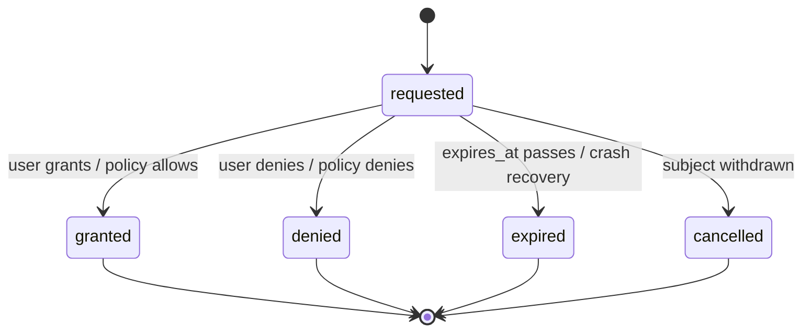

# 09 — Approval State Machine

This chapter defines the full state machine for the **Approval** entity, whose canonical
state names Volume 2 chapter 09 freezes (`requested`, `granted`, `denied`, `expired`,
`cancelled`) and whose machine Volume 9 owns. All twelve mandatory elements of Volume 0
chapter 02 are defined: initial state, terminal states, transitions, events, guards, side
effects, persistence, recovery, timeouts, cancellation, retries, and errors. The entity
shape and invariants (INV-APR-01..05) are Volume 2's; how Approvals arise inside permission
evaluation is chapter [05](05-permission-model.md); subjects (Tool Invocation, Plan,
Workflow Run gates, standing permission requests) have their own machines in Volumes 4
and 6, which block in their `awaiting_approval` states while an Approval here is
`requested`.

## Machine

**Prose.** The machine is deliberately flat: one non-terminal state (`requested`) and four
terminal outcomes. There is no "pause", no "re-decide", and no path between terminal states
— a changed mind is a *new* Approval (INV-APR-02). The four outcomes partition cleanly:
`granted` is the only positive outcome; `denied` records an explicit negative decision;
`expired` records the absence of a decision within the deadline; `cancelled` records that
the subject withdrew the question before anyone answered it. The constraint the diagram
encodes: every terminal transition writes the decider attribution required by INV-APR-03
(`user`, or `policy` plus `policy_ref`) — except `expired` and `cancelled`, which by
definition have no decider and record the resolving condition instead. Both `expired` and
`cancelled` resolve the subject as denied-class: the subject does not proceed (INV-APR-05).

## Transitions

| From | To | Trigger | Guard | Side effects | Event |
|---|---|---|---|---|---|
| — | requested | `PermissionPort.Request` needs interaction (chapter 05 step 6), or a policy-resolved Request records its decision, or a workflow gate / plan approval is raised (Volumes 4/6) | subject exists and is non-terminal (INV-APR-01); no other `requested` Approval for the same subject (single-outstanding rule) | row persisted with `requested_scope`, `expires_at` per [timeouts](#timeouts); subject enters its `awaiting_approval` state; prompt presented on the active interactive surface | `approval.requested` |
| requested | granted | user chooses an allow-class decision (`allow_once`, `allow_for_session`, `allow_for_workspace`, `always_allow_policy`); or policy pre-resolution allows | Approval undecided and unexpired at commit time (`revision` check); decider attribution complete | `decided_by_kind`/`decided_at` set; Permission grants minted per the chapter 05 decision table with `granted_permission_ids` back-references (INV-APR-04); subject unblocked; `approval.resolved` audit record | `approval.granted` |
| requested | denied | user chooses a deny-class decision (`deny_once`, `always_deny`, `ask_every_time` resolution of this request); or policy pre-resolution denies | same undecided-and-unexpired guard; attribution complete | decision fields set; deny grants minted where the decision persists one (chapter 05); structured denial delivered to the subject as data (E-SEC-001 at boundaries); audit record | `approval.denied` |
| requested | expired | `expires_at` reached without a decision; or crash recovery finds the Approval `requested` under a dead incarnation | `expires_at` non-null and in the past, or recovery context | subject resolved denied-class (INV-APR-05) with E-SEC-003 as its structured outcome; audit record notes expiry (recovery expiries note the incarnation) | `approval.expired` |
| requested | cancelled | the subject withdraws: its run/task/invocation is cancelled, its plan superseded, or its workflow run cancelled (Volumes 4/6 cancellation cascades); or `PermissionPort.Request`'s context is cancelled (Volume 3 rule) | subject reached a state where the question is moot | prompt dismissed from surfaces; subject's own cancellation proceeds independently; E-SEC-004 recorded as the request outcome; audit record | `approval.cancelled` |

Transition rules:

1. **Decision atomicity.** A terminal transition, its decision attribution, any minted
   Permission rows, and the `approval.resolved` audit record commit in one transactional
   batch (Volume 2 write discipline) *before* the subject observes the outcome. A user
   decision arriving concurrently with expiry resolves by `revision`: exactly one terminal
   transition wins; the loser is discarded without record edits (INV-APR-02).
2. **Single outstanding Approval per subject.** `Request` serializes per subject (Volume 3
   PermissionPort concurrency note): a second identical request while one is `requested`
   joins the pending Approval rather than raising a duplicate.
3. **Dismissal is not denial.** Dismissing a prompt (TUI escape, detach) leaves the
   Approval `requested` until decided, expired, or cancelled — chapter 05 decision
   constraints. Surfaces MUST make the pending state visible (Volume 8 permission prompt
   wireframes).

## Machine elements

- **Initial state:** `requested` (row creation is the entry transition).
- **Terminal states:** `granted`, `denied`, `expired`, `cancelled` — all four; the machine
  has exactly one non-terminal state.
- **Events:** `approval.requested`, `approval.granted`, `approval.denied`,
  `approval.expired`, `approval.cancelled` (envelope per Volume 10, keystone FR-OBS-001);
  every terminal transition additionally produces the `approval.resolved` audit action
  (chapter 08 catalog).
- **Guards:** subject existence and non-terminality (INV-APR-01); undecided-and-unexpired
  at commit (`revision` optimistic concurrency); single-outstanding-per-subject; decider
  attribution completeness (INV-APR-03).
- **Side effects:** grant minting with bidirectional references (INV-APR-04); subject
  unblocking (granted) or denied-class resolution (denied/expired/cancelled, INV-APR-05);
  audit records; prompt lifecycle on interactive surfaces.
- **Persistence:** `approvals` table — workspace database for workspace-context requests,
  global database for standing machine-level requests (Volume 2 persistence); every
  transition persists per the write discipline before presentation; retention follows audit
  retention (chapter 08), which outranks run pruning.
- **Recovery:** on startup recovery (Volume 3 procedure), every Approval `requested` under
  a dead incarnation transitions to `expired` with a recovery annotation — a crash never
  resurrects a consent prompt whose context is gone, and never auto-grants. Subjects were
  independently marked `interrupted` by their own recovery; their resumption re-requests
  permissions fresh (chapter 05 re-evaluation).
- **Timeouts:** `expires_at = requested_at + permissions.approval_timeout` (default
  `"10m"`); `"0s"` disables expiry for interactive contexts, in which case only decision or
  cancellation resolve the Approval. Workflow gate approvals may declare longer per-gate
  deadlines (Volume 4 definitions), which set `expires_at` explicitly; the shorter of
  gate-declared and configured non-zero timeouts applies. Expiry is evaluated lazily on
  read and by the pending-approvals sweep at session activation — no background timer is
  required for correctness, and the sweep guarantees expiry is recorded even for abandoned
  sessions.
- **Cancellation:** only via subject withdrawal or request-context cancellation (the
  `cancelled` transition); users do not "cancel" Approvals directly — they deny them.
- **Retries:** none at machine level. A denied or expired request is never re-decided; a
  new attempt by the subject raises a new Approval (INV-APR-02). Gated retries of the
  subject re-enter chapter 05 evaluation (Volume 4 retry rule: grants consumed by
  `allow_once` do not cover retries).
- **Errors:** E-SEC-003 (expiry outcome), E-SEC-004 (cancellation outcome), E-SEC-001
  (denial surfaced at boundaries), E-SEC-002 (evaluation failure — an Approval that cannot
  be raised resolves as deny, fail-closed per ADR-125), E-SEC-014 (audit append failure
  blocks the terminal transition; the Approval remains `requested` and the subject remains
  blocked until storage recovers or expiry passes).

## Requirements

### FR-SEC-113 — Approval lifecycle enforcement

- Type: Functional
- Status: Draft
- Priority: P0
- Phase: MVP
- Source: Design
- Owner: Permission Manager (Volume 9)
- Affected components: Permission Manager, Persistence Layer, TUI, CLI, Workflow Engine, Execution Engine, Tool Runtime
- Dependencies: FR-SEC-100, FR-SEC-104; Volume 2 Approval entity (INV-APR-01..05); ADR-125
- Related risks: Threat model chapters 01–02 (social engineering, prompt injection steering consent)

#### Description

Approvals follow exactly the machine of this chapter: one non-terminal state, four terminal
outcomes, decision atomicity with grant minting and audit in one batch, single outstanding
Approval per subject, lazy-plus-sweep expiry, crash recovery to `expired`, and no
re-decision ever. Interactive surfaces present the requested scope faithfully (what will be
persisted is what was displayed — chapter 05 decision constraints) and keep pending
Approvals visible until resolved.

#### Motivation

The Approval record is the product's unit of human consent (PRD-005): every autonomy
guarantee reduces to "there is exactly one, immutable, attributable record of who allowed
what". The machine's flatness is deliberate defense — no intermediate states means no
ambiguous consent.

#### Actors

Users (decisions); Permission Manager (machine owner); subjects' engines (blocking,
withdrawal); interactive surfaces (presentation).

#### Preconditions

Subject exists and is blocked awaiting consent; interactive surface available (or policy
resolution applies).

#### Main flow

1. Evaluation reaches `ask` on an interactive path; an Approval row persists as `requested`
   and the prompt renders with permission names, selector, and subject summary.
2. The user decides; the terminal transition commits atomically with grants and audit.
3. The subject unblocks (granted) or receives its structured denial (denied-class).

#### Alternative flows

- Policy pre-resolution: the Approval is created and resolved in one flow with
  `decided_by_kind: policy` and `policy_ref` — the record exists even though no prompt did
  (Volume 2 purpose statement).
- Expiry: lazy evaluation or the activation sweep transitions to `expired`; the subject's
  denied-class resolution carries E-SEC-003.
- Subject withdrawal: `cancelled` per the transition table.

#### Edge cases

- Decision racing expiry: `revision` guarantees one winner; the losing writer observes the
  terminal state and discards.
- Duplicate concurrent requests for one subject: joined to the single outstanding Approval;
  one decision resolves all waiters.
- TUI detach with pending Approval: remains `requested`; reattach re-renders it; expiry
  still applies.
- Crash between decision commit and subject unblock delivery: recovery reads the terminal
  Approval and delivers the recorded outcome — the decision is never re-asked (the record
  is the truth, PRD-010 pattern).
- Approval on the global database (standing machine-level request) while workspaces are
  closed: sweep at global-database open applies expiry.

#### Inputs

Evaluation outcomes needing consent; user decisions; policy resolutions; subject lifecycle
signals; timeout configuration.

#### Outputs

Approval rows through their machine; minted grants; audit records; `approval.*` events;
structured denials.

#### States

`requested` → `granted` | `denied` | `expired` | `cancelled` (frozen names; this chapter's
machine).

#### Errors

E-SEC-003, E-SEC-004 (outcome codes); E-SEC-001 (boundary surfacing); E-SEC-002, E-SEC-014
(failure classes with fail-closed behavior).

#### Constraints

Immutability after terminal (INV-APR-02); attribution completeness (INV-APR-03);
bidirectional grant references (INV-APR-04); denied-class resolution for expiry and
cancellation (INV-APR-05); prompt fidelity (displayed = persisted).

#### Security

Consent capture is the highest-value social-engineering target (threat model chapter 01);
prompt fidelity, single-outstanding serialization, and atomic decision-grant-audit commits
close the known manipulation seams (prompt confusion, double-prompt races, post-hoc grant
widening).

#### Observability

Five lifecycle events; `approval.resolved` audit action; pending-approval count visible in
TUI status (Volume 8); every Approval resolves to its subject, decider, and minted grants
(SM-13).

#### Performance

Prompt render latency is Volume 8's budget; decision commit is one transactional batch;
expiry sweep is O(pending) at activation.

#### Compatibility

Identical machine in TUI, CLI one-shot prompts, and headless policy resolution; platform
has no effect on semantics.

#### Acceptance criteria

- Given an `ask` evaluation on an interactive path, when the prompt renders, then a
  `requested` Approval row exists whose `requested_scope` equals the displayed content.
- Given a grant decision, when committed, then the Approval is `granted`, the minted grants
  reference it bidirectionally, the audit record exists, and the subject proceeded — all
  observable in one consistent read.
- Given `permissions.approval_timeout = "1s"` and no decision, when the timeout passes and
  the Approval is next read, then it is `expired` and the subject resolved denied-class
  with E-SEC-003.
- Given a crash with a pending Approval, when recovery runs, then the Approval is `expired`
  with the recovery annotation and nothing was auto-granted.
- Negative case: attempts to update a terminal Approval (any field) are rejected by the
  store discipline; a repeated subject attempt yields a new Approval ULID.
- Permission case: policy-resolved Approvals carry `decided_by_kind: policy` and a
  `policy_ref` that resolves to the deciding rule.
- Observability case: for any resolved Approval, the event, audit record, decision, and
  grants share correlation IDs.

#### Verification method

Machine property tests (transition matrix, guard violations, race injection between
decision and expiry); crash-injection at every persistence boundary (SM-11 method); prompt
fidelity golden tests (Volume 8 fixtures); audit-chain resolution (SM-13); Volume 13
permission suites.

#### Traceability

PRD-005, PRD-006, PRD-010; Volume 2 INV-APR-01..05 and frozen states; FR-SEC-100,
FR-SEC-104, FR-SEC-111; Volume 4 `awaiting_approval` semantics; Volume 6 Tool Invocation
machine; SM-13, SM-16.

## Error codes

### E-SEC-003 — Approval expired

- Category: Permission
- Severity: Warning (expected policy outcome)
- User message: "The approval request expired before a decision was made; the action did not proceed."
- Technical message: approval ULID, subject kind and ID, `requested_at`/`expires_at`, resolution context (lazy read, sweep, recovery)
- Cause: no decision within `expires_at` (configured timeout, gate deadline, or crash recovery)
- Safe-to-log data: approval and subject IDs, timestamps, resolution context
- Recoverability: recoverable — re-attempt the action to raise a fresh Approval
- Retry policy: none automatic (consent is never retried automatically)
- Recommended action: re-run the action and decide the prompt; raise `permissions.approval_timeout` if expiries are routine
- Exit-code mapping: 5
- HTTP mapping: not applicable
- Telemetry event: `approval.expired`
- Security implications: expiry-as-denial is the safe default (INV-APR-05); unattended prompts never convert to grants

### E-SEC-004 — Approval cancelled

- Category: Permission
- Severity: Info (bookkeeping outcome)
- User message: "The approval request was withdrawn because the requesting action was cancelled."
- Technical message: approval ULID, subject kind and ID, withdrawal source (subject cancellation, plan superseded, context cancellation)
- Cause: the subject withdrew before a decision (cancellation cascades per Volumes 4/6, or request-context cancellation)
- Safe-to-log data: approval and subject IDs, withdrawal source
- Recoverability: not applicable — the question became moot
- Retry policy: none
- Recommended action: none; a future attempt raises a new Approval
- Exit-code mapping: 8 (cancellation class) when it terminates a command; otherwise not surfaced as a failure
- HTTP mapping: not applicable
- Telemetry event: `approval.cancelled`
- Security implications: withdrawal is recorded evidence (denial-class for the subject); no grant is minted
