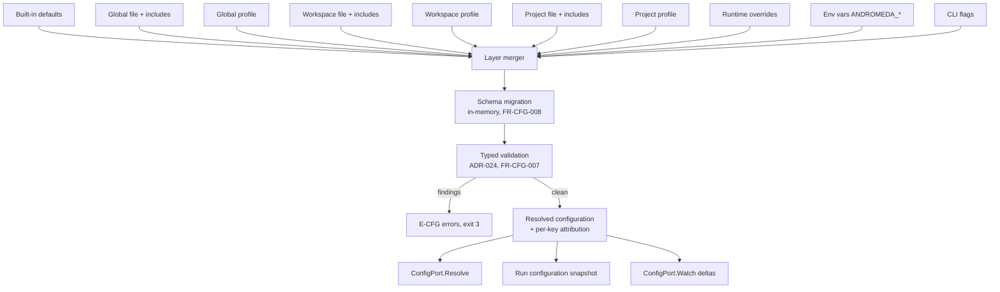

# 01 — Configuration Model

This chapter is the single authoritative home of Andromeda's configuration schema,
precedence, validation, versioning, and migration rules (Volume 0, chapter 03, single-home
matrix). It defines the `andromeda.toml` document family, the layer model and its exact
precedence, Configuration Profiles as layers, the environment-variable mapping algorithm,
CLI and runtime overrides, includes, defaults, validation per ADR-024, configuration schema
versioning and forward-only migration per the ADR-029 regime, and the deprecation lifecycle.
It also operationalizes the storage rules this volume owns: database backups, migration
execution, retention windows, and workspace-database locking (ADR-028, ADR-029).

Boundaries, stated once:

- The **key content** of each TOML table belongs to its area owner per the ownership table
  in Volume 0, chapter 03. This chapter never redefines a foreign table's keys; where the
  complete example below shows keys of a table whose owning volume publishes its own
  catalog, that catalog is normative and the example is illustrative for those tables.
- The Configuration Manager implements `ConfigPort` (Volume 3, chapter 02) with exactly the
  frozen methods `Resolve`, `Validate`, and `Watch`. Errors are the E-CFG family (chapter
  [02](02-config-errors-and-redaction.md)), mapped to exit code 3 at the CLI boundary —
  except the storage-integrity subset, which maps to exit code 9 per ADR-016 and ADR-029.
- Configuration files are never credential carriers (INV-CFGP-02; ADR-014). Secrets appear
  in configuration only as Secret Store references or environment indirection; enforcement
  and redaction are chapter [02](02-config-errors-and-redaction.md)'s.
- Parsing is strict per ADR-008 (`pelletier/go-toml/v2`, position-aware diagnostics);
  validation is the typed schema layer of ADR-024, never JSON Schema.

## Configuration sources and layers

Andromeda resolves effective configuration from ten layers. Each layer is a complete or
partial document against one schema; no layer has a private vocabulary.

| # | Layer | Source | Scope | Persisted form |
|---|---|---|---|---|
| 1 | CLI flags | Invocation argv (flag↔key aliases owned by Volume 8, FR-CLI-001) | invocation | none |
| 2 | Environment | `ANDROMEDA_*` variables mapped per FR-CFG-004 | invocation | none |
| 3 | Runtime overrides | TUI settings actions and IPC requests (ADR-032) | session | none (in-memory) |
| 4 | Project profile | Selected project-scoped Configuration Profile | project | workspace database |
| 5 | Project file | `<project_root>/andromeda.toml` | project | file |
| 6 | Workspace profile | Selected workspace-scoped Configuration Profile | workspace | workspace database |
| 7 | Workspace file | `<workspace_root>/.andromeda/andromeda.toml` | workspace | file |
| 8 | Global profile | Selected global-scoped Configuration Profile | machine/user | global database |
| 9 | Global file | `<config_dir>/andromeda/andromeda.toml` (ADR-022) | machine/user | file |
| 10 | Built-in defaults | Compiled into the binary | product | binary |

File locations follow ADR-022 exactly; no component outside the PAL computes them:

| File | macOS default | Linux default | Fallback layout |
|---|---|---|---|
| Global file | `~/Library/Application Support/andromeda/andromeda.toml` (honoring explicit `XDG_CONFIG_HOME`) | `~/.config/andromeda/andromeda.toml` | `~/.andromeda/andromeda.toml` |
| Workspace file | `<workspace_root>/.andromeda/andromeda.toml` | same | same |
| Project file | `<project_root>/andromeda.toml` | same | same |

`ANDROMEDA_CONFIG` (a reserved control variable, Volume 8) replaces the **global file**
path for the invocation; it does not affect workspace or project files. When the active
Project's root equals the workspace root (single-project workspace, `root_path = "."`),
layers 4 and 5 are absent — the workspace layers serve both.

### Value types

The schema types every key. TOML syntax is per ADR-008 (TOML v1.1.0, restricted to the
constructs verified identical under the documented fallback parser).

| Schema type | TOML representation | Rules |
|---|---|---|
| `string` | string | UTF-8 |
| `path` | string | Resolved against the declaring file's directory when relative; `~` expands via PAL |
| `enum` | string | Closed per-key vocabulary; case-sensitive |
| `duration` | string | One or more `<integer><unit>` components, units `ms`, `s`, `m`, `h`, in strictly descending unit order (e.g. `"1h30m"`, `"500ms"`); canonical zero is `"0s"` |
| `integer` | integer | 64-bit signed; byte sizes and micro-currency amounts are plain integers |
| `float` | float | Finite only |
| `boolean` | boolean | `true`/`false` literals only |
| `array` | array | Homogeneous element type per key |
| `table` | table | Fixed keys, or dynamic-name tables where the schema declares a name pattern (e.g. `providers.<slug>`) |

Dynamic table names MUST match `[a-z0-9][a-z0-9_-]{0,63}` unless the owning volume's
catalog declares a different pattern for that table.

### Reserved root keys

Three root-level keys are reserved by the schema itself and are the only keys this chapter
mints outside `[storage]`:

| Key | Type | Default | Meaning |
|---|---|---|---|
| `config_version` | integer | current schema version | Configuration schema version of this document (FR-CFG-008) |
| `include` | array of paths | `[]` | Ordered includes merged beneath this document (FR-CFG-006) |
| `default_profile` | string | `""` | Name of the Configuration Profile selected at this file's scope; `""` selects none (FR-CFG-003) |

### FR-CFG-001 — Configuration precedence

- Type: Functional
- Status: Approved
- Priority: P0
- Phase: MVP
- Source: Provided
- Owner: Configuration Manager (Volume 10)
- Affected components: Configuration Manager, all components (via `ConfigPort` injection), CLI, TUI, Workspace Engine
- Dependencies: ADR-008, ADR-022, ADR-130; FR-CFG-002, FR-CFG-003, FR-CFG-004, FR-CFG-005
- Related risks: RISK-CFG-002

#### Description

Effective configuration MUST be resolved by merging the ten layers of this chapter in
exactly this precedence order, highest first:

1. CLI flag
2. Environment variable (`ANDROMEDA_*`, mapped per FR-CFG-004)
3. Runtime override (session-scoped, in-memory)
4. Project profile (selected project-scoped Configuration Profile)
5. Project file (`<project_root>/andromeda.toml`)
6. Workspace profile (selected workspace-scoped Configuration Profile)
7. Workspace file (`<workspace_root>/.andromeda/andromeda.toml`)
8. Global profile (selected global-scoped Configuration Profile)
9. Global file (`<config_dir>/andromeda/andromeda.toml`)
10. Built-in defaults

Merge granularity is the **key**: for every leaf key, the highest layer that sets it wins.
Tables merge key-wise across layers; arrays and array-of-tables values replace **wholesale**
(a higher layer setting `providers.routing.preference` or any `[[providers.fallback.chains]]`
list replaces the entire lower-layer value — elements are never appended across layers).
Absent layers (no workspace open, no profile selected, file missing) are skipped without
error. Every resolved value MUST carry source attribution: the winning layer, its concrete
source (file path and line, profile name, environment variable name, or flag name), and the
losing layers that also set the key. `ConfigPort.Resolve` returns attribution with every
resolution, and the run configuration snapshot persists it (NFR-CFG-002).

A profile overrides the file of its own scope and is overridden by every layer of a nearer
scope (ADR-130 records the decision and the alternatives).

#### Motivation

One documented, exact order is the difference between configuration as a contract and
configuration as folklore. Every volume that mints keys defers to this order by reference;
CI, wrappers, and users need to predict the effective value without experimentation.

#### Actors

Users editing files; CI systems setting environment; the TUI and IPC clients issuing
runtime overrides; every component consuming resolved configuration.

#### Preconditions

Schema loaded (compiled in); layers discovered per FR-CFG-002.

#### Main flow

1. The Configuration Manager loads layers 10 through 4 (defaults, files, profiles),
   applying includes (FR-CFG-006) and migrations (FR-CFG-008) per document.
2. It overlays runtime overrides, mapped environment variables, and flag values.
3. It validates the merged document (FR-CFG-007) and freezes the resolved configuration
   with per-key attribution.
4. `config.resolution.completed` is emitted with the layer digest (paths, profile names,
   counts — never values).

#### Alternative flows

- No workspace open (global CLI commands): layers 4–7 are absent; resolution proceeds with
  the remaining layers.
- A named profile cannot be resolved: E-CFG-008; resolution aborts (fail closed — a user
  who selected a profile must not silently run without it).

#### Edge cases

- The same key set at every layer: the CLI flag wins; attribution lists all ten sources.
- A key set only in a lower layer of the same scope chain (e.g. global file) with a profile
  selected that does not set it: the file value survives — profiles override only what they
  set.
- Conflicting types across layers (string in file, integer in env): the merged document is
  validated after merge; the winning value MUST satisfy the key's schema type or E-CFG-004
  names the winning source.
- Two Andromeda processes with different environments on one workspace: each process
  resolves independently; persisted layers are shared, invocation layers are per-process.

#### Inputs

Layer documents; selected profile names; environment; argv.

#### Outputs

Resolved configuration with per-key source attribution; `config.resolution.completed`.

#### States

None (resolution is a computation; no entity machine).

#### Errors

E-CFG-001 through E-CFG-010 as minted in chapter 02; all map to exit code 3.

#### Constraints

Resolution MUST NOT touch the network (Principle 3); resolution MUST be deterministic —
identical layer inputs produce byte-identical resolved documents (NFR-CFG-002).

#### Security

Layer files are user-supplied input on a trust boundary (ADR-008); untrusted-workspace
policy (Volume 9 trust vocabulary) MAY exclude workspace/project layers for security-owned
tables — the exclusion rule content is Volume 9's, its enforcement point is the resolver.
Secret-shaped values fail resolution per FR-CFG-011.

#### Observability

`config.file.loaded` per file; `config.resolution.completed` per resolution;
`config.profile.selected` per selected profile; attribution rendered by the `config`
command surfaces (grammar: Volume 8).

#### Performance

Bounded by NFR-CFG-001 (resolution latency inside the SM-06 cold-start budget).

#### Compatibility

The order is a public contract under SM-20: changing it is a breaking change permitted only
in a major release with an ADR superseding ADR-130.

#### Acceptance criteria

- Given a key set in the global file and the workspace file, when resolved inside the
  workspace, then the workspace value wins and attribution names both sources.
- Given a key set in the workspace file and a selected workspace profile, when resolved,
  then the profile value wins (profile above its scope's file).
- Given a key set in a global profile and the workspace file, when resolved, then the
  workspace file wins (nearer scope above farther profile).
- Given `ANDROMEDA_CLI_COLOR=never` and `--color=always`, when resolved, then the flag wins.
- Given an array key set at two layers, when resolved, then the higher layer's array is the
  entire effective value.
- Negative case: given a selected profile name that resolves at no scope, when resolution
  runs, then E-CFG-008 terminates it with exit code 3 and no partial configuration is
  served.
- Permission case: given a runtime override attempt on a protected table (FR-CFG-005), when
  applied, then it is rejected with E-CFG-014 and `config.override.rejected` is emitted.
- Observability case: given any successful resolution, when inspected, then
  `config.resolution.completed` exists and the run snapshot contains per-key attribution.

#### Verification method

Configuration-resolution unit tests enumerating the full layer matrix (each pair of layers
in both orders); property tests asserting determinism (identical inputs → identical
snapshot hash); integration tests over real files, profiles, environment, and flags; the
Volume 13 offline suite asserting zero network access during resolution.

#### Traceability

PRD-003, PRD-009, PRD-010; ADR-008, ADR-022, ADR-130; SM-12; Volume 0 chapter 03
(config-table ownership); FR-CLI-001 (flag grammar).

## Resolution pipeline



The diagram shows the resolution pipeline. Ten layer documents (defaults through CLI flags)
feed the layer merger, which applies FR-CFG-001 precedence at key granularity. Documents
declaring an older `config_version` pass through in-memory schema migration before merging
completes; the merged document then passes the typed validation layer, which either reports
the complete finding set as E-CFG errors (exit code 3) or freezes the resolved
configuration with per-key source attribution. Three consumers read the frozen result: the
`ConfigPort.Resolve` method, the run configuration snapshot persisted for reproducibility,
and the `ConfigPort.Watch` change stream, which emits deltas when persisted layers change.
Constraints: merging is deterministic and offline; validation always follows migration so
diagnostics speak the current schema; nothing downstream observes an unvalidated document.

## Complete `andromeda.toml` example

The following single document exercises **every** TOML table of the Volume 0 chapter 03
ownership map. It is one file for exposition; in practice these tables are spread across
global, workspace, and project layers. Values shown are built-in defaults except where a
comment says `example`. For tables owned by other volumes, the owning volume's key catalog
is normative; entries below marked `illustrative` preview tables whose catalogs are
published by their owners' chapters and are reconciled at consolidation.

```toml
# ============================================================================
# andromeda.toml — complete annotated example (schema version 1)
# Schema, precedence, validation: Volume 10. Key content: per-table owner.
# ============================================================================

# ---- Reserved root keys (this chapter) -------------------------------------
config_version  = 1
include         = []            # e.g. ["providers.toml", "team-policy.toml"]
default_profile = ""            # profile selected at this file's scope

# ---- [agent] — content owner: Volume 4 -------------------------------------
[agent]
default_profile = "default"

[agent.session]
idle_suspend_after = "0s"       # 0s disables idle auto-suspend

[agent.loop]
max_iterations      = 50
turn_timeout        = "5m"
max_repair_attempts = 2
max_subagent_depth  = 2
delegation_enabled  = false

[agent.planner]
approval_mode      = "policy"   # always | policy | never
max_attempts       = 3
attempt_timeout    = "2m"
max_tasks_per_plan = 30
max_revisions      = 10

[agent.execution]
max_parallel_tasks = 1
task_timeout       = "30m"

[agent.execution.retry]
max_attempts = 3
base_delay   = "1s"
max_delay    = "60s"
multiplier   = 2.0

[agent.prompts]
allow_workspace_overrides = false
override_dirs             = []
max_render_bytes          = 262144

# ---- [workflows] — content owner: Volume 4 ----------------------------------
[workflows]
paths                = []
default_step_timeout = "30m"
default_gate_expiry  = "24h"
default_max_attempts = 1
max_parallel_steps   = 4
max_run_duration     = "168h"
artifacts_dir        = ".andromeda/artifacts"

[workflows.sdd]
gate_profile = "standard"       # strict | standard | minimal

# ---- [providers] — content owner: Volume 5 ----------------------------------
[providers]
default             = "anthropic"   # example; no built-in default provider
discovery_ttl_hours = 24

[providers.anthropic]               # example provider entry
adapter       = "anthropic"
enabled       = true
default_model = "claude-sonnet-4-5" # example
auth_profile  = "work"              # example; binds [auth.profiles.work]

[providers.anthropic.timeouts]
connect_ms      = 10000
request_ms      = 120000
first_token_ms  = 60000
stream_idle_ms  = 60000
stream_total_ms = 600000
discovery_ms    = 30000
embed_ms        = 60000

[providers.anthropic.retry]
max_attempts       = 3
base_delay_ms      = 500
backoff_multiplier = 2.0
max_delay_ms       = 10000
retry_after_cap_ms = 60000

[providers.anthropic.limits]
max_concurrent_requests = 4

[providers.anthropic.breaker]
enabled           = true
failure_threshold = 5
failure_ratio     = 0.5
min_samples       = 10
window_s          = 60
open_base_s       = 30
open_max_s        = 600

[providers.local]                   # example local provider entry
adapter       = "ollama"
enabled       = true
base_url      = "http://127.0.0.1:11434"
default_model = "qwen3:14b"         # example

[providers.routing]
strategy   = "explicit"             # explicit | preference_list
preference = ["anthropic", "local"] # example

[[providers.fallback.chains]]       # example chain
name                 = "cloud-to-local"
from                 = "anthropic"
targets              = ["local"]
triggers             = ["unreachable", "rate_limited", "timeout"]
allow_local_to_cloud = false
max_price_multiplier = 1.0
require_approval     = false

# ---- [auth] — content owner: Volume 5 ---------------------------------------
[auth]
default_profile           = ""      # example: "work"
refresh_lead_time_seconds = 300
flow_timeout_seconds      = 300

[auth.proxy]
url        = ""
no_proxy   = ""
credential = ""                     # credential label — never secret material
ca_bundle  = ""

[auth.profiles.work]                # example profile
provider   = "anthropic"
credential = "anthropic-work"       # Secret Store label — never the key itself

# ---- [tools] — content owner: Volume 6 --------------------------------------
[tools]
default_timeout_ms         = 60000
max_timeout_ms             = 600000
max_output_bytes           = 1048576
max_concurrent_invocations = 8
teardown_grace_ms          = 2000
teardown_kill_ms           = 3000
max_auto_retries           = 2
disabled                   = []
allowed_origins            = ["builtin", "plugin", "mcp"]

# ---- [plugins] — content owner: Volume 6 ------------------------------------
[plugins]
enabled                    = true
handshake_timeout_ms       = 10000
request_timeout_ms         = 60000
stop_timeout_ms            = 5000
health_interval_ms         = 30000
restart_max_attempts       = 5
restart_backoff_initial_ms = 500
sources                    = []

# ---- [mcp] — content owner: Volume 6 ----------------------------------------
[mcp]
connect_timeout_ms           = 10000
initialize_timeout_ms        = 10000
request_timeout_ms           = 60000
reconnect_max_attempts       = 5
reconnect_backoff_initial_ms = 1000
log_capture                  = true

[mcp.servers.docs]                  # example server registration
transport = "stdio"
command   = "docs-mcp-server"
args      = ["--workspace-mode"]
enabled   = true

# ---- [skills] — content owner: Volume 6 -------------------------------------
[skills]
enabled           = true
paths             = []
autoload          = true
sources           = []
activation_policy = "prompt"        # prompt | allow | deny

# ---- [memory] — content owner: Volume 7 -------------------------------------
[memory]
enabled           = true
max_content_bytes = 16384

[memory.ingestion]
mode = "assisted"                   # explicit | assisted | off

[memory.retention]
session_days                 = 90
workspace_days               = 365
long_term_days               = 0
archive_before_expire        = true
archive_grace_days           = 30
purge_after_days             = 30
importance_protect_threshold = 8

[memory.ranking]
weight_relevance  = 0.4
weight_recency    = 0.3
weight_importance = 0.15
weight_trust      = 0.15

[memory.consolidation]
enabled              = false
max_records_per_pass = 200
max_tokens_per_pass  = 50000

# ---- [context] — content owner: Volume 7 ------------------------------------
[context.budget]
reserve_output_tokens = 2048
safety_margin_ratio   = 0.05

[context.history]
max_turns        = 50
max_tokens_ratio = 0.5

[context.tool_results]
max_tokens_per_result = 4000

[context.files]
max_file_bytes = 262144
excerpt_tokens = 800

[context.compaction]
min_tokens = 64

[context.pinning]
max_ratio = 0.5

[context.summarization]
use_memory_summaries = false

# ---- [index] — content owner: Volume 7 --------------------------------------
[index]
enabled           = true
include           = []
exclude           = []
max_file_bytes    = 1048576
max_chunks        = 100000
on_scale_exceeded = "degrade"       # degrade | refuse

[index.chunk]
target_tokens  = 400
max_tokens     = 512
overlap_tokens = 40

[index.semantic]
provider   = ""                     # empty = semantic indexing off
model      = ""
batch_size = 64

[index.watch]
enabled     = true
debounce_ms = 500

[index.stale]
max_pending_changes = 500
max_age_seconds     = 3600

[index.timeouts]
build_seconds  = 1800
update_seconds = 300

# ---- [cli] — content owner: Volume 8 ----------------------------------------
[cli]
color           = "auto"            # auto | always | never
pager           = "auto"
pager_command   = ""
editor          = ""
update_notice   = true
default_timeout = "0s"

# ---- [tui] — content owner: Volume 8 (illustrative until chapter 07/08 land) -
[tui]
mouse = true                        # illustrative

[tui.theme]
mode = "dark"                       # illustrative; token mapping per ADR-026

# ---- [permissions] — content owner: Volume 9 (illustrative) ------------------
[permissions]
default_decision = "ask_every_time" # illustrative; frozen decision vocabulary

# ---- [sandbox] — content owner: Volume 9 (illustrative) ----------------------
[sandbox]
level = "process"                   # illustrative; layered model per ADR-021

# ---- [security] — content owner: Volume 9 (illustrative) ---------------------
[security]
workspace_trust_default = "untrusted"  # illustrative

# ---- [logging] — content owner: Volume 10, chapter 03 ------------------------
[logging]
level          = "info"             # debug | info | warn | error
stderr_level   = "warn"
include_source = false

[logging.file]
enabled     = true
max_size_mb = 32
max_files   = 10
max_age_days = 30

# ---- [telemetry] — content owner: Volume 10, chapter 06 ----------------------
[telemetry]
enabled           = false           # remote export also requires recorded consent
endpoint          = ""
protocol          = "http/protobuf" # http/protobuf | grpc
auth_secret_ref   = ""
export_interval   = "60s"
queue_max_size_mb = 64
locked            = false

# ---- [storage] — content owner: this chapter (FR-CFG-009) --------------------
[storage]
lock_wait_ms = 5000

[storage.backups]
dir          = ""                   # "" = default per ADR-022 locations
retain_count = 3

[storage.retention]
sessions_days  = 0                  # 0 = keep forever
runs_days      = 0
artifacts_days = 0

# ---- [git] — content owner: Volume 11 (illustrative) -------------------------
[git]
executable = ""                     # illustrative; "" = discover per ADR-025

# ---- [github] — content owner: Volume 11 (illustrative) ----------------------
[github]
api_base_url = "https://api.github.com"  # illustrative

# ---- [update] — content owner: Volume 14 (illustrative) ----------------------
[update]
channel              = "stable"     # illustrative
check_interval_hours = 24           # illustrative
```

### FR-CFG-002 — Configuration documents, locations, and loading

- Type: Functional
- Status: Approved
- Priority: P0
- Phase: MVP
- Source: Provided
- Owner: Configuration Manager (Volume 10)
- Affected components: Configuration Manager, PAL, Workspace Engine, CLI
- Dependencies: ADR-008, ADR-022; FR-CFG-001
- Related risks: RISK-CFG-002

#### Description

The Configuration Manager MUST load exactly the documents of the layer table: the global
file at the ADR-022 config location (or the `ANDROMEDA_CONFIG` path when set), the
workspace file inside `.andromeda/`, and the project file at a declared Project root (only
when that root differs from the workspace root). Loading rules: files MUST be UTF-8 TOML
parsed in strict mode per ADR-008; a missing file is an absent layer, never an error; an
unreadable file (permission, I/O) is E-CFG-001; a file larger than 1,048,576 bytes is
refused with E-CFG-001 (oversize class). No other file path is consulted: stray
`andromeda.toml` files outside declared locations are ignored. Workspace and project
discovery is `WorkspacePort.Discover`'s (Volume 4 behavior); the Configuration Manager only
consumes the discovered roots.

#### Motivation

A fixed, short list of load locations is what makes "where is this value coming from?"
answerable; ad-hoc file discovery is how configuration systems become unauditable.

#### Actors

Configuration Manager; PAL (path resolution); users placing files.

#### Preconditions

PAL directory resolution available (ADR-022 fallback applies otherwise).

#### Main flow

1. Resolve locations via PAL; apply `ANDROMEDA_CONFIG` for the global file when set.
2. Read and strict-parse each present file; record file path, size, and mtime.
3. Emit `config.file.loaded` per file (path, layer, `config_version`, key count — no
   values).

#### Alternative flows

- `ANDROMEDA_CONFIG` points to a missing file: E-CFG-001 — an explicit path is a stated
  intent; silently falling back would mask misconfiguration.
- XDG resolution fails: the ADR-022 fallback layout applies and the fallback diagnostic is
  emitted.

#### Edge cases

- Symlinked configuration files: resolved through PAL; the attribution records the symlink
  path as written and the resolved target.
- A workspace file present while the directory is not an initialized workspace: not loaded
  (layers 6–7 exist only for an opened workspace).
- Concurrent edit during load: the parse operates on one read snapshot of the file; a
  change during resolution surfaces later via `ConfigPort.Watch`.

#### Inputs

Filesystem paths per ADR-022; `ANDROMEDA_CONFIG`; discovered workspace/project roots.

#### Outputs

Parsed layer documents with position metadata; `config.file.loaded` events.

#### States

None.

#### Errors

E-CFG-001 (unreadable/oversize), E-CFG-002 (parse), both exit code 3.

#### Constraints

No network access; no path computation outside the PAL; parse strictness MUST NOT be
loosened to tolerate malformed input (ADR-008).

#### Security

Configuration files are untrusted input: the parser is the strict ADR-008 one; oversize
refusal bounds memory; loading never executes content; file permissions are not modified.

#### Observability

`config.file.loaded` per document; the diagnostics surface lists every consulted path and
whether it existed (supports the ADR-022 mixed-layout risk mitigation).

#### Performance

Within the NFR-CFG-001 budget; at most 4 files plus includes are read per resolution.

#### Compatibility

Path behavior is identical across Tier 1 platforms modulo the ADR-022 location table;
the Windows-phase mapping is a PAL concern (Volume 3).

#### Acceptance criteria

- Given no configuration files at all, when Andromeda starts, then resolution succeeds
  with built-in defaults and no error.
- Given a global file with a TOML syntax error, when loading, then E-CFG-002 reports file,
  line, and column, and the process exits 3.
- Given `ANDROMEDA_CONFIG=/tmp/custom.toml` with a valid file, when resolved, then the
  global layer is that file and attribution says so.
- Negative case: given `ANDROMEDA_CONFIG` pointing to a missing path, when loading, then
  E-CFG-001 terminates with exit code 3.
- Negative case: given a 2 MiB workspace file, when loading, then E-CFG-001 (oversize)
  names the limit.
- Observability case: given three present files, when loaded, then three
  `config.file.loaded` events exist with correct layer tags.

#### Verification method

Unit tests over the location matrix per platform (golden paths per ADR-022); fault
injection for unreadable/oversize/malformed files; integration test that a stray
`andromeda.toml` in an arbitrary directory is never consulted.

#### Traceability

PRD-003, PRD-011; ADR-008, ADR-022; FR-CFG-001.

### FR-CFG-003 — Configuration Profiles as scope-bound layers

- Type: Functional
- Status: Approved
- Priority: P1
- Phase: MVP
- Source: Provided
- Owner: Configuration Manager (Volume 10)
- Affected components: Configuration Manager, Persistence Layer, CLI, TUI
- Dependencies: FR-CFG-001; Volume 2 chapter 02 (Configuration Profile entity, INV-CFGP-01..04); ADR-130
- Related risks: RISK-CFG-002

#### Description

A Configuration Profile (Volume 2 entity) is a named, persisted value set that participates
in resolution as the profile layer of its `scope` (global, workspace, or project — layers
8, 6, and 4). Profile `values` MUST validate against the same schema as files (INV-CFGP-01)
and MUST NOT contain reserved root keys (`config_version`, `include`, `default_profile`) —
a profile is a layer, not a document with sub-layers (INV-CFGP-04: no profile-to-profile
inheritance). Selection per scope resolves in this order: (1) the invocation selector
(`--profile` flag, else `ANDROMEDA_PROFILE`) when its name resolves at that scope — the
selector binds to the **nearest** scope where the name exists (project, then workspace,
then global) and replaces only that scope's selection; (2) the scope file's
`default_profile` key; (3) the scope entity's persisted default (`default_profile_id` on
Workspace or Project). An unresolvable selected name is E-CFG-008. At most one profile is
active per scope per resolution, and every selection emits `config.profile.selected`.

#### Motivation

Named, switchable value sets ("review", "offline", "demo") are the mechanism the brief
mandates for per-situation configuration without file editing; binding them to scopes keeps
precedence predictable.

#### Actors

Users selecting profiles; CLI/TUI profile management surfaces; Configuration Manager.

#### Preconditions

Profiles persisted per Volume 2 (workspace/project scopes in the workspace database,
global in the global database).

#### Main flow

1. Resolution determines each scope's selected profile per the selection order.
2. Each selected profile's `values` document is validated and merged at its layer.
3. Selections are recorded in attribution and the run snapshot.

#### Alternative flows

- `--profile review` where `review` exists at both workspace and global scope: the
  workspace one is used (nearest scope); attribution names the shadowed candidate.
- No profile anywhere: layers 4, 6, 8 are absent.

#### Edge cases

- Profile deleted between selection and resolution: E-CFG-008 (fail closed).
- A profile setting keys of a foreign scope's table (e.g. a project profile setting
  `[update]` keys): legal — scope binds *where the layer sits in precedence*, not which
  tables it may set; policy restrictions on specific tables are Volume 9's.
- `default_profile = ""` in a file: explicitly selects none at that scope, overriding the
  entity default (empty string is the documented "none" value).

#### Inputs

Profile rows; selectors (flag, `ANDROMEDA_PROFILE`, file keys, entity defaults).

#### Outputs

Active profile per scope; merged layers; `config.profile.selected` events.

#### States

Profiles are stateless entities (Volume 2); no machine.

#### Errors

E-CFG-008 (resolution failure: unknown name, deleted profile, scope mismatch); E-CFG-003
through E-CFG-006 for invalid profile `values`.

#### Constraints

Profile names follow the dynamic-name pattern of this chapter; a profile MUST NOT be
combined with another profile except through the precedence chain (INV-CFGP-04).

#### Security

Profile `values` MUST NOT contain secret material (INV-CFGP-02; enforcement FR-CFG-011);
profile selection is recorded in the run snapshot for audit.

#### Observability

`config.profile.selected` (profile name, scope, selector source); attribution names the
profile for every key it decided.

#### Performance

Profile load is two indexed database reads per resolution at most; within NFR-CFG-001.

#### Compatibility

Profiles serialize as canonical JSON and render as TOML per Volume 2 chapter 10; the
selection order is part of the FR-CFG-001 public contract.

#### Acceptance criteria

- Given a workspace profile `review` setting `agent.planner.approval_mode = "always"`,
  when selected via `--profile review`, then the resolved value is `always` and
  attribution names profile `review` at workspace scope.
- Given `default_profile = "demo"` in the global file and no other selector, when
  resolved, then the global profile `demo` is active.
- Given profiles named `x` at global and workspace scope and `--profile x`, when resolved,
  then the workspace profile is active and the global selection is unaffected.
- Negative case: given `--profile missing`, when resolved, then E-CFG-008 exits 3 naming
  the name and the scopes searched.
- Error case: given a profile whose `values` contain an unknown key, when merged, then
  E-CFG-003 names the profile as the source.
- Observability case: every active profile produces `config.profile.selected`.

#### Verification method

Unit tests over the selection matrix (selector × scope × existence); integration tests
against persisted profiles in both databases; golden attribution fixtures.

#### Traceability

Volume 2 chapter 02 (entity, invariants); ADR-130; FR-CFG-001; SM-12.

### FR-CFG-004 — Environment variable mapping algorithm

- Type: Functional
- Status: Approved
- Priority: P0
- Phase: MVP
- Source: Provided
- Owner: Configuration Manager (Volume 10)
- Affected components: Configuration Manager, CLI
- Dependencies: FR-CFG-001; ADR-131; Volume 0 chapter 03 (namespace conventions)
- Related risks: RISK-CFG-002

#### Description

Environment layer construction MUST follow this algorithm exactly:

1. **Collect** every variable whose name starts with `ANDROMEDA_`, excluding the reserved
   control set, which never maps to configuration keys: `ANDROMEDA_CONFIG`,
   `ANDROMEDA_WORKSPACE`, `ANDROMEDA_PROFILE`, `ANDROMEDA_NO_INPUT`, `ANDROMEDA_NO_COLOR`
   (execution controls, Volume 8). The reserved set is part of this schema; extending it
   requires a change to this chapter.
2. **Name** := the variable name with the prefix removed, lowercased.
3. **Explicit form**: if the name contains `__`, split on `__`; each segment is one path
   element, with single `_` inside a segment literal. The resulting dotted path MUST exist
   in the schema (dynamic-name tables match by declared pattern); otherwise E-CFG-009
   (unknown key class).
4. **Compact form**: otherwise, compute the candidate set of schema key paths whose dotted
   path, with `.` replaced by `_`, equals the name. Candidate matching against
   dynamic-name tables considers only entry names **declared by lower layers** at
   resolution time. Exactly one candidate → that key. Zero → E-CFG-009 (unknown). More
   than one → E-CFG-009 (ambiguous), and the error message MUST list every candidate and
   its explicit `__` form.
5. **Value parsing** by the key's schema type: `string`/`path`/`enum`/`duration` take the
   raw value; `integer`/`float`/`boolean` parse as the corresponding TOML literal;
   `array` parses as a TOML array literal (e.g. `["a", "b"]`). Table-typed keys are not
   settable from the environment (E-CFG-009, unsupported-type class). A value that fails
   its type parse is E-CFG-004 with the variable name as source.

The canonical key→variable direction (for documentation and generated reference) is:
uppercase the dotted path with `.` → `_`; when that name is ambiguous under rule 4, the
documented form uses `__` separators. Example: `tui.theme.mode` ↔ `ANDROMEDA_TUI_THEME_MODE`.

#### Motivation

Volume 0 fixes the convention and Volume 8 defers the algorithm here; CI systems and
wrappers need a mapping that is total, deterministic, and diagnosable — silent
mis-addressing of keys through environment variables is a classic misconfiguration trap.

#### Actors

CI systems, shells, wrappers; Configuration Manager.

#### Preconditions

Schema key set available; file layers loaded (for dynamic-name candidate matching).

#### Main flow

1. Collect, map, and parse per the algorithm.
2. Merge mapped pairs as layer 2 with attribution naming each variable.

#### Alternative flows

- Empty-string value: treated per type — empty string for `string`/`path`, a parse error
  for other types (E-CFG-004); the reserved control variables have their own emptiness
  rules (Volume 8).

#### Edge cases

- A variable addressing a dynamic table entry that no lower layer declares (e.g.
  `ANDROMEDA_PROVIDERS_ACME_ENABLED` with no `[providers.acme]`): E-CFG-009 (unknown) —
  the environment overrides existing entries; it does not create them. The explicit `__`
  form is equally rejected for undeclared entries.
- Two variables mapping to the same key (`ANDROMEDA_CLI_COLOR` and
  `ANDROMEDA_CLI__COLOR`): E-CFG-009 (duplicate addressing) naming both variables.
- Case: variable names are matched case-sensitively on the `ANDROMEDA_` prefix; the
  remainder is lowercased, so `ANDROMEDA_Cli_Color` addresses `cli.color`.

#### Inputs

Process environment; schema; lower-layer documents.

#### Outputs

Environment layer document with per-key variable attribution.

#### States

None.

#### Errors

E-CFG-009 (mapping failures: unknown, ambiguous, duplicate, unsupported type), E-CFG-004
(value parse), exit code 3.

#### Constraints

The environment is read once per invocation (Volume 8 constraint); mapping MUST NOT
consult the network or the filesystem beyond already-loaded layers.

#### Security

Environment values are attacker-influenced in some contexts: values are never echoed in
diagnostics except under debug surfaces with chapter 02 redaction applied; mapped values
for keys in sensitive classes follow FR-CFG-011.

#### Observability

Attribution lists each consulted variable; the validation report counts mapped, unknown,
and ambiguous variables; unknown variables also surface through the Volume 8 debug notice.

#### Performance

O(number of `ANDROMEDA_*` variables × schema lookup); within NFR-CFG-001.

#### Compatibility

The algorithm is a public contract under SM-20; new reserved control variables are additive
schema changes.

#### Acceptance criteria

- Given `ANDROMEDA_TUI_THEME_MODE=light`, when resolved, then `tui.theme.mode` is `light`
  with the variable named in attribution.
- Given `ANDROMEDA_PROVIDERS__LOCAL__ENABLED=false` and a declared `[providers.local]`,
  when resolved, then `providers.local.enabled` is `false`.
- Given `ANDROMEDA_AGENT_LOOP_MAX_ITERATIONS=not-a-number`, when parsed, then E-CFG-004
  names the variable and the expected type.
- Negative case: given `ANDROMEDA_CLI_COLLOR=never`, when mapped, then E-CFG-009 (unknown)
  suggests `cli.color`.
- Negative case: given both `ANDROMEDA_CLI_COLOR` and `ANDROMEDA_CLI__COLOR`, when mapped,
  then E-CFG-009 (duplicate) lists both names.
- Permission/observability case: given `ANDROMEDA_PROFILE=review`, when collected, then it
  is excluded from mapping (reserved) and handled per FR-CFG-003, and no E-CFG-009 is
  raised for it.

#### Verification method

Property tests: for every schema key, the canonical variable round-trips to the key;
fuzzing over variable names asserting total, deterministic classification; the ambiguity
and duplicate matrices as unit tests; integration with the Volume 8 environment table.

#### Traceability

Volume 0 chapter 03 (environment namespace); ADR-131; FR-CFG-001; FR-CLI-001.

### FR-CFG-005 — Invocation and runtime overrides

- Type: Functional
- Status: Approved
- Priority: P1
- Phase: MVP
- Source: Provided
- Owner: Configuration Manager (Volume 10)
- Affected components: Configuration Manager, CLI, TUI, IPC server, Event Bus
- Dependencies: FR-CFG-001; ADR-012, ADR-032; FR-CLI-001 (flag grammar)
- Related risks: RISK-CFG-002

#### Description

**CLI flag layer (layer 1).** Flags that alias configuration keys (the alias table is
Volume 8's, FR-CLI-001) contribute their values at the highest layer, attributed to the
flag name. Flags are read once at invocation start and are immutable for the process
lifetime.

**Runtime overrides (layer 3).** A runtime override is a session-scoped, in-memory
key/value assignment issued after startup through the TUI settings surface or the ADR-032
IPC surface. Rules: overrides validate against the schema before applying; they are never
persisted and die with the session; each application emits `config.override.applied` and is
recorded in the session's run snapshots with source `runtime`. Overrides targeting the
protected tables `[permissions]`, `[sandbox]`, `[security]`, `[auth]`, and `[telemetry]`
MUST be rejected with E-CFG-014 and `config.override.rejected` — weakening security or
consent posture mid-session requires the persistent, attributable file/profile path, never
an ephemeral override.

**Change notification.** `ConfigPort.Watch` emits `config.change.detected` deltas when
persisted layers change on disk or in the database and when overrides apply. Keys are
marked `reloadable` or `fixed` in the schema: `reloadable` keys take effect at the next
read; `fixed` keys (storage paths, database topology, IPC socket identity) take effect at
the next process start, and the delta event says so. Components consume changes at their
volume-defined reconfiguration points; the Configuration Manager only guarantees delivery
and classification.

#### Motivation

Interactive sessions need to adjust behavior without restart (PRD-008), automation needs
invocation-scoped control (PRD-009), and neither may become a covert persistence or
privilege channel.

#### Actors

Users (TUI), IPC clients (headless mode), CLI invocations; all watching components.

#### Preconditions

Resolved configuration exists; the IPC surface authenticates its peer per ADR-032.

#### Main flow

1. An override request arrives (TUI action or IPC method) with key and value.
2. The key is checked against protected tables; the value validates against the schema.
3. The override applies at layer 3; events and attribution update; watchers receive the
   delta.

#### Alternative flows

- Session ends: all overrides are discarded; no event replay on next session.
- File edited while running: `Watch` emits the delta with the re-resolved values; fixed
  keys are flagged as pending-restart.

#### Edge cases

- Override of a key also set by an environment variable: the environment wins (layer 2 >
  layer 3); the apply succeeds but attribution shows the env value effective — the
  `config.override.applied` payload carries `effective = false` so surfaces can warn.
- Repeated overrides of one key: last write wins within layer 3; each application emits
  its event.
- Malformed IPC override request: E-CFG-004/E-CFG-003 returned over IPC; nothing applies.

#### Inputs

Flag values; override requests (key, value, origin).

#### Outputs

Updated resolved configuration; `config.override.applied` / `config.override.rejected`;
`config.change.detected` deltas.

#### States

None (overrides are values, not entities).

#### Errors

E-CFG-003, E-CFG-004, E-CFG-005 (validation of override values); E-CFG-014 (protected
table refusal).

#### Constraints

Overrides MUST NOT be writable by tools or agents through any tool surface — no built-in
tool exposes configuration mutation (Volume 6 catalog); the IPC surface is
invoker-authenticated per ADR-032.

#### Security

The protected-table refusal is the load-bearing rule: permission, sandbox, credential, and
consent posture cannot be changed by an ephemeral, low-visibility channel. Every override
is evented and lands in run snapshots for audit (PRD-006).

#### Observability

`config.override.applied` (key, scope `session`, effective flag — never the value for
sensitive-classed keys per chapter 02), `config.override.rejected` (key, reason),
`config.change.detected` (changed key names, reloadability).

#### Performance

Override application re-resolves affected keys only; delivery via the Event Bus is bounded
per ADR-012 buffering.

#### Compatibility

The protected-table list may grow additively; removing a table from it is a breaking
change requiring an ADR.

#### Acceptance criteria

- Given a TUI override of `cli.pager = "never"`, when applied, then subsequent reads
  resolve `never`, attribution says `runtime`, and `config.override.applied` exists.
- Given an IPC override of `permissions.default_decision`, when requested, then E-CFG-014
  is returned, nothing changes, and `config.override.rejected` is emitted.
- Given a workspace file edit while a session runs, when the watcher fires, then
  `config.change.detected` lists the changed keys and `reloadable` classification.
- Negative case: given an override with a type-invalid value, when validated, then
  E-CFG-004 and no application.
- Permission case: overrides arriving over IPC from an unauthenticated peer are refused at
  the IPC layer (ADR-032) before reaching the Configuration Manager.
- Observability case: an override shadowed by an environment variable carries
  `effective = false` in its event payload.

#### Verification method

Unit tests for the protected-table matrix and validation path; integration tests over TUI
and IPC surfaces; watch-delta tests with concurrent file edits; audit-chain test that every
override is evented and snapshotted.

#### Traceability

PRD-006, PRD-008, PRD-009; ADR-012, ADR-032; FR-CFG-001; FR-CLI-001.

### FR-CFG-006 — Include mechanism

- Type: Functional
- Status: Approved
- Priority: P2
- Phase: Beta
- Source: Provided
- Owner: Configuration Manager (Volume 10)
- Affected components: Configuration Manager, PAL
- Dependencies: FR-CFG-001, FR-CFG-002; ADR-132
- Related risks: RISK-CFG-002

#### Description

A layer file MAY declare `include = [<path>, …]` (reserved root key). Semantics: each
path resolves relative to the including file's directory; each included file is a TOML
document against the same schema, loaded strictly per FR-CFG-002. Merge order within the
layer: includes apply in listed order (later includes override earlier ones), and the
including file's own body overrides all of its includes — the physical layer file is the
authority of its layer. Included files MAY themselves include, to a maximum depth of 8 and
a maximum of 64 files per layer. Included files MUST NOT set reserved root keys
(`config_version`, `include` is permitted for nesting, `default_profile` is not). Bounds:
include cycles, depth or count overruns, escapes, and missing targets are E-CFG-007.
Containment: includes of the global file MUST resolve inside the global configuration
directory; includes of workspace and project files MUST resolve inside the workspace root;
symlinks are resolved before the containment check. Remote includes (URLs) do not exist.

#### Motivation

Teams split provider fleets and shared policy from personal settings; without a bounded
include mechanism they resort to file generation, which destroys attribution.

#### Actors

Users structuring configuration; Configuration Manager.

#### Preconditions

The including layer file loaded.

#### Main flow

1. Read `include`; resolve, containment-check, and load each file depth-first in order.
2. Merge included documents, then the including body, into the layer document.
3. Attribution records the concrete file and line for every key.

#### Alternative flows

- Empty `include`: the layer is the file body alone (default behavior).

#### Edge cases

- Two includes setting one key: the later include wins; attribution names both.
- A file included twice through different chains: loaded once; the second reference is a
  cycle only if it is an ancestor (E-CFG-007 for ancestor cycles, deduplicated otherwise).
- Includes in a profile: forbidden — profiles are value sets, not documents (FR-CFG-003);
  the reserved-key rule rejects it.

#### Inputs

`include` arrays; filesystem.

#### Outputs

One merged document per layer with full attribution.

#### States

None.

#### Errors

E-CFG-007 with sub-classes: missing target, cycle, depth exceeded, count exceeded,
containment escape, reserved key in include; exit code 3.

#### Constraints

Depth ≤ 8; files per layer ≤ 64; no URLs; no environment expansion inside paths (only
`~` per the `path` type rule).

#### Security

Containment prevents a checked-in workspace file from pulling configuration from outside
the workspace (e.g. `../../home/user/.secrets.toml`); symlink resolution before the check
closes the symlink escape; included files receive the same secret detection as any
document (FR-CFG-011).

#### Observability

`config.file.loaded` fires per included file with an `included_from` field.

#### Performance

Bounded by the count and size caps; within NFR-CFG-001.

#### Compatibility

Introduced at Beta; documents authored without includes are unaffected. The bounds may be
raised additively; lowering them is breaking.

#### Acceptance criteria

- Given a global file including `providers.toml` that sets `providers.default`, when
  resolved, then the value applies at the global layer and attribution names
  `providers.toml` with its line.
- Given the including file and an include setting the same key, when merged, then the
  including file wins.
- Given a workspace include pointing to `../outside.toml`, when loaded, then E-CFG-007
  (containment) with exit code 3.
- Negative case: given an include cycle A→B→A, when loaded, then E-CFG-007 (cycle) naming
  the chain.
- Negative case: given nesting depth 9, when loaded, then E-CFG-007 (depth).
- Observability case: every included file yields `config.file.loaded` with
  `included_from`.

#### Verification method

Unit tests over merge order, cycle, depth, count, and containment matrices including
symlink escapes; golden attribution fixtures; fuzzing over include graphs.

#### Traceability

ADR-132; FR-CFG-001, FR-CFG-002; RISK-CFG-002.

### FR-CFG-007 — Typed validation with complete findings

- Type: Functional
- Status: Approved
- Priority: P0
- Phase: MVP
- Source: Provided
- Owner: Configuration Manager (Volume 10)
- Affected components: Configuration Manager, CLI, TUI, all key-owning components
- Dependencies: ADR-008, ADR-024; FR-CFG-001; NFR-CFG-003
- Related risks: RISK-CFG-001

#### Description

Configuration validation is the typed schema layer of ADR-024 (never JSON Schema): Go
types define structure; declarative per-key rules define type, range, closed enums,
patterns, defaults, reloadability, sensitivity class (chapter 02), deprecation metadata
(FR-CFG-008), and cross-key constraints. Rules:

1. **Strict unknown-key rejection** (E-CFG-003) at every layer, with a nearest-key
   suggestion computed over the schema (edit distance ≤ 2 when one exists). Deliberate
   tolerance exists only where migration aliases define it (FR-CFG-008).
2. **Every key has a compiled-in default** — the schema is total; layer 10 is generated
   from the schema, and the published configuration reference is generated from the same
   source (RISK-CFG-001 mitigation).
3. **Complete findings**: one validation pass MUST report every finding it can detect —
   parse errors abort the affected file only; all other checks continue and aggregate
   (NFR-CFG-003). `ConfigPort.Validate` returns the full report without applying anything.
4. **Cross-key rules** run on the merged document; the initial normative set: project
   roots must not overlap (INV-PRJ-03, reported as E-CFG-006); `providers.default`,
   routing preferences, and fallback chain members must name declared provider entries;
   `auth.profiles.<name>.provider` must name a declared provider entry; dynamic-name
   tables must match their name pattern. Key-owning volumes extend this set in their
   catalogs; the reporting vehicle is always E-CFG-006.
5. **Timing**: validation runs at every resolution (startup), on every `Validate` call, on
   profile save, on runtime override application, and on watch-triggered re-resolution.

#### Motivation

Exit code 3 is a primary UX surface (ADR-016): a user fixing a config file must see every
problem once, in TOML vocabulary (table, key, line), not one problem per attempt.

#### Actors

Users; CLI `config` surfaces; Configuration Manager; key-owning components contributing
rules.

#### Preconditions

Parsed layer documents (post-migration, so diagnostics speak the current schema).

#### Main flow

1. Per-document checks (unknown keys, types, ranges, enums, patterns).
2. Merged-document checks (cross-key rules).
3. Aggregate report: errors and warnings with file/line/layer positions; clean reports
   emit `config.validation.completed`, failing ones `config.validation.failed`.

#### Alternative flows

- Validation invoked on a candidate document (`Validate` before profile save or config
  edit): the report returns without side effects; nothing is applied.

#### Edge cases

- A finding in a file the user cannot edit (global file under managed policy): the report
  names the layer so the remedy is actionable.
- Warnings only (deprecations): resolution proceeds; the report is still emitted and
  events fire.
- An unknown key that is a known key of a *newer* schema version: the E-CFG-003 message
  says so and names the version that introduces it (the schema carries introduction
  versions).

#### Inputs

Layer documents; merged document; schema with rules.

#### Outputs

Validation report (all findings, machine-readable and human forms); events.

#### States

None.

#### Errors

E-CFG-003, E-CFG-004, E-CFG-005, E-CFG-006 (per finding kind); the report aggregates; the
process exit is 3 when any error-severity finding exists at startup.

#### Constraints

Diagnostics MUST use TOML vocabulary (table, key, line, layer) — never JSON pointers
(ADR-024); the validator MUST NOT stop at the first finding.

#### Security

Validation output passes chapter 02 redaction before any sink; the strict unknown-key rule
is a security control on a trust-boundary input (ADR-008 rationale).

#### Observability

`config.validation.completed` / `config.validation.failed` with finding counts by code;
the report itself is the CLI/TUI surface payload.

#### Performance

Full validation of the reference configuration within NFR-CFG-001's budget.

#### Compatibility

Rule additions that reject previously-accepted documents ship only with a schema version
bump and migration or deprecation path (FR-CFG-008); SM-20 applies.

#### Acceptance criteria

- Given a document with one unknown key, one type error, and one enum violation, when
  validated, then all three findings are reported in one pass with file, line, table, and
  key each.
- Given `cli.collor`, when validated, then the E-CFG-003 finding suggests `cli.color`.
- Given a fallback chain naming an undeclared provider, when validated, then E-CFG-006
  names the chain, the missing slug, and the declaring file/line.
- Negative case: given a syntactically invalid file plus a valid file with an unknown key,
  when validated, then the parse error is reported for the first file and the unknown-key
  finding is still reported for the second.
- Permission case: a `Validate` call never applies values or requires permissions — it is
  side-effect-free.
- Observability case: finding counts in `config.validation.failed` equal the report's.

#### Verification method

Seeded-defect corpus (NFR-CFG-003 method) asserting 100% finding recall in single passes;
golden diagnostic fixtures (position and suggestion text); cross-key rule matrix tests;
parser-differential tests per ADR-008.

#### Traceability

ADR-008, ADR-016, ADR-024; FR-CFG-001; NFR-CFG-003; RISK-CFG-001.

### FR-CFG-008 — Configuration schema versioning, migration, and deprecation

- Type: Functional
- Status: Approved
- Priority: P1
- Phase: MVP
- Source: Provided
- Owner: Configuration Manager (Volume 10)
- Affected components: Configuration Manager, CLI, Updater (release notes linkage)
- Dependencies: ADR-029 (regime pattern), ADR-133; FR-CFG-007
- Related risks: RISK-CFG-004

#### Description

The configuration schema carries a single monotonically increasing integer version,
declared per document via the reserved `config_version` key. Rules:

1. **Declaration.** A document without `config_version` is interpreted as the binary's
   current version and validated strictly against it. Documents written by Andromeda
   tooling always declare it.
2. **Forward-only migration** (ADR-133, mirroring the ADR-029 regime): each schema version
   increment ships an immutable, ordered transform list (rename key, move key, split key,
   map values, delete-with-diagnostic). A document declaring version N < current is
   upgraded **in-memory** at every load by applying transforms N+1..current before
   validation; a summary diagnostic names the applied span. In-memory upgrading never
   modifies files.
3. **Persistent migration** is explicit: the configuration migration command surface
   (grammar owned by Volume 8) rewrites each file after writing a backup `<name>.toml.bak.v<oldversion>`
   beside it and verifying the backup byte-identical; the rewritten file declares the
   current version. Comments are not guaranteed to survive rewriting; the backup preserves
   the original exactly. Failure at any point leaves the original file untouched
   (E-CFG-011) and emits `config.migration.failed`.
4. **Future versions**: a document declaring version M > current is refused with E-CFG-010
   naming both versions and the remedy (upgrade Andromeda or edit the file); no partial
   read occurs.
5. **Deprecation lifecycle**: a schema entry may be marked deprecated with
   `deprecated_since` (schema version), a replacement key (when one exists), and the major
   product release that removes it. A deprecated key still resolves (aliased onto its
   replacement when defined), raises the warning-severity finding E-CFG-013, and emits
   `config.deprecation.detected`. Setting a deprecated key and its replacement to
   different effective values is E-CFG-006. After removal, the key is unknown (E-CFG-003,
   whose message names the removal). Removals ship only in a major release (SM-20).

#### Motivation

Configuration files outlive binaries in both directions (upgrades, downgrades, synced
machines). ADR-029 chose honesty over inverse scripts for databases; the same regime keeps
configuration behavior exact: old files keep working, future files fail cleanly, rewrites
are explicit and backed up.

#### Actors

Users upgrading Andromeda; the `config migrate` surface; Configuration Manager.

#### Preconditions

Parsed documents with declared or defaulted versions.

#### Main flow

1. Load → read `config_version` → apply in-memory transforms if older → validate.
2. On explicit migration: backup, verify, rewrite, re-validate, report; emit
   `config.migration.applied` (file, from-version, to-version).

#### Alternative flows

- All documents current: no transforms, no diagnostics.
- Mixed versions across layers: each document migrates independently; the merged document
  is always current-schema.

#### Edge cases

- A key renamed in version k and set under both names by one version-(k−1) document: the
  transform detects the conflict and reports E-CFG-006 rather than guessing.
- Backup target already exists: a numeric suffix is appended (`.bak.v3.2`); backups are
  never overwritten.
- Downgraded binary reading a rewritten (newer) file: E-CFG-010 by rule 4 — the remedy
  message names the backup file when one exists beside the config.

#### Inputs

Documents with versions; transform lists (compiled in); migrate invocations.

#### Outputs

Current-schema in-memory documents; rewritten files plus backups; events and diagnostics.

#### States

None (configuration documents are not stateful entities).

#### Errors

E-CFG-010 (future version), E-CFG-011 (migration failure), E-CFG-013 (deprecated key,
warning), E-CFG-006 (rename/replacement conflicts); exit code 3.

#### Constraints

Transforms are immutable once shipped; no transform may require information outside the
document itself (pure functions over the document); no downgrade transforms exist.

#### Security

Rewrites preserve file permissions; backups inherit the original's permissions; transforms
never move values into or out of sensitivity classes silently (a class change is a
documented schema change).

#### Observability

`config.migration.applied` / `config.migration.failed` (file, versions, transform count);
`config.deprecation.detected` (key, replacement, removal release); in-memory upgrade
summaries in the validation report.

#### Performance

Transform application is linear in document size; within NFR-CFG-001.

#### Compatibility

The version counter and refusal behavior are public contract (SM-20); v1 ships at the
then-current version with the full transform chain from version 1.

#### Acceptance criteria

- Given a version-1 document and a binary at version 3, when loaded, then transforms 2 and
  3 apply in-memory, resolution succeeds, and the diagnostic names the span.
- Given the migration command run over that file, then a byte-identical backup exists,
  the file declares version 3, and `config.migration.applied` is emitted.
- Given a document declaring version 9 against a binary at version 3, when loaded, then
  E-CFG-010 names 9 and 3 and exits 3.
- Given a deprecated key with a replacement, when resolved, then the replacement receives
  the value, E-CFG-013 is reported as a warning, and resolution succeeds.
- Negative case: given a rewrite that fails mid-write (injected I/O error), when migration
  runs, then the original file is unchanged, the partial output is removed, and E-CFG-011
  is reported.
- Observability case: every persistent migration produces exactly one
  `config.migration.applied` or `config.migration.failed` per file.

#### Verification method

Transform-chain unit tests version-by-version and end-to-end (1→current); crash and I/O
fault injection during rewrite; golden files for upgraded documents; deprecation matrix
tests (old only, new only, both-consistent, both-conflicting).

#### Traceability

ADR-029, ADR-133; FR-CFG-007; RISK-CFG-004; SM-20.

## Storage operations

This volume owns operational storage behavior over the ADR-028 topology: backup execution
for the ADR-029 migration discipline, retention windows for workspace history, and the
workspace-database locking rules referenced by `WorkspacePort.Open` (Volume 3). These
procedures (FR-CFG-009) are the storage-mechanics elaboration of the frozen
`SessionStorePort` contract (Volume 3 chapter 02), which defers storage mechanics to this
volume: backups, retention, and single-writer locking govern the workspace database that
port persists Sessions and Runs to, while run/turn semantics remain Volume 4's. Database
schema conventions and the migration *model* are Volume 2 chapter 10's; this section adds
the operational procedures and their configuration keys, and chapter 02 mints their errors.

Cross-scope reads (for example, cost aggregation across workspaces) are performed by
opening each registered workspace database read-only via the global registry — there is no
cross-database transaction or ATTACH path (ADR-028 rule 6).

### FR-CFG-009 — Database backups, retention, and workspace locking

- Type: Functional
- Status: Approved
- Priority: P0
- Phase: MVP
- Source: Provided
- Owner: Persistence Layer (Volume 10)
- Affected components: Persistence Layer, Workspace Engine, Updater
- Dependencies: ADR-007, ADR-022, ADR-028, ADR-029; Volume 2 chapter 10; `SessionStorePort` (Volume 3 chapter 02)
- Related risks: RISK-CFG-004

#### Description

**Backups.** Before any database migration (ADR-029 rule 2), the Persistence Layer MUST
write a backup copy to `<backups_dir>/<dbname>.v<from_version>.<utc_timestamp>.db`, where
`<backups_dir>` is `storage.backups.dir` or, when empty, `.andromeda/backups/` for the
workspace database and `<data_dir>/andromeda/backups/` for the global database (ADR-022).
The backup MUST be verified (byte size match plus `PRAGMA integrity_check` on the copy)
before migration proceeds; verification failure is E-CFG-018 and no migration starts.
After a successful migration, backups beyond `storage.backups.retain_count` (default 3,
per database) are pruned oldest-first with `storage.backup.pruned` emitted per pruned
file; backups are never pruned after a failed migration. A pre-flight free-space check
(available space ≥ 2× database file size) refuses migration early with E-CFG-018.

**Migration execution.** Execution follows Volume 2 chapter 10 exactly (order,
transactions, checks, `user_version` last); failures are E-CFG-016 with exit code 9 and
`storage.migration.failed`; a newer-than-binary database is E-CFG-015 (exit 9); integrity
check failures are E-CFG-017 (exit 9). Successful migrations emit
`storage.migration.applied`. Restore-from-backup is user-invoked (command surface Volume
8); the error message for every storage integrity failure names the newest verified backup.

**Retention.** `storage.retention.sessions_days`, `runs_days`, and `artifacts_days`
(default 0 = keep forever) bound workspace history age. Retention passes run at session
end and on explicit command; they delete only entities whose retention the pointer table
of Volume 2 chapter 10 assigns to this volume, honor audit precedence and tombstone
invariants (deletion never orphans audit chains), and emit `storage.retention.applied`
with per-entity counts. Retention of memory, audit, and release data belongs to Volumes 7,
9, and 14 respectively.

**Locking.** Exactly one process holds the write role per workspace database at a time,
via a PAL file lock at `.andromeda/state.lock`. `WorkspacePort.Open` acquires it, waiting
up to `storage.lock_wait_ms` (default 5000); on expiry it fails with E-CFG-019 naming the
holder's recorded process ID and start time, and emits `storage.lock.denied`. Read-only
opens (cross-scope aggregation, inspection commands) do not take the write lock. A stale
lock (holder process no longer alive per PAL process probe) is broken with a diagnostic.

#### Motivation

ADR-029's recovery story is only as good as the backups actually written and findable;
multi-process workspace access without an exclusivity rule corrupts WAL assumptions; and
unbounded history growth breaks long-lived workspaces (PRD-010 makes history valuable —
retention makes it governable, opt-in).

#### Actors

Persistence Layer; Workspace Engine; users invoking migrate/restore/retention commands.

#### Preconditions

ADR-028 databases present; PAL locking and process-probe surfaces available.

#### Main flow

1. Open database → version check → (if older) pre-flight space check → backup → verify →
   migrate per Volume 2 chapter 10 → prune backups → proceed.
2. On workspace open: acquire write lock (bounded wait) → open database.
3. At session end: run retention pass when any window is non-zero.

#### Alternative flows

- Database current: no backup, no migration; open proceeds.
- Read-only open: skips the write lock; refuses writes structurally.

#### Edge cases

- Crash between backup and migration completion: on next open the version check re-runs;
  the existing backup for that version is reused (not duplicated) after re-verification.
- Backup directory on a different filesystem: copy semantics via PAL; verification
  unchanged.
- Retention window shortened drastically: the pass is chunked (bounded transaction sizes
  per Volume 2 write discipline) so the workspace stays responsive.
- Two processes racing to open: exactly one wins the lock; the loser waits then fails
  with E-CFG-019.

#### Inputs

Database files; `[storage]` keys; lock state; retention windows.

#### Outputs

Backups; migrated databases; pruned files; retention reports; storage events.

#### States

Not applicable — procedures over persisted files; entity states are unaffected except
deletions recorded per Volume 2.

#### Errors

E-CFG-015 (newer database), E-CFG-016 (migration failure), E-CFG-017 (integrity failure),
E-CFG-018 (backup/space failure) — all exit code 9; E-CFG-019 (lock denied), exit code 1.

#### Constraints

No downgrade scripts (ADR-029); backups exclude cache databases (`index.db` never backs
up — it rebuilds); retention MUST NOT delete audit records (Volume 9 precedence).

#### Security

Backups inherit the source database's file permissions; backup paths never leave the
workspace/data directories; lock metadata contains process ID and start time only.

#### Observability

`storage.backup.created`, `storage.backup.pruned`, `storage.migration.applied`,
`storage.migration.failed`, `storage.integrity.failed`, `storage.lock.denied`,
`storage.retention.applied` — payloads carry paths, versions, and counts, never row
content.

#### Performance

Backup cost is one file copy of an authoritative database (caches excluded, ADR-028 rule
5); lock acquisition adds at most `storage.lock_wait_ms` to workspace open; retention
passes are chunked. Budgets are Volume 12's.

#### Compatibility

Backup naming and locations are stable contract from MVP; the lock file location is fixed
by this requirement (moving it is breaking for concurrent-process deployments).

#### Acceptance criteria

- Given a workspace database at schema version 2 and a binary targeting 4, when opened,
  then a verified backup named `state.v2.<timestamp>.db` exists before any transform runs,
  and `storage.migration.applied` reports 2→4.
- Given a failed backup verification, when opening, then E-CFG-018 exits 9 and the
  database file is byte-identical to its pre-open state.
- Given `retain_count = 3` and four backups after a successful migration, when pruning
  runs, then the oldest is removed and `storage.backup.pruned` names it.
- Given a second process opening a locked workspace, when the wait expires, then
  E-CFG-019 names the holder and exit code is 1.
- Negative case: given a database that fails `PRAGMA integrity_check`, when opened, then
  E-CFG-017 exits 9 and no migration was attempted.
- Permission/observability case: retention deletes emit `storage.retention.applied` with
  counts, and audit records referencing deleted entities remain readable.

#### Verification method

Crash-injection suite around every step boundary (backup, transform, checks, prune);
SM-11-style kill tests during migration; lock contention tests with real concurrent
processes; retention property tests asserting audit-chain preservation; disk-full fault
injection for the pre-flight check.

#### Traceability

PRD-010; ADR-007, ADR-022, ADR-028, ADR-029; Volume 2 chapter 10; SM-11.

## Non-functional requirements

### NFR-CFG-001 — Configuration resolution latency

- Category: Performance
- Priority: P1
- Phase: MVP
- Metric: Wall-clock time for full configuration resolution — load, includes, migration transforms, merge, validation, attribution — of the reference configuration (4 layer files totaling ≤ 64 KiB, 2 profiles, 20 environment variables, 10 flags)
- Target: ≤ 20 ms p95
- Minimum threshold: ≤ 40 ms p95
- Measurement method: Benchmark harness invoking the Configuration Manager in isolation, 50 iterations per platform per release, p95 over iterations; also asserted inside the SM-06 cold-start budget decomposition owned by Volume 12
- Test environment: Volume 12 reference machines (product-level reference hardware, Volume 1 chapter 06)
- Measurement frequency: Every release; regression-gated from Beta
- Owner: Configuration Manager (Volume 10)
- Dependencies: FR-CFG-001, FR-CFG-002, FR-CFG-007
- Risks: RISK-CFG-001
- Acceptance criteria: Benchmark report per release shows p95 ≤ target on both reference machines; a p95 above the minimum threshold blocks release from Beta onward.

### NFR-CFG-002 — Resolution determinism and snapshot completeness

- Category: Reliability
- Priority: P0
- Phase: MVP
- Metric: (a) Fraction of resolutions where identical layer inputs produce byte-identical resolved documents and attribution; (b) fraction of persisted runs whose configuration snapshot contains every resolved key with source attribution sufficient for replay (SM-12 configuration portion)
- Target: 100% for both
- Minimum threshold: 100% (identity property; no tolerance)
- Measurement method: (a) Property tests re-resolving randomized layer sets twice and hashing outputs; (b) the SM-12 record-completeness validator over all suite runs, checking snapshot key coverage against the schema and attribution presence
- Test environment: CI on Tier 1 platforms; Volume 12 reference machines for suite runs
- Measurement frequency: Every merge (property tests); every release (validator)
- Owner: Configuration Manager (Volume 10)
- Dependencies: FR-CFG-001; SM-12
- Risks: RISK-CFG-002
- Acceptance criteria: Zero nondeterministic resolutions across the property-test corpus; the SM-12 validator reports 100% configuration-snapshot completeness on every suite run of a release candidate.

## Risks

### RISK-CFG-001 — Drift between schema, defaults, and published reference

- Category: Process / documentation
- Probability: Medium
- Impact: Medium
- Severity: Medium
- Mitigation: The schema is the single source: built-in defaults (layer 10) and the published configuration reference are both generated from the schema definition (FR-CFG-007 rule 2); a CI check fails when the generated reference differs from the committed one; ADR-024 named this mitigation and this volume operationalizes it
- Detection: CI generation-diff check; user reports of documented keys rejected as unknown
- Owner: Configuration Manager (Volume 10)
- Status: Open

Hand-maintained configuration documentation always diverges from validation behavior
eventually; generation makes the reference mechanically honest, and the strict unknown-key
rule turns any residual drift into a visible defect instead of silent acceptance.

### RISK-CFG-002 — Users mispredict the effective value across ten layers

- Category: Usability
- Probability: Medium
- Impact: Medium
- Severity: Medium
- Mitigation: One exact, documented order (FR-CFG-001, ADR-130); per-key source attribution returned by `ConfigPort.Resolve`, shown by the `config` command surfaces (Volume 8), and persisted in run snapshots; events for every override and profile selection; the ambiguity-rejecting environment mapping (FR-CFG-004)
- Detection: Support channels; `config` diagnostics usage; acceptance tests exercising the layer matrix
- Owner: Configuration Manager (Volume 10)
- Status: Open

Ten layers is the honest complexity of global/workspace/project × file/profile plus
invocation surfaces; the countermeasure is not fewer layers but total transparency about
which layer decided every key.

### RISK-CFG-004 — Version-skew refusals in synced or downgraded environments

- Category: Technical / operational
- Probability: Medium
- Impact: Medium
- Severity: Medium
- Mitigation: Clean refusals that name both versions and the concrete remedy (E-CFG-010 for configuration, E-CFG-015 for databases); backups written before every rewrite and migration (FR-CFG-008, FR-CFG-009) with the newest backup named in error messages; forward-only chains guarantee any old artifact upgrades (ADR-029, ADR-133)
- Detection: Error-code frequency in local diagnostics; support channels; Volume 12 upgrade-suite telemetry
- Owner: Configuration Manager / Persistence Layer (Volume 10)
- Status: Open

Users syncing one workspace between machines with different Andromeda versions will hit
refusals by design; the risk is frustration, not data loss — every refusal path preserves
the artifact and names the way forward.

## Configuration keys minted by this chapter

| Key | Type | Default | Meaning |
|---|---|---|---|
| `config_version` | integer | current schema version | Schema version of the declaring document (FR-CFG-008) |
| `include` | array of paths | `[]` | Ordered includes merged beneath the declaring file (FR-CFG-006) |
| `default_profile` | string | `""` | Profile selected at the declaring file's scope (FR-CFG-003) |
| `storage.lock_wait_ms` | integer | `5000` | Bounded wait for the workspace write lock (FR-CFG-009) |
| `storage.backups.dir` | path | `""` | Backup directory; `""` selects the ADR-022 defaults per database |
| `storage.backups.retain_count` | integer | `3` | Verified backups retained per database |
| `storage.retention.sessions_days` | integer | `0` | Session retention window; `0` keeps forever |
| `storage.retention.runs_days` | integer | `0` | Run retention window; `0` keeps forever |
| `storage.retention.artifacts_days` | integer | `0` | Artifact content retention window; `0` keeps forever |

## Events minted by this chapter

Envelope, delivery, persistence, and retention semantics per chapter 04 of this volume
(keystone FR-OBS-001); names follow the Volume 0 grammar.

| Event | Producer | Emitted when |
|---|---|---|
| `config.file.loaded` | Configuration Manager | A layer or included file is read and parsed |
| `config.resolution.completed` | Configuration Manager | A resolution freezes successfully |
| `config.profile.selected` | Configuration Manager | A profile becomes active at a scope |
| `config.change.detected` | Configuration Manager | A persisted layer changes or an override applies |
| `config.override.applied` | Configuration Manager | A runtime override is accepted |
| `config.override.rejected` | Configuration Manager | A runtime override is refused |
| `config.migration.applied` | Configuration Manager | A file is rewritten to the current schema |
| `config.migration.failed` | Configuration Manager | A file rewrite fails and is rolled back |
| `config.deprecation.detected` | Configuration Manager | A deprecated key is present in a document |
| `storage.backup.created` | Persistence Layer | A pre-migration backup is written and verified |
| `storage.backup.pruned` | Persistence Layer | A backup beyond the retain count is removed |
| `storage.migration.applied` | Persistence Layer | A database migration chain completes |
| `storage.migration.failed` | Persistence Layer | A database migration stops on failure |
| `storage.integrity.failed` | Persistence Layer | An integrity or version check fails |
| `storage.lock.denied` | Persistence Layer | A workspace write-lock wait expires |
| `storage.retention.applied` | Persistence Layer | A retention pass completes |

Validation events (`config.validation.completed`, `config.validation.failed`) and secret
detection (`config.secret.detected`) are minted in chapter
[02](02-config-errors-and-redaction.md) beside the rules that emit them.
