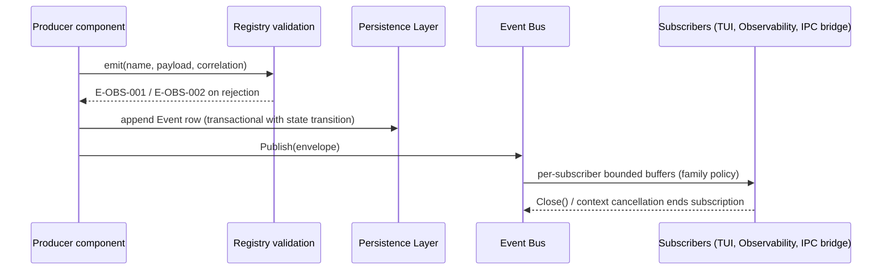

# 04 — Events and the Event Envelope

This chapter is the single home of the **event envelope and delivery semantics** (Volume 0,
chapter 03): the shape every event carries, how events are validated, persisted, distributed
in-process over the Event Bus (EventBusPort, ADR-012), bridged over IPC, retained, and
exported. Each area volume mints its own event *names and payloads* under the Volume 0
grammar `<area>[.<noun>].<verb-past>` (the `<noun>` segment is omitted when the event's subject is the area entity itself); the persisted Event entity is Volume 2's (chapter 08);
this chapter defines everything between: the envelope (keystone FR-OBS-001), the registry,
delivery, ordering, overflow, retention, privacy, and failure behavior. Decided shape:
ADR-137.

## The envelope

An event is one enveloped occurrence. The envelope has three field groups: **identity**,
**correlation**, and **content**; a fourth, **delivery**, exists only in transit and is never
persisted.

| Group | Field | Type | Presence | Meaning |
|---|---|---|---|---|
| Identity | `id` | ULID | always | Minted at emission (ADR-027); global ordering *hint* only |
| Identity | `name` | string | always | Registered event name, `<area>[.<noun>].<verb-past>` |
| Identity | `schema_version` | integer ≥ 1 | always | Version of this name's payload schema (Volume 2, INV-EVT-01 context) |
| Identity | `occurred_at` | RFC 3339 UTC timestamp | always | When the occurrence happened (≠ persistence instant) |
| Identity | `producer` | string | always | Emitting component, Volume 3 component names |
| Correlation | `workspace_id` | ULID | when workspace-scoped | Correlation: Workspace |
| Correlation | `session_id` | ULID | when session-scoped | Correlation: Session |
| Correlation | `run_id` | ULID | required for run-scoped events (INV-EVT-03) | Correlation: Run |
| Correlation | `turn_id` | ULID | when turn-scoped | Correlation: Turn |
| Correlation | `task_id` | ULID | when task-scoped | Correlation: Task |
| Correlation | `tool_invocation_id` | ULID | when invocation-scoped | Correlation: Tool Invocation |
| Correlation | `trace_id` | ULID | when a trace is active | Correlation: Trace (chapter 05) |
| Content | `payload` | canonical JSON object | always (may be `{}` → serialized as empty object) | Redacted payload; schema owned by the minting area |
| Delivery (transit only) | `family` | string | always in transit | The event family (below); drives overflow policy |
| Delivery (transit only) | `attempt` | integer | IPC bridge only | Bridge re-delivery counter (bridge semantics below) |

Two frequently needed correlation values that are **not** entity columns travel inside
`payload` under reserved keys, so the Volume 2 persisted projection stays fixed while the
correlation chain stays complete:

- `payload.provider_request_id` (string) — the provider-assigned request identifier for
  provider-scoped events, when the provider returns one (Volume 5 populates it from official
  response metadata only).
- `payload.span_id` (string) — the emitting span within `trace_id`, when finer-than-trace
  correlation is useful.

Reserved payload keys (`provider_request_id`, `span_id`, `error_code`) MUST be used for
those meanings and no others; `payload.error_code` carries the `E-<AREA>-NNN` identity for
failure events.

A serialized envelope (canonical JSON, Volume 2 chapter 10 rules — keys sorted, absent
optionals omitted):

```json
{
  "id": "01J1YB9V2NQF7Q2R2M6TT0S9EX",
  "name": "tool.invocation.denied",
  "occurred_at": "2026-07-11T14:03:22.184Z",
  "payload": {
    "error_code": "E-SEC-001",
    "permission": "write",
    "tool_name": "filesystem.write"
  },
  "producer": "tool_runtime",
  "run_id": "01J1YB8G0T3W9K5H2D4C6B8A0Z",
  "schema_version": 1,
  "session_id": "01J1YB7A9XKZM3P5R7T9V1W3Y5",
  "tool_invocation_id": "01J1YB9TZC4D6F8H0K2M4P6R8T",
  "trace_id": "01J1YB8G0V5X7Z9B1D3F5H7J9L",
  "workspace_id": "01J1YB6Z8QSTV0W2Y4A6C8E0G2"
}
```

The example `error_code` value is illustrative of the payload shape; the concrete permission
denial code is minted by Volume 9.

## Event registration

INV-EVT-01 (Volume 2) requires every emitted name to be registered; this section is the
registration mechanic. The registry is **closed per release and compiled into the binary**:
each event name is declared in code, in its owning area's package, with the following
registration entry. Free-form emission is rejected with E-OBS-002.

| Registration field | Meaning |
|---|---|
| `name` | The event name (grammar-checked at registration) |
| `family` | Family assignment (table below) |
| `schema_version` | Current payload schema version |
| `payload_schema` | JSON Schema (ADR-024) of the payload per version |
| `required_correlation` | Which correlation fields are mandatory for this name (e.g., `run_id` for run-scoped names) |
| `privacy_class` | `operational` (IDs, enums, counts, sizes) or `content_bearing` (redacted summaries under Volume 9 gates) |
| `retention_class` | `standard` \| `accounting` \| `audit_linked` (retention table below) |
| `producer` | Component(s) allowed to emit it |
| `consumers` | Documented expected consumers (documentation, not runtime enforcement — subscription is open to in-process components) |
| `description` | One-line meaning, rendered into the consolidated catalog (`annexes/catalog-events.md`) |

Extensions never register names directly: plugin-, MCP-, and skill-related occurrences
surface through names minted by Volume 6 in its own areas, with the extension identified in
the payload. The registry therefore stays closed while extension activity stays observable.

## Families and overflow policy

Every name belongs to exactly one family. The family determines the per-subscriber overflow
policy (ADR-012: drop-oldest, block, or coalesce) and the default buffer size. Policies are
fixed here; buffer sizes are defaults adjustable within bounds via `SubscribeOptions`
(Volume 3).

| Family | Contents | Overflow policy | Default buffer | Rationale |
|---|---|---|---|---|
| `lifecycle` | Canonical state-machine transition events of Volume 2 chapter 09 machines (run, task, plan, tool invocation, workflow, …) | `drop_oldest` | 256 | The durable trail is the database (persist-then-publish below); live consumers tolerate gaps and re-sync from persisted records |
| `action` | Side-effect records' events (file changes, command executions, git mutations, permission decisions) | `drop_oldest` | 256 | Same durable-trail argument; audit lives in the Audit Log, not in bus delivery |
| `progress` | High-frequency ephemera (streaming progress, index progress, buffer stats) | `coalesce` (latest-wins per key) | 64 | Only the newest value matters; coalescing bounds cost under burst |
| `security` | Security-relevant notifications mirrored from audited actions (Volume 9 mints names) | `block` (publisher blocks up to 100 ms, then `drop_oldest` with counter) | 512 | Best-effort timeliness for security consumers without permitting deadlock; the authoritative record is the Audit Log (INV-AUD-03), never bus delivery |
| `telemetry` | This volume's `telemetry.*`, `log.*`, `event.*`, `trace.*`, `metric.*`, `observability.*`, `cost.*` self-observation names | `drop_oldest` | 128 | Observability of observability must never become a load amplifier |

Overflow of any policy increments `obs.events.dropped_total{policy}` and, at most once per
subscriber per minute, emits `event.subscriber.overflowed` (a `telemetry`-family event that
is itself drop-eligible — overflow signaling never recurses into more overflow pressure).

## Delivery semantics



The diagram's participants and constraints: the **producer** builds the envelope and submits
it to **registry validation** (name registered, payload schema-valid, required correlation
present, grammar respected) — rejection returns E-OBS-001 or E-OBS-002 to the producer and
nothing is persisted or published. The producer then **persists** the Event row via the
Persistence Layer and **publishes** to the Event Bus, which fans out to per-subscriber
bounded buffers under the family's overflow policy. Subscribers include the TUI, the
Observability query component, and the IPC bridge. The bus itself never persists (Volume 3
Event Bus contract: distribution only).

Normative delivery rules:

1. **Persist-then-publish.** For `lifecycle` and `action` families, the Event row MUST be
   appended in the same transaction as the state transition or Record append it describes
   (Volume 2 chapter 10 write discipline), and bus publication happens after commit. A
   consumer can therefore always reconstruct missed events from the database; bus delivery
   is a latency optimization, not the record.
2. **At-most-once, in-process.** Bus delivery is at-most-once per subscriber (ADR-012).
   There is no redelivery, no acknowledgment, no cross-restart delivery. Durable consumers
   read persisted rows.
3. **Ordering.** Per topic per publisher, delivery order equals publish order (FIFO).
   Global order across topics and publishers is defined only by the persisted sequence: the
   Event table's insertion order per database (`sequence_no`/rowid per ADR-027 — ULIDs are
   hints, the persisted sequence is the authority). Consumers needing total order sort
   persisted rows.
4. **Gap detection.** Drop-eligible delivery plus persisted completeness means a live
   consumer detects gaps by comparing received `id`s against persisted rows for its selector;
   the TUI's re-sync path uses exactly this.
5. **Replay.** `SubscribeOptions` MAY request replay-from-persisted for families backed by
   persistence (`lifecycle`, `action`): the subscription first streams matching persisted
   rows from a given position (sequence or time), then switches to live delivery, with the
   switchover position reported so the consumer can deduplicate the boundary.
6. **Publication never blocks producers** beyond the `security` family's bounded 100 ms
   grace; all other families are non-blocking by policy.
7. **Cancellation.** A subscription ends when closed or its context is cancelled; buffered,
   undelivered items are discarded (they remain in the database if persisted-family).

## IPC bridging

Per ADR-012 rule 3, external processes subscribe over the Unix-socket JSON-RPC surface. The
bridge is an ordinary bus subscriber plus these rules:

- Envelope serialization over IPC is the canonical JSON form above; the JSON-RPC handshake
  carries the envelope contract version so clients detect shape evolution (SM-20).
- Every bridged subscription passes the Permission Manager (Volume 9) before first delivery;
  `content_bearing` payloads additionally pass the Volume 9 redaction gate at the bridge —
  the in-process form and the IPC form may therefore legitimately differ in payload detail.
- The bridge applies `drop_oldest` toward slow IPC clients regardless of family (a remote
  reader must never exert backpressure into the runtime); drops are counted per client and
  surfaced in the bridge's `attempt`/gap metadata so clients detect loss.

## Persistence, retention, and export

Event rows persist per Volume 2: workspace database for workspace-context events, global
database for machine-level events. Retention is enforced by a pruning pass that runs at
process start and daily thereafter, oldest-first per retention class:

| Retention class | Contents | Default retention | Config key |
|---|---|---|---|
| `standard` | Lifecycle, progress-derived, telemetry self-observation rows | 90 days or `storage.events.max_size_mb`, whichever binds first | `storage.events.retention_days`, `storage.events.max_size_mb` |
| `accounting` | Events referenced by cost reporting (chapter 05 rollup lineage) | Pruned only after the referencing rollup is compacted (chapter 05) | inherits `storage.cost_records.retention_days` |
| `audit_linked` | Events whose facts corroborate Audit Records | Never pruned while the referencing Audit Record is retained (INV-AUD-04) | Volume 9 audit window governs |

Pruning emits `event.retention.pruned` (counts per class in payload) and MUST be
transactional per batch — a cancelled prune deletes nothing from that batch. Export is the
Volume 2 record-stream form: JSON Lines of canonical envelopes, produced by the Volume 8
`export` and `logs`/`trace` command families; exports apply the same redaction gates as the
IPC bridge.

## Requirements

### FR-OBS-001 — Event envelope

- Type: Functional
- Status: Approved
- Priority: P0
- Phase: Core
- Source: Provided
- Owner: Event Bus / Observability (Volume 10)
- Affected components: every component (producers); Event Bus; Persistence Layer; TUI, Observability, IPC bridge (consumers); all area volumes as name minters
- Dependencies: ADR-012, ADR-016, ADR-024, ADR-027, ADR-137; Volume 2 Event entity (INV-EVT-01..05)
- Related risks: RISK-OBS-002

#### Description

Every event in Andromeda MUST carry the envelope of this chapter: identity fields (`id`,
`name`, `schema_version`, `occurred_at`, `producer`), the correlation group
(workspace/session/run/turn/task/tool-invocation/trace IDs, plus reserved payload keys
`provider_request_id` and `span_id`), and a redacted canonical-JSON `payload` conforming to
the registered schema for (`name`, `schema_version`). Names MUST be registered (closed
compiled registry with family, privacy class, retention class, producer, documented
consumers, payload JSON Schema) and MUST follow the `<area>.<noun>.<verb-past>` grammar.
Payload evolution is additive within a `schema_version` (consumers MUST ignore unknown keys);
removing, renaming, or retyping a key increments `schema_version`, and envelope-shape changes
follow SM-20 (the event envelope is a public contract). This requirement is the keystone
other volumes reference when minting event names.

#### Motivation

Nine volumes mint events; without one enforced envelope and registry, correlation joins
(SM-13), the TUI activity view, the IPC surface, and export tooling would each face a
different shape per area. One envelope makes every occurrence in the system joinable,
queryable, and versionable.

#### Actors

Area volumes (name minting); producer components; the registry (validation); consumers
(TUI, Observability, IPC clients, exports).

#### Preconditions

Registry compiled with the name; correlation values available in context.

#### Main flow

1. A producer constructs the envelope for a registered name.
2. Registry validation checks name, grammar, schema, required correlation, and privacy-class
   redaction obligations.
3. The event proceeds to persistence and publication per FR-OBS-005/FR-OBS-006.

#### Alternative flows

- Payload at an older registered `schema_version` (during a deprecation window): accepted;
  consumers select behavior by version.
- Event with no active trace (early startup, global actions): `trace_id` omitted; envelope
  remains valid — correlation presence rules come from the registration entry, not a global
  mandate.

#### Edge cases

- Clock regression between two emissions: `occurred_at` may be non-monotonic; ordering
  consumers use the persisted sequence, never timestamps (delivery rule 3).
- Duplicate `id` (ULID collision within a process): prevented by ADR-027 monotonic minting;
  a persistence uniqueness violation is an integrity error (E-OBS-005, integrity cause).
- Unknown keys received by a consumer: ignored by contract; validation rejects unknown keys
  only at *emission* (producers must match the schema exactly; consumers must be tolerant).

#### Inputs

Name, payload, correlation context; the registration entry.

#### Outputs

A validated envelope ready for persistence and publication; E-OBS-001/E-OBS-002 rejections.

#### States

Not applicable — events are immutable records (INV-EVT-02), not stateful entities.

#### Errors

E-OBS-001 (malformed envelope: schema violation, missing required correlation, grammar
breach, oversized payload); E-OBS-002 (unregistered name); both returned to the producer,
which treats them as defects (they are programming errors, not runtime conditions).

#### Constraints

Payload size cap 256 KiB after redaction (larger data belongs to Artifacts/Tool Results with
references — INV-TRC-03 discipline applies to events equally); canonical JSON serialization;
reserved payload keys.

#### Security

`payload` is redacted before persistence (INV-EVT-04) under the chapter 03 redaction
categories and Volume 9 rules; `content_bearing` names pass Volume 9 content gates; secret
material is unrepresentable in envelopes for the same structural reasons as in logs.

#### Observability

The envelope *is* the observability substrate; registry validation failures are themselves
counted (`obs.events.rejected_total`) and emit `event.publish.rejected`.

#### Performance

Validation is schema-check + field presence, budgeted under NFR-OBS-002; registry lookup is
a compile-time-built map.

#### Compatibility

Envelope shape changes follow SM-20 contract-diff discipline; payload evolution per the
additive rule; the IPC handshake exposes the envelope contract version. Identical across
Tier 1 platforms.

#### Acceptance criteria

- Given any event emitted anywhere in the integration suite, when validated against the
  registry, then its envelope parses, its payload validates against the registered schema,
  and its required correlation fields are present.
- Given a run-scoped event, when inspected, then `run_id` is present (INV-EVT-03) and
  resolves to the emitting run.
- Negative case: given an emission with an unregistered name, when validated, then E-OBS-002
  is returned, nothing persists, nothing publishes, and `obs.events.rejected_total`
  increments.
- Error case: given a payload violating its schema, when validated, then E-OBS-001 identifies
  the failing JSON Pointer path in its technical message.
- Permission case: given an IPC subscriber without the required permission, when it
  subscribes, then the bridge denies before any delivery (Volume 9 decision path).
- Observability case: given a rejected emission, when the registry rejects it, then
  `event.publish.rejected` is emitted with the offending name and reason class (never the
  offending payload).

#### Verification method

Registry conformance suite: validate every event produced by integration/E2E runs against
schemas; grammar linting of registered names in CI; SM-20 contract-diff over the envelope
and registry between releases; negative-emission unit tests (Volume 13).

#### Traceability

Principle 9; PRD-006; SM-13, SM-20; ADR-012, ADR-137; Volume 2 INV-EVT-01..05; referenced by
every area volume's minted events.

### FR-OBS-005 — Event delivery and subscription semantics

- Type: Functional
- Status: Approved
- Priority: P0
- Phase: Core
- Source: Design
- Owner: Event Bus
- Affected components: Event Bus; all producers and subscribers; IPC bridge; Task Scheduler (shutdown ordering)
- Dependencies: FR-OBS-001; ADR-012, ADR-023, ADR-137; EventBusPort (FR-ARCH-003 frozen signatures)
- Related risks: RISK-OBS-002, RISK-OBS-001

#### Description

The Event Bus MUST implement EventBusPort with: per-subscriber bounded buffers; the family
overflow policies of this chapter (`drop_oldest`, `coalesce`, bounded-`block` for
`security`); FIFO ordering per topic per publisher; at-most-once in-process delivery;
topic-selector subscription (exact names and area prefixes); optional replay-from-persisted
for persistence-backed families with a reported switchover position; non-blocking publication
(bounded 100 ms grace for `security` only); and subscription termination on close or context
cancellation with discard of undelivered buffered items. The IPC bridge subscribes as an
ordinary consumer and applies permission evaluation, bridge-side redaction for
`content_bearing` payloads, and unconditional `drop_oldest` toward remote clients.

#### Motivation

ADR-012's core promise — slow consumers cannot stall the runtime — is only real if overflow
behavior is declared per family and enforced mechanically. This requirement turns the ADR's
policy vocabulary into testable delivery semantics.

#### Actors

Producers; subscribers (TUI, Observability, IPC bridge, tests); the scheduler (shutdown
drain).

#### Preconditions

Bus constructed at composition root; registry available for family lookup.

#### Main flow

1. `Publish` validates per FR-OBS-001, resolves the family, and enqueues to each matching
   subscriber's buffer.
2. Full buffers apply the family policy (drop-oldest / coalesce-by-key / bounded block).
3. Subscribers consume via `Subscription.Events()` streams in publish order per topic per
   publisher.

#### Alternative flows

- Replay subscription: persisted rows stream first (by sequence from the requested
  position), then live delivery begins; the switchover sequence number is delivered as
  subscription metadata.
- Shutdown: publication stops, buffers drain within the Volume 3 chapter 08 shutdown budget,
  then subscriptions end with a clean end-of-stream.

#### Edge cases

- Subscriber that never reads: its buffer saturates and policy applies forever; the bus
  holds at most the buffer bound per subscriber — memory is bounded by construction.
- Publish to a topic with zero subscribers: validation and persistence still occur;
  publication is a no-op (events are records first).
- Coalesce key absent on a `progress` event: falls back to drop-oldest for that item; the
  registration entry defines the coalesce key.
- Publish after bus close (late goroutine during shutdown): returns E-OBS-003; producers
  treat it as a benign shutdown race and MUST NOT retry.

#### Inputs

Validated envelopes; topic selectors; `SubscribeOptions` (buffer size within [16, 4096],
replay position).

#### Outputs

Ordered per-subscriber streams; drop/coalesce counters; overflow events.

#### States

Not applicable — the bus holds subscription tables only; no entity machine.

#### Errors

E-OBS-003 (bus closed); E-OBS-004 (subscriber overflow episode — reported via counter and
`event.subscriber.overflowed`, returned as an error only to the IPC bridge's client-facing
surface where a client requests strict accounting).

#### Constraints

No broker, no cross-process bus (ADR-012); buffer bounds enforced; publication path
allocation-bounded.

#### Security

`security`-family timeliness grace never becomes a deadlock vector (bounded 100 ms);
authoritative security records are Audit Records (INV-AUD-03) independent of delivery; IPC
subscriptions pass the Permission Manager before first delivery.

#### Observability

Per-topic throughput, buffer occupancy, drops by policy (`obs.events.dropped_total{policy}`),
publication rate — the ADR-012 backpressure-risk detectors.

#### Performance

Publish overhead and end-to-end delivery latency are NFR-OBS-002; the `block` grace is a
fixed 100 ms ceiling.

#### Compatibility

Identical semantics across platforms; the Windows-phase named-pipe transport (ADR-012)
changes the IPC transport only, not these semantics.

#### Acceptance criteria

- Given a subscriber with buffer 16 under a 10,000-event burst on a `lifecycle` topic, when
  it drains afterward, then it holds the newest ≤ 16 events, the drop counter accounts for
  the remainder exactly, and the producer was never blocked.
- Given two publishers on one topic, when a subscriber consumes, then each publisher's
  events arrive in that publisher's publish order.
- Given a replay subscription from sequence S, when consumed, then all persisted matching
  events with sequence > S arrive before the first live event, and the switchover position
  is reported.
- Negative case: given publication after close, when `Publish` is called, then E-OBS-003
  returns and no goroutine leaks (Volume 13 leak gates).
- Permission case: given an IPC client lacking the required permission, when it subscribes,
  then denial occurs before any event crosses the socket.
- Observability case: given a `security`-family publication that waits, when the grace
  elapses, then delivery degrades to drop-oldest and the drop is counted — never silently.

#### Verification method

Race- and load-tested delivery suites (ADR-017): burst/soak with policy assertions; ordering
property tests; replay boundary tests; shutdown drain tests within budget; IPC bridge
conformance including permission denial (Volume 13).

#### Traceability

ADR-012, ADR-023; FR-OBS-001; FR-ARCH-003 (EventBusPort freeze), FR-ARCH-004 (cancellation);
NFR-OBS-002; SM-07 (TUI must not lag).

### FR-OBS-006 — Event persistence, retention, and export

- Type: Functional
- Status: Approved
- Priority: P0
- Phase: MVP
- Source: Design
- Owner: Observability / Persistence Layer
- Affected components: Persistence Layer; Event Bus producers; Observability; CLI data commands (Volume 8)
- Dependencies: FR-OBS-001; ADR-007, ADR-027, ADR-028; Volume 2 chapter 08 (Event entity), chapter 10 (write discipline, export forms)
- Related risks: RISK-OBS-001

#### Description

Event rows MUST persist per the Volume 2 Event entity into the workspace or global database
per ADR-028 routing. `lifecycle`- and `action`-family events MUST be appended in the same
transaction as the state transition or Record they describe (persist-then-publish). Retention
MUST be enforced by class (`standard`: `storage.events.retention_days` = 90 /
`storage.events.max_size_mb` = 512 defaults; `accounting`: bound to cost-rollup lineage;
`audit_linked`: INV-AUD-04 precedence), by a transactional oldest-first pruning pass at
startup and daily, emitting `event.retention.pruned`. Export MUST produce canonical-JSON
JSON Lines streams through the Volume 8 data commands with bridge-equivalent redaction.

#### Motivation

The bus is deliberately lossy; the database is the record (PRD-006, PRD-010). Persistence
discipline plus bounded retention makes the activity record durable, queryable offline, and
finite.

#### Actors

Producers (transactional append); the pruning pass; users exporting (Volume 8 commands);
audit workflows (Volume 9).

#### Preconditions

Database open per ADR-028; schema migrated per ADR-029.

#### Main flow

1. A producer appends the Event row transactionally with its subject write.
2. The transaction commits; publication follows (FR-OBS-005).
3. Retention passes prune per class; exports stream on demand.

#### Alternative flows

- Global-scope event (install, credential change, update): routes to the global database's
  `events` table; same envelope, same retention classes.
- Size-cap pressure before age expiry: size binding prunes oldest `standard` rows until
  under `storage.events.max_size_mb`.

#### Edge cases

- Prune racing an export: exports read a consistent snapshot (SQLite WAL read transaction);
  a row is either fully in the export or fully pruned, never torn.
- Retention configured to zero days: rejected by validation (minimum 1 day) — event
  persistence cannot be silently disabled because quiet modes must not suppress records
  (INV-EVT-05).
- Database full/disk exhaustion: append fails with E-OBS-005; for transactional lifecycle
  appends the enclosing entity write fails with it (storage failure is not maskable).

#### Inputs

Validated envelopes; retention keys; export selectors (time, run, session, name prefix).

#### Outputs

Persisted rows; pruned classes with counts; JSONL export streams.

#### States

Not applicable — immutable rows; the pruning pass is a procedure, not a machine.

#### Errors

E-OBS-005 (persistence failure; integrity causes map to exit code 9 semantics per ADR-029);
export I/O failures surface as the invoking command's error with E-OBS-005 as cause.

#### Constraints

Transactional batches; oldest-first; audit precedence (INV-AUD-04); canonical JSON only.

#### Security

Exports and IPC deliveries share one redaction gate (chapter 03 categories, Volume 9 rules);
`audit_linked` rows outlive operational pruning while their Audit Records stand.

#### Observability

`event.retention.pruned` with per-class counts; store-size gauges
(`obs.events.store_bytes`); `andromeda doctor` reports store sizes against bounds.

#### Performance

Appends ride the subject transaction (hot path budgeted by Volume 12's SessionStorePort
latency budget); pruning is batched off the hot path.

#### Compatibility

Identical schema and routing across platforms; export form is the Volume 2 record stream —
stable under SM-20.

#### Acceptance criteria

- Given a run executing 50 state transitions, when the workspace database is inspected, then
  ≥ 50 lifecycle events exist, each committed atomically with its transition (crash-injection
  between write and commit shows either both or neither).
- Given 100 days of `standard` events, when the daily prune runs with defaults, then rows
  older than 90 days are gone, `event.retention.pruned` reports the count, and no
  `audit_linked` row referenced by a retained Audit Record was removed.
- Negative case: given `storage.events.retention_days = 0`, when configuration validates,
  then validation fails (E-CFG family, exit code 3) and no pruning pass runs.
- Error case: given injected disk exhaustion during a lifecycle append, when the transition
  commits, then the transition fails with E-OBS-005 — no transition without its event.
- Permission/privacy case: given an export of `content_bearing` events, when the stream is
  produced, then payloads carry bridge-equivalent redaction.
- Observability case: given a prune batch cancelled mid-pass, when inspected, then that
  batch deleted nothing (transactional) and the next pass completes it.

#### Verification method

Crash-injection around transactional appends (SM-11 method); retention property tests over
synthetic aged datasets including audit-linked exclusions; export round-trip validation
against payload schemas; WAL snapshot isolation tests (Volume 13).

#### Traceability

PRD-006, PRD-010; INV-EVT-02..05, INV-AUD-04; ADR-007, ADR-028, ADR-029, ADR-137; SM-12,
SM-13.

## Non-functional requirements

### NFR-OBS-002 — Event publication overhead and delivery latency

- Category: Performance
- Priority: P1
- Phase: Beta
- Metric: (a) Producer-side `Publish` overhead (validation + enqueue, excluding the subject transaction), p95; (b) publish-to-subscriber-receipt latency in-process under reference load (TUI-scale subscriber set, 500 events/s mixed families), p95
- Target: (a) ≤ 50 µs p95; (b) ≤ 5 ms p95
- Minimum threshold: (a) ≤ 200 µs p95; (b) ≤ 20 ms p95
- Measurement method: Instrumented bus benchmark with representative envelope sizes and subscriber counts (1, 4, 16), reference hardware; latency histograms exported via the chapter 05 registry
- Test environment: Volume 12 reference machines
- Measurement frequency: Every release; regression-gated at Beta exit
- Owner: Event Bus / Volume 12 (benchmark environment)
- Dependencies: FR-OBS-001, FR-OBS-005
- Risks: RISK-OBS-001
- Acceptance criteria: Benchmark report per release shows both percentiles within target (or above minimum threshold with recorded justification); the SM-07 TUI latency suite shows no regression attributable to bus delivery at reference load.

## Errors

Each error declares the full ADR-016 envelope. HTTP mapping is not applicable anywhere in
this family (no HTTP surface); the field is stated once here for all five.

### E-OBS-001 — Malformed event envelope

- **Code**: E-OBS-001. **Category**: internal defect. **Severity**: error (development),
  degraded-to-counter (release builds reject and count without crashing).
- **User message**: "An internal event was rejected because it was malformed; the operation
  continued."
- **Technical message**: "event '<name>' rejected: <reason: schema violation at <JSON
  Pointer> | missing required correlation <field> | grammar violation | payload exceeds 256
  KiB>".
- **Cause**: producer code emitted an envelope violating FR-OBS-001 (schema, correlation,
  grammar, or size).
- **Safe context data**: event name, reason class, JSON Pointer path, producer component.
  Never the payload.
- **Recoverability**: not user-recoverable; a product defect. **Retry policy**: never (the
  same emission fails identically).
- **Recommended action**: report a bug with the technical message; the operation itself is
  unaffected.
- **Exit code**: 1 when a CLI operation's primary purpose was the emission (not the normal
  case); otherwise none (non-fatal). **HTTP mapping**: not applicable.
- **Telemetry event**: `event.publish.rejected`.
- **Security implications**: none beyond the defect itself; rejection prevents persisting
  unvalidated payloads.

### E-OBS-002 — Unregistered event name

- **Code**: E-OBS-002. **Category**: internal defect. **Severity**: error (development),
  degraded-to-counter (release).
- **User message**: "An internal event was rejected because its name is not registered; the
  operation continued."
- **Technical message**: "event name '<name>' is not in the compiled event registry
  (INV-EVT-01)".
- **Cause**: emission of a name absent from the closed registry (typo, missing
  registration, extension attempting direct minting).
- **Safe context data**: offending name, producer component.
- **Recoverability**: not user-recoverable. **Retry policy**: never.
- **Recommended action**: report a bug; extension authors use Volume 6-minted names.
- **Exit code**: 1 (same qualification as E-OBS-001). **HTTP mapping**: not applicable.
- **Telemetry event**: `event.publish.rejected`.
- **Security implications**: enforces the closed-registry property that keeps event-space
  under review (supply-chain hygiene for extension-originated activity).

### E-OBS-003 — Event bus closed

- **Code**: E-OBS-003. **Category**: lifecycle race. **Severity**: info.
- **User message**: none (internal; never user-facing on its own).
- **Technical message**: "publish to closed event bus from <producer> during shutdown".
- **Cause**: a late producer published after shutdown began draining the bus.
- **Safe context data**: producer component, event name.
- **Recoverability**: benign; the process is exiting. **Retry policy**: never — producers
  MUST NOT retry against a closed bus.
- **Recommended action**: none for users; persistent occurrence outside shutdown is a bug.
- **Exit code**: none (never terminal by itself). **HTTP mapping**: not applicable.
- **Telemetry event**: none (counted in `obs.events.rejected_total`; emitting an event about
  the closed bus would be self-defeating).
- **Security implications**: none.

### E-OBS-004 — Subscriber buffer overflow

- **Code**: E-OBS-004. **Category**: backpressure. **Severity**: warning.
- **User message**: "A live event view fell behind and skipped events; records remain
  complete."
- **Technical message**: "subscriber <selector> overflowed: policy=<drop_oldest|coalesce|
  block-degraded>, dropped=<n> in <window>".
- **Cause**: a subscriber consumed slower than its family's publish rate beyond its buffer
  bound.
- **Safe context data**: selector, policy, drop count, window; never event payloads.
- **Recoverability**: self-healing for live views (re-sync from persisted rows). **Retry
  policy**: not applicable (no operation to retry).
- **Recommended action**: none normally; persistent overflow suggests raising the buffer
  within bounds or investigating the consumer (RISK-OBS-001 detection input).
- **Exit code**: none. **HTTP mapping**: not applicable.
- **Telemetry event**: `event.subscriber.overflowed`.
- **Security implications**: `security`-family degradation is visible (counted + evented);
  the authoritative Audit Log is unaffected by bus loss.

### E-OBS-005 — Observability persistence failure

- **Code**: E-OBS-005. **Category**: storage. **Severity**: error.
- **User message**: "Recording of activity data failed: <short cause>. The operation was
  not completed because its record could not be written."
- **Technical message**: "append to <events|traces|trace_spans|metric_points|cost_rollups>
  failed in <workspace|global> database: <driver error class>".
- **Cause**: disk exhaustion, permissions, database corruption, or migration mismatch on an
  observability table write.
- **Safe context data**: table, database scope, driver error class; never row content.
- **Recoverability**: recoverable when environmental (free disk, fix permissions);
  integrity causes follow ADR-029 recovery (backup restore). **Retry policy**: one
  immediate retry for transient `SQLITE_BUSY`-class causes; no retry for integrity causes.
- **Recommended action**: run `andromeda doctor`; free disk space; for integrity causes
  follow the ADR-029 restore procedure.
- **Exit code**: 1; 9 when the cause is integrity/migration (ADR-016 scheme). **HTTP
  mapping**: not applicable.
- **Telemetry event**: `observability.sink.failed`.
- **Security implications**: transactional coupling means state transitions cannot outrun
  their records — a failing record store fails the action rather than losing the trail
  (PRD-006 precedence).

## Risks

### RISK-OBS-002 — Correlation discontinuity across process boundaries

- Category: Technical
- Probability: Medium
- Impact: High
- Severity: High
- Mitigation: Correlation is handler-injected, never hand-constructed (chapter 03 rule 2); the ARP and MCP protocol layers carry trace/run correlation metadata across subprocess boundaries (ADR-011 forces; chapter 05 propagation rules); the IPC bridge preserves envelopes verbatim; SM-13's audit-chain test enumerates side effects and resolves each to its full record chain per release
- Detection: SM-13 automated audit-chain test (target: 0 orphan side effects); correlation-join tests in the log/event/trace conformance suites; orphan-record counters in `andromeda doctor`
- Owner: Volume 10 (Observability)
- Status: Open

The traceability promise (every side effect attributable to run, task, invocation, and
permission decision) breaks silently if any hop — plugin subprocess, MCP server bridge, IPC
client — drops or fabricates correlation fields. Structural injection plus per-release chain
audits turn silent breakage into a gate failure.
