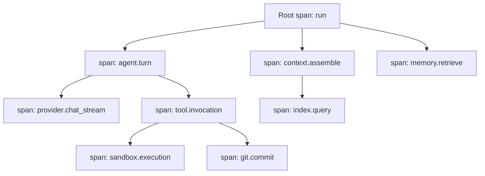

# 05 — Traces, Metrics, and Cost Observability

This chapter defines the trace model and its OpenTelemetry mapping (ADR-011), the metric
registry with the core metric catalog, and the observability side of cost accounting. The
persisted entities (Trace, Metric definition, Cost Record) are Volume 2's (chapter 08);
token/cost *acquisition* from providers is Volume 5's (its chapter 04); TelemetryPort's
frozen shape is Volume 3's. This chapter owns: span semantics and naming, correlation
propagation, local sinks and retention (ADR-139), the metric naming grammar and registry
mechanics (INV-MET-01..03), and cost rollups, reporting honesty, and retention. Remote
export of any of it is exclusively chapter [06](06-telemetry-and-consent.md)'s consent-gated
path.

## Trace model

One Run has exactly one Trace (INV-TRC-01); the trace is the navigational spine joining
turns, tool invocations, and provider requests into a single inspectable tree.

The diagram shows a representative run tree: the root `run` span opens when the Run starts
and closes at its terminal transition; each turn opens `agent.turn` under the root; model
requests (`provider.chat`, `provider.chat_stream`, `provider.embed`) nest under the turn
that issued them; tool activity nests under the turn as `tool.invocation` with child spans
for sandboxed execution and engine operations (git, terminal); context assembly, index
queries, and memory retrieval attach where they run. Constraints: parentage forms a tree
rooted at the run's root span (INV-TRC-02); spans carry redacted summary attributes only,
never bulk payloads (INV-TRC-03); the tree is immutable once ended (INV-TRC-04).

### Span semantics

1. **Creation.** Spans open through `TelemetryPort.StartSpan` with the parent taken from the
   context — components never pass parent IDs manually (the same structural rule as log
   correlation, chapter 03).
2. **Naming.** Span names use `<component>.<operation>` in `snake_case`, from a documented
   name set per component (seeded above; owning volumes document additions in their
   registers). Names are low-cardinality by construction: variable data (paths, models,
   tools) goes in attributes, never in names.
3. **Attributes.** Andromeda-specific attributes live under the `andromeda.*` namespace:
   `andromeda.run_id`, `andromeda.session_id`, `andromeda.task_id`,
   `andromeda.tool_invocation_id`, `andromeda.provider_slug`, `andromeda.model_name`,
   `andromeda.error_code`. Standard OpenTelemetry semantic-convention attributes are used
   where they exist; the pinned semantic-conventions version is PENDING VALIDATION at
   implementation time against the pinned OTel Go SDK (open question in this volume's
   register).
4. **Status.** Span end status uses the frozen Trace recorded-status vocabulary: `ok`,
   `error` (with `andromeda.error_code`), `interrupted` (Volume 2 chapter 09). The root
   span's status mirrors the run's terminal family.
5. **Identifier mapping.** Trace and span ULIDs are 128-bit values (ADR-027): the OTel
   `trace_id` is the ULID's 16-byte binary form; span IDs use the low 8 bytes of the span
   ULID. The mapping is bijective for traces, so the same identifier appears in Events
   (`trace_id`), log records, and OTel wire form without translation tables.
6. **Propagation.** Within the process, context carries the active span. Across subprocess
   boundaries, the Andromeda Runtime Protocol and the MCP client connection carry
   correlation metadata (trace ID, parent span ID, run ID) in their protocol-defined
   metadata fields (ADR-009/ADR-010 forces recorded in ADR-011); spans produced on the far
   side of a plugin boundary are recorded by Andromeda's runtime around the protocol calls —
   plugins do not write into Andromeda's trace store directly.

### Local sink and retention

Spans buffer in memory while open and are written to the Volume 2 tables (`traces`,
`trace_spans`) at span end, batched under the write discipline; `TelemetryPort.Flush` drains
within its context deadline (shutdown budget per Volume 3 chapter 08). Local traces are
**unsampled**: every run yields a complete trace (SM-12/SM-13 depend on completeness;
ADR-139 records the decision and its reserve knobs). Retention: `storage.traces.retention_days`
(default 30) and `storage.traces.max_size_mb` (default 512), pruned oldest-first,
whole-trace-at-a-time (never partial trees), emitting `trace.retention.pruned`; a trace is
never pruned before its run row (Volume 2: traces prune with or before their run). Trace
completion emits `trace.completed` with span count and status in payload.

## Metric registry and naming

Metric definitions are code-declared and compiled into the binary — a closed registry, like
the event registry (INV-MET-01). Emission of an unregistered name is E-OBS-006 in
development builds and dropped-with-counter in release builds (TelemetryPort contract,
Volume 3).

Naming grammar: `<area>.<noun>[.<qualifier>]_<unit-suffix>` in `snake_case`; unit suffixes
are `_total` (counters), `_ms` (durations), `_bytes` (sizes), plus gauge names without a
suffix where the unit is `1`. Labels obey INV-MET-03: low-cardinality identifiers and enums
only — never paths, free text, or user content; each definition lists its allowed label keys
and the registry rejects samples with unknown keys.

### Core metric catalog

The seed registry below is normative. The `Owner` column names the area that documents the
metric's semantics in its own volume (registry mechanics stay here); additions land through
the owning volume's register.

| Metric | Type | Labels | Owner | Meaning |
|---|---|---|---|---|
| `run.duration_ms` | histogram | `outcome` | AGT | Run wall-clock duration by terminal state |
| `run.turns_total` | counter | `outcome` | AGT | Turns executed |
| `provider.request.duration_ms` | histogram | `provider_slug`, `model_name`, `outcome` | PROV | Full request latency |
| `provider.request.first_token_ms` | histogram | `provider_slug`, `model_name` | PROV | Time to first streamed token |
| `provider.request.retries_total` | counter | `provider_slug`, `reason` | PROV | Retry attempts by reason class |
| `provider.ratelimit.throttled_total` | counter | `provider_slug` | PROV | Rate-limit responses observed |
| `provider.request.errors_total` | counter | `provider_slug`, `error_code` | PROV | Failed requests by stable code |
| `provider.tokens_total` | counter | `provider_slug`, `model_name`, `direction` (`input` \| `output` \| `cached` \| `reasoning`) | PROV | Tokens from official usage reporting |
| `provider.cost_micros_total` | counter | `provider_slug`, `model_name`, `basis` (`actual` \| `estimated`) | PROV | Accumulated cost in micro-units |
| `provider.capability.degradations_total` | counter | `provider_slug`, `capability` | PROV | Capability degradation strategies applied |
| `tool.invocation.duration_ms` | histogram | `tool_name`, `outcome` | TOOL | Invocation latency by terminal state |
| `tool.invocations_total` | counter | `tool_name`, `outcome` | TOOL | Invocations by outcome (incl. `denied`, `timed_out`) |
| `file.changes_total` | counter | `kind` (`create` \| `edit` \| `delete` \| `rename`) | TOOL | File Change records written |
| `command.executions_total` | counter | `outcome` | TOOL | Command Executions by recorded outcome |
| `command.execution.duration_ms` | histogram | `outcome` | TOOL | Command wall-clock duration |
| `git.mutations_total` | counter | `operation` | GIT | Side-effecting GitPort operations |
| `memory.operations_total` | counter | `operation` (`ingest` \| `retrieve` \| `rank` \| `expire` \| `delete` \| `export`) | MEM | MemoryStorePort operations |
| `index.update.duration_ms` | histogram | `kind` (`build` \| `update`) | IDX | Index build/update latency |
| `index.documents` | gauge | `index_kind` | IDX | Indexed document count |
| `security.permission.decisions_total` | counter | `decision` | SEC | Permission decisions by outcome vocabulary (Volume 9 names) |
| `security.approvals_total` | counter | `outcome` (Approval terminal states) | SEC | Approval resolutions |
| `security.audit.records_total` | counter | `outcome` | SEC | Audit Records appended |
| `obs.events.published_total` | counter | `family` | OBS | Bus publications |
| `obs.events.dropped_total` | counter | `policy` | OBS | Overflow losses by policy |
| `obs.events.rejected_total` | counter | `reason` | OBS | Registry rejections |
| `obs.events.store_bytes` | gauge | `scope` (`workspace` \| `global`) | OBS | Event store size |
| `obs.log.records_total` | counter | `level` | OBS | Log records emitted |
| `obs.log.dropped_total` | counter | — | OBS | Log records lost in degradation |
| `obs.log.redactions_total` | counter | `category` | OBS | Redaction replacements |
| `obs.telemetry.export_batches_total` | counter | `outcome` | OBS | Consented export batches (chapter 06) |

Histogram bucket boundaries are fixed per definition at registration (durations use a shared
exponential ladder from 1 ms to 5 minutes); changing buckets, `type`, or `unit` mints a new
name (INV-MET-02).

### Local metric persistence

Metric samples aggregate in memory (OTel SDK views) and, when
`storage.metrics.local_persistence = true` (default), persist as periodic snapshots — one
row per definition per label set per interval (60 s) — into the `metric_points` table of the
workspace database (global-scope metrics into the global database), so `andromeda` cost and
performance views work fully offline. Retention: `storage.metrics.retention_days` (default
30), pruned with the daily pass. Persistence failure is E-OBS-005 (non-fatal for metrics:
dropped-with-counter, since metric points are derived data, unlike lifecycle events).

## Cost observability

Cost Records are the ground truth (Volume 2, INV-COST-01..05); Volume 5 writes them from
official provider accounting. This chapter owns what makes them useful and bounded:

1. **Rollups.** A daily compaction pass aggregates Cost Records into `cost_rollups` rows
   keyed by (day, `provider_slug`, `model_name`, `workspace_id`, `cost_basis`), summing
   token directions and `cost_micros`. Rollups never merge different `cost_basis` values —
   estimates and actuals stay separate all the way to presentation (INV-COST-03). The pass
   emits `cost.rollup.compacted`.
2. **Retention.** Raw Cost Records retain per `storage.cost_records.retention_days`
   (default 365); rollups are kept indefinitely (they are small and are the long-horizon
   accounting record). Raw rows referenced by no rollup yet are never pruned. Events in the
   `accounting` retention class (chapter 04) prune only after their period's rollup exists.
3. **Queries.** The Observability component exposes the run/session/period cost views the
   CLI/TUI render (Volume 8 owns presentation): per-run totals (from Run `usage_totals`
   caches, recomputed from Cost Records on divergence per INV-COST-05), per-provider and
   per-model breakdowns, and period reports from rollups.
4. **Honesty rules.** Every surfaced figure carries its basis; totals mixing bases MUST be
   presented as split figures (`actual` + `estimated`), never a single merged number; when
   any contributing record has `cost_basis = unavailable`, the view MUST say so ("N requests
   without cost data") rather than presenting a lower bound as a total.

## Requirements

### FR-OBS-007 — Trace model and OpenTelemetry mapping

- Type: Functional
- Status: Approved
- Priority: P0
- Phase: MVP
- Source: Provided
- Owner: Telemetry / Observability
- Affected components: Telemetry (TelemetryPort); Agent Engine, Execution Engine, Tool Runtime, Provider Layer, Git Engine, Context Manager, Memory Manager, Indexing Engine (instrumentation); Plugin Runtime, MCP Runtime (propagation); Persistence Layer (sink)
- Dependencies: ADR-011, ADR-027, ADR-139; Volume 2 Trace entity (INV-TRC-01..04); FR-ARCH-004 (context propagation)
- Related risks: RISK-OBS-002

#### Description

Every Run MUST produce exactly one complete, unsampled local trace: a root `run` span with
nested spans per the span-semantics rules of this chapter (context-derived parentage,
`<component>.<operation>` naming, `andromeda.*` attributes, frozen status vocabulary
`ok`/`error`/`interrupted`, ULID↔OTel identifier mapping). Correlation MUST propagate across
plugin and MCP subprocess boundaries via the respective protocols' metadata fields. Spans
MUST persist to the local `traces`/`trace_spans` tables at span end with `Flush` draining
within its deadline; traces MUST be prunable only whole and only per retention keys.

#### Motivation

The run tree is how a user answers "what did this run actually do, where did the time go,
and what failed" (Principle 7, UC-13-style inspection) — and it is the correlation spine
SM-13 joins against. OTel semantics make the same data exportable to standard tooling under
chapter 06 consent with zero translation.

#### Actors

Instrumented components (span producers); Telemetry (recording); Observability and CLI/TUI
(consumers); OTLP exporters (chapter 06, consent-gated).

#### Preconditions

TelemetryPort assembled; run started (root span opens with the Run).

#### Main flow

1. The Agent Engine opens the root span at run start; the Trace row is created with it.
2. Components open child spans through context; attributes and events accrue redacted
   summaries.
3. Spans end with a status; batches persist; the root span closes at the run's terminal
   transition and the Trace row's `status`/`ended_at`/`span_count` finalize.

#### Alternative flows

- Interrupted run (crash): recovery closes the trace with status `interrupted`; spans left
  open by the crash are closed at recovery with `interrupted` status and recovery-time
  `ended_at` — honestly marked, never backfilled.
- Global operations outside any run (update, credential change): no trace is created; such
  actions rely on events and audit records (traces are run-scoped by INV-TRC-01).

#### Edge cases

- Span opened with a cancelled context: records with `interrupted` status immediately;
  no orphan open spans.
- Extremely deep nesting (recursive delegation): depth is bounded by the Volume 4 delegation
  bounds; the trace store imposes no depth limit of its own.
- Attribute value exceeding the 4 KiB per-attribute cap: truncated with marker (INV-TRC-03
  size discipline).

#### Inputs

`StartSpan`/`End` calls with attributes; protocol correlation metadata at boundaries.

#### Outputs

Persisted trace trees; `trace.completed` events; OTel-shaped spans for consented export.

#### States

Trace `status` is a recorded vocabulary (`ok` \| `error` \| `interrupted`), not a governed
machine (Volume 2 chapter 09).

#### Errors

E-OBS-005 on span persistence failure (dropped-with-counter for spans — a run never fails
because its trace write failed; the loss is counted and surfaced); E-OBS-006 has no role
here (metrics only).

#### Constraints

Unsampled locally; tree invariants INV-TRC-02; summary-only attributes INV-TRC-03;
immutability INV-TRC-04; naming low-cardinality.

#### Security

Span attributes pass the chapter 03 redaction categories; traces never contain payload
bodies, prompts, or file content — references and sizes only.

#### Observability

Traces are self-describing; span write failures count in `observability.sink.failed` event
payloads; trace pruning emits `trace.retention.pruned`.

#### Performance

Span record-and-buffer overhead is NFR-OBS-005's metric; flush respects the shutdown budget.

#### Compatibility

OTel wire mapping preserves identifiers bijectively; semantic-conventions pin PENDING
VALIDATION (register open question); Tier 1 platforms identical.

#### Acceptance criteria

- Given any completed run in the E2E suite, when its trace is loaded, then exactly one trace
  exists, parentage forms a tree from the root span, and every turn, tool invocation, and
  provider request in the run's records has a corresponding span sharing its correlation
  IDs.
- Given a run using a plugin tool, when the trace is inspected, then the tool's span
  subtree carries the same `trace_id` across the subprocess boundary.
- Given a crash mid-run, when recovery completes, then the trace status is `interrupted`
  and no span remains open.
- Negative case: given a span attribute containing a 1 MiB string, when recorded, then the
  stored attribute is truncated with an explicit marker at 4 KiB.
- Permission/privacy case: given a trace export, when payloads are inspected, then no file
  content, prompt text, or secret-pattern match appears.
- Observability case: given trace pruning removes 3 traces, when the pass ends, then
  `trace.retention.pruned` reports 3 whole traces and their runs' rows were already pruned
  or pruned with them.

#### Verification method

Trace-completeness validator over all suite runs (SM-12 method component); tree-invariant
property tests; crash-injection with post-recovery trace audits; cross-boundary propagation
tests against plugin/MCP doubles; redaction leak tests (Volume 13).

#### Traceability

PRD-006; Principle 7, Principle 9; SM-12, SM-13; ADR-011, ADR-139; INV-TRC-01..04;
NFR-OBS-003, NFR-OBS-004.

### FR-OBS-008 — Metric registry and core catalog

- Type: Functional
- Status: Approved
- Priority: P1
- Phase: MVP
- Source: Provided
- Owner: Telemetry
- Affected components: Telemetry; all instrumented components; Persistence Layer (metric_points)
- Dependencies: ADR-011; Volume 2 Metric entity (INV-MET-01..03); FR-OBS-007 (shared pipeline)
- Related risks: RISK-OBS-001

#### Description

Metric emission MUST go through a closed, code-compiled registry whose entries carry name
(grammar `<area>.<noun>[.<qualifier>]_<unit-suffix>`), type (`counter` \| `gauge` \|
`histogram`), unit, allowed label keys, description, owner area, and fixed histogram
buckets. The core catalog of this chapter MUST exist from MVP. Samples with unregistered
names or unknown label keys are E-OBS-006 in development builds and dropped-with-counter in
release builds; label values MUST be low-cardinality identifiers or enums (INV-MET-03).
Local snapshots persist per the metric-persistence rules when enabled.

#### Motivation

Metrics with open-ended names and labels rot into unqueryable, high-cardinality noise and a
privacy risk (paths and user content in labels). A closed registry makes every metric
documented, bounded, and safe to persist and (under consent) export.

#### Actors

Owning areas (definitions); instrumented components (samples); Observability and Volume 12
benchmarks (consumers).

#### Preconditions

Registry compiled; TelemetryPort assembled.

#### Main flow

1. A component emits a sample via `EmitMetric` against a registered definition.
2. The registry validates name and label keys; the OTel pipeline aggregates.
3. Periodic snapshots persist locally when enabled.

#### Alternative flows

- Registry-valid sample with a label value of excessive cardinality (e.g., a ULID on a
  definition not declaring an ID label): rejected as unknown-key/invalid-value with the same
  E-OBS-006 handling.
- `storage.metrics.local_persistence = false`: aggregation remains in-memory for live views;
  nothing persists; offline historical views are empty and say so.

#### Edge cases

- Counter reset on process restart: consumers treat counters as per-process monotonic;
  persisted snapshots carry process instance identity so resets are detectable.
- Two processes on one workspace: snapshots carry the PID-scoped instance; queries aggregate
  across instances.
- Histogram sample outside the bucket ladder: lands in the overflow bucket; never an error.

#### Inputs

Metric samples; definitions; `[storage]` metric keys.

#### Outputs

Aggregated series; persisted snapshots; drop counters.

#### States

Not applicable — definitions are stateless (Volume 2).

#### Errors

E-OBS-006 (unregistered name / unknown label key); E-OBS-005 for snapshot persistence
failure (dropped-with-counter).

#### Constraints

Closed registry; fixed buckets; label cardinality bounds (≤ 16 label keys per definition,
enumerable value sets documented per definition); snapshot interval 60 s.

#### Security

Label values never contain paths, free text, or user content (INV-MET-03) — enforced by
definition-time review and emission-time value-set checks where declared; metric data is
`operational` privacy class throughout.

#### Observability

The registry reports its own drops (`obs.events.rejected_total` analog for metrics is the
drop counter surfaced in `observability.sink.failed` payloads and development diagnostics).

#### Performance

Emission is non-blocking with bounded buffers (TelemetryPort contract); overhead within
NFR-OBS-005.

#### Compatibility

Definitions version with the registry; INV-MET-02 (type/unit immutable; semantic change
mints a new name, old name DEPRECATED); export shape follows the OTLP contract under
chapter 06.

#### Acceptance criteria

- Given the full integration suite, when all emitted samples are checked against the
  registry, then 100% match a definition and its label keys.
- Given the core catalog, when a release builds, then every catalog row exists in the
  compiled registry with matching type, unit, and labels.
- Negative case: given emission of `provider.made_up_metric_total`, when a development build
  runs, then E-OBS-006 surfaces naming the offender; when a release build runs, then the
  sample is dropped and counted.
- Error case: given snapshot persistence fails on a full disk, when the interval elapses,
  then samples continue in memory, the failure is counted, and no operation fails.
- Permission/privacy case: given any persisted snapshot, when label values are scanned,
  then no value matches path, URL, or secret patterns.
- Observability case: given 10 dropped samples, when diagnostics run, then the drop counter
  reports exactly 10.

#### Verification method

Registry conformance suite over emitted samples; catalog presence test per release;
cardinality scanners over persisted snapshots; fault injection on persistence (Volume 13).

#### Traceability

Principle 9; INV-MET-01..03; ADR-011; SM-06..SM-10 (Volume 12 consumes these series);
NFR-OBS-005.

### FR-OBS-009 — Cost observability: rollups, honesty, retention

- Type: Functional
- Status: Approved
- Priority: P1
- Phase: MVP
- Source: Provided
- Owner: Observability
- Affected components: Observability (queries, rollups); Persistence Layer; Provider Layer (Cost Record producers, Volume 5); CLI/TUI (presentation, Volume 8)
- Dependencies: Volume 2 Cost Record (INV-COST-01..05); Volume 5 accounting acquisition; FR-OBS-006 (accounting event retention linkage)
- Related risks: RISK-OBS-001

#### Description

Andromeda MUST maintain daily cost rollups keyed by (day, provider, model, workspace,
`cost_basis`), never merging bases; MUST answer per-run, per-session, per-provider,
per-model, and per-period cost and token queries offline from local records; MUST recompute
cached aggregates from Cost Records on divergence (INV-COST-05); MUST retain raw Cost
Records for `storage.cost_records.retention_days` (default 365) with rollups kept
indefinitely and raw rows never pruned before their rollup exists; and MUST present
estimates, actuals, and unavailable-cost counts as distinct figures in every surfaced total.

#### Motivation

"What did this cost?" is a first-class product promise (Principle 7). The observability
layer must keep the answer available for a year of history at bounded size, and keep it
honest — a merged number silently mixing estimates with actuals is a lie with a currency
symbol.

#### Actors

Rollup pass (automatic); Observability queries; users via Volume 8 cost views and exports.

#### Preconditions

Cost Records present (Volume 5 writes them per official usage reporting).

#### Main flow

1. The daily pass aggregates new Cost Records into rollup rows per key, emitting
   `cost.rollup.compacted`.
2. Queries serve run/session views from records and caches, period views from rollups.
3. Retention prunes raw rows older than the window whose rollups exist.

#### Alternative flows

- Divergence between Run `usage_totals` and Cost Records: records win; the cache recomputes;
  the divergence is logged at `WARN` (it indicates a write-path bug).
- Compensating records (INV-COST-04 corrections): rollups sum records arithmetically, so
  corrections flow through without special cases.

#### Edge cases

- Records arriving after their day's rollup (late accounting from a resumed run): the next
  pass re-compacts affected days idempotently (rollup rows are replaced per key, derived
  data).
- Currency heterogeneity across providers: rollups keep `currency` in the key
  dimension set — sums never cross currencies; presentation shows per-currency figures.
- `cost_basis = unavailable` rows: counted (request counts, token counts where known) but
  contribute no `cost_micros`; views state the uncosted count.

#### Inputs

Cost Records; retention keys; query selectors.

#### Outputs

Rollup rows; cost/token views; JSONL accounting exports (Volume 2 export forms).

#### States

Not applicable — records and derived rollups; no machine.

#### Errors

E-OBS-005 on rollup/persistence failure (rollups are derived: failure defers compaction,
never loses records).

#### Constraints

Bases never merged; currencies never summed together; integer micro-units only
(INV-COST-02); rollup idempotence.

#### Security

Cost data is `operational` class (identifiers, counts, amounts); exports carry no request
content; provider slugs are user-configured names and stay local unless the user exports.

#### Observability

`cost.rollup.compacted` with day/row counts; store-size gauges include rollup tables;
divergence recomputations logged.

#### Performance

Rollup pass is O(new records) daily off the hot path; period queries read rollups, not raw
rows (bounded work for year-scale views).

#### Compatibility

Rollup schema evolves by migration (ADR-029); exports remain canonical JSON streams under
SM-20.

#### Acceptance criteria

- Given a run with 12 Cost Records, when its cost view renders, then totals equal the
  record sums per basis and match `usage_totals` (or the cache was recomputed and the
  divergence logged).
- Given 400 days of records with defaults, when retention runs, then raw rows older than
  365 days with existing rollups are pruned, all rollups remain, and period queries over the
  pruned range still answer from rollups.
- Negative case: given records in USD and EUR for one period, when the period view renders,
  then two per-currency figures appear and no merged sum exists.
- Error case: given rollup persistence fails, when the pass ends, then no raw record was
  pruned and the next pass completes compaction.
- Permission/privacy case: given an accounting export, when scanned, then rows contain
  identifiers, counts, and amounts only.
- Observability case: given a pass compacting 3 days, when it completes, then
  `cost.rollup.compacted` reports 3 days and the row counts.

#### Verification method

Rollup property tests (idempotence, late arrivals, corrections, multi-currency); retention
tests with rollup-existence guards; honesty tests asserting split-basis presentation inputs;
divergence-injection tests (Volume 13).

#### Traceability

Principle 7; PRD-006; INV-COST-01..05; Volume 5 chapter 04 (acquisition); SM-12 (accounting
completeness feeds replay records).

## Non-functional requirements

### NFR-OBS-003 — Side-effect traceability

- Category: Observability
- Priority: P0
- Phase: MVP
- Metric: Fraction of side-effecting actions (file changes, command executions, Git mutations, tool network access) attributable via persisted records sharing correlation IDs to their run, task, tool invocation, and permission decision (SM-13 definition)
- Target: 100%; 0 orphan side effects
- Minimum threshold: 100% (identity property; SM-13 binds at MVP exit — no tolerance)
- Measurement method: Automated audit-chain test per SM-13: enumerate side effects in instrumented runs, resolve each to its full record chain (event → invocation → task → run → permission decision), per release
- Test environment: Volume 13 integration/E2E suites on Volume 12 reference machines
- Measurement frequency: Every release; gating from MVP exit
- Owner: Observability
- Dependencies: FR-OBS-001, FR-OBS-006, FR-OBS-007; Volume 2 attribution invariants
- Risks: RISK-OBS-002
- Acceptance criteria: The per-release audit-chain report resolves every enumerated side effect to a complete chain; any orphan fails the release gate and is triaged as a correlation defect.

### NFR-OBS-004 — Run record completeness for replay

- Category: Reliability
- Priority: P0
- Phase: v1
- Metric: Fraction of runs whose persisted run record — configuration snapshot, provider and model identity, prompt references, full tool-invocation sequence with results, events, trace, cost records — is complete and sufficient to replay the recorded decision-and-tool sequence with zero divergence in replay mode (SM-12 definition)
- Target: 100% record completeness; 0 divergence on replay of recorded runs
- Minimum threshold: 100% completeness at v1; divergence failures block the v1 gate (measured without gating from MVP per Volume 1 metric governance)
- Measurement method: Record-completeness validator over all suite runs; replay-mode divergence test per release (SM-12 method)
- Test environment: Volume 13 suites on Volume 12 reference machines
- Measurement frequency: Every release
- Owner: Observability / Persistence Layer (with Volume 4 run semantics)
- Dependencies: FR-OBS-006, FR-OBS-007, FR-OBS-009; SessionStorePort write discipline (Volume 2 chapter 10)
- Risks: RISK-OBS-001, RISK-OBS-002
- Acceptance criteria: The completeness validator reports zero missing record kinds per run across the suites, and replay of recorded runs reproduces the recorded sequence with zero divergence.

### NFR-OBS-005 — Instrumentation overhead

- Category: Performance
- Priority: P1
- Phase: Beta
- Metric: Added wall-clock overhead of observability instrumentation at default settings: (a) per span (start + end + buffer), p95; (b) per metric sample, p95; (c) end-to-end run overhead with full instrumentation versus instrumentation compiled to no-ops on the reference E2E journey
- Target: (a) ≤ 20 µs; (b) ≤ 5 µs; (c) ≤ 2% added wall-clock
- Minimum threshold: (a) ≤ 100 µs; (b) ≤ 20 µs; (c) ≤ 5%
- Measurement method: Microbenchmarks for (a)/(b); paired E2E benchmark runs for (c) on reference hardware (ADR-011 review condition feeds from this measurement)
- Test environment: Volume 12 reference machines
- Measurement frequency: Every release; regression-gated at Beta exit
- Owner: Telemetry / Volume 12
- Dependencies: FR-OBS-007, FR-OBS-008
- Risks: RISK-OBS-001
- Acceptance criteria: Benchmark report per release shows all three within target (or above minimum threshold with recorded justification); a breach of (c)'s minimum threshold triggers the ADR-011 review condition.

## Errors

### E-OBS-006 — Unregistered metric emission

- **Code**: E-OBS-006. **Category**: internal defect. **Severity**: error (development
  builds), degraded-to-counter (release builds).
- **User message**: none in release builds (dropped and counted); development builds surface
  the technical message.
- **Technical message**: "metric sample rejected: name '<name>' not registered, or label key
  '<key>' not declared for it (INV-MET-01/INV-MET-03)".
- **Cause**: emission against a name or label key absent from the compiled metric registry.
- **Safe context data**: metric name, offending label key, producer component. Never label
  values.
- **Recoverability**: not user-recoverable; a product defect. **Retry policy**: never.
- **Recommended action**: report a bug; area owners register definitions through their
  volume registers.
- **Exit code**: 1 in development-build test contexts only; none in release operation.
  **HTTP mapping**: not applicable.
- **Telemetry event**: `metric.registration.violated`.
- **Security implications**: the closed registry is what keeps label content
  privacy-bounded; rejection prevents unreviewed data shapes from entering persisted or
  exportable series.
