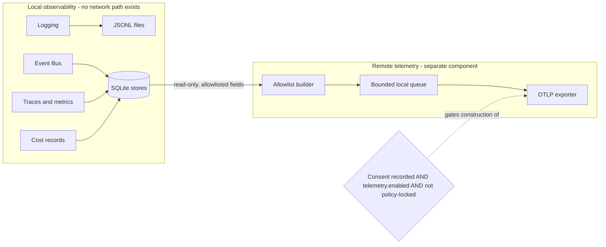

# 06 — Telemetry and Consent

This chapter separates two things that must never blur: **local observability** — the logs,
events, traces, metrics, and cost records of chapters 03–05, which MUST work fully offline
and involve no network by construction — and **remote telemetry** — the strictly optional,
consent-gated export of a narrow, redacted data set over OTLP (ADR-011). The consent
decision itself is minted here as ADR-140: remote telemetry is **opt-in and disabled by
default**; no implicit mechanism may enable it. Consent *policy evaluation* runs through the
Policy Engine (Volume 3); permission and secret semantics referenced here are Volume 9's
(keystones FR-SEC-100, FR-SEC-102).

## The two pipelines



The diagram's components and constraints: the **local pipeline** (left) comprises the
chapters 03–05 sinks — JSONL log files and the SQLite observability tables — and contains no
exporter, no endpoint configuration, and no network code path; it is complete and fully
functional offline. The **remote pipeline** (right) is the Telemetry component's export
side: an allowlist builder that reads *from* the local stores (read-only), a bounded local
queue, and an OTLP exporter. The gate is constructive, not conditional-at-send: the exporter
object is **never instantiated** unless a valid consent record exists, `telemetry.enabled`
is true, and no enterprise policy lock applies — with no exporter constructed, no egress
path exists to misfire (ADR-011's no-config ⇒ no-exporter invariant, verified by test).

Separation rules:

1. Local observability MUST NOT depend on, degrade with, or change behavior based on
   telemetry state. Disabling telemetry changes nothing locally; enabling it changes nothing
   locally either (export reads copies).
2. The remote pipeline MUST NOT carry log records under any configuration. Exportable signal
   classes are metrics and traces only, filtered per FR-OBS-012 — and events only in the
   form of the aggregate counters already in the metric registry.
3. Telemetry failure MUST NOT affect any observed operation (TelemetryPort rule, Volume 3);
   export failures are queued-then-dropped with counters, never blocking.
4. There is no Andromeda-hosted telemetry service (a hosted backend is Out of Scope, Volume
   1). Export goes only to a user-configured OTLP endpoint; an empty endpoint with
   `telemetry.enabled = true` is a configuration error.

## Consent model

Decided by ADR-140. Consent is an explicit, recorded, revocable act — configuration alone is
insufficient, because configuration files are copied between machines and checked into
repositories.

| Element | Rule |
|---|---|
| Default | Disabled. Fresh installations export nothing and prompt for nothing (no consent nag; a single first-run informational line names the feature and where to enable it) |
| Granting | The user sets `telemetry.enabled = true` **and** completes an interactive confirmation that displays the exact collected-data catalog (FR-OBS-012) and the endpoint; the confirmation writes a consent record. In non-interactive contexts the confirmation cannot occur, so consent cannot be granted there (PRD-009 parity: no silent grant) |
| Consent record | Global database row: consent version (the catalog's version), product version, timestamp, endpoint at grant time, scope (`metrics`, `traces`, or both). Grant emits `telemetry.consent.granted` |
| Consent versioning | Any broadening of the collected-data catalog increments the consent version and **invalidates** prior consent: export stops until re-consent. Narrowing does not invalidate |
| Revocation | Setting `telemetry.enabled = false` or explicit revocation stops export immediately, tombstones the consent record, purges the local export queue, and emits `telemetry.consent.revoked` |
| Endpoint change | A changed endpoint requires re-confirmation (consent binds data *and* destination) |
| Enterprise lock | `telemetry.locked = true` set in a system-level configuration layer (precedence per this volume's configuration chapters) pins telemetry disabled: enabling attempts fail with E-OBS-009, and the Policy Engine reports the lock as the cause |
| Anonymous identity | A random installation identifier (UUIDv4, no derivation from hardware, username, or hostname) accompanies exports so an endpoint can de-duplicate; it is rotatable and is destroyed on revocation (a re-grant mints a fresh one) |

## Collected and prohibited data

FR-OBS-012 makes both lists normative. Collection is **allowlist-constructed**: telemetry
payloads are built field-by-field from the named items below; nothing else can enter the
pipeline, so a redaction failure upstream cannot leak through (contrast with scrub-based
approaches, which fail open).

**Collected (only under recorded consent, only these):**

| Item | Form |
|---|---|
| Product version, update channel | Strings from the release identity |
| OS family and CPU architecture | Coarse enums (`darwin`/`linux`, `arm64`/`x86_64`); no OS build numbers |
| Installation identifier | The random, rotatable UUID above |
| Feature usage counters | Registry metrics with `operational` labels: command family counts, run/turn counts, tool invocation counts for **built-in** tools by name; extension tools aggregate as `extension` without names |
| Performance histograms | The chapter 05 duration histograms (startup, latency, streaming overhead) with their registered labels |
| Error frequencies | Counts by stable `E-<AREA>-NNN` code and category — never messages, never context data |
| Provider adapter kind | The adapter identifier (e.g., `openai_compatible`, `anthropic`, `ollama`) — never endpoint URLs, never user-assigned provider names |
| Trace shape (when scope includes `traces`) | Span names, durations, statuses, and error codes only; all `andromeda.*` entity-ID attributes are stripped and replaced with structural hashes so tree shape survives but identities do not |

**Prohibited (never collected, no configuration can include them):**

- Prompts, messages, model inputs or outputs, reasoning content in any form.
- File contents, file names, paths, repository names or URLs, branch names, commit data.
- Memory records, context items, index contents.
- Credentials, secret references, environment variable names or values.
- Usernames, hostnames, IP addresses, MAC addresses, hardware identifiers.
- Exact timestamps of user actions (exported points carry coarse-grained hour-resolution
  timestamps; durations are exact, instants are not).
- User-assigned names of any kind (workspaces, profiles, providers, sessions).
- Free-text of any origin, including error messages and log records.

The collected-data catalog is a versioned document rendered into user-facing documentation
verbatim; the consent confirmation displays it; its version is the consent version.

## Retention, export, deletion

| Concern | Rule |
|---|---|
| Local queue | Export batches queue locally, bounded by `telemetry.queue_max_size_mb` (default 64) and 7 days, oldest-dropped-first with counters — offline consented installations do not grow unbounded backlogs |
| Export cadence | Batches ship every `telemetry.export_interval` (default 60 s) when the endpoint is reachable; failures back off exponentially (base 30 s, factor 2, cap 1 h) with E-OBS-008 reported once per outage episode and `telemetry.export.failed` emitted |
| Transport | OTLP over `http/protobuf` (default) or `grpc`, per `telemetry.protocol`; endpoint authentication header material comes from the Secret Store via `telemetry.auth_secret_ref` — never inline in configuration |
| Remote retention | Owned by the operator of the user-configured endpoint, and documentation states this plainly; Andromeda makes no claim over data once shipped |
| Local deletion | Revocation purges the queue and destroys the installation identifier; `telemetry.data.deleted` is emitted with purge counts |
| Batch success | Each accepted batch emits `telemetry.batch.exported` (batch size, signal classes) and increments `obs.telemetry.export_batches_total{outcome}` |

## `[telemetry]` configuration keys

```toml
[telemetry]
enabled = false            # master switch; true additionally requires recorded consent
endpoint = ""              # OTLP endpoint URL; required when enabled
protocol = "http/protobuf" # http/protobuf | grpc
auth_secret_ref = ""       # Secret Store reference for endpoint auth headers (optional)
export_interval = "60s"    # batch cadence
queue_max_size_mb = 64     # local queue bound
locked = false             # system-layer lock: pins telemetry disabled (enterprise policy)
```

`enabled = true` without consent does not export (E-OBS-009 explains why); consent without
`enabled = true` does not export either — both are required, plus the absence of a lock.

## Requirements

### FR-OBS-010 — Strict local/remote separation

- Type: Functional
- Status: Approved
- Priority: P0
- Phase: MVP
- Source: Provided
- Owner: Telemetry / Observability
- Affected components: Telemetry; Logging; Event Bus; Persistence Layer; Policy Engine
- Dependencies: ADR-011, ADR-140, ADR-141; FR-OBS-002, FR-OBS-006, FR-OBS-007, FR-OBS-008
- Related risks: RISK-OBS-003

#### Description

Local observability (chapters 03–05) MUST be fully functional with all network interfaces
disabled, and MUST contain no exporter, endpoint handling, or network code path. Remote
telemetry MUST be a separate pipeline that reads allowlisted data from local stores, holds
it in a bounded local queue, and exports over OTLP only when the constructive gate (recorded
consent ∧ `telemetry.enabled` ∧ no policy lock) held at pipeline construction. The exporter
MUST NOT be instantiated when the gate fails, and no other component may construct one. Log
records MUST NOT be exportable under any configuration.

#### Motivation

Local-first and privacy-preserving are identity properties (PRD-003, precedence item 5).
Separation by construction — no exporter object exists to misfire — is verifiable in a way
that separation by runtime conditionals is not (ADR-011's egress-defect mitigation).

#### Actors

Telemetry (export side); all local-pipeline components (unaffected); Policy Engine (lock
verdicts); Volume 13 (no-egress verification).

#### Preconditions

None for the local pipeline (it always runs); gate evaluation at composition for the remote
pipeline.

#### Main flow

1. At composition, the gate is evaluated once; without full satisfaction, the remote
   pipeline is absent from the object graph.
2. With the gate satisfied, the allowlist builder snapshots eligible aggregates, queues
   batches, and the exporter ships them on the configured cadence.

#### Alternative flows

- Consent revoked mid-process: the remote pipeline tears down (exporter closed, queue
  purged) at the reconfiguration point; the local pipeline is untouched.
- Gate satisfied but endpoint unreachable: batches queue within bounds; the local pipeline
  is untouched.

#### Edge cases

- OS-level offline with consent granted: exports back off; no retry storm (capped
  exponential backoff); queue bounds apply.
- Configuration enabling telemetry arrives via environment variable in CI: the confirmation
  cannot run non-interactively, no consent record exists, so the gate fails and nothing
  exports — CI cannot accidentally opt a fleet in (PRD-009 parity).
- A future component attempting to import the exporter package outside Telemetry: prohibited
  by the ADR-033 dependency rules (exporter construction is Telemetry-internal).

#### Inputs

Gate inputs (consent record, `[telemetry]` keys, policy verdict); local aggregates.

#### Outputs

Local observability regardless; OTLP batches only under the gate.

#### States

Not applicable — pipeline presence/absence at composition; no entity machine.

#### Errors

E-OBS-009 when enablement is attempted without consent or against a lock; E-OBS-008 for
export failures (never affecting local operation).

#### Constraints

No exporter without the gate; no log export; read-only access to local stores; bounded
queue.

#### Security

The no-exporter invariant is the egress guarantee; endpoint credentials live behind
SecretStorePort references (Volume 9); exported payloads are allowlist-built (FR-OBS-012).

#### Observability

Gate evaluations and teardowns are logged; `telemetry.export.enabled` /
`telemetry.export.disabled` events mark pipeline lifecycle; export outcomes counted.

#### Performance

Local-pipeline performance is unaffected by telemetry state (verified by paired benchmarks);
export work is off the hot path.

#### Compatibility

OTLP protocols per official specification; identical semantics across Tier 1 platforms.

#### Acceptance criteria

- Given all network interfaces disabled, when the SM-05 offline suite runs the full local
  observability surface (log, event, trace, metric, cost queries), then 100% functions and
  0 network-access attempts are observed.
- Given `telemetry.enabled = false` (default), when the process runs under a network
  observer, then no telemetry-originated connection attempt occurs and no exporter object
  exists in the composed graph (NFR-OBS-006 method).
- Negative case: given `telemetry.enabled = true` with no consent record, when composition
  evaluates the gate, then the exporter is not constructed and E-OBS-009 explains the
  missing consent.
- Error case: given a consented pipeline and an unreachable endpoint, when export fails,
  then batches queue within bounds, back off per policy, and no local operation is delayed.
- Permission case: given `telemetry.locked = true` at the system layer, when a user sets
  `telemetry.enabled = true`, then enablement fails with E-OBS-009 naming the policy lock.
- Observability case: given consent revocation, when teardown completes, then
  `telemetry.export.disabled` and `telemetry.data.deleted` were emitted.

#### Verification method

Offline suite (SM-05 method) with network observation; composition tests asserting the
no-exporter invariant (Volume 13's no-config ⇒ no-exporter test per ADR-011); fault
injection on endpoints; policy-lock matrix tests.

#### Traceability

PRD-003; Principle 9 (local-first observability); SM-05; ADR-011, ADR-140, ADR-141;
NFR-OBS-006; RISK-OBS-003.

### FR-OBS-011 — Telemetry consent lifecycle

- Type: Functional
- Status: Approved
- Priority: P0
- Phase: MVP
- Source: Provided
- Owner: Telemetry
- Affected components: Telemetry; Policy Engine; global database (consent record); CLI/TUI (confirmation surfaces, Volume 8)
- Dependencies: ADR-140; FR-OBS-010, FR-OBS-012; keystone FR-CFG-001 (layered configuration)
- Related risks: RISK-OBS-003

#### Description

Consent MUST be an explicit interactive act recording (consent version, product version,
timestamp, endpoint, scope) in the global database; MUST be impossible to grant
non-interactively; MUST be invalidated by any broadening of the collected-data catalog
(consent version bump) and by endpoint changes, stopping export until re-confirmation; MUST
be revocable at any time with immediate export stop, queue purge, consent-record tombstone,
and installation-identifier destruction; and MUST be subordinate to the enterprise lock
(`telemetry.locked`), which pins telemetry disabled regardless of user action. Grant,
revocation, and violation attempts emit their respective `telemetry.consent.*` events.

#### Motivation

Consent that a copied dotfile can grant is not consent. Binding the grant to an interactive
confirmation of a versioned catalog and a named destination makes the user's yes specific,
informed, and revocable — and makes fleet-wide accidental opt-in structurally impossible.

#### Actors

Users (grant/revoke); administrators (lock); Telemetry (enforcement); Policy Engine
(verdicts).

#### Preconditions

Interactive session for granting; global database writable.

#### Main flow

1. The user enables `telemetry.enabled` and invokes the confirmation (Volume 8 surface).
2. The confirmation displays the catalog (exact version) and endpoint; the user confirms.
3. The consent record persists; `telemetry.consent.granted` emits; the pipeline constructs
   at the next reconfiguration point.

#### Alternative flows

- Revocation: either configuration change or explicit revocation; teardown per FR-OBS-010;
  `telemetry.consent.revoked` and `telemetry.data.deleted` emit.
- Catalog version bump via product update: at first post-update gate evaluation, stale
  consent fails the gate; export stops; the user is informed once (no nagging) that
  re-consent is available.

#### Edge cases

- Consent record present but global database restored from an older backup (ADR-029
  recovery): the record's product/consent versions still validate against the running
  catalog — a stale version fails closed.
- Two concurrent processes when consent is revoked: both observe the tombstone at their
  next gate evaluation/reconfiguration point; queued batches are purged by the process
  owning the queue.
- Clock skew making the consent timestamp appear future-dated: timestamps are informational;
  validity derives from version matching, not time.

#### Inputs

User confirmation; catalog version; `[telemetry]` keys; policy verdicts.

#### Outputs

Consent record lifecycle; consent events; gate outcomes.

#### States

Consent record status: `active` → `tombstoned` (single transition, no machine — a record
kind, not a governed entity).

#### Errors

E-OBS-009 for enablement without consent, against a lock, or with stale consent version.

#### Constraints

No non-interactive grant; no partial consent below the scope granularity (`metrics`,
`traces`); one active consent record at a time.

#### Security

The consent record contains no secrets; the lock is enforced at the configuration layer
where users cannot override it (system layer precedence); revocation destroys the
installation identifier (unlinkability of future data from past data).

#### Observability

All lifecycle transitions are events; the audit-relevant fact (telemetry state changes) is
also an audited action per Volume 9's catalog.

#### Performance

Gate evaluation is a local read; no measurable cost.

#### Compatibility

Consent records migrate forward (ADR-029); catalog versioning follows the documentation
release process.

#### Acceptance criteria

- Given a fresh installation, when no user action occurs, then no consent record exists,
  no export occurs, and the first-run notice appeared exactly once.
- Given an interactive grant, when the record is inspected, then it carries the displayed
  catalog version, endpoint, scope, and product version.
- Negative case: given `--yes`/non-interactive mode (Volume 8), when enablement is
  attempted, then no confirmation runs, no consent records, and E-OBS-009 is returned.
- Error case: given a catalog version bump, when the gate next evaluates, then export has
  stopped and re-consent is required before any further batch.
- Permission case: given the enterprise lock, when a grant is attempted, then it fails with
  E-OBS-009 naming the lock and no record is written.
- Observability case: given revocation, when complete, then `telemetry.consent.revoked` and
  `telemetry.data.deleted` were emitted and the queue is empty.

#### Verification method

Consent lifecycle integration tests (grant, revoke, version bump, endpoint change, lock
matrix, non-interactive refusal); backup-restore staleness tests; audit-record assertions
(Volume 13).

#### Traceability

ADR-140; PRD-009 (no silent grant); FR-OBS-010; Volume 9 audited-action catalog; SM-16
posture.

### FR-OBS-012 — Collected-data catalog and prohibited data

- Type: Functional
- Status: Approved
- Priority: P0
- Phase: MVP
- Source: Provided
- Owner: Telemetry
- Affected components: Telemetry (allowlist builder); documentation pipeline (catalog rendering)
- Dependencies: ADR-140, ADR-141; FR-OBS-008 (registry labels), FR-OBS-007 (trace shape); Volume 9 redaction rules
- Related risks: RISK-OBS-003

#### Description

Telemetry payloads MUST be constructed exclusively from the collected-data catalog of this
chapter (allowlist construction, field by field); the prohibited-data list MUST be
unrepresentable in the pipeline (no code path reads those sources into the builder); trace
export MUST strip all `andromeda.*` entity-ID attributes, replacing them with structural
hashes; exported timestamps MUST be coarsened to hour resolution while durations remain
exact; extension tool names MUST aggregate as `extension`. The catalog MUST be versioned,
rendered verbatim into user documentation and the consent confirmation, and any broadening
MUST bump the consent version (FR-OBS-011).

#### Motivation

Denylists fail open: one new field leaks by default. An allowlist that is also the consent
document means what users read is mechanically what ships — the strongest honest form of
"we collect X and nothing else".

#### Actors

Allowlist builder (construction); documentation pipeline (rendering); reviewers (catalog
changes are contract changes).

#### Preconditions

Consented, constructed pipeline (FR-OBS-010/011).

#### Main flow

1. On each export interval, the builder reads the named aggregates from local stores.
2. It constructs payloads field-by-field per the catalog, applying stripping, hashing,
   aggregation, and coarsening rules.
3. Batches queue for export.

#### Alternative flows

- Scope limited to `metrics`: the trace-shape section of the catalog does not apply;
  builders for it never run.
- A registry metric with a label not in the catalog's allowed set: the label is dropped
  from the exported series (locally it remains intact).

#### Edge cases

- A new metric added to the registry with `operational` labels: it does NOT export until
  added to the catalog (catalog membership is explicit, not inherited from the registry).
- Structural hash collisions in trace shape: acceptable — hashes exist to preserve shape,
  not identity; collisions lose nothing sensitive.
- Error-code frequencies for codes carrying sensitive semantics (e.g., secret-related
  denials): codes are identifiers by design (ADR-016); counts by code reveal no content.

#### Inputs

Local aggregates; the catalog (versioned); scope from the consent record.

#### Outputs

Allowlist-built payload batches; the rendered catalog document.

#### States

Not applicable — construction procedure, no machine.

#### Errors

Builder failures drop the batch with a counter (never partial payloads); E-OBS-008 covers
downstream export failure.

#### Constraints

No free text anywhere in payloads; hour-coarsened instants; catalog-explicit membership;
prohibited sources unreachable from the builder package (ADR-033 dependency enforcement).

#### Security

The prohibited list operationalizes Volume 9's data-classification for the one component
that ships data off-machine; allowlist construction plus dependency rules make violations a
build failure rather than a runtime hope.

#### Observability

Batch construction metrics (`obs.telemetry.export_batches_total`); catalog version present
in every batch's resource attributes.

#### Performance

Builder work is proportional to registry size, runs on the export interval, off the hot
path.

#### Compatibility

Catalog changes follow SM-20-style review (a broadening is a consent-contract change);
OTLP resource/attribute shapes follow the official specification.

#### Acceptance criteria

- Given any exported batch in the test harness, when its fields are enumerated, then every
  field maps to a catalog item and no field fails the prohibited-pattern scanners (paths,
  URLs, secret canaries, hostnames, exact timestamps).
- Given a consented run with plugin tools, when tool metrics export, then extension tool
  names appear only as `extension`.
- Given trace export, when span attributes are inspected, then no `andromeda.*` entity ID
  survives and structural hashes are present.
- Negative case: given a catalog-external metric, when export runs, then the metric is
  absent from batches while present locally.
- Error case: given a builder failure mid-batch, when the interval ends, then no partial
  batch queued and the drop was counted.
- Observability case: every batch carries the catalog version; the documentation build
  fails if the rendered catalog and the compiled allowlist diverge.

#### Verification method

Payload-enumeration conformance tests with prohibited-pattern scanners and planted
canaries; catalog↔allowlist divergence check in CI; documentation-render verification;
extension-aggregation tests (Volume 13).

#### Traceability

ADR-140, ADR-141; PRD-003 precedence; FR-OBS-011 (consent versioning); Volume 9
classification rules; RISK-OBS-003.

### FR-OBS-013 — Telemetry queue, export, and deletion

- Type: Functional
- Status: Approved
- Priority: P1
- Phase: MVP
- Source: Provided
- Owner: Telemetry
- Affected components: Telemetry; Secret Store (endpoint auth); PAL (network)
- Dependencies: FR-OBS-010, FR-OBS-011, FR-OBS-012; ADR-141; keystone FR-SEC-102 (secret references)
- Related risks: RISK-OBS-003, RISK-OBS-001

#### Description

Consented export MUST batch on `telemetry.export_interval` over OTLP (`http/protobuf`
default, `grpc` selectable) to the configured endpoint, authenticating via Secret Store
reference only; MUST bound the local queue by `telemetry.queue_max_size_mb` and 7 days with
oldest-first drop and counters; MUST back off exponentially on failure (base 30 s, factor 2,
cap 1 h) reporting E-OBS-008 once per outage episode; and MUST implement deletion: on
revocation or explicit purge, the queue empties, the installation identifier is destroyed,
and `telemetry.data.deleted` is emitted. Documentation MUST state that data retention at the
endpoint is the endpoint operator's, with no remote deletion capability claimed.

#### Motivation

The export path must be as bounded and honest as the rest of the system: bounded local
footprint, official transport, secret-hygienic authentication, and deletion semantics that
promise exactly what Andromeda controls — the local side — and nothing it does not.

#### Actors

Telemetry exporter; users (purge/revoke); endpoint operators (remote retention).

#### Preconditions

Constructed pipeline (gate satisfied); endpoint configured.

#### Main flow

1. Batches accumulate in the bounded queue.
2. On each interval, the exporter ships pending batches with the configured protocol and
   auth header resolved from the Secret Store.
3. Successes emit `telemetry.batch.exported`; failures enter backoff.

#### Alternative flows

- Extended outage: queue saturates; oldest batches drop with counters; on recovery, backlog
  ships oldest-first.
- Purge without revocation: queue empties and the identifier survives (consent unchanged);
  `telemetry.data.deleted` emits with `scope: "queue"` payload.

#### Edge cases

- Endpoint returning partial success (OTLP partial rejection): rejected points are dropped
  with counters, never retried indefinitely.
- Secret reference resolution failure: export pauses with E-OBS-008 (cause: auth material
  unavailable); no fallback to unauthenticated export unless the configuration declares no
  auth reference at all.
- Process exit with a non-empty queue: the queue is persistent (survives restart) within
  its bounds; `Flush` on shutdown attempts one final bounded ship.

#### Inputs

Batches; `[telemetry]` keys; secret material via reference; endpoint responses.

#### Outputs

Shipped batches; queue state; export events and counters.

#### States

Not applicable — queue discipline, no entity machine.

#### Errors

E-OBS-008 (export failure episodes); E-OBS-009 if the gate is found violated at ship time
(defense in depth — ship re-checks the gate).

#### Constraints

OTLP only (no proprietary transport, ADR-141); bounded queue; capped backoff; auth by
reference only.

#### Security

Auth material never appears in configuration files, logs, or errors; TLS behavior follows
the endpoint URL scheme with certificate verification on (no insecure override key exists).

#### Observability

`telemetry.batch.exported` / `telemetry.export.failed` events;
`obs.telemetry.export_batches_total{outcome}`; queue occupancy gauge in doctor output.

#### Performance

Export I/O is fully asynchronous to product operations; queue writes are batched.

#### Compatibility

OTLP protocol selection per official specification versions supported by the pinned OTel Go
SDK (pin recorded at implementation; see the register's open question on the semantic-
conventions pin).

#### Acceptance criteria

- Given a consented pipeline and a reachable endpoint, when two intervals elapse, then
  batches shipped with the configured protocol and auth header, and success events were
  emitted per batch.
- Given an unreachable endpoint for 10 minutes, when observed, then retry attempts follow
  the capped backoff sequence and exactly one E-OBS-008 episode was reported.
- Negative case: given queue saturation, when new batches arrive, then oldest batches drop
  first, counters account exactly, and memory/disk stay within `telemetry.queue_max_size_mb`.
- Error case: given secret resolution failure, when an interval elapses, then no
  unauthenticated request was sent and export paused with the correct cause.
- Permission case: given revocation mid-outage, when teardown runs, then the queue purges
  including unsent backlog and `telemetry.data.deleted` reflects the purge.
- Observability case: queue occupancy and outcomes are visible via doctor and the export
  counters.

#### Verification method

Export integration tests against an OTLP double (success, partial rejection, outage,
auth-failure matrices); queue-bound property tests; backoff timing tests with mock clocks;
shutdown flush tests (Volume 13).

#### Traceability

ADR-141; FR-OBS-010..012; Volume 9 secret handling (FR-SEC-102 keystone); RISK-OBS-001,
RISK-OBS-003.

## Non-functional requirements

### NFR-OBS-006 — Zero-egress default posture

- Category: Privacy
- Priority: P0
- Phase: MVP
- Metric: Network connection attempts originated by observability/telemetry code paths in a default-configuration installation (no consent, `telemetry.enabled = false`), observed at OS level across the full acceptance and offline suites
- Target: 0 attempts
- Minimum threshold: 0 attempts (identity property; no tolerance)
- Measurement method: OS-level network observation (SM-05 offline condition instrumentation) across acceptance, offline, and soak suites; composition test asserting no exporter object exists without the gate (ADR-011 no-config ⇒ no-exporter invariant)
- Test environment: Volume 13 suites on Volume 12 reference machines, network-observed
- Measurement frequency: Every release; gating from MVP exit
- Owner: Telemetry
- Dependencies: FR-OBS-010, FR-OBS-011
- Risks: RISK-OBS-003
- Acceptance criteria: Per-release network-observation report shows zero observability-originated attempts under default configuration, and the no-exporter composition test passes; any attempt is a release-blocking privacy defect.

## Errors

### E-OBS-008 — Telemetry export failure

- **Code**: E-OBS-008. **Category**: network/export. **Severity**: warning.
- **User message**: "Telemetry export to the configured endpoint is failing; data is queued
  locally within limits. Local operation is unaffected."
- **Technical message**: "OTLP export failed: <cause: endpoint unreachable | TLS failure |
  HTTP/gRPC status <code> | partial rejection <n> points | auth material unavailable>;
  backoff <current interval>".
- **Cause**: unreachable or rejecting endpoint, TLS/auth failure, or secret-reference
  resolution failure.
- **Safe context data**: endpoint host (not full URL query), protocol, status class, retry
  interval, queue occupancy. Never payloads, never auth material.
- **Recoverability**: self-healing on endpoint recovery; user-recoverable for
  configuration/auth causes. **Retry policy**: capped exponential backoff (30 s base, ×2,
  1 h cap); partial rejections not retried.
- **Recommended action**: verify endpoint and auth reference; `andromeda doctor` shows
  queue and last-failure state.
- **Exit code**: none in normal operation (asynchronous); 1 when a direct CLI-invoked
  export/flush operation fails. **HTTP mapping**: not applicable (Andromeda is the client;
  the received status appears in safe context).
- **Telemetry event**: `telemetry.export.failed`.
- **Security implications**: failure handling never downgrades transport verification and
  never falls back to unauthenticated export when auth is configured.

### E-OBS-009 — Telemetry consent violation

- **Code**: E-OBS-009. **Category**: configuration/policy. **Severity**: error.
- **User message**: "Telemetry cannot be enabled: <no consent recorded | consent is for an
  older data catalog | telemetry is locked by policy>. Local observability is unaffected."
- **Technical message**: "telemetry gate failed: enabled=<bool>, consent=<absent | stale
  version <v> vs catalog <v'> | tombstoned>, policy_lock=<bool>, endpoint_set=<bool>".
- **Cause**: `telemetry.enabled = true` without a valid current consent record; enablement
  attempted against `telemetry.locked`; ship-time gate re-check failure (defense in depth);
  enabled with an empty endpoint.
- **Safe context data**: gate component booleans, consent/catalog versions, lock source
  layer. Never the consent record's endpoint history.
- **Recoverability**: user-recoverable (complete the interactive consent, or accept the
  lock). **Retry policy**: never automatic — resolution requires a human decision by design.
- **Recommended action**: run the interactive confirmation to grant or refresh consent;
  administrators control the lock at the system configuration layer.
- **Exit code**: 3 (configuration error) when surfaced by a CLI operation. **HTTP
  mapping**: not applicable.
- **Telemetry event**: `telemetry.consent.violated` (emitted locally; by definition this
  event itself never exports while the gate fails).
- **Security implications**: this error is the enforcement edge of ADR-140 — every path
  that could produce egress without informed consent terminates here, and each occurrence
  is also an audited action (Volume 9 catalog).

## Risks

### RISK-OBS-003 — Accidental telemetry egress

- Category: Privacy / technical
- Probability: Low
- Impact: High
- Severity: High
- Mitigation: Constructive gating (no exporter object without consent — FR-OBS-010); interactive-only consent bound to a versioned catalog and endpoint (FR-OBS-011, ADR-140); allowlist payload construction with prohibited sources unreachable by dependency rules (FR-OBS-012, ADR-033); OTLP-only transport with no alternative export path (ADR-141); enterprise lock for fleets
- Detection: NFR-OBS-006 zero-egress observation per release; the no-exporter composition test; prohibited-pattern scanners over export doubles; audit records on every telemetry state change
- Owner: Volume 10 (Telemetry)
- Status: Open

ADR-011 names accidental egress "a privacy defect of the highest order". The defense is
layered so that a single mistake — a misread flag, a copied config, a new field — cannot
produce egress: the flag alone constructs nothing, the config alone consents to nothing,
and a new field exports nothing until the catalog (and therefore the consent version)
changes.
