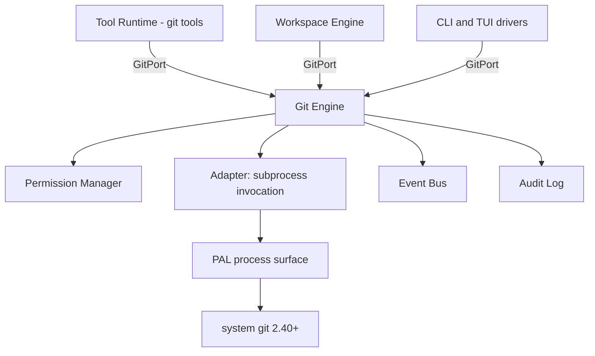
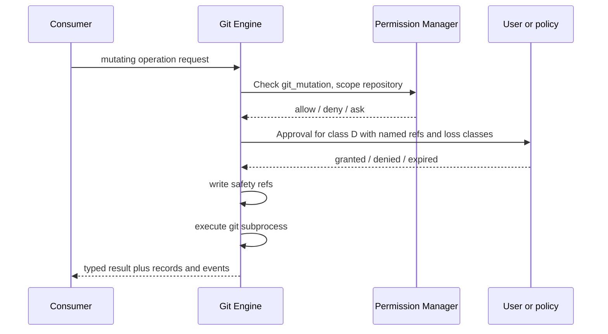

# 01 — Git Engine

The Git Engine is the single component through which Andromeda reads and mutates Git
repositories. ADR-025 fixes its construction — system `git` (minimum 2.40) behind an
encapsulated adapter inside the PAL boundary — and Volume 3 chapter 02 freezes GitPort, its
consumer-facing contract. This chapter owns the behavioral elaboration: repository
discovery, the full operation catalog with permissions and confirmations, output fidelity,
the destructive-operation policy, and the E-GIT error family. Product-side hosting
integrations are chapter [02](02-github-gitlab-product-integrations.md); the `andromeda`
repository's own development process is chapters 03–07.

Two rules from ADR-025 bind everything below: no component outside the Git Engine invokes
git or parses git output, and Andromeda's view of a repository MUST match what the user's
own `git` invocations report.

## Architecture



The diagram shows the mediation structure. Three consumer groups reach the Git Engine only
through GitPort: the Tool Runtime (the built-in git tools of the Volume 6 catalog), the
Workspace Engine (repository discovery during workspace open), and the CLI/TUI drivers (the
`andromeda git` command group, whose grammar Volume 8 owns). Inside the engine, every
mutating call first consults the Permission Manager (PermissionPort); the adapter then
spawns the git subprocess through the PAL process surface with a filtered environment,
parses machine-readable output, and maps failures into the E-GIT family. Every operation
emits `git.*` events; every mutation and every refusal lands in the Audit Log. The Terminal
Engine is deliberately absent: per the Volume 3 port ownership map, the Git Engine uses the
PAL directly and never routes through TerminalPort.

## Invocation discipline

1. **Binary resolution.** The engine resolves the git binary from `git.binary_path` when
   set, otherwise from `PATH` through the PAL. Resolution happens once per process and is
   re-checked when configuration changes (ConfigPort watch).
2. **Version gate.** At first use per process, `Version` runs `git --version`, parses the
   triple, and refuses all operation below 2.40 with E-GIT-002. The floor is ADR-025's and
   is not configurable.
3. **Environment filtering.** Subprocesses receive a deny-by-default environment (ADR-021
   posture): `PATH`, `HOME`, locale variables pinned to `LC_ALL=C`, and the `GIT_*`
   variables required for correct user behavior (`GIT_CONFIG_*` passthrough,
   `GIT_TERMINAL_PROMPT=0`). Secrets never enter the environment; credential material is
   the user's own git credential-helper configuration, which the engine neither reads nor
   replaces.
4. **Non-interactivity.** Every invocation runs with prompts disabled
   (`GIT_TERMINAL_PROMPT=0`, `GIT_EDITOR=true` for operations that would open editors).
   An operation that would require interactive input fails with a structured error instead
   of hanging (E-GIT-009 for credential prompts on remotes; E-GIT-011 for unexpected
   interactive states).
5. **Machine-readable formats only.** Parsing uses porcelain v2 (`status
   --porcelain=v2 -z`), NUL-terminated outputs (`-z`), `log`/`for-each-ref` with explicit
   `--format` strings, and `diff` in unified format with explicit rename detection flags.
   Output with no stable format is not parsed; such data is surfaced verbatim or the
   operation is not offered.
6. **Timeouts and cancellation.** Every invocation carries a deadline —
   `git.operation_timeout_seconds` for local operations, `git.remote_timeout_seconds` for
   remote ones — and honors context cancellation per FR-ARCH-004: the subprocess tree is
   terminated through the PAL, partial completion is reported honestly, and the error is
   E-GIT-010.
7. **Serialization.** Read operations run concurrently. Mutating operations on one
   repository serialize inside the engine (Volume 3 GitPort concurrency rule); worktrees of
   the same repository share the mutation lock for ref-touching operations and hold
   per-worktree locks for tree-touching ones.

## Operation catalog

The catalog below is the authoritative surface (ADR-145). Classes:

- **R** — read-only: no repository mutation. Permission: none beyond workspace `read`.
- **A** — additive mutation: creates content or refs without discarding anything
  (stage, commit, branch create, tag create, worktree add, fetch).
- **H** — history mutation: moves existing refs or rewrites draft history; recoverable via
  ordinary refs/reflog (merge, rebase onto unpushed work, cherry-pick, revert, soft/mixed
  reset, branch switch).
- **D** — destructive: can discard commits, staged content, or working-tree files (hard
  reset, force push, branch delete, clean, checkout overwriting local changes, worktree
  remove with dirty tree, history rewrite of published refs).
- **N** — remote: touches the network (fetch, pull, push, ls-remote); combined with the
  mutation class of its local effect.

Permission bindings use the frozen Volume 9 names: class A/H/D require `git_mutation`;
class N additionally requires `network`; class D additionally requires the ADR-146
confirmation. Scopes are `repository` (default) or `workspace`.

| Operation | Class | GitPort exposure | Phase |
|---|---|---|---|
| Repository discovery | R | via WorkspacePort discovery + `Status` | MVP |
| Version check | R | `Version` (frozen) | MVP |
| Status | R | `Status` (frozen) | MVP |
| Diff (worktree, staged, revisions) | R | `Diff` (frozen) | MVP |
| Log | R | `Log` (frozen) | MVP |
| Show | R | `Show` (frozen) | MVP |
| Branch list | R | `ListBranches` (frozen) | MVP |
| Stage / unstage | A | `Stage` / `Unstage` (frozen) | MVP |
| Commit | A | `Commit` (frozen) | MVP |
| Branch create | A | `CreateBranch` (frozen) | MVP |
| Branch switch | H | `SwitchBranch` (frozen) | MVP |
| Apply patch | A | `ApplyPatch` (frozen) | MVP |
| Worktree add / list / remove | A / R / D | `WorktreeAdd` / `WorktreeList` / `WorktreeRemove` (frozen) | MVP |
| Ignore-rule evaluation | R | via `Status` semantics | MVP |
| Blame | R | Beta additive batch (ADR-145) | Beta |
| Tag create / list / delete | A / R / D | Beta additive batch | Beta |
| Remote list / add / remove | R / A / H | Beta additive batch | Beta |
| Fetch | A+N | Beta additive batch | Beta |
| Pull (fetch + integrate) | H+N | Beta additive batch | Beta |
| Push | A+N (force: D+N) | Beta additive batch | Beta |
| Merge | H | Beta additive batch | Beta |
| Rebase | H (published refs: D) | Beta additive batch | Beta |
| Cherry-pick | H | Beta additive batch | Beta |
| Revert | A | Beta additive batch | Beta |
| Reset soft / mixed | H | Beta additive batch | Beta |
| Reset hard | D | Beta additive batch | Beta |
| Conflict inspection / resolution staging | R / A | Beta additive batch | Beta |
| Clean | D | Beta additive batch | Beta |
| Stash push / list / apply / drop | A / R / H / D | Beta additive batch | Beta |
| Submodule status / init / update | R / A / H | v1 additive batch | v1 |
| Sparse-checkout read / configure | R / H | v1 additive batch | v1 |
| LFS detection / status | R | v1 additive batch | v1 |
| Safety-ref list / restore | R / A | Beta additive batch (MVP-internal) | Beta |

Operations not exposed at the current phase are absent: the engine MUST NOT emulate them
through the terminal path or accept raw argument passthrough.

## Destructive-operation gate



The sequence shows ADR-146 in operation order. Every mutation asks the Permission Manager
first; a `deny` terminates with E-GIT-008 and an audit record. For class D operations, a
granted or standing permission is not sufficient: the engine raises an Approval (Volume 2
Approval states) that names the operation, the refs it will move or delete, and what can be
lost; non-interactive contexts require the explicit per-invocation flag Volume 8 defines
(`--approve-destructive`), and anything else is a denial (PRD-009). After confirmation, the engine writes safety refs
under `refs/andromeda/safety/<ulid>` for every ref about to move, then executes. Refusals
at any step are structured errors — never silent no-ops — and every decision is
audit-recorded. Constraint: the gate is inside the engine, so no consumer can skip it.

## Operation semantics

### Discovery and identity

Repository discovery walks upward from a starting path to the repository root, honoring
worktree indirection (`.git` file), bare repositories (reported, not operated on at MVP),
and submodule boundaries (a submodule path resolves to the submodule repository, with the
superproject reported in the result). Discovery integrates with WorkspacePort `Discover`;
a workspace MAY contain multiple repositories (reported per project). Results carry: root
path, common dir, current worktree, detached-HEAD state, and upstream configuration.

### Read queries

`Status` reports branch, upstream, ahead/behind, staged/unstaged/untracked/ignored/conflict
entries from porcelain v2. `Diff` streams hunks (DiffHunk) for worktree-vs-index,
index-vs-HEAD, and revision-pair specs with rename detection enabled. `Log` streams
CommitInfo with explicit format fields (hash, parents, author, committer, dates, subject,
body, trailers). `Show` returns one commit's detail including its patch. `ListBranches`
enumerates local and remote-tracking branches with tip, upstream, and ahead/behind. Blame
(Beta) reports per-line commit attribution honoring `.git-blame-ignore-revs` when
`git.blame.ignore_revs` is true. Read queries never mutate, never prompt, and are safe
under concurrency.

### Staging and commits

`Stage`/`Unstage` operate on explicit path lists (no implicit `-A` semantics; staging
everything requires the caller to enumerate or pass the documented all-paths marker
explicitly). `Commit` takes a CommitSpec: message, author override (only when the caller
supplies one explicitly), amend flag (class H; class D when amending a published commit),
sign-off flag, and signing per the signing rules below. The engine runs the user's
`commit-msg`/`pre-commit` hooks by default (hooks section). Message hygiene: the engine
MUST pass messages through verbatim and MUST NOT append attribution, advertising, or any
trailer identifying Andromeda, an AI tool, or a vendor (ADR-015 applies to product behavior
here, not only to the `andromeda` repository); when Andromeda generates a message for the
user it contains change information only. Empty commits are refused unless the spec sets
the explicit allow-empty flag.

### Branches, tags, worktrees

`CreateBranch` creates from a start point without switching unless asked. `SwitchBranch`
refuses to overwrite local modifications (E-GIT-011) unless the caller escalates to the
class D checkout-overwrite operation with confirmation. Branch deletion (Beta) is class D
when the branch is unmerged. Tags (Beta): annotated by default, lightweight on request;
tag deletion is class D. Worktree add creates linked worktrees (the mechanism Volume 4
workflows use for isolated task execution); worktree remove with a dirty tree is class D;
`WorktreeList` reports paths, HEADs, and lock state.

### Remotes: fetch, pull, push (Beta)

Remote operations bind `network` in addition to `git_mutation` (fetch mutates only
remote-tracking refs but still requires both, at `repository` scope). Credentials are
delegated entirely to the user's git configuration (credential helpers, SSH agent); the
engine never captures, stores, or injects remote credentials, and a credential prompt
situation surfaces as E-GIT-009 with remediation guidance. Pull is specified as fetch plus
explicit integration (merge or rebase per configuration or per-call choice) — never an
implicit strategy. Push refuses non-fast-forward without the force path; force push
requires `git.allow_force_push = true` plus the class D gate, uses
`--force-with-lease` semantics always (a plain `--force` is never issued), and is refused
outright against protected branches (E-GIT-012).

### History modification and conflicts (Beta)

Merge, rebase, cherry-pick, and revert run with `rerere` respected and never auto-resolve
conflicts silently. On conflict the operation stops in git's standard conflicted state,
emits `git.conflict.detected`, and returns E-GIT-006 carrying the conflicted path list and
the in-progress operation kind; the engine exposes conflict inspection (three-stage
content per path) and resolution staging, and completion/abort operations for the
in-progress state. Reset: soft and mixed are class H; hard is class D. Rebase of commits
reachable from any remote-tracking ref is classified D (published-history rewrite) —
the classification is computed, not asserted by the caller.

### Hooks, ignore rules, signing, submodules, sparse checkout, LFS

- **Hooks:** repository and user hooks run by default (`git.hooks.run = true`), because
  system git behavior is the fidelity contract. Bypassing hooks (`--no-verify`) is an
  explicit per-call option bound to the class D confirmation when the hook is a commit
  gate. Hook execution risk is RISK-GIT-003; Volume 9's threat model owns the
  malicious-repository threat class, and the sandbox tiers it defines for command execution
  do not apply to git-spawned hooks — the engine therefore surfaces which hooks exist in
  repository trust prompts at workspace open.
- **Ignore rules:** `.gitignore`/`info/exclude` semantics are git's; `Status` reports
  ignored entries only when asked. Andromeda-generated files inside `.andromeda/` are
  covered by ignore guidance in chapter 03 for the product's own repository and by
  Workspace Engine initialization for user repositories.
- **Signing:** `git.sign_commits = "auto"` (default) defers entirely to the user's
  `commit.gpgsign`/`gpg.format` configuration; `"always"`/`"never"` override per
  Andromeda-created commits only. The engine never manages signing keys; absence of a
  working signer surfaces as the underlying git error mapped to E-GIT-004 with the git
  stderr preserved.
- **Submodules (v1):** status/init/update with explicit recursion flags;
  `git.submodules.recurse` defaults to false so no operation touches submodules
  implicitly.
- **Sparse checkout (v1):** read and configure cone-mode patterns; the engine treats
  sparse-checkout state as part of `Status` fidelity from the moment the Beta batch ships.
- **LFS (v1):** detection only — the engine reports whether the repository uses LFS
  attributes and whether `git-lfs` is installed; it never installs tooling. Operations that
  would corrupt LFS content without the filter present are refused with remediation
  guidance (E-GIT-011).

### Protected branches

`git.protected_branches` (default `["main", "master", "release/*"]`) declares glob patterns
the engine protects **locally**: commit to, hard-reset of, force-push to, or deletion of a
matching branch is refused with E-GIT-012 unless the pattern is removed from configuration
— there is no per-call override, because hosting-side protection (chapter 03 for the
`andromeda` repository) is the authoritative layer and local protection exists to fail
fast before the network round-trip.

## Requirements

### FR-GIT-001 — Git Engine

- Type: Functional
- Status: Draft
- Priority: P0
- Phase: MVP
- Source: Provided
- Owner: Git Engine
- Affected components: Git Engine, Tool Runtime, Workspace Engine, CLI, TUI, Permission Manager
- Dependencies: ADR-025, ADR-145, ADR-146, ADR-016; FR-ARCH-003, FR-ARCH-004
- Related risks: RISK-GIT-001, RISK-GIT-002, RISK-GIT-003

#### Description

Andromeda MUST provide all Git functionality through one Git Engine implementing GitPort
(Volume 3 chapter 02) over the system git binary (minimum 2.40) per ADR-025. The engine
MUST expose exactly the operation catalog of this chapter at each operation's phase, MUST
evaluate `git_mutation` (and `network` where classed) through PermissionPort before any
mutation, MUST apply the ADR-146 destructive-operation gate to class D operations, and
MUST NOT execute any destructive operation silently. No other component invokes git or
parses git output.

#### Motivation

Git backs file-change tracking, patch review, workflow restore points (Volume 4), and the
product's hosting integrations. Divergence between Andromeda's Git view and the user's own
git output destroys trust (ADR-025); unmediated mutation would break the permission model
(PRD-005, PRD-006).

#### Actors

Agents (via git tools), the Workspace Engine, CLI/TUI users, workflows.

#### Preconditions

A resolvable git binary ≥ 2.40; a discovered repository for repository-scoped operations;
permission evaluation available.

#### Main flow

1. A consumer calls a GitPort method with a repository reference and spec.
2. The engine validates the version gate and repository state.
3. For mutations, the engine obtains a permission decision; for class D, the confirmation
   and safety refs of ADR-146.
4. The adapter spawns git with filtered environment, machine-readable flags, and deadline.
5. Output is parsed into typed results; File Change / Patch / Command records are written
   per Volume 2 attribution invariants; events are emitted.

#### Alternative flows

- Permission `ask` in an interactive context → Approval flow; on grant, continue at step 4.
- Version below floor → E-GIT-002 immediately, no subprocess.
- Cancellation mid-operation → subprocess tree terminated, partial state reported
  (E-GIT-010).

#### Edge cases

- Detached HEAD: read operations report it explicitly; branch-dependent mutations refuse
  with guidance rather than operating on an implicit branch.
- Bare repositories: discovery reports them; worktree-dependent operations refuse
  (E-GIT-011).
- Concurrent external mutation (user runs git in another terminal): the engine detects
  changed refs on next read and never caches across operations without revalidation.
- Repository owned by another user / `safe.directory` refusal: surfaced as E-GIT-003 with
  git's remediation text.

#### Inputs

GitPort method arguments (RepoRef, specs); configuration under `[git]`; permission
decisions.

#### Outputs

Typed operation results and streams; File Change, Patch, and Command Execution records;
`git.*` events; audit records.

#### States

The engine is stateless between calls except caches invalidated on ref change; entity
state vocabularies it touches are Volume 2's (Patch `proposed`→`applied`, Command
Execution outcomes).

#### Errors

E-GIT-001 through E-GIT-012 (this chapter); every subprocess failure maps into the family
with git's stderr preserved as safe technical detail.

#### Constraints

System git ≥ 2.40 only; machine-readable formats only; no TerminalPort usage; mutations
serialize per repository; ADR-023 cancellation semantics.

#### Security

All mutations permission-mediated; class D dual-gated; environment deny-by-default; no
credential handling; hook execution surfaced in trust prompts; audit records for every
decision (PRD-006).

#### Observability

Events per operation family; spans per invocation (TelemetryPort) carrying repository hash
(path digest, not path), operation, duration, exit class; counters for refusals and
conflicts.

#### Performance

Latency budgets for status/diff on reference repositories are Volume 12's; the structural
requirement here is one subprocess per operation and streaming for `Diff`/`Log`.

#### Compatibility

Behavior identical across Tier 1 platforms; version floor per ADR-025 with its review
condition; porcelain v2 and NUL-terminated formats as the parsing contract.

#### Acceptance criteria

- Given a repository with staged, unstaged, untracked, and conflicted paths, when `Status`
  runs, then its report is field-equivalent to `git status --porcelain=v2 -z` for the same
  tree.
- Given an agent holding no `git_mutation` grant, when it requests `Commit`, then the
  engine returns the denial decision path (E-GIT-008 on `deny`), no subprocess is spawned,
  and an audit record with the correlation ID exists.
- Given a class D operation in a non-interactive session without the explicit flag, when
  requested, then it is refused with E-GIT-007 and the refusal event is emitted.
- Given git 2.39 on `PATH`, when any operation is attempted, then E-GIT-002 is returned
  and the diagnostic names the found and required versions.
- Observability: given any completed mutation, when its records are inspected, then the
  File Change / Patch records resolve to run, task, tool invocation, and permission
  decision per the Volume 1 traceability metric (SM-13).

#### Verification method

Contract test suite for every GitPort method including cancellation and pre-cancelled
contexts (FR-ARCH-004); equivalence suite against raw git output on fixture repositories
(NFR-GIT-001); permission-enforcement tests attempting unmediated mutation; Tier 1
platform matrix runs.

#### Traceability

PRD-004, PRD-005, PRD-006; MVP minimum item 12; ADR-025, ADR-145, ADR-146; SM-13.

### FR-GIT-002 — Repository discovery and version gating

- Type: Functional
- Status: Draft
- Priority: P0
- Phase: MVP
- Source: Provided
- Owner: Git Engine
- Affected components: Git Engine, Workspace Engine, CLI, TUI
- Dependencies: FR-GIT-001; ADR-022, ADR-025
- Related risks: RISK-GIT-001

#### Description

The Git Engine MUST discover repositories by upward traversal from a starting path,
resolving linked worktrees, submodule boundaries, and bare repositories, and MUST gate all
operation on a verified git version ≥ 2.40, re-verified when the resolved binary changes.

#### Motivation

Every downstream Git behavior depends on knowing which repository (and which worktree) a
path belongs to, and on the parsing contract the version floor guarantees.

#### Actors

Workspace Engine (workspace open), CLI/TUI (explicit repo operations), agents.

#### Preconditions

A readable starting path.

#### Main flow

1. Traverse upward until a `.git` directory or file is found.
2. Resolve `.git` files (worktrees, submodules) to the common dir.
3. Report root, common dir, worktree, HEAD state, and upstream summary.
4. On first engine use, run and cache the version check.

#### Alternative flows

- No repository found → a typed "not a repository" result for discovery (not an error);
  operations on the path then fail with E-GIT-003.
- Multiple nested repositories → the nearest root wins; the enclosing root is reported as
  context.

#### Edge cases

- Symlinked paths resolve through the PAL realpath rules before traversal.
- `GIT_DIR`/`GIT_WORK_TREE` environment overrides are ignored (the engine controls its
  environment; explicit RepoRef is the only selector).
- Filesystem roots and permission-denied ancestors terminate traversal cleanly.

#### Inputs

Starting path; configuration `git.binary_path`.

#### Outputs

Discovery result; cached GitVersion.

#### States

None beyond process-lifetime caches invalidated on configuration change.

#### Errors

E-GIT-001 (binary not found), E-GIT-002 (version below floor), E-GIT-003 (not a
repository, on operations).

#### Constraints

Discovery MUST NOT spawn git for the traversal itself (pure filesystem walk); the version
check is one subprocess per resolution.

#### Security

Traversal never crosses into paths the workspace `read` permission scope excludes;
`safe.directory` refusals are surfaced, never overridden.

#### Observability

`git.repository.discovered` event with repository count per workspace; version-gate
failures emit `git.operation.refused`.

#### Performance

Discovery is O(path depth) filesystem statting; budgets fall under Volume 12 workspace
open targets.

#### Compatibility

Worktree and submodule `.git` file indirection per current git documentation; identical
on Tier 1 platforms.

#### Acceptance criteria

- Given a linked worktree path, when discovery runs, then root, common dir, and worktree
  path are all reported correctly.
- Given a path outside any repository, when discovery runs, then the result is "not a
  repository" and no error is raised.
- Given `git.binary_path` pointing at git 2.38, when an operation runs, then E-GIT-002
  names 2.38 and 2.40.
- Negative: given an unreadable ancestor directory, when discovery runs, then traversal
  stops with a typed partial result, not a crash.

#### Verification method

Fixture-tree unit tests (worktrees, submodules, bare, nested, symlinks); version-gate
tests with stub binaries; Tier 1 matrix.

#### Traceability

FR-GIT-001; ADR-025; Volume 4 workspace lifecycle (WorkspacePort `Discover`).

### FR-GIT-003 — Read-query fidelity: status, diff, log, show, blame

- Type: Functional
- Status: Draft
- Priority: P0
- Phase: MVP
- Source: Provided
- Owner: Git Engine
- Affected components: Git Engine, TUI, CLI, Context Manager (diff context)
- Dependencies: FR-GIT-001, FR-GIT-002
- Related risks: RISK-GIT-001

#### Description

Read queries MUST be parsed exclusively from machine-readable git output (porcelain v2,
NUL-terminated, explicit formats) and MUST be content-equivalent to direct git invocation
on the same repository state. `Diff` and `Log` MUST stream. Blame ships in the Beta batch
(ADR-145) honoring ignore-revs configuration.

#### Motivation

Users judge Andromeda's repository view against their own git output; the TUI's diff
review and the agent's change awareness are built on these queries.

#### Actors

TUI panels, CLI commands, agents, Context Manager.

#### Preconditions

Discovered repository; version gate passed.

#### Main flow

1. Consumer issues a query spec.
2. Engine invokes git with pinned format flags and streams/parses output.
3. Typed results return; no records are written (reads are effect-free).

#### Alternative flows

- Repository mutated concurrently → results reflect git's own snapshot semantics; the
  engine adds the ref generation observed so consumers can detect staleness.

#### Edge cases

- Renames and copies: detection flags pinned so results are stable across git defaults.
- Binary files: diffs mark binary content; content is never inlined (Volume 7 handles
  large/binary context policy).
- Non-UTF-8 paths and content: passed through as bytes with explicit encoding marking
  (`-z` framing).
- Empty repository (no HEAD): status and log return typed empty results, not errors.

#### Inputs

Query specs (DiffSpec, LogSpec, revision references).

#### Outputs

RepoStatus, DiffHunk streams, CommitInfo streams, CommitDetail, blame line attributions
(Beta).

#### States

None.

#### Errors

E-GIT-003, E-GIT-004, E-GIT-005, E-GIT-010.

#### Constraints

No pager, no color, `LC_ALL=C`, explicit `--no-ext-diff`; streams bounded per ADR-023
backpressure.

#### Security

Read scope only; results carry repository content and are subject to the consumer's
redaction duties (logs never embed diff bodies — Volume 10 rules).

#### Observability

Per-query spans; parse-failure counter (E-GIT-005 occurrences are defects to
investigate).

#### Performance

Streaming begins before subprocess exit; budgets per Volume 12 (git status latency on the
reference repository).

#### Compatibility

Formats pinned to the 2.40 floor; version-specific format changes are adapter maintenance
guarded by per-version tests (ADR-025 risk note).

#### Acceptance criteria

- Given the equivalence fixture set, when `Status`/`Diff`/`Log` run, then parsed results
  match the direct git invocation field-for-field (0 divergences, NFR-GIT-001).
- Given a 100k-commit history, when `Log` streams, then the first item arrives before the
  subprocess completes and cancellation mid-stream kills the subprocess.
- Negative: given output the parser cannot interpret (injected corruption), when parsing
  fails, then E-GIT-005 carries the operation and a bounded output sample, and no partial
  result is returned as if complete.
- Permission: reads require no `git_mutation`; a workspace without `read` scope for the
  path refuses before invocation.

#### Verification method

Equivalence suite on fixtures (renames, binaries, non-UTF-8, empty repo, conflicts);
streaming and cancellation contract tests; fuzzed parser tests (ADR-017 native fuzzing).

#### Traceability

FR-GIT-001; NFR-GIT-001; PRD-008 (TUI diff review); SM-07 indirectly.

### FR-GIT-004 — Staging and commit creation

- Type: Functional
- Status: Draft
- Priority: P0
- Phase: MVP
- Source: Provided
- Owner: Git Engine
- Affected components: Git Engine, Execution Engine, CLI, TUI
- Dependencies: FR-GIT-001; ADR-015, ADR-146
- Related risks: RISK-GIT-002, RISK-GIT-003

#### Description

`Stage`, `Unstage`, and `Commit` MUST operate on explicit path lists and explicit
CommitSpecs, run user hooks by default, pass commit messages through verbatim, and MUST
NOT add any attribution or advertising content to messages. Amend of a published commit
is classified destructive.

#### Motivation

Commits are the product's most frequent Git mutation (UC-level flows in Volume 1) and the
place where ADR-015's message rules meet product behavior.

#### Actors

Agents (git tools), CLI/TUI users, workflows (restore points).

#### Preconditions

Repository discovered; `git_mutation` decision `allow`; clean enough state per operation
(commit requires staged content unless allow-empty).

#### Main flow

1. Consumer stages explicit paths; engine validates paths exist in the worktree/index.
2. Consumer submits CommitSpec.
3. Engine runs hooks (unless explicitly bypassed per the hook rules), creates the commit,
   returns the CommitID.
4. File Change and Patch records update; `git.commit.created` emits.

#### Alternative flows

- `commit-msg`/`pre-commit` hook rejects → E-GIT-004 with hook stderr; no bypass without
  the explicit bypass option.
- Amend requested on a commit reachable from a remote-tracking ref → class D gate first.

#### Edge cases

- Partial staging of a file (hunk-level) is OUT OF SCOPE at MVP; the catalog notes it as a
  Future candidate through `ApplyPatch` to the index.
- Committing during an in-progress merge preserves merge parents; during rebase it is
  refused with guidance (E-GIT-011).
- Author/committer identity comes from the user's git config; a missing identity surfaces
  git's own error with remediation, never a fabricated identity.

#### Inputs

Path lists; CommitSpec (message, amend, allow-empty, sign-off, signing choice).

#### Outputs

CommitID; updated records; events.

#### States

Patch records move `proposed` → `applied` when commits realize reviewed patches (Volume 2
vocabulary).

#### Errors

E-GIT-004, E-GIT-007 (amend-published without confirmation), E-GIT-008, E-GIT-011.

#### Constraints

Messages verbatim; no implicit `-A`; hooks honored by default; serialization per
repository.

#### Security

Message content is user/agent data — the engine never injects tool identity (ADR-015);
hook execution risk per RISK-GIT-003; permission and audit per FR-GIT-001.

#### Observability

`git.commit.created` with commit hash, ref, and correlation IDs; hook rejections
countable.

#### Performance

One subprocess per stage/commit call; Volume 12 owns budgets.

#### Compatibility

Hook behavior is system git's; identical semantics across Tier 1 platforms.

#### Acceptance criteria

- Given staged changes and a message containing only change information, when `Commit`
  runs, then `git log -1 --format=%B` returns the message byte-identical.
- Given a CommitSpec from an agent, when the engine builds the commit, then no
  `Co-Authored-By`, "Generated with", or vendor/tool attribution appears in the message
  even if the agent proposed one — the engine strips nothing silently; it refuses the
  spec with E-GIT-007 guidance naming the ADR-015 rule.
- Given a rejecting `pre-commit` hook, when `Commit` runs, then E-GIT-004 carries the
  hook's stderr and the commit does not exist.
- Permission: given decision `deny`, then no subprocess spawns and the audit record
  exists.

#### Verification method

Unit and integration tests over fixture repositories with hooks; message byte-equivalence
tests; attribution-refusal tests; permission-enforcement tests.

#### Traceability

FR-GIT-001; ADR-015, ADR-146; Volume 2 Patch vocabulary; MVP minimum item 12.

### FR-GIT-005 — Branches, tags, and worktrees

- Type: Functional
- Status: Draft
- Priority: P1
- Phase: MVP
- Source: Provided
- Owner: Git Engine
- Affected components: Git Engine, Workflow Engine, CLI, TUI
- Dependencies: FR-GIT-001; ADR-145, ADR-146
- Related risks: RISK-GIT-002

#### Description

The engine MUST provide branch creation/listing/switching and worktree add/list/remove at
MVP (frozen GitPort methods) and tags plus branch deletion in the Beta batch. Switching
MUST NOT overwrite local modifications; unmerged-branch deletion, tag deletion, and
dirty-worktree removal are destructive class.

#### Motivation

Branch and worktree flows underpin the Volume 11 branching process and Volume 4 workflow
isolation (worktree-per-task execution).

#### Actors

Agents, workflows, CLI/TUI users.

#### Preconditions

Repository discovered; permissions per class.

#### Main flow

1. Consumer requests branch/worktree operation with explicit spec.
2. Engine validates target state (existence, merge status, dirty state).
3. Permission (and confirmation for class D) evaluated; operation executes; events emit.

#### Alternative flows

- Switch with dirty tree → E-GIT-011 with the modified path list; the caller may escalate
  to the class D overwrite variant.
- Worktree add on an already-checked-out branch → git's refusal surfaced with the
  worktree that holds it.

#### Edge cases

- Branch names are validated against `git check-ref-format` rules before invocation.
- Worktree paths inside the repository or inside another worktree are refused.
- Detached-HEAD worktrees are supported for workflow restore points.

#### Inputs

BranchSpec, WorktreeSpec, names, start points.

#### Outputs

BranchInfo, WorktreeInfo, events.

#### States

None beyond repository state.

#### Errors

E-GIT-004, E-GIT-007, E-GIT-008, E-GIT-011, E-GIT-012.

#### Constraints

No implicit branch switching on create; worktree removal never deletes untracked user
data without the class D gate.

#### Security

Protected-branch patterns apply to deletion and force operations; permission and audit
per FR-GIT-001.

#### Observability

`git.branch.created`, `git.branch.switched`, `git.tag.created`, `git.worktree.added`,
`git.worktree.removed`.

#### Performance

Volume 12 budgets; worktree add cost is git's checkout cost, streamed progress not
required at MVP.

#### Compatibility

Worktree semantics per system git; Tier 1 identical.

#### Acceptance criteria

- Given a dirty worktree, when `SwitchBranch` runs, then it refuses with E-GIT-011 and
  the worktree is unchanged.
- Given an unmerged branch, when deletion is requested without confirmation, then
  E-GIT-007; with confirmation, then a safety ref exists pointing at the deleted tip.
- Given a workflow task, when it requests an isolated worktree, then `WorktreeAdd`
  produces a worktree whose HEAD matches the requested revision and `WorktreeList`
  reports it.
- Negative: worktree removal with untracked files present requires the class D gate;
  refusal leaves files intact.

#### Verification method

Integration tests over fixtures (dirty trees, unmerged branches, locked worktrees);
safety-ref restore tests; permission tests.

#### Traceability

FR-GIT-001; ADR-145, ADR-146; Volume 4 workflow rollback (git restore points).

### FR-GIT-006 — Remote operations: fetch, pull, push

- Type: Functional
- Status: Draft
- Priority: P1
- Phase: Beta
- Source: Provided
- Owner: Git Engine
- Affected components: Git Engine, CLI, TUI, Workflow Engine
- Dependencies: FR-GIT-001; ADR-145, ADR-146; FR-SEC-100
- Related risks: RISK-GIT-002, RISK-GIT-004

#### Description

Fetch, pull, and push MUST bind `network` plus `git_mutation`, delegate credentials
entirely to the user's git configuration, use lease-protected force semantics
exclusively, and refuse force pushes to protected branches. Pull MUST be an explicit
fetch-plus-integration, never an implicit strategy choice.

#### Motivation

Remote synchronization completes the engineering loop (push for PR creation, chapter 02)
while remote mutation is the highest-blast-radius Git action the product performs.

#### Actors

CLI/TUI users, agents under grant, workflows (release preparation).

#### Preconditions

Beta batch exposed; remote configured; permissions granted.

#### Main flow

1. Consumer requests fetch/pull/push with explicit remote and refspecs.
2. Permission evaluation (`git_mutation` + `network`, scope `repository`).
3. Engine invokes git with `GIT_TERMINAL_PROMPT=0` and the remote deadline.
4. Result reports transferred refs, ahead/behind changes; events emit.

#### Alternative flows

- Credential helper requires interaction → E-GIT-009 with guidance to configure helpers
  or agent; the engine never prompts for or stores remote credentials.
- Non-fast-forward push → refusal with the divergence summary; caller may request the
  force path (class D gate; lease semantics).

#### Edge cases

- Diverged upstream during pull with rebase integration: conflicts follow FR-GIT-007
  semantics.
- Partial/shallow clones: fetch honors existing shallow boundaries; deepening is an
  explicit option.
- Push of a safety ref namespace is refused (never leaves the machine).

#### Inputs

Remote name, refspecs, integration choice (pull), force intent (push).

#### Outputs

Transfer reports; updated remote-tracking refs; events.

#### States

None beyond repository state.

#### Errors

E-GIT-007, E-GIT-008, E-GIT-009, E-GIT-010, E-GIT-012.

#### Constraints

`--force-with-lease` always; no URL rewriting; no credential capture; remote timeout
budget separate from local.

#### Security

Network permission explicit; credential material never touches Andromeda (delegation to
git helpers); push refusal on protected patterns; audit per mutation.

#### Observability

`git.remote.fetched`, `git.remote.pulled`, `git.remote.pushed` with ref counts and
remote host (hostname only, never URL userinfo).

#### Performance

Network-bound; the engine adds streaming progress surfacing where git provides
`--progress` machine output; budgets Volume 12.

#### Compatibility

Transport support (SSH, HTTPS) is system git's; identical behavior across Tier 1.

#### Acceptance criteria

- Given no standing `network` grant, when fetch is requested non-interactively, then it
  is refused (decision path) and audited.
- Given a push racing a concurrent remote update, when the lease check fails, then the
  push is refused with the stale-info error and no remote ref moved.
- Given `git.allow_force_push = false`, when a force push is requested, then E-GIT-007
  names the configuration key; with it true but the branch protected, then E-GIT-012.
- Given a credential prompt situation, when push runs, then E-GIT-009 returns within the
  remote deadline and no hang occurs.

#### Verification method

Integration tests against local fixture remotes (file and daemon transports);
lease-race tests; permission matrix tests; timeout injection.

#### Traceability

FR-GIT-001; ADR-145, ADR-146; chapter 02 change-request flows; FR-SEC-100.

### FR-GIT-007 — History modification, conflicts, and recovery

- Type: Functional
- Status: Draft
- Priority: P1
- Phase: Beta
- Source: Provided
- Owner: Git Engine
- Affected components: Git Engine, CLI, TUI, Workflow Engine
- Dependencies: FR-GIT-001; ADR-145, ADR-146
- Related risks: RISK-GIT-002

#### Description

Merge, rebase, cherry-pick, revert, reset, stash, and clean MUST follow the catalog's
class assignments, stop honestly on conflicts with typed conflict state, classify
published-history rewrites as destructive by computation, and record safety refs before
every class D execution. The engine MUST provide listing and restoration of safety refs.

#### Motivation

History surgery is where users lose work; the brief's no-silent-destruction constraint
and the Volume 0 data-integrity precedence are operationalized here.

#### Actors

CLI/TUI users, agents under grant, workflows (rollback compensation).

#### Preconditions

Beta batch exposed; repository in a compatible state (no unrelated in-progress
operation).

#### Main flow

1. Consumer requests the operation with explicit spec.
2. Class computed (including published-rewrite detection against remote-tracking refs).
3. Gates per class; safety refs written for class D.
4. Execution; on success, events and records; on conflict, typed stop.

#### Alternative flows

- Conflict → `git.conflict.detected`, E-GIT-006 with conflicted paths; consumer uses
  inspection/resolution staging, then completes or aborts the in-progress operation.
- Abort → repository restored to the pre-operation state git guarantees; the engine
  verifies HEAD/index restoration and reports divergence as E-GIT-011 if verification
  fails.

#### Edge cases

- Nested in-progress states (rebase during unresolved merge) are refused up front.
- Octopus merges: OUT OF SCOPE for the product surface (git CLI remains available to
  users).
- Stash apply conflicts follow the same conflict semantics; stash drop is class D.
- Clean respects ignore rules and requires path enumeration in the confirmation.

#### Inputs

Operation specs (targets, strategies, continuation commands).

#### Outputs

Operation results, conflict state reports, safety-ref identifiers.

#### States

In-progress git operation states (merge/rebase/cherry-pick heads) are reported in
`Status` fidelity.

#### Errors

E-GIT-004, E-GIT-006, E-GIT-007, E-GIT-008, E-GIT-010, E-GIT-011.

#### Constraints

`rerere` respected; no auto-resolution; safety refs O(refs) cost; restoration executable
offline.

#### Security

Class D dual gate; computed classification cannot be overridden by the caller; audit for
every gate outcome.

#### Observability

`git.merge.completed`, `git.rebase.completed`, `git.history.rewritten`,
`git.conflict.detected`, `git.conflict.resolved`, `git.safety_ref.created`.

#### Performance

Operations are git-bound; the engine's overhead budget per Volume 12; safety-ref writes
add one ref write per moved ref.

#### Compatibility

Strategy availability per system git version; Tier 1 identical.

#### Acceptance criteria

- Given a rebase of commits reachable from `origin/main`, when requested, then the class
  is D regardless of caller claims, and without confirmation E-GIT-007 results.
- Given a confirmed hard reset, when it executes, then a safety ref exists whose target
  is the pre-reset HEAD and restoration reproduces the pre-reset state offline.
- Given a merge conflict, when the operation stops, then `Status` reports the conflicted
  paths, three-stage inspection returns all stages, and abort restores the pre-merge
  HEAD.
- Negative: a second history operation while one is in progress is refused with
  E-GIT-011 naming the in-progress kind.

#### Verification method

Conflict-matrix integration tests; published-rewrite classification property tests;
safety-ref restore round-trips; abort-verification tests; offline execution of recovery.

#### Traceability

FR-GIT-001; ADR-146; Volume 4 FR-WF-007 (rollback restore points); Volume 0 precedence
item 3.

### FR-GIT-008 — Repository feature passthrough: hooks, ignore, signing, submodules, sparse checkout, LFS

- Type: Functional
- Status: Draft
- Priority: P1
- Phase: MVP
- Source: Provided
- Owner: Git Engine
- Affected components: Git Engine, CLI, TUI
- Dependencies: FR-GIT-001; ADR-025, ADR-145
- Related risks: RISK-GIT-003

#### Description

The engine MUST honor the user's repository configuration as system git does: hooks run
by default, ignore rules apply, signing follows user configuration under
`git.sign_commits = "auto"`. Submodule, sparse-checkout, and LFS management operations
ship per the catalog (v1); before those ship, the engine MUST still report their presence
truthfully in status and discovery and refuse operations that would corrupt LFS content
when the filter is absent.

#### Motivation

Fidelity (ADR-025) means the user's configured Git world keeps working — Andromeda
neither bypasses hooks silently nor produces unsigned commits where the user configured
signing.

#### Actors

CLI/TUI users, agents; repository authors (hook/attribute owners).

#### Preconditions

Repository discovered.

#### Main flow

1. Operations execute with the user's config effective (no `-c` overrides beyond the
   invocation-discipline set).
2. Feature presence (hooks, LFS attributes, sparse state, submodules) is reported in
   discovery/status results.

#### Alternative flows

- Hook bypass explicitly requested → allowed only with the class D confirmation when the
  hook gates commits; recorded in the audit trail.
- LFS repository without `git-lfs` installed → content-touching operations refuse with
  remediation (E-GIT-011); read-only queries proceed.

#### Edge cases

- `core.hooksPath` redirection is honored and the effective hook directory reported in
  trust prompts.
- Ignored-but-tracked files behave per git semantics; the engine adds no ignore logic of
  its own.
- Signing failures (missing key, expired) surface git's error verbatim (E-GIT-004).

#### Inputs

Repository configuration (read via git itself), `[git]` keys.

#### Outputs

Truthful feature reporting; configured-behavior execution.

#### States

None.

#### Errors

E-GIT-004, E-GIT-007 (bypass without confirmation), E-GIT-011.

#### Constraints

No silent `--no-verify`; no signing-key management; no automatic tool installation.

#### Security

Hook code execution is the RISK-GIT-003 vector: hook presence is part of the workspace
trust prompt; Volume 9's threat model owns the mitigation posture for malicious
repositories.

#### Observability

Hook execution outcomes attached to the triggering operation's span; bypass usage
audited and counted.

#### Performance

Hook cost is user code; the engine attributes it separately in spans so budgets
(Volume 12) exclude it.

#### Compatibility

Exactly system git's semantics; Tier 1 identical.

#### Acceptance criteria

- Given a repository with `commit.gpgsign = true` and a working signer, when Andromeda
  creates a commit under `"auto"`, then the commit is signed.
- Given a `pre-commit` hook, when commit runs, then the hook executed (observable side
  effect fixture) unless bypass was explicitly confirmed, and the bypass is audited.
- Given an LFS repository without the filter installed, when a checkout-class operation
  is requested, then E-GIT-011 names the missing tooling; status still reports
  truthfully.
- Negative: no operation passes `--no-verify` without a recorded confirmation.

#### Verification method

Fixture repositories with hooks, attributes, LFS pointers, sparse profiles, submodules;
signed-commit verification in tests where a test key exists; audit-record assertions.

#### Traceability

FR-GIT-001; ADR-025, ADR-145, ADR-146; Volume 9 malicious-repository threat class.

### NFR-GIT-001 — Git output fidelity

- Category: Compatibility
- Priority: P0
- Phase: MVP
- Metric: Field-level divergences between Git Engine results and direct system-git
  machine-readable output on the equivalence fixture set (status, diff, log, show,
  branches; conflict, rename, binary, non-UTF-8, worktree, and sparse fixtures)
- Target: 0 divergences per release
- Minimum threshold: 0 divergences (fidelity is the ADR-025 contract; no tolerance)
- Measurement method: automated equivalence suite comparing parsed engine results against
  direct git invocation on the same fixture state, run in CI per merge and per release
- Test environment: Tier 1 platforms, pinned git versions from 2.40 to current stable
- Measurement frequency: every merge to `main`; full version matrix per release
- Owner: Git Engine
- Dependencies: FR-GIT-001, FR-GIT-003
- Risks: RISK-GIT-001
- Acceptance criteria: The equivalence suite passes with 0 divergences on every Tier 1
  platform and every git version in the support matrix; any divergence blocks release
  until fixed or the fixture is reclassified by recorded decision.

### NFR-GIT-002 — Destructive-operation recoverability

- Category: Reliability
- Priority: P0
- Phase: Beta
- Metric: (a) Fraction of executed class D operations preceded by a verifiable safety
  ref covering every moved/deleted ref; (b) success rate of scripted restoration from
  safety refs, executed offline
- Target: (a) 100%; (b) 100%
- Minimum threshold: (a) 100%; (b) 100% (a single unrecoverable confirmed operation is a
  release blocker)
- Measurement method: instrumented destructive-operation test campaign (hard reset,
  forced push to fixture remotes, branch/tag deletion, clean, dirty worktree removal)
  with post-operation restoration and content comparison; offline condition per Volume 1
  reference conditions
- Test environment: Tier 1 platforms, reference repository scale fixtures
- Measurement frequency: every merge touching the Git Engine; full campaign per release
- Owner: Git Engine
- Dependencies: FR-GIT-005, FR-GIT-006, FR-GIT-007; ADR-146
- Risks: RISK-GIT-002
- Acceptance criteria: Every class D execution in the campaign has its safety ref(s)
  recorded before mutation; restoration reproduces pre-operation ref targets and, for
  working-tree snapshots, pre-operation content; all restorations complete offline.

## Risks

### RISK-GIT-001 — Git version and output-format drift

- Category: Technical
- Probability: Medium
- Impact: High
- Severity: High
- Mitigation: machine-readable formats only (porcelain v2, NUL-terminated, explicit
  formats); NFR-GIT-001 equivalence suite across the pinned version matrix; ADR-025
  version-floor review at phase gates; parser fuzzing
- Detection: equivalence-suite failures; E-GIT-005 telemetry counter rising on user
  installations
- Owner: Git Engine
- Status: Open

### RISK-GIT-002 — User data loss through destructive operations

- Category: Product / safety
- Probability: Medium
- Impact: High
- Severity: Critical
- Mitigation: ADR-146 dual gate; computed destructive classification; safety refs with
  30-day retention; NFR-GIT-002 recoverability gate; protected-branch refusal
- Detection: audit records of class D executions; data-loss incident reports; safety-ref
  restoration telemetry
- Owner: Git Engine
- Status: Open

### RISK-GIT-003 — Repository hooks as arbitrary code execution

- Category: Security
- Probability: Medium
- Impact: High
- Severity: High
- Mitigation: hook presence surfaced in workspace trust prompts; hook execution
  attributed and audited per operation; Volume 9 malicious-repository threat mitigations
  (trust-on-open model); hooks never run during read-only queries
- Detection: audit trail of operations that executed hooks; Volume 9 security event
  monitoring
- Owner: Git Engine (surface) / Volume 9 (threat posture)
- Status: Open

## Errors

### E-GIT-001 — Git binary not found

- Category: Environment
- Severity: Error
- User message: "Git is required but was not found. Install git 2.40 or newer, or set
  git.binary_path."
- Technical message: resolution strategy attempted (`git.binary_path` value or `PATH`
  search), PAL lookup result
- Cause: git not installed or not resolvable in the filtered environment
- Safe-to-log data: configured path presence (boolean), platform
- Recoverability: recoverable after installation/configuration
- Retry policy: none automatic; re-resolved on configuration change
- Recommended action: install git ≥ 2.40 via the platform package manager; verify with
  `git --version`
- Exit-code mapping: 3
- HTTP mapping: not applicable
- Telemetry event: `git.operation.refused`
- Security implications: none; no subprocess was spawned

### E-GIT-002 — Git version below minimum

- Category: Environment
- Severity: Error
- User message: "Git <found> is below the required minimum 2.40. Upgrade git to use Git
  features."
- Technical message: parsed version triple, binary path, ADR-025 floor
- Cause: installed git older than the parsing-contract floor
- Safe-to-log data: found version, required version
- Recoverability: recoverable after upgrade
- Retry policy: none automatic; re-checked on binary change
- Recommended action: upgrade git; on macOS via Homebrew, on Linux via the distribution
  or upstream packages
- Exit-code mapping: 3
- HTTP mapping: not applicable
- Telemetry event: `git.operation.refused`
- Security implications: none

### E-GIT-003 — Not a Git repository

- Category: Validation
- Severity: Error
- User message: "This path is not inside a Git repository."
- Technical message: starting path (workspace-relative), traversal terminus, git
  `safe.directory` refusal text when that is the cause
- Cause: operation addressed to a path with no repository, or git refused the repository
  (ownership rules)
- Safe-to-log data: workspace-relative path, refusal class
- Recoverability: recoverable (initialize a repository, correct the path, or fix
  `safe.directory`)
- Retry policy: none
- Recommended action: run inside a repository or initialize one; for ownership refusals
  follow git's `safe.directory` guidance
- Exit-code mapping: 1
- HTTP mapping: not applicable
- Telemetry event: `git.operation.refused`
- Security implications: `safe.directory` refusals are never overridden automatically

### E-GIT-004 — Git subprocess failed

- Category: Execution
- Severity: Error
- User message: "The git operation failed: <first line of git's error>."
- Technical message: argv (with paths workspace-relativized), exit code, bounded stderr,
  duration
- Cause: git returned a non-zero exit for a reason not covered by a more specific code
  (hook rejection, signing failure, object-store errors, …)
- Safe-to-log data: operation name, exit code, stderr excerpt after redaction rules
- Recoverability: depends on cause; the preserved git message is the diagnosis
- Retry policy: not retryable automatically (repository state may have changed)
- Recommended action: read the git error; the same operation via git directly will show
  identical behavior (fidelity contract)
- Exit-code mapping: 1
- HTTP mapping: not applicable
- Telemetry event: `git.operation.refused`
- Security implications: stderr passes Volume 10 redaction before logging (may contain
  paths; never credentials, since prompts are disabled)

### E-GIT-005 — Unparseable git output

- Category: Integrity
- Severity: Error
- User message: "Andromeda could not interpret git's output for <operation>. This is an
  Andromeda defect; the repository was not modified by the failed read."
- Technical message: operation, format flags used, bounded output sample, git version
- Cause: adapter parser mismatch with the installed git's machine-readable output
- Safe-to-log data: operation, git version, sample offsets (content sample only in debug
  logs per redaction rules)
- Recoverability: not recoverable in-place; the operation is unusable until fixed
- Retry policy: none (deterministic)
- Recommended action: report the defect with the diagnostic bundle; use git directly
  meanwhile
- Exit-code mapping: 1
- HTTP mapping: not applicable
- Telemetry event: `git.operation.refused`
- Security implications: output samples are treated as repository content under
  redaction rules

### E-GIT-006 — Operation stopped on conflicts

- Category: Conflict
- Severity: Warning
- User message: "<operation> stopped: <n> path(s) have conflicts to resolve."
- Technical message: in-progress operation kind, conflicted path list, current heads
- Cause: merge/rebase/cherry-pick/revert/stash-apply produced content conflicts
- Safe-to-log data: operation kind, conflict count (paths only in debug logs)
- Recoverability: recoverable: resolve and continue, or abort
- Retry policy: not applicable (interactive resolution state)
- Recommended action: inspect conflicts, resolve and continue, or abort to restore the
  pre-operation state
- Exit-code mapping: 1
- HTTP mapping: not applicable
- Telemetry event: `git.conflict.detected`
- Security implications: none

### E-GIT-007 — Destructive operation refused without confirmation

- Category: Policy
- Severity: Warning
- User message: "<operation> can discard work and requires explicit confirmation."
- Technical message: operation, computed class D rationale (refs to move, loss classes),
  missing gate (interactive Approval absent, or non-interactive flag absent, or
  configuration prerequisite like `git.allow_force_push` false)
- Cause: ADR-146 confirmation gate not satisfied
- Safe-to-log data: operation, gate that failed, ref names
- Recoverability: recoverable by re-invoking with confirmation
- Retry policy: none automatic — automation MUST NOT auto-confirm
- Recommended action: review the named refs and loss classes; confirm explicitly if
  intended
- Exit-code mapping: 5
- HTTP mapping: not applicable
- Telemetry event: `git.operation.refused`
- Security implications: refusal-by-default is the safety property; the refusal is
  audited

### E-GIT-008 — Git mutation permission denied

- Category: Permission
- Severity: Warning
- User message: "This action requires the git_mutation permission, which was denied."
- Technical message: permission query (permission, scope, subject), decision, policy
  source
- Cause: PermissionPort returned deny (or non-`allow` on a non-interactive path)
- Safe-to-log data: permission name, scope kind, decision
- Recoverability: recoverable via a granting decision or policy change
- Retry policy: none automatic
- Recommended action: grant the permission at an appropriate scope, or adjust policy
- Exit-code mapping: 5
- HTTP mapping: not applicable
- Telemetry event: `git.operation.refused`
- Security implications: the denial and its context are audit-recorded (PRD-006)

### E-GIT-009 — Remote operation failed

- Category: Network
- Severity: Error
- User message: "Could not reach or authenticate to remote '<remote>': <git's reason>."
- Technical message: remote name, host (no userinfo), transport, git stderr excerpt,
  whether a credential prompt was suppressed
- Cause: connectivity failure, remote rejection, or credential helper requiring
  interaction that Andromeda's non-interactive invocation suppresses
- Safe-to-log data: remote name, hostname, transport, failure class
- Recoverability: recoverable after connectivity/credential remediation
- Retry policy: retryable for connectivity classes with caller backoff; not retryable
  for auth classes
- Recommended action: verify network and the git credential configuration (helper or SSH
  agent); test with `git fetch` directly
- Exit-code mapping: 1 (4 when the failure class is authentication)
- HTTP mapping: not applicable
- Telemetry event: `git.remote.fetched` / `git.remote.pushed` failure variants via
  `git.operation.refused`
- Security implications: URLs are logged without userinfo; credentials never transit
  Andromeda

### E-GIT-010 — Git operation timed out or was cancelled

- Category: Timeout
- Severity: Warning
- User message: "The git operation was cancelled or exceeded its time limit."
- Technical message: operation, configured deadline, elapsed, cancellation reason
  (user/timeout/shutdown), subprocess termination result
- Cause: context cancellation or deadline expiry (FR-ARCH-004)
- Safe-to-log data: operation, deadline, elapsed, reason
- Recoverability: recoverable; repository state reported honestly (in-progress operation
  states surface in `Status`)
- Retry policy: caller MAY retry read operations; mutations require state inspection
  first
- Recommended action: re-run with a longer `git.operation_timeout_seconds` /
  `git.remote_timeout_seconds` if legitimate; inspect `Status` for in-progress state
- Exit-code mapping: 8
- HTTP mapping: not applicable
- Telemetry event: `git.operation.refused`
- Security implications: subprocess tree termination is verified (no orphaned git
  processes)

### E-GIT-011 — Repository state conflict

- Category: Validation
- Severity: Warning
- User message: "The repository's current state does not allow <operation>: <reason>."
- Technical message: blocking condition (dirty tree with path count, in-progress
  operation kind, bare repository, missing LFS filter, safety-ref namespace collision,
  detached HEAD where a branch is required)
- Cause: operation preconditions unmet
- Safe-to-log data: operation, condition class
- Recoverability: recoverable after resolving the named condition
- Retry policy: none automatic
- Recommended action: follow the condition-specific guidance in the message
- Exit-code mapping: 1
- HTTP mapping: not applicable
- Telemetry event: `git.operation.refused`
- Security implications: none

### E-GIT-012 — Protected branch refusal

- Category: Policy
- Severity: Warning
- User message: "Branch '<name>' matches a protected pattern; <operation> is not
  allowed."
- Technical message: branch, matching pattern, source of the pattern
  (`git.protected_branches`), operation
- Cause: commit/hard-reset/force-push/delete addressed at a protected pattern
- Safe-to-log data: branch name, pattern, operation
- Recoverability: recoverable by working on a non-protected branch or changing
  configuration deliberately
- Retry policy: none
- Recommended action: create a working branch; protected patterns exist to keep
  integration branches PR-only (chapter 04)
- Exit-code mapping: 5
- HTTP mapping: not applicable
- Telemetry event: `git.operation.refused`
- Security implications: local guard only — hosting-side protection remains
  authoritative

## Configuration

Keys minted by this volume in the `[git]` table (schema, precedence, and validation are
Volume 10's):

```toml
[git]
binary_path = ""                      # "" = resolve from PATH
operation_timeout_seconds = 120
remote_timeout_seconds = 300
allow_force_push = false
protected_branches = ["main", "master", "release/*"]
sign_commits = "auto"                 # auto | always | never

[git.hooks]
run = true

[git.safety_refs]
enabled = true
retention_days = 30

[git.submodules]
recurse = false

[git.blame]
ignore_revs = true
```

`git.safety_refs.enabled = false` disables only the snapshot mechanism, never the
confirmation gate; the setting exists for repositories with external snapshot tooling and
is surfaced in every class D confirmation while false.

## Events

This chapter mints the `git.*` event names listed below; envelope, delivery, and
retention are Volume 10's: `git.repository.discovered`, `git.commit.created`,
`git.branch.created`, `git.branch.switched`, `git.tag.created`, `git.patch.applied`,
`git.worktree.added`, `git.worktree.removed`, `git.remote.fetched`, `git.remote.pulled`,
`git.remote.pushed`, `git.merge.completed`, `git.rebase.completed`,
`git.history.rewritten`, `git.conflict.detected`, `git.conflict.resolved`,
`git.safety_ref.created`, `git.operation.refused`. Payloads carry operation, repository
digest, refs touched, and correlation IDs; diff/patch bodies never appear in event
payloads (Volume 10 redaction).
