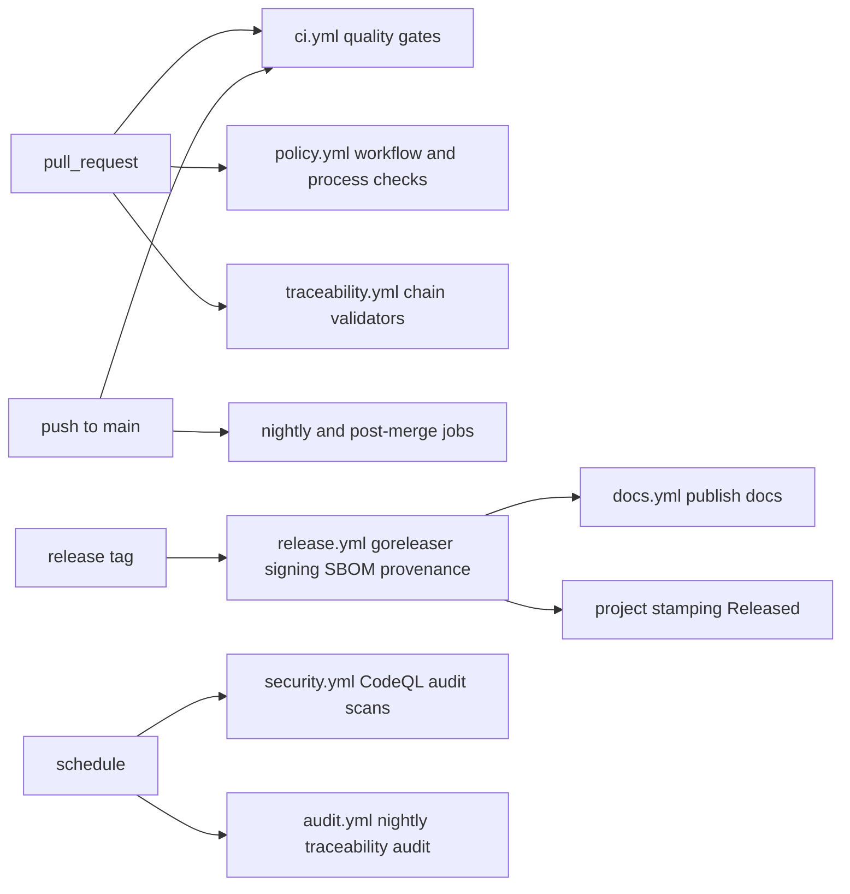

# 06 — GitHub Actions Pipelines

CI/CD for the `andromeda` repository runs on GitHub Actions (MVP minimum item 26). This
chapter defines the workflow set, the required-check quality gates, and the security
posture every workflow obeys (ADR-149): least-privilege tokens, actions pinned by full
commit SHA, fork PRs treated as untrusted code, environment-gated secrets, GitHub-hosted
ephemeral runners only.

In every YAML sketch below, `<pinned-sha>` denotes the full 40-hex-character commit SHA
of the action version, fixed at adoption and maintained by Dependabot per FR-GH-012 —
sketches never use mutable tags. Runner labels for the platform matrix (including macOS
arm64 hosted runners) are PENDING VALIDATION against GitHub's currently documented
hosted-runner offering at implementation time (register entry); the matrix below states
the required platform coverage, which is normative regardless of label names.

## Workflow map



The diagram shows trigger-to-workflow relations. Pull requests fan out to the quality
gates (`ci.yml`), the policy checks (`policy.yml`), and the traceability validators
(`traceability.yml`); pushes to `main` re-run quality gates plus post-merge jobs that
need secrets forks cannot have; release tags run the release pipeline, which in turn
triggers documentation publishing and project stamping; schedules drive security
scanning and the nightly audit. Constraint: no workflow triggered by untrusted events
carries secrets or write permissions (ADR-149 rule 3).

## Workflow inventory

| Workflow | Triggers | Jobs (path-filtered where marked) | Required check? |
|---|---|---|---|
| `ci.yml` | PR, push to `main`, `release/*` | format (gofmt), lint (golangci-lint per ADR-018), compile (full matrix), unit tests + race, integration tests, coverage gate (SM-14), spec lint (docs/spec paths), schema checks (`schemas/` paths), SDK mirror equivalence (ADR-031) | Yes — all |
| `e2e.yml` | PR (path-filtered to runtime code), push to `main` | main UC-01 journey per Tier 1 platform (MVP minimum item 25) | Yes on filtered paths |
| `policy.yml` | PR touching `.github/`, `scripts/` | workflow policy check (permissions blocks, SHA pins, fork rules), structure check (FR-GH-002), labels-data validation | Yes |
| `traceability.yml` | PR (all), PR metadata events | branch grammar, commit messages (E-GH-001), linkage (E-GH-003), template completeness, size (E-GH-005), provenance labels (E-GH-006) | Yes |
| `security.yml` | PR, push, weekly schedule | CodeQL (Go), dependency audit (`govulncheck` + Dependabot alerts gate), secret scanning push-protection is platform-level; the job verifies configuration, license compliance (ADR-002 policy over SBOM diff) | Yes (PR jobs) |
| `benchmarks.yml` | push to `main`, weekly | Volume 12 benchmark suite on reference-class runners; regression comparison against stored baselines | No (report + alert) |
| `release.yml` | tag `v*` | goreleaser build matrix, checksums, cosign keyless signing, syft SBOMs, SLSA provenance, GitHub Release publication, Homebrew tap update, Linux packages (all per ADR-013 and Volume 14's release keystone); runs in the `release` environment | n/a (tag-driven) |
| `upgrade.yml` | release candidate tags, weekly | Volume 14 upgrade/rollback tests: previous release → candidate on Tier 1 platforms | Gate for release publication |
| `docs.yml` | release published; push to `main` (docs paths) | build and publish user docs; spec HTML rendering | No |
| `labels.yml` | push to `main` touching `.github/labels.yml` | label synchronization (FR-GH-007) | n/a |
| `audit.yml` | nightly schedule | chain audit (chapter 07), branch-age and board-hygiene reports, protection-drift check | n/a (files issues) |
| `project.yml` | issue/PR/release events | Projects automation (FR-GH-008) | n/a |

**Platform matrix** (compile, unit, integration, E2E): macOS arm64; Linux x86_64; Linux
arm64 — the Tier 1 set of Volume 1 chapter 05. macOS Intel joins as Tier 2 build-and-
smoke when its PENDING VALIDATION resolves (Volume 1 register). Cross-compilation for
release artifacts covers the full ADR-013 matrix regardless of test-runner
availability.

**Quality gates** (merge-blocking, beyond test pass/fail): coverage per SM-14 (MVP:
≥ 70% overall, ≥ 85% core/contract packages; v1: ≥ 80% / ≥ 90%) measured as Volume 13
specifies; zero `golangci-lint` findings at the pinned config; dependency-rule
enforcement per ADR-033 (depguard + import-graph test) as part of lint/test jobs; zero
known critical/high vulnerabilities in dependencies at release time (SM-16(a));
contract-diff report clean for `internal/ports`, `sdk/`, and `schemas/` within a major
line (NFR-ARCH-002, SM-20).

## Representative sketches

`ci.yml` (abbreviated to the pattern; every job follows it):

```yaml
name: ci
on:
  pull_request:
  push:
    branches: [main, "release/**"]
permissions:
  contents: read
concurrency:
  group: ci-${{ github.ref }}
  cancel-in-progress: true
jobs:
  lint:
    runs-on: ubuntu-24.04
    steps:
      - uses: actions/checkout@<pinned-sha>   # v5
      - uses: actions/setup-go@<pinned-sha>   # v6, go-version pinned via go.mod
      - run: make lint   # gofmt diff check + golangci-lint (pinned in .golangci.yml)
  test:
    strategy:
      matrix:
        platform: [macos-arm64, linux-x86_64, linux-arm64]  # labels per register entry
    runs-on: ${{ matrix.platform }}
    steps:
      - uses: actions/checkout@<pinned-sha>   # v5
      - uses: actions/setup-go@<pinned-sha>   # v6
      - run: make test-unit test-integration
      - run: make coverage-gate   # SM-14 thresholds; fails the job below threshold
```

`release.yml` (pattern for the privileged path):

```yaml
name: release
on:
  push:
    tags: ["v*"]
permissions:
  contents: read
jobs:
  release:
    environment: release          # required reviewers; tag-pattern restricted
    runs-on: ubuntu-24.04
    permissions:
      contents: write             # publish the GitHub Release
      id-token: write             # cosign keyless OIDC (ADR-013)
    steps:
      - uses: actions/checkout@<pinned-sha>   # v5, fetch-depth 0 for changelog
      - uses: actions/setup-go@<pinned-sha>   # v6
      - run: make release-verify   # upgrade.yml gate result + changelog dry run
      - uses: goreleaser/goreleaser-action@<pinned-sha>  # v6; cosign + syft inside
      - run: make provenance-attest  # SLSA provenance publication (ADR-013)
```

Fork-PR handling: the `pull_request` trigger gives fork PRs the read-only token and no
secrets; jobs that need secrets (benchmark baseline upload, docs publish) run only on
`push`/`schedule`/`release` triggers. `pull_request_target` appears solely in
`project.yml`/`labels.yml`-class metadata automation and never checks out PR code
(ADR-149 rule 3).

## Requirements

### FR-GH-009 — Quality pipelines and required checks

- Type: Functional
- Status: Draft
- Priority: P0
- Phase: Core
- Source: Provided
- Owner: Development process (Volume 11)
- Affected components: None at runtime; CI configuration
- Dependencies: ADR-013, ADR-017, ADR-018, ADR-033, ADR-149; FR-GH-003
- Related risks: RISK-GH-001, RISK-GH-003

#### Description

The repository MUST run the `ci.yml`, `e2e.yml`, `policy.yml`, and `traceability.yml`
workflows with the job inventory and platform matrix of this chapter, wired as required
checks on `main` and `release/*`, with path filtering keeping feedback proportional to
the change, concurrency cancellation on superseded pushes, and the quality gates
(coverage, lint, dependency rules, contract diff) enforced as merge blockers.

#### Motivation

`main` must always be releasable (ADR-004); required checks are the mechanism. The MVP
minimum commits to CI building, testing, and releasing on every mainline change.

#### Actors

Contributors, maintainers, CI.

#### Preconditions

FR-GH-002 structure; branch protection referencing the checks.

#### Main flow

1. PR opens; path filters select applicable jobs; the full required set reports.
2. Merge requires all required checks green.
3. Push to `main` re-runs gates plus post-merge secret-bearing jobs.

#### Alternative flows

- Path-filtered job not applicable → it reports success-by-skip explicitly so required
  checks never dangle.
- Superseded push → in-flight runs for the ref are cancelled (concurrency group).

#### Edge cases

- Flaky tests: quarantine policy is Volume 13's; a quarantined test cannot silently
  leave the required set — quarantine is a reviewed change.
- Runner outage: merges stall rather than bypass; revert-first applies to any
  emergency (no check-skipping path exists).
- Docs-only PRs run spec lint + structure checks; code jobs skip-report.

#### Inputs

PR/push events; repository content.

#### Outputs

Check results, annotations, coverage and contract-diff reports as artifacts.

#### States

Not applicable.

#### Errors

Job failures are check failures; validator findings use the E-GH codes; infrastructure
failures re-run per the platform's retry affordances, never auto-bypassed.

#### Constraints

ADR-149 posture applies to every job; total required-check wall time budget per
NFR-GH-002; no self-hosted runners.

#### Security

Read-only tokens on PR jobs; no secrets in fork-reachable contexts; benchmark baselines
and publish steps post-merge only.

#### Observability

Check run durations exported to the repository's metrics dashboard job; failure-rate
trends reviewed at phase gates (ADR-003 review condition).

#### Performance

NFR-GH-002 bounds the PR feedback wall time; matrix sharding and caching (Go module and
build caches keyed by go.sum) are the levers.

#### Compatibility

Tier 1 platform coverage per Volume 1; matrix growth (Windows at v2) extends this
requirement through the change procedure.

#### Acceptance criteria

- Given a PR touching `internal/`, when checks run, then format, lint, compile, unit,
  integration, coverage, dependency-rule, and traceability checks all report, and the
  PR cannot merge with any red.
- Given a PR touching only `docs/spec/`, when checks run, then spec lint runs and code
  jobs report skip-success within the same required-check set.
- Given a coverage drop below the SM-14 threshold, when the gate evaluates, then the
  check fails with the per-package shortfall.
- Negative: given a fork PR, when its jobs run, then the token is read-only and zero
  secrets are present in the environment (verified by the policy check's assertions).

#### Verification method

Workflow integration tests on a fixture repository; branch-protection audit at phase
gates; NFR-GH-002 measurements; policy-check self-test in `policy.yml`.

#### Traceability

MVP minimum items 24–26; ADR-004, ADR-018, ADR-033; SM-14; NFR-GH-002.

### FR-GH-010 — Security scanning pipelines

- Type: Functional
- Status: Draft
- Priority: P0
- Phase: MVP
- Source: Provided
- Owner: Development process (Volume 11)
- Affected components: None at runtime; CI configuration
- Dependencies: ADR-002, ADR-149; FR-GH-009
- Related risks: RISK-GH-001

#### Description

The `security.yml` workflow MUST run CodeQL analysis for Go, dependency vulnerability
audit (`govulncheck` plus a Dependabot-alert gate), license compliance against the
ADR-002 policy (SBOM-based), and verification that platform-level secret scanning with
push protection is enabled — on every PR (as required checks), on `main`, and weekly by
schedule. Critical/high findings MUST block release publication (SM-16(a)).

#### Motivation

Supply-chain and code-scanning controls are release-trust prerequisites (Volume 0
precedence items 1–3) and SM-16 commitments.

#### Actors

CI; maintainers (finding triage); release pipeline (gate consumer).

#### Preconditions

Platform security features enabled on the repository.

#### Main flow

1. PR jobs scan the diff's blast radius (CodeQL incremental, dependency diff).
2. Scheduled jobs scan the full tree and refresh alert state.
3. Release publication consumes the latest gate state.

#### Alternative flows

- Vulnerability with no fix available → recorded suppression with owner and expiry
  date; suppressions are reviewed at each release and expire loudly.
- License finding on a transitive test-only dependency → evaluated against the ADR-002
  documented exception list.

#### Edge cases

- Vendored or generated code excluded from CodeQL with recorded justification in the
  config file (reviewed like code).
- Secret-scanning false positives resolved via the platform flow; the weekly job
  reports open alerts older than 5 working days.

#### Inputs

Source tree, dependency graph, SBOMs, platform alert APIs.

#### Outputs

Check results; alert reports; release-gate state artifact.

#### States

Not applicable.

#### Errors

Scan-infrastructure failures fail the check (never silently skip); gate consumption
failures block release with the cause named.

#### Constraints

ADR-149 posture; scanning jobs hold read-only code access plus the platform's
security-events write scope only.

#### Security

This requirement is itself a control; its jobs' tokens are minimal; alert data is
handled in the platform's private surfaces, not in public artifacts.

#### Observability

Alert counts and age reported weekly; release-gate state attached to each release
(chapter 07 chain report).

#### Performance

PR security jobs fit within the NFR-GH-002 budget via incremental analysis; full scans
run on schedule.

#### Compatibility

CodeQL Go support and platform features as documented; feature regressions trigger the
ADR-149 review condition.

#### Acceptance criteria

- Given a PR introducing a dependency with a known critical vulnerability, when checks
  run, then the dependency-audit check fails naming the advisory.
- Given a PR adding a GPL-licensed production dependency, when license compliance runs,
  then the check fails per the ADR-002 policy.
- Given a release tag with an open critical alert and no valid suppression, when
  `release.yml` runs, then publication is blocked with the gate state in the log.
- Negative: given a purged alert state (API failure), when the release gate evaluates,
  then it fails closed — absence of data is not a pass.

#### Verification method

Fixture-based scanning tests (known-vulnerable module, license fixtures);
release-gate integration test; weekly report audit at phase gates.

#### Traceability

SM-16; ADR-002, ADR-013, ADR-149; Volume 9 chapter 08 (advisory handling).

### FR-GH-011 — Release, upgrade, and documentation pipelines

- Type: Functional
- Status: Draft
- Priority: P0
- Phase: MVP
- Source: Provided
- Owner: Development process (Volume 11)
- Affected components: Updater (consumer of published artifacts); CI configuration
- Dependencies: ADR-013, ADR-015, ADR-149; FR-GH-009, FR-GH-010
- Related risks: RISK-GH-001

#### Description

Tag-driven `release.yml` MUST produce the complete ADR-013 artifact set (platform
archives, checksums, cosign keyless signatures, syft SBOMs, SLSA provenance, Homebrew
tap update, Linux packages) inside the reviewer-gated `release` environment, consuming
the upgrade-test gate (`upgrade.yml`) and the security gate (FR-GH-010), generating the
changelog from Conventional Commits history (ADR-015), and publishing the traceability
chain report (chapter 07) as a release artifact. `docs.yml` MUST publish documentation
on release. Release process semantics beyond CI mechanics — channels, versioning,
rollback — are Volume 14's (its release-pipeline keystone requirement); this
requirement owns the GitHub Actions realization.

#### Motivation

One tag, one deterministic, verifiable artifact set (ADR-013): the pipeline is the
trust boundary between the repository and every installation.

#### Actors

Release managers (tagging + environment review), CI, Updater (downstream).

#### Preconditions

Green `main` at the tagged commit; gates current; environment reviewers available.

#### Main flow

1. Maintainer pushes tag `vX.Y.Z` per Volume 14's release procedure.
2. Environment review approves the run.
3. goreleaser builds the matrix; signing, SBOM, provenance, publication, tap and
   package updates execute.
4. Docs publish; the project stamps Released; the chain report attaches.

#### Alternative flows

- Any gate red → the run stops before publication; nothing partial is published
  (drafts are deleted on failure).
- Release-candidate tags (`v*-rc*`) publish to pre-release only and skip the tap
  update.

#### Edge cases

- Re-tagging is prohibited (tags are protected); a botched release is followed by a
  new patch release, and `yanked` handling is Volume 14's.
- macOS notarization remains PENDING VALIDATION per ADR-013; the pipeline ships
  checksums + cosign signatures and states signing status in release notes (Volume 1
  register question).

#### Inputs

Tags; repository at tag; gate artifacts.

#### Outputs

GitHub Release with the full artifact set; tap/package updates; changelog; chain
report.

#### States

Release entity states (`drafted` → `published`, Volume 2) are driven by Volume 14's
machine; this pipeline is the actuator.

#### Errors

Pipeline failures leave no published artifacts; failures are E-GH-004-class findings in
the chain report when traceability data is incomplete.

#### Constraints

Publication only from the `release` environment; only tag triggers; `id-token: write`
and `contents: write` exist only in this workflow's release job (ADR-149).

#### Security

Keyless signing bound to the workflow identity; environment reviewers are the human
gate; provenance makes the build path auditable.

#### Observability

Release run logs retained; chain report artifact; SM-18 measurement hooks (update
timing) feed Volume 14.

#### Performance

Pipeline duration is not merge-blocking; upgrade-gate scheduling keeps release latency
within Volume 14's process targets.

#### Compatibility

Artifact matrix per ADR-013 including cross-compiled targets; Windows artifacts join
at v2 via change procedure.

#### Acceptance criteria

- Given tag `v0.5.0` on a green commit with gates satisfied, when the pipeline
  completes, then the Release contains archives for the full matrix, a checksums file,
  cosign signatures verifiable against the workflow identity, per-artifact SBOMs,
  provenance attestations, and the chain report; and the tap PR/update exists.
- Given a red upgrade gate, when the tag is pushed, then no artifact is published and
  the failure names the gate.
- Given a release-candidate tag, when the pipeline runs, then the Release is marked
  pre-release and the tap is not updated.
- Negative: an attempt to run the release job outside the `release` environment fails
  the policy check.

#### Verification method

Release dry runs (snapshot mode) on PRs touching release config; full rehearsal on rc
tags; verification commands documented per release and tested in `upgrade.yml`;
environment/permission audit.

#### Traceability

ADR-013, ADR-015; Volume 14 (release semantics, SM-18/SM-19); chapter 07 chain report;
MVP minimum items 26–27.

### FR-GH-012 — Workflow security posture enforcement

- Type: Functional
- Status: Draft
- Priority: P0
- Phase: Core
- Source: Provided
- Owner: Development process (Volume 11)
- Affected components: None at runtime; policy check in CI
- Dependencies: ADR-149; FR-GH-009
- Related risks: RISK-GH-001, RISK-GH-003

#### Description

A workflow policy check MUST mechanically enforce ADR-149 on every change to workflow
files: explicit least-privilege `permissions` blocks, full-SHA pinning of every action,
prohibition of `pull_request_target` with PR-code checkout, secrets absent from
fork-reachable contexts, environment gating on privileged jobs, and GitHub-hosted
runner labels only. The check is itself a required check and MUST fail closed on
unparsable workflow files.

#### Motivation

The posture decays without mechanical enforcement — each rule guards a documented
attack class against the repository that signs Andromeda's releases.

#### Actors

CI; contributors editing workflows; Dependabot (pin updates).

#### Preconditions

Policy check deployed with its rule set versioned in-repo.

#### Main flow

1. PR touches `.github/workflows/`; the policy check parses every workflow.
2. Rules evaluate; violations annotate the exact lines.
3. Dependabot pin updates flow through the same check.

#### Alternative flows

- A rule needs an exception (none are currently defined) → the exception must be added
  to the versioned rule set by PR to this volume; the `policy-check` override label
  does not apply to this check.

#### Edge cases

- Reusable/composite actions defined in-repo are scanned recursively.
- Workflow files added by forks are validated but run under fork restrictions
  regardless.

#### Inputs

Workflow YAML files; rule set.

#### Outputs

Check results with line annotations.

#### States

Not applicable.

#### Errors

Violations reported per rule with remediation; parse failures fail closed.

#### Constraints

Rule set changes only via PR to this volume's owning paths; the check cannot be
labeled away.

#### Security

Directly realizes ADR-149; the check's own job runs with `contents: read` only.

#### Observability

Violation categories counted in the nightly audit; drift between rule set and ADR-149
reviewed at phase gates.

#### Performance

Static YAML analysis; seconds.

#### Compatibility

GitHub Actions syntax; rule set versioned to track platform changes.

#### Acceptance criteria

- Given a workflow step `uses: actions/checkout@v5`, when the check runs, then it fails
  naming the unpinned reference.
- Given a workflow without a `permissions` block, when the check runs, then it fails
  with the least-privilege remediation.
- Given a `pull_request_target` workflow containing a checkout of the PR head, when the
  check runs, then it fails as prohibited.
- Negative: given a syntactically broken workflow file, when the check runs, then the
  result is failure (fail closed), not skip.

#### Verification method

Rule-set unit tests over fixture workflows (violating and compliant); self-application
(the policy check passes on the repository's own workflows); phase-gate audit
comparing rule set to ADR-149.

#### Traceability

ADR-149, ADR-013; RISK-GH-001, RISK-GH-003; SM-16.

## Non-functional requirements

### NFR-GH-001 — Development traceability completeness

- Category: Maintainability
- Priority: P0
- Phase: MVP
- Metric: (a) Fraction of `main` commits (excluding release-automation commits)
  resolvable to a merged PR with a linked issue and non-empty requirement declaration;
  (b) open orphan findings from the nightly chain audit
- Target: (a) 100%; (b) 0 steady-state (every finding triaged within 5 working days)
- Minimum threshold: (a) 100% for commits after the validators' deployment date;
  (b) no finding older than 10 working days
- Measurement method: nightly chain audit (chapter 07) walking `main` since the last
  audited commit; release-time chain report over the release's commit range
- Test environment: the `andromeda` repository on GitHub
- Measurement frequency: nightly; consolidated at each release and phase gate
- Owner: Development process (Volume 11)
- Dependencies: FR-GH-001, FR-GH-004; ADR-148
- Risks: RISK-GH-002
- Acceptance criteria: Nightly audit reports zero unresolved orphans older than the
  threshold; every release's chain report shows 100% resolution for its range; audit
  findings are filed as issues automatically and closed with cause.

### NFR-GH-002 — Pull-request feedback latency

- Category: Performance
- Priority: P1
- Phase: MVP
- Metric: Wall-clock time from PR head push to completion of all required checks
  (p85 over a rolling 4-week window), excluding queue time caused by platform-wide
  runner outages
- Target: ≤ 15 minutes p85 for code PRs; ≤ 5 minutes p85 for docs/spec-only PRs
- Minimum threshold: ≤ 25 minutes p85 (code) — beyond it, path filtering/sharding work
  is mandatory per the ADR-003 review condition
- Measurement method: check-run timestamps collected by the nightly audit job from the
  platform API; percentile computation over merged and closed PRs
- Test environment: the `andromeda` repository, GitHub-hosted runners
- Measurement frequency: nightly rollup; reviewed monthly and at phase gates
- Owner: Development process (Volume 11)
- Dependencies: FR-GH-009
- Risks: RISK-GH-002 (slow checks incentivize bypass pressure)
- Acceptance criteria: The rolling report shows targets met; two consecutive months
  above the minimum threshold triggers the ADR-003 CI-cost review with a recorded
  remediation plan.

## Risks

### RISK-GH-001 — CI or release workflow compromise

- Category: Security / supply chain
- Probability: Low
- Impact: High
- Severity: High
- Mitigation: ADR-149 posture (least privilege, SHA pinning, fork isolation,
  environment-gated signing, hosted ephemeral runners); FR-GH-012 mechanical
  enforcement; SLSA provenance enabling third-party verification; branch protection on
  workflow paths with CODEOWNERS review
- Detection: policy-check failures; provenance verification failures downstream;
  platform audit log review at phase gates; anomalous release contents caught by
  SBOM/checksum diffs
- Owner: Development process (Volume 11) with Volume 9 (threat model)
- Status: Open

### RISK-GH-003 — Fork pull-request secret or privilege exposure

- Category: Security
- Probability: Medium
- Impact: High
- Severity: High
- Mitigation: fork PRs restricted to the unprivileged `pull_request` context;
  prohibition of `pull_request_target` code checkout; secrets scoped to post-merge and
  environment-gated workflows; first-contribution approval requirement
- Detection: FR-GH-012 policy check on every workflow change; nightly audit assertion
  that no secret-bearing workflow is fork-triggerable; platform token-audit review
- Owner: Development process (Volume 11)
- Status: Open
