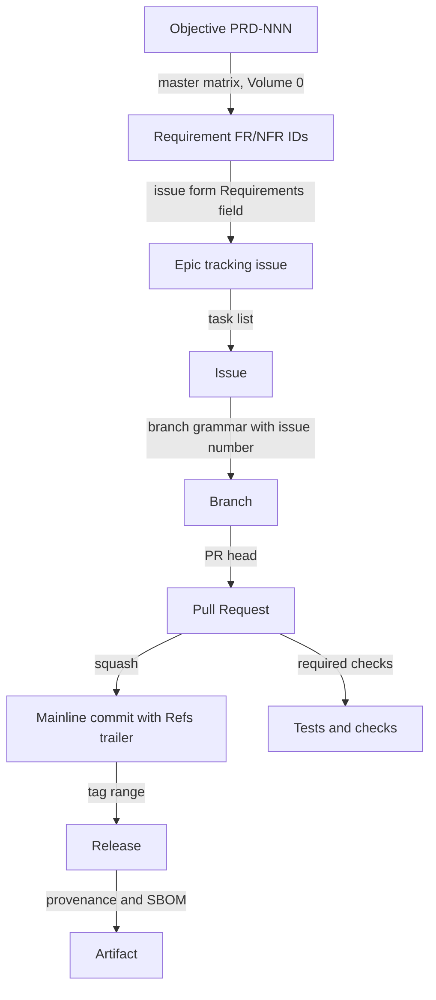

# 07 — Traceability Automation

Volume 0 chapter 03 defines the traceability chain; this chapter specifies the
automation that enforces it end to end for the `andromeda` project, per the ADR-148
mechanics: every link recorded in a platform-native field, every link checked by a
mechanical validator, breaks blocked at the PR, residue caught nightly, and the whole
chain published per release.

## The chain and its validators

The diagram reads top to bottom as the recording direction: objectives map to
requirements in the specification corpus; requirements are declared on epics and issues
through the mandatory form field; issues connect to branches by the naming grammar, to
PRs by the closing-keyword link, and to mainline commits by the squash discipline;
required checks bind tests to every PR; releases aggregate commit ranges; provenance
attestations and SBOMs bind artifacts to the released commit. Each arrow is validated
by exactly one validator below; a broken arrow is a named error, not a silent gap.

| Link | Record | Validator | Error |
|---|---|---|---|
| Objective → requirement | `docs/spec/` corpus + master matrix | `spec_lint.py` (required check on spec paths) | lint findings |
| Requirement → epic/issue | Issue-form Requirements field | requirement-resolution validator | E-GH-003 |
| Issue → branch | Branch name grammar | branch-grammar validator | E-GH-002 |
| Issue → PR | Closing-keyword link | linkage validator | E-GH-003 |
| PR → commit | Squash message (`Refs: #issue`, title format) | commit-message check | E-GH-001 |
| PR → tests/checks | Required-check state | platform enforcement + policy check | check failures |
| Commit range → release | Tag + generated changelog | release chain report | E-GH-004 |
| Release → artifact | Checksums, signatures, SLSA provenance | release verification job | E-GH-004 |

## Validator suite

The validators live in `scripts/traceability/` and run in `traceability.yml` (PRs), in
`audit.yml` (nightly), and inside `release.yml` (chain report). They are product-grade
code: tested, reviewed under `area/ci`, and versioned with the repository.

1. **Branch-grammar validator.** Parses the PR head branch against
   `<type>/<issue-number>-<slug>` (chapter 03), verifies the issue exists and is open
   (or was open at branch creation), and that `type` is in the allowed set for the
   target branch (release branches accept fix/backport types only). Bot exemptions are
   an explicit allowlist (`dependabot/**`).
2. **Linkage validator.** Requires exactly one closing-keyword issue link; verifies the
   linked issue carries a `type/*` label, a non-empty Requirements declaration, and —
   for issues under an epic — a resolvable epic reference. Verifies template mandatory
   sections are filled (explicit "none"/"process-only" accepted; blanks and template
   placeholder text rejected).
3. **Requirement-resolution validator.** Every corpus ID declared on the issue and in
   the PR's Requirements section MUST resolve to a definition in `docs/spec/` (same
   definition index the spec linter builds). Unknown, deprecated-without-successor, or
   malformed IDs fail with E-GH-003.
4. **Commit-message check.** Chapter 04 rules (E-GH-001) over all PR head commits and
   the projected squash message.
5. **Size and provenance checks.** Chapter 04 (E-GH-005, E-GH-006).
6. **Nightly chain audit.** Walks `main` commits since the last audited commit:
   resolves each to its PR, issue, and requirement declarations; verifies protection
   settings against chapters 03–04; reports branch-age outliers, label-taxonomy
   drift, board hygiene (chapter 05), and `policy-check`/`size-exempt` override usage.
   Findings are filed automatically as `type/tech-debt` issues with the `traceability`
   marker in the title and are inputs to NFR-GH-001.
7. **Release chain report.** For the release's commit range: the complete chain for
   every commit (commit → PR → issue → requirements), plus gate states (security,
   upgrade), published as a release artifact next to SBOMs and provenance. A release
   with unresolved chain breaks in its range MUST NOT publish (the report generator
   fails the pipeline with E-GH-004).

Override discipline: a maintainer MAY apply the `policy-check` label to bypass a
*process* validator (never the workflow policy check, never security gates) with a
written justification; every use is nightly-audit-reported and phase-gate-reviewed.

## Requirements

### FR-GH-001 — Traceability automation

- Type: Functional
- Status: Approved
- Priority: P0
- Phase: MVP
- Source: Provided
- Owner: Development process (Volume 11)
- Affected components: None at runtime; validator suite + CI
- Dependencies: ADR-148, ADR-015, ADR-004; FR-GH-003, FR-GH-004, FR-GH-009, FR-GH-011
- Related risks: RISK-GH-002

#### Description

The `andromeda` project MUST enforce the Volume 0 traceability chain with the validator
suite of this chapter: every chain link recorded platform-natively, validated on every
PR as required checks, re-audited nightly with automatic finding issues, and published
per release as a chain report that blocks publication on unresolved breaks. Every
requirement ID declared anywhere in the process MUST resolve against the specification
corpus. Overrides are label-gated, justified, audited, and inapplicable to security
gates.

#### Motivation

The chain is the project's accountability spine (PRD-006, PRD-013): with a large share
of changes produced by AI agents, "where did this change come from and what requirement
does it serve" must be answerable mechanically for every artifact ever shipped.

#### Actors

Contributors (human and agent), maintainers, CI, release pipeline, auditors.

#### Preconditions

Chapters 03–06 structures deployed (templates, grammar, checks, pipelines).

#### Main flow

1. Work is filed as an issue declaring requirement IDs (chapter 05 forms).
2. A grammar-compliant branch and a linked PR carry the work (chapters 03–04).
3. PR validators verify every recorded link before merge.
4. The nightly audit re-walks `main`; the release report proves the chain for each
   shipped range.

#### Alternative flows

- Validator outage → merges stall (fail closed); no bypass path exists apart from the
  audited override label, which cannot silence the nightly audit.
- Historical commits predating validator deployment → excluded by the deployment-date
  boundary recorded in the audit configuration (NFR-GH-001 threshold).

#### Edge cases

- Process-only changes (label sync, workflow tweaks): `process-only` Requirements value
  keeps the chain honest without fabricating requirement links.
- Reverts inherit the reverted PR's issue linkage; the validator accepts `revert:`
  titles referencing the original PR.
- Multi-issue PRs: one primary closing link; additional `Refs` links recorded and
  resolved but not required to close.
- Requirement deprecation between filing and merge: the resolution validator accepts
  `DEPRECATED` IDs only when the successor ID is also declared.

#### Inputs

Issues, PR metadata, branch names, commit messages, the spec corpus definition index,
release tag ranges.

#### Outputs

Check results; nightly audit findings (auto-filed issues); per-release chain report
artifacts.

#### States

Not applicable (process automation over platform state).

#### Errors

E-GH-001 (chapter 04), E-GH-002, E-GH-003, E-GH-004 (this chapter), E-GH-005, E-GH-006
(chapter 04).

#### Constraints

Validators are required checks; the chain report generator fails closed; overrides per
the discipline above; validator rule changes land only via PR touching this volume and
the validator code together.

#### Security

The chain is tamper-evident: protection settings prevent unvalidated mainline writes,
the nightly audit detects drift, and release publication is gated on chain integrity —
an attacker cannot ship an artifact without leaving resolvable records (RISK-GH-001
interplay).

#### Observability

NFR-GH-001 metrics from the nightly audit; override usage counts; chain-report
completeness per release; all findings filed as issues (self-referential: findings
themselves enter the chain).

#### Performance

PR-side validators fit the NFR-GH-002 budget (metadata queries and static parsing;
no clone-the-world steps); the nightly audit is off the merge path.

#### Compatibility

GitHub-native records via official APIs; the chain schema (report format) is versioned
so platform migration preserves history (ADR-148 reversal plan).

#### Acceptance criteria

- Given a PR whose branch is `feat/512-context-pinning`, linked to issue #512 declaring
  `FR-GIT-009`, when validators run, then all pass and the merged squash commit body
  contains `Refs: #512`.
- Given a PR declaring a well-formed requirement ID that resolves to no definition in
  the corpus, when the resolution validator runs, then E-GH-003 fails the check naming
  the unresolvable ID.
- Given a release tag whose range contains a commit with no resolvable PR, when the
  chain report generates, then the pipeline fails with E-GH-004 and nothing publishes.
- Given a maintainer override on a size check, when the nightly audit runs, then the
  override appears in the audit report with its justification.
- Observability: given any shipped artifact, when its provenance, release, chain
  report, and issue records are followed, then the objective(s) its changes serve are
  reachable in ≤ 5 mechanical lookups.

#### Verification method

Validator unit tests with golden fixtures (valid/invalid branches, linkages, IDs);
integration tests on a fixture repository exercising the full chain including the
release report; nightly-audit assertion tests; phase-gate audit sampling shipped
artifacts back to objectives.

#### Traceability

PRD-006, PRD-013; Volume 0 chapter 03 (chain definition) and chapter 09 (master
matrix); ADR-148; NFR-GH-001; SM-13 (runtime counterpart).

## Risks

### RISK-GH-002 — Traceability erosion through process bypass or decay

- Category: Process
- Probability: Medium
- Impact: Medium
- Severity: Medium
- Mitigation: validators as required checks (fail closed); admin-inclusive branch
  protection; audited override label with phase-gate review; nightly audit with
  auto-filed findings; NFR-GH-001 thresholds making decay measurable; validator code
  owned and tested like product code
- Detection: nightly audit orphan and override reports; NFR-GH-001 trend at phase
  gates; release chain-report failures
- Owner: Development process (Volume 11)
- Status: Open

## Errors

### E-GH-002 — Branch naming violation

- Category: Process validation
- Severity: Error
- User message: "Branch '<name>' does not match '<type>/<issue-number>-<slug>' or uses
  a type not allowed for the target branch."
- Technical message: branch name, parse result, allowed type set for the target,
  exemption-list evaluation
- Cause: branch created outside the chapter 03 grammar
- Safe-to-log data: branch name, target branch, rule violated
- Recoverability: recoverable by renaming the branch (re-push under a compliant name)
- Retry policy: not applicable
- Recommended action: recreate the branch as `<type>/<issue>-<slug>`; see
  CONTRIBUTING.md
- Exit-code mapping: 1 (validator process)
- HTTP mapping: not applicable
- Telemetry event: none (CI tooling; check annotations)
- Security implications: none directly; grammar is a traceability control

### E-GH-003 — Missing or unresolvable linkage

- Category: Process validation
- Severity: Error
- User message: "This PR/issue is missing a required link: <finding> (issue link,
  Requirements declaration, or unresolvable requirement ID)."
- Technical message: linkage kind, expected record, resolution failure detail
  (unknown ID, deprecated-without-successor, empty mandatory field, missing closing
  keyword, label selection-rule violation)
- Cause: chain link absent or pointing at nothing
- Safe-to-log data: PR/issue number, finding kind, offending ID or field name
- Recoverability: recoverable by adding/correcting the link
- Retry policy: not applicable
- Recommended action: link the issue with a closing keyword; declare valid requirement
  IDs from the specification, or `process-only` where truthful
- Exit-code mapping: 1 (validator process)
- HTTP mapping: not applicable
- Telemetry event: none (CI tooling)
- Security implications: prevents unattributed work entering `main`

### E-GH-004 — Traceability chain validation failed

- Category: Process validation
- Severity: Fatal (blocks release publication)
- User message: "The traceability chain is broken for <scope>: <n> commit(s) cannot be
  resolved to PR/issue/requirements."
- Technical message: commit list with per-commit break point (no PR, no issue link, no
  requirement resolution), audit window, report location
- Cause: mainline or release-range commits without a resolvable chain
- Safe-to-log data: commit hashes, break kinds, counts
- Recoverability: recoverable by repairing records (re-linking issues, filing
  retroactive records via the override discipline) before re-running
- Retry policy: re-run after remediation; the generator is deterministic
- Recommended action: repair the named links; if a legitimate anomaly, apply the
  documented override with justification — the audit trail keeps it visible
- Exit-code mapping: 1 (validator process; release pipeline fails)
- HTTP mapping: not applicable
- Telemetry event: none (CI tooling)
- Security implications: failing closed here is what makes "every artifact
  accountable" a guarantee rather than a goal
