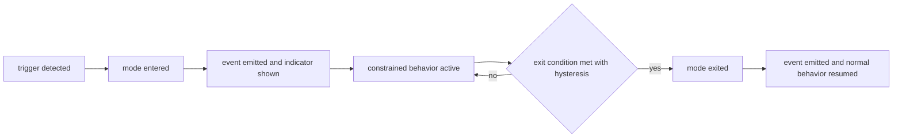

# 02 — Reliability and Degradation

Chapter 01 defines how the product performs when everything works; this chapter defines how
it behaves when something does not: finite deadlines everywhere, bounded queues that convert
overload into visible latency or explicit rejection (ADR-023), an explicit catalog of
degraded modes with entry and exit events ([ADR-162](../annexes/adr/ADR-162.md)), a resource
watchdog, and recovery objectives. It formalizes the reliability metrics assigned to this
volume: offline operation (SM-05), tool-call reliability (SM-10), and session recovery
(SM-11(a)) — Volume 1, chapter 06.

## Availability model

Andromeda is a locally installed product, so "availability" is not service uptime. This
volume defines it as three verifiable properties:

1. **Intake availability.** While a session is active, the instance accepts commands and
   input except during orderly shutdown; a runtime that stops responding to intake is an
   availability failure even if the process is alive. Measured during DS-SOAK as the
   fraction of scripted inputs accepted within the NFR-PERF-005 window.
2. **Crash-free operation.** Abnormal terminations are bounded (NFR-PERF-027) and panics
   inside supervised tasks never crash the process (FR-ARCH-006).
3. **Recoverability.** After a crash, recovery restores the instance within the
   NFR-PERF-016 restore budget at the NFR-PERF-026 success rate.

Provider-side availability is out of this model: Provider connection states (`available`,
`degraded`, `unavailable` — Volume 2, chapter 09) and routing/fallback policy are Volume 5's;
this chapter consumes those states as degradation triggers.

## Requirements

### FR-PERF-001 — Deadline and timeout baseline

- Type: Functional
- Status: Approved
- Priority: P0
- Phase: MVP
- Source: Design
- Owner: Performance and Reliability (Volume 12)
- Affected components: all engines and adapters; Task Scheduler; PAL
- Dependencies: FR-ARCH-004; ADR-016, ADR-023
- Related risks: RISK-PERF-003

#### Description

Every blocking interaction with an external system or subprocess MUST carry a finite
deadline propagated through its `Context` (FR-ARCH-004). The table fixes the defaults. Where
an owning volume's contract sets a different value for an operation it owns, the owner's
value prevails and this table is reconciled at consolidation; unlisted, uncovered operations
default to 60 s. Configured overrides, where the owner exposes a key, MUST be bounded to
1 s – 86,400 s; unbounded or disabled timeouts MUST NOT be configurable.

| Operation | Default deadline | Owner of semantics |
|---|---|---|
| Provider HTTP connect | 10 s | Volume 5 |
| Provider request total (non-streaming) | 300 s | Volume 5 |
| Provider stream idle gap (no chunk received) | 60 s | Volume 5 |
| Embedding batch request | 120 s | Volume 5 |
| Tool invocation (default; tool may declare its own) | 120 s | Volume 6 |
| Terminal command (default) | 120 s | Volume 6 |
| Plugin handshake | 10 s | Volume 6 |
| MCP initialize handshake | 30 s | Volume 6 |
| Git local operation | 60 s | Volume 11 |
| Git remote operation (fetch, pull, push) | 300 s | Volume 11 |
| SQLite busy wait | 5 s | Volume 10 |
| IPC request (non-streaming) | 30 s | Volumes 8/10 |
| Health-check probe | 5 s | Volume 5 (providers), Volume 6 (extensions) |
| Update check | 30 s | Volume 14 |
| Download progress stall (no bytes received) | 60 s | Volume 14 |
| Shutdown (total and per step) | NFR-ARCH-003 values | Volume 3 |

#### Motivation

One blocking call without a deadline reintroduces the hung-agent failure class the
architecture eliminated: interrupts that never land, sessions that cannot end, resources
held forever.

#### Actors

All engines and adapters; users configuring overrides; the fault-injection suites.

#### Preconditions

Context propagation per FR-ARCH-004 (Core).

#### Main flow

1. A component starts an external interaction with a deadline from this table or its
   owner's override.
2. The interaction completes before the deadline; the result flows normally.

#### Alternative flows

- Deadline expiry: the operation aborts per FR-ARCH-004, returns the owning area's timeout
  error class, maps to exit code 8 at the CLI boundary (ADR-016), and the entity records its
  timeout outcome (`timed_out` for tool invocations).

#### Edge cases

- Streams use idle-gap deadlines, not totals: long legitimate streams survive, stalled ones
  do not.
- Tools may declare deadlines up to the 86,400 s bound, visible before approval (Volume 6).
- A child operation's deadline never exceeds its parent's remaining budget.

#### Inputs

Deadline defaults; owner overrides; per-invocation declarations.

#### Outputs

Bounded operations; timeout errors in area families; timeout metrics per operation class.

#### States

Timeouts land entities in their frozen timeout/cancellation outcomes; no new states.

#### Errors

Area-family timeout classes (owned by their volumes); exit code 8 per ADR-016.

#### Constraints

No infinite timeout is expressible in configuration; polling loops select on context
doneness.

#### Security

Deadlines bound how long a wedged or hostile external process can hold resources; sandbox
teardown at timeout is mandatory (FR-ARCH-004).

#### Observability

Every timeout emits the owning entity's transition event with deadline, elapsed time, and
correlation IDs; per-class timeout counters feed FR-PERF-003 triggers.

#### Performance

Deadline bookkeeping is inside the NFR-PERF-020 scheduler overhead budget.

#### Compatibility

Values are platform-independent; signal/termination mechanics live behind the PAL.

#### Acceptance criteria

- Given a mock provider that stops sending chunks, when the 60 s idle gap elapses, then the
  stream aborts with the provider timeout class and exit code 8 applies on the
  non-interactive path.
- Given a tool sleeping past its deadline, when the timeout fires, then the invocation ends
  `timed_out` with its sandbox torn down and a structured error result.
- Negative case: given a 0 s or 100,000 s override where a key exists, when configuration
  loads, then validation fails per the owning volume — bounds are enforced at load.
- Observability case: given any timeout, its event carries deadline, elapsed time, and
  correlation IDs.

#### Verification method

Fault-injection suite (stalled provider, sleeping tool, hung git subprocess, stalled
download) asserting abort, outcomes, exit codes, events; static audit that every external
call site takes a context deadline (ADR-033 tooling class).

#### Traceability

PRD-005, PRD-010; FR-ARCH-004; ADR-016, ADR-023; NFR-PERF-025.

### FR-PERF-002 — Backpressure and overload shedding

- Type: Functional
- Status: Approved
- Priority: P0
- Phase: MVP
- Source: Design
- Owner: Performance and Reliability (Volume 12)
- Affected components: Task Scheduler, Event Bus, TUI, Runtime, Indexing Engine
- Dependencies: FR-ARCH-006; ADR-023, ADR-012; E-ARCH-005
- Related risks: RISK-PERF-003

#### Description

Overload MUST become visible latency or explicit rejection, never unbounded memory growth
(ADR-023). The scheduler pools of Volume 3, chapter 08 use the sizes, bounds, and policies
fixed in chapter [03](03-benchmarks-and-operational-limits.md). Under sustained saturation
the runtime MUST shed load in this order only: (1) defer `background` work (reject with
E-ARCH-005, reschedule); (2) delay `io` flushes within their bounded queues; (3) apply
block-with-deadline on `tools`; (4) preserve `interactive` responsiveness until last. Event
Bus overflow follows each family's declared policy (Volume 10); streaming render paths
coalesce chunks per frame rather than queue unboundedly. Every shed action emits
`perf.overload.shed` with pool, policy, and counts.

#### Motivation

The worst failure mode of an interactive tool is stopping to respond under its own
background load; a declared order makes the trade explicit — indexing slows before typing
does.

#### Actors

Task Scheduler; Event Bus; submitting components; users under load.

#### Preconditions

Pools configured per chapter 03; FR-ARCH-006 supervision in place.

#### Main flow

1. Load approaches a pool bound; queue-depth metrics rise.
2. The pool's declared policy applies; sustained saturation sheds in the declared order
   with `perf.overload.shed` per action.
3. Load drains; normal scheduling resumes; no shed state persists.

#### Alternative flows

- A foreground command depends on rejected background work: it reports the
  E-ARCH-005-classed condition honestly instead of waiting indefinitely.

#### Edge cases

- Bounded stages cannot deadlock: the flow topology is acyclic (ADR-023) and shedding
  breaks residual cycles.
- During shutdown, FR-ARCH-010 ordering supersedes shedding order.
- Flapping: shed state exits only when the queue drains below 50% of its bound.

#### Inputs

Task submissions; queue depth and occupancy stats (SchedulerPort `Stats`).

#### Outputs

Bounded queues; shed events; deferred background work; preserved interactive latency.

#### States

None new; scheduler work items use the Volume 3 process-local vocabulary.

#### Errors

E-ARCH-005 (submission rejected); no new codes.

#### Constraints

Unbounded queues are prohibited process-wide (ADR-023); the shedding order is fixed, not
configurable.

#### Security

Bounded queues bound the blast radius of a flooding extension or provider: it degrades its
own family's delivery, never permission evaluation.

#### Observability

Pool saturation metrics, queue depths, shed counters, `perf.overload.shed` with correlation
IDs — the saturation inputs Volume 3 names for this volume.

#### Performance

Under the NFR-PERF-020 load scenario, shedding MUST keep interactive latency within
NFR-PERF-005 while background throughput degrades.

#### Compatibility

Platform-independent; in-process only.

#### Acceptance criteria

- Given a full `background` queue, when another background task is submitted, then
  E-ARCH-005 returns, `scheduler.task.rejected` and `perf.overload.shed` are emitted, and
  the submitter reschedules without user-visible failure.
- Given sustained saturation from a flooding fixture, when the interactive replay runs
  concurrently, then input latency stays within NFR-PERF-005 and RSS stays within
  NFR-PERF-017 plus 100 MB.
- Negative case: given a provider streaming at 10× reference pacing, when the TUI renders,
  then chunks coalesce per frame and no queue grows monotonically.
- Observability case: every shed action's event carries pool, policy, counts, and
  correlation IDs.

#### Verification method

Saturation fixtures per pool; flooding-extension test; RSS ceiling assertions under
overload; the NFR-PERF-020 load scenario.

#### Traceability

PRD-008; ADR-012, ADR-023; FR-ARCH-006; NFR-PERF-005, NFR-PERF-017, NFR-PERF-020.

### FR-PERF-003 — Degraded operation modes

- Type: Functional
- Status: Approved
- Priority: P0
- Phase: MVP
- Source: Design
- Owner: Performance and Reliability (Volume 12)
- Affected components: Runtime, Provider Layer, Indexing Engine, Context Manager, Persistence Layer, TUI, CLI
- Dependencies: ADR-162; ADR-014, ADR-020, ADR-021
- Related risks: RISK-PERF-003

#### Description

The runtime MUST implement the following closed catalog of degraded modes. Entry and exit
MUST emit `perf.degradation.entered` / `perf.degradation.exited` with mode identifier and
cause; active modes MUST be queryable through the diagnostic surfaces (Volume 8's
doctor/status commands and TUI indicators). Degradation is never silent (ADR-162). Adding
or removing a mode is a change to this requirement.

| Mode | Trigger | Behavior while active | Exit condition | Phase |
|---|---|---|---|---|
| `offline` | No usable network path, or all remote providers unreachable | Offline guarantee list operations (Volume 1, chapter 04) continue with local providers; remote-dependent actions fail with their area's connectivity errors; checks back off to the health interval | Network restored and a remote provider re-verified | MVP |
| `provider_limited` | Configured provider in `degraded` or `unavailable` (Volume 5 states) | Routing and fallback per Volume 5; user notified on any provider/model change per Volume 5 | Provider re-verified `available` | MVP |
| `index_unavailable` | Index `stale`, `failed`, or rebuilding | Context assembly and search fall back to non-index paths per Volume 7; results flagged as degraded retrieval | Index back to `ready` | MVP |
| `no_embeddings` | No embedding-capable provider available | Semantic memory/search disabled; lexical paths continue (ADR-020) | Embedding capability available again | MVP |
| `secret_fallback` | OS keychain unavailable; age file fallback active (ADR-014; semantics Volume 9) | Credential operations continue via fallback; the weaker backend is visibly flagged | Keychain available again | MVP |
| `low_disk` | Free space below the chapter 03 floor | New runs refused with E-PERF-003; active runs continue with persistence protected; rebuildable caches evicted; retention passes triggered | Free space above floor plus hysteresis margin | MVP |
| `low_memory` | Main-process RSS above the chapter 03 high-water mark | Caches shed; background indexing paused; buffer sizes reduced; new runs refused with E-PERF-003 if pressure persists | RSS below the mark minus hysteresis margin | Beta |
| `sandbox_reduced` | Selected OS-level isolation mechanism unavailable (ADR-021) | Execution continues only per Volume 9's explicit downgrade policy; containment level recorded per execution | Mechanism available, or policy change | Beta |

#### Motivation

Every condition above occurs in normal life on developer machines. Enumerating them turns
"it got weird" into named, testable, observable states and makes the offline promise
(PRD-003) a designed mode rather than an error cascade.

#### Actors

Runtime and engines entering/exiting modes; users observing indicators; automation querying
status.

#### Preconditions

Triggers observable (health checks, watchdog, index and provider states).

#### Main flow

1. A trigger is detected (watchdog sample, health check, state transition).
2. The mode is entered atomically; the entry event is emitted; indicators update.
3. Constrained behavior applies; operations failing because of the mode report it in their
   errors.
4. The exit condition is evaluated each watchdog/health cycle; exit is evented and normal
   behavior resumes.

#### Alternative flows

- Multiple modes active: modes compose, each tracked and evented independently; the most
  restrictive behavior wins where they overlap.

#### Edge cases

- Flapping: exit conditions include hysteresis margins (chapter 03 values).
- Modes are not persisted; on restart, triggers are re-evaluated from scratch.
- A mode may be entered during startup; the first frame/output reflects it.

#### Inputs

Watchdog samples; provider and index state transitions; platform capability probes.

#### Outputs

Mode entry/exit events; diagnostic status; constrained behavior; E-PERF-003 refusals where
defined.

#### States

Modes are runtime conditions, not entity machines; they introduce no frozen states and MUST
NOT be persisted as entity state.

#### Errors

E-PERF-003 (this chapter); otherwise the failing operation's area errors, annotated with the
active mode.

#### Constraints

The catalog is closed; behavior reduced without event and indicator is a defect everywhere
(ADR-162).

#### Security

`secret_fallback` and `sandbox_reduced` policy is Volume 9's; this requirement guarantees
they are visible and evented. Degraded modes never loosen permission evaluation.

#### Observability

Entry/exit events with mode, cause, correlation IDs; active-mode gauge metric; mode
annotations on caused errors.

#### Performance

Detection and exit latency are budgeted by NFR-PERF-028.

#### Compatibility

Platform-capability triggers route through the PAL and Volume 9 policy; mode behavior is
platform-independent.

#### Acceptance criteria

- Given OS-level network disablement and a local provider, when a session runs, then
  `offline` is entered and evented, all 11 offline-guarantee operations succeed, and zero
  network attempts are observed (NFR-PERF-024).
- Given an index forced to `failed`, when a search runs, then fallback results arrive
  flagged as degraded retrieval and `index_unavailable` appears in status output.
- Given free disk below the floor, when a new run is requested, then E-PERF-003 refuses it
  while the active run continues and persists.
- Negative case: any mode entered in the conformance suite without a matching
  entered/exited event pair fails the suite.

#### Verification method

Per-mode fault-injection conformance suite (network disablement, index corruption, keychain
denial, disk-fill, memory pressure); offline suite per Volume 13; event-pairing audit over
all suite runs.

#### Traceability

PRD-003, PRD-006; ADR-014, ADR-020, ADR-021, ADR-162; NFR-PERF-024, NFR-PERF-028; SM-05.

### FR-PERF-004 — Resource watchdog and recovery objectives

- Type: Functional
- Status: Approved
- Priority: P1
- Phase: MVP
- Source: Design
- Owner: Performance and Reliability (Volume 12)
- Affected components: Runtime, Task Scheduler, Persistence Layer, Observability
- Dependencies: FR-ARCH-009; FR-PERF-003; ADR-011
- Related risks: RISK-PERF-003

#### Description

The runtime MUST run a resource watchdog sampling, every 30 s and before each run start:
free disk on the volumes holding databases and runtime directories, main-process RSS,
workspace database size, pool saturation, and event-drop counters. Threshold crossings
(chapter 03 values) trip the FR-PERF-003 modes. Recovery objectives: after abnormal
termination, a restarted instance MUST accept commands within 10 s on DS-M (including
FR-ARCH-009 recovery); a degraded mode whose trigger has cleared MUST exit within the
NFR-PERF-028 budget.

#### Motivation

Budgets without a runtime observer are documentation; the watchdog refuses work *before*
SQLite hits a full disk, not after.

#### Actors

Watchdog; Runtime; degraded-mode machinery; users seeing early warnings.

#### Preconditions

Metrics sources available (PAL process accounting, scheduler stats, filesystem stats).

#### Main flow

1. The watchdog samples on its interval and before run starts.
2. Samples publish as metrics; threshold crossings trip or clear modes with hysteresis.
3. Diagnostic surfaces report samples and active modes on demand.

#### Alternative flows

- A sample source fails: the watchdog logs it, keeps the last value flagged stale, and
  never blocks runtime operation on its own failure.

#### Edge cases

- Intervals use the monotonic clock; wake-after-sleep triggers an immediate sample.
- Databases on different volumes: each is sampled; the lowest free space governs
  `low_disk`.

#### Inputs

Sampling interval; chapter 03 thresholds; PAL and scheduler stats.

#### Outputs

Resource metrics; mode transitions; pre-run refusals (E-PERF-003).

#### States

None; the watchdog is process-local.

#### Errors

E-PERF-003 for refusals it causes; internal failures log without new codes.

#### Constraints

Watchdog failure MUST NOT fail the operation being observed; sampling runs on the
`background` pool.

#### Security

Samples contain sizes and counts only — safe for diagnostics export under Volume 10
redaction.

#### Observability

All samples exported as metrics per Volume 10; trips visible as mode events; refusals carry
correlation IDs.

#### Performance

Sampling cost ≤ 10 ms per cycle p95 on RM-1, inside the NFR-PERF-018(a) idle budget.

#### Compatibility

Sampling mechanics per platform behind the PAL; thresholds platform-independent.

#### Acceptance criteria

- Given disk filled below the floor mid-session, when the next sample runs, then `low_disk`
  is entered within one interval and a new-run request is refused with E-PERF-003 while
  active-run persistence continues.
- Given a crash injected during the soak, when the instance restarts, then it accepts
  commands within 10 s on DS-M.
- Negative case: given a stat-failure fixture, when sampling fails, then the runtime
  continues unaffected and the failure logs with the stale-value flag.
- Observability case: every threshold trip records sample value, threshold, and resulting
  mode.

#### Verification method

Disk-fill and memory-pressure fixtures; restart-time measurement in the crash-injection
suite; watchdog-failure fixture; idle CPU accounting with the watchdog running.

#### Traceability

PRD-010; FR-ARCH-009; FR-PERF-003; NFR-PERF-016, NFR-PERF-018, NFR-PERF-028.

## Degradation lifecycle

**Prose for the diagram.** Every degraded mode follows one lifecycle: a trigger enters the
mode; entry is atomic with its `perf.degradation.entered` event and diagnostic visibility;
constrained behavior applies while the exit condition — always with a hysteresis margin — is
re-evaluated each watchdog or health cycle; exit emits `perf.degradation.exited` and
restores normal behavior. The constraints encoded: no unevented path into or out of a mode,
no mode persists across restart, and concurrent modes each run this lifecycle independently.

## Reliability requirements

### NFR-PERF-024 — Offline operation

- Category: Reliability
- Priority: P0
- Phase: MVP
- Metric: Fraction of the offline guarantee list (the 11 operations of Volume 1, chapter 04, Local First) completing under the offline condition with a local provider; network-access attempts observed during the suite
- Target: 100% of the 11 operations; 0 network attempts
- Minimum threshold: 100% and 0 — identity property, no tolerance (SM-05 binds at MVP exit)
- Measurement method: Offline test suite per the SM-05 method: OS-level network disablement, full UC-09 journey plus per-operation checks, network-attempt observation at the OS level; suite specified in Volume 13
- Test environment: RM-1 and RM-2, DS-M, local provider fixture
- Measurement frequency: Every release; MVP exit gate
- Owner: Performance and Reliability (Volume 12) / Volume 13 (suite)
- Dependencies: FR-PERF-003 (`offline` mode); PRD-003
- Risks: RISK-PERF-003
- Acceptance criteria: Given all interfaces disabled at the OS level and a local provider, when the offline suite runs, then all 11 guaranteed operations complete, zero network attempts are observed, and `offline` is entered and evented exactly once per session.

### NFR-PERF-025 — Tool-call reliability

- Category: Reliability
- Priority: P0
- Phase: v1
- Metric: Fraction of tool invocations terminating within their declared timeout in either a schema-valid Tool Result or a structured error envelope — no hangs, crashes, or malformed results (SM-10 definition)
- Target: ≥ 99.5%
- Minimum threshold: ≥ 99.5% (SM-10; weakening requires the change procedure)
- Measurement method: Runtime metrics over the integration and E2E suites plus fault-injection runs; production figure from local metrics of consenting installations per Volume 10 consent policy
- Test environment: Tier 1 CI for suites; RM-1/RM-2 for fault-injection populations
- Measurement frequency: Every mainline commit (suites); per release (audit); gate at v1
- Owner: Performance and Reliability (Volume 12) / Tool Runtime (Volume 6)
- Dependencies: FR-TOOL-001; FR-PERF-001
- Risks: RISK-PERF-003
- Acceptance criteria: Given the suite populations including fault injection, when outcomes are classified, then ≥ 99.5% terminate within timeout in a schema-valid result or structured error; every non-conforming invocation is a recorded defect with its correlation chain.

### NFR-PERF-026 — Session recovery success

- Category: Reliability
- Priority: P0
- Phase: v1
- Metric: Fraction of interrupted sessions (crash injection at randomized points: kill −9, SIGKILL during tool execution, simulated power loss between writes) resuming with zero loss of persisted turns and intact permission grants (SM-11(a))
- Target: ≥ 99%
- Minimum threshold: ≥ 99% (SM-11(a)); the restore-time half is NFR-PERF-016
- Measurement method: Crash-injection suite per release, ≥ 200 injected crashes on DS-SOAK-derived sessions; resume verification asserts turn count, grant set, and run-state honesty (`interrupted`, never silently completed)
- Test environment: RM-1 and RM-2, DS-M
- Measurement frequency: Every release; gate at v1
- Owner: Performance and Reliability (Volume 12) / Volume 4 (resumption semantics)
- Dependencies: FR-ARCH-009; NFR-PERF-016
- Risks: RISK-PERF-003
- Acceptance criteria: Given ≥ 200 randomized crash injections, when sessions resume, then ≥ 99% recover with zero persisted-turn loss and intact grants; negative case: any resumed session reporting interrupted work as complete fails the suite regardless of the rate.

### NFR-PERF-027 — Crash-free operation

- Category: Reliability
- Priority: P0
- Phase: v1
- Metric: (a) Abnormal terminations of the main process per 1,000 session-hours across soak and E2E populations; (b) fraction of injected panics inside scheduler-supervised tasks captured without process termination
- Target: (a) 0 observed; (b) 100%
- Minimum threshold: (a) ≤ 1 per 1,000 session-hours; (b) 100% (FR-ARCH-006 makes panic escape a defect)
- Measurement method: Soak (DS-SOAK) and E2E populations with crash accounting; panic-injection fixtures across pools and engines
- Test environment: Tier 1 CI; RM-1 and RM-2 for soak
- Measurement frequency: Weekly soak on mainline; every release; gate at v1
- Owner: Performance and Reliability (Volume 12)
- Dependencies: FR-ARCH-006; NFR-PERF-023
- Risks: RISK-PERF-003
- Acceptance criteria: Given the release soak and E2E populations, when crash accounting is computed, then the rate is within threshold; given panic injection in every pool, then 100% convert to `panicked` outcomes with captured stacks and the process survives.

### NFR-PERF-028 — Degradation responsiveness

- Category: Reliability
- Priority: P1
- Phase: Beta
- Metric: (a) Time from trigger condition to mode entry (event emitted, indicator shown) for watchdog-detected triggers; (b) time from trigger clearing to mode exit; (c) mode events without a matching entered/exited pair
- Target: (a) ≤ 5 s for resource triggers, ≤ 1 health interval (30 s default) for provider/extension triggers; (b) ≤ 60 s; (c) 0
- Minimum threshold: (a) ≤ 10 s resource, ≤ 2 health intervals provider; (b) ≤ 120 s; (c) 0
- Measurement method: Instrumented fault injection: timestamped trigger injection versus mode-event timestamps, per mode in the FR-PERF-003 catalog
- Test environment: RM-1 and RM-2, DS-M
- Measurement frequency: Per release; gate at Beta
- Owner: Performance and Reliability (Volume 12)
- Dependencies: FR-PERF-003, FR-PERF-004
- Risks: RISK-PERF-003
- Acceptance criteria: Given each cataloged mode's injection fixture, when trigger and clear are injected, then entry and exit occur within thresholds with correctly paired events; a missing pair or an unevented behavioral change fails the suite.

## Risks

### RISK-PERF-003 — Degradation matrix complexity outgrows testing

- Category: Technical / process
- Probability: Medium
- Impact: Medium
- Severity: Medium
- Mitigation: The mode catalog is closed and small (8 modes) with a uniform lifecycle; the conformance suite enumerates modes and the plausible pairwise combinations (offline + index_unavailable, low_disk + low_memory, provider_limited + no_embeddings); adding a mode amends FR-PERF-003 and its suite together; deeper combinations are exercised randomly in the soak
- Detection: Event-pairing audit over all suite runs; field diagnostics showing modes with no matching fixture; behavior reports correlating with multiple active modes
- Owner: Performance and Reliability (Volume 12)
- Status: Open

Degraded modes interact — an offline laptop with a full disk and a stale index is one
machine, not three test cases. The closed catalog with a uniform, evented lifecycle keeps
the state space enumerable, and every transition leaves evidence.

## Error codes

### E-PERF-003 — Resource exhaustion refusal

- Category: Capacity
- Severity: Error
- User message: "Andromeda cannot start new work: <resource> is below its safe minimum (<value>, floor <floor>)."
- Technical message: resource kind (disk, memory), sampled value, threshold, volume/path sampled, active degraded modes
- Cause: the resource watchdog found free disk or process memory beyond its floor/high-water mark (FR-PERF-004), tripping `low_disk` or `low_memory`
- Safe-to-log data: resource kind, numeric sample and threshold, mode identifiers, correlation ID — never file contents or paths beyond the sampled volume root
- Recoverability: recoverable — free the resource or raise the configured floor's headroom
- Retry policy: not automatically retried; the refusal repeats until the mode exits
- Recommended action: free disk space or memory (the diagnostic names the sampled volume); run retention/cleanup commands; retry
- Exit-code mapping: 1 when it refuses a foreground command
- HTTP mapping: not applicable
- Telemetry event: `perf.degradation.entered` (cause: resource)
- Security implications: refusing new work while protecting active-run persistence prevents the corruption class that follows writes to a full disk (ADR-029 posture)
