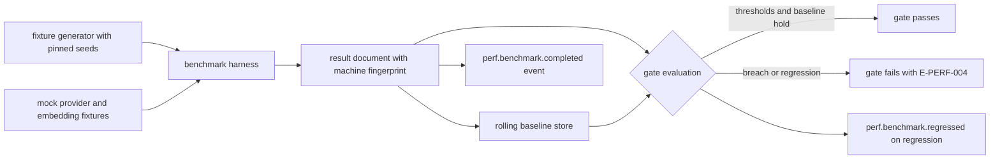

# 03 — Benchmarks and Operational Limits

Chapter 01 states what the product promises; this chapter defines how the promise is
measured (the benchmark suite and its regression gate) and where the runtime draws hard
lines (operational limits, including the scheduler pool budgets Volume 3, chapter 08
delegates to this volume). Together they close the loop: budgets are benchmarked, limits are
enforced, and both leave evidence.

## Benchmark suite

The benchmark suite is a first-class product artifact living in the monorepo (ADR-003),
composed of three layers ([ADR-161](../annexes/adr/ADR-161.md)):

1. **Micro-benchmarks** — Go benchmark functions (ADR-017 stack) for overhead-class metrics:
   scheduler submission, tool dispatch, streaming per-chunk overhead, memory retrieval,
   search. Compared across runs with the `benchstat` tool from the official Go performance
   tooling.
2. **Operation benchmarks** — a scripted harness driving the real `andromeda` binary for
   end-to-end metrics: cold/warm start, TUI startup, session restore, index build, git
   status. The harness owns cache purging, iteration control, and process accounting.
3. **Scenario benchmarks** — replayed interaction scripts (DS-SOAK, the NFR-PERF-020 load
   scenario, crash-injection populations) measuring latency distributions, resource ceilings,
   and stability over time.

Shared infrastructure: the **fixture generator** produces DS-M, DS-L, DS-F, DS-MEM, and the
DS-SOAK script deterministically from pinned seeds; the **mock provider** and mock embedding
fixtures isolate Andromeda overhead from model time; the **calibration step** verifies the
running machine qualifies as RM-1 or RM-2 under the chapter 01 equivalence rule and stamps
every result set with the machine fingerprint.

### Baselines and gating

- Every benchmark run produces a result document (raw samples, percentiles, fingerprint,
  dataset IDs, product version) stored as a CI artifact and summarized by a
  `perf.benchmark.completed` event.
- The **rolling baseline** for a benchmark is the median of its last 5 mainline nightly
  results on the same runner class and reference-machine designation.
- **Absolute gate:** at a release gate, any gated metric breaching its NFR minimum threshold
  fails the gate (E-PERF-004). Gated metrics and their phases are the chapter 01 and 02
  requirements.
- **Relative gate:** a p95 regression > 10% against the rolling baseline on a gated metric
  fails the same gate even when the absolute threshold still holds; a regression > 5% emits
  `perf.benchmark.regressed` as a warning and opens a tracked finding. This catches drift
  years before it eats the headroom.
- Noise control: gates compare like with like (same runner class, same fingerprint
  designation); a result from an uncalibrated machine is recorded but never gates
  (RISK-PERF-002).

**Prose for the diagram.** Deterministic fixtures and provider doubles feed the harness; the
harness produces a fingerprinted result document; gate evaluation compares the document
against both the absolute NFR minimum thresholds and the rolling baseline drawn from prior
mainline results of the same runner class. Passing results extend the baseline; breaches fail
the release gate with E-PERF-004; regressions above the warning band emit
`perf.benchmark.regressed`. The constraints the diagram encodes: no gating decision is ever
made against an uncalibrated environment, and every decision is reconstructible from stored
artifacts.

## Requirements

### FR-PERF-005 — Benchmark suite and regression gating

- Type: Functional
- Status: Draft
- Priority: P0
- Phase: MVP
- Source: Design
- Owner: Performance and Reliability (Volume 12)
- Affected components: benchmark harness, CI pipelines (Volume 11), all measured components
- Dependencies: ADR-160, ADR-161; ADR-013, ADR-017
- Related risks: RISK-PERF-001, RISK-PERF-002

#### Description

The repository MUST contain the three-layer benchmark suite of this chapter, runnable
locally with one documented command and in CI. From MVP, the suite MUST measure every
chapter 01 metric nightly on mainline and at every release, storing fingerprinted result
documents as artifacts. From the phase at which a metric gates (per its NFR), releases MUST
be blocked on the absolute and relative gates of this chapter. Benchmark code, fixtures, and
the gate evaluator are versioned with the product; a change that alters a benchmark's
measured population MUST reset that benchmark's rolling baseline explicitly.

#### Motivation

Volume 1's metric governance requires measurement from MVP so trends exist before gates
bind. An unmeasured budget is a wish; a budget measured by an unversioned script is a
different wish.

#### Actors

Contributors running the suite locally; CI; release managers reading gate reports.

#### Preconditions

Fixture generator and provider doubles implemented; a calibrated RM-1/RM-2 environment
available for gating runs.

#### Main flow

1. Nightly CI runs the suite on calibrated runners; results store and extend baselines.
2. A release build runs the gated subset; the gate evaluator compares against thresholds
   and baselines.
3. The release proceeds only on a passing gate report, which ships with the release
   artifacts (Volume 14 packaging).

#### Alternative flows

- Local run: a contributor runs the suite (or one benchmark) against their machine; results
  are labeled uncalibrated unless calibration passes, and never gate.

#### Edge cases

- Runner environment drift (hardware refresh in CI): calibration fails, gating runs halt
  with an environment error rather than gating against a changed machine; the baseline
  resets when the new environment is accepted (recorded decision).
- Flaky benchmark (bimodal results): a benchmark whose coefficient of variation exceeds the
  harness bound (10% on gated metrics) is quarantined from relative gating and tracked as a
  defect — noisy gates are worse than no gates.
- Baseline store empty (first runs): absolute gates apply alone until 5 results exist.

#### Inputs

Fixtures; runner fingerprints; NFR thresholds; baseline store.

#### Outputs

Result artifacts; gate reports; `perf.benchmark.completed` / `perf.benchmark.regressed`
events; E-PERF-004 on gate failure.

#### States

None — the suite is tooling; no entity machines.

#### Errors

E-PERF-004 (regression gate failure); environment/calibration failures reported as harness
errors distinct from measurement results.

#### Constraints

The suite MUST run without network access except where the measured operation is itself
network-bound (none of the gated metrics are, by the provider-isolation rule); benchmark
runs never use real provider credentials.

#### Security

Fixtures contain no real user data or secrets; result documents carry machine fingerprints
only (no usernames, no paths outside the fixture root), safe under Volume 10 redaction.

#### Observability

Every run evented with results reference; gate decisions logged with the exact thresholds
and baselines applied.

#### Performance

The gated subset MUST complete within 2 hours on a calibrated runner, excluding the 8-hour
soak, which runs on its own weekly and release cadence.

#### Compatibility

The suite runs on all Tier 1 platforms; per-platform results gate independently (a
regression on Linux is not masked by headroom on macOS).

#### Acceptance criteria

- Given a mainline commit, when nightly CI completes, then a fingerprinted result document
  exists for every chapter 01 metric and baselines are extended.
- Given a release candidate with a gated metric over its minimum threshold, when the gate
  evaluates, then the release is blocked with E-PERF-004 naming the metric, measured value,
  and threshold.
- Given a 12% p95 regression within absolute thresholds, when the gate evaluates, then the
  release is blocked by the relative gate; given 7%, then `perf.benchmark.regressed` is
  emitted and a finding is opened without blocking.
- Negative case: given results from an uncalibrated machine, when gating runs, then those
  results are excluded and the gate report says so.

#### Verification method

Self-test of the gate evaluator with synthetic result sets (breach, regression, warning
band, uncalibrated exclusion); CI configuration review per Volume 11; presence and
completeness of result artifacts audited at each release.

#### Traceability

PRD-013; ADR-160, ADR-161; Volume 1 metric governance; NFR-PERF-001 through NFR-PERF-028.

### FR-PERF-006 — Operational limits enforcement

- Type: Functional
- Status: Draft
- Priority: P0
- Phase: MVP
- Source: Design
- Owner: Performance and Reliability (Volume 12)
- Affected components: Runtime, Task Scheduler, Tool Runtime, Indexing Engine, Plugin Runtime, MCP Runtime, TUI
- Dependencies: FR-PERF-002, FR-PERF-004; ADR-020, ADR-023
- Related risks: RISK-PERF-004

#### Description

The runtime MUST enforce the operational limits of this chapter's tables using exactly four
enforcement classes: **refuse** (reject the operation with E-PERF-002 before side effects),
**truncate** (bound the data with an explicit truncation marker, never silently),
**virtualize/narrow** (serve a bounded window or scope), and **shed/queue** (apply the pool
policy per FR-PERF-002). Every enforcement MUST emit `perf.limit.enforced` with the limit
identifier and the values involved. Limit values in these tables are normative defaults;
where a limit is user-configurable, its key is minted by the owning area in its own TOML
table (Volume 0, chapter 03 ownership) with this chapter's value as the default, and
overrides are bounded by the stated range. Limits without a named key are fixed at MVP.

#### Motivation

Budgets fail at edges: the 2 GiB tool output, the 400,000-file monorepo, the 60-plugin
install. Explicit limits with declared behavior convert those edges from undefined behavior
into specified, observable outcomes.

#### Actors

Runtime components enforcing; users and extensions hitting limits; automation reading
structured refusals.

#### Preconditions

Limits registered at composition; watchdog running for resource-class limits.

#### Main flow

1. An operation approaches a limit; the enforcement class applies.
2. `perf.limit.enforced` is emitted; the operation's outcome (refusal, truncated result,
   narrowed scope, queued execution) is reported structurally to the caller.

#### Alternative flows

- A configurable limit was raised by the user within bounds: the configured value enforces
  identically; the event carries the effective value and its source layer.

#### Edge cases

- Limits crossing mid-operation (output growing past the capture bound): truncation applies
  at the bound with the marker and byte counts; the operation itself continues to its own
  outcome.
- Competing limits (per-run and per-instance invocation caps): the stricter effective bound
  wins; the event names which one applied.
- Limit hit during recovery or shutdown: enforcement never blocks recovery/shutdown
  ordering; resource-class refusals apply only to new work.

#### Inputs

Limit registry; watchdog samples; operation descriptors.

#### Outputs

Structured refusals (E-PERF-002), marked truncations, narrowed scopes, enforcement events.

#### States

None new; affected entities record their normal outcomes.

#### Errors

E-PERF-002 (refusals); E-PERF-003 (resource floors, chapter 02); truncation is not an error
— it is a marked result property.

#### Constraints

No silent enforcement: an unmarked truncation or an unevented refusal is a defect. The four
enforcement classes are closed; new behavior requires amending this requirement.

#### Security

Limits are part of the containment story: output-capture bounds and child caps bound what a
misbehaving tool or plugin can force the host to hold; refusal-before-side-effects keeps
limit checks from becoming partial-write hazards.

#### Observability

`perf.limit.enforced` with limit ID, effective value, source, and correlation IDs;
per-limit enforcement counters as metrics.

#### Performance

Limit checks sit on hot paths and MUST stay within the overhead budgets of the operations
they guard (tool dispatch checks inside NFR-PERF-008, scheduler checks inside
NFR-PERF-020(b)).

#### Compatibility

Limits are platform-independent; storage-related values apply to whatever volume hosts the
directories per ADR-022.

#### Acceptance criteria

- Given a tool emitting 50 MiB of output, when the 10 MiB capture bound applies, then the
  result is truncated with an explicit marker and recorded byte counts, and
  `perf.limit.enforced` is emitted.
- Given a fifth concurrent run request at the default cap of 4, when submitted, then it is
  refused with E-PERF-002 naming the limit, and the CLI maps the refusal to exit code 1
  with the structured error on the JSON surface.
- Given a workspace exceeding 200,000 files, when indexing starts, then scope narrows per
  the limit with `perf.limit.enforced`, and interactive latency requirements still hold
  (NFR-PERF-021).
- Negative case: given a configured override outside a limit's bounded range, when
  configuration loads, then validation fails per the owning volume's rules — out-of-range
  limits never reach enforcement.

#### Verification method

Per-limit conformance fixtures (each limit driven to enforcement and asserted on behavior
class, marker, event, and error); hot-path overhead measured inside the owning benchmarks;
configuration-bound tests per owning volumes.

#### Traceability

PRD-005, PRD-006; ADR-020, ADR-023; FR-PERF-002, FR-PERF-004; NFR-PERF-008, NFR-PERF-020,
NFR-PERF-021.

## Operational limits

### Runtime limits

| Limit (identifier) | Default | Enforcement class | Configurable key owner |
|---|---|---|---|
| Concurrent runs per instance (`runs_per_instance`) | 4 (RM-1 class), 2 (RM-2 class) | refuse (E-PERF-002) | Volume 4 (`[agent]`) |
| Concurrent tool invocations per run (`tool_calls_per_run`) | 8 | shed/queue (`tools` pool) | Volume 4 (`[agent]`) |
| Concurrent tool invocations per instance (`tool_calls_per_instance`) | 16 | shed/queue (`tools` pool) | Volume 6 (`[tools]`) |
| Tool output capture per invocation (`tool_output_capture`) | 10 MiB | truncate with marker | Volume 6 (`[tools]`) |
| Patch applied atomically (`patch_size`) | 10 MiB or 10,000 hunks | refuse (E-PERF-002) | fixed at MVP |
| Diff lines rendered without virtualization (`diff_virtualize_lines`) | 5,000 | virtualize/narrow | Volume 8 (`[tui]`) |
| Active plugins (`plugins_active`) | 32 | refuse (E-PERF-002) | Volume 6 (`[plugins]`) |
| MCP client connections (`mcp_connections`) | 16 | refuse (E-PERF-002) | Volume 6 (`[mcp]`) |
| Event subscriber buffer (`event_buffer`) | 1,024 events | shed per family policy (Volume 10) | Volume 10 |
| Semantic index chunks per workspace (`semantic_chunks`) | 100,000 (ADR-020 ceiling) | refuse further semantic additions (E-PERF-002) | Volume 7 (`[index]`) |
| Files indexed per workspace (`index_files`) | 200,000 | virtualize/narrow (scope) | Volume 7 (`[index]`) |

Bounded ranges for the configurable rows are defined by their key owners with this table's
values as defaults; the context-ingestion file threshold and tool-result context bounds are
Volume 7's and are deliberately absent here (single-home rule).

### Scheduler pool budgets

These are the pool sizes, queue bounds, and saturation policies for the named pools of
Volume 3, chapter 08 (`cores` = logical CPUs at start; values are fixed at MVP):

| Pool | Workers | Queue bound | Saturation policy |
|---|---|---|---|
| `interactive` | min(2 × cores, 16) | 64 | block-with-deadline 5 s |
| `tools` | min(2 × cores, 16) | 32 | block-with-deadline 10 s |
| `background` | max(2, cores / 2), capped at 8 | 128 | reject with E-ARCH-005 |
| `io` | min(cores, 8) | 256 | block-with-deadline 1 s |

### Resource thresholds (watchdog)

| Threshold (identifier) | Enter | Exit (hysteresis) | Consequence |
|---|---|---|---|
| Free-disk floor (`disk_floor`) | < 500 MB free on any state volume | > 750 MB | `low_disk` mode; new runs refused (E-PERF-003) |
| RSS high-water (`memory_highwater`) | > 1,024 MiB main-process RSS | < 768 MiB | `low_memory` mode; caches shed, background paused |
| Workspace database size (`db_size_warn`) | > 2 GiB | n/a (warning only) | warning event and retention recommendation |

## Events

Event names minted by this volume (envelope, delivery, persistence, and retention per
Volume 10 — referenced, not restated):

| Event | Emitted when | Payload summary | Primary consumers |
|---|---|---|---|
| `perf.budget.exceeded` | Instrumented operation exceeds its declared budget by > 2× in a running instance | operation class, budget, measured value, correlation IDs | Observability, diagnostics |
| `perf.limit.enforced` | Any operational-limit enforcement | limit ID, class, effective value, source layer | Observability, TUI status, automation |
| `perf.overload.shed` | Shedding action under saturation (FR-PERF-002) | pool, policy, counts | Observability, diagnostics |
| `perf.degradation.entered` | Degraded-mode entry (FR-PERF-003) | mode, cause, trigger sample | TUI/CLI indicators, Observability |
| `perf.degradation.exited` | Degraded-mode exit | mode, duration | TUI/CLI indicators, Observability |
| `perf.benchmark.completed` | Benchmark run finished | suite subset, result reference, fingerprint | CI, baseline store |
| `perf.benchmark.regressed` | Relative gate warning or failure | benchmark, baseline, measured value, band | CI, release gating |

## Risks

### RISK-PERF-002 — Benchmark environment variance masks or fakes regressions

- Category: Process / technical
- Probability: High
- Impact: Medium
- Severity: High
- Mitigation: Calibration step with the ±10% equivalence rule before any gating run; like-with-like baseline comparison (same runner class and fingerprint designation); coefficient-of-variation quarantine for noisy benchmarks; uncalibrated results excluded from gates; the dedicated-runner question tracked as an open question until resolved
- Detection: Calibration failures logged in CI; baseline variance monitoring; quarantine list reviewed at each release
- Owner: Performance and Reliability (Volume 12)
- Status: Open

Shared CI runners vary in CPU generation, storage, and noisy neighbors; a 10% relative gate
is meaningless on a 30%-noise environment. The design treats environment identity as part of
the measurement: no calibration, no gate — and whether hosted runners can be calibrated at
all, or a dedicated runner is required, is PENDING VALIDATION (open questions,
[99-volume-register.md](99-volume-register.md)).

### RISK-PERF-004 — Real workspaces exceed declared limits

- Category: Product / technical
- Probability: Medium
- Impact: Medium
- Severity: Medium
- Mitigation: Limits chosen with headroom over the DS-L dataset (2× on files indexed); enforcement classes keep over-limit workspaces usable (narrowed scope, virtualization) rather than failing; configurable rows let power users raise bounds within ranges; enforcement counters reveal real-world limit pressure so limits are retuned from evidence at each phase gate
- Detection: `perf.limit.enforced` frequency in field diagnostics of consenting installations; issue reports tagged against limit identifiers
- Owner: Performance and Reliability (Volume 12)
- Status: Open

Monorepos larger than DS-L exist and their owners are exactly the users an engineering
harness courts. The limit design therefore degrades scope, not function: a 500,000-file
workspace still works with explicit narrowing, and the evidence trail says how often that
happens so the ceiling can be raised deliberately, not reactively.

## Error codes

### E-PERF-001 — Performance budget exceeded

- Category: Diagnostic
- Severity: Warning
- User message: "An internal operation is running slower than its budget; functionality is unaffected."
- Technical message: operation class, declared budget, measured value, sample context (dataset scale, active degraded modes)
- Cause: an instrumented operation exceeded its declared chapter 01 budget by more than 2× in a running instance (self-measurement, not the benchmark harness)
- Safe-to-log data: operation class, numeric budget and measurement, mode identifiers, correlation ID
- Recoverability: informational — the operation completed; recurrence indicates a defect or an environment below reference class
- Retry policy: not applicable
- Recommended action: none for users on first occurrence; recurrent emissions warrant a diagnostic report (the doctor surface aggregates them)
- Exit-code mapping: none (never fails an operation)
- HTTP mapping: not applicable
- Telemetry event: `perf.budget.exceeded`
- Security implications: none; payload carries measurements only, under Volume 10 redaction

### E-PERF-002 — Operational limit exceeded

- Category: Capacity
- Severity: Error
- User message: "The operation exceeds a limit: <limit> (requested <value>, maximum <bound>)."
- Technical message: limit identifier, effective bound and its source layer, requested value, enforcement class
- Cause: an operation would exceed a refuse-class operational limit of this chapter
- Safe-to-log data: limit identifier, numeric values, source layer, correlation ID
- Recoverability: recoverable — reduce the request, or raise the bound where a configurable key exists (within its range)
- Retry policy: not automatically retried; deterministic until inputs or configuration change
- Recommended action: the diagnostic names the limit and, where configurable, its key and owning table
- Exit-code mapping: 1 when it fails a foreground command; 6 when surfaced as a tool invocation failure
- HTTP mapping: not applicable
- Telemetry event: `perf.limit.enforced`
- Security implications: refusal occurs before side effects; limits cannot be bypassed by retry loops (the bound is stateless and deterministic)

### E-PERF-004 — Benchmark regression gate failure

- Category: Quality gate
- Severity: Error
- User message: "Release gate failed: benchmark <name> regressed beyond the permitted band."
- Technical message: benchmark ID, gated NFR, measured percentile value, absolute threshold, rolling baseline, band applied, runner fingerprint
- Cause: a gated metric breached its NFR minimum threshold, or regressed > 10% p95 against the rolling baseline, at a release gate (FR-PERF-005)
- Safe-to-log data: all technical-message fields (benchmark data contains no user content)
- Recoverability: recoverable — fix the regression, or supersede the target through the Volume 0 change procedure (a recorded decision, never a silent gate edit)
- Retry policy: re-run permitted only to confirm reproducibility; two consecutive failing runs confirm the failure
- Recommended action: profile the named operation against the prior release; attach the two result documents to the finding
- Exit-code mapping: 1 (benchmark harness process); not applicable at the product CLI
- HTTP mapping: not applicable
- Telemetry event: `perf.benchmark.regressed`
- Security implications: gate evaluation runs in CI without production credentials; result artifacts are public-safe by construction
