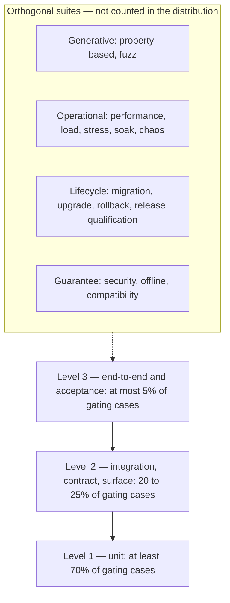

# 01 — Test Strategy and Pyramid

This chapter defines how Andromeda is verified: strategy principles, the pyramid governing
where tests live, the execution tiers governing when they run, and the traceability
discipline binding tests to requirements. Test types are cataloged in
[chapter 02](02-test-types-catalog.md); infrastructure in
[chapter 03](03-fixtures-fakes-determinism.md); gates and release qualification in
[chapter 04](04-release-qualification-and-gates.md).

## Strategy principles

1. **Tests are the corpus's verification instrument.** Where a requirement's verification
   method is automated, it MUST resolve to chapter 02 test types and to annotated tests per
   FR-TEST-002.
2. **One runner.** All tests execute under `go test` (ADR-017); bespoke runners and suite
   DSLs are prohibited.
3. **Deterministic and offline by default.** Gating tests MUST be deterministic
   (FR-TEST-007) and MUST NOT touch the network; network-using tests run only in scheduled
   non-gating lanes (ADR-176) or the explicitly network-scoped suites of chapter 02.
4. **Ports are the seams.** The hexagonal architecture (ADR-030) makes engines testable
   against fakes of the 18 frozen ports (Volume 3, chapter 02) and adapters testable against
   contract kits (FR-TEST-004). Tests MUST NOT reach through a port boundary into private
   internals.
5. **Tests are product code.** Same formatting/lint rules (ADR-018), same review process
   (Volume 11); test-only dependencies stay test-only (ADR-017).
6. **Evidence over recollection.** A gate that ran leaves machine-readable evidence
   (chapter 04); an unmeasured quality claim counts as unmeasured (Volume 1, chapter 06
   metric governance).

## Suite tiers and execution triggers

Every suite belongs to exactly one tier; membership per type is fixed in chapter 02.

| Tier | Trigger | Contents (summary) | Blocking effect |
|---|---|---|---|
| T0 — merge gate | Every pull request | Format/lint/compile (Volume 11), unit, integration, contract kits, golden/snapshot, CLI, permission, sandbox, regression, smoke subset, coverage floor, secret scan, quarantine/classification/traceability checks | Blocks merge |
| T1 — trunk | Every merge to trunk | T0 plus full E2E, full TUI matrix, offline suite (Linux), fuzz corpus replay, migration | Blocks release-branch creation; failures are P0 |
| T2 — scheduled | Nightly / weekly | Determinism lane, extended fuzz, mutation (ADR-175), live provider lanes (ADR-176), MCP interop, performance trend, load/stress/soak, chaos, quarantine lane (ADR-177) | Files issues; feeds phase gates via trends |
| T3 — release qualification | Every release candidate | Chapter 04 pipeline | Blocks publication |
| T4 — phase gate | MVP/Beta/v1 exit | T3 plus distribution report, mutation thresholds, requirement-coverage scan, metric audit | Blocks phase exit |

## The test pyramid

The diagram shows three gating levels and four orthogonal families. Level 1 (unit) is the
base: in-process tests with fakes at port boundaries, milliseconds each. Level 2 covers
integration and contract tests crossing real local infrastructure (SQLite, filesystem,
system git) or contract kits, plus the surface suites (CLI, TUI, git, sandbox, permission).
Level 3 is the thin top: journeys and acceptance tests driving the compiled binary. The
orthogonal families (dashed edge) attach to all levels but are excluded from distribution
arithmetic because their case counts are budget-driven (fuzz time, benchmark iterations),
not design-driven. The arrows encode the placement direction: defects caught high gain a
lower-level reproduction where expressible (FR-TEST-001).

## Requirements

### FR-TEST-001 — Test pyramid and suite organization

- Type: Functional
- Status: Approved
- Priority: P0
- Phase: MVP
- Source: Provided
- Owner: Testing and quality (Volume 13)
- Affected components: all components; CI pipelines (Volume 11)
- Dependencies: ADR-017, ADR-030; chapter 02 catalog
- Related risks: RISK-TEST-001

#### Description

Gating tests are organized as the three-level pyramid above. Distribution constraint:
Level 1 ≥ 70%, Level 2 between 20% and 25%, Level 3 ≤ 5% of gating cases. Placement rules:
(1) new behavior is verified at the lowest level that can express it; (2) Level 2 only where
behavior crosses a component boundary through real infrastructure or a contract kit;
(3) Level 3 only for user-visible journeys (Volume 1, chapter 03); (4) defects found at
Level 2/3 gain a Level 1 reproduction where expressible. Merge-gate budgets: Level 1
≤ 5 minutes, Level 2 ≤ 10 minutes, Level 3 subset ≤ 8 minutes (full Level 3 at T1). A
distribution report (cases and duration per level) is computed on every trunk run and
evaluated at T4.

#### Motivation

Unconstrained suites drift toward slow, coupled end-to-end tests (RISK-TEST-001), inflating
gate latency past NFR-TEST-001. MVP minimum item 24 requires the pyramid base explicitly.

#### Actors

Test authors; reviewers; CI pipelines; phase-gate auditors.

#### Preconditions

Chapter 02 catalog adopted; CI computes per-level counts and durations.

#### Main flow

1. A contributor writes tests at the lowest expressive level.
2. Review checks placement; CI executes T0/T1; the report updates.
3. T4 evaluates the report against the constraint.

#### Alternative flows

- Behavior only expressible end-to-end (signal handling of the compiled binary): the Level 3
  test carries a recorded placement justification; the aggregate constraint still applies.

#### Edge cases

- Table-driven tests count one case per executed subtest.
- Quarantined tests (ADR-177) are excluded from counts while quarantined; generated fuzz
  replays are orthogonal and never counted.

#### Inputs

Test sources with level markers (placement per chapter 02); CI timing data.

#### Outputs

Distribution report (JSON) stored as gate evidence.

#### States

Not applicable — repository artifact governance.

#### Errors

Distribution violations are T4 findings; report-generation failure is E-TEST-006.

#### Constraints

Budgets bind on the CI runner class pinned by Volume 11's pipelines; the aggregate budget is
NFR-TEST-001.

#### Security

None beyond test-code review discipline.

#### Observability

Report and per-suite durations published as CI artifacts; summarized in
`test.suite.completed` events (chapter 04).

#### Performance

Per-level budgets as stated.

#### Compatibility

Distribution computed on the Linux x86_64 lane; other Tier 1 platforms run the same suites
without separate accounting.

#### Acceptance criteria

- Given the trunk suite, when the report is generated, then the distribution and per-level
  budgets hold.
- Negative case: given a pull request adding a Level 3 test for Level 1-expressible
  behavior, when reviewed, then it is rejected or justified in the annotation.
- Negative case: given Level 3 at 8% of cases, when T4 evaluates, then the gate records a
  failing finding and blocks phase exit.
- Observability case: every trunk run leaves a distribution report referenced by its
  `test.suite.completed` event.

#### Verification method

Distribution report check at T4; CI duration metrics; review checklist.

#### Traceability

Volume 1 MVP minimum item 24; SM-14; RISK-TEST-001; NFR-TEST-001.

### FR-TEST-002 — Test-to-requirement traceability annotations

- Type: Functional
- Status: Approved
- Priority: P0
- Phase: MVP
- Source: Provided
- Owner: Testing and quality (Volume 13)
- Affected components: all components; CI pipelines (Volume 11)
- Dependencies: Volume 0 chapter 03 traceability chain; FR-TEST-001
- Related risks: RISK-TEST-002

#### Description

Every test serving as the verification of a corpus requirement MUST carry a machine-readable
annotation immediately above the test function: `// verifies: <ID>[, <ID>...]`, where each
`<ID>` is a corpus requirement (`FR-*`, `NFR-*`) or objective (`PRD-*`). A CI scanner
produces the requirement→test map consumed by Volume 11's traceability automation. Rules:
(1) every requirement whose verification method names an automated check has ≥ 1 annotated,
non-quarantined test by its phase gate; (2) annotations naming unknown identifiers fail the
scan; (3) deleting the last test verifying a requirement fails the scan unless the
requirement is `DEPRECATED`; (4) acceptance-suite tests are always annotated.

#### Motivation

The traceability chain (Volume 0, chapter 03) runs requirement → test → check → release;
its GitHub-side enforcement (Volume 11) needs a mechanical in-repo source for the
requirement→test edge.

#### Actors

Test authors; the scanner; Volume 11 automation; auditors.

#### Preconditions

The specification corpus is in the same monorepo (ADR-003) and available to CI.

#### Main flow

1. A contributor annotates the verifying test.
2. The scanner validates identifiers and updates the map artifact.
3. Phase gates check requirement coverage.

#### Alternative flows

- Requirements verified by non-automated methods (audit, review) are exempt from rule (1);
  the exemption list is generated from the corpus's verification-method fields.

#### Edge cases

- One test may verify several requirements and vice versa. Subtests inherit the parent
  annotation and MAY narrow it. Quarantined tests do not count toward rule (1).

#### Inputs

Test sources; the corpus; the phase requirement list.

#### Outputs

Requirement→test map (JSON); scan findings.

#### States

Not applicable.

#### Errors

Unknown identifier, uncovered requirement at gate, and lost-last-test findings fail the
scan; scanner malfunction is E-TEST-006.

#### Constraints

The annotation grammar is fixed here; extensions amend this requirement.

#### Security

The map is public repository data.

#### Observability

Scan results are CI artifacts; gate evaluations emit `test.gate.evaluated`.

#### Performance

Static analysis within the merge gate's lint allocation.

#### Compatibility

Plain Go comments; no build impact.

#### Acceptance criteria

- Given a test annotated `// verifies: FR-TEST-001`, when the scanner runs, then the map
  contains the edge.
- Error case: given an annotation naming a nonexistent identifier, when the scanner runs,
  then the scan fails with file, line, and identifier.
- Negative case: given an MVP-gated requirement with zero annotated tests, when T4
  evaluates, then the gate blocks with the uncovered requirement named.
- Error case: given an unparsable corpus checkout, when the scanner runs, then it fails with
  E-TEST-006 rather than emitting a partial map.
- Observability case: the map artifact is referenced from the evidence bundle.

#### Verification method

Scanner self-tests; gate-evaluation tests over synthetic corpora; T4 audit of the map.

#### Traceability

Volume 0 chapter 03; SM-13; Volume 11 traceability automation (by name); FR-TEST-009.

### NFR-TEST-001 — Merge-gate wall-clock budget

- Category: Maintainability
- Priority: P1
- Phase: MVP
- Metric: Wall-clock from pull-request head push to completion of all required T0 checks, p95 over a rolling 4-week window
- Target: ≤ 15 minutes p95
- Minimum threshold: ≤ 20 minutes p95
- Measurement method: CI per-run duration metrics aggregated weekly; runner-capacity queue time excluded and reported separately
- Test environment: CI runner class pinned by Volume 11's pipelines (Linux x86_64 lane governs)
- Measurement frequency: Weekly; evaluated at T4 phase gates
- Owner: Testing and quality (Volume 13)
- Dependencies: FR-TEST-001 per-level budgets; Volume 11 CI pipelines
- Risks: RISK-TEST-001
- Acceptance criteria: Weekly p95 within target; breaching the minimum threshold two consecutive weeks opens a P1 issue and blocks the next phase gate until restored (optimization, sharding per chapter 03, or recorded re-budgeting via the change procedure).

### NFR-TEST-002 — Suite determinism and order independence

- Category: Reliability
- Priority: P0
- Phase: MVP
- Metric: (a) Outcome consistency of unit and integration suites across 50 consecutive repeats with `go test -shuffle=on`; (b) count of order-dependent tests
- Target: (a) 100% identical outcomes; (b) 0
- Minimum threshold: Same as target — determinism has no tolerance band; violations route to quarantine (ADR-177), not a lowered bar
- Measurement method: Nightly determinism lane diffs outcome sets across repeat/shuffled runs; divergent tests flagged with seeds and logs
- Test environment: Linux x86_64 CI lane; macOS arm64 monthly cross-check
- Measurement frequency: Nightly; summarized at T4
- Owner: Testing and quality (Volume 13)
- Dependencies: FR-TEST-007; ADR-177
- Risks: RISK-TEST-002
- Acceptance criteria: Nightly lane reports zero divergent tests; any divergence produces a quarantine pull request within one working day and enters NFR-TEST-005 accounting.

## Risks

### RISK-TEST-001 — Pyramid inversion

- Category: Process / technical
- Probability: Medium
- Impact: High
- Severity: High
- Mitigation: FR-TEST-001 distribution constraint, per-level budgets, placement rules in review, T4 evaluation of the distribution report; NFR-TEST-001 keeps gate latency visible early
- Detection: Trunk distribution report trend; merge-gate duration trend
- Owner: Testing and quality (Volume 13)
- Status: Open

End-to-end tests are easiest to write against a working product and accrete until the gate
is slow and uninformative; the distribution constraint makes that drift measurable and
gate-blocking before it becomes structural.
